<properties
    pageTitle="Správa trezorů Azure zálohování a servery pomocí klasické nasazení modelu Azure | Microsoft Azure"
    description="Pomocí tohoto kurzu se dozvíte, jak spravovat trezorů Azure zálohování a servery."
    services="backup"
    documentationCenter=""
    authors="markgalioto"
    manager="jwhit"
    editor="tysonn"/>

<tags
    ms.service="backup"
    ms.workload="storage-backup-recovery"
    ms.tgt_pltfrm="na"
    ms.devlang="na"
    ms.topic="article"
    ms.date="09/27/2016"
    ms.author="jimpark;markgal"/>

# Správa trezorů Azure zálohování a servery pomocí klasické nasazení modelu

> [AZURE.SELECTOR]
- [Správce prostředků](backup-azure-manage-windows-server.md)
- [Klasický](backup-azure-manage-windows-server-classic.md)

V tomto článku najdete základní informace dostupné prostřednictvím portálu Azure klasické a Microsoft Azure záložní agent záložní správy úkolů.

[AZURE.INCLUDE [learn-about-deployment-models](../../includes/learn-about-deployment-models-classic-include.md)]Správce prostředků nasazení modelu.

## Správa portálu úkoly
1. Přihlaste se k [portálu Správa](https://manage.windowsazure.com).

2. Klikněte na **Obnovení služby**a potom klikněte na název záložního trezoru zobrazíte stránku rychlý Start.

    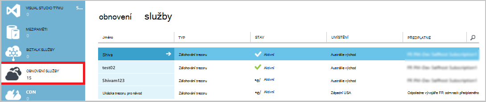

Můžete změnit výběrem možností v horní části stránky rychlý Start, zobrazí se úlohy správy k dispozici.

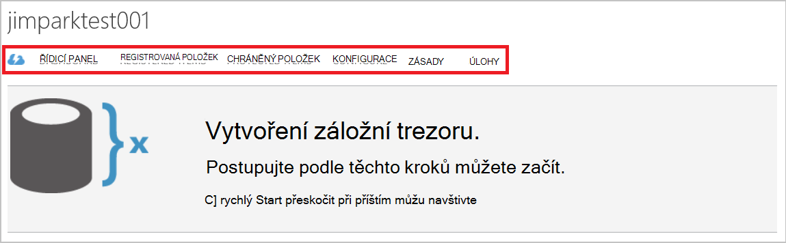

### Řídicí panel
Vyberte **řídicího panelu** zobrazíte přehled použití serveru. **Přehled použití** obsahuje:

- Počet servery Windows registrovaných do cloudu
- Počet Azure virtuálních počítačích chráněné v cloudu
- Celková velikost úložiště spotřebované množství v Azure
- Stav poslední úloh

V dolní části na řídicí panel můžete provádět následující úkoly:

- **Správa certifikátů** – Pokud certifikát byla použita k registraci serveru a pak slouží k aktualizaci certifikát. Pokud používáte trezoru přihlašovací údaje, nepoužívejte **Spravovat certifikát**.
- **Odstranění** - odstraní aktuální záložní trezoru. Pokud záložní trezoru už používá, můžete odstranit a uvolnit tak úložného prostoru. **Odstranění** povolen pouze po odstranění všech registrovaných serverech z trezoru.

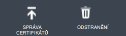

## Registrovaná položek
Vyberte **Registrované položky** zobrazit názvy serverů, které jsou registrované trezoru.

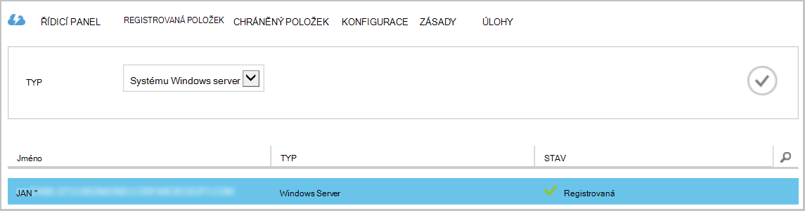

**Typ** filtru výchozí hodnoty pro Azure virtuálního počítače. Pokud chcete zobrazit názvy serverů, které jsou registrované trezoru, vyberte **systému Windows server** z rozevírací nabídky.

Tady můžete provádět následující úkoly:

- **Povolit nové registrace** - při zvolení této možnosti serveru můžete **Průvodce registrací** ve službě Microsoft Azure záložní agent místní registrace serveru s záložní trezoru podruhé. Možná budete muset znovu zaregistrujte kvůli chybě v certifikátu nebo pokud serveru musel znovu sestaví.
- **Odstranění** - odstraní serveru ze záložní trezoru. Uložená data spojená se serverem je odstraněny všechny okamžitě.

    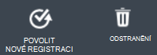

## Chráněný položek
Vyberte **Chráněné položky** zobrazit položky, které byly zálohovala ze serverů.

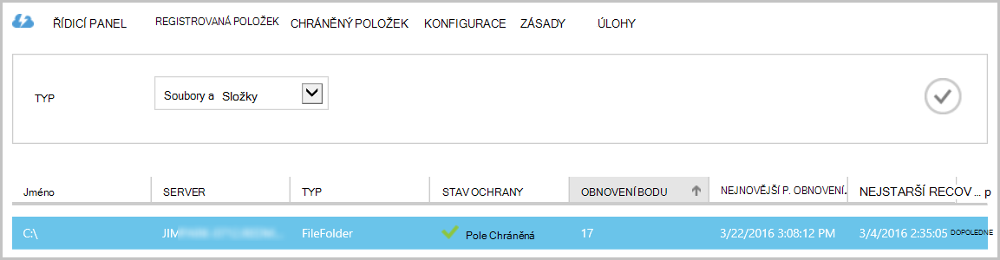

## Konfigurace

Na kartě **Konfigurovat** můžete vybrat možnost redundance odpovídající úložiště. Nejvhodnější doba k vyberte možnost redundance úložiště je nejlepší po vytvoření trezoru a před všech počítačích jsou registrované k němu.

>[AZURE.WARNING] Po registrované položky do trezoru, možnost redundance úložiště je uzamčený a nelze změnit.

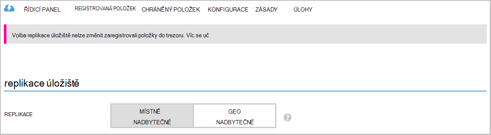

V tomto článku najdete další informace o [redundance úložiště](../storage/storage-redundancy.md).

## Microsoft Azure Backup agent úkoly

### Konzoly

Otevřete **Microsoft Azure Backup agent** (najdete ho vyhledáním počítači *Microsoft Azure Backup*).

Pomocí **Akce** dostupné na pravé straně konzole záložní agent je možné provádět následující úkoly správy:

- Registrace serveru
- Plán zálohování
- Obecnějším údajům
- Změna vlastností

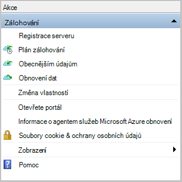

>[AZURE.NOTE] **Obnovení dat**najdete v článku [Obnovení souborů systému Windows server nebo Windows klientský počítač](backup-azure-restore-windows-server.md).

### Upravit existující zálohu

1. Ve službě Microsoft Azure Backup agent klikněte na **Naplánovat zálohu**.

    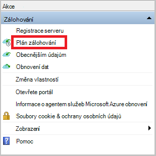

2. V **Plánu zálohováním** ponechte vybranou možnost **změny zálohování položek nebo časy** a klikněte na tlačítko **Další**.

    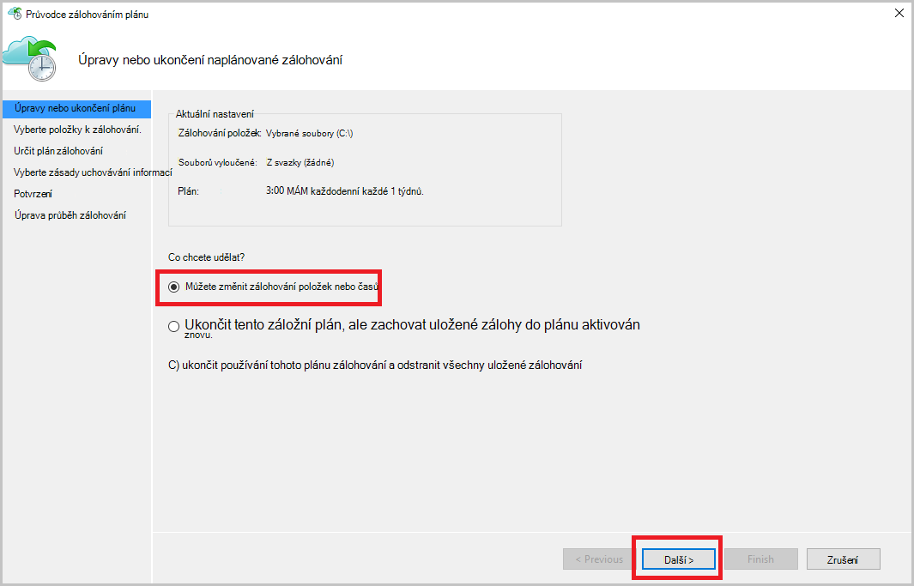

3. Pokud chcete přidat nebo změnit položky v dialogovém okně **Vybrat položky zálohování** , klikněte na **Přidat položky**.

    Můžete taky nastavení **Vyloučení** z této stránky v průvodci. Pokud chcete vyloučit soubory nebo typy souborů, přečtěte si postup pro přidání [vyloučení nastavení](#exclusion-settings).

4. Vyberte soubory a složky, které chcete zálohovat a klikněte na **OK**.

    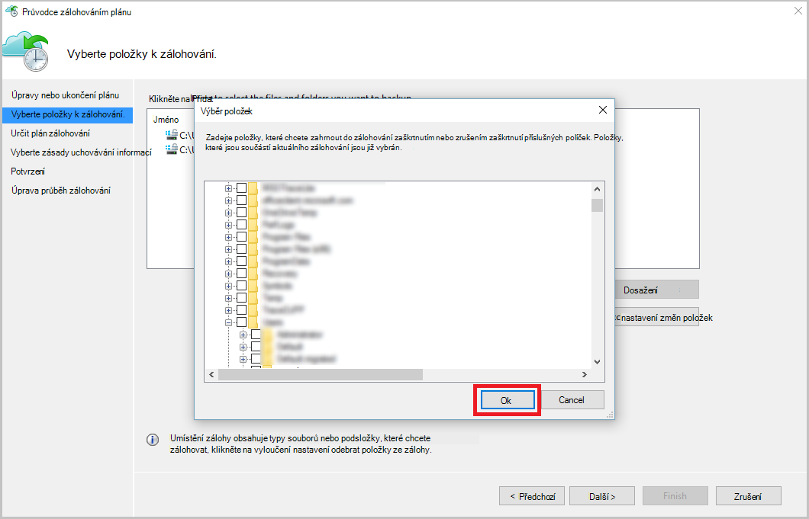

5. Určete **záložní plán** a klikněte na tlačítko **Další**.

    Můžou plánovat denně (na maximálně 3krát denně) nebo týdenní zálohy.

    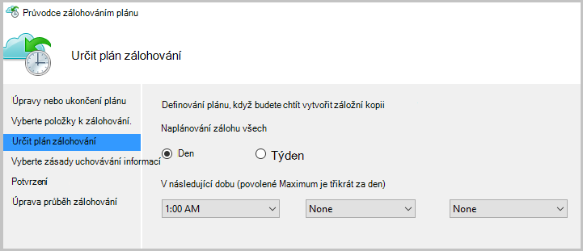

    >[AZURE.NOTE] Podrobně v tomto [článku](backup-azure-backup-cloud-as-tape.md)je vysvětleno určující plán zálohování.

6. Výběr **Zásad uchovávání informací** pro záložní kopie a klikněte na tlačítko **Další**.

    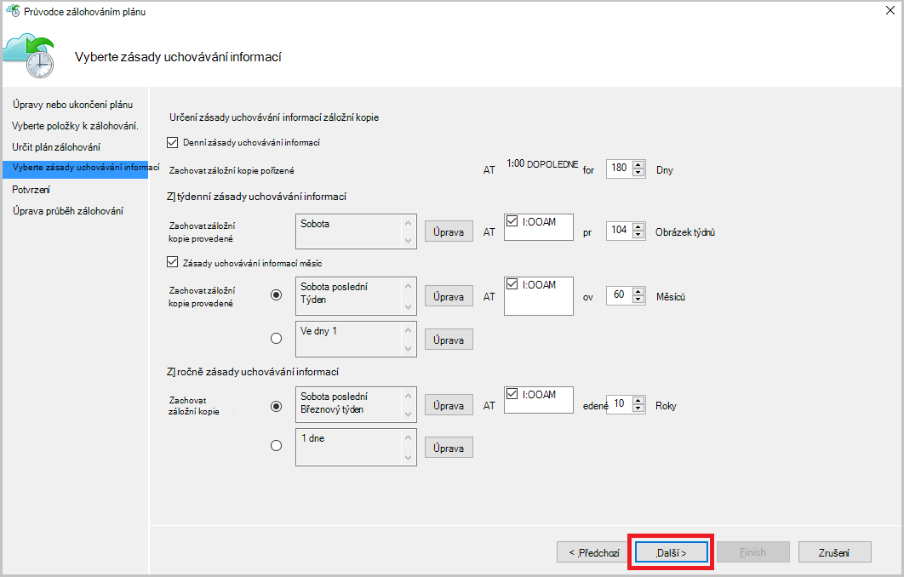

7. Na obrazovce pro **potvrzení** zkontrolujte informace a klepněte na tlačítko **Dokončit**.

8. Po dokončení Průvodce vytvořením **plánu zálohování**, klepněte na tlačítko **Zavřít**.

    Po úpravě ochranu, kde můžete potvrdit, že zálohování způsobují správně tak, že přejdete na kartu **úlohy** a potvrzení, že se změny projevily ve úlohy zálohování.

### Povolit omezení sítě  
Agent Azure zálohování poskytuje Throttling kartou, která umožňuje určit, jak se používá šířka pásma během převodu dat. Tento ovládací prvek může být užitečné v případě potřeby obecnějším údajům dat během pracovní dobu, ale nechcete, aby při zálohování rušit jiných internetový provoz. Omezení dat přenos platí pro zálohování a obnovení aktivity.  

Chcete-li povolit omezení:

1. **Zálohování agent**klikněte na **Změnit vlastnosti**.

2. Zaškrtněte políčko **Povolit využití šířky pásma Internetu omezení pro zálohování** .

    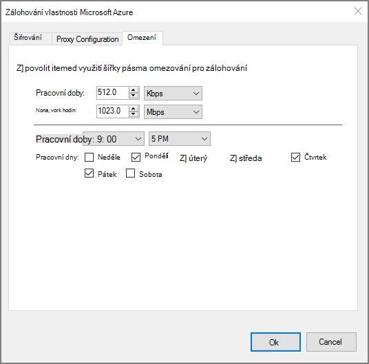

3. Po povolení omezení zadejte povolené šířku pásma pro přenos zálohování dat během **pracovní doby** a **nejsou pracovní doby**.

    Hodnoty šířky pásma začínala 512 kB sekundu (kb/s) a můžete přejít až 1023 megabajtů (MB /). Můžete taky určit zahájení a dokončení **pracovní doby**a které dny v týdnu jsou považovány za pracovních dnů. Čas mimo určený počet hodin práce se považuje za není pracovní doby.

4. Klikněte na **OK**.

## Nastavení vyloučených položek

1. Otevřete **Microsoft Azure Backup agent** (najdete ho vyhledáním počítači *Microsoft Azure Backup*).

    

2. Ve službě Microsoft Azure Backup agent klikněte na **Naplánovat zálohu**.

    

3. V Průvodci záložní plánu ponechte vybranou možnost **změny záložní položky nebo časy** a klikněte na tlačítko **Další**.

    

4. Klikněte na **vyloučení nastavení**.

    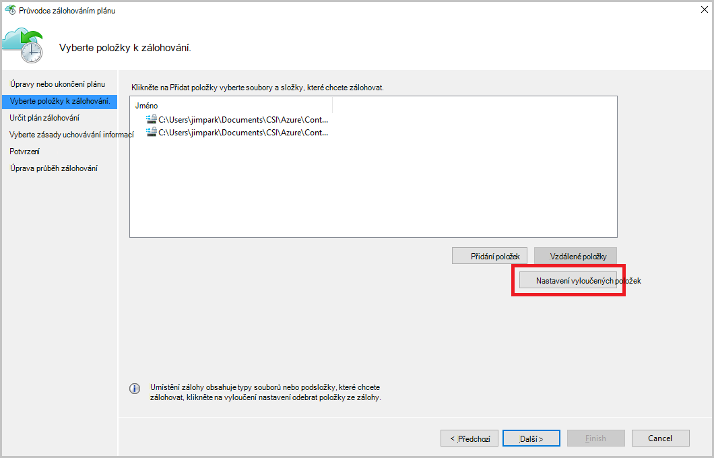

5. Klikněte na **Přidat vyloučených položek**.

    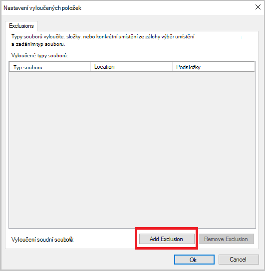

6. Vyberte umístění a potom klikněte na **OK**.

    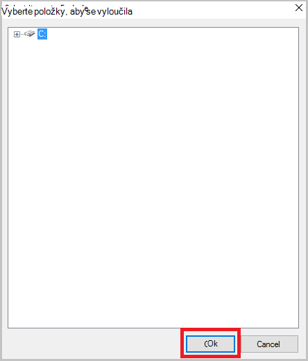

7. Přidání přípona souboru v poli **Typ souboru** .

    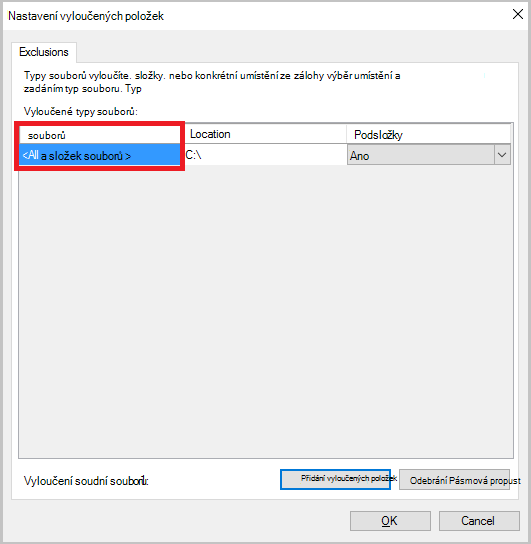

    Přidání příponu MP3

    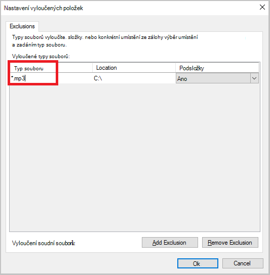

    Pokud chcete přidat jinou příponu, klikněte na možnost **Přidat vyloučení** a zadejte jiný soubor s příponou (Přidání rozšíření JPEG).

    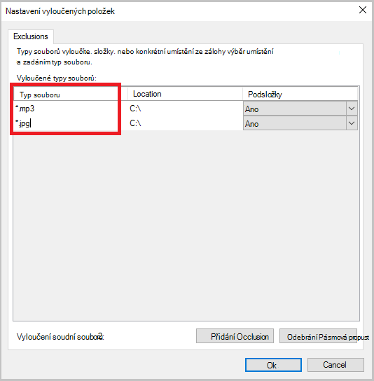

8. Po přidání všech rozšíření, klikněte na **OK**.

9. Pokračujte v Průvodci zálohování plánu po kliknutí na **Další** až ke **stránce pro potvrzení**klikněte na **Dokončit**.

    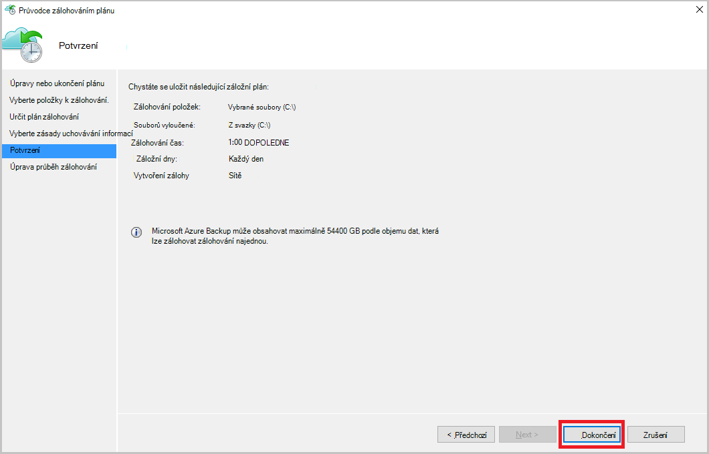

## Další kroky
- [Obnovení systému Windows Server nebo klienta Windows z Azure](backup-azure-restore-windows-server.md)
- Další informace o Azure zálohování najdete v tématu [Přehled zálohování Azure](backup-introduction-to-azure-backup.md)
- Navštivte [Fórum komunity Azure zálohování](http://go.microsoft.com/fwlink/p/?LinkId=290933)
