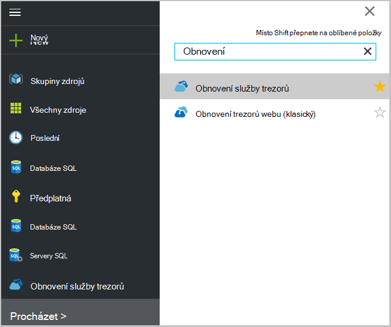
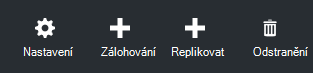
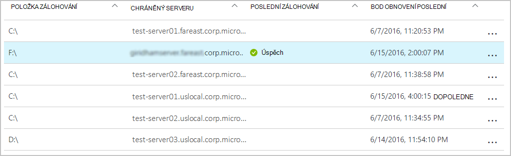
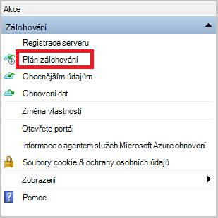

<properties
    pageTitle="Správa trezorů služby Azure obnovení a servery | Microsoft Azure"
    description="Pomocí tohoto kurzu se dozvíte, jak spravovat trezorů služby Azure obnovení a servery."
    services="backup"
    documentationCenter=""
    authors="markgalioto"
    manager="cfreeman"
    editor="tysonn"/>

<tags
    ms.service="backup"
    ms.workload="storage-backup-recovery"
    ms.tgt_pltfrm="na"
    ms.devlang="na"
    ms.topic="article"
    ms.date="10/19/2016"
    ms.author="jimpark; markgal"/>


# <a name="monitor-and-manage-azure-recovery-services-vaults-and-servers-for-windows-machines"></a>Sledování a správa trezorů služby Azure obnovení a servery u počítačů s Windows

> [AZURE.SELECTOR]
- [Správce prostředků](backup-azure-manage-windows-server.md)
- [Klasický](backup-azure-manage-windows-server-classic.md)

V tomto článku najdete přehled dostupné prostřednictvím portálu Azure a Microsoft Azure záložní agent záložní správy úkolů.

[AZURE.INCLUDE [learn-about-deployment-models](../../includes/learn-about-deployment-models-rm-include.md)]klasický nasazení modelu.

## <a name="management-portal-tasks"></a>Správa portálu úkoly

### <a name="access-your-recovery-services-vaults"></a>Přístup k obnovení služby trezorů

1. Přihlaste se na [Portál Azure](https://portal.azure.com/) pomocí předplatného Azure.

2. V nabídce centrální klikněte na tlačítko **Procházet** a v seznamu zdrojů, zadejte **Obnovení služby**. Jakmile začnete psát, bude filtrování seznamu na základě vašich zadání. Klikněte na **služby Recovery trezorů**.

     <br/>

2. Vyberte název, který chcete zobrazit v seznamu a otevře se zásuvné řídicího panelu služeb obnovení trezoru trezoru.

     <br/>

## <a name="monitor-jobs-and-alerts"></a>Sledování úloh a oznámení
Sledování projektů a upozornění na obnovení služby trezoru řídicím panelu, kde uvidíte:

- Podrobnosti o záložní upozornění
- Soubory a složkami, jakož i Azure virtuálních počítačích chráněné v cloudu
- Celková velikost úložiště spotřebované množství v Azure
- Stavu úloh zálohování


Kliknutím na položku informace v žádném z těchto dlaždice se otevře přidružená zásuvné, kde je spravován související úkoly.

V horní části řídicího panelu:

- Nastavení umožňuje přístup k dispozici úlohy zálohování.
- Zálohování – pomůže obecnějším údajům nové soubory a složky (nebo Azure VMs) do služby Recovery trezoru.
- Odstranit – Pokud trezoru služby obnovení už používá, můžete ho odstranit a uvolnit tak úložného prostoru. Odstranit je povolena pouze po odstranění všech chráněných serverech z trezoru.


## <a name="alerts-for-backups-using-azure-backup-agent"></a>Oznámení o záloh pomocí Azure záložní agent:
| Úroveň upozornění  | Zasílání upozornění |
| ------------- | ------------- |
| Kritický | Selhání zálohování, obnovení selhání  |
| Upozornění  | Zálohování bylo dokončeno s upozornění (když maximálně 100 souborů nejsou zálohovala kvůli problémům s poškozením a víc než jednoho milionu soubory úspěšně zálohují)  |
| Informační  | Žádná  |
## <a name="manage-backup-alerts"></a>Spravovat upozornění zálohování
Klikněte na dlaždici **Zálohování upozornění** otevřete zásuvné **Zálohování upozornění** a spravovat upozornění.


Dlaždice zálohování upozornění se zobrazí číslo:

- kritické upozornění nevyřešené posledních 24 hodin
- upozornění upozornění nevyřešené posledních 24 hodin

Po kliknutí na každý z těchto odkazů přejdete na zásuvné **Zálohování upozornění** s filtrované zobrazení těchto upozornění (kritické nebo upozornění).

Z zásuvné zálohování upozornění můžete:

- Zvolte příslušné informace má být součástí upozornění.

    

- Filtrování upozornění pro čas závažnosti, stav a začátek/konec.

    

- Konfigurace oznámení pro závažnosti, počet_plateb a příjemci, jakož i zapnutí nebo vypnutí upozornění.

    

Pokud **Za upozornění** je zúžený na požadovanou frekvenci **upozornění** žádné seskupování nebo snížení e-mailů opakuje. Každým upozorněním výsledkem 1 oznámení. Toto je ve výchozím nastavení a řešení e-mailu je také odesláno okamžitě.

Pokud je zúžený **Hodinové Digest** **upozornění** počet_plateb jeden e-mailu, jsou odeslány uživatel informací, že jsou nerozpoznaná nové upozornění generovaných za poslední hodinu E-mail s rozlišení je odesláno na konci hodinu.

Pro následující úrovně závažnosti odesílat upozornění:

- kritický
- upozornění
- informace

Deaktivace výstraha s tlačítko **deaktivovat** ve zásuvné podrobnosti projektu. Po klepnutí na tlačítko deaktivovat, můžete zadat rozlišení poznámky.

Vyberte sloupce, které se má zobrazit jako součást upozornění na tlačítko **Zvolit sloupce** .

>[AZURE.NOTE] Z zásuvné **Nastavení** spravovat záložní upozornění tak, že vyberete **sledování a sestavy > upozornění a událostí > záložní upozornění** a potom klikněte na **Filtr** nebo **Konfigurace oznámení**.

## <a name="manage-backup-items"></a>Správa zálohování položek
Správa místní zálohy je teď dostupná v portálu pro správu. V části zálohování řídicího panelu dlaždici **Zálohování položek** zobrazuje počet zálohování položek chráněné do trezoru.

Klikněte na **Složky souborů** v této dlaždici zálohování položek.


Zálohování položek zásuvné otevře s filtrem nastavení pro složku souborů tam, kde vidíte každý konkrétní zálohu položka v seznamu.



Pokud vyberete určité záložní položky ze seznamu, uvidíte důležité podrobnosti pro danou položku.

>[AZURE.NOTE] Na zásuvné **Nastavení** můžete spravovat soubory a složky tak, že vyberete **chráněné položky > Zálohování položek** následném vybrání **Složky souborů** z rozevírací nabídky.


## <a name="manage-backup-jobs"></a>Správa úloh zálohování
Zálohování úlohy pro obě místní (Pokud je místního serveru zálohování Azure) a Azure zálohy jsou viditelné v řídicím panelu.

V části zálohování řídicího panelu na dlaždici úlohy zálohování zobrazuje počet úlohy:

- v průběhu
- nejde za posledních 24 hodin.

Správa úloh zálohování, klikněte na dlaždici **Úlohy zálohování** , který se otevře zásuvné úlohy zálohování.


Upravte informace dostupné v zásuvné úlohy zálohování na tlačítko **Zvolit sloupců** v horní části stránky.

Umožňuje vybrat mezi souborů a složek a záložní Azure virtuálního počítače na tlačítko **Filtr** .

Pokud nevidíte zálohované soubory a složky, klikněte na tlačítko **Filtr** v horní části stránky a vyberte **soubory a složky** v nabídce Typ položky.

>[AZURE.NOTE] Na zásuvné **Nastavení** spravovat úlohy zálohování tak, že vyberete **sledování a sestavy > úlohy > úlohy zálohování** následném vybrání **Složky souborů** z rozevírací nabídky.

## <a name="monitor-backup-usage"></a>Sledovat použití zálohování
V části zálohování řídicího panelu zobrazit dlaždici zálohování využití úložiště spotřebované množství v Azure. Využití úložiště je k dispozici pro:
- Využití úložiště LRS přidružené trezoru v cloudu
- Využití úložiště GRS přidružené trezoru v cloudu

## <a name="production-servers"></a>Provozní servery
Ke správě provozní servery, klikněte na **Nastavení**. V části Spravovat klikněte na **zálohování infrastruktury > produkčních serverech**.

Seznamy provozní servery zásuvné všechny dostupné provozní servery. Klikněte na serveru, v seznamu a otevře se podrobnosti o server.


## <a name="microsoft-azure-backup-agent-tasks"></a>Microsoft Azure Backup agent úkoly

## <a name="open-the-backup-agent"></a>Otevřete záložní agent

Otevřete **Microsoft Azure Backup agent** (najdete ho vyhledáním počítači *Microsoft Azure Backup*).


**Akce** dostupné na pravé straně konzole záložní agent můžete provádět následující úkoly správy:

- Registrace serveru
- Plán zálohování
- Obecnějším údajům
- Změna vlastností


>[AZURE.NOTE] **Obnovení dat**najdete v článku [Obnovení souborů systému Windows server nebo Windows klientský počítač](backup-azure-restore-windows-server.md).

## <a name="modify-an-existing-backup"></a>Upravit existující zálohu

1. Ve službě Microsoft Azure Backup agent klikněte na **Naplánovat zálohu**.

    

2. V **Plánu zálohováním** ponechte vybranou možnost **změny zálohování položek nebo časy** a klikněte na tlačítko **Další**.

    

3. Pokud chcete přidat nebo změnit položky v dialogovém okně **Vybrat položky zálohování** , klikněte na **Přidat položky**.

    Můžete taky nastavení **Vyloučení** z této stránky v průvodci. Pokud chcete vyloučit soubory nebo typy souborů, přečtěte si postup pro přidání [vyloučení nastavení](#exclusion-settings).

4. Vyberte soubory a složky, které chcete zálohovat a klikněte na **OK**.

    

5. Určete **záložní plán** a klikněte na tlačítko **Další**.

    Můžou plánovat denně (na maximálně 3krát denně) nebo týdenní zálohy.

    

    >[AZURE.NOTE] Podrobně v tomto [článku](backup-azure-backup-cloud-as-tape.md)je vysvětleno určující plán zálohování.

6. Výběr **Zásad uchovávání informací** pro záložní kopie a klikněte na tlačítko **Další**.

    

7. Na obrazovce pro **potvrzení** zkontrolujte informace a klepněte na tlačítko **Dokončit**.

8. Po dokončení Průvodce vytvořením **plánu zálohování**, klepněte na tlačítko **Zavřít**.

    Po úpravě ochranu, kde můžete potvrdit, že zálohování způsobují správně tak, že přejdete na kartu **úlohy** a potvrzení, že se změny projevily ve úlohy zálohování.

## <a name="enable-network-throttling"></a>Povolit omezení sítě  
Agent Azure zálohování poskytuje Throttling kartou, která umožňuje určit, jak se používá šířka pásma během převodu dat. Tento ovládací prvek může být užitečné v případě potřeby obecnějším údajům dat během pracovní dobu, ale nechcete, aby při zálohování rušit jiných internetový provoz. Omezení dat přenos platí pro zálohování a obnovení aktivity.  

Chcete-li povolit omezení:

1. **Zálohování agent**klikněte na **Změnit vlastnosti**.

2. Na **omezení kartu, vyberte **povolte omezení pro záložní operace ** využití šířky pásma Internetu.

    

    Po povolení omezení zadejte povolené šířku pásma pro přenos zálohování dat během **pracovní doby** a **nejsou pracovní doby**.

    Hodnoty šířky pásma začínala 512 kB sekundu (kb/s) a můžete přejít až 1023 megabajtů (MB /). Můžete taky určit zahájení a dokončení **pracovní doby**a které dny v týdnu jsou považovány za pracovních dnů. Čas mimo určený počet hodin práce se považuje za není pracovní doby.

3. Klikněte na **OK**.

## <a name="manage-exclusion-settings"></a>Správa nastavení vyloučených položek

1. Otevřete **Microsoft Azure Backup agent** (najdete ho vyhledáním počítači *Microsoft Azure Backup*).

    

2. Ve službě Microsoft Azure Backup agent klikněte na **Naplánovat zálohu**.

    

3. V Průvodci záložní plánu ponechte vybranou možnost **změny záložní položky nebo časy** a klikněte na tlačítko **Další**.

    

4. Klikněte na **vyloučení nastavení**.

    

5. Klikněte na **Přidat vyloučených položek**.

    

6. Vyberte umístění a potom klikněte na **OK**.

    

7. Přidání přípona souboru v poli **Typ souboru** .

    

    Přidání příponu MP3

    

    Pokud chcete přidat jinou příponu, klikněte na možnost **Přidat vyloučení** a zadejte jiný soubor s příponou (Přidání rozšíření JPEG).

    

8. Po přidání všech rozšíření, klikněte na **OK**.

9. Pokračujte v Průvodci zálohování plánu po kliknutí na **Další** až ke **stránce pro potvrzení**klikněte na **Dokončit**.

    

## <a name="frequently-asked-questions"></a>Nejčastější dotazy
**Q1. Stavu úloh zálohování se zobrazí jako dokončený v Azure záložní agent, proč není ji získat projeví okamžitě portálu?**

A1. Tam se za zpoždění 15 minut mezi stavu úloh zálohování projeví v Azure zálohovací agent a portálu Azure.

**Q.2 selhání úlohy zálohování, jak dlouho trvá na vysokoškolskou úroveň oznámení?**

V rámci 20 minut Azure selhání zálohování je aktivována A.2 upozornění.

**Q3. Existuje případu kde e-mailu se neodešle Pokud nejsou nakonfigurováni oznámení?**

A3. Níže je případy, kdy oznámení neodešle ke snížení upozornění šum:

   - Pokud je hodinové nakonfigurováno oznámení a upozornění mocninu a přeložit do jedné hodiny
   - Práce se zruší.
   - Druhá úlohy zálohování nezdařila probíhá původní úlohy zálohování.

## <a name="troubleshooting-monitoring-issues"></a>Sledování problémů

**Problém:** Úlohy a/nebo upozornění z agenta Azure zálohování se nezobrazují na portálu.

**Návody na řešení potíží:** Proces, ```OBRecoveryServicesManagementAgent```, odešle data projektu a upozornění pro službu Azure zálohování. Někdy může stát se jejím tento proces zasekne nebo vypnutí.

1. Potvrďte není spuštěný proces otevření **Správce úloh** a zkontrolovat, zda ```OBRecoveryServicesManagementAgent``` je spuštěný proces.

2. Za předpokladu, že není spuštěný proces, otevřete **Ovládací panely** a projděte si seznam služeb. Spusťte nebo restartujte **Agent pro správu služby Microsoft Azure obnovení**.

    Další informace přejděte v protokolech na:<br/>
`<AzureBackup_agent_install_folder>\Microsoft Azure Recovery Services Agent\Temp\GatewayProvider*`. Příklad:<br/> `C:\Program Files\Microsoft Azure Recovery Services Agent\Temp\GatewayProvider0.errlog`.

## <a name="next-steps"></a>Další kroky
- [Obnovení systému Windows Server nebo klienta Windows z Azure](backup-azure-restore-windows-server.md)
- Další informace o Azure zálohování najdete v tématu [Přehled zálohování Azure](backup-introduction-to-azure-backup.md)
- Navštivte [Fórum komunity Azure zálohování](http://go.microsoft.com/fwlink/p/?LinkId=290933)
