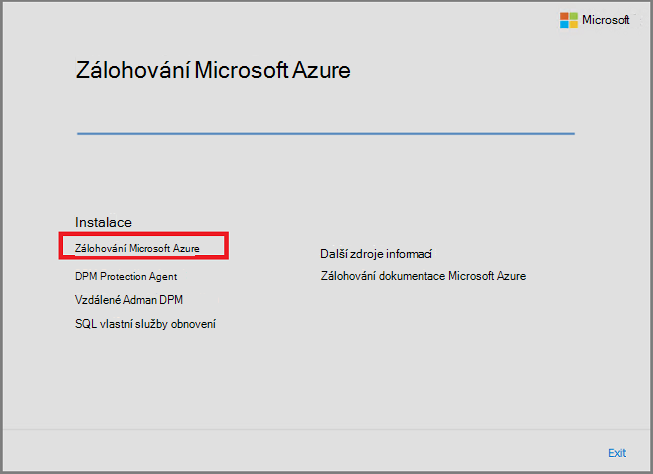
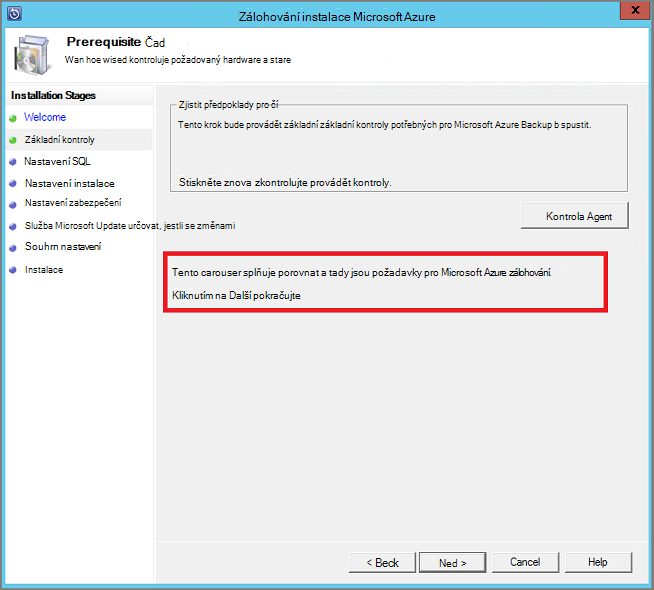
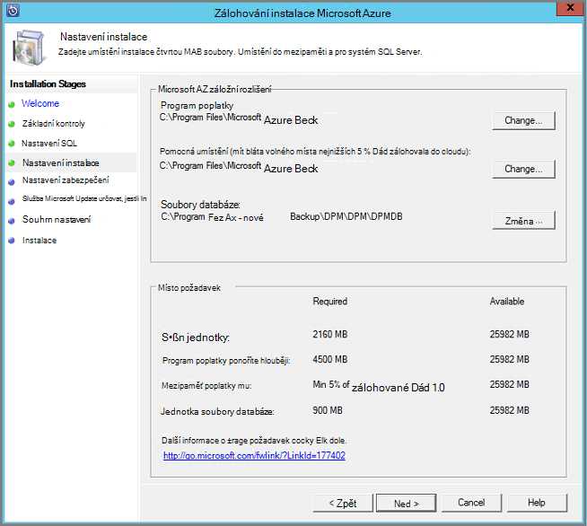

<properties
  pageTitle="Příprava prostředí k obecnějším údajům pracovního vytížení pomocí serveru Backup Azure | Microsoft Azure"
  description="Ujistěte se, že vaše prostředí správně připravené k obecnějším údajům pracovního vytížení pomocí serveru Backup Azure"
  services="backup"
  documentationCenter=""
  authors="pvrk"
  manager="shivamg"
  editor=""
  keywords="Azure záložní serveru. zálohování trezoru"/>

<tags
  ms.service="backup"
  ms.workload="storage-backup-recovery"
  ms.tgt_pltfrm="na"
  ms.devlang="na"
  ms.topic="article"
  ms.date="08/22/2016"
  ms.author="jimpark;trinadhk;pullabhk; markgal"/>

# <a name="preparing-to-back-up-workloads-using-azure-backup-server"></a>Příprava k obecnějším údajům pracovního vytížení pomocí serveru Backup Azure

> [AZURE.SELECTOR]
- [Server Azure zálohování](backup-azure-microsoft-azure-backup.md)
- [SCDPM](backup-azure-dpm-introduction.md)
- [Server Azure záložní (klasický)](backup-azure-microsoft-azure-backup-classic.md)
- [SCDPM (klasický)](backup-azure-dpm-introduction-classic.md)


Tento článek se zabývá přípravě prostředí k obecnějším údajům pracovního vytížení pomocí serveru Backup Azure. Zálohování serverem Azure můžete chránit úloh aplikace třeba VMs Hyper-V Microsoft SQL Server, serveru SharePoint Server, Microsoft Exchange a klienty Windows z jedné konzole.

>[AZURE.WARNING] Server Azure záložní dědí funkci Data Protection Manager (DPM) pro pracovní zátěž zálohování. Zjistíte, odkazy na DPM si přečtěte následující dokumentaci pro některé z těchto možností. Server Azure zálohování však není ochrany na páskou nebo integrace s System Center.

## <a name="1-windows-server-machine"></a>1. serveru Windows


První krok k zálohování Server Azure zprovoznění a spuštění má mít počítač systému Windows Server.

| Umístění | Minimální požadavky | Další pokyny |
| -------- | -------------------- | ----------------------- |
| Azure | Azure IaaS virtuálního počítače<br><br>A2 Standardní: 2 jádra 3,5 GB paměti RAM | Můžete začít s jednoduché Galerie aplikace Windows serveru 2012 R2 datacentra. [Ochrana IaaS úloh pomocí Azure zálohování serveru (DPM)](https://technet.microsoft.com/library/jj852163.aspx) obsahuje mnoho detailů. Ujistěte se, naleznete v článku úplně před nasazením počítače. |
| Místní | OM Hyper-V<br> VMWare OM<br> nebo pole fyzicky host<br><br>2 a 4GB paměti RAM jádra | Můžete deduplicate DPM úložiště pomocí Windows Server Deduplication. Další informace o [tom, jak DPM a deduplication](https://technet.microsoft.com/library/dn891438.aspx) spolupracují nasazené v Hyper-V VMs. |

> [AZURE.NOTE] Je vhodné nainstalované Server Azure zálohování na počítač s Windows serveru 2012 R2 Datacentra. Hodně předpoklady jsou automaticky zahrnuty v rámci nejnovější verze operačního systému Windows.

Pokud budete chtít připojit tento server domény nastane okamžik, doporučujeme provést aktivitu připojení domény před instalací Server Azure zálohování. Přesunutí existující počítače Server Azure zálohování na novou doménu po nasazení, *nejsou podporované*.

## <a name="2-backup-vault"></a>2. záložní trezoru


Zda odeslat záložních dat Azure nebo v jednoduchosti je místně, software, musí být připojená ke Azure. Je další konkrétní, v počítači záložní Server Azure musí registrovaný u záložní trezoru.

Vytvoření záložní trezoru:

1. Přihlaste se k [portálu Správa](http://manage.windowsazure.com/).

2. Klikněte na **Nový** > **datové služby** > **služby Recovery** > **záložní trezoru** > **vytvořit**. Pokud máte víc předplatných přidružený k účtu vaší organizace, vyberte správný předplatné chcete přidružit k zálohování trezoru.

3. Do pole **název**zadejte popisný název k identifikaci trezoru. To musí být jedinečné pro každého předplatného.

4. V **oblasti**vyberte zeměpisná oblast pro trezoru. Obvykle oblast trezoru vydán na základě dat svrchovanost nebo k síti latence omezení.

    

5. Klikněte na **vytvořit trezoru**. Může to trvat dlouho pro záložní trezoru vytvořit. Sledujte oznámení o stavu v dolní části na portálu.

    

6. Zobrazí se zpráva potvrzující úspěšné vytvoření trezoru a se zobrazí na stránce služby Recovery jako aktivní.
    

  > [AZURE.IMPORTANT] Ujistěte se, že zvolíte možnost redundance odpovídající úložiště vpravo po vytvoření trezoru. Další informace o [geo nadbytečné](../storage/storage-redundancy.md#geo-redundant-storage) a [místně nadbytečné](../storage/storage-redundancy.md#locally-redundant-storage) možnosti v tomto [Přehled](../storage/storage-redundancy.md).


## <a name="3-software-package"></a>3. balíček


### <a name="downloading-the-software-package"></a>Stáhnout balíček softwaru

Podobná trezoru přihlašovací údaje, můžete si stáhnout Microsoft Azure záložní pro aplikace úloh zálohování trezoru **Rychlé úvodní stránku** .

1. Klikněte na **aplikace úloh (k disků do cloudu)**. Tím přejdete na stránku webu služby Stažení softwaru ze kdy se dají Stáhnout balíček softwaru.

    

2. Klikněte na **Stáhnout**.

    

3. Vyberte všechny soubory a klikněte na tlačítko **Další**. Stáhnout všechny soubory přichází na stránku pro stažení Microsoft Azure zálohování a umístí všechny soubory ve stejné složce.


    Protože je velikost stahovaných všechny soubory společně > 3G, na 10 odkaz pro stažení, který může trvat až 60 minut ke stažení dokončete.


### <a name="extracting-the-software-package"></a>Extrahování balíček softwaru

Po stažení všechny soubory, klikněte na **MicrosoftAzureBackupInstaller.exe**. **Průvodce instalací aplikace Microsoft Azure zálohování** extrahujte soubory nastavení do umístění nastavil se bude vytvořena. Pokračujte v průvodci a klikněte na tlačítko **Vyjmout** k zahájení procesu extrahování.

> [AZURE.WARNING] K extrahovat instalačních souborů je potřeba minimálně 4GB volného místa.


Po extrakci zpracovat dokončeno, zaškrtněte políčko Spustit čerstvě extrahované *setup.exe* pro zahájení instalace Microsoft Azure zálohování serveru a klikněte na tlačítko **Dokončit** .

### <a name="installing-the-software-package"></a>Instalace softwaru balíčku

1. Klikněte na **Microsoft Azure zálohování** a spusťte Průvodce nastavením.

    

2. Na úvodní obrazovce klepněte na tlačítko **Další** . Tím přejdete do oddílu *Základní kontroluje* . Na této obrazovce klikněte na tlačítko **Zkontrolovat** a zjistit, pokud jsou splněny hardware a software požadavky pro Server Azure zálohování. Pokud jsou všechny předpoklady byly úspěšně splněné, zobrazí se zpráva oznamující, že je počítač splňuje požadavky na. Klikněte na tlačítko **Další** .

    

3. Microsoft Azure zálohování Server vyžaduje SQL Server Standard a instalační balíček Server Azure zálohování součástí skupinové potřeby binární soubory odpovídající SQL serveru. Když začnete s novou instalaci zálohovat Server Azure, by měl vyberte možnost **Instalovat nové Instance z SQL serveru pomocí tohoto nastavení** a klikněte na tlačítko **Zkontrolovat a nainstalovat** . Po úspěšném instalaci požadavky na tlačítko **Další**.

    

    Pokud dojde k selhání s doporučením restartování počítače, postupujte takto a klikněte na **Znovu zkontrolovat**.

    > [AZURE.NOTE] Server Azure zálohování nebude fungovat u vzdálené instance serveru SQL Server. Instance používán Azure zálohování serveru musí být místní.

4. Zadejte umístění instalace Microsoft Azure záložních souborů serveru a klikněte na tlačítko **Další**.

    

    Pomocné umístění je pro zálohování Azure povinné. Zkontrolujte, zda pomocné umístění alespoň na úrovni 5 % údaje o plánované zálohujete do cloudu. Při ochraně disku samostatných discích třeba nakonfigurovat po dokončení instalace. Další informace týkající se fondů úložiště, najdete v článku [Konfigurace úložiště fondů a místa na disku](https://technet.microsoft.com/library/hh758075.aspx).

5. Zadání silné heslo pro omezený místních uživatelských účtů a klikněte na tlačítko **Další**.

    

6. Vyberte, jestli chcete *Microsoft Update* umožňuje zkontrolovat aktualizace a klikněte na tlačítko **Další**.

    >[AZURE.NOTE] Doporučujeme, abyste museli přesměrování na Microsoft Update, který nabízí bezpečnostní a důležité aktualizace pro systém Windows a další produkty, jako třeba Microsoft Azure zálohování serveru Windows Update.

    

7. Zkontrolujte *Souhrnné informace o nastavení* a klikněte na tlačítko **nainstalovat**.

    

8. Instalace se stane v fáze. V první fázi agentem služeb Microsoft Azure obnovení nainstalovaný na serveru. Průvodce taky hledá připojení k Internetu. Pokud je k dispozici připojení k Internetu vy můžete pokračovat instalací, pokud ne, budete muset zadat proxy informace pro připojení k Internetu.

    Dalším krokem je třeba nakonfigurovat agentem služeb Microsoft Azure obnovení. V rámci konfiguraci budete muset zadat, že jste trezoru přihlašovací údaje k registraci připojení počítače k zálohování trezoru. Také poskytnete heslo k šifrování/dešifrování data odeslaná mezi Azure a vaše místní. Můžete automaticky generovat přístupové heslo nebo zadejte vlastní minimální heslo 16 znaků. Pokračujte v průvodci až nakonfiguroval agent.

    

9. Po úspěšném dokončení registrace serveru Microsoft Azure Backup celkového Průvodce nastavením pokračuje instalace a konfigurace systému SQL Server a součástí Server Azure zálohování. Po dokončení instalace součásti SQL serveru, Server Azure zálohování součásti.

    


Po dokončení instalace krok ikony na ploše produktu bude byly vytvořeny stejně. Poklepejte na ikonu pro spuštění produktu.

### <a name="add-backup-storage"></a>Přidání úložiště pro zálohování

První záložní kopii bude k dispozici úložný prostor připojené k počítači záložní Server Azure. Další informace o přidávání disků najdete v článku [Konfigurace úložiště fondů a místa na disku](https://technet.microsoft.com/library/hh758075.aspx).

> [AZURE.NOTE] Budete muset přidat úložišti, i když plánujete odeslání dat do Azure. V aktuálním architektura záložní Server Azure Azure záložní trezoru obsahuje *druhý* kopii dat během místní úložiště obsahuje záložní kopie první (a povinné).  

## <a name="4-network-connectivity"></a>4. připojení k síti


Server Azure zálohování vyžadují připojení pro službu Azure zálohování produktu nezdaří. Ověření, zda počítač má připojení k Azure, můžete ```Get-DPMCloudConnection``` PowerShell v konzole Powershellu Server Azure zálohování. Pokud je výstup PowerShell TRUE pak připojení existuje, jinak se ještě neexistuje žádná připojení.

Ve stejnou dobu musí být v pořádku stavu Azure předplatného. Zjistit, stav předplatného a spravovat ji, přihlaste se k [portálu předplatného]( https://account.windowsazure.com/Subscriptions).

Jakmile vědět o stavu Azure připojení a Azure předplatného můžete zjistit jejich dopad na funkci zálohování a obnovení nabízené následující tabulce.

| Stavu připojení | Azure předplatného | Zálohování Azure| Zálohování na disk | Obnovení z Azure | Obnovit z disku |
| -------- | ------- | --------------------- | ------------------- | --------------------------- | ----------------------- |
| Připojení | Aktivní | Povolené | Povolené | Povolené | Povolené |
| Připojení | Vypršela platnost | Přerušili | Přerušili | Povolené | Povolené |
| Připojení | Poskytování zrušeno | Přerušili | Přerušili | Ukazatel přestal a Azure obnovení odstraněné | Přerušili |
| Připojení ke ztrátě > 15 dní | Aktivní | Přerušili | Přerušili | Povolené | Povolené |
| Připojení ke ztrátě > 15 dní | Vypršela platnost | Přerušili | Přerušili | Povolené | Povolené |
| Připojení ke ztrátě > 15 dní | Poskytování zrušeno | Přerušili | Přerušili |  Ukazatel přestal a Azure obnovení odstraněné | Přerušili |

### <a name="recovering-from-loss-of-connectivity"></a>Obnovení před ztrátou připojení
Pokud používáte bránu firewall nebo proxy server, který brání přístup k Azure, musíte povolených následující adresy domény v profilu brány firewall/proxy serveru:

- www.msftncsi.com
- \*. Microsoft.com
- \*. WindowsAzure.com
- \*. microsoftonline.com
- \*. windows.net

Po obnovení připojení k Azure k počítači Server Azure zálohování operace, které lze provádět jsou určena stavu Azure předplatného. Výše uvedené tabulka obsahuje podrobnosti o operace povolené počítač po "připojení".

### <a name="handling-subscription-states"></a>Zpracování v USA předplatného

Je možné udělat předplatné Azure ze stavu *ukončenou platností* nebo *Deprovisioned* pro *aktivního* stavu. Ale to má vliv na některé na chování produktů při stavu není *aktivní*:

- Předplatné *Deprovisioned* dojde ke ztrátě funkčnosti období, které je poskytování zrušeno. Povolení *aktivní*, funkce produktu zálohování a obnovení obnovena. Zálohování dat na místním disku taky můžete načíst Pokud byla z tečkou dostatečně velký uchovávání informací. Však zálohování dat v Azure budou ztracena nenahraditelně po předplatné dostane *Deprovisioned* stavu.
- Předplatného s *ukončenou platností* pouze dojde ke ztrátě funkcí, dokud ho někdo připíše *aktivní* znovu. Všechny zálohování naplánovaná dobu, že jste předplatné *neplatné* se nespustí.


## <a name="troubleshooting"></a>Řešení potíží

Neúspěšné serveru Microsoft Azure zálohování s chybami při fáze instalace (nebo zálohování a obnovení), podívejte se na tento [dokument kódy chyb](https://support.microsoft.com/kb/3041338) pro další informace.
Můžete také odkazovat na [že nejčastější dotazy týkající se zálohování Azure](backup-azure-backup-faq.md)


## <a name="next-steps"></a>Další kroky

Podrobné informace o [přípravě prostředí pro DPM](https://technet.microsoft.com/library/hh758176.aspx) můžete získat na webu Microsoft TechNet. Obsahuje taky informace o podporovaných konfigurací, na kterých Server Azure zálohování nasazeném a použít.

Pomocí těchto článků můžete získat hlubší porozumění ochrany zátěží na projektu pomocí serveru Microsoft Azure zálohování.

- [Zálohování SQL serveru](backup-azure-backup-sql.md)
- [Zálohování serveru SharePoint](backup-azure-backup-sharepoint.md)
- [Zálohování alternativní serveru](backup-azure-alternate-dpm-server.md)
