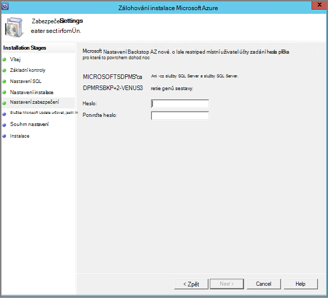

<properties
  pageTitle="Příprava prostředí k obecnějším údajům pracovního vytížení pomocí serveru Backup Azure | Microsoft Azure"
  description="Příprava prostředí Server Azure zálohování umožňuje chránit nebo obecnějším údajům úloh."
  services="backup"
  documentationCenter=""
  authors="PVRK"
  manager="shivamg"
  editor=""
  keywords="Azure záložní serveru. ochrana pracovního vytížení; obecnějším údajům úloh"/>

<tags
  ms.service="backup"
  ms.workload="storage-backup-recovery"
  ms.tgt_pltfrm="na"
  ms.devlang="na"
  ms.topic="article"
  ms.date="09/27/2016"
  ms.author="jimpark;trinadhk;pullabhk;markgal"/>

# <a name="preparing-to-back-up-workloads-using-azure-backup-server"></a>Příprava k obecnějším údajům pracovního vytížení pomocí serveru Backup Azure

> [AZURE.SELECTOR]
- [Server Azure zálohování](backup-azure-microsoft-azure-backup.md)
- [SCDPM](backup-azure-dpm-introduction.md)
- [Server Azure záložní (klasický)](backup-azure-microsoft-azure-backup-classic.md)
- [SCDPM (klasický)](backup-azure-dpm-introduction-classic.md)

Tento článek vysvětluje, jak připravit prostředí k obecnějším údajům pracovního vytížení pomocí serveru Backup Azure. Zálohování serverem Azure můžete chránit úloh aplikace třeba VMs Hyper-V Microsoft SQL Server, serveru SharePoint Server, Microsoft Exchange a klienty Windows z jedné konzole. Můžete taky chránit informace jako serveru (IaaS) úloh třeba VMs v Azure.

> [AZURE.NOTE] Azure obsahuje dva modely nasazení pro vytváření grafů a práci s prostředky: [Správce zdrojů a klasický](../resource-manager-deployment-model.md). Tento článek obsahuje informace a postupy pro obnovení VMs nasazených pomocí modelu správce prostředků.

Server Azure záložní zhruba funkce pracovního vytížení záložní dědí od Data Protection Manager (DPM). Tento článek obsahuje odkazy na si přečtěte následující dokumentaci DPM vysvětlily některých funkcí sdílené. I když Server Azure zálohování sdílí velkou stejné funkce jako DPM. Server Azure zálohování nemá obecnějším údajům páskou ani znamená integrace s System Center.

## <a name="1-choose-an-installation-platform"></a>1. Zvolte instalační platformy

První krok k zálohování Server Azure zprovoznění a spuštění je nastavení systému Windows Server. Server může být v Azure nebo místní.

### <a name="using-a-server-in-azure"></a>Pomocí serveru v Azure

Při výběru serveru pro serverem zálohování Azure, je vhodné že začít Galerie Windows serveru 2012 R2 datacentra. V článku [vytvoření první virtuální počítači se systémem Windows Azure portálu](..\virtual-machines\virtual-machines-windows-hero-tutorial.md), kurz Začínáme s doporučené virtuálního počítače v Azure, i když jste nepoužívali Azure před. Doporučené minimální požadavky na počítači virtuálního serveru (OM) by měly být: A2 standardní 2 jádra a 3,5 GB paměti RAM.

Ochrana úloh zálohování serverem Azure obsahuje mnoho detailů. V článku [Instalace DPM jako Azure virtuálního počítače](https://technet.microsoft.com/library/jj852163.aspx), pomůže vysvětlit těchto detailů. Přečtěte si tento článek úplně před nasazením počítače.

### <a name="using-an-on-premises-server"></a>Používání místního serveru

Pokud nechcete spouštět základní server Azure, lze spustit serveru v OM Hyper-V, VMware OM nebo pole fyzicky hostitele. Doporučené minimální požadavky na hardware serveru se 2 jádra 4 GB paměti RAM. Podporované operační systémy jsou uvedené v následující tabulce.

| Operační systém        | Platforma           | SKU  |
| :------------- |-------------| :-----|
|Windows Server 2012 R2 a nejnovější SPs| 64-bit| Standardní, datacentru, Foundation|
|Windows Server 2012 a nejnovější SPs|    64-bit| Standardní datacentru, Foundation,|
|Windows úložiště serveru 2012 R2 a nejnovější SPs  |64-bit|    Standardní, pracovní skupina|
|Windows úložiště serveru 2012 a nejnovější SPs |64-bit |Standardní, pracovní skupina|


Můžete deduplicate DPM úložiště pomocí Windows Server Deduplication. Další informace o [tom, jak DPM a deduplication](https://technet.microsoft.com/library/dn891438.aspx) spolupracují nasazené v Hyper-V VMs.

> [AZURE.NOTE]  Server Azure zálohování nelze nainstalovat na počítač spuštěný jako řadiče domény.

Musíte se připojit k serveru Backup Azure k doméně. Pokud budete chtít přesunout server na jinou doménu, je vhodné připojit server k seznamu nová doména před instalací Server Azure zálohování. Přesunutí existující počítače Server Azure zálohování na novou doménu po nasazení, *nejsou podporované*.

## <a name="2-recovery-services-vault"></a>2. trezoru služby recovery

Zda odeslat záložních dat Azure nebo v jednoduchosti je místně, software, musí být připojená ke Azure. Je další konkrétní, počítače Azure zálohování serveru musí registrovaný u trezoru služby obnovení.

Vytvoření trezoru služby obnovení:

1. Přihlaste se k [portálu Azure](https://portal.azure.com/).

2. V nabídce centrální klikněte na tlačítko **Procházet** a v seznamu zdrojů, zadejte **Obnovení služby**. Jakmile začnete psát, bude filtrování seznamu na základě vašich zadání. Klikněte na **služby Recovery trezoru**.

     <br/>

    Zobrazí se seznam služby Recovery trezorů.

3. V nabídce **trezorů obnovení služby** klikněte na **Přidat**.

    

    Zásuvné trezoru služby Recovery otevře, která vás vyzve, abyste jim poslali **název** **předplatného**, **pole Skupina zdroje**a **umístění**.

    

4. Pole **název**zadejte popisný název k identifikaci trezoru. Název musí být jedinečná Azure předplatného. Zadejte název, který obsahuje 2 až 50 znaků. Musí začínat písmenem a můžou obsahovat jenom písmena, číslice a spojovníky.

5. Klikněte na **předplatné** zobrazíte dostupná seznam předplatných. Pokud nevíte jistě, které předplatné můžete použít výchozí (nebo doporučovány) předplatného. Nastane více možností jenom v případě, že účet organizace je přidružená k víc předplatných Azure.

6. **Pole Skupina zdroje** zobrazíte seznamu dostupné zdroje skupin nebo klikněte na **Nový** k vytvoření nové skupiny prostředků. Podrobné informace o skupiny zdrojů najdete v článku [Přehled Správce prostředků Azure](../azure-resource-manager/resource-group-overview.md)

7. Klikněte na **umístění** vyberte zeměpisná oblast pro trezoru.

8. Klikněte na **vytvořit**. Ji může chvíli trvat, než trezoru služby Recovery vytvořit. Sledujte oznámení o stavu v pravé horní části na portálu.
Po vytvoření trezoru Pozvánka se otevře v portálu.

### <a name="set-storage-replication"></a>Nastavení replikace úložiště

Možnosti replikace úložiště umožňuje vybrat mezi geo nadbytečné úložiště a místně nadbytečné úložiště. Ve výchozím nastavení obsahuje trezoru geo nadbytečné úložiště. Nechte možnost nastavenou na geo nadbytečné úložiště, pokud se jedná zálohování primární. Pokud chcete levnější možnost, která není úplně trvalé vyberte místně nadbytečné úložiště. Další informace o [geo nadbytečné](../storage/storage-redundancy.md#geo-redundant-storage) [místně nadbytečné](../storage/storage-redundancy.md#locally-redundant-storage) úložiště možnosti a v [úložišti Azure replikace přehled](../storage/storage-redundancy.md).

Úprava nastavení replikace úložiště:

1. Vyberte trezoru otevřete řídicí panel trezoru a zásuvné nastavení. Pokud se **Nastavení** zásuvné neotevře, klikněte na **všechna nastavení** na řídicím panelu trezoru.

2. Na zásuvné **Nastavení** klikněte na tlačítko **Zálohování infrastruktury** > **Konfiguraci zálohování** otevřete zásuvné **Konfiguraci zálohování** . Na zásuvné **Zálohování konfigurace** vyberte možnost replikace úložiště pro trezoru.

    

    Po výběru možnosti úložiště pro trezoru, jste připraveni OM přidružit trezoru. Zahájíte přidružení by měly objevit a zaregistrovat Azure virtuálních počítačích.

## <a name="3-software-package"></a>3. balíček

### <a name="downloading-the-software-package"></a>Stáhnout balíček softwaru
1. Přihlaste se k [portálu Azure](https://portal.azure.com/).

2. Pokud už máte otevřený trezoru služby Recovery, pokračujte krokem 3. Pokud nemáte služby Recovery trezoru otevřít, ale jsou na portálu Azure v nabídce centrální, klikněte na **Procházet**.

    - V seznamu zdrojů zadejte **Obnovení služby**.
    - Jakmile začnete psát, bude filtrování seznamu na základě vašich zadání. Pokud se zobrazí **služby Recovery trezorů**, klikněte na něj.

    

    Zobrazí se seznam služby Recovery trezorů.

    - Ze seznamu služby Recovery trezorů Výběr trezoru.

    Otevře vybranou trezoru řídicího panelu.

    

3. Nastavení zásuvné se objeví ve výchozím nastavení. Pokud je zavřený, klikněte na možnost **Nastavení** otevřete zásuvné nastavení.

    

4. Klepněte na **zálohování** v **Začínáme** otevřete Průvodce Začínáme.

    

5. Začínáme, které se otevře zálohování cíle obrazovky budou vybraná automaticky.
    

    V části **zálohování cíle** vyberte *místní* pro *kterém je vaše pracovní zátěž spuštěna*.

    

6. Vyberte zatížení, který chcete chránit pomocí serveru Backup Azure v *Jaké úloh, které chcete zamknout* a klikněte na **OK**.

    > [AZURE.NOTE] Pokud se chystáte chránit jenom soubory a složky, pak doporučujeme používat agent Azure zálohování. Pokud se chystáte chránit další pracovního vytížení než jenom souborů a složek nebo v budoucích Pokud se chystáte rozbalte potřeb ochrany, vyberte všechny tyto úlohami.

    Tím se změní Průvodce Začínáme a připravit infrastruktury chránících pracovního vytížení z místního Azure.

    

7. V zásuvné **připravit infrastruktury** , která se otevře klikněte na **Stáhnout** odkazy pro nainstalovat Server Azure zálohování a stažení trezoru pověření. Použijte přihlašovací údaje trezoru při registraci Server Azure zálohování do služby trezoru obnovení. Odkazy vás zavedou Download Center, kde se dají Stáhnout balíček softwaru.

    

8. Vyberte všechny soubory a klikněte na tlačítko **Další**. Stáhnout všechny soubory přichází na stránku pro stažení Microsoft Azure zálohování a umístí všechny soubory ve stejné složce.

    

    Protože je velikost stahovaných všechny soubory společně > 3G, na 10 odkaz pro stažení, který může trvat až 60 minut ke stažení dokončete.


### <a name="extracting-the-software-package"></a>Extrahování balíček softwaru

Po stažení všechny soubory, klikněte na **MicrosoftAzureBackupInstaller.exe**. **Průvodce instalací aplikace Microsoft Azure zálohování** extrahujte soubory nastavení do umístění nastavil se bude vytvořena. Pokračujte v průvodci a klikněte na tlačítko **Vyjmout** k zahájení procesu extrahování.

> [AZURE.WARNING] K extrahovat instalačních souborů je potřeba minimálně 4GB volného místa.


Po extrakci procesu dokončeno, zaškrtněte políčko Spustit čerstvě extrahované *setup.exe* pro zahájení instalace Microsoft Azure zálohování serveru a klikněte na tlačítko **Dokončit** .

### <a name="installing-the-software-package"></a>Instalace softwaru balíčku

1. Klikněte na **Microsoft Azure zálohování** a spusťte Průvodce nastavením.

    

2. Na úvodní obrazovce klepněte na tlačítko **Další** . Tím přejdete do oddílu *Základní zkontroluje* . Na této obrazovce klikněte na tlačítko **Zkontrolovat** a zjistit, pokud jsou splněny hardware a software požadavky pro Server Azure zálohování. Pokud jsou všechny předpoklady byly úspěšně splněné, zobrazí se zpráva oznamující, že je počítač splňuje požadavky na. Klikněte na tlačítko **Další** .

    

3. Microsoft Azure zálohování Server vyžaduje SQL Server Standard a instalační balíček Server Azure zálohování součástí skupinové potřeby binární soubory odpovídající SQL serveru. Když začnete s novou instalaci zálohovat Server Azure, by měl vyberte možnost **Instalovat nové Instance z SQL serveru pomocí tohoto nastavení** a klikněte na tlačítko **Zkontrolovat a nainstalovat** . Po úspěšném instalaci požadavky na tlačítko **Další**.

    

    Pokud dojde k selhání s doporučením restartování počítače, postupujte takto a klikněte na **Znovu zkontrolovat**.

    > [AZURE.NOTE] Server Azure zálohování nebude fungovat u vzdálené instance serveru SQL Server. Instance používán Azure zálohování serveru musí být místní.

4. Zadejte umístění instalace Microsoft Azure záložních souborů serveru a klikněte na tlačítko **Další**.

    

    Pomocné umístění je pro zálohování Azure povinné. Zkontrolujte, zda pomocné umístění alespoň na úrovni 5 % údaje o plánované zálohujete do cloudu. Při ochraně disku samostatných discích třeba nakonfigurovat po dokončení instalace. Další informace týkající se fondů úložiště, najdete v článku [Konfigurace úložiště fondů a místa na disku](https://technet.microsoft.com/library/hh758075.aspx).

5. Zadání silné heslo pro omezený místních uživatelských účtů a klikněte na tlačítko **Další**.

    

6. Vyberte, jestli chcete *Microsoft Update* umožňuje zkontrolovat aktualizace a klikněte na tlačítko **Další**.

    >[AZURE.NOTE] Doporučujeme, abyste museli přesměrování na Microsoft Update, který nabízí bezpečnostní a důležité aktualizace pro systém Windows a další produkty, jako třeba Microsoft Azure zálohování serveru Windows Update.

    

7. Zkontrolujte *Souhrnné informace o nastavení* a klikněte na tlačítko **nainstalovat**.

    

8. Instalace se stane v fáze. V první fázi agentem služeb Microsoft Azure obnovení nainstalovaný na serveru. Průvodce taky hledá připojení k Internetu. Pokud je k dispozici připojení k Internetu vy můžete pokračovat instalací, pokud ne, budete muset zadat proxy informace pro připojení k Internetu.

    Dalším krokem je třeba nakonfigurovat agentem služeb Microsoft Azure obnovení. Jako součást konfigurace budete muset zadat pověření trezoru zaregistrovat připojení počítače k obnovení služby trezoru. Také poskytnete heslo k šifrování/dešifrování data posílaná mezi Azure a vaše místní. Můžete automaticky generovat přístupové heslo nebo zadejte vlastní minimální heslo 16 znaků. Pokračujte v průvodci až nakonfiguroval agent.

    

9. Po úspěšném dokončení registrace serveru Microsoft Azure Backup celkového Průvodce nastavením pokračuje instalace a konfigurace systému SQL Server a součástí Server Azure zálohování. Po dokončení instalace součásti SQL serveru, Server Azure zálohování součásti.

    


Po dokončení instalace krok ikony na ploše produktu bude byly vytvořeny stejně. Poklepejte na ikonu pro spuštění produktu.

### <a name="add-backup-storage"></a>Přidání úložiště pro zálohování

První záložní kopii bude k dispozici úložný prostor připojené k počítači záložní Server Azure. Další informace o přidávání disků najdete v článku [Konfigurace úložiště fondů a místa na disku](https://technet.microsoft.com/library/hh758075.aspx).

> [AZURE.NOTE] Budete muset přidat úložišti, i když plánujete odeslání dat do Azure. V aktuálním architektura záložní Server Azure Azure záložní trezoru obsahuje *druhý* kopii dat během místní úložiště obsahuje záložní kopie první (a povinné).

## <a name="4-network-connectivity"></a>4. připojení k síti

Server Azure zálohování vyžadují připojení pro službu Azure zálohování produktu nezdaří. Ověření, zda počítač má připojení k Azure, můžete ```Get-DPMCloudConnection``` rutina v konzole Powershellu Server Azure zálohování. Pokud výstup rutiny hodnotu PRAVDA, pak připojení existuje, jinak se ještě neexistuje žádná připojení.

Ve stejnou dobu musí být v pořádku stavu Azure předplatného. Zjištění, stav předplatného a spravovat, přihlaste se k [portálu předplatného]( https://account.windowsazure.com/Subscriptions).

Jakmile vědět o stavu Azure připojení a Azure předplatného můžete zjistit jejich dopad na funkci zálohování a obnovení nabízených následující tabulce.

| Stavu připojení | Azure předplatného | Zálohování Azure| Zálohování na disk | Obnovení z Azure | Obnovit z disku |
| -------- | ------- | --------------------- | ------------------- | --------------------------- | ----------------------- |
| Připojení | Aktivní | Povolené | Povolené | Povolené | Povolené |
| Připojení | Vypršela platnost | Přerušili | Přerušili | Povolené | Povolené |
| Připojení | Poskytování zrušeno | Přerušili | Přerušili | Ukazatel přestal a Azure obnovení odstraněné | Přerušili |
| Připojení ke ztrátě > 15 dní | Aktivní | Přerušili | Přerušili | Povolené | Povolené |
| Připojení ke ztrátě > 15 dní | Vypršela platnost | Přerušili | Přerušili | Povolené | Povolené |
| Připojení ke ztrátě > 15 dní | Poskytování zrušeno | Přerušili | Přerušili |  Ukazatel přestal a Azure obnovení odstraněné | Přerušili |

### <a name="recovering-from-loss-of-connectivity"></a>Obnovení před ztrátou připojení
Pokud používáte bránu firewall nebo proxy server, který brání přístup k Azure, musíte povolených následující adresy domény v profilu brány firewall/proxy serveru:

- www.msftncsi.com
- \*. Microsoft.com
- \*. WindowsAzure.com
- \*. microsoftonline.com
- \*. windows.net

Po obnovení připojení k Azure k počítači Server Azure zálohování operace, které lze provádět jsou určena stavu Azure předplatného. Výše uvedené tabulka obsahuje podrobnosti o operace povolené počítač po "připojení".

### <a name="handling-subscription-states"></a>Zpracování v USA předplatného

Je možné udělat předplatné Azure ze stavu *ukončenou platností* nebo *Deprovisioned* pro *aktivního* stavu. Ale to má vliv na některé na chování produktů při stavu není *aktivní*:

- Předplatné *Deprovisioned* dojde ke ztrátě funkčnosti období, které je poskytování zrušeno. Povolení *aktivní*, funkce produktu zálohování a obnovení obnovena. Zálohování dat na místním disku taky můžete načíst Pokud byla z tečkou dostatečně velký uchovávání informací. Však zálohování dat v Azure budou ztracena nenahraditelně po předplatné dostane *Deprovisioned* stavu.
- Předplatného s *ukončenou platností* pouze dojde ke ztrátě funkcí, dokud ho někdo připíše *aktivní* znovu. Všechny zálohování naplánovaná dobu, že jste předplatné *neplatné* se nespustí.


## <a name="troubleshooting"></a>Řešení potíží

Neúspěšné serveru Microsoft Azure zálohování s chybami při fáze instalace (nebo zálohování a obnovení), podívejte se na tento [dokument kódy chyb](https://support.microsoft.com/kb/3041338) pro další informace.
Můžete také odkazovat na [že nejčastější dotazy týkající se zálohování Azure](backup-azure-backup-faq.md)


## <a name="next-steps"></a>Další kroky

Podrobné informace o [přípravě prostředí pro DPM](https://technet.microsoft.com/library/hh758176.aspx) můžete získat na webu Microsoft TechNet. Obsahuje taky informace o podporovaných konfigurací, na kterých Server Azure zálohování nasazeném a použít.

Pomocí těchto článků můžete získat hlubší porozumění ochrany zátěží na projektu pomocí serveru Microsoft Azure zálohování.

- [Zálohování SQL serveru](backup-azure-backup-sql.md)
- [Zálohování serveru SharePoint](backup-azure-backup-sharepoint.md)
- [Zálohování alternativní serveru](backup-azure-alternate-dpm-server.md)
