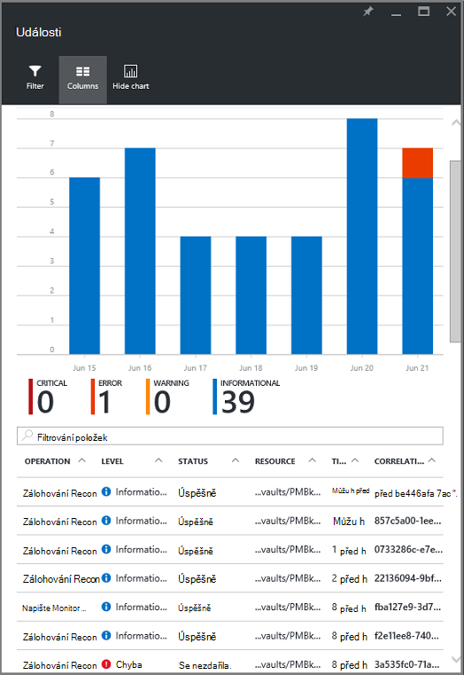

<properties
   pageTitle="Správce prostředků monitor nasazený virtuálního počítače zálohování | Microsoft Azure"
   description="Sledovat události a upozornění systému pomocí zálohy nasazený správce prostředků virtuálního počítače. Pošlete e-mail založený na upozornění."
   services="backup"
   documentationCenter="dev-center-name"
   authors="markgalioto"
   manager="cfreeman"
   editor=""/>

<tags
ms.service="backup"
ms.workload="storage-backup-recovery"
ms.tgt_pltfrm="na"
ms.devlang="na"
ms.topic="article"
ms.date="08/25/2016"
ms.author="trinadhk; giridham;"/>

# <a name="monitor-alerts-for-azure-virtual-machine-backups"></a>Sledovat oznámení záloh Azure virtuálního počítače

Upozornění byla od služby, že události mezní splňuje nebo překročených odpovědi. Víte, kdy může být start problémy kritické uchovávání obchodní náklady. Upozornění obvykle nedochází při plánování a je vlastně užitečné vědět, co nejdříve po výstrahy. Třeba při úlohy zálohování a obnovení nepovede, zobrazení výstrahy pět minut chyby. Na řídicím panelu trezoru zálohování upozornění dlaždici se zobrazují kritické úroveň pro upozornění události a. V části Nastavení zálohování upozornění můžete zobrazit všechny události. Ale co můžete dělat, když upozornění dochází při práci na samostatné vydání? Pokud si nejste jisti případě upozornění, může to být menší nepříjemnosti nebo mohou ovlivnit data. Abyste měli jistotu, že ty správné vědomi upozornění – Pokud k rizikové situaci dojde, službu k odeslání oznámení prostřednictvím e-mailu. Podrobnosti o nastavení e-mailová oznámení najdete v tématu [Konfigurace oznámení](backup-azure-monitor-vms.md#configure-notifications).

## <a name="how-do-i-find-information-about-the-alerts"></a>Jak najít informace o oznámení?

Pokud chcete zobrazit informace o události, která vyvolal upozornění, musíte otevřít zásuvné zálohování upozornění. Existují dva způsoby, jak otevřít zásuvné zálohování upozornění: buď z upozornění na zálohování dlaždice v řídicím panelu trezoru a od zásuvné upozornění a událostí.

Při otevření zásuvné zálohování upozornění z dlaždic zálohování upozornění:

- Na dlaždici **Zálohování upozornění** na řídicím panelu trezoru klikněte na **položku kritické** nebo **upozornění** zobrazení provozní událostí pro danou úroveň závažnosti.

    


Otevření zásuvné zálohování upozornění od zásuvné upozornění a událostí:

1. Na řídicím panelu trezoru klikněte na **Všechna nastavení**. 

2. Na zásuvné **Nastavení** klikněte na **upozornění a událostí**. 

3. Na zásuvné **upozornění a událostí** klepněte na **Zálohování upozornění**. 

    **Zálohování upozornění** zásuvné spustí a zobrazí filtrované upozornění.

    

4. Zobrazíte podrobné informace o konkrétní upozornění ze seznamu události, klikněte na oznámení otevřete zásuvné její **Podrobnosti** .

    

    Chcete-li přizpůsobit atributy zobrazené v seznamu, najdete v článku [Zobrazit další událost atributy](backup-azure-monitor-vms.md#view-additional-event-attributes)

## <a name="configure-notifications"></a>Konfigurace oznámení

 Můžete nakonfigurovat službu pro odeslání e-mailová oznámení pro oznámení, ke kterým došlo přes poslední hodinu nebo konkrétní typy události dojít.

Nastavení e-mailová oznámení pro oznámení

1. V nabídce zálohování upozornění klikněte na **Konfigurovat oznámení**

    

    Konfigurace oznámení zásuvné otevře.

    

2. Na upozornění Konfigurovat zásuvné pro e-mailová oznámení klikněte na **Zapnout**.

    Příjemci a závažnosti dialogová okna mít hvězdy, protože se musí používat tyto informace. Uveďte alespoň jeden e-mailovou adresu a vyberte alespoň jeden závažnosti.

3. V dialogovém okně **příjemci (E-mail)** zadejte e-mailové adresy pro kdo upozornění. Použijte formát: username@domainname.com. Zadáte více e-mailové adresy oddělte je středníkem (;).

4. V oblasti **upozornění** vyberte **Upozornění na** odeslání oznámení při zadaném výstrahy nebo **Hodinové Digest** odešlete souhrn k poslední hodinu.

5. V dialogovém okně **závažnosti** vyberte jednu nebo několik úrovní, které se má e-mailového oznámení.

6. Klikněte na **Uložit**.
### <a name="what-alert-types-are-available-for-azure-iaas-vm-backup"></a>Jaké typy výstrah jsou dostupné pro zálohování OM IaaS Azure?
| Úroveň upozornění  | Zasílání upozornění |
| ------------- | ------------- |
| Kritický | Selhání zálohování, obnovení selhání  |
| Upozornění  | Žádná |
| Informační  | Žádná  |

### <a name="are-there-situations-where-email-isnt-sent-even-if-notifications-are-configured"></a>Existují situace, kde není odešle e-mail i v případě, že jsou nakonfigurovány oznámení?

Existují situace, kde upozornění neodešle, i když je správně nakonfigurovat oznámení. V následujících situacích e-mailu nejsou odeslána oznámení následujícím uživatelům zabránit upozornění šum:

- Pokud hodinové Digest nakonfigurováno oznámení a upozornění mocninu a přeložit do jedné hodiny.
- Úkoly se zruší.
- Úlohy zálohování se aktivuje a pak a jiné úlohy zálohování probíhá.
- Spuštění úlohy zálohování pro správce prostředků s podporou OM, ale OM už existuje.

## <a name="customize-your-view-of-events"></a>Přizpůsobit zobrazení události

Nastavení **protokolů auditování** dodává se sadou předdefinované filtry a sloupců zobrazující informace o provozní události. Zobrazení můžete přizpůsobit tak, že když zásuvné **události** se otevře, uvidíte informace, které chcete.

1. V [řídicím panelu trezoru](./backup-azure-manage-vms.md#open-a-recovery-services-vault-in-the-dashboard)vyhledejte a vyberte položku **Protokolů auditování** otevřete zásuvné **události** .

    

    **Události** zásuvné otevře funkční události filtrované jenom na aktuální trezoru.

    

    Zásuvné seznamem pole kritický, chyby, upozornění a informační událostí, ke kterým došlo v uplynulém týdnu. Časový rozsah je výchozí hodnota nastavení v okně **Filtr**. Zásuvné **událostí** se zobrazí také pruhového grafu sledování výskytu události. Pokud nechcete, aby zobrazíte pruhovém grafu v nabídce **události** klikněte na **Skrýt graf** můžete přepínat vypnout graf. Výchozí zobrazení událostí uvádí informace o operace, úroveň, stavu, zdroje a čas. Informace o vystavení další atributy události najdete v části [rozbalování informace o událostech](backup-azure-monitor-vms.md#view-additional-event-attributes).

2. Další informace o události provozní ve sloupci **operace** klikněte na událost provozní otevřete jeho zásuvné. Zásuvné obsahuje podrobné informace o událostech. Události jsou seskupená podle jejich ID korelace a seznam událostí, ke kterým došlo v časového rozsahu.

    

3. Chcete-li zobrazit podrobné informace o zvláštní událost nastavit jako, v seznamu události, klikněte na událost zobrazíte její **Podrobnosti** zásuvné.

    

    Informace úroveň události se tak přesné jako získá informace. Pokud raději prohlížet tomto množství informací o každé události a chtěli přidat tolik podrobností **události** zásuvné, najdete v článku oddíl [rozbalování informace o událostech](backup-azure-monitor-vms.md#view-additional-event-attributes).


## <a name="customize-the-event-filter"></a>Přizpůsobení filtru události
Použití **filtru** a upravte nebo vyberte informace, které se zobrazí v určité zásuvné. Pokud chcete filtrovat informace o událostech:

1. V [řídicím panelu trezoru](./backup-azure-manage-vms.md#open-a-recovery-services-vault-in-the-dashboard)vyhledejte a vyberte položku **Protokolů auditování** otevřete zásuvné **události** .

    

    **Události** zásuvné otevře funkční události filtrované jenom na aktuální trezoru.

    

2. V nabídce **události** klikněte na **Filtr** otevřete tento zásuvné.

    

3. Na zásuvné **Filtr** nastavte **úroveň** **časového rozsahu**a **volající** filtry. Další filtry nejsou k dispozici, protože byla nastavena na poskytnout aktuální informace o obnovení služby trezoru.

    

    Můžete zadat **úroveň** události: kritické, chyby, upozornění nebo informační. Vyberte libovolnou kombinací úrovní událostí, ale je nutné mít aspoň jednu, vybrané úrovně. Úroveň zapnout nebo vypnout. Filtr **rozsahu čas** vám umožní určit délku doby pro zachycení události. Pokud používáte vlastní časového rozsahu, můžete nastavit čas zahájení a ukončení.

4. Jakmile budete připraveni k vytvoření dotazu operace protokoly pomocí filtru, klikněte na **Aktualizovat**. Ve výsledcích se zobrazí v zásuvné **události** .

    


### <a name="view-additional-event-attributes"></a>Zobrazit další událost atributy
Použití tlačítka **sloupců** , můžete povolit další událost atributy, které se zobrazí v seznamu na zásuvné **události** . Výchozí seznam události zobrazuje informace o operace, úroveň, stav, zdroje a čas. Chcete-li povolit další atributy:

1. Na zásuvné **události** klikněte na **sloupce**.

    

    Otevře se zásuvné **Zvolit sloupce** .

    

2. Chcete-li vybrat atribut, zaškrtněte políčko. Zaškrtávací políčko atribut přepíná zapínat a vypínat.

3. Klepněte na **Obnovit** obnovit seznam atributů v zásuvné **události** . Po přidání nebo odebrání atributy ze seznamu, použijte nový seznam všech atributů události **Obnovit** .

4. Kliknutím na **Aktualizovat** aktualizujte data atributy události. Následující tabulka obsahuje informace o jednotlivých atributů.

| Název sloupce      |Popis|
| -----------------|-----------|
| Operace|Název operace|
| Úroveň|Může být úroveň operace hodnot: informační, upozornění, chybu nebo kritický|
|Stav|Popisný stav operace|
|Zdroje|URL, která určuje prostředku. nazývaný také pole číslo ID zdroje|
|Čas|Čas, měřeno od aktuální čas, kdy došlo k události|
|Volající|Kdo nebo funkcí, které s názvem nebo spouštěný události. může být systému nebo uživatele|
|Časové razítko|Čas, kdy byla událost spuštěna|
|Pole Skupina zdroje|Skupina přidružené zdroje|
|Pole Typ zdroje|Typ interní zdroje managera podle zdroje|
|ID předplatného|ID přidružené předplatného|
|Kategorie|Kategorie události|
|ID korelace|Běžné ID souvisejících událostí|


## <a name="use-powershell-to-customize-alerts"></a>Použití Powershellu ke přizpůsobení upozornění
Vlastní oznámení pro úlohy může vstoupit na portálu. Tyto úlohy získáte definujte pravidel prostředí PowerShell upozornění na provozní protokoly událostí. Použití *prostředí PowerShell verze 1.3.0 nebo novější*.

Pokud chcete definovat vlastní oznámení upozornit na záložní chyby, použijte příkaz podobně jako tento skript:

```
PS C:\> $actionEmail = New-AzureRmAlertRuleEmail -CustomEmail contoso@microsoft.com
PS C:\> Add-AzureRmLogAlertRule -Name backupFailedAlert -Location "East US" -ResourceGroup RecoveryServices-DP2RCXUGWS3MLJF4LKPI3A3OMJ2DI4SRJK6HIJH22HFIHZVVELRQ-East-US -OperationName Microsoft.Backup/RecoveryServicesVault/Backup -Status Failed -TargetResourceId /subscriptions/86eeac34-eth9a-4de3-84db-7a27d121967e/resourceGroups/RecoveryServices-DP2RCXUGWS3MLJF4LKPI3A3OMJ2DI4SRJK6HIJH22HFIHZVVELRQ-East-US/providers/microsoft.backupbvtd2/RecoveryServicesVault/trinadhVault -Actions $actionEmail
```

**ResourceId** : ResourceId se dá dostat z protokolů auditování. ResourceId je uvedený ve sloupci Zdroj protokolů operace adresy URL.

**Název operace** : název operace je ve formátu "Microsoft.RecoveryServices/recoveryServicesVault/*EventName*" přičemž může platit *EventName* :<br/>
- Registrace <br/>
- Zrušení registrace <br/>
- ConfigureProtection <br/>
- Zálohování <br/>
- Obnovení <br/>
- StopProtection <br/>
- DeleteBackupData <br/>
- CreateProtectionPolicy <br/>
- DeleteProtectionPolicy <br/>
- UpdateProtectionPolicy <br/>

**Stav** : podporované hodnoty jsou Začínáme, byl úspěšný nebo se nezdařila.

**ResourceGroup** : Toto je skupina zdroje, ke které zdroj patří. Můžete přidat sloupec pole Skupina zdroje do generované protokoly. Pole Skupina zdroje je jeden z dostupných typů informace o událostech.

**Název** : název pravidla výstrahy.

**CustomEmail** : zadat vlastní e-mailovou adresu, do kterého chcete odeslat oznámení

**SendToServiceOwners** : tuto možnost odešle oznámení všem správcům a dalších správců předplatného. Lze použít v rutinu **New-AzureRmAlertRuleEmail**

### <a name="limitations-on-alerts"></a>Omezení upozornění
Upozornění na základě událostí se vztahují tato omezení:

1. Výstrahy se spouštějí na všechny virtuálních počítačích služby Recovery trezoru. Můžete upravit upozornění pro podmnožinu virtuálních počítačích služby Recovery trezoru.
2. Tato funkce je v náhledu. [Víc se uč](../monitoring-and-diagnostics/insights-powershell-samples.md#create-alert-rules)
3. Upozornění na kterou se odesílají z "alerts-noreply@mail.windowsazure.com". Aktuálně nelze upravit odesílatele e-mailu.


## <a name="next-steps"></a>Další kroky

Protokoly událostí povolit skvělé postmortální a auditování podpory pro operace zálohování. Tyto operace přihlášeni:

- Registrace
- Zrušení registrace
- Konfigurace ochrany
- Zálohování (obě naplánované i na vyžádání zálohování)
- Obnovení
- Odemknout
- Odstranění záložních dat
- Přidání zásad
- Odstranění zásady
- Zásady aktualizace
- Zrušení úlohy

Obecných vysvětlení události operací a protokolů auditování přes Azure služeb, naleznete v článku [zobrazení událostí a protokolů auditování](../monitoring-and-diagnostics/insights-debugging-with-events.md).

Další informace o opětovné vytvoření virtuálního počítače z bodu obnovení najdete v článku [Obnovení VMs Azure](backup-azure-restore-vms.md). Pokud potřebujete informace týkající se ochrany virtuálních počítačích, přečtěte si článek [nejdřív najděte: zálohování VMs do služby Recovery trezoru](backup-azure-vms-first-look-arm.md). Informace o úlohy správy záloh OM v článku [zálohy Správa Azure virtuálního počítače](backup-azure-manage-vms.md).
