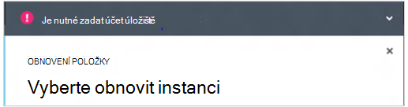

<properties
    pageTitle="Obnovení ze zálohy virtuálních počítačích | Microsoft Azure"
    description="Zjistěte, jak obnovit Azure virtuálního počítače z bodu obnovení"
    services="backup"
    documentationCenter=""
    authors="trinadhk"
    manager="shreeshd"
    editor=""
    keywords="obnovení záložní kopie; obnovení; obnovení čárky;"/>

<tags
    ms.service="backup"
    ms.workload="storage-backup-recovery"
    ms.tgt_pltfrm="na"
    ms.devlang="na"
    ms.topic="article"
    ms.date="08/02/2016"
    ms.author="trinadhk; jimpark;"/>

# Obnovení virtuálních počítačích v Azure

> [AZURE.SELECTOR]
- [Obnovení VMs Azure portálu](backup-azure-arm-restore-vms.md)
- [Obnovení VMs klasické portálu](backup-azure-restore-vms.md)

Obnovení virtuálního počítače nové angličtině systému pomocí zálohy uložené v Azure záložní trezoru pomocí následujícího postupu.

## Obnovení pracovního postupu

### 1. Vyberte položku, kterou chcete obnovit

1. Přejděte na kartu **Chráněné položky** a vyberte virtuální počítač, který chcete obnovit nové OM.

    

    Sloupec **Bod obnovení** na stránce **Chráněné položky** se dozvíte, počet bodů obnovení virtuálního počítače. Sloupec **Od nejnovějšího pro obnovení čárky** informuje čas poslední zálohy, ze kterého lze obnovit virtuálního počítače.

2. Klikněte na tlačítko Otevřít průvodce **obnovení položky** **Obnovit** .

    

### 2. obnovení čárky vyberte

1. V okně **Vyberte bod obnovení** můžete obnovit z nejnovější bod obnovení nebo z předchozího bodu v čase. Možnost výchozí při otevření Průvodce je *Od nejnovějšího pro obnovení bod*.

    

2. Výběr předchozí v čase, vyberte možnost **Datum vyberte** v rozevíracím seznamu a vyberte datum v ovládacím prvku kalendáře kliknutím na **ikonu Kalendář**. V ovládacím prvku všechna data, které obsahují obnovení body budou vyplněna světle šedý odstín a vybrat uživatelem.

    

    Po kliknutí na datum v ovládacím prvku Kalendář vymáhání bodů k dispozici v, že data v zobrazí obnovení body tabulce. Sloupec **čas** udává čas niž byla přijata snímek. Ve sloupci **Typ** zobrazí [konzistence](https://azure.microsoft.com/documentation/articles/backup-azure-vms/#consistency-of-recovery-points) bod obnovení. Záhlaví zobrazí počet bodů obnovení k dispozici v daný den v závorkách.

    

3. Vyberte místo obnovení tabulce **Obnovení bodů** a klikněte na další šipka pro návrat na další obrazovce.

### 3. Zadejte cílové umístění

1. Na obrazovce **Vyberte obnovit instance** zadejte podrobnosti od místa, kam chcete obnovit virtuální počítač.

  - Zadejte název počítače virtuální: V dané cloudové služby, musí být jedinečná s názvem virtuálního počítače. Nepodporujeme povolená psaní existující OM. 
  - Vyberte do cloudové služby OM: je to povinné pro vytváření virtuálního počítače. Můžete použít existující cloudové služby nebo vytvořte nové cloudové služby.

        Whatever cloud service name is picked should be globally unique. Typically, the cloud service name gets associated with a public-facing URL in the form of [cloudservice].cloudapp.net. Azure will not allow you to create a new cloud service if the name has already been used. If you choose to create select create a new cloud service, it will be given the same name as the virtual machine – in which case the VM name picked should be unique enough to be applied to the associated cloud service.

        We only display cloud services and virtual networks that are not associated with any affinity groups in the restore instance details. [Learn More](../virtual-network/virtual-networks-migrate-to-regional-vnet.md).

2. Vyberte účet úložiště pro OM: je to povinné pro vytváření OM. Můžete vybírat z existující úložiště účty ve stejné oblasti jako trezoru Azure zálohování. Nepodporujeme úložiště účty, které nejsou zóně nadbytečné nebo typu úložiště Premium.

    Pokud nejsou účty úložiště s podporované konfigurace, vytvořte účet úložiště podporované konfigurace před spuštěním obnovení.

    

3. Vyberte virtuální sítě: virtuální sítě (VNET) pro virtuální počítač by měla být vybraná při vytváření OM. Obnovení uživatelského rozhraní zobrazuje všechny VNETs v rámci toto předplatné, kterou budete moct použít. Není povinný výběr VNET pro obnovená OM – bude moct připojit k obnovená virtuálního počítače přes internet, i když se nepoužil VNET.

    Pokud cloudovou službu vybrané souvisí s virtuální sítě, není možné změnit virtuální sítě.

    

4. Vyberte podsítě: V případě, že VNET má podsítí, ve výchozím nastavení první podsítě vybere. Výběr podsítě podle svého výběru z rozevíracího seznamu možností. Podsítě podrobnosti najdete v článku rozšíření sítí na [domovskou stránku portálu](https://manage.windowsazure.com/), přejděte na **Virtuálních sítí** a vyberte virtuální sítě a přecházet na podrobnější konfigurovat zobrazíte podrobnosti podsítě.

    

5. Klikněte na ikonu **Odeslat** v Průvodci odešlete podrobnosti a vytvoření úlohy obnovit.

## Sledování obnovení
Po zadání všech informací do Průvodce obnovením a odeslaný ho Azure zálohování se bude snažit k vytvoření úlohy ke sledování obnovení.

Vytvoření projektu je úspěšné, uvidíte informačního oznámení označující, vytvořené úkoly. Další informace získáte kliknutím na tlačítko **Zobrazení projektu** , který přejdete na kartu **projekty** .

Po dokončení obnovení budou označeny jako dokončené v karty **úlohy** .

Po obnovení virtuální počítač budete muset znovu nainstalovat přípony stávající na původní OM a [změnit koncové body](../virtual-machines/virtual-machines-windows-classic-setup-endpoints.md) virtuálního počítače na portálu Azure.

## Po obnovení kroky
Pokud používáte na základě cloudu inicializace Linux někomu poslat systémem Ubuntu, z bezpečnostních důvodů, budou blokovány heslo zveřejňují obnovit. Stiskněte klávesovou zkratku VMAccess rozšíření na obnovená OM, aby vám [resetoval heslo](../virtual-machines/virtual-machines-linux-classic-reset-access.md). Doporučujeme použít SSH na tyto distribuce Chcete-li předejít resetování hesla příspěvek obnovit. 

## Zálohování obnovená VMs
Pokud jste obnovili OM stejné cloudové služby, se stejným názvem v původním zálohovala OM, zůstanou v zálohování na Obnovit OM příspěvek. Pokud máte obnovit OM na jiné cloudové službě nebo zadaný jiný název obnovená OM, se použije jako nový OM a obnovené OM muset nastavení zálohování.

## Obnovení virtuálního počítače během Azure katastrofě datacentru
Azure zálohování umožňuje obnovení zálohovala VMs párových datacentrem v případě, že primární datového centra kde VMs běží havárie prostředí a nakonfigurovali zálohování trezoru být geo nadbytečné. Během scénářů budete muset vybrat úložiště účtu, který je k dispozici v centru párových data a zbytek obnovování zůstávají stejné. Služba výpočetním z párových geo Azure zálohování slouží k vytváření obnovená virtuálního počítače. 

## Obnovení VMs řadiče domény
Zálohování řadiče domény řadiče domény (domény) virtuálních počítačích je podporované situace pomocí Azure zálohování. Ale některé musí věnovat během obnovení. Možnosti obnovení je výrazně pro domény řadiče domény VMs v jiné jednoduchým Datacentrum konfigurace porovnání VMs ve více Datacentrum konfigurace.

### Jeden Datacentrum
OM obnovit je může (třeba jiných OM) v Azure portál nebo pomocí Powershellu.

### Více řadiče domény
Pokud máte v prostředí více Datacentrum, řadiče domény budou vlastní uchovávání dat synchronní. Po obnovení *bez odpovídajících opatření*starší záložní čárky USN vrácení proces způsobí zmatek v prostředí více Datacentrum. Pravý způsob, jak obnovit takové OM je spustit v režimu DSRM.

Tím největší oříškem nastane, protože není k dispozici v Azure DSRM režimu. Tak obnovit takové OM, nemůžete používat portál Azure. Pouze podporované obnovení mechanismus je diskové obnovení pomocí Powershellu.

>[AZURE.WARNING] Domény řadiče domény VMs v prostředí více Datacentrum nepoužívejte Azure portálu pro obnovení! Je podporována pouze prostředí PowerShell na základě obnovení

Další informace o [problému USN vrácení zpět](https://technet.microsoft.com/library/dd363553) a strategie návrhy opravný nástroj fix it.

## Obnovení VMs s konfigurací zvláštní sítě
Azure zálohování podporuje zálohování za speciální síťové konfigurace virtuálních počítačích.

- VMs v části Vyrovnávání zatížení (interní a externí)
- VMs s více rezervovaná IP adresy
- VMs s více nic

Tyto konfigurace pověřit po co byste měli zvážit při jejich obnovování.

>[AZURE.TIP] Pomocí prostředí PowerShell na základě obnovení toku znovu vytvořte speciální sítě konfiguraci VMs příspěvek obnovení.

### Obnovení ze uživatelského rozhraní:
Při obnovení ze uživatelského rozhraní, **vždy zvolte nový cloudové služby**. Dejte pozor, protože portál otázkou povinné parametry během obnovení tok, VMs obnoveny pomocí uživatelského rozhraní dojde ke ztrátě konfigurace zvláštní sítě, které mohou mít. Jinými slovy, obnovení VMs bude normální VMs bez konfigurace služby Vyrovnávání zatížení nebo více NIC nebo více User.

### Obnovení ze Powershellu:
Prostředí PowerShell má možnost právě disků OM obnovení ze zálohy a nelze vytvořit virtuální počítač. To je užitečné při obnovení virtuálních počítačích vyžadující zvláštní sítě konfigurace mentined výše.

Abyste mohli plně obnovit obnovení disků příspěvek virtuálního počítače, postupujte takto:

1. Obnovení disků ze záložní trezoru pomocí [Powershellu záložní Azure](../backup-azure-vms-classic-automation.md#restore-an-azure-vm)

2. Vytvoření konfigurace OM potřebných pro vyrovnávání zatížení / více NIC/více User pomocí rutin prostředí PowerShell a použijte ho k vytvoření OM z žádoucí konfigurace.
    - Vytvoření OM v cloudové službě s [Vyrovnávání zatížení interní](https://azure.microsoft.com/documentation/articles/load-balancer-internal-getstarted/)
    - Vytvoření OM se připojit k [internetové Vyrovnávání zatížení] (https://azure.microsoft.com/en-us/documentation/articles/load-balancer-internet-getstarted/)
    - Vytvoření OM s [více nic](https://azure.microsoft.com/documentation/articles/virtual-networks-multiple-nics/)
    - Vytvoření OM s [více rezervovaná IP adresy](https://azure.microsoft.com/documentation/articles/virtual-networks-reserved-public-ip/)

## Další kroky
- [Poradce při potížích s chybami](backup-azure-vms-troubleshoot.md#restore)
- [Správa virtuálních počítačích](backup-azure-manage-vms.md)
