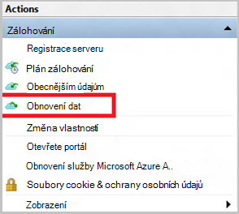

<properties
   pageTitle="Obnovení dat do systému Windows Server nebo klienta Windows z Azure pomocí Správce prostředků nasazení modelu | Microsoft Azure"
   description="Zjistěte, jak obnovit z klienta systému Windows a Windows Server."
   services="backup"
   documentationCenter=""
   authors="saurabhsensharma"
   manager="shivamg"
   editor=""/>

<tags
   ms.service="backup"
   ms.workload="storage-backup-recovery"
     ms.tgt_pltfrm="na"
     ms.devlang="na"
     ms.topic="article"
     ms.date="08/02/2016"
     ms.author="trinadhk; jimpark; markgal;"/>

# Obnovení souborů systému Windows server nebo Windows klientském počítači pomocí Správce prostředků nasazení modelu

> [AZURE.SELECTOR]
- [Azure portálu](backup-azure-restore-windows-server.md)
- [Klasický portálu](backup-azure-restore-windows-server-classic.md)

Tento článek popisuje, jak nutné provést dva typy operací obnovit:

- Obnovení dat do stejného počítače, ze kterého byly odebrány zálohy.
- Obnovení dat na druhý počítač.

V obou případech data načtená z trezoru služby Azure Recovery.

[AZURE.INCLUDE [learn-about-deployment-models](../../includes/learn-about-deployment-models-rm-include.md)]klasický nasazení modelu.

## Obnovení dat na stejném počítači
Pokud omylem odstranili soubor a chcete ji obnovit na stejném počítači (ze kterého se považuje zálohování), pomůže vám obnovit data podle těchto kroků.

1. Otevřete **Microsoft Azure Backup** přichycení v.
2. Klikněte na **Obnovit Data** , která chcete spustit pracovní postup.

    

3. Vyberte * *Tento server (*yourmachinename*) ** možnost obnovit zálohované soubor ve stejném počítači.

    

4. Zvolte můžete **Vyhledat soubory** nebo **Vyhledat soubory**.

    Pokud chcete obnovit jeden nebo víc souborů jehož cesta je známo, ponechte výchozí možnost. Pokud nejste jisti struktura složek, ale chtěli vyhledejte soubor, vyberte možnost **Vyhledat soubory** . Pro účely tohoto oddílu nemůžeme pokračovat ve výchozí možnost.

    

5. Vyberte svazku, ze kterého chcete soubor obnovit.

    Obnovením z jakéhokoli místa v čase. Kalendářní data, které se zobrazují **tučně** v ovládacím prvku Kalendář označují dostupnost bod obnovení. Po výběru data podle plánu záložní (a úspěch zálohování), můžete vybrat umístění v čase oproti rozevírací **čas** dolů.

    

6. Vyberte položky, které chcete obnovit. Můžete vícenásobného výběru složky nebo soubory, které chcete obnovit.

    

7. Zadejte parametry obnovení.

    

  - Máte možnost obnovení do původního umístění (ve kterém soubor nebo složka by se přepsat) nebo do jiného umístění ve stejném počítači.
  - Pokud soubor nebo složku, kterou chcete obnovit existuje v cílové umístění, můžete vytvořit kopie (dvou verzí stejného souboru), přepsat soubory v cílové umístění nebo přeskočit obnovení souborů, které jsou v cílovém.
  - Důrazně doporučujeme ponechte výchozí možnost obnovení ACL soubory, které jsou obnovována.

8. Když jsou k dispozici tyto vstupy, klikněte na tlačítko **Další**. Obnovení pracovního postupu, který obnovení souborů pro tento počítač, se spustí.

## Obnovení alternativní počítače
Pokud dojde ke ztrátě celého serveru, můžete pořád obnovení dat z Azure zálohování na jiném počítači. Následující kroky popisují pracovního postupu.  

Obsahuje terminologie v těchto kroků:

- *Zdrojového počítače* – původní počítač, ze které vytvoření zálohy a které momentálně není dostupná.
- *Cílový počítač* – do počítače, ke kterému se obnoví data.
- *Ukázka trezoru* – trezoru obnovení služby do kterého jsou registrované *zdrojového počítače* a *cílový počítač* .  

> [AZURE.NOTE] Zálohování dostali z počítače nejde obnovit v počítači, který je spuštěná starší verze operačního systému. Například pokud zálohy jsou odebrány z počítače Windows 7, může ho obnovit ve Windows 8 nebo nad počítače. Ale naopak není stiskněte a podržte PRAVDA.

1. Otevřete **Microsoft Azure Backup** přichycení v na *cílový počítač*.
2. Ujistěte se, že jsou registrované *cílový počítač* a *zdrojového počítače* do stejné služby Recovery trezoru.
3. Klikněte na **Obnovit Data** , která chcete spustit pracovní postup.

    

4. Vyberte **jiný server**

    

5. Poskytnout soubor pověření trezoru odpovídající *vzorku trezoru*. Pokud je soubor pověření trezoru neplatné (nebo vypršela platnost) stažení souboru nové přihlašovacích údajů trezoru z *trezoru ukázkové* Azure portálu. Jakmile soubor pověření trezoru není uvedený, zobrazí se trezoru služby Recovery u souboru pověření trezoru.

6. Vyberte ze seznamu zobrazeného strojů *zdrojového počítače* .

    

7. Vyberte možnost **Vyhledat soubory** nebo **Vyhledat soubory** . Pro účely tohoto oddílu použijeme možnost **Vyhledat soubory** .

    

8. Na další obrazovce vyberte hlasitost a datum. Vyhledejte název složky nebo souboru, kterou chcete obnovit.

    

9. Vyberte umístění, kdy je potřeba obnovit soubory.

    

10. Zadejte heslo šifrování, které při registraci *zdrojového počítače* *ukázkové trezoru*.

    

11. Po zadání není uvedený, klikněte na **Obnovit**, který spustí obnovení zálohované soubory do cíle k dispozici.

## Další kroky
- Teď jste obnovit soubory a složky, můžete [Spravovat zálohování](backup-azure-manage-windows-server.md).
