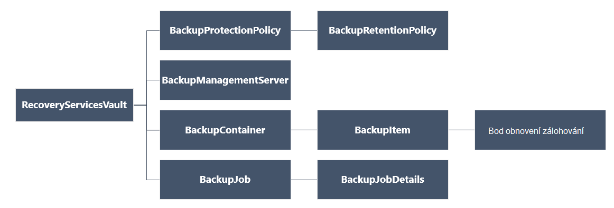

<properties
   pageTitle="Nasazením a správou zálohy pro nasazení Správce prostředků VMs pomocí prostředí PowerShell | Microsoft Azure"
   description="Použití Powershellu ke nasazením a správou zálohy v Azure pro nasazení Správce prostředků VMs"
   services="backup"
   documentationCenter=""
   authors="markgalioto"
   manager="cfreeman"
   editor=""/>

<tags
   ms.service="backup"
   ms.devlang="na"
   ms.topic="article"
   ms.tgt_pltfrm="na"
   ms.workload="storage-backup-recovery"
   ms.date="08/03/2016"
   ms.author="markgal; trinadhk"/>

# <a name="deploy-and-manage-backups-for-resource-manager-deployed-vms-using-powershell"></a>Nasazením a správou zálohy pro nasazení Správce prostředků VMs pomocí prostředí PowerShell

> [AZURE.SELECTOR]
- [Správce prostředků](backup-azure-vms-automation.md)
- [Klasický](backup-azure-vms-classic-automation.md)

Tento článek ukazuje, jak pomocí rutin prostředí PowerShell Azure zálohování a obnovení Azure virtuálního počítače (OM) ze služby Recovery trezoru. Obnovení služby trezoru je správce prostředků Azure zdroje a slouží k ochraně dat a prostředky služby Azure zálohování a obnovení webu Azure. Služby Recovery trezoru umožňuje chránit nasazený Správce služby Azure VMs nasazený správce prostředků Azure VMs.

>[AZURE.NOTE] Azure obsahuje dva modely nasazení pro vytváření grafů a práci s prostředky: [Správce zdrojů a klasické](../resource-manager-deployment-model.md). Tento článek je pro použití s VMs vytvořené pomocí modelu správce prostředků.

Tento článek vás provede online přes chránit virtuálního počítače a obnovení dat z obnovení bodu.

## <a name="concepts"></a>Koncepty

Pokud si nejste se službou Azure zálohování přehled o službu, přečtěte si [Co je Azure zálohování?](backup-introduction-to-azure-backup.md) Než začnete, ujistěte se titulní essentials o požadavcích pro práci s Azure záložní a omezení aktuální OM záložní řešení.

Abyste mohli používat efektivně Powershellu, je třeba porozumět hierarchii objektů a od kde začít.



Reference pro rutiny prostředí AzureRmRecoveryServicesBackup PowerShell zobrazíte najdete v článku [Zálohy Azure – rutiny služby obnovení](https://msdn.microsoft.com/library/mt723320.aspx) v knihovně Azure.
Reference pro rutiny prostředí AzureRmRecoveryServicesVault PowerShell naleznete v tématu [Rutiny pro službu Azure obnovení](https://msdn.microsoft.com/library/mt643905.aspx).


## <a name="setup-and-registration"></a>Instalační program a registrace

Chcete-li začít:

1. [Stáhněte si nejnovější verzi prostředí PowerShell](https://github.com/Azure/azure-powershell/releases) (minimální verze povinné: 1.4.0)

2. Vyhledání rutiny prostředí PowerShell zálohování Azure k dispozici tak, že zadáte tento příkaz:

```
PS C:\> Get-Command *azurermrecoveryservices*

CommandType     Name                                               Version    Source
-----------     ----                                               -------    ------
Cmdlet          Backup-AzureRmRecoveryServicesBackupItem           1.4.0      AzureRM.RecoveryServices.Backup
Cmdlet          Disable-AzureRmRecoveryServicesBackupProtection    1.4.0      AzureRM.RecoveryServices.Backup
Cmdlet          Enable-AzureRmRecoveryServicesBackupProtection     1.4.0      AzureRM.RecoveryServices.Backup
Cmdlet          Get-AzureRmRecoveryServicesBackupContainer         1.4.0      AzureRM.RecoveryServices.Backup
Cmdlet          Get-AzureRmRecoveryServicesBackupItem              1.4.0      AzureRM.RecoveryServices.Backup
Cmdlet          Get-AzureRmRecoveryServicesBackupJob               1.4.0      AzureRM.RecoveryServices.Backup
Cmdlet          Get-AzureRmRecoveryServicesBackupJobDetails        1.4.0      AzureRM.RecoveryServices.Backup
Cmdlet          Get-AzureRmRecoveryServicesBackupManagementServer  1.4.0      AzureRM.RecoveryServices.Backup
Cmdlet          Get-AzureRmRecoveryServicesBackupProperties        1.4.0      AzureRM.RecoveryServices
Cmdlet          Get-AzureRmRecoveryServicesBackupProtectionPolicy  1.4.0      AzureRM.RecoveryServices.Backup
Cmdlet          Get-AzureRMRecoveryServicesBackupRecoveryPoint     1.4.0      AzureRM.RecoveryServices.Backup
Cmdlet          Get-AzureRmRecoveryServicesBackupRetentionPolic... 1.4.0      AzureRM.RecoveryServices.Backup
Cmdlet          Get-AzureRmRecoveryServicesBackupSchedulePolicy... 1.4.0      AzureRM.RecoveryServices.Backup
Cmdlet          Get-AzureRmRecoveryServicesVault                   1.4.0      AzureRM.RecoveryServices
Cmdlet          Get-AzureRmRecoveryServicesVaultSettingsFile       1.4.0      AzureRM.RecoveryServices
Cmdlet          New-AzureRmRecoveryServicesBackupProtectionPolicy  1.4.0      AzureRM.RecoveryServices.Backup
Cmdlet          New-AzureRmRecoveryServicesVault                   1.4.0      AzureRM.RecoveryServices
Cmdlet          Remove-AzureRmRecoveryServicesProtectionPolicy     1.4.0      AzureRM.RecoveryServices.Backup
Cmdlet          Remove-AzureRmRecoveryServicesVault                1.4.0      AzureRM.RecoveryServices
Cmdlet          Restore-AzureRMRecoveryServicesBackupItem          1.4.0      AzureRM.RecoveryServices.Backup
Cmdlet          Set-AzureRmRecoveryServicesBackupProperties        1.4.0      AzureRM.RecoveryServices
Cmdlet          Set-AzureRmRecoveryServicesBackupProtectionPolicy  1.4.0      AzureRM.RecoveryServices.Backup
Cmdlet          Set-AzureRmRecoveryServicesVaultContext            1.4.0      AzureRM.RecoveryServices
Cmdlet          Stop-AzureRmRecoveryServicesBackupJob              1.4.0      AzureRM.RecoveryServices.Backup
Cmdlet          Unregister-AzureRmRecoveryServicesBackupContainer  1.4.0      AzureRM.RecoveryServices.Backup
Cmdlet          Unregister-AzureRmRecoveryServicesBackupManagem... 1.4.0      AzureRM.RecoveryServices.Backup
Cmdlet          Wait-AzureRmRecoveryServicesBackupJob              1.4.0      AzureRM.RecoveryServices.Backup
```


S prostředím PowerShell můžete automatické tyto věci:

- Vytvoření trezoru obnovení služby
- Zálohovat nebo zamknout Azure VMs
- Aktivace úlohy zálohování
- Sledování úlohy zálohování
- Obnovení Azure OM

## <a name="create-a-recovery-services-vault"></a>Vytvoření trezoru služby obnovení

Podle těchto kroků vás provede vytvoření služby Recovery trezoru. Obnovení služby trezoru se liší od zálohování trezoru.

1. Pokud používáte Azure zálohování poprvé, musíte použít rutinu **[AzureRMResourceProvider přihlásit](https://msdn.microsoft.com/library/mt679020.aspx)** k registraci poskytovatele služby Azure obnovení předplatného.

    ```
    PS C:\> Register-AzureRmResourceProvider -ProviderNamespace "Microsoft.RecoveryServices"
    ```

2. Služby Recovery trezoru je správce prostředků zdroj, proto je potřeba provést v rámci skupiny zdrojů. Můžete použít existující skupinu prostředků nebo vytvořit nové skupiny prostředků s rutinu **[New-AzureRmResourceGroup](https://msdn.microsoft.com/library/mt678985.aspx)** . Při vytváření nové skupiny prostředků, zadejte název a umístění skupina zdroje.  

    ```
    PS C:\> New-AzureRmResourceGroup –Name "test-rg" –Location "West US"
    ```

3. Použijte rutinu **[New-AzureRmRecoveryServicesVault](https://msdn.microsoft.com/library/mt643910.aspx)** k vytvoření nového trezoru. Ujistěte se, můžete zadat na stejném místě trezoru byla použita pro skupiny zdrojů.

    ```
    PS C:\> New-AzureRmRecoveryServicesVault -Name "testvault" -ResourceGroupName " test-rg" -Location "West US"
    ```

4. Určení typu úložiště redundance používat; můžete použít [Místně nadbytečné úložiště (LRS)](../storage/storage-redundancy.md#locally-redundant-storage) nebo [Geo nadbytečné úložiště (GRS)](../storage/storage-redundancy.md#geo-redundant-storage). Následující příklad ukazuje, že možnost - BackupStorageRedundancy testVault je nastavený na GeoRedundant.

    ```
    PS C:\> $vault1 = Get-AzureRmRecoveryServicesVault –Name "testVault"
    PS C:\> Set-AzureRmRecoveryServicesBackupProperties  -Vault $vault1 -BackupStorageRedundancy GeoRedundant
    ```

    > [AZURE.TIP] Rutiny pro mnoho Azure zálohování vyžadují objekt trezoru služby Recovery jako vstup. Z toho důvodu je vhodný k ukládání objekt trezoru zálohování obnovení služby do proměnné.

## <a name="view-the-vaults-in-a-subscription"></a>Zobrazení trezorů v předplatné
Umožňuje zobrazit seznam všech trezorů v aktuálního předplatného **[Get-AzureRmRecoveryServicesVault](https://msdn.microsoft.com/library/mt643907.aspx)** . Zkontrolujte, že byla vytvořena nová trezoru nebo zjistit jaké trezorů jsou k dispozici v předplatného, můžete tento příkaz.

Spusťte příkaz Get-AzureRmRecoveryServicesVault a jsou uvedené všechny trezory v předplatného.

```
PS C:\> Get-AzureRmRecoveryServicesVault
Name              : Contoso-vault
ID                : /subscriptions/1234
Type              : Microsoft.RecoveryServices/vaults
Location          : WestUS
ResourceGroupName : Contoso-docs-rg
SubscriptionId    : 1234-567f-8910-abc
Properties        : Microsoft.Azure.Commands.RecoveryServices.ARSVaultProperties
```


## <a name="backup-azure-vms"></a>Zálohování Azure VMs
Teď, když jste vytvořili trezoru služby obnovení, můžete ji použijete k ochraně virtuálního počítače. Ale před použitím zámek musíte nastavit kontextu trezoru a budete chtít ověření zásady ochrany. Kontext trezoru Určuje typ dat, která se po zamknutí v trezoru. Zásady ochrany je plán při spuštění úlohy zálohování a jak dlouho se zachovají každý záložní snímku.

Před povolením ochrana na virtuálního počítače, je nutné nastavit kontextu trezoru. Kontext bude použit pro všechny následující rutiny.

```
PS C:\> Get-AzureRmRecoveryServicesVault -Name testvault | Set-AzureRmRecoveryServicesVaultContext
```

### <a name="create-a-protection-policy"></a>Vytvoření zásad ochrany

Při vytváření nové trezoru získáváte výchozí zásady. Tuto zásadu spustí úlohy zálohování každý den za určitou dobu. Na výchozí zásady se zachovají záložní snímku 30 dní. Můžete použít výchozí zásady rychle ochraně svého OM a upravit zásadu později s změnit podrobnosti.

Použijte **[AzureRmRecoveryServicesBackupProtectionPolicy získat](https://msdn.microsoft.com/library/mt723300.aspx)** seznam dostupných zásad v trezoru:

```
PS C:\> Get-AzureRmRecoveryServicesBackupProtectionPolicy -WorkloadType AzureVM
Name                 WorkloadType       BackupManagementType BackupTime                DaysOfWeek
----                 ------------       -------------------- ----------                ----------
DefaultPolicy        AzureVM            AzureVM              4/14/2016 5:00:00 PM
```

> [AZURE.NOTE] Časové pásmo pole BackupTime v prostředí PowerShell je UTC. Když záložní času se zobrazují v portálu Azure, čas upravit na místní podle časového pásma.

Zásady ochrany záložní souvisí s alespoň jeden zásady uchovávání informací.  Zásady uchovávání informací definuje, jak dlouho bod obnovení bude k dispozici pomocí Azure zálohování. **Get-AzureRmRecoveryServicesBackupRetentionPolicyObject** slouží k zobrazení výchozí zásady uchovávání informací.  Podobně můžete **Získat AzureRmRecoveryServicesBackupSchedulePolicyObject** získat výchozí zásady plánu. Objekty zásad uchovávání informací a plánu jsou používána jako vstupů pro rutinu **New-AzureRmRecoveryServicesBackupProtectionPolicy** .

Zásady ochrany záložní Určuje, kdy a jak často se provádí kopii položky. Rutinu New-AzureRmRecoveryServicesBackupProtectionPolicy vytvoří prostředí PowerShell objekt, který obsahuje informace o zásady zálohování. Zásady zálohování slouží předávat na vstupu rutině Enable-AzureRmRecoveryServicesBackupProtection.

```
PS C:\> $schPol = Get-AzureRmRecoveryServicesBackupSchedulePolicyObject -WorkloadType "AzureVM"
PS C:\>  $retPol = Get-AzureRmRecoveryServicesBackupRetentionPolicyObject -WorkloadType "AzureVM"
PS C:\>  New-AzureRmRecoveryServicesBackupProtectionPolicy -Name "NewPolicy" -WorkloadType AzureVM -RetentionPolicy $retPol -SchedulePolicy $schPol
Name                 WorkloadType       BackupManagementType BackupTime                DaysOfWeek
----                 ------------       -------------------- ----------                ----------
NewPolicy           AzureVM            AzureVM              4/24/2016 1:30:00 AM
```

### <a name="enable-protection"></a>Povolení ochrany

Povolení ochrany zahrnuje dva objekty - položce a zásadu. Oba objekty mají musí povolit ochranu na trezoru. Jakmile zásady přidružená k trezoru, záložní pracovního postupu se spouští v čase podle plánu zásady.

Chcete-li povolit ochranu na bez šifrování VMs ARM

```
PS C:\> $pol=Get-AzureRmRecoveryServicesBackupProtectionPolicy -Name "NewPolicy"
PS C:\> Enable-AzureRmRecoveryServicesBackupProtection -Policy $pol -Name "V2VM" -ResourceGroupName "RGName1"
```

Povolení ochrany na šifrované VMs [šifrovaná pomocí BEK a KEK], budete muset udělte oprávnění pro službu Azure zálohování číst klíče a tajemství z trezoru klíče. 

```
PS C:\> Set-AzureRmKeyVaultAccessPolicy -VaultName 'KeyVaultName' -ResourceGroupName 'RGNameOfKeyVault' -PermissionsToKeys backup,get,list -PermissionsToSecrets get,list -ServicePrincipalName 262044b1-e2ce-469f-a196-69ab7ada62d3
PS C:\> $pol=Get-AzureRmRecoveryServicesBackupProtectionPolicy -Name "NewPolicy"
PS C:\> Enable-AzureRmRecoveryServicesBackupProtection -Policy $pol -Name "V2VM" -ResourceGroupName "RGName1"
```

ASM na základě VMs

```
PS C:\>  $pol=Get-AzureRmRecoveryServicesBackupProtectionPolicy -Name "NewPolicy"
PS C:\>  Enable-AzureRmRecoveryServicesBackupProtection -Policy $pol -Name "V1VM" -ServiceName "ServiceName1"
```

### <a name="modify-a-protection-policy"></a>Upravit zásady ochrany

Upravit zásadu, objekt BackupSchedulePolicyObject nebo BackupRetentionPolicy upravit a změnit zásady použití sady AzureRmRecoveryServicesBackupProtectionPolicy

Následující příklad změní počet uchovávání informací 365.

```
PS C:\> $retPol = Get-AzureRmRecoveryServicesBackupRetentionPolicyObject -WorkloadType "AzureVM"
PS C:\> $retPol.DailySchedule.DurationCountInDays = 365
PS C:\> $pol= Get-AzureRmRecoveryServicesBackupProtectionPolicy -Name NewPolicy
PS C:\> Set-AzureRmRecoveryServicesBackupProtectionPolicy -Policy $pol  -RetentionPolicy  $RetPol
```

## <a name="run-an-initial-backup"></a>Spustit počáteční zálohování

Plán zálohování spustí plné zálohovat na počáteční zpět předmětu. Na pozdější zpět ups, zálohování je přírůstková kopie. Pokud chcete vynutit počáteční zálohování stát na určitý čas minimálně i okamžitě použijte rutinu **[Zálohování AzureRmRecoveryServicesBackupItem](https://msdn.microsoft.com/library/mt723312.aspx)** :

```
PS C:\> $namedContainer = Get-AzureRmRecoveryServicesBackupContainer -ContainerType "AzureVM" -Status "Registered" -Name "V2VM"
PS C:\> $item = Get-AzureRmRecoveryServicesBackupItem -Container $namedContainer -WorkloadType "AzureVM"
PS C:\> $job = Backup-AzureRmRecoveryServicesBackupItem -Item $item
WorkloadName     Operation            Status               StartTime                 EndTime                   JobID
------------     ---------            ------               ---------                 -------                   ----------
V2VM              Backup               InProgress            4/23/2016 5:00:30 PM                       cf4b3ef5-2fac-4c8e-a215-d2eba4124f27
```

> [AZURE. Poznámka: Podle časového pásma pole čas spuštění a čas_ukončení v prostředí PowerShell je UTC. Když čas se zobrazují v portálu Azure, čas upravit na místní podle časového pásma.

## <a name="monitoring-a-backup-job"></a>Sledování úlohy zálohování

Většina operací dlouho probíhajících v Azure zálohování jsou modelována jako úlohu. To usnadňuje sledovat průběh bez nutnosti zachovat portálu Azure otevřít vždy.

Nejnovější stav úlohy v průběhu získáte pomocí rutiny Get-AzureRmRecoveryservicesBackupJob.

```
PS C:\ > $joblist = Get-AzureRmRecoveryservicesBackupJob –Status InProgress
PS C:\ > $joblist[0]
WorkloadName     Operation            Status               StartTime                 EndTime                   JobID
------------     ---------            ------               ---------                 -------                   ----------
V2VM             Backup               InProgress            4/23/2016 5:00:30 PM           cf4b3ef5-2fac-4c8e-a215-d2eba4124f27
```

Místo hlasování tyto úlohy pro dokončení – tedy nepotřebných další kód - rutina **[Čekání AzureRmRecoveryServicesBackupJob](https://msdn.microsoft.com/library/mt723321.aspx)** . Tato rutina spuštění pozastaví až do dokončení projektu nebo zadaný časový limit.

```
PS C:\> Wait-AzureRmRecoveryServicesBackupJob -Job $joblist[0] -Timeout 43200
```

## <a name="restore-an-azure-vm"></a>Obnovení Azure OM

Je klíčové rozdíl mezi obnovení OM pomocí portálu Azure a obnovení OM pomocí Powershellu. Pomocí prostředí PowerShell obnovení dokončení po vytvoření disků a informace o konfiguraci z bod obnovení. Obnovení nevytvoří virtuálního počítače. Pokyny k vytváření virtuálního počítače z disku jsou k dispozici. Však obnovíte plně virtuálního počítače, budete muset přípravou následující postupy:

- Vyberte OM
- Zvolte bod obnovení
- Obnovení disků
- Vytvoření OM z uložené disků

Následující obrázek znázorňuje hierarchie objektu z RecoveryServicesVault dolů BackupRecoveryPoint.


Abyste mohli obnovit záložních dat, označte položku Zálohování a obnovení bod, který obsahuje data v okamžiku. Potom rutina **[Obnovit AzureRmRecoveryServicesBackupItem](https://msdn.microsoft.com/library/mt723316.aspx)** k obnovení dat z trezoru k účtu zákazníka.

### <a name="select-the-vm"></a>Vyberte OM

Prostředí PowerShell objekt, který identifikuje vpravo záložní položku získáte začít od kontejneru v trezoru a směrem dolů hierarchie objektu. Chcete-li vybrat kontejneru představující OM, získáte pomocí rutiny **[Get-AzureRmRecoveryServicesBackupContainer](https://msdn.microsoft.com/library/mt723319.aspx)** a kanálu, který rutinu **[Get-AzureRmRecoveryServicesBackupItem](https://msdn.microsoft.com/library/mt723305.aspx)** .

```
PS C:\> $namedContainer = Get-AzureRmRecoveryServicesBackupContainer  -ContainerType AzureVM –Status Registered -Name 'V2VM'
PS C:\> $backupitem = Get-AzureRmRecoveryServicesBackupItem –Container $namedContainer  –WorkloadType "AzureVM"
```

### <a name="choose-a-recovery-point"></a>Zvolte bod obnovení

Seznam všech bodů obnovení záložní položky získáte pomocí rutiny **[Get-AzureRmRecoveryServicesBackupRecoveryPoint](https://msdn.microsoft.com/library/mt723308.aspx)** . Klikněte na bod obnovení obnovit. Pokud si nejste jisti, které obnovení, přejděte na použít, je vhodné zvolit posledních RecoveryPointType = AppConsistent místo v seznamu.

V následujícím skriptu proměnná, **$rp**je maticových obnovení bodů pro vybranou položku zálohování. Matice je seřazené v obráceném pořadí času s nejnovější obnovení bodě indexu 0. Pomocí indexování standardní prostředí PowerShell pole vyberte bod obnovení. Příklad: $rp [0] vybereme nejnovější bod obnovení.

```
PS C:\> $startDate = (Get-Date).AddDays(-7)
PS C:\> $endDate = Get-Date
PS C:\> $rp = Get-AzureRmRecoveryServicesBackupRecoveryPoint -Item $backupitem -StartDate $startdate.ToUniversalTime() -EndDate $enddate.ToUniversalTime()
PS C:\> $rp[0]
RecoveryPointAdditionalInfo :
SourceVMStorageType         : NormalStorage
Name                        : 15260861925810
ItemName                    : VM;iaasvmcontainer;RGName1;V2VM
RecoveryPointId             : /subscriptions/XX/resourceGroups/ RGName1/providers/Microsoft.RecoveryServices/vaults/testvault/backupFabrics/Azure/protectionContainers/IaasVMContainer;iaasvmcontainer;RGName1;V2VM/protectedItems/VM;iaasvmcontainer; RGName1;V2VM
                              /recoveryPoints/15260861925810
RecoveryPointType           : AppConsistent
RecoveryPointTime           : 4/23/2016 5:02:04 PM
WorkloadType                : AzureVM
ContainerName               : IaasVMContainer;iaasvmcontainer; RGName1;V2VM
ContainerType               : AzureVM
BackupManagementType        : AzureVM
```


### <a name="restore-the-disks"></a>Obnovení disků

Obnovení dat a konfigurace pro položku zálohování, obnovení čárky získáte pomocí rutiny **[AzureRmRecoveryServicesBackupItem obnovit](https://msdn.microsoft.com/library/mt723316.aspx)** . Jakmile jste určili bod obnovení použije jako hodnota parametru **- RecoveryPoint** . V předchozím příkladu kódu **$rp [0]** byl rozhodli jako bod obnovení používat. V následující kód ukázkové **$rp [0]** zadaný jako obnovení bodů pro účely obnovení na disk.

Chcete-li obnovit disků a informace o konfiguraci

```
PS C:\> $restorejob = Restore-AzureRmRecoveryServicesBackupItem -RecoveryPoint $rp[0] -StorageAccountName DestAccount -StorageAccountResourceGroupName DestRG
PS C:\> $restorejob
WorkloadName     Operation          Status               StartTime                 EndTime            JobID
------------     ---------          ------               ---------                 -------          ----------
V2VM              Restore           InProgress           4/23/2016 5:00:30 PM                        cf4b3ef5-2fac-4c8e-a215-d2eba4124f27
```

Po dokončení obnovení úlohy získáte pomocí rutiny **[Get-AzureRmRecoveryServicesBackupJobDetails](https://msdn.microsoft.com/library/mt723310.aspx)** zobrazí podrobnosti o obnovení. Vlastnost JobDetails má informace potřebné k znovu vytvořit OM.

```
PS C:\> $restorejob = Get-AzureRmRecoveryServicesBackupJob -Job $restorejob
PS C:\> $details = Get-AzureRmRecoveryServicesBackupJobDetails
```

Po obnovení disků přejděte k části Další informace o vytváření OM.

### <a name="create-a-vm-from-restored-disks"></a>Vytvoření virtuálního počítače z obnovených disků

Po obnovení disků pomocí těchto kroků můžete vytvořit a nakonfigurovat virtuálního počítače z disku.

1. Dotaz vlastnosti obnovená disku podrobnosti projektu.

    ```
    PS C:\> $properties = $details.properties
    PS C:\> $storageAccountName = $properties["Target Storage Account Name"]
    PS C:\> $containerName = $properties["Config Blob Container Name"]
    PS C:\> $blobName = $properties["Config Blob Name"]
    ```

2. Nastavení kontextu Azure úložiště a obnovení konfiguračního souboru JSON.

    ```
    PS C:\> Set-AzureRmCurrentStorageAccount -Name $storageaccountname -ResourceGroupName testvault
    PS C:\> $destination_path = "C:\vmconfig.json"
    PS C:\> Get-AzureStorageBlobContent -Container $containerName -Blob $blobName -Destination $destination_path
    PS C:\> $obj = ((Get-Content -Path $destination_path -Encoding Unicode)).TrimEnd([char]0x00) | ConvertFrom-Json
    ```

3. Umožňuje vytvořit konfiguraci OM konfiguračního souboru JSON.

    ```
  PS C:\> $vm = New-AzureRmVMConfig -VMSize $obj.HardwareProfile.VirtualMachineSize -VMName "testrestore"
    ```

4. Připojení s operačním systémem disku a disků data.

      Pro bez šifrování VMs

       ```
       PS C:\> Set-AzureRmVMOSDisk -VM $vm -Name "osdisk" -VhdUri $obj.StorageProfile.OSDisk.VirtualHardDisk.Uri -CreateOption “Attach”
       PS C:\> $vm.StorageProfile.OsDisk.OsType = $obj.StorageProfile.OSDisk.OperatingSystemType foreach($dd in $obj.StorageProfile.DataDisks)
       {
       $vm = Add-AzureRmVMDataDisk -VM $vm -Name "datadisk1" -VhdUri $dd.VirtualHardDisk.Uri -DiskSizeInGB 127 -Lun $dd.Lun -CreateOption Attach
       }
       ```
      Šifrované VMs musíte zadávat [informace trezoru klíč](https://msdn.microsoft.com/library/dn868052.aspx) před připojením discích.
      
      ```
      PS C:\> Set-AzureRmVMOSDisk -VM $vm -Name "osdisk" -VhdUri $obj.StorageProfile.OSDisk.VirtualHardDisk.Uri -DiskEncryptionKeyUrl "https://ContosoKeyVault.vault.azure.net:443/secrets/ContosoSecret007" -DiskEncryptionKeyVaultId "/subscriptions/abcdedf007-4xyz-1a2b-0000-12a2b345675c/resourceGroups/ContosoRG108/providers/Microsoft.KeyVault/vaults/ContosoKeyVault" -KeyEncryptionKeyUrl "https://ContosoKeyVault.vault.azure.net:443/keys/ContosoKey007" -KeyEncryptionKeyVaultId "subscriptions/abcdedf007-4xyz-1a2b-0000-12a2b345675c/resourceGroups/ContosoRG108/providers/Microsoft.KeyVault/vaults/ContosoKeyVault" -CreateOption "Attach" -Windows
      PS C:\> $vm.StorageProfile.OsDisk.OsType = $obj.StorageProfile.OSDisk.OperatingSystemType foreach($dd in $obj.StorageProfile.DataDisks)
       {
       $vm = Add-AzureRmVMDataDisk -VM $vm -Name "datadisk1" -VhdUri $dd.VirtualHardDisk.Uri -DiskSizeInGB 127 -Lun $dd.Lun -CreateOption Attach
       }
      ```
      
5. Nastavení sítě.

    ```
    PS C:\> $nicName="p1234"
    PS C:\> $pip = New-AzureRmPublicIpAddress -Name $nicName -ResourceGroupName "test" -Location "WestUS" -AllocationMethod Dynamic
    PS C:\> $vnet = Get-AzureRmVirtualNetwork -Name "testvNET" -ResourceGroupName "test"
    PS C:\> $nic = New-AzureRmNetworkInterface -Name $nicName -ResourceGroupName "test" -Location "WestUS" -SubnetId $vnet.Subnets[$subnetindex].Id -PublicIpAddressId $pip.Id
    PS C:\> $vm=Add-AzureRmVMNetworkInterface -VM $vm -Id $nic.Id
    ```

6. Vytvoření virtuálního počítače.

    ```
    PS C:\> $vm.StorageProfile.OsDisk.OsType = $obj.StorageProfile.OSDisk.OperatingSystemType
    PS C:\> New-AzureRmVM -ResourceGroupName "test" -Location "WestUS" -VM $vm
    ```

## <a name="next-steps"></a>Další kroky

Pokud preferujete používání prostředí PowerShell provozovat s Azure zdrojů, podívejte se na článek Powershellu pro ochranu systému Windows Server, [nasazení a správu zálohy systému Windows Server](./backup-client-automation.md). Je také článek prostředí PowerShell pro správu DPM zálohy, [nasazení a správu zálohování pro DPM](./backup-dpm-automation.md). Z těchto článků mají verze pro nasazení Správce prostředků, jakož i klasické nasazení.  
