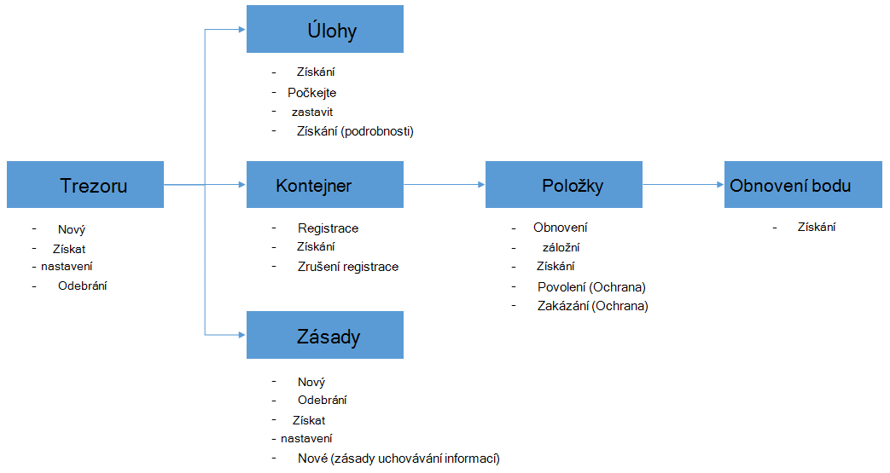

<properties
    pageTitle="Nasazením a správou zálohování pro VMs Azure pomocí prostředí PowerShell | Microsoft Azure"
    description="Zjistěte, jak nasazením a správou zálohování Azure pomocí prostředí PowerShell"
    services="backup"
    documentationCenter=""
    authors="markgalioto"
    manager="cfreeman"
    editor=""/>

<tags
    ms.service="backup"
    ms.workload="storage-backup-recovery"
    ms.tgt_pltfrm="na"
    ms.devlang="na"
    ms.topic="article"
    ms.date="08/08/2016"
    ms.author="markgal;trinadhk;jimpark" />


# <a name="deploy-and-manage-backup-for-azure-vms-using-powershell"></a>Nasazením a správou zálohování pro VMs Azure pomocí prostředí PowerShell

> [AZURE.SELECTOR]
- [Správce prostředků](backup-azure-vms-automation.md)
- [Klasický](backup-azure-vms-classic-automation.md)

V tomto článku se dozvíte, jak pomocí Powershellu Azure pro zálohování a obnovení Azure VMs. Azure obsahuje dva různé nasazení modely pro vytváření grafů a práci s prostředky: prostředek správce a klasické. Tento článek se věnuje pomocí klasického nasazení modelu. Microsoft doporučuje, že většina nových nasazení použití modelu správce prostředků.

## <a name="concepts"></a>Koncepty


Tento článek obsahuje informace specifické pro rutiny prostředí PowerShell slouží k obecnějším údajům virtuálních počítačích. Úvodní informace o ochraně Azure VMs najdete v článku [plánování záložní infrastrukturu OM v Azure](backup-azure-vms-introduction.md).

> [AZURE.NOTE] Než začnete, přečtěte si [požadavky](backup-azure-vms-prepare.md) nutný pro práci s Azure zálohování a [omezení](backup-azure-vms-prepare.md#limitations) aktuální řešení OM zálohování.

Efektivní pomocí Powershellu, udělejte si trochu času pochopit hierarchii objektů a od kde začít.



Dva nejdůležitější toků jsou povolení ochrany virtuálního počítače a obnovení dat z bodu obnovení. Na tento článek se zaměřuje týkající se stanou adept při práci s rutiny prostředí PowerShell povolit tyto dva scénáře.


## <a name="setup-and-registration"></a>Instalační program a registrace
Chcete-li začít:

1. [Stáhněte si nejnovější Powershellu](https://github.com/Azure/azure-powershell/releases) (minimální verze povinné: 1.0.0)

2. Vyhledání rutiny prostředí PowerShell zálohování Azure k dispozici tak, že zadáte tento příkaz:

```
PS C:\> Get-Command *azurermbackup*

CommandType     Name                                               Version    Source
-----------     ----                                               -------    ------
Cmdlet          Backup-AzureRmBackupItem                           1.0.1      AzureRM.Backup
Cmdlet          Disable-AzureRmBackupProtection                    1.0.1      AzureRM.Backup
Cmdlet          Enable-AzureRmBackupContainerReregistration        1.0.1      AzureRM.Backup
Cmdlet          Enable-AzureRmBackupProtection                     1.0.1      AzureRM.Backup
Cmdlet          Get-AzureRmBackupContainer                         1.0.1      AzureRM.Backup
Cmdlet          Get-AzureRmBackupItem                              1.0.1      AzureRM.Backup
Cmdlet          Get-AzureRmBackupJob                               1.0.1      AzureRM.Backup
Cmdlet          Get-AzureRmBackupJobDetails                        1.0.1      AzureRM.Backup
Cmdlet          Get-AzureRmBackupProtectionPolicy                  1.0.1      AzureRM.Backup
Cmdlet          Get-AzureRmBackupRecoveryPoint                     1.0.1      AzureRM.Backup
Cmdlet          Get-AzureRmBackupVault                             1.0.1      AzureRM.Backup
Cmdlet          Get-AzureRmBackupVaultCredentials                  1.0.1      AzureRM.Backup
Cmdlet          New-AzureRmBackupProtectionPolicy                  1.0.1      AzureRM.Backup
Cmdlet          New-AzureRmBackupRetentionPolicyObject             1.0.1      AzureRM.Backup
Cmdlet          New-AzureRmBackupVault                             1.0.1      AzureRM.Backup
Cmdlet          Register-AzureRmBackupContainer                    1.0.1      AzureRM.Backup
Cmdlet          Remove-AzureRmBackupProtectionPolicy               1.0.1      AzureRM.Backup
Cmdlet          Remove-AzureRmBackupVault                          1.0.1      AzureRM.Backup
Cmdlet          Restore-AzureRmBackupItem                          1.0.1      AzureRM.Backup
Cmdlet          Set-AzureRmBackupProtectionPolicy                  1.0.1      AzureRM.Backup
Cmdlet          Set-AzureRmBackupVault                             1.0.1      AzureRM.Backup
Cmdlet          Stop-AzureRmBackupJob                              1.0.1      AzureRM.Backup
Cmdlet          Unregister-AzureRmBackupContainer                  1.0.1      AzureRM.Backup
Cmdlet          Wait-AzureRmBackupJob                              1.0.1      AzureRM.Backup
```

Následující nastavení a registrace úkoly můžete automatické pomocí prostředí PowerShell:

- Vytvoření záložní trezoru
- Registrace VMs se službou Azure zálohování

### <a name="create-a-backup-vault"></a>Vytvoření záložní trezoru

> [AZURE.WARNING] Zákazníkům, kteří používají Azure zálohování poprvé musíte zaregistrovat Azure zálohování poskytovatele se nemusí používat se svým předplatným. Lze to spuštěním následujícího příkazu: Register AzureRmResourceProvider - ProviderNamespace "Microsoft.Backup"

Můžete vytvořit nový záložní trezoru pomocí rutinu **New-AzureRmBackupVault** . Zálohování trezoru je prostředek ARM, budete muset jeho umístění v rámci skupiny zdrojů. V konzole zvýšenými Azure PowerShell spusťte následující příkazy:

```
PS C:\> New-AzureRmResourceGroup –Name “test-rg” –Location “West US”
PS C:\> $backupvault = New-AzureRmBackupVault –ResourceGroupName “test-rg” –Name “test-vault” –Region “West US” –Storage GeoRedundant
```

Dostaňte seznam všech záložní trezorů v dané předplatného pomocí rutiny **Get-AzureRmBackupVault** .

> [AZURE.NOTE] Je vhodné uložit záložní trezoru objektu do proměnné. Objekt trezoru není potřeba jako vstup pro mnoho rutiny Azure zálohování.


### <a name="registering-the-vms"></a>Registrace VMs
První krok k nakonfigurování zálohování Azure záložní je zaregistrovat počítač nebo OM s Azure záložní trezoru. Rutina **Register AzureRmBackupContainer** zabírá zadávání informací virtuálního počítače Azure IaaS a zaregistruje s zadaný trezoru. Operace register přidružuje záložní trezoru Azure virtuálního počítače a sleduje OM během záložní životního cyklu.

Registrace vaší OM se službou Azure zálohování vytvoří objekt kontejner nejvyšší úrovně. Kontejner obvykle obsahuje více položek, které lze zálohovat, ale v případě VMs bude pouze jednu položku Zálohování kontejneru.

```
PS C:\> $registerjob = Register-AzureRmBackupContainer -Vault $backupvault -Name "testvm" -ServiceName "testvm"
```

## <a name="backup-azure-vms"></a>Zálohování Azure VMs

### <a name="create-a-protection-policy"></a>Vytvoření zásad ochrany
Není povinný k vytvoření nových zásad ochrany před zahájením zálohu vaší VMs. Trezoru získáváte "Výchozí zásady", můžete rychle umožňuje protection a potom později dát upravovat s podrobností vpravo. Seznam dostupných v trezoru zásady získáte pomocí rutiny **Get-AzureRmBackupProtectionPolicy** :

```
PS C:\> Get-AzureRmBackupProtectionPolicy -Vault $backupvault

Name                      Type               ScheduleType       BackupTime
----                      ----               ------------       ----------
DefaultPolicy             AzureVM            Daily              26-Aug-15 12:30:00 AM
```

> [AZURE.NOTE] Časové pásmo pole BackupTime v prostředí PowerShell je UTC. Když záložní času se zobrazují v portálu Azure, časové pásmo zarovnání na místní systém spolu s posun od UTC.

Zásady zálohování souvisí s alespoň jeden zásady uchovávání informací. Zásady uchovávání informací definuje, jak dlouho bod obnovení bude k dispozici pomocí Azure zálohování. Rutinu **New-AzureRmBackupRetentionPolicy** vytvoří prostředí PowerShell objekty, které obsahují informace o zásady uchovávání informací. Tyto objekty zásad uchovávání informací jsou používána jako vstupů rutinu *New-AzureRmBackupProtectionPolicy* , nebo přímo u rutinu *Enable-AzureRmBackupProtection* .

Zásady zálohování Určuje, kdy a jak často se provádí kopii položky. Rutinu **New-AzureRmBackupProtectionPolicy** vytvoří Powershellu objekt, který obsahuje informace o záložní zásadách. Zásady zálohování slouží předávat na vstupu rutině *Enable-AzureRmBackupProtection* .

```
PS C:\> $Daily = New-AzureRmBackupRetentionPolicyObject -DailyRetention -Retention 30
PS C:\> $newpolicy = New-AzureRmBackupProtectionPolicy -Name DailyBackup01 -Type AzureVM -Daily -BackupTime ([datetime]"3:30 PM") -RetentionPolicy $Daily -Vault $backupvault

Name                      Type               ScheduleType       BackupTime
----                      ----               ------------       ----------
DailyBackup01             AzureVM            Daily              01-Sep-15 3:30:00 PM
```

### <a name="enable-protection"></a>Povolení ochrany
Povolení ochrany zahrnuje dva objekty - položce a zásady, a jak potřebujete zařadit do stejné trezoru. Jakmile zásady přidružené k položce, bude zahájení záložní pracovního postupu si definovaný plán.

```
PS C:\> Get-AzureRmBackupContainer -Type AzureVM -Status Registered -Vault $backupvault | Get-AzureRmBackupItem | Enable-AzureRmBackupProtection -Policy $newpolicy
```

### <a name="initial-backup"></a>Počáteční zálohování
Plán zálohování zpracuje prováděním úplný počáteční kopii položky a přírůstková kopii pro pozdější zálohování. Ale pokud chcete vynutit počáteční zálohování stát na určitý čas minimálně i hned potom použijte **Zálohování AzureRmBackupItem** rutinu:

```
PS C:\> $container = Get-AzureRmBackupContainer -Vault $backupvault -Type AzureVM -Name "testvm"
PS C:\> $backupjob = Get-AzureRmBackupItem -Container $container | Backup-AzureRmBackupItem
PS C:\> $backupjob

WorkloadName    Operation       Status          StartTime              EndTime
------------    ---------       ------          ---------              -------
testvm          Backup          InProgress      01-Sep-15 12:24:01 PM  01-Jan-01 12:00:00 AM
```

> [AZURE.NOTE] Časové pásmo čas spuštění a čas_ukončení polí zobrazených v prostředí PowerShell je UTC. Když podobnými informacemi se zobrazují v portálu Azure, časové pásmo zarovnání na místní systémové hodiny.

### <a name="monitoring-a-backup-job"></a>Sledování úlohy zálohování
Většina operací dlouho probíhajících v Azure zálohování jsou modelována jako úlohu. To usnadňuje sledovat průběh bez nutnosti zachovat portálu Azure otevřít vždy.

Nejnovější stav úlohy v průběhu získáte pomocí rutiny **Get-AzureRmBackupJob** .

```
PS C:\> $joblist = Get-AzureRmBackupJob -Vault $backupvault -Status InProgress
PS C:\> $joblist[0]

WorkloadName    Operation       Status          StartTime              EndTime
------------    ---------       ------          ---------              -------
testvm          Backup          InProgress      01-Sep-15 12:24:01 PM  01-Jan-01 12:00:00 AM
```

Místo dotazování tyto úlohy pro dokončení – tedy nepotřebných další kód – je jednodušší použít rutinu **Čekání AzureRmBackupJob** . Při použití skript, rutinu bude počkat spuštění dokončí úloha nebo zadaný časový limit.

```
PS C:\> Wait-AzureRmBackupJob -Job $joblist[0] -Timeout 43200
```


## <a name="restore-an-azure-vm"></a>Obnovení Azure OM

Abyste mohli obnovit záložních dat, je třeba určit položku Zálohování a obnovení bod, který obsahuje data v okamžiku. Tyto informace se dodává rutině obnovení AzureRmBackupItem zahajte obnovení dat z trezoru k účtu zákazníka.

### <a name="select-the-vm"></a>Vyberte OM

Získat prostředí PowerShell objekt, který identifikuje položka doprava zálohování, musíte začít v kontejneru v trezoru a směrem dolů objekt hierarchie. Chcete-li vybrat kontejneru představující OM, získáte pomocí rutiny **Get-AzureRmBackupContainer** a kanálu, který rutinu **Get-AzureRmBackupItem** .

```
PS C:\> $backupitem = Get-AzureRmBackupContainer -Vault $backupvault -Type AzureVM -name "testvm" | Get-AzureRmBackupItem
```

### <a name="choose-a-recovery-point"></a>Zvolte bod obnovení

Nyní můžete seznam všech bodů obnovení záložní položky pomocí rutiny **Get-AzureRmBackupRecoveryPoint** a zvolte bod obnovení obnovit. Uživatelé obvykle v seznamu vyberte poslední bod *AppConsistent* .

```
PS C:\> $rp =  Get-AzureRmBackupRecoveryPoint -Item $backupitem
PS C:\> $rp

RecoveryPointId    RecoveryPointType  RecoveryPointTime      ContainerName
---------------    -----------------  -----------------      -------------
15273496567119     AppConsistent      01-Sep-15 12:27:38 PM  iaasvmcontainer;testvm;testv...
```

Proměnná ```$rp``` je maticových obnovení bodů pro vybrané zálohy položky, seřazené v obráceném pořadí dobu – nejnovější bod obnovení je v indexu 0. Pomocí indexování standardní prostředí PowerShell pole vyberte bod obnovení. Příklad: ```$rp[0]``` vybereme nejnovější bod obnovení.

### <a name="restoring-disks"></a>Obnovení disků

Je klíčové rozdíl mezi obnově Hotovo prostřednictvím portálu Azure a Azure Powershellu. Pomocí prostředí PowerShell obnovení zastavuje na obnovení disků a konfigurace informace ze bod obnovení. Nedojde k vytvoření virtuálního počítače.

> [AZURE.WARNING] Obnovení AzureRmBackupItem nevytvoří virtuálního počítače. Obnoví jen disků k tomuto účtu zadaný úložiště. Toto není ke stejnému chování, které budou mít v portálu Azure.

```
PS C:\> $restorejob = Restore-AzureRmBackupItem -StorageAccountName "DestAccount" -RecoveryPoint $rp[0]
PS C:\> $restorejob

WorkloadName    Operation       Status          StartTime              EndTime
------------    ---------       ------          ---------              -------
testvm          Restore         InProgress      01-Sep-15 1:14:01 PM   01-Jan-01 12:00:00 AM
```

Podrobnosti o obnovení pomocí rutiny **Get-AzureRmBackupJobDetails** po dokončení obnovení projektu, můžete získat. Vlastnost *ErrorDetails* bude mít informace potřebné k znovu vytvořit OM.

```
PS C:\> $restorejob = Get-AzureRmBackupJob -Job $restorejob
PS C:\> $details = Get-AzureRmBackupJobDetails -Job $restorejob
```

### <a name="build-the-vm"></a>Vytvoření OM

Vytváření OM mimo obnovená disků lze provést pomocí starší rutiny prostředí PowerShell Správa služby Azure nové šablony správce prostředků Azure nebo dokonce na portálu Azure. Rychlý příklad ukážeme postup pomocí rutiny pro správu služby Azure.

```
 $properties  = $details.Properties

 $storageAccountName = $properties["Target Storage Account Name"]
 $containerName = $properties["Config Blob Container Name"]
 $blobName = $properties["Config Blob Name"]

 $keys = Get-AzureStorageKey -StorageAccountName $storageAccountName
 $storageAccountKey = $keys.Primary
 $storageContext = New-AzureStorageContext -StorageAccountName $storageAccountName -StorageAccountKey $storageAccountKey


 $destination_path = "C:\Users\admin\Desktop\vmconfig.xml"
 Get-AzureStorageBlobContent -Container $containerName -Blob $blobName -Destination $destination_path -Context $storageContext


$obj = [xml](((Get-Content -Path $destination_path -Encoding UniCode)).TrimEnd([char]0x00))
 $pvr = $obj.PersistentVMRole
 $os = $pvr.OSVirtualHardDisk
 $dds = $pvr.DataVirtualHardDisks
 $osDisk = Add-AzureDisk -MediaLocation $os.MediaLink -OS $os.OS -DiskName "panbhaosdisk"
 $vm = New-AzureVMConfig -Name $pvr.RoleName -InstanceSize $pvr.RoleSize -DiskName $osDisk.DiskName

 if (!($dds -eq $null))
 {
     foreach($d in $dds.DataVirtualHardDisk)
     {
         $lun = 0
         if(!($d.Lun -eq $null))
         {
             $lun = $d.Lun
         }
         $name = "panbhadataDisk" + $lun
     Add-AzureDisk -DiskName $name -MediaLocation $d.MediaLink
     $vm | Add-AzureDataDisk -Import -DiskName $name -LUN $lun
    }
}

New-AzureVM -ServiceName "panbhasample" -Location "SouthEast Asia" -VM $vm
```

Další informace o tom, jak vytvořit OM z obnovená disků přečtěte si o tyto rutiny:

- [Přidání AzureDisk](https://msdn.microsoft.com/library/azure/dn495252.aspx)
- [Nové AzureVMConfig](https://msdn.microsoft.com/library/azure/dn495159.aspx)
- [Nové AzureVM](https://msdn.microsoft.com/library/azure/dn495254.aspx)

## <a name="code-samples"></a>Ukázky

### <a name="1-get-the-completion-status-of-job-sub-tasks"></a>1. získáte stav dokončení dílčích úkolů projektu

Chcete-li sledovat stav dokončení jednotlivé dílčí úkoly, můžete použít rutinu **Get-AzureRmBackupJobDetails** :

```
PS C:\> $details = Get-AzureRmBackupJobDetails -JobId $backupjob.InstanceId -Vault $backupvault
PS C:\> $details.SubTasks

Name                                                        Status
----                                                        ------
Take Snapshot                                               Completed
Transfer data to Backup vault                               InProgress
```

### <a name="2-create-a-dailyweekly-report-of-backup-jobs"></a>2. Vytvořte sestavu denně nebo týdně úloh zálohování

Správci obvykle určitě zajímat úlohy zálohování spustili za posledních 24 hodin, stav tyto úlohy zálohování. Navíc množství dat přenášené poskytuje správcům způsob k odhadu jejich měsíční použití data. Skript dole použije jako nezpracovaná data ze služby Azure zálohování a zobrazí informace v konzole Powershellu.

```
param(  [Parameter(Mandatory=$True,Position=1)]
        [string]$backupvaultname,

        [Parameter(Mandatory=$False,Position=2)]
        [int]$numberofdays = 7)


#Initialize variables
$DAILYBACKUPSTATS = @()
$backupvault = Get-AzureRmBackupVault -Name $backupvaultname
$enddate = ([datetime]::Today).AddDays(1)
$startdate = ([datetime]::Today)

for( $i = 1; $i -le $numberofdays; $i++ )
{
    # We query one day at a time because pulling 7 days of data might be too much
    $dailyjoblist = Get-AzureRmBackupJob -Vault $backupvault -From $startdate -To $enddate -Type AzureVM -Operation Backup
    Write-Progress -Activity "Getting job information for the last $numberofdays days" -Status "Day -$i" -PercentComplete ([int]([decimal]$i*100/$numberofdays))

    foreach( $job in $dailyjoblist )
    {
        #Extract the information for the reports
        $newstatsobj = New-Object System.Object
        $newstatsobj | Add-Member -Type NoteProperty -Name Date -Value $startdate
        $newstatsobj | Add-Member -Type NoteProperty -Name VMName -Value $job.WorkloadName
        $newstatsobj | Add-Member -Type NoteProperty -Name Duration -Value $job.Duration
        $newstatsobj | Add-Member -Type NoteProperty -Name Status -Value $job.Status

        $details = Get-AzureRmBackupJobDetails -Job $job
        $newstatsobj | Add-Member -Type NoteProperty -Name BackupSize -Value $details.Properties["Backup Size"]
        $DAILYBACKUPSTATS += $newstatsobj
    }

    $enddate = $enddate.AddDays(-1)
    $startdate = $startdate.AddDays(-1)
}

$DAILYBACKUPSTATS | Out-GridView
```

Pokud chcete přidat možností vytváření grafů k této výstup sestavy, dozvíte na příspěvek na blog TechNet [Průvodce grafem pomocí prostředí PowerShell](http://blogs.technet.com/b/richard_macdonald/archive/2009/04/28/3231887.aspx)

## <a name="next-steps"></a>Další kroky

Pokud preferujete používání prostředí PowerShell provozovat s Azure zdrojů, podívejte se na článek Powershellu pro ochranu systému Windows Server, [nasazení a správu zálohy systému Windows Server](./backup-client-automation-classic.md). Je také článek prostředí PowerShell pro správu DPM zálohy, [nasazení a správu zálohování pro DPM](./backup-dpm-automation-classic.md). Z těchto článků mají verze pro nasazení Správce prostředků, jakož i klasické nasazení.
