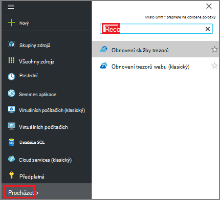
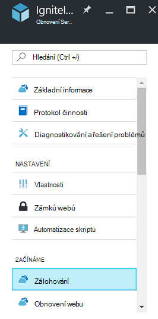
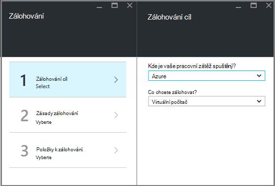
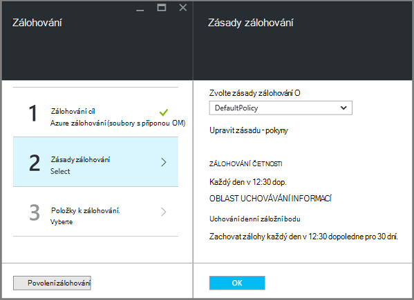
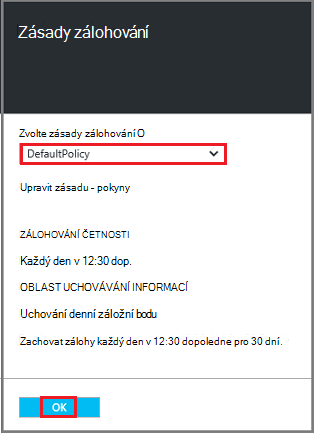
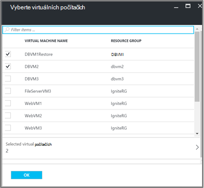
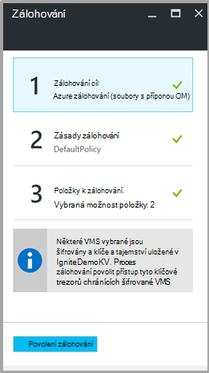

<properties
   pageTitle="Zálohování a obnovení zašifrovaných VMs zálohování Azure"
   description="Tento článek pojednává o zálohování a obnovení prostředí pro VMs šifrovaná pomocí šifrování disku Azure."
   services="backup"
   documentationCenter=""
   authors="JPallavi"
   manager="vijayts"
   editor=""/>
<tags
   ms.service="backup"
   ms.devlang="na"
   ms.topic="article"
   ms.tgt_pltfrm="na"
   ms.workload="storage-backup-recovery"
   ms.date="10/25/2016"
   ms.author="markgal; jimpark; trinadhk"/>

# Zálohování a obnovení zašifrovaných VMs zálohování Azure

Tento článek pojednává o postup zálohování a obnovení virtuálních počítačích pomocí Azure zálohování. Také poskytuje podrobnosti o podporovaných scénáře, předpoklady a řešení potíží pro názvy případů chyby.

## Podporované scénáře

> [AZURE.NOTE]
1.  Zálohování a obnovení šifrované VMs je podporována pouze pro správce prostředků nasazené virtuálních počítačích. Není podporovaná pro klasické virtuálních počítačích.  
2.  Tuto možnost podporuje pouze pro virtuálních počítačích šifrovaná pomocí šifrovací klíč BitLocker a klíč šifrovacího klíče. Není podporovaná pro virtuálních počítačích šifrovaná pouze pomocí šifrovací klíč BitLocker.  

## Předpoklady

1.  Zašifrovaný virtuálního počítače pomocí [Šifrování disku Azure](../security/azure-security-disk-encryption.md). Je možné zašifrovat, pomocí šifrovací klíč BitLocker a klíč šifrovacího klíče.
2.  Obnovení služby trezoru byly vytvořeny a replikace úložiště nastavit pomocí kroků uvedených v článku [Příprava prostředí pro zálohování](backup-azure-arm-vms-prepare.md).

## Zálohování zašifrovaných OM
Pomocí následujících kroků nastavení zálohování cíle, definování zásad, konfigurace položek a aktivační událost zálohy.

### Konfigurace zálohování

1. Pokud už máte služby Recovery trezoru otevřete, pokračujte dalším krokem. Pokud nemáte služby Recovery trezoru otevřít, ale jsou na portálu Azure v nabídce centrální, klikněte na **Procházet**.

  - V seznamu zdrojů zadejte **Obnovení služby**.
  - Jakmile začnete psát, filtry seznamu na základě vašich zadání. Pokud se zobrazí **služby Recovery trezorů**, klikněte na něj.
  
        

    Zobrazí se seznam služby Recovery trezorů. Ze seznamu služby Recovery trezorů Výběr trezoru.

    Otevře vybranou trezoru řídicího panelu.

2. Ze seznamu položek, které se zobrazí v části trezoru klikněte na tlačítko **zálohování** otevřete zásuvné zálohování.

       
    
3. Na zásuvné zálohování klepněte na **zálohování cíl** otevřete zásuvné cíl zálohování.

       
    
4.   Zálohování cíl zásuvné nastavte na **kterém běží vaše pracovní zátěž** na Azure a **Co chcete zálohovat** do virtuálního počítače, klikněte na tlačítko **OK**.

    Zavře zásuvné zálohování cíl a otevře zásuvné zásad zálohování.

       

5. Na zásuvné zásad zálohování vyberte záložní zásadu, který chcete použít trezoru a klepněte na **OK**.

       

    Podrobnosti o výchozí zásady jsou uvedené v části podrobností. Pokud chcete vytvořit zásady, vyberte **Vytvořit nový** z rozevírací nabídky. Po kliknutí na tlačítko **OK**zásady zálohování je přidružený trezoru.

    Klikněte na další VMs, ke kterému chcete přidružit trezoru.
    
6. Zvolte šifrované virtuálních počítačích přidružit zadané zásady a klikněte na **OK**.

      
   
7. Tato stránka zobrazuje zprávu o klíčové trezoru přidružené k šifrované VMs vybrané. Zálohování služby vyžaduje jen pro čtení přístup k klíče a tajemství klíčové trezoru. Pomocí těchto oprávnění k zálohování spolu s tajná spolu s přidruženými VMs. 

      

      Teď, když jste definovali všechna nastavení pro trezoru v zásuvné zálohování, klikněte na tlačítko Povolit zálohování v dolní části stránky. Povolit zálohování nasazuje zásady trezoru a VMs.

8. Další fáze při přípravě instaluje agenta OM nebo jak zajistit Agent OM je nainstalovaný. Stejně postupujte i, pomocí kroků uvedených v článku [Příprava prostředí pro zálohování](backup-azure-arm-vms-prepare.md). 

### Spouštěcí úloh zálohování
Postupujte podle pokynů uvedených v článku [Záložní Azure VMs trezoru služby obnovení](backup-azure-arm-vms.md) záložní úlohy aktivační událost.

## Obnovení šifrované OM
Obnovení prostředí pro zašifrované a bez šifrování virtuálních počítačích je stejný. Postupujte podle pokynů uvedených v poli [Obnovit virtuálních počítačích Azure portálu](backup-azure-arm-restore-vms.md) obnovit zašifrované OM. V případě potřeby obnovit klíče a tajemství musíte se ujistit, že by již existují tohoto klíče trezoru jejich obnovení.

## Poradce při potížích s chybami

| Operace | Podrobnosti o chybě | Rozlišení |
| -------- | -------- | -------|
| Zálohování | Ověření se nezdařilo jako zašifrované virtuálního počítače pomocí BEK samostatně. Zálohování může být užitečné jenom pro virtuálních počítačích zašifrovaných BEK a KEK. | Virtuální počítač zašifrovat pomocí BEK a KEK. Až to používat zálohování. |
| Obnovení | Tento šifrované OM nedokáže obnovit, protože klíčové trezoru přidružený k této OM neexistuje. | Vytvoření klíčových trezoru pomocí [Začít pracovat s Azure klíč trezoru](../key-vault/key-vault-get-started.md). Naleznete v článku [obnovení klíčové trezoru spolu s tajná zálohování Azure](backup-azure-restore-key-secret.md) obnovit klíč a tajná, pokud nejsou prezentovat. |
| Obnovení | Tento šifrované OM nedokáže obnovit, protože spolu s tajná přidružený k této OM není k dispozici. | Naleznete v článku [obnovení klíčové trezoru spolu s tajná zálohování Azure](backup-azure-restore-key-secret.md) obnovit klíč a tajná, pokud nejsou prezentovat. |
