<properties
    pageTitle="Nejdřív najděte: ochrana Azure VMs pomocí služby trezoru obnovení | Microsoft Azure"
    description="Chraňte Azure VMs pomocí služby trezoru obnovení. Ochrana dat pomocí zálohy nasazený správce prostředků VMs, nasazený klasické VMs a VMs úložiště Premium. Vytvořit a zaregistrovat trezoru služby obnovení. Registrovat VMs, vytvoření zásad a ochrany VMs v Azure."
    services="backup"
    documentationCenter=""
    authors="markgalioto"
    manager="cfreeman"
    editor=""
    keyword="backups; vm backup"/>

<tags
    ms.service="backup"
    ms.workload="storage-backup-recovery"
    ms.tgt_pltfrm="na"
    ms.devlang="na"
    ms.topic="hero-article"
    ms.date="10/13/2016"
    ms.author="markgal; jimpark"/>

# Nejdřív najděte: ochrana Azure VMs pomocí služby trezoru obnovení

> [AZURE.SELECTOR]
- [Ochrana VMs s trezoru služby obnovení](backup-azure-vms-first-look-arm.md)
- [Ochrana VMs s záložní trezoru](backup-azure-vms-first-look.md)

Tento kurz vás provede kroky pro vytvoření trezoru služby obnovení a zálohování Azure virtuálního počítače (OM). Obnovení služby trezorů zamknout:

- Azure VMs nasazený správce prostředků
- Klasický VMs
- Standardní úložiště VMs
- Úložiště Premium VMs
- VMs šifrovaná pomocí šifrování disku Azure s BEK a KEK

Další informace týkající se ochrany Premium úložiště VMs najdete v tématu [zálohování a obnovení VMs Premium úložiště](backup-introduction-to-azure-backup.md#back-up-and-restore-premium-storage-vms)

>[AZURE.NOTE] Tento kurz předpokládá, že už máte virtuálního počítače předplatné Azure a, že jste provedli míry povolit službu záložní pro přístup k OM.

[AZURE.INCLUDE [learn-about-Azure-Backup-deployment-models](../../includes/backup-deployment-models.md)]

Na vysoké úrovni tady je postup, které je potřeba udělat.  

1. Vytvořte trezoru služby obnovení virtuálního počítače.
2. Pomocí portálu Azure vyberte situace, nastavení zásad a určete položky chránit.
3. Spusťte počáteční zálohování.

## Vytvoření trezoru služby obnovení pro virtuálního počítače

Obnovení služby trezoru je entitu, která ukládá všechny zálohování a obnovení body, které již byly vytvořeny v čase. Obnovení služby trezoru obsahuje také použita chráněné VMs záložní zásada.

>[AZURE.NOTE] Zálohování VMs je místní proces. Nelze zálohujete VMs z jednoho místa do trezoru služby obnovení do jiného umístění. Pro každý Azure umístění VMs k zálohování, Ano, alespoň jeden obnovení služby trezoru musí existovat v uvedeném umístění.

Vytvoření trezoru služby obnovení:

1. Přihlaste se k [portálu Azure](https://portal.azure.com/).

2. V nabídce centrální klikněte na tlačítko **Procházet** a v seznamu zdrojů, zadejte **Obnovení služby**. Jakmile začnete psát, filtry seznamu na základě vašich zadání. Klikněte na **služby Recovery trezoru**.

      

    Zobrazí seznam trezorů služby obnovení.

3. V nabídce **trezorů obnovení služby** klikněte na **Přidat**.

    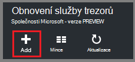

    Zásuvné trezoru služby Recovery se otevře, která vás vyzve, abyste jim poslali **název** **předplatného**, **Skupina zdroje**a **umístění**.

    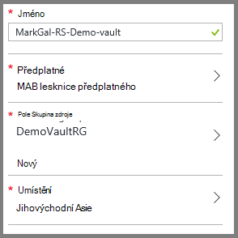

4. Pole **název**zadejte popisný název k identifikaci trezoru. Název musí být jedinečná Azure předplatného. Zadejte název, který obsahuje 2 až 50 znaků. Musí začínat písmenem a můžou obsahovat jenom písmena, číslice a spojovníky.

5. Klikněte na **předplatné** zobrazíte dostupná seznam předplatných. Pokud nevíte jistě, které předplatné můžete použít výchozí (nebo doporučovány) předplatného. Existuje několik možností jenom v případě, že účet organizace je přidružená k víc předplatných Azure.

6. **Pole Skupina zdroje** zobrazíte seznamu dostupné zdroje skupin nebo klikněte na **Nová** skupina zdroje. Podrobné informace o skupiny zdrojů najdete v článku [Přehled Správce prostředků Azure](../azure-resource-manager/resource-group-overview.md)

7. Klikněte na **umístění** vyberte zeměpisná oblast pro trezoru. Trezoru **musí** být ve stejné oblasti jako virtuálních počítačích, které chcete zamknout.

    >[AZURE.IMPORTANT] Pokud si nejste jisti umístění, ve které vaše OM existuje, zavřete dialog Vytvoření trezoru a přejděte na seznam virtuálních počítačích na portálu. Pokud máte virtuálních počítačích ve více oblastech, vytvořte trezoru služby obnovení v jednotlivých oblastech. Vytvoření trezoru na prvním místě před přechodem do následujícího umístění. Je potřeba zadat úložiště účty pro ukládání záložních dat – trezoru služby obnovení a služba Azure záložní obsloužení to automaticky.

8. Klikněte na **vytvořit**. Ji může chvíli trvat, než trezoru služby obnovení vytvořit. Sledujte oznámení o stavu v pravé horní části na portálu. Po vytvoření trezoru se zobrazí v seznamu trezorů služby obnovení.

    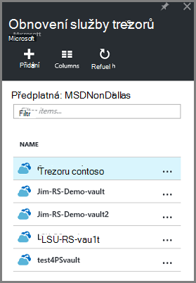

Teď, když jste vytvořili trezoru, přečtěte si, jak nastavit replikace úložiště.

### Nastavení replikace úložiště

Možnosti replikace úložiště umožňuje vybrat mezi geo nadbytečné úložiště a místně nadbytečné úložiště. Ve výchozím nastavení obsahuje trezoru geo nadbytečné úložiště. Nechte možnost nastavenou na geo nadbytečné úložiště, pokud se jedná zálohování primární. Pokud chcete levnější možnost, která není jako trvalé vyberte místně nadbytečné úložiště. Další informace o [geo nadbytečné](../storage/storage-redundancy.md#geo-redundant-storage) [místně nadbytečné](../storage/storage-redundancy.md#locally-redundant-storage) úložiště možnosti a v [úložišti Azure replikace přehled](../storage/storage-redundancy.md).

Úprava nastavení replikace úložiště:

1. Vyberte trezoru otevřete řídicí panel trezoru a zásuvné nastavení. Pokud se **Nastavení** zásuvné neotevře, klikněte na **všechna nastavení** na řídicím panelu trezoru.

2. Na zásuvné **Nastavení** klikněte na tlačítko **Zálohování infrastruktury** > **Konfiguraci zálohování** otevřete zásuvné **Konfiguraci zálohování** . Na zásuvné **Zálohování konfigurace** vyberte možnost replikace úložiště pro trezoru.

    

    Po výběru možnosti úložiště pro trezoru, jste připraveni OM přidružit trezoru. Zahájíte přidružení by měly objevit a zaregistrovat Azure virtuálních počítačích.

## Vyberte záložní cíl, nastavení zásad a definujte položky chránit

Před registrací OM s trezoru, spusťte proces zjišťování zajistit, že jsou určeny všechny virtuálních počítačích přidané k předplatnému. Proces dotazů Azure seznam virtuálních počítačích v předplatného, spolu s dalšími informacemi, jako je název služby cloudu a oblasti. Na portálu Azure scénář odkazuje na co chcete umístit do služby trezoru obnovení. Zásady je plán intervalu a kdy byla přijata obnovení body. Zásady také oblasti uchovávání informací u bodů obnovení.

1. Pokud už máte služby recovery trezoru otevřít, přejděte ke kroku 2. Pokud nemáte obnovení služby trezoru otevřít, ale jsou na portálu Azure v nabídce centrální, klikněte na **Procházet**.

  - V seznamu zdrojů zadejte **Obnovení služby**.
  - Jakmile začnete psát, filtry seznamu na základě vašich zadání. Pokud se zobrazí **služby Recovery trezorů**, klikněte na něj.

      

    Zobrazí se seznam trezorů služby obnovení.
  - V seznamu trezorů služby obnovení vyberte trezoru.

    Otevře vybranou trezoru řídicího panelu.

    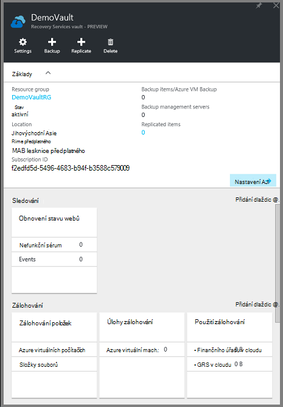

2. V nabídce trezoru řídicího panelu klikněte na tlačítko **zálohování** otevřete zásuvné zálohování.

    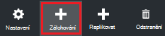

    Až se otevře zásuvné službu zálohování vyhledá všechny nové VMs v předplatného.

    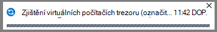

3. Na zásuvné zálohování klepněte na **zálohování cíl** otevřete zásuvné cíl zálohování.

    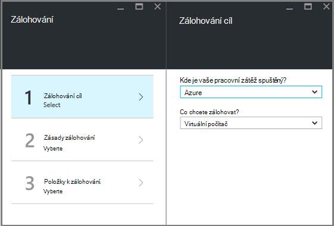

4. Zálohování cíl zásuvné nastavte na **kterém běží vaše pracovní zátěž** na Azure a **Co chcete zálohovat** do virtuálního počítače, klikněte na tlačítko **OK**.

    Zavře zásuvné zálohování cíl a otevře zásuvné zásad zálohování.

    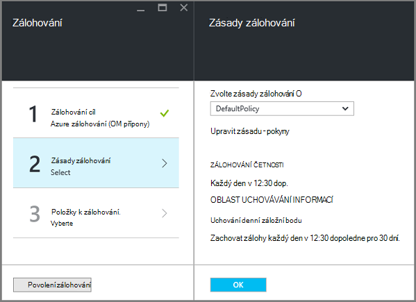

5. Na zásuvné zásad zálohování vyberte záložní zásadu, který chcete použít trezoru a klepněte na **OK**.

    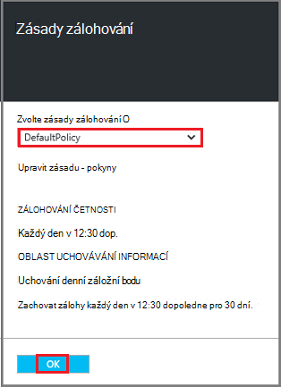

    Podrobnosti o výchozí zásady jsou uvedené v části podrobností. Pokud chcete vytvořit zásady, vyberte **Vytvořit nový** z rozevírací nabídky. V rozevírací nabídce také poskytuje možnost přepněte doba při snímku je, 19: 00. Pokyny k definování záložní zásad naleznete v tématu [definování zásady zálohování](backup-azure-vms-first-look-arm.md#defining-a-backup-policy). Po kliknutí na tlačítko **OK**zásady zálohování je přidružený trezoru.

    Klikněte na další VMs, ke kterému chcete přidružit trezoru.

6. Zvolte virtuálních počítačích přidružit zadané zásady a klikněte na **Výběr**.

    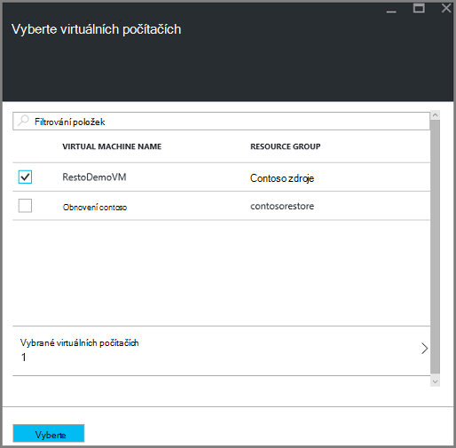

    Pokud není požadovaný OM, zkontrolujte, že existuje ve stejném umístění Azure jako služby Recovery trezoru.

7. Teď, když jste definovali všechna nastavení pro trezoru v zásuvné zálohování, klikněte na tlačítko **Povolit zálohování** v dolní části stránky. To nasadí zásady trezoru a VMs.

    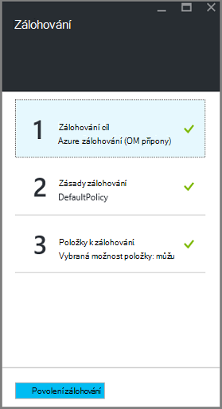

## Počáteční zálohování

Jakmile zásady zálohování byly nasazeny na virtuální počítač, který neznamená má byla zálohovat data. Ve výchozím nastavení je první naplánované zálohování (podle zásady zálohování) počáteční zálohování. Dokud počáteční zálohování poslední záložní stav na zásuvné **Úlohy zálohování** se zobrazí jako **upozornění (počáteční záložní kopie čeká na vyřízení)**.

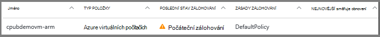

Pokud zálohování počáteční je splatná zahájíte brzy bude k dispozici, je vhodné spustit **obecnějším údajům**.

Spuštění **Zálohovat**:

1. Na řídicím panelu trezoru na dlaždici **zálohování** klikněte na **virtuálních počítačích Azure**  
    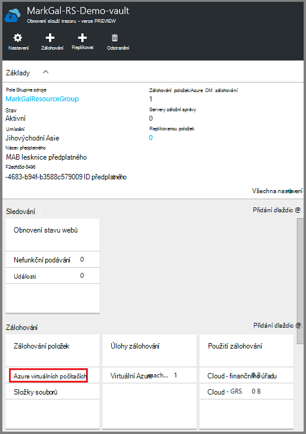

    Otevře se zásuvné **Zálohování položek** .

2. Na zásuvné **Zálohování položek** trezoru, které chcete zálohovat, pravým tlačítkem klikněte na **Zálohovat**.

    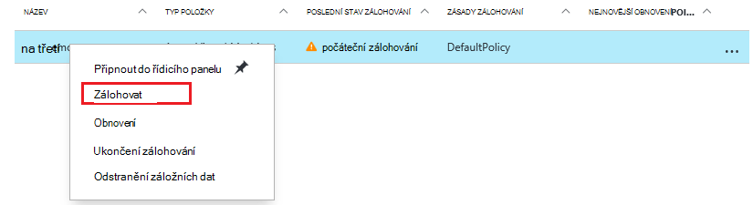

    Je spuštěná úloha zálohování.  

    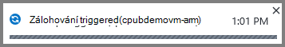

3. Chcete-li zobrazit, že zálohování počáteční dokončí, na řídicím panelu trezoru na dlaždici **Úlohy zálohování** klikněte na **Azure virtuálních počítačích**.

    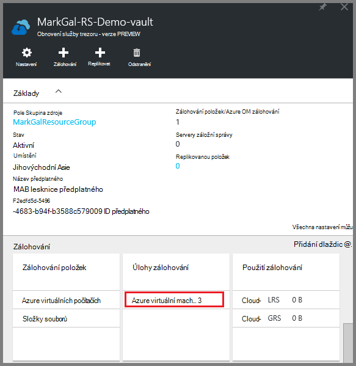

    Otevře se zásuvné úlohy zálohování.

4. V zásuvné úlohy zálohování můžete zobrazit stav všech projektů.

    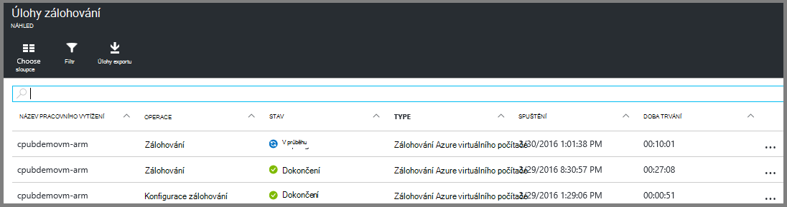

    >[AZURE.NOTE] V rámci zálohování problémy se službou Azure záložní příkazu záložní rozšíření v jednotlivých OM vyprázdnění všechny zápisy a konzistentní snímek.

    Po dokončení úloh zálohování stav je *Dokončeno*.

[AZURE.INCLUDE [backup-create-backup-policy-for-vm](../../includes/backup-create-backup-policy-for-vm.md)]

## Nainstalovat na počítač virtuální agenta OM

Tyto informace je k dispozici v případě, že není potřeba. Agent OM Azure musí být nainstalovaný v počítači Azure virtuální koncovku zálohování pracovat. Ale pokud váš OM byla vytvořená z Galerie Azure, pak Agent OM již existuje v virtuální počítač. VMs, které se migrují od místního datacentrech by agenta OM nainstalovali. V takovém případě agenta OM potřeba nainstalovat. Pokud máte problémy zálohování OM Azure, zkontrolujte, že je Agent OM Azure správně nainstalovaný v počítači virtuální (viz tabulka dole). Pokud jste vytvořili vlastní OM, před virtuálního počítače, [Ujistěte se, že je zaškrtnuto políčko **nainstalovat agenta OM** ](../virtual-machines/virtual-machines-windows-classic-agents-and-extensions.md) máte k dispozici.

Informace o [OM Agent](https://go.microsoft.com/fwLink/?LinkID=390493&clcid=0x409) a [jak ji nainstalovat](../virtual-machines/virtual-machines-windows-classic-manage-extensions.md).

Následující tabulka obsahuje další informace o OM Agent pro Windows a Linux VMs.

| **Operace** | **Windows** | **Linux** |
| --- | --- | --- |
| Instalace agenta OM | <li>Stáhněte a nainstalujte [agent MSI](http://go.microsoft.com/fwlink/?LinkID=394789&clcid=0x409). Musíte mít oprávnění správce a dokončete instalaci. <li>Vyznačení, že je nainstalovaný agent [Aktualizovat vlastnost OM](http://blogs.msdn.com/b/mast/archive/2014/04/08/install-the-vm-agent-on-an-existing-azure-vm.aspx) . | <li> Nainstalujte nejnovější [Linux agent](https://github.com/Azure/WALinuxAgent) z GitHub. Musíte mít oprávnění správce a dokončete instalaci. <li> Vyznačení, že je nainstalovaný agent [Aktualizovat vlastnost OM](http://blogs.msdn.com/b/mast/archive/2014/04/08/install-the-vm-agent-on-an-existing-azure-vm.aspx) . |
| Aktualizace agenta OM | Aktualizace agenta OM je jednoduchá – stačí přeinstalace [OM Agent binární](http://go.microsoft.com/fwlink/?LinkID=394789&clcid=0x409).  Ujistěte se, jestli je spuštěný žádné zálohování době, kdy je aktualizován agenta OM. | Postupujte podle pokynů k [aktualizaci Agent OM Linux ](../virtual-machines-linux-update-agent.md).  Ujistěte se, jestli je spuštěný žádné zálohování době, kdy je aktualizován agenta OM. |
| Ověřování instalaci OM agenta | <li>Přejděte do složky *C:\WindowsAzure\Packages* OM Azure. <li>Nenajdete prezentovat WaAppAgent.exe soubor.<li> Klikněte pravým tlačítkem myši na soubor, přejděte na **Vlastnosti**a pak klikněte na kartu **Podrobnosti** . Pole verze produktu by měl být 2.6.1198.718 nebo vyšší. | NENÍ K DISPOZICI |

### Zálohování rozšíření

Po instalaci agenta OM počítače virtuální službu Azure záložní nainstaluje záložní rozšíření agenta OM. Služba Azure záložní bezproblémové aktualizuje a opravy záložní rozšíření bez zásahu další uživatele.

Služba zálohování nainstalovat záložní rozšíření, jestli je spuštěný OM. Průběžný OM nabízí největší pravděpodobnost získání bod konzistenci aplikací obnovení. Nadále obecnějším údajům OM, i když je normálně vypnuté a rozšíření nešlo nainstalovat, ale služba Azure zálohování. Jedná se o jako Offline OM. V tomto případě bod obnovení budou *konzistentní z hlediska chyb*.

## Informace o odstraňování potíží
Pokud máte problémy s provádění některých úkolů v tomto článku, použijte [pokyny pro řešení potíží](backup-azure-vms-troubleshoot.md).

## Ceny
Azure zálohování OM strhne příslušná založené na modelu chráněné instance. Další informace o [Cenách zálohování](https://azure.microsoft.com/pricing/details/backup/)

## Otázky?
Pokud máte nějaké dotazy nebo pokud je všechny funkce, které chcete zobrazit však započítávány, [napište nám](http://aka.ms/azurebackup_feedback).
