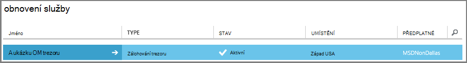
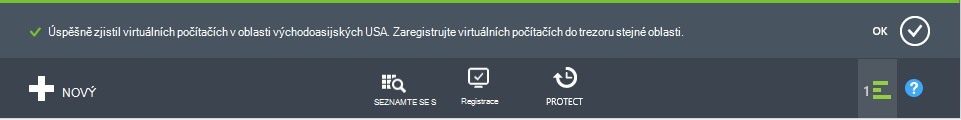

<properties
    pageTitle="Pohledu: Ochrana Azure VMs s záložní trezoru | Microsoft Azure"
    description="Chraňte Azure VMs zálohování trezoru. Kurz vysvětluje vytvořit trezoru zaregistrovat VMs, vytvoření zásad a ochrany VMs v Azure."
    services="backup"
    documentationCenter=""
    authors="markgalioto"
    manager="cfreeman"
    editor=""/>

<tags
    ms.service="backup"
    ms.workload="storage-backup-recovery"
    ms.tgt_pltfrm="na"
    ms.devlang="na"
    ms.topic="hero-article"
    ms.date="09/15/2016"
    ms.author="markgal; jimpark"/>

# Nejdřív najděte: zálohování Azure virtuálních počítačích

> [AZURE.SELECTOR]
- [Ochrana VMs s trezoru služby obnovení](backup-azure-vms-first-look-arm.md)
- [Ochrana Azure VMs s záložní trezoru](backup-azure-vms-first-look.md)

Tento kurz vás provede kroky pro zálohování Azure virtuálního počítače (OM) do záložní trezoru v Azure. Tento článek popisuje klasické nebo model Správce služeb nasazení, zálohování VMs. Pokud máte zájem zálohování virtuálního počítače do trezoru obnovení služby, které patří do skupiny zdrojů, přečtěte si článek [nejdřív najděte: ochrana VMs s trezoru služby obnovení](backup-azure-vms-first-look-arm.md). Pro úspěšné dokončení tohoto kurzu, musí existovat tyto požadavky:

- Vytvořili jste OM předplatné Azure.
- OM má připojení k Azure veřejnou IP adres. Další informace najdete v tématu [připojení k síti](./backup-azure-vms-prepare.md#network-connectivity).

Chcete-li obecnějším údajům virtuálního počítače, máte pět hlavních kroků:  

 vytvořte záložní trezoru nebo označte existující záložní trezoru.  
 pomocí portálu Azure klasické vyhledat a zaregistrovat virtuálních počítačích.  
 instalace agenta OM.  
 vytvářet zásady ochrany virtuálních počítačích.  
 spustit zálohování.

>[AZURE.NOTE] Azure obsahuje dva modely nasazení pro vytváření grafů a práci s prostředky: [Správce zdrojů a klasické](../resource-manager-deployment-model.md). Tento kurz je pro použití s VMs vytvořené v portálu Azure klasické. Služba Azure zálohování podporuje VMs na základě správce prostředků. Podrobnosti o zálohování VMs do služby trezoru obnovení najdete v tématu [první seznámení: ochrana VMs s trezoru služby obnovení](backup-azure-vms-first-look-arm.md).

## Krok 1: vytvoření záložní trezoru pro virtuálního počítače

Zálohování trezoru je entitu, která ukládá všechny zálohování a obnovení body, které již byly vytvořeny v čase. Zálohování trezoru obsahuje také záložní zásad, které jsou použity pro virtuálních počítačích zálohování.

1. Přihlaste se k [Azure klasické portálu](http://manage.windowsazure.com/).

2. V levém dolním rohu portálu Azure klikněte na **Nový**

    

3. V průvodci vytvořit klikněte na **Datové služby** > **Služby Recovery** > **Zálohování trezoru** > **Vytvořit**.

    

    Průvodce vás vyzve k **jména** a **oblast**. Pokud spravujete víc předplatných, zobrazí se dialogové okno pro výběr předplatné.

4. Pole **název**zadejte popisný název k identifikaci trezoru. Název musí být jedinečná Azure předplatného.

5. V **oblasti**vyberte zeměpisná oblast pro trezoru. Trezoru **musí** být ve stejné oblasti jako virtuálních počítačích, které chrání.

    Pokud si nejste jisti oblast, ve které vaše OM existuje, zavřete průvodce a klikněte na **virtuálních počítačích** v seznamu Azure služeb. Název oblasti, najdete ve sloupci umístění. Pokud máte virtuálních počítačích ve více oblastech, vytvořte záložní trezoru v jednotlivých oblastech.

6. Pokud v Průvodci se dialog **předplatného** , přejděte k dalšímu kroku. Pokud pracujete s víc předplatných vyberte předplatné přidružit nové záložní trezoru.

    

7. Klikněte na **vytvořit trezoru**. Může to trvat dlouho pro záložní trezoru vytvořit. Sledujte oznámení o stavu v dolní části na portálu.

    

    Zobrazí se zpráva potvrzující vytvořené trezoru byly úspěšně. Je uvedená na stránce **služby Recovery** jako **aktivní**.

    

8. V seznamu trezorů na stránce **Služby Recovery** vyberte trezoru jste vytvořili při otevření stránky **Rychlý Start** .

    

9. Na stránce **Snadné spuštění** klikněte na **Konfigurovat** , čímž otevřete Možnosti replikace úložiště.
    

10. Na možnosti **replikace úložiště** zvolte možnosti replikace trezoru.

    

    Ve výchozím nastavení obsahuje trezoru geo nadbytečné úložiště. Pokud se jedná zálohování primární zvolte geo nadbytečné úložiště. Pokud chcete levnější možnost, která není úplně trvalé vyberte místně nadbytečné úložiště. Přečtěte si další informace o možnostech geo redundantních a místně nadbytečné úložiště v [úložišti Azure replikace přehled](../storage/storage-redundancy.md).

Po výběru možnosti úložiště pro trezoru, jste připraveni OM přidružit trezoru. Aby se spouštělo přidružení, seznamte se s a zaregistrovat Azure virtuálních počítačích.

## Krok 2: Objevte a zaregistrovat Azure virtuálních počítačích
Před registrací OM s trezoru, spusťte proces zjišťování k identifikaci nové VMs. Tento příkaz vrátí seznam virtuálních počítačích v předplatného, spolu s dalšími informacemi jako název služby cloudu a oblasti.

1. Přihlaste se k [Azure klasické portálu](http://manage.windowsazure.com/)

2. Na portálu Azure klasické klikněte na **Služby Recovery** otevřete seznam služby Recovery trezorů.
    

3. V seznamu trezorů vyberte trezoru k obecnějším údajům virtuálního počítače.

    Po výběru trezoru Pozvánka se otevře na **Úvodní** stránce

4. V nabídce trezoru klikněte na **Registered položky**.

    

5. V nabídce **Typ** vyberte **Azure virtuálního počítače**.

    

6. Klikněte na **vyhledávací** v dolní části stránky.
    

    Proces zjišťování může trvat několik minut, když jsou právě: tabulkový virtuálních počítačích. Existuje oznámení v dolní části obrazovky, který upozorňuje, jestli je spuštěný proces.

    

    Oznámení změn po procesu dokončit.

    

7. Klikněte na **ZAREGISTROVAT** v dolní části stránky.
    

8. V místní nabídce **Zaregistrovat položky** vyberte virtuálních počítačích, které chcete zaregistrovat.

    >[AZURE.TIP] Najednou lze zaregistrovat více virtuálních počítačích.

    Úlohy se vytvoří pro každé virtuální počítač, který jste vybrali.

9. Klikněte na **Zobrazení projektu** v oznámení přejděte na stránku **úlohy** .

    

    Virtuální počítač se bude zobrazovat i v seznamu registrované položek spolu s stav operace registrace.

    

    Po dokončení operace stav změní tak, aby odrážely stavu *registrován* .

    

## Krok 3 – nainstalovat na počítač virtuální agenta OM

Agent OM Azure musí být nainstalovaný v počítači Azure virtuální koncovku zálohování pracovat. Pokud vaše OM byla vytvořená z Galerie Azure, Agent OM již je v OM. Můžete přejít k [ochraně svého VMs](backup-azure-vms-first-look.md#step-4-protect-azure-virtual-machines).

Pokud vaše OM migraci z místního datacentra OM pravděpodobně nemá agenta OM nainstalovaný. Agent OM musíte nainstalovat na počítač virtuální teprve potom přejděte k ochraně OM. Podrobnosti o instalaci agenta OM najdete v [části OM Agent článku zálohy VMs](backup-azure-vms-prepare.md#vm-agent).

## Krok 4 – vytvoření zásady zálohování
Před aktivace počáteční úlohy zálohování nastavte plán při zálohování snímky. Plán při přesměrováni záložních snímků a časový interval tyto snímky se zachovají, je zásady zálohování. Informace o uchovávání informací je založena na schéma historických nadřazeného SYN záložní otočení.

1. Přejděte na záložní trezoru ve skupinovém rámečku **Obnovení služby** Azure klasické portálu a klikněte na **Registered položky**.
2. V rozevírací nabídce vyberte **Azure virtuálního počítače** .

    

3. Klepněte na tlačítko **UZAMKNOUT** v dolní části stránky.
    

    **Průvodce chránit položky** se zobrazí a seznamy *pouze* virtuálních počítačích, které jsou registrovány a není chráněn.

    

4. Vyberte virtuálních počítačích, které chcete zamknout.

    Pokud existují dva nebo více virtuálních počítačích se stejným názvem, použijte Cloudovou službu k rozlišení mezi virtuálních počítačích.

5. V nabídce **Konfigurovat ochranu** vyberte existující zásady nebo vytvořte nové zásady pro ochranu virtuálních počítačích, které jste určili.

    Nové zálohování trezorů mít výchozí zásady spojené s trezoru. Tuto zásadu zabírá denní snímek každý odpolední a denní snímek se zachovají 30 dní. Každý zásady zálohování může obsahovat více virtuálních počítačích s ním spojené. Však virtuálního počítače lze pouze přidružené k jednu zásadu najednou.

    

    >[AZURE.NOTE] Zásady zálohování obsahuje schématu uchovávání informací pro plánované zálohování. Pokud vyberete možnost stávající záložní zásadu, nebude možné změnit možnosti uchovávání informací v dalším kroku.

6. V **Oblasti uchovávání informací** definujte obor denně, týdně, měsíční a roční pro konkrétní záložní body.

    

    Zásady uchovávání informací Určuje časový interval pro ukládání zálohování. Můžete určit, zásady uchovávání informací různých podle toho, kdy se považuje zálohování.

7. Klikněte na tlačítko **úlohy** zobrazíte seznam úloh **Konfigurace zámek** .

    

    Teď jste zřídit zásadu, přejděte k dalšímu kroku a spusťte počáteční zálohování.

## Krok 5: počáteční zálohování

Jakmile se zásadami chráněn virtuálního počítače, můžete zobrazit danou relaci na kartě **Chráněné položky** . Dokud počáteční zálohování **Stav ochrany** se zobrazí jako **chráněného - (čeká na počáteční zálohování)**. Ve výchozím nastavení je první naplánované zálohování *Počáteční zálohování*.

Spuštění počáteční zálohování:

1. Na stránce **Chráněné položky** klikněte na **Zálohovat** v dolní části stránky.
    

    Služba Azure záložní vytvoří úlohy zálohování použitých při počáteční zálohování.

2. Klikněte na kartu **úloh** seznam všech projektů.

    

    Po dokončení počáteční zálohování stav virtuálního počítače na kartě **Chráněné položky** je *chráněného*.

    

    >[AZURE.NOTE] Zálohování virtuálních počítačích je místní proces. Nelze zálohujete virtuálních počítačích v jednom regionu záložní trezoru v jiné oblasti. Pro každý Azure oblast, která obsahuje VMs, které je potřeba zálohovat, Ano, musí být alespoň jeden záložní trezoru vytvořeny v dané oblasti.

## Další kroky
Teď byste měli úspěšně zálohovat virtuálního počítače, existuje několik další kroky, které by mohly být zajímavé. Většina logické krokem je seznámení s obnovování dat na virtuálního počítače. Můžou ale nastat úlohy správy, které vám pomůže pochopit, jak uchovávat data v bezpečí a minimalizace náklady.

- [Správa a sledování virtuálních počítačích](backup-azure-manage-vms.md)
- [Obnovení virtuálních počítačích](backup-azure-restore-vms.md)
- [Pokyny pro řešení potíží](backup-azure-vms-troubleshoot.md)

## Otázky?
Pokud máte nějaké dotazy nebo pokud je všechny funkce, které chcete zobrazit však započítávány, [napište nám](http://aka.ms/azurebackup_feedback).
