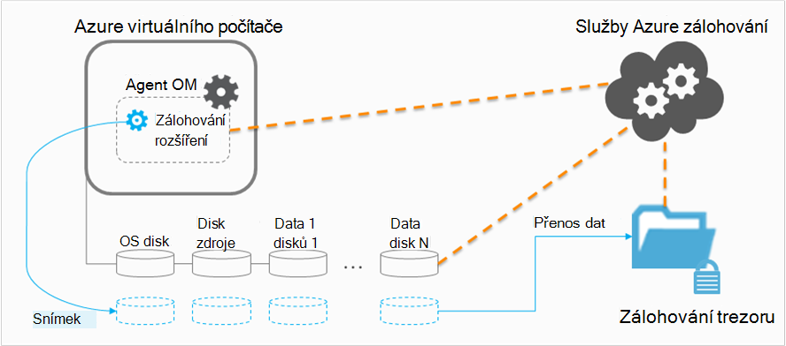

<properties
    pageTitle="Plánování záložní infrastrukturu OM v Azure | Microsoft Azure"
    description="Důležité informace při plánování obecnějším údajům virtuálních počítačích v Azure"
    services="backup"
    documentationCenter=""
    authors="markgalioto"
    manager="cfreeman"
    editor=""
    keywords="zálohování vms, obecnějším údajům virtuálních počítačích"/>

<tags
    ms.service="backup"
    ms.workload="storage-backup-recovery"
    ms.tgt_pltfrm="na"
    ms.devlang="na"
    ms.topic="article"
    ms.date="10/19/2016"
    ms.author="trinadhk; jimpark; markgal;"/>

# <a name="plan-your-vm-backup-infrastructure-in-azure"></a>Plánování záložní infrastrukturu OM v Azure
Tento článek obsahuje výkon a návrhy zdroje týkající se plánování záložní infrastrukturu OM. Definuje také klíčové aspekty zálohování služeb; Tyto aspekty může být důležité při určování architektuře se plánování kapacity. Pokud jste [počítat prostředí](backup-azure-vms-prepare.md), je to dalším krokem před zahájením [záložní VMs](backup-azure-vms.md). Pokud budete potřebovat další informace o Azure virtuálních počítačích, najdete v [dokumentaci virtuálních počítačích](https://azure.microsoft.com/documentation/services/virtual-machines/).

## <a name="how-does-azure-back-up-virtual-machines"></a>Jak služba Azure zálohovat virtuálních počítačích?
Když službu Azure záložní iniciuje úlohy zálohování naplánovaný, spustí koncovku záložní na snímek v daném okamžiku. Tento snímek věnovat společně s stín kopie svazku služby (VSS) vstoupit konzistentní snímek disků virtuální počítač bez nutnosti vypnout.

Po snímku, se považuje, data předán službou Azure záložní záložní trezoru. Proces zálohování efektivnější, službu identifikuje a přenese pouze bloky dat, které byly změněny od posledního zálohování.



Po dokončení převodu dat tento snímek odebrán a obnovení bod je vytvořen.

### <a name="data-consistency"></a>Konzistence dat
Zálohování a obnovování obchodní důležitá data komplikovaně podle toho, který kritické obchodní data je nutné zálohovat při aplikace, které vytvoří data jsou spuštěné. Při řešení to, umožňuje Azure zálohování konzistenci aplikací zálohování Microsoft úloh pomocí VSS zajistit, že data správně napsali k základnímu úložišti.

>[AZURE.NOTE] Linux virtuálních počítačích pouze konzistentní soubor zálohy jsou možné, protože Linux, které neobsahují odpovídající platformu do aplikace VSS.

Azure zálohování převezme úplné zálohování VSS Windows VMs (Další informace o [VSS úplné zálohování](http://blogs.technet.com/b/filecab/archive/2008/05/21/what-is-the-difference-between-vss-full-backup-and-vss-copy-backup-in-windows-server-2008.aspx)). Chcete-li povolit záložní kopie VSS pod registru vyžaduje klíčů potřeba nastavit OM.

```
[HKEY_LOCAL_MACHINE\SOFTWARE\MICROSOFT\BCDRAGENT]
"USEVSSCOPYBACKUP"="TRUE"
```


Tato tabulka vysvětluje typy konzistenci a podmínky, které se objeví v části během Azure OM zálohování a obnovení postupy.

| Soulad | Na základě VSS | Vysvětlení a podrobností |
|-------------|-----------|---------|
| Soulad aplikace | Ano | To je ideální konzistence typ pracovního vytížení Microsoft jako zajišťuje, aby:<ol><li> OM *spouštění*. <li>Neexistuje *žádné poškození*. <li>Neexistuje *žádné ztrátě dat*.<li> Data jsou konzistentní s aplikaci používající data, tak, že týkající se uplatňování zálohování – pomocí aplikace VSS. v době</ol> Většina pracovního vytížení Microsoft mít VSS autoři, které se zátěží na projektu specifické akce, které se vztahují k konzistence dat. Microsoft SQL Server má například zápis VSS., která zajišťuje, že zápisy k souboru protokolu transakce a databázi dělají správně.<br><br> Pro Azure OM zálohy, začíná bod konzistenci aplikací obnovení znamená, že, že zálohování rozšíření bylo možno volat pracovní postup VSS a *správně* dokončit před snímek OM. Samozřejmě znamená to, že byla VSS autory všechny aplikace v Azure OM uplatněna taky.<br><br>(Naučte se [Základy VSS](http://blogs.technet.com/b/josebda/archive/2007/10/10/the-basics-of-the-volume-shadow-copy-service-vss.aspx) a ponoříte hlouběji tmavě do podrobnosti o [tom, jak to funguje](https://technet.microsoft.com/library/cc785914%28v=ws.10%29.aspx)). |
| Soulad systému souborů | Ano - pro počítače se systémem Windows | Existují dva scénáře, přičemž může platit bod obnovení *systému souborů konzistentní*:<ul><li>Zálohování Linux VMs v Azure, protože Linux, které neobsahují odpovídající platformu do aplikace VSS.<li>Chyba při VSS během zálohování pro Windows VMs v Azure.</li></ul> V obou těchto případech je nejlepší, kterou lze provést zajistit, aby: <ol><li> OM *spouštění*. <li>Neexistuje *žádné poškození*.<li>Neexistuje *žádné ztrátě dat*.</ol> Aplikace je třeba implementovat vlastní mechanismus "oprava nakreslenými" na obnovená data.|
| Selhat konzistence | Ne | Tato situace odpovídá virtuálního počítače dochází k "zhroucení" (přes buď měkké nebo tvrdé reset). Obvykle k tomu dochází při vypnutí Azure virtuálního počítače v době zálohování. Záloh Azure virtuálního počítače začíná střední bod pád konzistentní obnovení této zálohy Azure nabízí žádné záruky kolem konzistence data úložiště střední – z hlediska operačního systému nebo z pohledu aplikace. Pouze data, která už existuje na disku při zálohování je co získá zaznamenávání a zálohovat. <br/> <br/> I když jsou ve většině případů, bez záruky se spustí operačního systému. Obvykle následuje postup kontroly disku, jako je chkdsk, chcete-li vyřešit chyby poškození. Data v paměti ani zápisy, které nebyly úplně vyprázdnění na disk budou ztraceny. Aplikace se obvykle sleduje s vlastním mechanismus ověřování v případě, že data vrácení je potřeba udělat. <br><br>Jako příklad Pokud transakční protokol má položky, které nejsou k dispozici v databázi, klikněte software pro databázový znamená vrácení zpět, dokud nejsou data konzistentní. Při dat je rozšířit mezi více virtuální disků (jako jsou rozložené svazky), čárky pád konzistentní obnovení poskytuje žádné záruky správnost data.|


## <a name="performance-and-resource-utilization"></a>Využití prostředků a výkonu
Stejně jako záložní software, který je nasazený místně byste měli naplánovat kapacitu a využití prostředků potřeb při zálohování VMs v Azure. [Omezení úložiště Azure](azure-subscription-service-limits.md#storage-limits) určit, jak strukturovat OM nasazení dosáhli maximálního výkonu minimální vliv na spuštění pracovního vytížení.

Věnujte pozornost následující omezení Azure úložiště při plánování záložní výkon:

- Výstupní Max jednoho účtu úložiště
- Celkové žádost sazbu vztaženou na účtu úložiště

### <a name="storage-account-limits"></a>Účet limitů úložiště
Pokaždé, když záložní data zkopírována z účtu úložiště, ho spočítá směrem vstupní a výstupní operace za sekundu (procesorů) a výstupním (nebo výkon) metriky úložišť účtu. Ve stejnou dobu virtuálních počítačích spuštěná a jinými procesorů a výkon. Cílem je zajistěte, aby že celkové přenosy - zálohování a virtuální počítače, nesmí překročit limitů úložiště účtu.

### <a name="number-of-disks"></a>Počet disků
Zálohování proces pokusí k dokončení úloh zálohování co nejdříve. Přitom zabere tolik zdrojů, které se může. Všechny operací jsou ale omezený podle *Cílové výkon pro jeden objektů Blob*, která může obsahovat maximálně 60 MB sekundu. Při pokusu o maximalizace jeho rychlosti záložní proces pokusí obecnějším údajům všech OM disků *současně*. Ano Pokud OM má čtyři disků, zálohování Azure pokusí obecnějším údajům všechny čtyři disků souběžně. Proto nejdůležitější faktor určující záložní přenosy ukončení účet zákazníka úložiště je **počet disků** zálohování z účtu úložiště.

### <a name="backup-schedule"></a>Plán zálohování
Další faktor, které mají vliv výkonem je **plán zálohování**. Pokud jste nakonfigurovali zásady tak všechny VMs zálohují ve stejnou dobu, jste naplánovali džemu přenosy. Zálohování proces pokusí obecnějším údajům všech discích souběžně. Je jedním ze způsobů snížení záložní přenosů z účtu úložiště: Zajistěte, aby že se zálohovala různých VMs v různou dne se nepřekrývaly.

## <a name="capacity-planning"></a>Plánování kapacity
Uvedení následujících skutečností společně znamená, že je potřeba správně plánované použití účtu úložiště. Stáhněte si [OM záložní kapacitu plánování Excelovou tabulku](https://gallery.technet.microsoft.com/Azure-Backup-Storage-a46d7e33) zobrazíte dopad disku a možnosti plánu zálohování.

### <a name="backup-throughput"></a>Zálohování výkon
Pro každý disk zálohování Azure záložní přečte bloky na disku a uloží pouze změněná data (zálohování). Tato tabulka ukazuje průměr výkon hodnoty, můžete očekávat při zálohování Azure. Tímto způsobem můžete odhadu množství času, který bude trvat obecnějším údajům disk dané velikosti.

| Zálohování | Nejlepší výkon |
| ---------------- | ---------- |
| Počáteční zálohování | 160 MB / |
| Zálohování (DR) | 640 MB / <br><br> Tento výkon můžete značně sníží při spoustu rozdělený konve na disku, který je možné zálohovat. |

## <a name="total-vm-backup-time"></a>Celkový čas záložní OM
Během většinou záložní času stráveného ve čtení a kopírování dat, jsou další operace, které přispívají k celkovou dobu potřebnou k obecnějším údajům virtuálního počítače:

- Čas potřebný k [instalaci nebo aktualizovat záložní rozšíření](backup-azure-vms.md#offline-vms).
- Čas snímku, což je doba aktivovat snímek. Snímky se spouštějí zavřít plánované záložní čas.
- Fronta prodleva. Vzhledem k tomu, že služba zálohování zpracovává zálohy z více zákazníků, kopírování záložního ze snímku do zálohování a obnovení služby trezoru proběhnout okamžitě. Čas ve špičce zatížení, čekání můžete roztažení až 8 hodin z důvodu počet zálohy zpracovávání. Celkový čas záložní OM však bude kratší než 24 hodin denně záložní zásad.

## <a name="best-practices"></a>Doporučené postupy
Měli byste po tyto postupy při konfiguraci zálohování virtuálních počítačích:

- Není naplánovat více než čtyři klasický VMs ze stejného cloudovou službu k obecnějším údajům ve stejnou dobu. Doporučujeme rozptylu záložní spouštění o hodiny, pokud chcete obecnějším údajům více VMs ze stejného cloudové služby.
- Plánovat vytváření více než 40 VMs správce prostředků používaný k obecnějším údajům ve stejnou dobu.
- Plánování OM zálohování době a pozvolným tak, aby zálohování služba používá pro přenos dat z účtu zákazníka úložiště k zálohování procesorů nebo obnovení služby trezoru.
- Ujistěte se, zásadu adresy VMs rozšířit mezi účty různých úložiště. Měli byste maximálně 20 celkové disků z účtu jednoho úložiště chráněny jednu zásadu. Pokud máte účet úložiště větší než 20 disků, roztáhněte tyto VMs mezi více zásad získat požadované procesorů během převodu fáze procesu zálohování.
- Neobnovíte OM spuštěna skladování Premium stejný účet úložiště. Pokud operace obnovování shoduje s zálohování, snižuje dostupné procesorů pro zálohování.
- Doporučujeme spouštět každý OM Premium na účet různých premium úložiště zajistit optimální výkon zálohování.

## <a name="data-encryption"></a>Šifrování

Azure zálohování není šifrování dat jako součást procesu zálohování. Můžete však šifrování dat v rámci OM a obecnějším údajům chráněná data Bezproblémová (Další informace o [záložní šifrované dat](backup-azure-vms-encryption.md)).


## <a name="how-are-protected-instances-calculated"></a>Jak se počítají chráněné instance?
Azure virtuálních počítačích, které se zálohovala prostřednictvím Azure zálohování se vztahují [ceny Azure zálohování](https://azure.microsoft.com/pricing/details/backup/). Výpočet chráněné instance vychází z *skutečnou* velikostí virtuálního počítače, který představuje součet všech dat v virtuálního počítače – s výjimkou "zdroje disku".

*Není* fakturované založeny na maximální velikost, který je podporovaný pro každý disk dat připojených k virtuální počítač, ale na dat uložených na disku data. Podobně úložišti faktury podle objemu dat uložených v Azure zálohování, což je součtem skutečných dat v jednotlivých bodech obnovení.

Například trvat A2 standardní velikosti virtuální počítač, který má dvě doplňující disků maximální velikosti 1 TB. Následující tabulka obsahuje dat uložených ve všech těchto discích:

|Typ disku|Maximální velikost|Prezentace dat|
|---------|--------|------|
| Operační systém disku | 1023 GB | 17 GB |
| Místní disk / disku zdroje | 135 GB | 5 GB (není součástí pro zálohování) |
| Disk dat 1 | 1023 GB | 30 GB |
| Disk dat 2 | 1023 GB | 0 GB |

*Skutečná* velikost virtuální počítač je v tomto případě 17 GB + 30 GB + 0 GB = 47 GB. Toto je založený na měsíční faktura velikosti chráněné Instance. Podle objemu dat ve počítače virtuální roste, chráněné Instance velikost použitá k fakturaci také se změní.

Fakturace se nespustí až do dokončení první úspěšné zálohy. V tomto okamžiku se spustí fakturace pro ukládání a chráněné instance. Fakturace budou dál problémy, dokud je *všech zálohování dat uložených s Azure záložní* virtuálního počítače. Provedení operace odemknout není vypnout fakturace, pokud záložní data se zachovají.

Fakturace pro zadané virtuální počítač bude ukončené, jen když ochrana je zastaveno *a* zálohování dat se odstraní. Jakmile žádné aktivní úlohy zálohování (při ochraně zastavil), bude velikost virtuálního počítače v době poslední úspěšné zálohy velikosti chráněné Instance založeného na měsíční faktury.

## <a name="questions"></a>Otázky?
Pokud máte nějaké dotazy nebo pokud je všechny funkce, které chcete zobrazit však započítávány, [napište nám](http://aka.ms/azurebackup_feedback).

## <a name="next-steps"></a>Další kroky

- [Obecnějším údajům virtuálních počítačích](backup-azure-vms.md)
- [Správa zálohování virtuálního počítače](backup-azure-manage-vms.md)
- [Obnovení virtuálních počítačích](backup-azure-restore-vms.md)
- [Poradce při potížích záložní OM](backup-azure-vms-troubleshoot.md)
