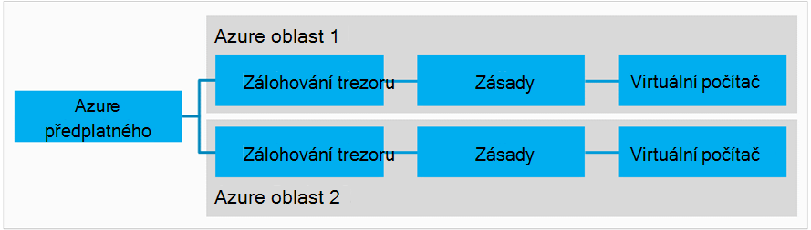
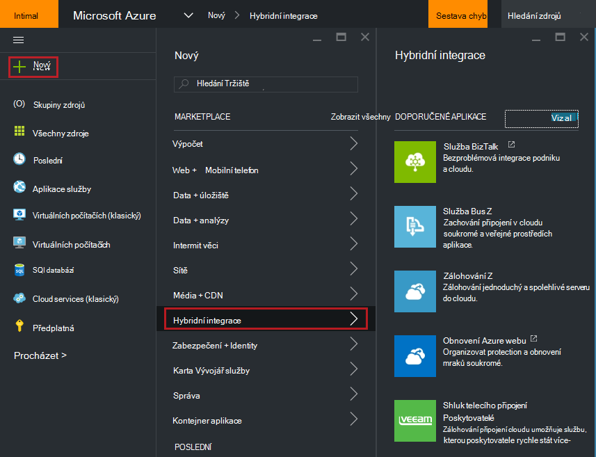
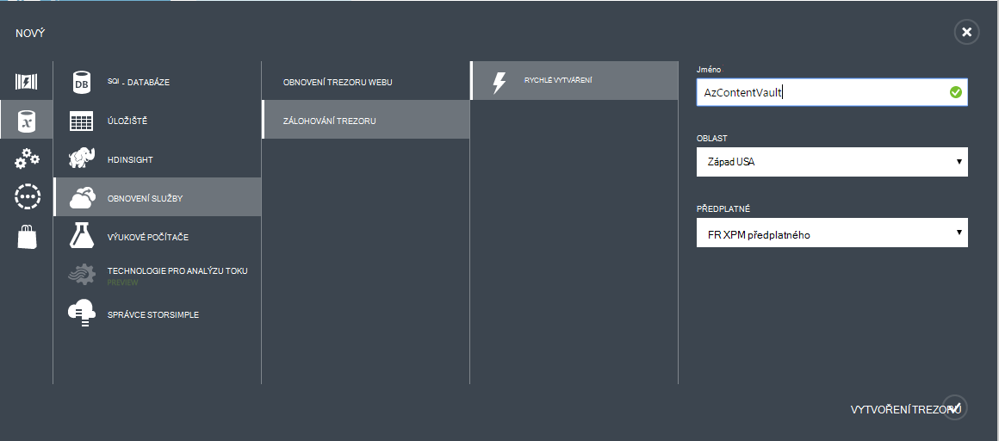
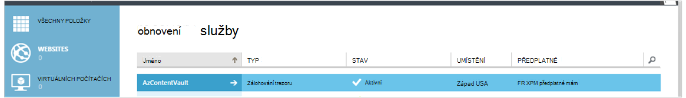
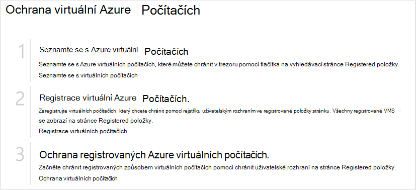
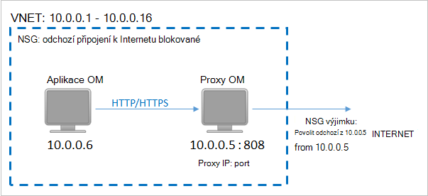
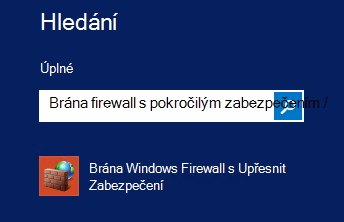
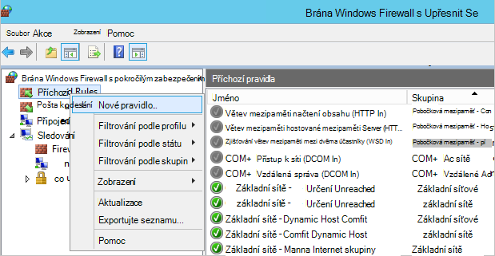
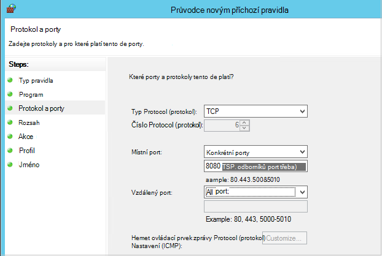

<properties
    pageTitle="Příprava prostředí k obecnějším údajům Azure virtuálních počítačích | Microsoft Azure"
    description="Zkontrolujte, jestli že je vaše prostředí počítat zálohování virtuálních počítačích v Azure"
    services="backup"
    documentationCenter=""
    authors="markgalioto"
    manager="cfreeman"
    editor=""
    keywords="zálohování. zálohování;"/>

<tags
    ms.service="backup"
    ms.workload="storage-backup-recovery"
    ms.tgt_pltfrm="na"
    ms.devlang="na"
    ms.topic="article"
    ms.date="08/26/2016"
    ms.author="trinadhk; jimpark; markgal;"/>


# <a name="prepare-your-environment-to-back-up-azure-virtual-machines"></a>Příprava prostředí k obecnějším údajům Azure virtuálních počítačích

> [AZURE.SELECTOR]
- [Model správce prostředků](backup-azure-arm-vms-prepare.md)
- [Klasický modelu](backup-azure-vms-prepare.md)

Než může zálohovat Azure virtuálního počítače (OM), kde používáte tři podmínky, které musí existovat.

- Potřebujete vytvořit záložní trezoru nebo identifikovat existujícího záložní trezoru *ve stejné oblasti jako svého OM*.
- Vytvoření připojení k síti mezi Azure veřejné internetové adresy a koncové body Azure úložiště.
- Agent OM nainstalujte OM.

Pokud víte, že tyto podmínky již existují ve vašem prostředí potom pokračujte [obecnějším údajům VMs článek](backup-azure-vms.md). V opačném Čtěte dál, tento článek vás provede kroky k přípravě prostředí k obecnějším údajům OM Azure.


## <a name="limitations-when-backing-up-and-restoring-a-vm"></a>Omezení při zálohování a obnovování virtuálního počítače

>[AZURE.NOTE] Azure obsahuje dva modely nasazení pro vytváření grafů a práci s prostředky: [Správce zdrojů a klasický](../resource-manager-deployment-model.md). Následující seznam obsahuje omezení při nasazení modelu klasické.

- Zálohování virtuálních počítačích s víc než 16 disků dat není podporovaná.
- Zálohování virtuálních počítačích s rezervovaná IP adresa a není definované koncový bod není podporovaná.
- Zálohování dat neobsahuje síťové připojení jednotky připojené k OM. 
- Nahrazení stávajících virtuálního počítače během obnovení není podporovaná. Odstraňte nejdříve existující virtuálního počítače a všechny přidružené disků a obnovte data ze zálohy.
- Více oblastí zálohování a obnovení není podporovaná.
- Zálohování virtuálních počítačích pomocí služby Azure zálohování je podporována ve všech veřejné oblastech Azure (viz [Kontrolní](https://azure.microsoft.com/regions/#services) seznam podporovaných oblastí). Pokud oblast, kterou hledáte není podporovaná dnes, ta se nezobrazí v rozevíracím seznamu při vytváření trezoru.
- Zálohování virtuálních počítačích pomocí služby Azure zálohování je podporována pouze pro Zvolte operační systém verze:
  - **Linux**: Azure zálohování podporuje [seznam distribuce, které jsou potvrzena Azure](../virtual-machines/virtual-machines-linux-endorsed-distros.md) kromě Core s operačním systémem Linux. Další distribuce přenést-e-vlastní-Linux také může pracovat, dokud je k dispozici v počítači virtuální agenta OM a podpora Python existuje.
  - **Windows Server**: verze starší než Windows Server 2008 R2 nejsou podporované.
- Obnovení řadiče domény OM (Datacentrum), která je součástí více Datacentrum konfigurace je podporována pouze prostřednictvím Powershellu. Další informace o [obnovení řadiče domény řadiče domény s víc](backup-azure-restore-vms.md#restoring-domain-controller-vms).
- Obnovení virtuálních počítačích, které mají následující konfigurace zvláštní sítě je podporována pouze prostřednictvím Powershellu. VMs vytvářených pomocí obnovit pracovní postup v uživatelském rozhraní nemá síťové konfigurace po dokončení obnovení. Další informace najdete v tématu [Obnovení VMs s konfigurací zvláštní sítě](backup-azure-restore-vms.md#restoring-vms-with-special-netwrok-configurations).
    - Virtuálních počítačích ve skupinovém rámečku konfigurace vyrovnávání zatížení (interní a externí)
    - Virtuálních počítačích s více rezervovaná adres IP
    - Virtuálních počítačích s více síťové adaptéry

## <a name="create-a-backup-vault-for-a-vm"></a>Vytvoření záložní trezoru pro virtuálního počítače

Zálohování trezoru je entitu, která ukládá všechny zálohování a obnovení body, které již byly vytvořeny v čase. Zálohování trezoru obsahuje také záložní zásady uplatňované virtuálních počítačích zálohování.

Tento obrázek ukazuje relace mezi různými Azure zálohování:     

Vytvoření záložní trezoru:

1. Přihlaste se k [portálu Azure](http://manage.windowsazure.com/).

2. Na portálu Azure klikněte na **Nový** > **Hybridní integrace** > **zálohování**. Když kliknete na tlačítko **zálohování**, bude automaticky přepínal k portálu klasické (viz po poznámky).

    

    >[AZURE.NOTE] Pokud naposledy použito předplatného na portálu klasické můžou otevřít předplatného na portálu klasické. V tomto případě vytvořit záložní trezoru, klepněte na **Nový** > **Datové služby** > **Služby Recovery** > **Záložní trezoru** > **Vytvořit** (viz na následujícím obrázku).

    

3. Pole **název**zadejte popisný název k identifikaci trezoru. Název musí být jedinečná Azure předplatného. Zadejte název, který obsahuje 2 až 50 znaků. Musí začínat písmenem a můžou obsahovat jenom písmena, číslice a spojovníky.

4. V **oblasti**vyberte zeměpisná oblast pro trezoru. Trezoru musí být ve stejné oblasti jako virtuálních počítačích, které chcete zamknout. Pokud máte virtuálních počítačích ve více oblastech, je nutné vytvořit záložní trezoru v jednotlivých oblastech. Je potřeba zadat úložiště účty pro ukládání záložních dat – záložní trezoru a Azure záložní úchyt služby automaticky.

5. V **předplatné** vyberte předplatné, které chcete přidružit k zálohování trezoru. Nastane více možností jenom v případě, že účet organizace je přidružená k víc předplatných Azure.

6. Klikněte na **vytvořit trezoru**. Může to trvat dlouho pro záložní trezoru vytvořit. Sledujte oznámení o stavu v dolní části na portálu.

    

7. Zprávy se potvrďte úspěšně vytvořili trezoru. Nebude uvedená na stránce **služby recovery** jako **aktivní**. Zkontrolujte, že zvolte příslušné úložiště redundance možnost vpravo po vytvoření trezoru. Přečtěte si další informace o [Nastavení redundance alternativy pro ukládání záložní trezoru](backup-configure-vault.md#azure-backup---storage-redundancy-options).

    

8. Klikněte na tlačítko zálohování trezoru přejdete na **Úvodní** stránku, kde jsou zobrazené v pokynech k zálohování Azure virtuálních počítačích.

    


## <a name="network-connectivity"></a>Připojení k síti

Abyste mohli spravovat snímky OM, musí záložní rozšíření připojení k Azure veřejnou IP adresy. Bez správné připojení k Internetu požadavky vypršení časového limitu HTTP virtuálního počítače a zálohování se nezdaří. Pokud nasazení má omezení přístupu na místě (přes síť skupiny zabezpečení (NSG), například), zvolte jednu z těchto možností pro poskytnutí vymazat cesty pro záložní přenosy:

- [Rozsahy povolených IP Azure datacentra](http://www.microsoft.com/en-us/download/details.aspx?id=41653) – najdete v článku pokyny na tom, jak povolených IP adres.
- Nasazení serveru HTTP proxy směrování přenosů.

Při rozhodování, kterou možnost použít, střídání jsou mezi správy, podrobného ovládací prvek a náklady.

|Možnost|Výhody|Nevýhody|
|------|----------|-------------|
|Rozsahy povolených IP adres| Žádné další náklady.<br><br>Pro otevření aplikace access do NSG, použijte rutinu <i>Set-AzureNetworkSecurityRule</i> . | Komplexní ke správě jako dotčeném rozsahy IP adres v průběhu času mění.<br><br>Poskytuje přístup k celku Azure a nejen úložiště.|
|Nastavit informace HTTP proxy| Podrobného ovládat v proxy adresy URL úložiště povolené.<br>Přístup k VMs jeden bod Internetu.<br>Není vyměřené poplatky za jeho Azure IP adresu změny.| Další náklady pro spuštění virtuálního počítače s proxy software.|

### <a name="whitelist-the-azure-datacenter-ip-ranges"></a>Rozsahy IP adres povolených Azure datacentru

Povolených rozsahy IP adres Azure datacentra najdete v tématu [Azure webu](http://www.microsoft.com/en-us/download/details.aspx?id=41653) podrobnosti o rozsahy IP adres a pokyny.

### <a name="using-an-http-proxy-for-vm-backups"></a>Použití nastavit informace HTTP proxy záloh OM
Při zálohování virtuálního počítače, na záložní příponu OM odešle snímek správy příkazy k základnímu úložišti Azure pomocí rozhraní API HTTPS. Směrujte přenosy záložní rozšíření prostřednictvím protokolu HTTP proxy takové alternativní řešení je pouze součást nakonfigurován pro přístup k veřejnému Internetu.

>[AZURE.NOTE] Neexistuje žádná doporučení pro proxy software, který má být použit. Ujistěte se, vyberte proxy server, který je kompatibilní se službou konfigurace kroků.

Na následujícím obrázku příklad uvádí kroky tři konfigurace nutné použít nastavit informace HTTP proxy:

- Aplikace OM směruje všechny přenosy protokolu HTTP směřující veřejné Internetu OM proxy serveru.
- Proxy OM umožňuje příchozích z VMs virtuální sítě.
- Skupina zabezpečení síti (NSG), s názvem NFP uzamčení musí zabezpečení pravidlo umožňuje odchozí internetový provoz z OM proxy serveru.



Můžete nastavit informace HTTP proxy pro komunikaci veřejné Internetu, postupujte takto:

#### <a name="step-1-configure-outgoing-network-connections"></a>Krok 1. Konfigurace odchozích připojení sítě
###### <a name="for-windows-machines"></a>U počítačů s Windows
To bude nastavení konfigurace proxy serveru pro místní systémový účet.

1. Stáhněte si [PsExec](https://technet.microsoft.com/sysinternals/bb897553)
2. Spusťte následující příkaz z řádek se zvýšenými oprávněními,

     ```
     psexec -i -s "c:\Program Files\Internet Explorer\iexplore.exe"
     ```
     Otevře se okno aplikace internet explorer.
3. -Přejít na Nástroje > Možnosti Internetu -> připojení -> Nastavení místní sítě.
4. Zkontrolujte nastavení proxy serveru pro systémový účet. Nastavení IP proxy serveru a portu.
5. Ukončete aplikaci Internet Explorer.

Nastavit konfigurací proxy celého a bude použit pro všechny odchozí přenosy protokolu HTTP/HTTPS.

Pokud máte nastavení proxy server na aktuální uživatelský účet (ne místní účet systému), použijte tento skript vyrovnat SYSTEMACCOUNT:

```
   $obj = Get-ItemProperty -Path Registry::”HKEY_CURRENT_USER\Software\Microsoft\Windows\CurrentVersion\Internet Settings\Connections"
   Set-ItemProperty -Path Registry::”HKEY_USERS\S-1-5-18\Software\Microsoft\Windows\CurrentVersion\Internet Settings\Connections" -Name DefaultConnectionSettings -Value $obj.DefaultConnectionSettings
   Set-ItemProperty -Path Registry::”HKEY_USERS\S-1-5-18\Software\Microsoft\Windows\CurrentVersion\Internet Settings\Connections" -Name SavedLegacySettings -Value $obj.SavedLegacySettings
   $obj = Get-ItemProperty -Path Registry::”HKEY_CURRENT_USER\Software\Microsoft\Windows\CurrentVersion\Internet Settings"
   Set-ItemProperty -Path Registry::”HKEY_USERS\S-1-5-18\Software\Microsoft\Windows\CurrentVersion\Internet Settings" -Name ProxyEnable -Value $obj.ProxyEnable
   Set-ItemProperty -Path Registry::”HKEY_USERS\S-1-5-18\Software\Microsoft\Windows\CurrentVersion\Internet Settings" -Name Proxyserver -Value $obj.Proxyserver
```

>[AZURE.NOTE] Pokud zjištění "(407) ověřování proxy serveru povinné" v protokolu proxy serveru zkontrolujte že svůj authrntication je správně nastavená.

######<a name="for-linux-machines"></a>Pro Linux počítače

Přidejte následující řádek ```/etc/environment``` souboru:

```
http_proxy=http://<proxy IP>:<proxy port>
```

Přidejte následující řádky ```/etc/waagent.conf``` souboru:

```
HttpProxy.Host=<proxy IP>
HttpProxy.Port=<proxy port>
```

#### <a name="step-2-allow-incoming-connections-on-the-proxy-server"></a>Krok 2. Povolte připojení na proxy serveru:

1. Na proxy serveru otevřete brána Windows Firewall. Nejjednodušší způsob, jak získat přístup k bránu firewall, je hledání brána Windows Firewall s pokročilým zabezpečením.

    

2. V dialogovém okně Brána Windows Firewall klikněte pravým tlačítkem myši **Příchozí pravidla** a klikněte na **Nové pravidlo …**.

    

3. **Příchozí Průvodce vytvořením nového pravidla**vyberte možnost **vlastní** **Typ pravidla** a klikněte na tlačítko **Další**.

4. Na stránce vyberte **Program**klikněte na **Všechny programy** a klikněte na tlačítko **Další**.

5. Na stránce **protokol a porty** zadejte tyto informace a klikněte na **Další**:

    

    - *Typ protokolu* zvolte *TCP*
    - pro *místní port* vybrat *Konkrétní porty*, zadejte do pole pod ```<Proxy Port>``` , nakonfiguroval.
    - *Vzdálený port* vyberte *Všechny porty*

    U zbývajících kroků průvodce klikněte na až do konce a zadejte název tohoto pravidla.

#### <a name="step-3-add-an-exception-rule-to-the-nsg"></a>Krok 3. Přidáte pravidlo výjimky NSG:

Do příkazového řádku prostředí PowerShell Azure zadejte tento příkaz:

Následující příkaz přidá NSG výjimku. Tato výjimka umožňuje TCP přenos z jakéhokoli portu na 10.0.0.5 všechny internetové adresy na porty 80 (HTTP) a 443 (HTTPS). Pokud požadujete odchozího v veřejné Internet, je potřeba přidat tento port ```-DestinationPortRange``` stejně.

```
Get-AzureNetworkSecurityGroup -Name "NSG-lockdown" |
Set-AzureNetworkSecurityRule -Name "allow-proxy " -Action Allow -Protocol TCP -Type Outbound -Priority 200 -SourceAddressPrefix "10.0.0.5/32" -SourcePortRange "*" -DestinationAddressPrefix Internet -DestinationPortRange "80-443"
```

*Zajistit, aby nahradit názvům v příkladu s podrobnostmi vhodný pro nasazení.*


## <a name="vm-agent"></a>Agent OM

Před může zálohovat Azure virtuálního počítače, ujistěte se, že je agent Azure OM správně nainstalovaný v počítači virtuální. Od agenta OM je volitelná součást v době, která se vytvoří virtuálního počítače, ujistěte se, že je zaškrtnuto políčko agenta OM, před zřízení virtuální počítač.

### <a name="manual-installation-and-update"></a>Ruční instalace a aktualizace

Agent OM již VMs vytvořené v galerii Azure. Však virtuálních počítačích, které se migrují od místního datacentrech neměli agenta OM nainstalovaný. U těchto VMs agenta OM potřeba nainstalovat explicitně. Další informace o [instalaci na existující OM agenta OM](http://blogs.msdn.com/b/mast/archive/2014/04/08/install-the-vm-agent-on-an-existing-azure-vm.aspx).

| **Operace** | **Windows** | **Linux** |
| --- | --- | --- |
| Instalace agenta OM | <li>Stáhněte a nainstalujte [agent MSI](http://go.microsoft.com/fwlink/?LinkID=394789&clcid=0x409). Budete potřebovat oprávnění správce a dokončete instalaci. <li>Vyznačení, že je nainstalovaný agent [Aktualizovat vlastnost OM](http://blogs.msdn.com/b/mast/archive/2014/04/08/install-the-vm-agent-on-an-existing-azure-vm.aspx) . | <li> Nainstalujte nejnovější [Linux agent](https://github.com/Azure/WALinuxAgent) z GitHub. Budete potřebovat oprávnění správce a dokončete instalaci. <li> Vyznačení, že je nainstalovaný agent [Aktualizovat vlastnost OM](http://blogs.msdn.com/b/mast/archive/2014/04/08/install-the-vm-agent-on-an-existing-azure-vm.aspx) . |
| Aktualizace agenta OM | Aktualizace agenta OM je jednoduchá – stačí přeinstalace [OM agent binární](http://go.microsoft.com/fwlink/?LinkID=394789&clcid=0x409). <br><br>Ujistěte se, jestli je spuštěný žádné zálohování době, kdy je aktualizován agenta OM. | Postupujte podle pokynů k [aktualizaci agenta OM Linux ](../virtual-machines-linux-update-agent.md). <br><br>Ujistěte se, jestli je spuštěný žádné zálohování době, kdy je aktualizován agenta OM. |
| Ověřování instalaci agenta OM | <li>Přejděte do složky *C:\WindowsAzure\Packages* OM Azure. <li>Nenajdete prezentovat WaAppAgent.exe soubor.<li> Klikněte pravým tlačítkem myši na soubor, přejděte na **Vlastnosti**a pak klikněte na kartu **Podrobnosti** . Pole verze produktu by měl být 2.6.1198.718 nebo vyšší. | NENÍ K DISPOZICI |


Informace o [OM agent](https://go.microsoft.com/fwLink/?LinkID=390493&clcid=0x409) a [jak ji nainstalovat](https://azure.microsoft.com/blog/2014/04/15/vm-agent-and-extensions-part-2/).

### <a name="backup-extension"></a>Zálohování rozšíření

K obecnějším údajům virtuální počítač, nainstaluje služby Azure zálohování rozšíření agenta OM. Služba Azure záložní bezproblémové aktualizuje a opravy záložní rozšíření bez zásahu další uživatele.

Pokud běží OM je nainstalovaný záložní rozšíření. Průběžný OM také poskytuje největší pravděpodobnost získání aplikace konzistentní obnovení bodu. Zálohování Azure služby, zůstanou obecnějším údajům OM – i když je normálně vypnuté a rozšíření nelze však nainstalovaný (označovaná taky jako Offline OM). V tomto případě bod obnovení budou *konzistentní z hlediska chyb* , jak bylo popsáno nad.


## <a name="questions"></a>Otázky?
Pokud máte nějaké dotazy nebo pokud je všechny funkce, které chcete zobrazit však započítávány, [napište nám](http://aka.ms/azurebackup_feedback).

## <a name="next-steps"></a>Další kroky
Teď jste připravili prostředí pro zálohování vaší OM, dalším logické krokem je vytvoření zálohy. Podrobnější informace o zálohování VMs obsahuje článek plánování.

- [Obecnějším údajům virtuálních počítačích](backup-azure-vms.md)
- [Plánování infrastrukturu záložní OM](backup-azure-vms-introduction.md)
- [Správa zálohování virtuálního počítače](backup-azure-manage-vms.md)
