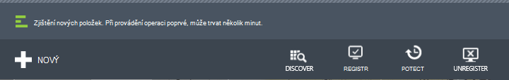
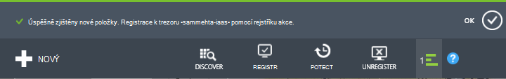
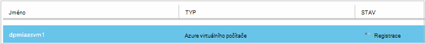
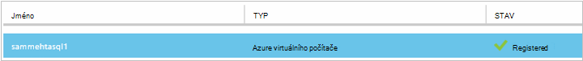
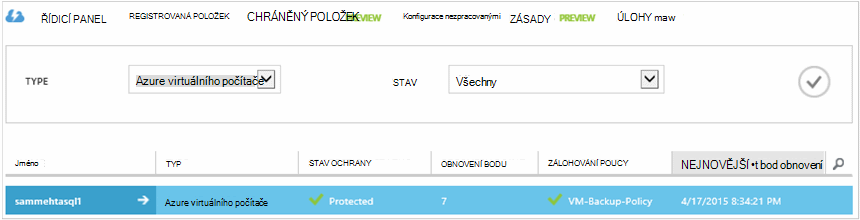

<properties
    pageTitle="Zálohování Azure virtuálních počítačích | Microsoft Azure"
    description="Seznamte se s zaregistrovat a obecnějším údajům virtuálních počítačích s těmito postupy pro zálohování Azure virtuálního počítače."
    services="backup"
    documentationCenter=""
    authors="markgalioto"
    manager="jwhit"
    editor=""
    keywords="virtuální počítač zálohování; obecnějším údajům virtuálního počítače; zálohování a havárie obnovení; zálohování OM"/>

<tags
    ms.service="backup"
    ms.workload="storage-backup-recovery"
    ms.tgt_pltfrm="na"
    ms.devlang="na"
    ms.topic="article"
    ms.date="09/28/2016"
    ms.author="trinadhk; jimpark; markgal;"/>

# Obecnějším údajům Azure virtuálních počítačích

> [AZURE.SELECTOR]
- [Obecnějším údajům VMs do služby Recovery trezoru](backup-azure-arm-vms.md)
- [Obecnějším údajům VMs trezoru zálohování](backup-azure-vms.md)

Tento článek obsahuje postupy pro zálohování nasazený klasické Azure virtuálního počítače (OM) do zálohování trezoru. Existuje několik úkolů, které bude nutné starat o před můžete obecnějším údajům Azure virtuálního počítače. Pokud jste to ještě neudělali, proveďte [požadavky](backup-azure-vms-prepare.md) zálohování vaší VMs vaše prostředí připravili.

Další informace najdete v článcích [plánování záložní infrastrukturu OM v Azure](backup-azure-vms-introduction.md) a [Azure virtuálních počítačích](https://azure.microsoft.com/documentation/services/virtual-machines/).

>[AZURE.NOTE] Azure obsahuje dva modely nasazení pro vytváření grafů a práci s prostředky: [Správce zdrojů a klasické](../resource-manager-deployment-model.md). Zálohování trezoru můžete chránit pouze nasazený klasické VMs. Správce prostředků nasazený VMs s trezoru zálohování nemůže zajistit ochranu. Další informace o práci s služby Recovery trezorů najdete v článku [obecnějším údajům VMs do služby Recovery trezoru](backup-azure-arm-vms.md) .

Zálohování Azure virtuálních počítačích zahrnuje tři základní kroky:

>[AZURE.NOTE] Zálohování virtuálních počítačích je místní proces. Nelze zálohujete virtuálních počítačích v jednom regionu záložní trezoru v jiné oblasti. Tak, aby, musíte vytvořit záložní trezoru každou Azure oblast, kde jsou VMs, které bude zálohovat.

## Krok 1 – Seznamte se s Azure virtuálních počítačích
Abyste měli jistotu, že všechny nové virtuálních počítačích (VMs) přidá k předplatnému jsou určeny před registrací, spusťte proces zjišťování. Proces dotazů Azure seznam virtuálních počítačích v předplatného, spolu s dalšími informacemi, jako je název služby cloudu a oblasti.

1. Přihlaste se k [portálu klasické](http://manage.windowsazure.com/)

2. V seznamu Azure služeb klikněte na **Služby Recovery** otevřete seznam trezorů zálohování a obnovení webu.
    

3. V seznamu zálohování trezorů vyberte trezoru k obecnějším údajům virtuálního počítače.

    Pokud je to nový trezoru portálu otevře **Úvodní** stránku.

    

    Pokud trezoru dříve nakonfiguroval, portálu otevře nabídku naposledy použitých.

4. V nabídce trezoru (v horní části stránky) klikněte na **Registered položky**.

    

5. V nabídce **Typ** vyberte **Azure virtuálního počítače**.

    

6. Klikněte na **vyhledávací** v dolní části stránky.
    

    Proces zjišťování může trvat několik minut, když jsou právě: tabulkový virtuálních počítačích. Existuje oznámení v dolní části obrazovky, který upozorňuje, jestli je spuštěný proces.

    

    Oznámení změn po procesu dokončit. Pokud proces zjišťování nenachází virtuálních počítačích, nejdřív zkontrolujte, zda že VMS existují. Pokud existují VMs, zajistěte, aby že VMS jsou ve stejné oblasti jako záložní trezoru. Pokud VMs existují a ve stejné oblasti, zajistěte, aby že VMS nejsou již registrována na záložní trezoru. Pokud virtuálního počítače přiřazen k zálohování trezoru není k dispozici pro přidělovat jiné záložní trezorů.

    

    Jakmile máte zjištěné nové položky, přejděte k části Krok 2 a zaregistrujte svůj VMs.

##  Krok 2: registrace Azure virtuálních počítačích
Zaregistrujte Azure virtuálního počítače přiřazenou služby Azure zálohování. Je to obvykle jednorázové aktivity.

1. Přejděte do záložní trezoru ve skupinovém rámečku **Obnovení služby** Azure portálu a klikněte na **Registered položky**.

2. V rozevírací nabídce vyberte **Azure virtuálního počítače** .

    

3. Klikněte na **ZAREGISTROVAT** v dolní části stránky.
    

4. V místní nabídce **Zaregistrovat položky** vyberte virtuálních počítačích, které chcete zaregistrovat. Pokud existují dva nebo více virtuálních počítačích se stejným názvem, použijte cloudovou službu k rozlišení mezi nimi.

    >[AZURE.TIP] Najednou lze zaregistrovat více virtuálních počítačích.

    Úlohy se vytvoří pro každé virtuální počítač, který jste vybrali.

5. Klikněte na **Zobrazení projektu** v oznámení přejděte na stránku **úlohy** .

    

    Virtuální počítač se bude zobrazovat i v seznamu registrované položek spolu s stav operace registrace.

    

    Po dokončení operace stav změní tak, aby odrážely stavu *registrované* .

    

## Krok 3 – Ochrana Azure virtuálních počítačích
Teď můžete nastavit zásady zálohování a uchovávání informací pro virtuální počítač. Více virtuálních počítačích může být chráněny s použitím jednoho chránit akce.

Azure zálohování trezorů vytvořených po květen 2015 jsou součástí výchozí zásady integrovaná trezoru. Tato výchozí zásady získáváte výchozí uchování 30 dní a jednou denní plán zálohování.

1. Přejděte do záložní trezoru ve skupinovém rámečku **Obnovení služby** Azure portálu a klikněte na **Registered položky**.
2. V rozevírací nabídce vyberte **Azure virtuálního počítače** .

    

3. Klepněte na tlačítko **UZAMKNOUT** v dolní části stránky.

    Zobrazí se **Průvodce chránit položky** . Průvodce pouze seznamy virtuálních počítačích, které jsou registrovány a není chráněn. Vyberte virtuálních počítačích, které chcete zamknout.

    Pokud existují dva nebo více virtuálních počítačích se stejným názvem, použijte cloudovou službu k rozlišení mezi virtuálních počítačích.

    >[AZURE.TIP] Více virtuálních počítačích můžete chránit najednou.

    

4. Zvolte **plán zálohování** k obecnějším údajům virtuálních počítačích, které jste vybrali. Můžete vybrat z existující sady zásad nebo definovat novou.

    Každý zásady zálohování může obsahovat více virtuálních počítačích s ním spojené. Však virtuálního počítače lze pouze přidružené k jednu zásadu v libovolném bodě v čase.

    

    >[AZURE.NOTE] Zásady zálohování obsahuje schématu uchovávání informací pro plánované zálohování. Pokud vyberete možnost stávající záložní zásadu, nelze změnit možnosti uchovávání informací v dalším kroku.

5. Vyberte **oblast uchovávání informací** ke kterému chcete přidružit zálohy.

    

    Zásady uchovávání informací Určuje časový interval pro ukládání zálohování. Můžete určit, zásady uchovávání informací různých podle toho, kdy se považuje zálohování. Například záložní bod pořízené denní (které slouží jako provozní obnovení bod) může být zachovány 90 dní. Ve srovnání s může být nutné uchovávat pro mnoho měsících nebo letech záložní čárky pořízené na konci každé čtvrtletí (pro účely auditování).

    

    V tomto příkladu obrázek:

    - **Denní zásady uchovávání informací**: pořízené denně zálohování 30 dní.
    - **Týdenní zásady uchovávání informací**: pořízené každý týden v neděli zálohy se zachovají 104 týdnů.
    - **Měsíční zásady uchovávání informací**: pořízené poslední neděli každý měsíc zálohy se zachovají 120 měsíců.
    - **Roční zásady uchovávání informací**: pořízené v první neděli každé leden zálohy se zachovají 99 let.

    Konfigurace zásad ochrany a přidružení virtuálních počítačích této zásady pro každý virtuální počítač, který jste vybrali je vytvořen projektu.

6. Seznam **Nastavení** ochrany úlohy z nabídky trezorů klikněte na tlačítko **projekty** a vyberte **Konfigurovat ochrany** filtru **operace** .

    

## Počáteční zálohování
Jakmile virtuální počítač se po zamknutí zásady, ji se zobrazí na kartě **Chráněné položky** se stavem *chráněného - (čeká na počáteční zálohování)*. Ve výchozím nastavení je první naplánované zálohování *Počáteční zálohování*.

Spustí počáteční zálohování ihned po konfiguraci ochrany:

1. V dolní části stránky **Chráněné položek** klepněte na tlačítko **Zálohování**.

    Služba Azure záložní vytvoří úlohy zálohování použitých při počáteční zálohování.

2. Klikněte na kartu **úloh** seznam všech projektů.

    

>[AZURE.NOTE] V průběhu operace zálohování problémy se službou Azure záložní příkazu záložní rozšíření v jednotlivých virtuální počítač vyprázdnění všechny úlohy Zapsat a konzistentní snímek.

Po dokončení počáteční zálohování stav virtuálního počítače na kartě **Chráněné položky** je *chráněného*.

## Zobrazení stavu zálohování a podrobností
Jakmile zamknutý, počet virtuální počítač také nárůst souhrnné stránky **řídicího panelu** . Stránky **řídicího panelu** taky zobrazí číslo úlohy z posledních 24 hodin, které byly *úspěšné*, *nezdařilo*a *probíhají*. Na stránce **úlohy** pomocí **Stav** **operace**a **od** a **do** nabídek pro filtrování úloh.

Každých 24 hodin jsou aktualizovány hodnoty v řídicím panelu.

## Poradce při potížích s chybami
Pokud narazíte na problémy při zálohování nahoru virtuálního počítače, podívejte se na [článek Poradce při potížích OM](backup-azure-vms-troubleshoot.md) nápovědu.

## Další kroky

- [Správa a sledování virtuálních počítačích](backup-azure-manage-vms.md)
- [Obnovení virtuálních počítačích](backup-azure-restore-vms.md)
