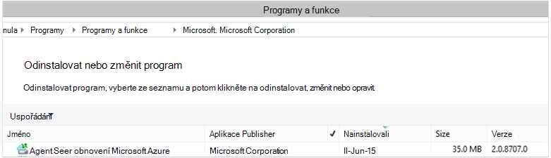

<properties
    pageTitle="Nasazením a správou zálohování pro klienta systému Windows Server nebo pomocí Powershellu | Microsoft Azure"
    description="Zjistěte, jak nasazením a správou zálohování Azure pomocí prostředí PowerShell"
    services="backup"
    documentationCenter=""
    authors="saurabhsensharma"
    manager="shivamg"
    editor=""/>

<tags
    ms.service="backup"
    ms.workload="storage-backup-recovery"
    ms.tgt_pltfrm="na"
    ms.devlang="na"
    ms.topic="article"
    ms.date="09/01/2016"
    ms.author="saurabhsensharma;markgal;jimpark;nkolli;trinadhk"/>


# <a name="deploy-and-manage-backup-to-azure-for-windows-serverwindows-client-using-powershell"></a>Nasazením a správou zálohování Azure pro Windows Server/Windows klienta pomocí prostředí PowerShell

> [AZURE.SELECTOR]
- [ARM](backup-client-automation.md)
- [Klasický](backup-client-automation-classic.md)

V tomto článku se dozvíte, jak pomocí Powershellu pro nastavení Azure záložní v systému Windows Server nebo klient systému Windows a správě zálohování a obnovení.

## <a name="install-azure-powershell"></a>Instalace modulu Azure PowerShell

[AZURE.INCLUDE [learn-about-deployment-models](../../includes/learn-about-deployment-models-include.md)]

V říjnu 2015 byla vydána Azure PowerShell 1.0. Tato verze úspěšně 0.9.8 uvolněte a přenesený o některých změnách významné, zejména v vzor pro pojmenování rutin. 1.0 rutin postupujte vzor pro pojmenování {slovesné}-AzureRm {Jmenná}; vzhledem k tomu 0.9.8 názvy nezahrnujte **SV** (například New-AzureRmResourceGroup místo AzureResourceGroup nový). Při použití Azure PowerShell 0.9.8, je třeba nejprve povolit režim správce prostředků spuštěním příkazu **Přepnout AzureMode AzureResourceManager** . Tento příkaz není nutné v 1.0 nebo novější.

Chcete-li použít vaše skripty pro 0.9.8 prostředí v prostředí 1.0 nebo novější pečlivě otestujte skripty v před provozním prostředí před jejich použitím ve výrobním Chcete-li předejít neočekávané vliv.

[Stáhněte si nejnovější verzi prostředí PowerShell](https://github.com/Azure/azure-powershell/releases) (minimální verze povinné: 1.0.0)


[AZURE.INCLUDE [arm-getting-setup-powershell](../../includes/arm-getting-setup-powershell.md)]


## <a name="create-a-backup-vault"></a>Vytvoření záložní trezoru

> [AZURE.WARNING] Zákazníkům, kteří používají Azure zálohování poprvé musíte zaregistrovat Azure zálohování poskytovatele se nemusí používat se svým předplatným. Lze to spuštěním následujícího příkazu: Register AzureProvider - ProviderNamespace "Microsoft.Backup"

Můžete vytvořit nový záložní trezoru pomocí rutinu **New-AzureRMBackupVault** . Záložní trezoru je prostředek ARM, takže budete muset jeho umístění v rámci skupiny zdrojů. V konzole zvýšenými Azure PowerShell spusťte následující příkazy:

```
PS C:\> New-AzureResourceGroup –Name “test-rg” -Region “West US”
PS C:\> $backupvault = New-AzureRMBackupVault –ResourceGroupName “test-rg” –Name “test-vault” –Region “West US” –Storage GeoRedundant
```

Seznam záložní trezorů v předplatné získáte pomocí rutiny **Get-AzureRMBackupVault** .


## <a name="installing-the-azure-backup-agent"></a>Instalace agenta zálohování Azure
Před instalací agenta zálohování Azure, musíte mít instalační službou systému stažené a prezentovat v systému Windows Server. Nejnovější verzi instalačního programu můžete přepnout z [Webu služby Stažení softwaru](http://aka.ms/azurebackup_agent) nebo ze stránky řídicího panelu záložní trezoru. Uložte instalační program snadno dostupné místo jako * C:\Downloads\*.

Pokud chcete nainstalovat agent, spusťte tento příkaz v konzole zvýšenými Powershellu:

```
PS C:\> MARSAgentInstaller.exe /q
```

Agent nainstalujete s výchozími možnostmi. Instalace trvá několik minut na pozadí. Pokud nezadáte možnost */nu* se otevře okno **Windows Update** na konci instalace zkontrolovat aktualizace. Po instalaci agent se zobrazí v seznamu nainstalovaných programů.

Pokud chcete zobrazit v seznamu nainstalovaných programů, přejděte do **Ovládacích panelů** > **programy** > **programy a funkce**.



### <a name="installation-options"></a>Možnosti instalace

Zobrazte všechny možnosti dostupné prostřednictvím příkazového řádku, použijte tento příkaz:

```
PS C:\> MARSAgentInstaller.exe /?
```

Dostupné možnosti:

| Možnost | Podrobnosti | Výchozí |
| ---- | ----- | ----- |
| / q | Tichý instalace | - |
| / p: "umístění" | Cestu ke složce instalace agenta Azure zálohování. | Agent služby Azure obnovení C:\Program Files\Microsoft |
| / s: "umístění" | Cestu ke složce mezipaměti pro agenta Azure zálohování. | C:\Program Files\Microsoft Azure obnovení služby Agent\Scratch |
| /m | Vyjádření souhlasu v Microsoft Update | - |
| /nu | Po dokončení instalace není zkontrolovat aktualizace: | - |
| /d | Odinstaluje agentem služeb Microsoft Azure obnovení | - |
| /pH | Host (hostitel) adresy proxy serveru | - |
| /Po | Číslo portu proxy Host (hostitel) | - |
| /Pu | Uživatelské jméno proxy Host (hostitel) | - |
| /pW | Heslo proxy serveru | - |


## <a name="registering-with-the-azure-backup-service"></a>Registrace ke službě Azure zálohování
Před registrací se službou Azure zálohování, je třeba zajistit, že jsou splněné [požadavky](backup-configure-vault.md) . Proveďte následující kroky:

- Platné Azure předplatné
- Máte záložní trezoru

Stahování přihlašovacích údajů trezoru, spusťte rutinu **Get-AzureRMBackupVaultCredentials** v konzole Azure PowerShell a uložte ho na vhodné místo jako * C:\Downloads\*.

```
PS C:\> $credspath = "C:\"
PS C:\> $credsfilename = Get-AzureRMBackupVaultCredentials -Vault $backupvault -TargetLocation $credspath
PS C:\> $credsfilename
f5303a0b-fae4-4cdb-b44d-0e4c032dde26_backuprg_backuprn_2015-08-11--06-22-35.VaultCredentials
```

Zaregistrovali trezoru počítače probíhá pomocí rutiny [Start OBRegistration](https://technet.microsoft.com/library/hh770398%28v=wps.630%29.aspx) :

```
PS C:\> $cred = $credspath + $credsfilename
PS C:\> Start-OBRegistration -VaultCredentials $cred -Confirm:$false

CertThumbprint      : 7a2ef2caa2e74b6ed1222a5e89288ddad438df2
SubscriptionID      : ef4ab577-c2c0-43e4-af80-af49f485f3d1
ServiceResourceName : test-vault
Region              : West US

Machine registration succeeded.
```

> [AZURE.IMPORTANT] Nepoužívejte relativní cesty k zadání přihlašovacích údajů souboru trezoru. Absolutní cesta je nutné zadat vstupu rutině.

## <a name="networking-settings"></a>Nastavení sítě
Po připojení k systému Windows počítače k Internetu přes proxy server se dá agenta poskytovat nastavení proxy. V tomto příkladu je žádný proxy server, proto jsme explicitně uvolnili libovolné informace související s proxy serveru.

Využití šířky pásma také možné ovládat s možnostmi ```work hour bandwidth``` a ```non-work hour bandwidth``` pro danou sadu dny v týdnu.

Nastavení proxy serveru a šířku pásma podrobnosti se provádí pomocí rutinu [Set-OBMachineSetting](https://technet.microsoft.com/library/hh770409%28v=wps.630%29.aspx) :

```
PS C:\> Set-OBMachineSetting -NoProxy
Server properties updated successfully.

PS C:\> Set-OBMachineSetting -NoThrottle
Server properties updated successfully.
```

## <a name="encryption-settings"></a>Nastavení šifrování
Zálohování dat poslané na Azure záložní zašifrován chránit důvěrnost data. Heslo šifrování je "heslo" dešifrovat data v době obnovení.

```
PS C:\> ConvertTo-SecureString -String "Complex!123_STRING" -AsPlainText -Force | Set-OBMachineSetting
Server properties updated successfully
```

> [AZURE.IMPORTANT] Zachovat přístupové údaje bezpečných a zabezpečené, když je nastavená. Nebude moct obnovení dat z Azure bez toto heslo.

## <a name="back-up-files-and-folders"></a>Obecnějším údajům souborů a složek
Všechny zálohy z Windows Server a klienti k zálohování Azure upravuje zásadu. Zásady se skládá ze tří částí:

1. **Zálohování plán** , který určuje při zálohování muset přijmout a synchronizovat se službou.
2. **Plán uchovávání informací** , které určuje, jak dlouho uchovávání obnovení bodů v Azure.
3. **Specifikace zahrnutí nebo vyloučení souboru** , která určuje, co by měl být zálohovat.

V tomto dokumentu protože jsme jste Automatizace zálohování, jsme se předpokládá, že nic nakonfiguroval. Začneme vytvořením nového zásady zálohování pomocí rutinu [New-OBPolicy](https://technet.microsoft.com/library/hh770416.aspx) a s ním pracovat.

```
PS C:\> $newpolicy = New-OBPolicy
```

V současné době zásady prázdných a jiných rutiny jsou potřeby definujte, co položky budou zahrnuté nebo vyloučené, kdy zálohy se spustí, přičemž zálohy budou uloženy.

### <a name="configuring-the-backup-schedule"></a>Konfigurace plánu zálohování
První 3 díly zásadu je záložní plán, který je vytvořený pomocí rutinu [New-OBSchedule](https://technet.microsoft.com/library/hh770401) . Plán zálohování Určuje, kdy je potřeba vzít zálohy. Při vytváření plánu budete muset zadat 2 vstupních parametrů:

- **Dny v týdnu** , která by měla běžet zálohování. Můžete spustit úlohy zálohování pouze jeden den nebo každý den v týdnu nebo libovolnou kombinaci mezi nimi.
- **Hodinách** při zálohování by měla běžet. Můžete definovat až 3 různou dne, kdy bude zálohování aktivován.

Je například nakonfigurovat zásady zálohování, který se spustí na 16: 00 každé sobotu a neděli.

```
PS C:\> $sched = New-OBSchedule -DaysofWeek Saturday, Sunday -TimesofDay 16:00
```

Plán zálohování musí být přidružené zásadu a toho můžete dosáhnout pomocí rutiny [Set-OBSchedule](https://technet.microsoft.com/library/hh770407) .

```
PS C:> Set-OBSchedule -Policy $newpolicy -Schedule $sched
BackupSchedule : 4:00 PM Saturday, Sunday, Every 1 week(s) DsList : PolicyName : RetentionPolicy : State : New PolicyState : Valid
```
### <a name="configuring-a-retention-policy"></a>Konfigurace zásad uchovávání informací
Zásady uchovávání informací definuje, jak dlouho se zachovají body obnovení vytvořené z úlohy zálohování. Při vytváření nové zásady uchovávání informací pomocí rutinu [New-OBRetentionPolicy](https://technet.microsoft.com/library/hh770425) , můžete zadat počet dní, které je potřeba zůstanou zachovaná s Azure záložní body obnovení zálohy. V příkladu níže nastaví zásad uchovávání informací 7 dnů.

```
PS C:\> $retentionpolicy = New-OBRetentionPolicy -RetentionDays 7
```

Zásady uchovávání informací je třeba spojit s hlavním zásady použití rutinu [Set-OBRetentionPolicy](https://technet.microsoft.com/library/hh770405):

```
PS C:\> Set-OBRetentionPolicy -Policy $newpolicy -RetentionPolicy $retentionpolicy

BackupSchedule  : 4:00 PM
                  Saturday, Sunday,
                  Every 1 week(s)
DsList          :
PolicyName      :
RetentionPolicy : Retention Days : 7

                  WeeklyLTRSchedule :
                  Weekly schedule is not set

                  MonthlyLTRSchedule :
                  Monthly schedule is not set

                  YearlyLTRSchedule :
                  Yearly schedule is not set

State           : New
PolicyState     : Valid
```
### <a name="including-and-excluding-files-to-be-backed-up"></a>Zahrnutí a vyloučení souborů, které chcete zálohovat
```OBFileSpec``` Objekt definuje soubory, které chcete být zahrnuté a vyloučené v zálohy. Toto je sady pravidel, které rozsah mimo chráněné soubory a složky na počítač. Můžete mít jako mnoho soubor zahrnutí nebo vyloučení pravidla podle potřeby a přidružit zásadu. Při vytváření nového objektu OBFileSpec, máte tyto možnosti:

- Určete, soubory a složky, které mají být součástí
- Určete, soubory a složky, které chcete vyloučit
- Určení rekurzivní zálohování dat ve složce (nebo) jestli by měl záložní pouze nejvyšší úrovně soubory ve složce zadaný nahoru.

Ten dosáhnete pomocí příznak - nerekurzivní v příkazu Nový OBFileSpec.

V následujícím příkladu jsme budete obecnějším údajům hlasitost C: a D: a vyloučit OS binární soubory ve složce Windows a dočasné složky. Tak vytvoříte dva souborů pomocí rutinu [New-OBFileSpec](https://technet.microsoft.com/library/hh770408) – jeden pro zahrnutí – specifikace a jeden pro vyloučených položek. Po vytvoření souboru specifikace budou se přiřazovat zásady použití rutinu [OBFileSpec přidat](https://technet.microsoft.com/library/hh770424) .

```
PS C:\> $inclusions = New-OBFileSpec -FileSpec @("C:\", "D:\")

PS C:\> $exclusions = New-OBFileSpec -FileSpec @("C:\windows", "C:\temp") -Exclude

PS C:\> Add-OBFileSpec -Policy $newpolicy -FileSpec $inclusions

BackupSchedule  : 4:00 PM
                  Saturday, Sunday,
                  Every 1 week(s)
DsList          : {DataSource
                  DatasourceId:0
                  Name:C:\
                  FileSpec:FileSpec
                  FileSpec:C:\
                  IsExclude:False
                  IsRecursive:True

                  , DataSource
                  DatasourceId:0
                  Name:D:\
                  FileSpec:FileSpec
                  FileSpec:D:\
                  IsExclude:False
                  IsRecursive:True

                  }
PolicyName      :
RetentionPolicy : Retention Days : 7

                  WeeklyLTRSchedule :
                  Weekly schedule is not set

                  MonthlyLTRSchedule :
                  Monthly schedule is not set

                  YearlyLTRSchedule :
                  Yearly schedule is not set

State           : New
PolicyState     : Valid


PS C:\> Add-OBFileSpec -Policy $newpolicy -FileSpec $exclusions

BackupSchedule  : 4:00 PM
                  Saturday, Sunday,
                  Every 1 week(s)
DsList          : {DataSource
                  DatasourceId:0
                  Name:C:\
                  FileSpec:FileSpec
                  FileSpec:C:\
                  IsExclude:False
                  IsRecursive:True
                  ,FileSpec
                  FileSpec:C:\windows
                  IsExclude:True
                  IsRecursive:True
                  ,FileSpec
                  FileSpec:C:\temp
                  IsExclude:True
                  IsRecursive:True

                  , DataSource
                  DatasourceId:0
                  Name:D:\
                  FileSpec:FileSpec
                  FileSpec:D:\
                  IsExclude:False
                  IsRecursive:True

                  }
PolicyName      :
RetentionPolicy : Retention Days : 7

                  WeeklyLTRSchedule :
                  Weekly schedule is not set

                  MonthlyLTRSchedule :
                  Monthly schedule is not set

                  YearlyLTRSchedule :
                  Yearly schedule is not set

State           : New
PolicyState     : Valid
```

### <a name="applying-the-policy"></a>Použití zásady
Teď objekt zásad je dokončeno a plánu přidružené zálohování, zásady uchovávání informací a seznamu zahrnutí nebo vyloučení souborů. Tuto zásadu nyní lze pro zálohování Azure používat. Před použitím nově vytvořený zásad zajistit žádné existující záložní zásad přidružených k serveru pomocí rutiny [OBPolicy odebrat](https://technet.microsoft.com/library/hh770415) . Odebrání zásady vás vyzve k potvrzení. Přejděte pomocí potvrzení ```-Confirm:$false``` příznak s rutiny.

```
PS C:> Get-OBPolicy | Remove-OBPolicy
Microsoft Azure Backup Are you sure you want to remove this backup policy? This will delete all the backed up data. [Y] Yes [A] Yes to All [N] No [L] No to All [S] Suspend [?] Help (default is "Y"):
```

Potvrzení objekt zásad probíhá pomocí rutinu [Set-OBPolicy](https://technet.microsoft.com/library/hh770421) . To taky vyzve k potvrzení. Přejděte pomocí potvrzení ```-Confirm:$false``` příznak s rutiny.

```
PS C:> Set-OBPolicy -Policy $newpolicy
Microsoft Azure Backup Do you want to save this backup policy ? [Y] Yes [A] Yes to All [N] No [L] No to All [S] Suspend [?] Help (default is "Y"):
BackupSchedule : 4:00 PM Saturday, Sunday, Every 1 week(s)
DsList : {DataSource
         DatasourceId:4508156004108672185
         Name:C:\
         FileSpec:FileSpec
         FileSpec:C:\
         IsExclude:False
         IsRecursive:True,

         FileSpec
         FileSpec:C:\windows
         IsExclude:True
         IsRecursive:True,

         FileSpec
         FileSpec:C:\temp
         IsExclude:True
         IsRecursive:True,

         DataSource
         DatasourceId:4508156005178868542
         Name:D:\
         FileSpec:FileSpec
         FileSpec:D:\
         IsExclude:False
         IsRecursive:True
    }
PolicyName : c2eb6568-8a06-49f4-a20e-3019ae411bac
RetentionPolicy : Retention Days : 7
              WeeklyLTRSchedule :
              Weekly schedule is not set

              MonthlyLTRSchedule :
              Monthly schedule is not set

              YearlyLTRSchedule :
              Yearly schedule is not set
State : Existing PolicyState : Valid
```

Můžete zobrazit údaje existující zásady zálohování pomocí rutiny [Get-OBPolicy](https://technet.microsoft.com/library/hh770406) . Je možné podrobnostem dál používat rutinu [Get-OBSchedule](https://technet.microsoft.com/library/hh770423) plán zálohování a rutinu [Get-OBRetentionPolicy](https://technet.microsoft.com/library/hh770427) pro zásady uchovávání informací

```
PS C:> Get-OBPolicy | Get-OBSchedule
SchedulePolicyName : 71944081-9950-4f7e-841d-32f0a0a1359a
ScheduleRunDays : {Saturday, Sunday}
ScheduleRunTimes : {16:00:00}
State : Existing

PS C:> Get-OBPolicy | Get-OBRetentionPolicy
RetentionDays : 7
RetentionPolicyName : ca3574ec-8331-46fd-a605-c01743a5265e
State : Existing

PS C:> Get-OBPolicy | Get-OBFileSpec
FileName : *
FilePath : \?\Volume{b835d359-a1dd-11e2-be72-2016d8d89f0f}\
FileSpec : D:\
IsExclude : False
IsRecursive : True

FileName : *
FilePath : \?\Volume{cdd41007-a22f-11e2-be6c-806e6f6e6963}\
FileSpec : C:\
IsExclude : False
IsRecursive : True

FileName : *
FilePath : \?\Volume{cdd41007-a22f-11e2-be6c-806e6f6e6963}\windows
FileSpec : C:\windows
IsExclude : True
IsRecursive : True

FileName : *
FilePath : \?\Volume{cdd41007-a22f-11e2-be6c-806e6f6e6963}\temp
FileSpec : C:\temp
IsExclude : True
IsRecursive : True
```

### <a name="performing-an-ad-hoc-backup"></a>Provedení ad-hoc zálohování
Jakmile nenastavil zásadu záložní zálohy dojde na plán. Spuštění zálohu ad-hoc lze také pomocí rutiny [Start OBBackup](https://technet.microsoft.com/library/hh770426) :

```
PS C:> Get-OBPolicy | Start-OBBackup
Taking snapshot of volumes...
Preparing storage...
Estimating size of backup items...
Estimating size of backup items...
Transferring data...
Verifying backup...
Job completed.
The backup operation completed successfully.
```

## <a name="restore-data-from-azure-backup"></a>Obnovení dat z Azure zálohování
V této části vás provede kroky pro automatické obnovení dat z Azure zálohy. Tím zahrnuje tyto kroky:

1. Vyberte zdroj hlasitosti
2. Zvolte záložní bod obnovit
3. Vyberte položku, kterou chcete obnovit
4. Aktivační proces obnovení

### <a name="picking-the-source-volume"></a>Výdeje hlasitost zdroje
Abyste mohli obnovit položky ze zálohy Azure, musíte nejdřív k identifikaci zdroje položky. Protože jsme při provádění příkazů, které v kontextu systému Windows Server nebo klienta Windows, počítač už identifikovat. Dalším krokem při identifikaci zdroje je k identifikaci hlasitost obsahující ji. Seznam svazky nebo zdroje zálohování z tohoto počítače můžete načíst spuštěním rutiny [Get-OBRecoverableSource](https://technet.microsoft.com/library/hh770410) . Tento příkaz vrátí matici všech zdrojů zálohovala od tohoto serveru/klienta.

```
PS C:> $source = Get-OBRecoverableSource
PS C:> $source
FriendlyName : C:\
RecoverySourceName : C:\
ServerName : myserver.microsoft.com

FriendlyName : D:\
RecoverySourceName : D:\
ServerName : myserver.microsoft.com
```

### <a name="choosing-a-backup-point-to-restore"></a>Výběr záložní přejděte na obnovit
Seznam záložní míst můžete načíst spuštěním rutiny [Get-OBRecoverableItem](https://technet.microsoft.com/library/hh770399.aspx) s příslušnými parametry. V našem příkladu jsme zvolím nejnovější záložní bod pro zdroj Hlasitost *D:* a použijte ji k obnovení konkrétním souborem.

```
PS C:> $rps = Get-OBRecoverableItem -Source $source[1]
IsDir : False
ItemNameFriendly : D:\
ItemNameGuid : \?\Volume{b835d359-a1dd-11e2-be72-2016d8d89f0f}\
LocalMountPoint : D:\
MountPointName : D:\
Name : D:\
PointInTime : 18-Jun-15 6:41:52 AM
ServerName : myserver.microsoft.com
ItemSize :
ItemLastModifiedTime :

IsDir : False
ItemNameFriendly : D:\
ItemNameGuid : \?\Volume{b835d359-a1dd-11e2-be72-2016d8d89f0f}\
LocalMountPoint : D:\
MountPointName : D:\
Name : D:\
PointInTime : 17-Jun-15 6:31:31 AM
ServerName : myserver.microsoft.com
ItemSize :
ItemLastModifiedTime :
```
Objekt ```$rps``` je maticových záložní body. První element je nejnovější čárky a n-tého element je nejstarší bodu. Zvolte nejnovější bod, použijeme ```$rps[0]```.

### <a name="choosing-an-item-to-restore"></a>Vyberte položku, kterou chcete obnovit
Pokud chcete určit přesné soubor nebo složku, kterou chcete obnovit, zpětně použít rutinu [Get-OBRecoverableItem](https://technet.microsoft.com/library/hh770399.aspx) . Tímto způsobem hierarchie složek lze procházet pouze ```Get-OBRecoverableItem```.

V tomto příkladu, pokud nám chcete obnovit soubor *finances.xls* jsme odkazovat na použitém objekt ```$filesFolders[1]```.

```
PS C:> $filesFolders = Get-OBRecoverableItem $rps[0]
PS C:> $filesFolders
IsDir : True
ItemNameFriendly : D:\MyData\
ItemNameGuid : \?\Volume{b835d359-a1dd-11e2-be72-2016d8d89f0f}\MyData\
LocalMountPoint : D:\
MountPointName : D:\
Name : MyData
PointInTime : 18-Jun-15 6:41:52 AM
ServerName : myserver.microsoft.com
ItemSize :
ItemLastModifiedTime : 15-Jun-15 8:49:29 AM

PS C:> $filesFolders = Get-OBRecoverableItem $filesFolders[0]
PS C:> $filesFolders
IsDir : False
ItemNameFriendly : D:\MyData\screenshot.oxps
ItemNameGuid : \?\Volume{b835d359-a1dd-11e2-be72-2016d8d89f0f}\MyData\screenshot.oxps
LocalMountPoint : D:\
MountPointName : D:\
Name : screenshot.oxps
PointInTime : 18-Jun-15 6:41:52 AM
ServerName : myserver.microsoft.com
ItemSize : 228313
ItemLastModifiedTime : 21-Jun-14 6:45:09 AM

IsDir : False
ItemNameFriendly : D:\MyData\finances.xls
ItemNameGuid : \?\Volume{b835d359-a1dd-11e2-be72-2016d8d89f0f}\MyData\finances.xls
LocalMountPoint : D:\
MountPointName : D:\
Name : finances.xls
PointInTime : 18-Jun-15 6:41:52 AM
ServerName : myserver.microsoft.com
ItemSize : 96256
ItemLastModifiedTime : 21-Jun-14 6:43:02 AM
```

Můžete taky vyhledávat položky a obnovte pomocí ```Get-OBRecoverableItem``` rutiny. V našem příkladu vyhledat *finances.xls* jsme mohou získat ty informace soubor pomocí tohoto příkazu:

```
PS C:\> $item = Get-OBRecoverableItem -RecoveryPoint $rps[0] -Location "D:\MyData" -SearchString "finance*"
```

### <a name="triggering-the-restore-process"></a>Spuštění procesu obnovení
Spustit proces obnovení, potřebujeme nejdřív zadat možnosti obnovení. Lze provést pomocí rutinu [New-OBRecoveryOption](https://technet.microsoft.com/library/hh770417.aspx) . V tomto příkladu předpokládejme, že chcete obnovit soubory do *C:\temp*. Také Předpokládejme, že chcete přeskočit soubory, které už na cílovou složku *C:\temp*. Pokud chcete vytvořit možnosti obnovení, použijte tento příkaz:

```
PS C:\> $recovery_option = New-OBRecoveryOption -DestinationPath "C:\temp" -OverwriteType Skip
```

Teď aktivace obnovit pomocí příkazu [Start OBRecovery](https://technet.microsoft.com/library/hh770402.aspx) na vybrané ```$item``` z výstupu ```Get-OBRecoverableItem``` rutinu:

```
PS C:\> Start-OBRecovery -RecoverableItem $item -RecoveryOption $recover_option
Estimating size of backup items...
Estimating size of backup items...
Estimating size of backup items...
Estimating size of backup items...
Job completed.
The recovery operation completed successfully.
```


## <a name="uninstalling-the-azure-backup-agent"></a>Odinstalace agenta zálohování Azure
Odinstalace agenta Azure zálohování lze provést pomocí tento příkaz:

```
PS C:\> .\MARSAgentInstaller.exe /d /q
```

Odinstalace agent binární soubory z počítače má některé důsledky k zamyšlení:

- Odebere filtr souborů z počítače a zastavit sledování změn.
- Všechny informace o zásadách se odebere z počítače, ale informace o zásadách pořád uložený ve službě.
- Odeberou se všechny plány pro zálohování a byla přijata bez dalších zálohy.

Však data uložená v Azure zůstane a udržuje podle nastavení zásad uchovávání informací je. Starší body automaticky věku.

## <a name="remote-management"></a>Vzdálená správa
Všechny Správa kolem agent zálohování Azure, zásady a zdroje dat se teď dá vzdáleně prostřednictvím Powershellu. Počítač, který bude vzdálenou je potřeba počítat správně.

Ve výchozím nastavení je služba nakonfigurován pro ruční spuštění. Nastavte typ spouštění na *automaticky* a službě by měl být zahájen. Hodnota vlastnosti stav můžete ověřit, jestli je spuštěný služba, by měla být *systém*.

```
PS C:\> Get-Service WinRM

Status   Name               DisplayName
------   ----               -----------
Running  winrm              Windows Remote Management (WS-Manag...
```

Pro vzdálené má nakonfigurovaný Powershellu.

```
PS C:\> Enable-PSRemoting -force
WinRM is already set up to receive requests on this computer.
WinRM has been updated for remote management.
WinRM firewall exception enabled.

PS C:\> Set-ExecutionPolicy unrestricted -force
```

Počítači lze teď spravovat vzdáleně - počínaje instalace agent. Například následující skript zkopíruje agenta do vzdáleného počítače a nainstaluje.

```
PS C:\> $dloc = "\\REMOTESERVER01\c$\Windows\Temp"
PS C:\> $agent = "\\REMOTESERVER01\c$\Windows\Temp\MARSAgentInstaller.exe"
PS C:\> $args = "/q"
PS C:\> Copy-Item "C:\Downloads\MARSAgentInstaller.exe" -Destination $dloc - force

PS C:\> $s = New-PSSession -ComputerName REMOTESERVER01
PS C:\> Invoke-Command -Session $s -Script { param($d, $a) Start-Process -FilePath $d $a -Wait } -ArgumentList $agent $args
```

## <a name="next-steps"></a>Další kroky
Další informace o Azure zálohování pro klienta systému Windows Server a naleznete v článku

- [Úvod k Azure zálohování](backup-introduction-to-azure-backup.md)
- [Obecnějším údajům servery systému Windows](backup-configure-vault.md)
