<properties
    pageTitle="Zálohování systému Windows server nebo klientům Azure pomocí klasické nasazení modelu | Microsoft Azure"
    description="Zálohování servery systému Windows nebo klientům Azure vytvoření záložní trezoru, stahování přihlašovacích údajů, nainstalujte záložní agent a dokončení počáteční záložní kopii souborů a složek."
    services="backup"
    documentationCenter=""
    authors="markgalioto"
    manager="cfreeman"
    editor=""
    keywords="zálohování trezoru; vytvoření zálohy systému Windows server; zálohování systému windows."/>

<tags
    ms.service="backup"
    ms.workload="storage-backup-recovery"
    ms.tgt_pltfrm="na"
    ms.devlang="na"
    ms.topic="article"
    ms.date="08/08/2016"
    ms.author="jimpark; trinadhk; markgal"/>

# Obecnějším údajům klienta a serveru Windows Azure pomocí klasické nasazení modelu

> [AZURE.SELECTOR]
- [Klasický portálu](backup-configure-vault-classic.md)
- [Azure portálu](backup-configure-vault.md)

Tento článek popisuje postupy, které potřebujete k vaše prostředí připravili nebo obecnějším údajům systému Windows server (nebo klienta) na Azure. Také popisuje, co byste měli zvážit pro nasazení řešení zálohování. Pokud máte zájem vyzkoušení Azure zálohování poprvé, v tomto článku rychle vás provede procesu.

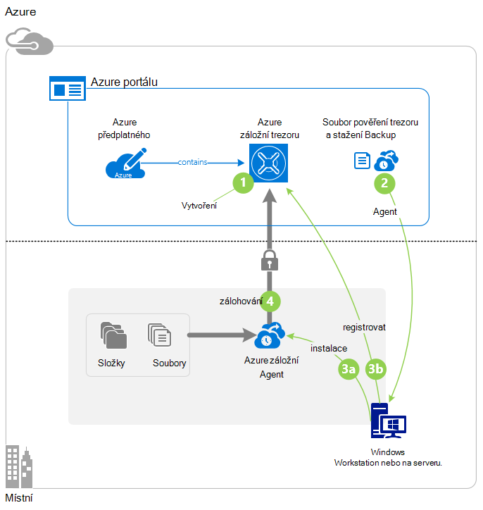

>[AZURE.IMPORTANT] Azure obsahuje dva různé nasazení modely pro vytváření grafů a práci s prostředky: Správce zdrojů a klasické. Tento článek se věnuje pomocí klasické nasazení modelu. Microsoft doporučuje, že většina nových nasazení použití modelu správce prostředků.

## Než začnete
K obecnějším údajům klienta a serveru pro Azure, musíte mít účet Azure. Pokud nemáte, můžete vytvořit [bezplatný účet](https://azure.microsoft.com/free/) v jenom pár minut.

## Krok 1: Vytvoření záložní trezoru
K obecnějším údajům souborů a složek na serveru z nebo z klienta, je potřeba vytvořit záložní trezoru v zeměpisnou oblast, ve které chcete data uložit.

### Vytvoření záložní trezoru

1. Přihlaste se k [portálu klasické](https://manage.windowsazure.com/).

2. Klikněte na **Nový** > **Datové služby** > **Služby Recovery** > **Zálohování trezoru**a klikněte na **Vytvořit**.

3. Pro parametr **název** zadejte popisný název záložního trezoru. Zadejte název, který obsahuje 2 až 50 znaků. Musí začínat písmenem a můžou obsahovat jenom písmena, číslice a spojovníky. Tento název musí být jedinečné pro každého předplatného.

4. Pro parametr **oblast** vyberte zeměpisná oblast pro záložní trezoru. Tato možnost určuje zeměpisnou oblast, kde se odesílá záložní data. Výběrem zeměpisná oblast, která je tomu vašemu nejbližší umístění můžete zmenšit sítě latence zálohování Azure.

5. Klikněte na **vytvořit trezoru**.

    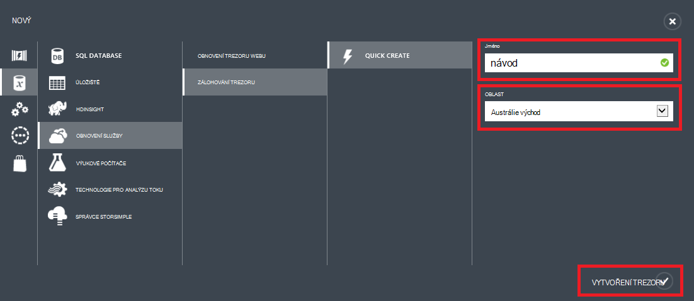

    Může to trvat dlouho pro záložní trezoru vytvořit. Pokud chcete zkontrolovat stav, sledujte oznámení v dolní části klasické portálu.

    Po vytvoření záložní trezoru zobrazí se zpráva, úspěšně vytvořili trezoru. Je rovněž zobrazí jako **aktivní** v seznamu zdrojů **Obnovení služby** .

    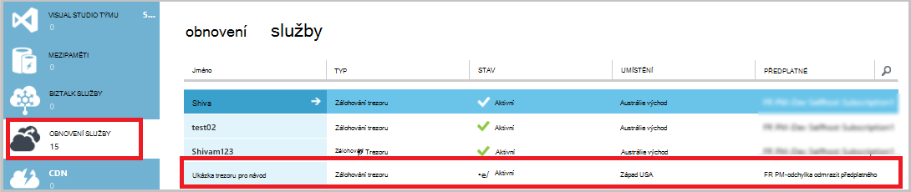

4. Vyberte možnost redundance úložiště podle kroků popsaných v tomto poli.

    >[AZURE.IMPORTANT] Nejvhodnější doba k identifikaci možnost redundance úložiště je ihned po vytvoření trezoru a před všech počítačích jsou registrované do trezoru. Po registrované položky do trezoru, možnost redundance úložiště je uzamčený a nelze změnit.

    Pokud používáte Azure jako koncový bod primární úložišti (například zálohujete do Azure ze serveru Windows), zvažte možnost [geo nadbytečné úložiště](../storage/storage-redundancy.md#geo-redundant-storage) výběru (výchozí).

    Pokud používáte Azure jako koncový bod třetího úložišti (například používáte Správce ochranu dat pro System Center a úložiště Místní záložní kopie místní pomocí Azure pro dlouhodobý uchovávání informací, musí), Popřemýšlejte, jestli [místně nadbytečné úložiště](../storage/storage-redundancy.md#locally-redundant-storage). Po výběru této možnosti dolů náklady na uchovávání dat v Azure, zároveň nižší úrovně životnosti pro vaše data, která může být přijatelná třetího kopií.

    **Chcete-li vybrat možnost redundance úložiště:**

    na. Klikněte na tlačítko trezoru, který jste právě vytvořili.

    b. Na stránce Rychlý Start vyberte **Konfigurovat**.

    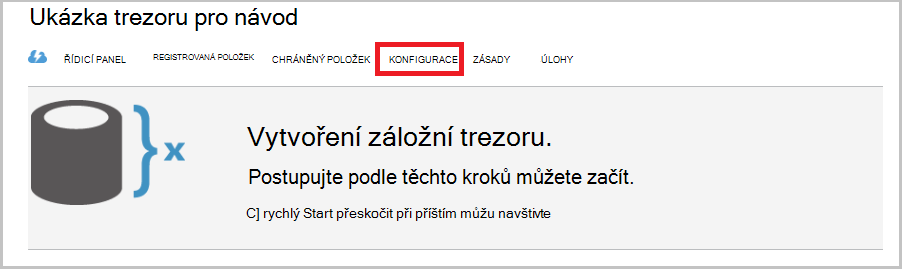

    c. Zvolte možnost redundance odpovídající úložiště.

    Pokud vyberete **Místně nadbytečné**, budete muset (protože **Geo přebytečné** je výchozí nastavení) klikněte na tlačítko **Uložit** .

    d. V levém navigačním podokně klikněte na **Služby Recovery** se vraťte do seznamu zdrojů pro obnovení služby.

## Krok 2: Stažení souboru trezoru přihlašovacích údajů
V místním počítači musí ověřit s záložní trezoru ji zálohujte dat na Azure. Ověřování dosáhnete pomocí *přihlašovacích údajů trezoru*. Stažení souboru pověření trezoru prostřednictvím zabezpečeného kanálu z portálu Microsoft klasické. Soukromý klíč certifikát neuloží v portálu nebo službu.

Další informace o [používání trezoru přihlašovací údaje k ověření se službou zálohování](backup-introduction-to-azure-backup.md#what-is-the-vault-credential-file).

### Chcete-li trezoru pověření budou moct soubor stáhnout do místního počítače

1. V levém navigačním podokně klikněte na **Obnovení služby**a vyberte záložní trezoru, který jste vytvořili.

    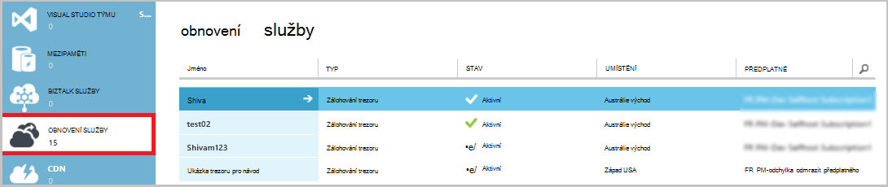

2.  Na stránce Snadné spuštění klikněte na **Stáhnout trezoru pověření**.

    Klasický portál vygeneruje trezoru přihlašovací údaje pomocí kombinace názvu trezoru a aktuálním datem. Soubor trezoru přihlašovacích údajů se použije jenom při registraci pracovního postupu a vyprší po 48 hodin.

    Soubor pověření trezoru můžete stáhnout z portálu.

3. Klikněte na **Uložit** a stáhněte soubor trezoru přihlašovacích údajů do složce Downloads místního účtu. Můžete taky zvolit **Uložit jako** v nabídce **Uložit** do zadejte umístění souboru trezoru přihlašovacích údajů.

    >[AZURE.NOTE] Zkontrolujte, že je soubor pověření trezoru uložený v umístění, do kterého můžete k nim získat přístup z počítače. Pokud je uložený na sdílené složky nebo serveru zprávy rozšířené blokování souborů, zkontrolujte, jestli máte oprávnění k přístupu.

## Krok 3: Stažení, instalace a zaregistrovat agenta zálohování
Po vytvoření záložní trezoru a stáhněte si soubor trezoru přihlašovacích údajů, což je agent musí být nainstalovaný na všech počítačích Windows.

### Ke stažení, instalace a zaregistrovat agent

1. Klikněte na **Obnovení služby**a vyberte záložní trezoru, kterou chcete zaregistrovat se serverem.

2. Na stránce Snadné spuštění klikněte na agent **Agent systému Windows Server nebo System Center Data Protection Manager nebo klienta systému Windows**. Klepněte na tlačítko **Uložit**.

    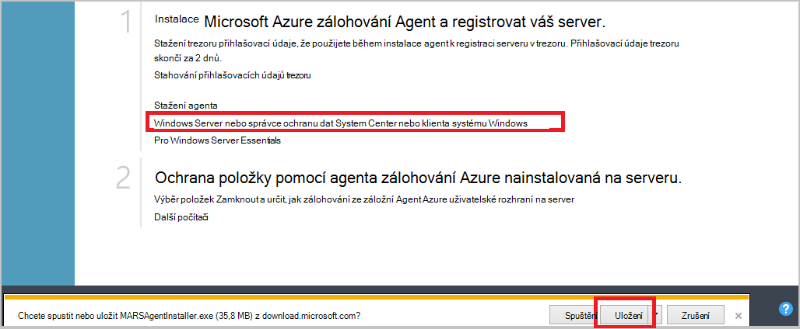

3. Po stažení souboru MARSagentinstaller.exe má klikněte na příkaz **Spustit** (nebo poklikejte **MARSAgentInstaller.exe** z místa uložení).

4. Instalace složku a složku mezipaměti, které jsou potřeba pro agent a potom na tlačítko **Další**. Umístění mezipaměti, které zadáte musí být volné místo rovno alespoň na úrovni 5 procent zálohování dat.

5. Můžete dál připojení k Internetu pomocí výchozího nastavení proxy serveru.          Pokud používáte proxy server pro připojení k Internetu, na stránce konfigurace proxy serveru zaškrtněte políčko **použít nastavení vlastní proxy** a zadejte podrobnosti o proxy server. Pokud používáte ověřeným proxy, zadejte uživatelské jméno a heslo podrobnosti a klikněte na tlačítko **Další**.

7. Klikněte na **nainstalovat** spusťte instalaci agent. Agent zálohování instalace prostředí Windows PowerShell a .NET Framework 4.5 (pokud už není nainstalovaný) dokončete instalaci.

8. Po instalaci agent klepněte na tlačítko **pokračovat k registraci** pokračujte pracovního postupu.

9. Na stránce trezoru identifikace vyhledejte a vyberte soubor trezoru přihlašovací údaje, který jste stáhli.

    Soubor přihlašovacích údajů trezoru je platný pouze 48 hodin po stažení z portálu. Pokud dojde k chybě na tuto stránku (třeba "trezoru přihlašovací údaje, které vypršela platnost soubor k dispozici"), přihlaste se k portálu a trezoru pověření budou moct soubor stáhnout znovu.

    Ujistěte se, že je soubor trezoru přihlašovací údaje k dispozici v umístění, do kterého můžete k nim získat přístup tak, že instalační program aplikace. Pokud narazíte na chyby týkající se přístupu, zkopírujte soubor pověření trezoru dočasného umístění ve stejném počítači a opakujte.

    Pokud dojde k chybě pověření trezoru například "neplatné trezoru přihlašovací údaje k dispozici", je soubor poškozený nebo znamená mít nejnovější pověření nesouvisející ke službě obnovení. Opakujte po stažení nový soubor pověření trezoru z portálu. K této chybě může dojít, pokud možnost **stahování trezoru pověření** několikrát za sebou rychlé kliknutí. V tomto případě je platný pouze poslední soubor trezoru přihlašovacích údajů.

9. Na stránce nastavení šifrování můžete generovat přístupové heslo nebo poskytnout přístupové heslo (aspoň 16 znaků). Nezapomeňte uložit heslo na zabezpečeném místě.

10. Klikněte na **Dokončit**. Průvodce zaregistrovat serveru zaregistruje serveru pomocí zálohování.

    >[AZURE.WARNING] Pokud ztratíte nebo zapomenete heslo, Microsoft nejde vám pomůže při obnovení záložních dat. Vlastní heslo šifrování a Microsoft nemá viditelnost do heslo, které používáte. Uložte soubor na zabezpečeném místě, protože bude potřeba při obnovení operace.

11. Po nastavení šifrovací klíč, nechejte zaškrtnuté políčko **Spuštění služby agenta obnovení Microsoft Azure** a klikněte na tlačítko **Zavřít**.

## Krok 4: Dokončení počáteční zálohování

Počáteční zálohování obsahuje dva klíčových úkolů:

- Vytvoření plánu zálohování
- Zálohování souborů a složek poprvé

Po dokončení počáteční zálohování zásady zálohování vytvoří záložní body, které můžete použít v případě potřeby obnovit data. Zásady zálohování dělá podle plánu, který určíte.

### Naplánování zálohování

1. Otevřete Microsoft Azure Backup agent. (Otevře se automaticky Pokud jste ji opustili zaškrtnuto políčko **Spuštění služby agenta obnovení Microsoft Azure** při zavření průvodce serveru zaregistrovat.) Najdete ji vyhledáním počítači **Microsoft Azure zálohování**.

    

2. V zálohování agent klikněte na **Naplánovat zálohu**.

    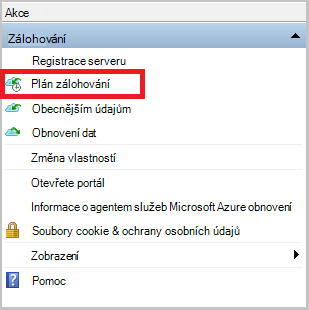

3. Na stránce Začínáme Průvodce plánem zálohování klikněte na **Další**.

4. Na vyberte položky, které chcete zálohování stránky klikněte na **Přidat položky**.

5. Vyberte soubory a složky, které chcete zálohovat a potom klikněte na **OK**.

6. Klikněte na tlačítko **Další**.

7. Na stránce **Určit plán zálohování** určit **plán zálohování** a klikněte na tlačítko **Další**.

    Můžou plánovat denně (maximální rychlostí třikrát za den) nebo týdenní zálohy.

    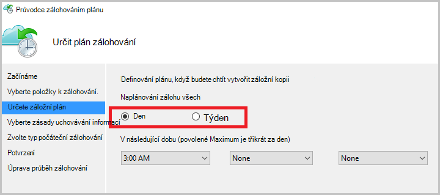

    >[AZURE.NOTE] Další informace o tom, jak určit plán zálohování, najdete v článku [Použití Azure záložní nahrazení infrastrukturu páskou](backup-azure-backup-cloud-as-tape.md).

8. Na stránce **Vyberte zásady uchovávání informací** vyberte **Zásady uchovávání informací** záložní kopie.

    Zásady uchovávání informací určuje doby trvání, u kterého budou uloženy zálohování. Místo jenom určující "ploché zásadu" pro všechny záložní body, můžete určit, zásady uchovávání informací různých podle toho, kdy dojde k zálohování. Zásady uchovávání informací denně, týdně, měsíční a roční podle vlastní potřeby můžete změnit.

9. Na stránce zvolit počáteční záložní typ zvolte typ počáteční zálohování. Ponechte možnost **automaticky v síti** vybranou a klikněte na tlačítko **Další**.

    Můžete zálohovat automaticky přes síť nebo můžete obecnějším údajům v offline režimu. Zbývající Tento článek popisuje postup zálohování automaticky. Pokud chcete provést zálohu offline, přečtěte si článek [Offline záložní pracovního postupu v Azure zálohování](backup-azure-backup-import-export.md) doplňující informace.

10. Na stránce potvrzení zkontrolujte informace a potom klikněte na **Dokončit**.

11. Po dokončení Průvodce vytvořením zálohy plánu, klepněte na tlačítko **Zavřít**.

### Povolit sítě omezení (volitelné)

Agent zálohování poskytuje omezení sítě. Omezení použití šířka pásma během převodu dat ovládací prvky. Tento ovládací prvek může být užitečné v případě potřeby obecnějším údajům dat během pracovní dobu, ale nechcete, aby při zálohování rušit jiných internetový provoz. Omezení platí pro zálohování a obnovení aktivity.

**Chcete-li povolit omezení sítě**

1. V zálohování agent klikněte na **Změnit vlastnosti**.

    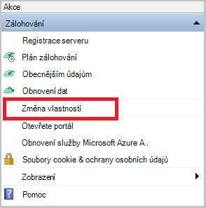

2. Na kartě **Throttling** zaškrtněte políčko **Povolit využití šířky pásma Internetu omezení pro zálohování** .

    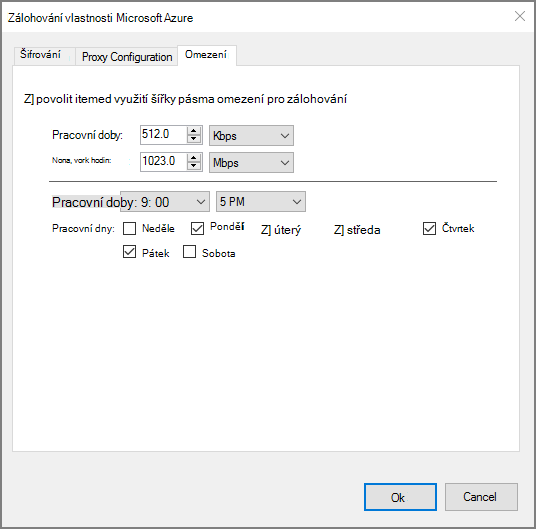

3. Po povolení omezení zadejte povolené šířku pásma pro přenos zálohování dat během **pracovní doby** a **nejsou pracovní doby**.

    Hodnoty šířky pásma začínala 512 kB (kB / s) a můžete přejít až 1,023 megabajtů (MB /). Můžete taky určit zahájení a dokončení **pracovní doby**a které dny v týdnu jsou považovat za pracovních dní. Hodiny mimo určené všechno, se považuje za hodin nefunkční hodiny.

4. Klikněte na **OK**.

### K obecnějším údajům

1. V zálohování agent klikněte na **Zálohovat** dokončete počáteční ohlašovat v síti.

    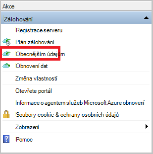

2. Na stránce potvrzení zkontrolujte nastavení, která zase teď průvodce použijete k obecnějším údajům v počítači. Potom klikněte na **Zpět**.

3. Klikněte na **Zavřít** zavřete průvodce. V takovém případě před dokončením procesu zálohování, zůstane v Průvodci běží na pozadí.

Po dokončení počáteční zálohování se zobrazí v konzole zálohování stav **dokončení projektu** .

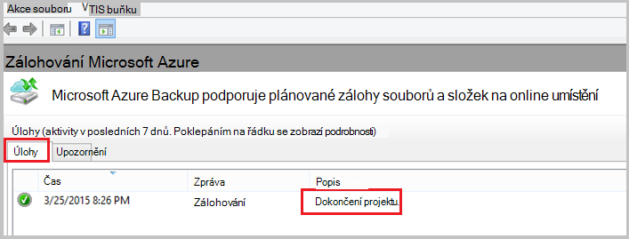

## Další kroky
- Zaregistrujte se [bezplatný účet Azure](https://azure.microsoft.com/free/).

Další informace o zálohování VMs nebo jiných pracovního vytížení najdete v tématu:

- [Obecnějším údajům IaaS VMs](backup-azure-vms-prepare.md)
- [Obecnějším údajům pracovního vytížení Azure zálohování serverem Microsoft Azure](backup-azure-microsoft-azure-backup.md)
- [Obecnějším údajům pracovního vytížení Azure s DPM](backup-azure-dpm-introduction.md)
