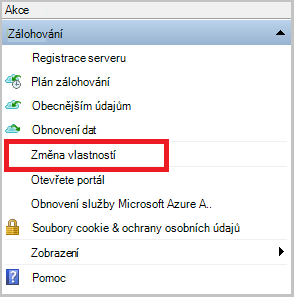

<properties
    pageTitle="Zálohování systému Windows Server nebo klientům Azure pomocí zálohování Azure pomocí Správce prostředků nasazení modelu | Microsoft Azure"
    description="Zálohování servery systému Windows nebo klientům Azure vytvoření záložní trezoru, stahování přihlašovacích údajů, nainstalujte záložní agent a dokončení počáteční záložní kopii souborů a složek."
    services="backup"
    documentationCenter=""
    authors="markgalioto"
    manager="cfreeman"
    editor=""
    keywords="zálohování trezoru; vytvoření zálohy systému Windows server; zálohování systému windows."/>

<tags
    ms.service="backup"
    ms.workload="storage-backup-recovery"
    ms.tgt_pltfrm="na"
    ms.devlang="na"
    ms.topic="article"
    ms.date="08/10/2016"
    ms.author="jimpark; trinadhk; markgal"/>

# Obecnějším údajům klienta a serveru Windows Azure pomocí Správce prostředků nasazení modelu

> [AZURE.SELECTOR]
- [Azure portálu](backup-configure-vault.md)
- [Klasický portálu](backup-configure-vault-classic.md)

Tento článek vysvětluje, jak obecnějším údajům serveru Windows (nebo klienta Windows) souborů a složek na Azure pomocí zálohování Azure pomocí Správce prostředků nasazení modelu.

[AZURE.INCLUDE [learn-about-deployment-models](../../includes/backup-deployment-models.md)]

## Než začnete
K obecnějším údajům klienta a serveru pro Azure, musíte mít účet Azure. Pokud nemáte, můžete vytvořit [bezplatný účet](https://azure.microsoft.com/free/) v jenom pár minut.

## Krok 1: Vytvoření trezoru obnovení služby

Obnovení služby trezoru je entitu, která ukládá všechny zálohování a obnovení body, které vytvoříte v čase. Služby Recovery trezoru obsahuje také záložní zásad používaných v zamknutém souborů a složek. Při vytváření služby Recovery trezoru by také vybrat možnost redundance odpovídající úložiště.

### Vytvoření trezoru obnovení služby

1. Pokud jste to ještě neudělali, přihlaste se k [Portálu Azure](https://portal.azure.com/) pomocí předplatného Azure.

2. V nabídce centrální klikněte na tlačítko **Procházet** a v seznamu zdrojů, zadejte **Obnovení služby**. Jakmile začnete psát, bude filtrování seznamu na základě vašich zadání. Klikněte na **služby Recovery trezorů**.

      

    Zobrazí se seznam služby Recovery trezorů.

3. V nabídce **trezorů obnovení služby** klikněte na **Přidat**.

    

    Zásuvné trezoru služby Recovery se otevře, která vás vyzve, abyste jim poslali **název** **předplatného**, **Skupina zdroje**a **umístění**.

    

4. Pole **název**zadejte popisný název k identifikaci trezoru. Název musí být jedinečná Azure předplatného. Zadejte název, který obsahuje 2 až 50 znaků. Musí začínat písmenem a můžou obsahovat jenom písmena, číslice a spojovníky.

5. Klikněte na **předplatné** zobrazíte dostupná seznam předplatných. Pokud nevíte jistě, které předplatné můžete použít výchozí (nebo doporučovány) předplatného. Nastane více možností jenom v případě, že účet organizace je přidružená k víc předplatných Azure.

6. **Pole Skupina zdroje** zobrazíte seznamu dostupné zdroje skupin nebo klikněte na **Nový** k vytvoření nové skupiny prostředků. Podrobné informace o skupiny zdrojů najdete v článku [Přehled Správce prostředků Azure](../azure-resource-manager/resource-group-overview.md)

7. Klikněte na **umístění** vyberte zeměpisná oblast pro trezoru. Tato možnost určuje zeměpisnou oblast, kde se odesílá záložní data. Výběrem zeměpisná oblast, která je tomu vašemu nejbližší umístění můžete zmenšit sítě latence zálohování Azure.

8. Klikněte na **vytvořit**. Ji může chvíli trvat, než trezoru služby Recovery vytvořit. Sledujte oznámení o stavu v pravé horní části na portálu. Po vytvoření trezoru měli otevírat na portálu. Pokud nevidíte trezoru uvedené po jejím dokončením, klikněte na **Aktualizovat**. Při aktualizaci seznamu klikněte na název trezoru.

### Chcete-li zjistit redundance úložiště
Při prvním vytvoření trezoru služby Recovery zjistíte, jak replikovat úložiště.

1. V **Nastavení** zásuvné, který se automaticky otevře s řídicímu trezoru, klepněte na **Zálohování infrastruktury**.

2. V zásuvné zálohování infrastruktury klepněte na **Zálohování konfigurace** zobrazíte **typ replikace úložiště**.

    

3. Zvolte možnost replikace úložiště pro trezoru.

    

    Ve výchozím nastavení obsahuje trezoru geo nadbytečné úložiště. Pokud používáte Azure jako primární úložišti koncový bod, používejte dál jednotné geo nadbytečné úložiště. Pokud používáte Azure jako koncového bodu-primární úložišti, zvolte místně nadbytečné úložiště, která bude snížit náklady na uchovávání dat v Azure. Další informace o [geo nadbytečné](../storage/storage-redundancy.md#geo-redundant-storage) a [místně nadbytečné](../storage/storage-redundancy.md#locally-redundant-storage) možnosti ukládání v tomto [Přehled](../storage/storage-redundancy.md).

    Po výběru možnosti úložiště pro trezoru, jste připraveni přidružení souborů a složek k trezoru.

Teď, když jste vytvořili trezoru, připravte infrastrukturu k obecnějším údajům souborů a složek stahování a nainstalujte Microsoft Azure obnovení Services agent, stahování přihlašovacích údajů trezoru a pomocí těchto přihlašovacích údajů k registraci agent trezoru.

## Krok 2: soubor ke stažení souborů

>[AZURE.NOTE] Povolení zálohování pomocí portálu Azure je brzy k dispozici. V současné době použijete k obecnějším údajům soubory a složky agentem služeb Microsoft Azure obnovení místní.

1. Klikněte na **Nastavení** na řídicím panelu služby Recovery trezoru.

    

2. Klikněte na **Začínáme > Zálohování** na zásuvné nastavení.

    

3. **Zálohování hledání** klikněte na zásuvné zálohování.

    

4. Vyberte **místní** z kde je vaše pracovní zátěž spuštěna? v nabídce.

5. Vyberte **soubory a složky,** k čemu se chcete zálohovat? Nabídka a klikněte na **OK**.

#### Stažení služby Recovery agenta

1. Klikněte na **Stáhnout Agent pro Windows Server nebo klienta Windows** v zásuvné **připravit infrastruktury** .

    

2. V místní nabídce stahování klikněte na **Uložit** . Ve výchozím nastavení **MARSagentinstaller.exe** soubor se uloží do složky pro stahování.

#### Stahování přihlašovacích údajů trezoru

1. Klikněte na **Stáhnout > Uložit** na zásuvné infrastruktury připravit.

    

## Krok 3 – instalovat a registrovat agent

1. Vyhledejte a poklikejte na **MARSagentinstaller.exe** z složce Downloads (nebo uložený jinde).

2. Dokončete Průvodce nastavením agentem služeb Microsoft Azure obnovení. Dokončete průvodce potřebujete:

    - Vyberte umístění pro složku mezipaměti a instalaci.
    - Zadejte vašeho proxy server informací o serveru proxy server používáte pro připojení k Internetu.
    - Obsahují vaše uživatelské jméno a heslo podrobnosti použijete ověřeným proxy.
    - Pokud chcete stažený trezoru pověření
    - Uložte heslo šifrování na zabezpečeném místě.

    >[AZURE.NOTE] Pokud jste ztratili nebo zapomenete heslo, nemůže zajistit Microsoft obnovení záložních dat. Uložte soubor na zabezpečeném místě. Je potřeba k obnovení záložní.

Agent je teď nainstalovaný a váš počítač je registrovaná do trezoru. Jste připravení ke konfiguraci a naplánovat zálohování.

### Potvrďte instalaci

Potvrďte, že agent instalaci a zaregistrovaná můžete zkontrolovat, že u položek, které zálohovala v části **Provozní Server** portálu pro správu. Akce:

1. Přihlaste se na [Portál Azure](https://portal.azure.com/) pomocí předplatného Azure.

2. V nabídce centrální klikněte na tlačítko **Procházet** a v seznamu zdrojů, zadejte **Obnovení služby**. Jakmile začnete psát, bude filtrování seznamu na základě vašich zadání. Klikněte na **služby Recovery trezorů**.

      

    Zobrazí se seznam služby Recovery trezorů.

2. Vyberte název, který jste vytvořili trezoru.

    Otevře se zásuvné služby Recovery trezoru řídicího panelu.

      

3. Klikněte na tlačítko **Nastavení** v horní části stránky.

4. Klikněte na **Zálohovat infrastruktury > provozní servery**.

    

Pokud se zobrazí serverech v seznamu, máte potvrzení, že agent byl nainstalovaný a registrován správně.

## Krok 4: Dokončení počáteční zálohování

Počáteční zálohování obsahuje dva klíčových úkolů:

- Plánování zálohování
- Vytvoření zálohy souborů a složek poprvé

Dokončete počáteční zálohování použijete zálohovací agent Microsoft Azure.

### Naplánování zálohování

1. Otevřete Microsoft Azure Backup agent. Najdete ji vyhledáním počítači **Microsoft Azure zálohování**.

    

2. V zálohování agent klikněte na **Naplánovat zálohu**.

    

3. Na stránce Začínáme Průvodce plánem zálohování klikněte na **Další**.

4. Na vyberte položky, které chcete zálohování stránky klikněte na **Přidat položky**.

5. Vyberte soubory a složky, které chcete zálohovat a potom klikněte na **OK**.

6. Klikněte na tlačítko **Další**.

7. Na stránce **Určit plán zálohování** určit **plán zálohování** a klikněte na tlačítko **Další**.

    Můžou plánovat denně (maximální rychlostí třikrát za den) nebo týdenní zálohy.

    

    >[AZURE.NOTE] Další informace o tom, jak určit plán zálohování, najdete v článku [Použití Azure záložní nahrazení infrastrukturu páskou](backup-azure-backup-cloud-as-tape.md).

8. Na stránce **Vyberte zásady uchovávání informací** vyberte **Zásady uchovávání informací** záložní kopie.

    Zásady uchovávání informací určuje doby trvání, u kterého budou uloženy zálohování. Místo jenom určující "ploché zásadu" pro všechny záložní body, můžete určit, zásady uchovávání informací různých podle toho, kdy dojde k zálohování. Zásady uchovávání informací denně, týdně, měsíční a roční podle vlastní potřeby můžete změnit.

9. Na stránce zvolit počáteční záložní typ zvolte typ počáteční zálohování. Ponechte možnost **automaticky v síti** vybranou a klikněte na tlačítko **Další**.

    Můžete zálohovat automaticky přes síť nebo můžete obecnějším údajům v offline režimu. Zbývající Tento článek popisuje postup zálohování automaticky. Pokud chcete provést zálohu offline, přečtěte si článek [Offline záložní pracovního postupu v Azure zálohování](backup-azure-backup-import-export.md) doplňující informace.

10. Na stránce potvrzení zkontrolujte informace a potom klikněte na **Dokončit**.

11. Po dokončení Průvodce vytvořením zálohy plánu, klepněte na tlačítko **Zavřít**.

### Povolit sítě omezení (volitelné)

Zálohování agent poskytuje omezení sítě. Omezení použití šířka pásma během převodu dat ovládací prvky. Tento ovládací prvek může být užitečné v případě potřeby obecnějším údajům dat během pracovní dobu, ale nechcete, aby při zálohování rušit jiných internetový provoz. Omezení platí pro zálohování a obnovení aktivity.

>[AZURE.NOTE] Omezení sítě není k dispozici v systému Windows Server 2008 R2 SP1, Windows Server 2008 s aktualizací SP2 nebo Windows 7 (s aktualizací service Pack). Zálohování Azure sítě funkci omezení mezi Service (QoS) místního operačního systému. Když Azure zálohování můžete chránit těchto operačních systémů, verzi QoS dostupná v těchto platformách nefunguje s Azure zálohování sítě omezení. Omezení sítě možno použít pro všechny ostatní [podporované operační systémy](backup-azure-backup-faq.md#installation-amp-configuration).

**Chcete-li povolit omezení sítě**

1. V záložní agent klikněte na **Změnit vlastnosti**.

    

2. Na kartě **Throttling** zaškrtněte políčko **Povolit využití šířky pásma Internetu omezení pro zálohování** .

    

3. Po povolení omezení zadejte povolené šířku pásma pro přenos zálohování dat během **pracovní doby** a **nejsou pracovní doby**.

    Hodnoty šířky pásma začínala 512 kB (kB / s) a můžete přejít až 1,023 megabajtů (MB /). Můžete taky určit zahájení a dokončení **pracovní doby**a které dny v týdnu jsou považovat za pracovních dní. Hodiny mimo určené všechno, se považuje za hodin nefunkční hodiny.

4. Klikněte na **OK**.

### K obecnějším údajům souborů a složek poprvé

1. V záložní agent klikněte na **Zálohovat** dokončete počáteční ohlašovat v síti.

    

2. Na stránce potvrzení zkontrolujte nastavení, která zase teď průvodce použijete k obecnějším údajům v počítači. Potom klikněte na **Zpět**.

3. Klikněte na **Zavřít** zavřete průvodce. V takovém případě před dokončením procesu zálohování, zůstane v Průvodci běží na pozadí.

Po dokončení počáteční zálohování se zobrazí v konzole zálohování stav **dokončení projektu** .

## Otázky?
Pokud máte nějaké dotazy nebo pokud je všechny funkce, které chcete zobrazit však započítávány, [napište nám](http://aka.ms/azurebackup_feedback).

## Další kroky
Další informace o zálohování VMs nebo jiných pracovního vytížení najdete v tématu:

- Teď jste zálohovala soubory a složky, můžete [Spravovat trezorů a servery](backup-azure-manage-windows-server.md).
- Pokud potřebujete obnovení záložní, použijte tento článek obnovení [souborů na počítači Windows](backup-azure-restore-windows-server.md).
