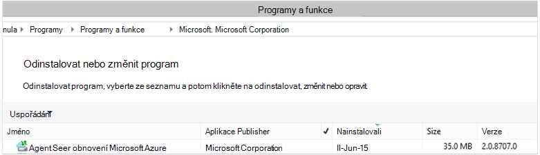

<properties
    pageTitle="Azure zálohovat - nasazením a správou zpět k používání DPM pomocí prostředí PowerShell | Microsoft Azure"
    description="Zjistěte, jak nasazením a správou Azure zálohování pro Data Protection Manager (DPM) pomocí prostředí PowerShell"
    services="backup"
    documentationCenter=""
    authors="Nkolli1"
    manager="shreeshd"
    editor=""/>

<tags
    ms.service="backup"
    ms.workload="storage-backup-recovery"
    ms.tgt_pltfrm="na"
    ms.devlang="na"
    ms.topic="article"
    ms.date="09/27/2016"
    ms.author="jimpark; trinadhk; anuragm; markgal"/>


# <a name="deploy-and-manage-backup-to-azure-for-data-protection-manager-dpm-servers-using-powershell"></a>Nasazením a správou zálohování Azure u serverů Data Protection Manager (DPM) pomocí prostředí PowerShell

> [AZURE.SELECTOR]
- [ARM](backup-dpm-automation.md)
- [Klasický](backup-dpm-automation-classic.md)

Tento článek popisuje, jak pomocí Powershellu nastavení Azure záložní na serveru DPM a spravovat zálohování a obnovení.

## <a name="setting-up-the-powershell-environment"></a>Nastavení prostředí PowerShell

[AZURE.INCLUDE [learn-about-deployment-models](../../includes/learn-about-deployment-models-include.md)]

Než budete moct použít prostředí PowerShell pro správu zálohování správce ochranu dat z Azure, bude potřebujete správné prostředí v prostředí PowerShell. Na začátku relaci Powershellu Ujistěte se, spusťte tento příkaz Importovat správné moduly a umožňují správně odkazovat DPM rutiny:

```
PS C:> & "C:\Program Files\Microsoft System Center 2012 R2\DPM\DPM\bin\DpmCliInitScript.ps1"

Welcome to the DPM Management Shell!

Full list of cmdlets: Get-Command
Only DPM cmdlets: Get-DPMCommand
Get general help: help
Get help for a cmdlet: help <cmdlet-name> or <cmdlet-name> -?
Get definition of a cmdlet: Get-Command <cmdlet-name> -Syntax
Sample DPM scripts: Get-DPMSampleScript
```

## <a name="setup-and-registration"></a>Instalační program a registrace
Chcete-li začít:

1. [Stáhněte si nejnovější Powershellu](https://github.com/Azure/azure-powershell/releases) (minimální verze povinné: 1.0.0)
2. Povolení commandlets Azure zálohování přepnutím do režimu *AzureResourceManager* pomocí PowerShell **Přepnout AzureMode** .:

```
PS C:\> Switch-AzureMode AzureResourceManager
```

Následující nastavení a registrace úkoly můžete automatické pomocí prostředí PowerShell:

- Vytvoření záložní trezoru
- Instalace agenta zálohování Azure
- Registrace ke službě Azure zálohování
- Nastavení sítě
- Nastavení šifrování

### <a name="create-a-backup-vault"></a>Vytvoření záložní trezoru

> [AZURE.WARNING] Zákazníkům, kteří používají Azure zálohování poprvé musíte zaregistrovat Azure zálohování poskytovatele se nemusí používat se svým předplatným. Lze to spuštěním následujícího příkazu: Register AzureProvider - ProviderNamespace "Microsoft.Backup"

Můžete vytvořit nový záložní trezoru pomocí PowerShell **New-AzureRMBackupVault** .. Zálohování trezoru je prostředek ARM, budete muset jeho umístění v rámci skupiny zdrojů. V konzole zvýšenými Azure PowerShell spusťte následující příkazy:

```
PS C:\> New-AzureResourceGroup –Name “test-rg” -Region “West US”
PS C:\> $backupvault = New-AzureRMBackupVault –ResourceGroupName “test-rg” –Name “test-vault” –Region “West US” –Storage GRS
```

Dostaňte seznam všech záložní trezorů v dané předplatného pomocí PowerShell **Get-AzureRMBackupVault** ..


### <a name="installing-the-azure-backup-agent-on-a-dpm-server"></a>Instalace agenta Azure zálohování na serveru DPM
Před instalací agenta zálohování Azure, musíte mít instalační službou systému stažené a prezentovat v systému Windows Server. Nejnovější verzi instalačního programu můžete přepnout z [Webu služby Stažení softwaru](http://aka.ms/azurebackup_agent) nebo ze stránky řídicího panelu záložní trezoru. Uložte instalační program snadno dostupné místo jako * C:\Downloads\*.

Pokud chcete nainstalovat agent, spusťte tento příkaz v zvýšenými prostředí PowerShell konzoly **na serveru DPM**:

```
PS C:\> MARSAgentInstaller.exe /q
```

Agent nainstalujete s výchozími možnostmi. Instalace trvá několik minut na pozadí. Pokud nezadáte možnost */nu* otevře se okno **Windows Update** na konci instalace vyhledat všechny aktualizace.

Agent se zobrazí v seznamu nainstalovaných programů. Pokud chcete zobrazit v seznamu nainstalovaných programů, přejděte do **Ovládacích panelů** > **programy** > **programy a funkce**.



#### <a name="installation-options"></a>Možnosti instalace
Zobrazte všechny možnosti dostupné prostřednictvím příkazového řádku, použijte tento příkaz:

```
PS C:\> MARSAgentInstaller.exe /?
```

Dostupné možnosti:

| Možnost | Podrobnosti | Výchozí |
| ---- | ----- | ----- |
| / q | Tichý instalace | - |
| / p: "umístění" | Cestu ke složce instalace agenta Azure zálohování. | Agent služby Azure obnovení C:\Program Files\Microsoft |
| / s: "umístění" | Cestu ke složce mezipaměti pro agenta Azure zálohování. | C:\Program Files\Microsoft Azure obnovení služby Agent\Scratch |
| /m | Vyjádření souhlasu v Microsoft Update | - |
| /nu | Po dokončení instalace není zkontrolovat aktualizace: | - |
| /d | Odinstaluje agentem služeb Microsoft Azure obnovení | - |
| /pH | Host (hostitel) adresy proxy serveru | - |
| /Po | Číslo portu proxy Host (hostitel) | - |
| /Pu | Uživatelské jméno proxy Host (hostitel) | - |
| /pW | Heslo proxy serveru | - |

### <a name="registering-with-the-azure-backup-service"></a>Registrace ke službě Azure zálohování
Před registrací se službou Azure zálohování, je třeba zajistit, že jsou splněné [požadavky](backup-azure-dpm-introduction.md) . Proveďte následující kroky:

- Platné Azure předplatné
- Máte záložní trezoru

Stahování přihlašovacích údajů trezoru, spusťte PowerShell **Get-AzureBackupVaultCredentials** v konzole Azure PowerShell a uložte ho na vhodné místo jako * C:\Downloads\*.

```
PS C:\> $credspath = "C:\"
PS C:\> $credsfilename = Get-AzureRMBackupVaultCredentials -Vault $backupvault -TargetLocation $credspath
PS C:\> $credsfilename
f5303a0b-fae4-4cdb-b44d-0e4c032dde26_backuprg_backuprn_2015-08-11--06-22-35.VaultCredentials
```

Zaregistrovali trezoru počítače probíhá pomocí rutiny [Start DPMCloudRegistration](https://technet.microsoft.com/library/jj612787) :

```
PS C:\> $cred = $credspath + $credsfilename
PS C:\> Start-DPMCloudRegistration -DPMServerName "TestingServer" -VaultCredentialsFilePath $cred
```

Tímto způsobem zaregistrujete DPM serveru s názvem "TestingServer" s Microsoft Azure trezoru pomocí přihlašovacích údajů zadaný trezoru.

> [AZURE.IMPORTANT] Nepoužívejte relativní cesty k zadání přihlašovacích údajů souboru trezoru. Absolutní cesta je nutné zadat vstupu rutině.

### <a name="initial-configuration-settings"></a>Počáteční nastavení
Jakmile serveru DPM máte zaregistrované v rámci trezoru Azure zálohování, začnou s výchozím nastavením předplatného. Nastavení předplatného obsahuje sítí, šifrování a pracovní oblasti. Chcete-li začít, změně nastavení předplatného budete muset nejdřív získat ty informace, existující nastavení (výchozí) pomocí rutiny [Get-DPMCloudSubscriptionSetting](https://technet.microsoft.com/library/jj612793) :

```
$setting = Get-DPMCloudSubscriptionSetting -DPMServerName "TestingServer"
```

Všechny změny provedené tohoto místního prostředí PowerShell objektu ```$setting``` a potom velmi dbá na DPM a zálohováním: Azure neuložit pomocí rutinu [Set-DPMCloudSubscriptionSetting](https://technet.microsoft.com/library/jj612791) úplné objektu. Je potřeba použít ```–Commit``` příznak zajistit, že jsou trvalé změny. Nastavení nebude použité a použít tak, že zálohování Azure Pokud potvrzena.

```
PS C:\> Set-DPMCloudSubscriptionSetting -DPMServerName "TestingServer" -SubscriptionSetting $setting -Commit
```

### <a name="networking"></a>Sítě
-Li připojení počítače DPM služby Azure zálohování na Internetu přes proxy server, pak nastavení proxy serveru stanovit zálohy proběhla úspěšně. Tím se provádí pomocí ```-ProxyServer```, ```-ProxyPort```, ```-ProxyUsername``` a ```ProxyPassword``` parametry s rutinu [Set-DPMCloudSubscriptionSetting](https://technet.microsoft.com/library/jj612791) . V tomto příkladu je žádný proxy server tak, aby jsme explicitně uvolnili libovolné informace související s proxy serveru.

```
PS C:\> Set-DPMCloudSubscriptionSetting -DPMServerName "TestingServer" -SubscriptionSetting $setting -NoProxy
```

Využití šířky pásma také možné ovládat s možností ```-WorkHourBandwidth``` a ```-NonWorkHourBandwidth``` pro danou sadu dny v týdnu. V tomto příkladu jsme nejsou nastavení žádné omezení.

```
PS C:\> Set-DPMCloudSubscriptionSetting -DPMServerName "TestingServer" -SubscriptionSetting $setting -NoThrottle
```

### <a name="configuring-the-staging-area"></a>Konfigurace pracovní oblasti
Agent Azure zálohování na serveru DPM musí dočasné úložiště pro data obnovit z cloudu (místní pracovní prostor). Konfigurace pracovní oblasti pomocí rutinu [Set-DPMCloudSubscriptionSetting](https://technet.microsoft.com/library/jj612791) a ```-StagingAreaPath``` parametr.

```
PS C:\> Set-DPMCloudSubscriptionSetting -DPMServerName "TestingServer" -SubscriptionSetting $setting -StagingAreaPath "C:\StagingArea"
```

Ve výše uvedeném příkladu pracovní oblasti nastaví se *C:\StagingArea* v prostředí PowerShell objektu ```$setting```. Ujistěte se, že do určené složky už existuje, jinak konečný potvrzení nastavení předplatného se nezdaří.


### <a name="encryption-settings"></a>Nastavení šifrování
Zálohování dat poslané na Azure záložní zašifrován chránit důvěrnost data. Přístupové šifrování je "heslo" dešifrovat data v době obnovení. Je důležité mít tyto informace bezpečných a zabezpečené po nastavení.

V následujícím příkladu, převede první příkaz řetězec ```passphrase123456789``` řetězec zabezpečené a přiřadí zabezpečené řetězec, který bude proměnná s názvem ```$Passphrase```. druhý příkaz nastaví zabezpečené řetězec ```$Passphrase``` jako heslo pro šifrování zálohy.

```
PS C:\> $Passphrase = ConvertTo-SecureString -string "passphrase123456789" -AsPlainText -Force

PS C:\> Set-DPMCloudSubscriptionSetting -DPMServerName "TestingServer" -SubscriptionSetting $setting -EncryptionPassphrase $Passphrase
```

> [AZURE.IMPORTANT] Zachovat přístupové údaje bezpečných a zabezpečené, když je nastavená. Nebude moct obnovení dat z Azure bez toto heslo.

V tomto okamžiku jste měli provedli všechny požadované změny ```$setting``` objektu. Nezapomeňte potvrďte změny.

```
PS C:\> Set-DPMCloudSubscriptionSetting -DPMServerName "TestingServer" -SubscriptionSetting $setting -Commit
```

## <a name="protect-data-to-azure-backup"></a>Ochrana dat Azure zálohování
V této části přidáte do výrobní server DPM a ochrana dat do místní úložiště DPM a potom Azure zálohování. V příkladu jsme ukazují, jak obecnějším údajům souborů a složek. Logika můžete snadno prodlužuje na zálohovat všechny zdroje dat podporované DPM. Všechny DPM zálohy se řídí podle ochranu skupiny (PG) s čtyři části:

1. **Členy skupiny** je seznam všech způsobem objektů (označovaná taky jako *zdroje dat* v DPM), které chcete zamknout ve stejné skupině zámek. Chcete například Ochrana výrobní VMs v jedné skupině zámek a databáze systému SQL Server v jiné skupině zámek mají různé záložní požadavky. Před může zálohovat všechny zdroje dat na serveru výrobní, které potřebujete, abyste měli jistotu agenta DPM je nainstalovaná na serveru a spravuje DPM. Postupujte podle pokynů k [instalaci agenta DPM](https://technet.microsoft.com/library/bb870935.aspx) a propojení na příslušný DPM server.
2. **Metoda ochranu dat** Určuje cílové umístění zálohy - páskou disku a cloudu. V našem příkladu jsme chránit data na místní disk a do cloudu.
3. **Plánu zálohování** , který určuje, kdy je potřeba vzít zálohování a jak často synchronizována data mezi DPM serveru a produkční server.
4. **Plán uchovávání informací** , které určuje, jak dlouho uchovávání obnovení bodů v Azure.

### <a name="creating-a-protection-group"></a>Vytvoření ochrany skupiny
Začněte tak, že vytvoříte nové ochranu skupiny pomocí rutinu [New-DPMProtectionGroup](https://technet.microsoft.com/library/hh881722) .

```
PS C:\> $PG = New-DPMProtectionGroup -DPMServerName " TestingServer " -Name "ProtectGroup01"
```

Výše uvedené rutina vytvoří ochranu skupiny s názvem *ProtectGroup01*. Existující ochranu skupiny můžete upravit tak, aby přidat zálohování Azure cloudu i později. Ale žádné změny ke skupině zámek – nové nebo existující - potřebujeme získat ty informace, *měnit* objekt pomocí rutiny [Get-DPMModifiableProtectionGroup](https://technet.microsoft.com/library/hh881713) .

```
PS C:\> $MPG = Get-ModifiableProtectionGroup $PG
```

### <a name="adding-group-members-to-the-protection-group"></a>Přidání členů skupiny do skupin ochrany
Každý Agent DPM zná seznamu zdroje dat na serveru, na kterém je nainstalován. Přidat zdroj ochranu skupiny, DPM Agent musí nejprve odeslat seznam zdrojů dat na server DPM. Jeden nebo více zdroje dat jsou potom vybraná a přidat do skupin ochrany. Prostředí PowerShell kroky potřebné k získání dosáhnout jsou:

1. Načtěte seznam všech serverů spravuje DPM pomocí agenta DPM.
2. Vyberte konkrétní server.
3. Načtěte seznam všech zdroje dat na serveru.
4. Vyberte jeden nebo více zdroje dat a je přidat do skupin ochrany

Seznam servery na kterých je nainstalovaný a spravují serverem DPM DPM Agent vzniká s rutinu [Get-DPMProductionServer](https://technet.microsoft.com/library/hh881600) . V tomto příkladu jsme filtrovat a pouze konfigurace PS s názvem *productionserver01* pro zálohování.

```
PS C:\> $server = Get-ProductionServer -DPMServerName "TestingServer" | where {($_.servername) –contains “productionserver01”
```

Teď vzdálené použití seznamu zdroje dat na ```$server``` pomocí rutiny [Get-DPMDatasource](https://technet.microsoft.com/library/hh881605) . V tomto příkladu jsme filtrují svazku *D:\* které chceme nastavení pro zálohování. Tento zdroj dat se pak přidá do ochranu skupiny pomocí rutiny [DPMChildDatasource přidat](https://technet.microsoft.com/library/hh881732) . Nezapomeňte, použít *objektu skupiny ochranu modifable * ```$MPG``` doplnit.

```
PS C:\> $DS = Get-Datasource -ProductionServer $server -Inquire | where { $_.Name -contains “D:\” }

PS C:\> Add-DPMChildDatasource -ProtectionGroup $MPG -ChildDatasource $DS
```

Opakujte tento krok jako opakovaně pokoušeli podle potřeby, dokud nepřidáte všechny vybrané zdroje dat ke skupině zámek. Můžete taky začínat jenom přes jeden zdroj dat a dokončení pracovního postupu při vytváření ochranu skupiny a později přidat další zdroje dat do skupin ochrany.

### <a name="selecting-the-data-protection-method"></a>Výběr způsobu ochrana dat
Jakmile zdroje dat přidané do skupin ochrany, dalším krokem je určení metody ochrany pomocí rutinu [Set-DPMProtectionType](https://technet.microsoft.com/library/hh881725) . V tomto příkladu bude skupině zámek nastavení pro zálohování cloudu a místní disk. Budete potřebovat k určení zdroje dat, které chcete zamknout do cloudu pomocí rutiny [Přidat DPMChildDatasource](https://technet.microsoft.com/library/hh881732.aspx) příznakem - Online.

```
PS C:\> Set-DPMProtectionType -ProtectionGroup $MPG -ShortTerm Disk –LongTerm Online
PS C:\> Add-DPMChildDatasource -ProtectionGroup $MPG -ChildDatasource $DS –Online
```

### <a name="setting-the-retention-range"></a>Nastavení oblasti uchovávání informací
Nastavení uchovávání informací pro záložní bodům pomocí rutinu [Set-DPMPolicyObjective](https://technet.microsoft.com/library/hh881762) . I když může zdát liché nastavit uchovávání plán zálohování definováno, pomocí ```Set-DPMPolicyObjective``` rutina automaticky nastaví výchozí záložní plán, který pak lze upravit. Je vždy možné nastavit zálohování naplánovat nejdřív a zásady uchovávání informací po.

V následujícím příkladu rutinu nastaví parametry uchovávání informací záloh disku. To zachová zálohy 10 dnů a synchronizovat data každých 6 hodin mezi produkční server a DPM serveru. ```SynchronizationFrequencyMinutes``` Nemá definovat intervalu záložní bod se vytvoří, ale jak často data zkopírována DPM server. tím zálohy zabránit tomu, aby je příliš velký.

```
PS C:\> Set-DPMPolicyObjective –ProtectionGroup $MPG -RetentionRangeInDays 10 -SynchronizationFrequencyMinutes 360
```

Záloh přejdete na Azure (DPM se označuje jako Online zálohování) oblasti uchovávání informací lze nakonfigurovat pro [dlouhodobou uchovávání informací pomocí schématu historických nadřazeného SYN (GFS)](backup-azure-backup-cloud-as-tape.md). To znamená že definujete zásad uchovávání informací kombinované zahrnující denně, týdně, měsíčně a roční zásady uchovávání informací. V tomto příkladu jsme vytvoření matice představující schéma složité uchovávání informací, které chceme a potom i konfiguraci oblasti uchovávání informací pomocí rutinu [Set-DPMPolicyObjective](https://technet.microsoft.com/library/hh881762) .

```
PS C:\> $RRlist = @()
PS C:\> $RRList += (New-Object -TypeName Microsoft.Internal.EnterpriseStorage.Dls.UI.ObjectModel.OMCommon.RetentionRange -ArgumentList 180, Days)
PS C:\> $RRList += (New-Object -TypeName Microsoft.Internal.EnterpriseStorage.Dls.UI.ObjectModel.OMCommon.RetentionRange -ArgumentList 104, Weeks)
PS C:\> $RRList += (New-Object -TypeName Microsoft.Internal.EnterpriseStorage.Dls.UI.ObjectModel.OMCommon.RetentionRange -ArgumentList 60, Month)
PS C:\> $RRList += (New-Object -TypeName Microsoft.Internal.EnterpriseStorage.Dls.UI.ObjectModel.OMCommon.RetentionRange -ArgumentList 10, Years)
PS C:\> Set-DPMPolicyObjective –ProtectionGroup $MPG -OnlineRetentionRangeList $RRlist
```

### <a name="set-the-backup-schedule"></a>Nastavte zálohování plán
DPM plánu zálohování výchozí automaticky nastaví zadáte cíle ochrany pomocí ```Set-DPMPolicyObjective``` rutiny. Chcete-li změnit výchozí plány, získáte pomocí rutiny [Get-DPMPolicySchedule](https://technet.microsoft.com/library/hh881749) následovaný rutinu [Set-DPMPolicySchedule](https://technet.microsoft.com/library/hh881723) .

```
PS C:\> $onlineSch = Get-DPMPolicySchedule -ProtectionGroup $mpg -LongTerm Online
PS C:\> Set-DPMPolicySchedule -ProtectionGroup $MPG -Schedule $onlineSch[0] -TimesOfDay 02:00
PS C:\> Set-DPMPolicySchedule -ProtectionGroup $MPG -Schedule $onlineSch[1] -TimesOfDay 02:00 -DaysOfWeek Sa,Su –Interval 1
PS C:\> Set-DPMPolicySchedule -ProtectionGroup $MPG -Schedule $onlineSch[2] -TimesOfDay 02:00 -RelativeIntervals First,Third –DaysOfWeek Sa
PS C:\> Set-DPMPolicySchedule -ProtectionGroup $MPG -Schedule $onlineSch[3] -TimesOfDay 02:00 -DaysOfMonth 2,5,8,9 -Months Jan,Jul
PS C:\> Set-DPMProtectionGroup -ProtectionGroup $MPG
```

Ve výše uvedeném příkladu ```$onlineSch``` je matice, která obsahuje existující ochrana online plán pro ochranu skupiny ve schématu GFS se čtyř prvků:

1. ```$onlineSch[0]```bude obsahovat denní plán
2. ```$onlineSch[1]```bude obsahovat týdenní plán
3. ```$onlineSch[2]```bude obsahovat měsíčního kalendáře
4. ```$onlineSch[3]```bude obsahovat roční plánu

Takže pokud potřebujete změnit týdenní plán, budete muset odkazují ```$onlineSch[1]```.

### <a name="initial-backup"></a>Počáteční zálohování
Při prvním zálohování na zdroj dat, DPM potřebuje k vytvoření počáteční otevřené, která vytvoří kopii zdroj dat chráněny svazku DPM otevřené. Tato akce můžete buď naplánovanou na určitý čas nebo je možné spouštět ručně pomocí rutinu [Set-DPMReplicaCreationMethod](https://technet.microsoft.com/library/hh881715) s parametrem ```-NOW```.

```
PS C:\> Set-DPMReplicaCreationMethod -ProtectionGroup $MPG -NOW
```
### <a name="changing-the-size-of-dpm-replica--recovery-point-volume"></a>Změna velikosti DPM otevřené a obnovení čárky hlasitosti
Můžete také změnit velikost DPM otevřené objem, jakož i stín kopírovat hlasitost pomocí rutiny [Set-DPMDatasourceDiskAllocation](https://technet.microsoft.com/library/hh881618.aspx) jako v příkladu: Get-DatasourceDiskAllocation - zdroj dat $DS Set-DatasourceDiskAllocation - zdroj dat $DS - ProtectionGroup $MPG – ruční - ReplicaArea (2 gb) - ShadowCopyArea (2 gb)

### <a name="committing-the-changes-to-the-protection-group"></a>Potvrzení změny do skupin ochrany
Nakonec změny třeba potvrzené před DPM může trvat zálohování na nové konfigurace ochranu skupiny. Důvodem je pomocí rutinu [Set-DPMProtectionGroup](https://technet.microsoft.com/library/hh881758) .

```
PS C:\> Set-DPMProtectionGroup -ProtectionGroup $MPG
```
## <a name="view-the-backup-points"></a>Zobrazení záložní body
Zobrazte seznam všech bodů obnovení pro zdroj dat můžete použít rutinu [Get-DPMRecoveryPoint](https://technet.microsoft.com/library/hh881746) . V tomto příkladu jsme udělejte toto:
- Vzdálené použití všechny PGs na serveru DPM, které budou uloženy v matici```$PG```
- získání zdroje dat odpovídající```$PG[0]```
- Pokud potřebujete všechny body obnovení pro zdroj dat.

```
PS C:\> $PG = Get-DPMProtectionGroup –DPMServerName "TestingServer"
PS C:\> $DS = Get-DPMDatasource -ProtectionGroup $PG[0]
PS C:\> $RecoveryPoints = Get-DPMRecoverypoint -Datasource $DS[0] -Online
```

## <a name="restore-data-protected-on-azure"></a>Obnovení dat uzamknutém Azure
Obnovení dat je tvořen kombinací ```RecoverableItem``` objektu a ```RecoveryOption``` objektu. V předchozí části jsme máte seznam záložní bodů pro zdroj.

V následujícím příkladu jsme ukazují, jak obnovit Hyper-V virtuálního počítače z Azure záložní kombinací záložní bodů s cílem obnovení. Tato volba zahrnuje:

- Vytvoření možnosti obnovení pomocí rutinu [New-DPMRecoveryOption](https://technet.microsoft.com/library/hh881592) .
- Načítání matice záložní bodům pomocí ```Get-DPMRecoveryPoint``` rutiny.
- Volba záložní přejděte na Obnovit z.

```
PS C:\> $RecoveryOption = New-DPMRecoveryOption -HyperVDatasource -TargetServer "HVDCenter02" -RecoveryLocation AlternateHyperVServer -RecoveryType Recover -TargetLocation “C:\VMRecovery”

PS C:\> $PG = Get-DPMProtectionGroup –DPMServerName "TestingServer"
PS C:\> $DS = Get-DPMDatasource -ProtectionGroup $PG[0]
PS C:\> $RecoveryPoints = Get-DPMRecoverypoint -Datasource $DS[0] -Online

PS C:\> Restore-DPMRecoverableItem -RecoverableItem $RecoveryPoints[0] -RecoveryOption $RecoveryOption
```

Příkazy můžete snadno rozšířit pro každý typ zdroje dat.

## <a name="next-steps"></a>Další kroky

- Další informace o Azure zálohování pro DPM najdete v článku [Úvod k DPM zálohování](backup-azure-dpm-introduction.md)
