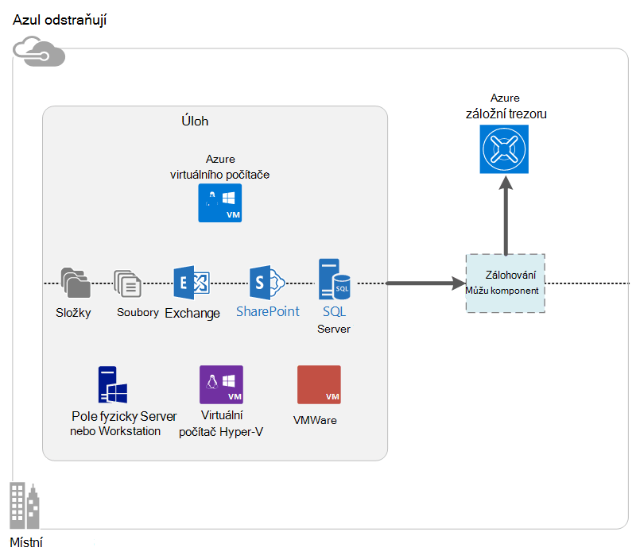

<properties
    pageTitle="Co je Azure zálohování? | Microsoft Azure"
    description="Pomocí Azure zálohování a obnovení Services můžete zálohování a obnovení dat a aplikace z Windows serverů, Windows klientské počítače, System Center DPM a Azure virtuálních počítačích."
    services="backup"
    documentationCenter=""
    authors="markgalioto"
    manager="cfreeman"
    editor="tysonn"
    keywords="zálohování a obnovení; obnovení služeb; řešení pro zálohování"/>

<tags
    ms.service="backup"
    ms.workload="storage-backup-recovery"
    ms.tgt_pltfrm="na"
    ms.devlang="na"
    ms.topic="get-started-article"
    ms.date="10/19/2016"
    ms.author="jimpark; trinadhk"/>

# Co je Azure zálohování?
Azure zálohování bylo služby, které používáte pro zálohování a obnovení dat v cloudu společnosti Microsoft. Nahradí existující místního nebo mimo řešení zálohování cloudové řešení spolehlivé, zabezpečené a náklady konkurence. Také pomáhá chránit materiálů, které se spouštějí v cloudu. Azure zálohování poskytuje obnovení služby založená na infrastrukturu celosvětovými, která je scalable trvalé a vysoce dostupné.

[Podívejte se na video Přehled zálohování Azure](https://azure.microsoft.com/documentation/videos/what-is-azure-backup/)

## Proč používat zálohování Azure?
Řešení pro tradiční zálohování vývojem do cloudu považovat za podobné disků nebo páskou koncový bod. Když tento přístup je jednoduché, není omezena. Není plně využívat základní platformě cloudu a se převádí na neefektivní drahé řešení.
Azure záložní naopak poskytuje všechny výhody řešení zálohování výkonné a dostupnou cloudu. Tady jsou některé klíčové výhody, které poskytuje Azure zálohování.

| Funkce | Výhoda |
| ------- | ------- |
| Správa automatického ukládání | Velké výdaje potřebné pro místní úložiště zařízení. Azure zálohování automaticky přiřazuje a spravuje úložišti a používá platovou jako se ovládáním spotřebu model. |
| Neomezený měřítka | Výhodou dostupnost záruky bez režijních údržby a sledování. Azure zálohování používá podkladových power a měřítka Azure cloudu, díky možnostem nonintrusive neobsahovaly text. |
| Více možností ukládání | Zvolte úložišti záložní podle potřeby:<li>Objektů blob bloků místně nadbytečné úložiště je ideální pro zákazníky kvalitní cena a pořád pomáhá chránit data před selháním místní hardwaru. <li>Objektů blob geo replikace úložiště blok nabízí tři více kopií v párových datacentra. Tyto další kopie pomáhají zajistit, že zálohování dat neexistuje vysoce i v případě, že dojde k Azure havárie úrovni webu. |
| Přenos neomezený dat | Během obnovení ze zálohy trezoru je bezplatná převodům výstupním (odchozí) data. Data příchozích zpráv na Azure je také zadarmo. Práce se službou importu, kde je k dispozici. |
| Šifrování | Šifrování umožňuje bezpečný přenos a úložiště data o zákaznících v veřejné cloudu. Přístupové šifrování je uložený ve zdroji a není přenášené informace ani uložené v Azure. Šifrovací klíč je potřeba k obnovení data a má jenom zákazník plný přístup k datům služby. |  
| Aplikace konzistentní zálohování | Aplikace konzistentní zálohy ve Windows pomáhají zajistit, že nejsou v době obnovení, což snižuje cíle časového využití potřebné opravy. Díky zákazníků, kteří mají vrátit spuštěna rychleji. |
| Dlouhodobé uchovávání informací | Namísto zaplatit mimo páskou řešení pro zálohování, můžou zákazníci zpátky do Azure, která řešením je atraktivní páskou Profesionálové v nízké náklady. |

## Azure součásti zálohování
Vzhledem k tomu, že zálohování bylo hybridní záložní řešení, se skládá z víc součástí, které spolupracují povolit začátku do konce zálohování a obnovení pracovní postupy.

### Scénáře nasazení

| Součásti | Můžete nasadit v Azure? | Může být nasazené místního? | Podporované cílového úložiště|
| --- | --- | --- | --- |
| Azure Backup agent | 
**Ano**
 
Agent Azure zálohování můžete být nasazené na libovolnou OM serveru Windows, které se spouští v Azure.
 | 
**Ano**
 
Agent zálohování můžete být nasazené na Windows Server OM nebo pole fyzicky počítače.
 | 
Azure trezoru zálohování
 |
| Správce ochranu dat System Center (DPM) | 
**Ano**

Další informace o [tom, jak chránit úloh v Azure pomocí System Center DPM](http://blogs.technet.com/b/dpm/archive/2014/09/02/azure-iaas-workload-protection-using-data-protection-manager.aspx).
 | 
**Ano**
 
Další informace o [tom, jak chránit pracovního vytížení a VMs ve vaší datacentra](https://technet.microsoft.com/library/hh758173.aspx).
 | 
Místní disk
 
Azure trezoru zálohování
 
páskou (místní pouze)
 |
| Server Azure zálohování | 
**Ano**

Další informace o [tom, jak chránit úloh v Azure pomocí serveru zálohování Azure](backup-azure-microsoft-azure-backup.md).
 | 
**Ano**
 
Další informace o [tom, jak chránit úloh v Azure pomocí serveru zálohování Azure](backup-azure-microsoft-azure-backup.md).
 | 
Místně připojený disk
 
Azure trezoru zálohování
 |
| Azure zálohování (soubory s příponou OM) | 
**Ano**

Část Azure struktury

Speciální pro [zálohování Azure infrastruktury služby (IaaS) virtuálních počítačích](backup-azure-vms-introduction.md).
 | 
**Ne**
 
Pomocí System Center DPM obecnějším údajům virtuálních počítačích ve vaší datacentra.
 | 
Azure trezoru zálohování
 |

### Součásti úrovně výhody a omezení

| Součásti | Výhody | Omezení | Obnovení rozlišení |
| --- | --- | --- | --- |
| Azure agent zálohování MARS) | <li>Můžete zálohovat soubory a složky na počítači s operačním systémem Windows být fyzické nebo virtuální (VMs může být kdekoliv místní nebo Azure)<li>Žádné samostatný záložní server vyžaduje<li>Použití Azure záložní trezoru | <li>Obnovení třikrát den záložní/soubor úrovně<li>Soubor nebo složku/hlasitost úrovně obnovit pouze, není aplikace vědět<li>Nepodporuje žádný Linux | soubory a složky a svazky |
| Správce ochranu dat System Center | <li>Aplikace vědět snímky (VSS)<li>Úplná flexibilita kdy bude trvat zálohování<li>Obnovení granularity (vše)<li>Můžete použít trezoru Azure zálohování<li>Podpora Linux (Pokud je hostitelem Hyper-V) | <li>Chybějící nesourodými podpory (VMware OM zpátky k obecnějším údajům pracovní zátěž Oracle zálohování).  | soubory a složky a svazky / VMs a aplikací |
| Zálohování serveru Microsoft Azure | <li>Aplikace vědět snímky (VSS)<li>Úplná flexibilita kdy bude trvat zálohování<li>Obnovení granularity (vše)<li>Můžete použít trezoru Azure zálohování<li>Podpora Linux (Pokud je hostitelem Hyper-V)<li>Nevyžaduje licence System Center | <li>Chybějící nesourodými podpory (VMware OM zpátky k obecnějším údajům pracovní zátěž Oracle zálohování).<li>Vždy vyžaduje živou Azure předplatné<li>Bez podpory pro zálohování páskou | soubory a složky a svazky / VMs a aplikací |
| Zálohování Azure IaaS OM | <li>Nativní zálohy systému Windows nebo Linux<li>Žádné povinné instalaci konkrétní agenta<li>Úrovně zálohování struktury s žádná záložní infrastruktura potřeby | <li>Jednou za den zpět nahoru či disketa úrovně obnovení<li>Nelze obecnějším údajům místní | VMs Všechny disků (pomocí Powershellu) |

## Aplikace a úloh lze zálohovat?

| Pracovní zátěž | Zdrojového počítače | Azure řešení zálohování |
| --- | --- |---|
| Soubory a složky | Windows Server | 
[Agent zálohování azure](backup-configure-vault.md)
 
[DPM System Center](backup-azure-dpm-introduction.md) (+ agenta zálohování Azure)
 
[Server Azure zálohování](backup-azure-microsoft-azure-backup.md) (včetně agenta zálohování Azure)
  |
| Soubory a složky | Klient systému Windows | 
[Agent zálohování azure](backup-configure-vault.md)
 
[DPM System Center](backup-azure-dpm-introduction.md) (+ agenta zálohování Azure)
 
[Server Azure zálohování](backup-azure-microsoft-azure-backup.md) (včetně agenta zálohování Azure)
  |
| Pro Hyper-V virtuálního počítače (Windows) | Windows Server | 
[DPM System Center](backup-azure-backup-sql.md) (+ agenta zálohování Azure)
 
[Server Azure zálohování](backup-azure-microsoft-azure-backup.md) (včetně agenta zálohování Azure)
 |
| Pro Hyper-V virtuálního počítače (Linux) | Windows Server | 
[DPM System Center](backup-azure-backup-sql.md) (+ agenta zálohování Azure)
 
[Server Azure zálohování](backup-azure-microsoft-azure-backup.md) (včetně agenta zálohování Azure)
  |
| Microsoft SQL Server | Windows Server | 
[DPM System Center](backup-azure-backup-sql.md) (+ agenta zálohování Azure)
 
[Server Azure zálohování](backup-azure-microsoft-azure-backup.md) (včetně agenta zálohování Azure)
  |
| Microsoft SharePoint | Windows Server | 
[DPM System Center](backup-azure-backup-sql.md) (+ agenta zálohování Azure)
 
[Server Azure zálohování](backup-azure-microsoft-azure-backup.md) (včetně agenta zálohování Azure)
   |
| Microsoft Exchange |  Windows Server | 
[DPM System Center](backup-azure-backup-sql.md) (+ agenta zálohování Azure)
 
[Server Azure zálohování](backup-azure-microsoft-azure-backup.md) (včetně agenta zálohování Azure)
   |
| Azure IaaS VMs (Windows) | - | [Azure zálohování (soubory s příponou OM)](backup-azure-vms-introduction.md) |
| Azure IaaS VMs (Linux) | - | [Azure zálohování (soubory s příponou OM)](backup-azure-vms-introduction.md) |

## Podpora ARM a Linux

| Součásti | Podpora ARM | Linux (Azure potvrzeného) podpory |
| --- | --- | --- |
| Azure agent zálohování MARS) | Ano | Ne (jenom pro Windows na základě agent) |
| Správce ochranu dat System Center | Ano (Agent v hosta) | Je možné jenom pouze soubor konzistentní zálohování Hyper-V (ne Azure OM) |
| Server Azure záložní (MABS) | Ano (Agent v guest) | Jenom pro Hyper-V (ne Azure OM) pouze soubor konzistentní zálohování bylo možné (stejně jako DPM) |
| Zálohování Azure IaaS OM | Ano | Ano |

[AZURE.INCLUDE [learn-about-deployment-models](../../includes/learn-about-deployment-models-include.md)]

## Zálohování a obnovení VMs Premium úložiště

Služba Azure zálohování teď chrání VMs úložiště Premium.

### Obecnějším údajům VMs úložiště Premium

Při zálohování Premium úložiště VMs službu zálohování vytvoří dočasné pracovní umístění v okně účet Premium úložiště. Pracovní umístění s názvem "AzureBackup-", je rovno součet dat velikost disků premium připojeny bude v angličtině.

>[AZURE.NOTE] Upravit nebo upravit pracovní umístění.

Po dokončení úloh zálohování pracovní umístění se odstraní. Cena úložiště pro pracovní umístění je konzistentní s [ceny úložiště Premium](../storage/storage-premium-storage.md#pricing-and-billing).

### Obnovení VMs úložiště Premium

Premium úložiště OM obnovit je může buď úložiště Premium nebo k normální úložiště. Obnovení bod obnovení Premium úložiště OM Premium úložiště je typické proces obnovení. Však může být nákladů efektivní obnovíte bod obnovení Premium úložiště OM standardní úložiště. Tento typ obnovení lze použít v případě potřeby podmnožinu soubory z OM.

## Funkce
Shrnutí funkce jak zálohování těchto pěti tabulek zpracování v jednotlivé součásti.

### Úložiště

| Funkce | Azure Backup agent | DPM System Center | Server Azure zálohování | Azure zálohování (soubory s příponou OM) |
| ------- | --- | --- | --- | ---- |
| Azure trezoru zálohování | ![Ano][green] | ![Ano][green] | ![Ano][green] | ![Ano][green] |
| Místa na disku | | ![Ano][green] | ![Ano][green] |  |
| Úložiště páskou | | ![Ano][green] |  | |
| Komprese (záložní trezoru) | ![Ano][green] | ![Ano][green]| ![Ano][green] | |
| Zálohování | ![Ano][green] | ![Ano][green] | ![Ano][green] | ![Ano][green] |
| Deduplication disku | | ![Částečně][yellow] | ![Částečně][yellow]| | |

Zálohování trezoru je cíl upřednostňované úložiště přes všechny komponenty. DPM System Center a zálohovat Server taky poskytují možnost, která kopii místní disk. Však pouze DPM Centrum systém poskytuje možnost zápis dat do páskou úložné zařízení.

#### Zálohování
Každá součást podporuje zálohování bez ohledu na cílového úložiště (disk, páskou, záložní trezoru). Zálohování zajišťuje zálohování úložiště a efektivně, čas přenosem pouze změny provedené od posledního zálohování.

#### Komprese
Zálohování komprimovány uvolnění povinná úložného prostoru. Pouze component, která nepoužívá komprese je OM rozšíření. S příponou OM všechny záložní data zkopírována z úložiště účtu zákazníka do záložní trezoru ve stejné oblasti bez komprese. Během přechodu bez komprese mírně nafoukne použité úložiště, ukládání dat bez komprese umožňuje rychlejší obnovit.

#### Deduplication
Deduplication je podporovaný pro System Center DPM a zálohovat Server zápisu [nasazenou v Hyper-V virtuálního počítače](http://blogs.technet.com/b/dpm/archive/2015/01/06/deduplication-of-dpm-storage-reduce-dpm-storage-consumption.aspx). Deduplication provádí na úrovni hostitele pomocí deduplication systému Windows Server na virtuálních pevných discích (VHD), které jsou připojené k počítači virtuální jako úložišti.

>[AZURE.WARNING] Deduplication není k dispozici v Azure některého z části zálohování. Při použití System Center DPM a zálohovat Server jsou v Azure, nemůžete deduplicated disků úložiště připojené bude v angličtině.

### Zabezpečení

| Funkce | Azure Backup agent | DPM System Center | Server Azure zálohování | Azure zálohování (soubory s příponou OM) |
| ------- | --- | --- | --- | ---- |
| Síť zabezpečení (Azure) | ![Ano][green] |![Ano][green] | ![Ano][green] | ![Částečně][yellow]|
| Zabezpečení dat (v Azure) | ![Ano][green] |![Ano][green] | ![Ano][green] | ![Částečně][yellow]|

Všechny záložní data z serverech do trezoru zálohování je šifrovaná pomocí rozšířeného standardní 256 šifrování. Data se pošle přes zabezpečený odkaz HTTPS. Zálohování dat uložený ve trezoru zálohování v šifrované podobě. Pouze zákazníka obsahuje heslo k odemknutí tato data. Microsoft nemůžete dešifrovat záložních dat kdykoli.

>[AZURE.WARNING] Klíč používaný k šifrování záložních dat je k dispozici pouze u zákazníka. Společnost Microsoft nezachová kopii v Azure a nemá žádné přístup ke klíči. Pokud je chybně umístěné klávesu, nejdou obnovit Microsoft záložních dat.

Zálohování Azure VMs vyžaduje nastavení šifrování *do* virtuálního počítače. Pomocí nástroje BitLocker na virtuálních počítačích Windows a **dm crypt** na virtuálních počítačích Linux. Azure zálohování nelze automaticky zašifrovat záložních dat, který se dodává pomocí této cesty.

### Podporované úloh

| Funkce | Azure Backup agent | DPM System Center | Server Azure zálohování | Azure zálohování (soubory s příponou OM) |
| ------- | --- | --- | --- | ---- |
| Windows Server počítače – souborů a složek | ![Ano][green] | ![Ano][green] | ![Ano][green] | |
| Klientského počítače se systémem Windows – souborů a složek | ![Ano][green] | ![Ano][green] | ![Ano][green] | |
| Pro Hyper-V virtuálního počítače (Windows) | | ![Ano][green] | ![Ano][green] | |
| Pro Hyper-V virtuálního počítače (Linux) | | ![Ano][green] | ![Ano][green] | |
| Microsoft SQL Server | | ![Ano][green] | ![Ano][green] | |
| Microsoft SharePoint | | ![Ano][green] | ![Ano][green] | |
| Microsoft Exchange  | | ![Ano][green] | ![Ano][green] | |
| Azure virtuálního počítače (Windows) | | | | ![Ano][green] |
| Azure virtuálního počítače (Linux) | | | | ![Ano][green] |

### Sítě

| Funkce | Azure Backup agent | DPM System Center | Server Azure zálohování | Azure zálohování (soubory s příponou OM) |
| ------- | --- | --- | --- | ---- |
| Síť komprese (záložní server) | | ![Ano][green] | ![Ano][green] | |
| Síť komprese (záložní trezoru) | ![Ano][green] | ![Ano][green] | ![Ano][green] | |
| Síťový protokol (záložní server) | | TCP | TCP | |
| Síťový protokol (záložní trezoru) | PROTOKOL HTTPS | PROTOKOL HTTPS | PROTOKOL HTTPS | PROTOKOL HTTPS |

Protože koncovku OM načte data přímo z Azure úložiště účet v síti úložiště, není nutné optimalizovat tento přenos. Přenos není v síti místní úložiště v Azure datacentru, není k dispozici malé potřebu komprese kvůli aspektech šířky pásma.

Pokud vaše data zálohujete záložní server (DPM nebo záložní Server), mohou být přenos z primárního serveru záložní server komprimovány uložit na šířku pásma.

#### Omezení sítě
Agent Azure zálohování poskytuje možnost omezení, který umožňuje určit, jak šířka pásma používaný během převodu dat. Omezení může být užitečné v případě potřeby obecnějším údajům dat během pracovní dobu, ale nechcete, aby při zálohování rušit jiných internetový provoz. Omezení u dat přenos platí pro zálohování a obnovení aktivity.

### Zálohování a uchovávání informací

|  | Azure Backup agent | DPM System Center | Server Azure zálohování | Azure zálohování (soubory s příponou OM) |
| --- | --- | --- | --- | --- |
| Zálohování frekvence (záložní trezoru) | Tři zálohy denně | Dva zálohy denně |Dva zálohy denně | Jedna záloha denně |
| Zálohování četnosti (na disku) | Nejde použít | 
Každých 15 minut pro systém SQL Server
 
Každou hodinu pro ostatní úloh
 | 
Každých 15 minut pro systém SQL Server
 
Každou hodinu pro ostatní úloh
 |Nejde použít |
| Možnosti uchovávání informací | Denně, týdně, měsíčně, ročně | Denně, týdně, měsíčně, ročně | Denně, týdně, měsíčně, ročně |Denně, týdně, měsíčně, ročně |
| Doba uchovávání informací | Až 99 roky | Až 99 roky | Až 99 roky | Až 99 roky |
| Obnovení bodů trezoru zálohování | Neomezený | Neomezený | Neomezený | Neomezený |
| Obnovení bodů na místní disk | Nejde použít | 64 soubor serverů  448 serverů aplikace | 64 soubor serverů  448 serverů aplikace |Nejde použít |
| Obnovení bodům páskou | Nejde použít | Neomezený | Nejde použít | Nejde použít |

## Co je soubor trezoru přihlašovacích údajů

Soubor trezoru přihlašovací údaje je certifikát generovaný portálu pro každou záložní trezoru. Na portálu pak odešle veřejný klíč pro služby Access řízení (ACS). Privátním klíčem je k dispozici pro uživatele při stahování přihlašovacích a potom zadané při registraci počítače. Soukromý klíč ověří počítače odeslání zálohování dat do identifikované trezoru ve službě Azure zálohování.

Pověření trezoru se použije pouze při registraci pracovního postupu. Je zodpovědní za to zajistit, že není ohroženo souboru trezoru přihlašovací údaje. Nacházející se v ruce jakékoli neoprávněné uživatelem, soubor přihlašovacích údajů trezoru lze použít k registraci jiných počítačů proti stejné trezoru. Vzhledem k tomu, že zálohování dat je šifrovaná pomocí heslo patří pouze k zákazníkovi, nemůže být však ohroženo existující záložní data. Zmírnění tento problém, trezoru přihlašovací údaje jsou nastavené platnosti v 48 hodin. Během si můžete stáhnout trezoru pověření zálohy vault počtu opakování, jenom nejnovější soubor platí při registraci pracovního postupu.

## Jak se liší Azure zálohování a obnovení webu Azure?
Množství zákazníků splést obnovení zálohování a obnovení. Sběr dat i poskytnutí sémantiku obnovit, ale jejich základní hodnota tvrzení se liší.

Azure zálohování vytvoří nahoru dat místních i cloudových. Obnovení Azure webu souřadnic virtuální počítač a fyzické serveru replikace, překlopení a překlopení zpět. Obě služby jsou důležité, protože řešení obnovení havárie je potřeba uchovávat data v bezpečí a obnovitelné (zálohování) *a* mít k dispozici úloh (obnovení webu) při výskytu výpadků.

Následující pojmy vám pomůžou rozhodovat důležité tipy k zálohování a katastrofě obnovení.

| Koncept | Podrobnosti | Zálohování | Obnovení havárie (DR) |
| ------- | ------- | ------ | ----------------- |
| Obnovení čárky cíle (operace RPO) | Velikost ztrátu přijatelného dat pokud obnovení je potřeba udělat. | Řešení pro zálohování mít široké variabilitě v jejich přijatelné operace RPO. Virtuální počítač zálohy obvykle mít operace RPO jeden den, zatímco zálohování databáze RPOs co nejnižší 15 minut. | Řešení obnovení havárie mít zhoršeným RPOs. Kopírovat DR lze za několik sekund, než nebo několik minut. |
| Obnovení čas cíle (RTO) | Velikost doba, po kterou je potřeba k dokončení obnovení nebo obnovení. | Z důvodu větší operace RPO množství dat, kterou je potřeba procesu řešení zálohování je obvykle podstatně vyšší, které vedou k delší RTOs. Například může to trvat dnů obnovení dat z pásky, v závislosti na dobu potřebnou k přenosu páskou v jiném umístění. | Řešení obnovení havárie mít menší RTOs, protože jsou více synchronní se zdrojem. Méně změn nutné zpracovat. |
| Uchovávání informací | Jak dlouho data musí být uloženy | Scénáře, které vyžadují provozní obnovení (poškození dat, odstranění neúmyslné souborů, s operačním systémem selhání) záložní data se obvykle zachovají 30 dní nebo méně. Z hlediska dodržování předpisů možná budete muset uchováván pro měsíců nebo dokonce počet let. Zálohování dat je ideální pro archivaci v takovém případě. | Obnovení katastrofě potřebuje jenom provozní obnovení dat, která obvykle trvá několik hodin nebo nahoru v den. Z důvodu snímání jemně odstupňovaná dat při řešení DR použití dat DR pro dlouhodobé uchovávání informací se nedoporučuje. |

## Další kroky

Vyzkoušejte si simple Azure zálohy. Pokyny najdete v tématu jednu z těchto kurzech:

- [Zkuste Azure zálohování](backup-try-azure-backup-in-10-mins.md)
- [Zkuste Azure OM zálohování](backup-azure-vms-first-look.md)

Protože tyto výukové programy pro zálohováním rychle, se zobrazují jenom nejkratší cestu pro zálohování dat. Další informace o typech zpátky do vyšší budete chtít, najdete v článku:

- [Obecnějším údajům počítače se systémem Windows](backup-configure-vault.md)
- [Obecnějším údajům úloh aplikace](backup-azure-microsoft-azure-backup.md)
- [Zálohování Azure IaaS VMs](backup-azure-vms-prepare.md)

[green]: ./media/backup-introduction-to-azure-backup/green.png
[yellow]: ./media/backup-introduction-to-azure-backup/yellow.png
[red]: ./media/backup-introduction-to-azure-backup/red.png
