<properties
   pageTitle="Zjistěte, jak pomocí zálohujte souborů a složek z Windows Azure pomocí zálohování Azure pomocí Správce prostředků nasazení modelu | Microsoft Azure"
   description="Informace o vytváření trezoru, nainstalujte agenta služby Recovery a zálohování soubory a složky na Azure zálohovat data systému Windows Server."
   services="backup"
   documentationCenter=""
   authors="markgalioto"
   manager="cfreeman"
   editor=""
   keywords="Postup zálohování; Postup zálohování"/>

<tags
   ms.service="backup"
   ms.workload="storage-backup-recovery"
   ms.tgt_pltfrm="na"
   ms.devlang="na"
   ms.topic="hero-article"
   ms.date="09/27/2016"
   ms.author="markgal;"/>

# Nejdřív najděte: zálohovat soubory a složky pomocí zálohování Azure pomocí Správce prostředků nasazení modelu

Tento článek vysvětluje, jak obecnějším údajům serveru Windows (nebo klienta Windows) souborů a složek na Azure pomocí zálohování Azure pomocí Správce prostředků. Je kurz určen vás provede základní informace. Pokud chcete začít používat zálohování Azure, jste na správném místě.

Chcete se dozvědět víc o zálohování Azure, najdete v tématu [Přehled](backup-introduction-to-azure-backup.md).

Zálohování souborů a složek na Azure vyžaduje těchto činností:

 získat Azure předplatného (pokud ještě nemáte jednu). 
 vytvořit služby Recovery trezoru. 
 stáhněte všechny potřebné soubory. 
 nainstalovat a přihlásit agenta obnovení služby. 
 zálohovat soubory a složky.

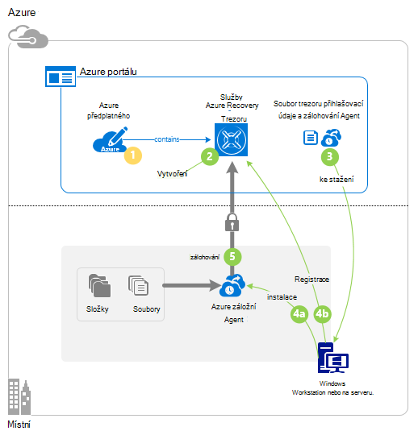

## Krok 1: Stáhněte si předplatné Azure

Pokud nemáte předplatné Azure, vytvořte [bezplatný účet](https://azure.microsoft.com/free/) , který umožňuje přístup k jiné služby Azure.

## Krok 2: Vytvoření trezoru obnovení služby

K obecnějším údajům soubory a složky, je potřeba vytvořit trezoru využití služeb v oblasti, ve které chcete data uložit. Potřebujete zjistit, jak chcete úložišti replikovat.

### Vytvoření trezoru obnovení služby

1. Pokud jste to ještě neudělali, přihlaste se k [Portálu Azure](https://portal.azure.com/) pomocí předplatného Azure.

2. V nabídce rozbočovači klikněte na tlačítko **Procházet** a v seznamu zdrojů zadejte **Služby Recovery** a na tlačítko **služby Recovery trezorů**.

    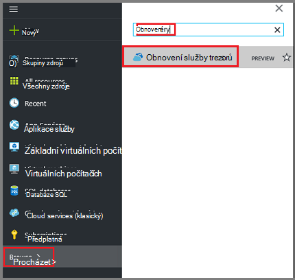  

3. V nabídce **trezorů obnovení služby** klikněte na **Přidat**.

    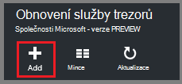

    Zásuvné trezoru služby Recovery otevře, která vás vyzve, abyste jim poslali **název** **předplatného**, **pole Skupina zdroje**a **umístění**.

    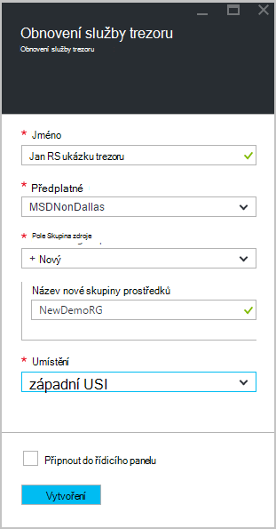

4. Pole **název**zadejte popisný název k identifikaci trezoru.

5. Klikněte na **předplatné** zobrazíte dostupná seznam předplatných.

6. **Pole Skupina zdroje** zobrazíte seznamu dostupné zdroje skupin nebo klikněte na **Nový** k vytvoření nové skupiny prostředků.

7. Klikněte na **umístění** vyberte zeměpisná oblast pro trezoru. Tato možnost určuje zeměpisnou oblast, kde se odesílá záložní data.

8. Klikněte na **vytvořit**.

    Pokud nevidíte trezoru uvedené po jejím dokončením, klikněte na **Aktualizovat**. Při aktualizaci seznamu klikněte na název trezoru.

### Chcete-li zjistit redundance úložiště
Při prvním vytvoření trezoru služby Recovery zjistíte, jak replikovat úložiště.

1. Klikněte na nový trezoru otevřete řídicího panelu.

2. V **Nastavení** zásuvné, který se automaticky otevře s řídícího trezoru, klepněte na **Zálohování infrastruktury**.

3. V zásuvné zálohování infrastruktury klepněte na **Zálohování konfigurace** zobrazíte **typ replikace úložiště**.

    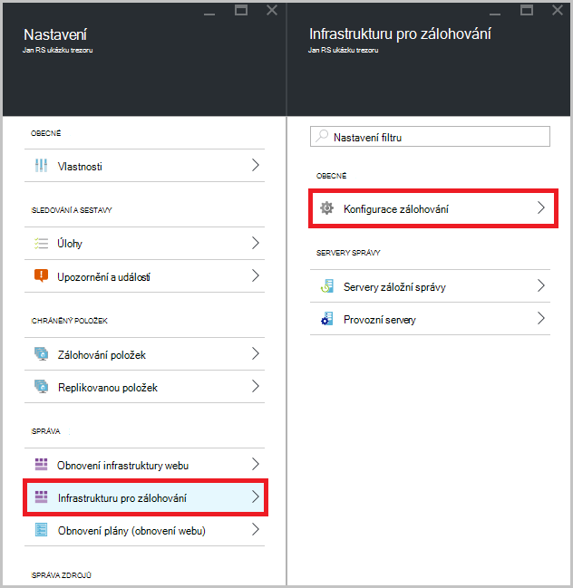

4. Zvolte možnost replikace odpovídající úložiště pro trezoru.

    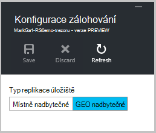

    Ve výchozím nastavení obsahuje trezoru geo nadbytečné úložiště. Pokud používáte Azure jako primární úložišti koncový bod, používejte dál jednotné geo nadbytečné úložiště. Pokud používáte Azure jako koncového bodu-primární úložišti, klikněte na místní nadbytečné úložiště, která bude snížit náklady na uchovávání dat v Azure. Další informace o [geo nadbytečné](../storage/storage-redundancy.md#geo-redundant-storage) a [místně nadbytečné](../storage/storage-redundancy.md#locally-redundant-storage) možnosti ukládání v tomto [Přehled](../storage/storage-redundancy.md).

Teď, když jste vytvořili trezoru, připravte infrastrukturu k obecnějším údajům souborů a složek stažením Microsoft Azure obnovení Services agent a trezoru přihlašovací údaje.

## Krok 3: soubor ke stažení souborů

1. Klikněte na **Nastavení** na řídicím panelu služby Recovery trezoru.

    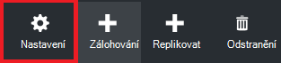

2. Klikněte na **Začínáme > Zálohování** na zásuvné nastavení.

    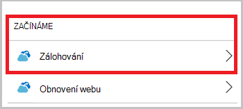

3. **Zálohování hledání** klikněte na zásuvné zálohování.

    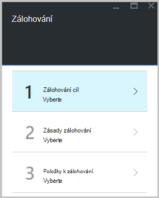

4. Vyberte **místní** z kde je vaše pracovní zátěž spuštěna? v nabídce.

5. Vyberte **soubory a složky,** k čemu se chcete zálohovat? Nabídka a klikněte na **OK**.

### Stažení služby Recovery agenta

1. Klikněte na **Stáhnout Agent pro Windows Server nebo klienta Windows** v zásuvné **připravit infrastruktury** .

    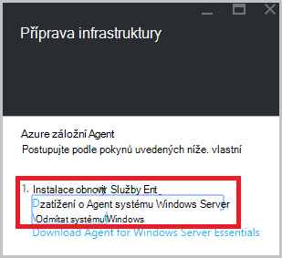

2. V místní nabídce stahování klikněte na **Uložit** . Ve výchozím nastavení **MARSagentinstaller.exe** soubor se uloží do složky pro stahování.

### Stahování přihlašovacích údajů trezoru

1. Klikněte na **Stáhnout > Uložit** na zásuvné infrastruktury připravit.

    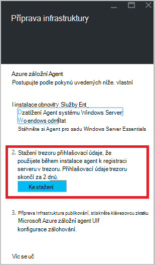

## Krok 4 – instalovat a registrovat agent

>[AZURE.NOTE] Povolení zálohování pomocí portálu Azure je brzy k dispozici. V současné době použijete k obecnějším údajům soubory a složky agentem služeb Microsoft Azure obnovení místní.

1. Vyhledejte a poklikejte na **MARSagentinstaller.exe** z složce Downloads (nebo uložený jinde).

2. Dokončete Průvodce nastavením agentem služeb Microsoft Azure obnovení. Dokončete průvodce potřebujete:

    - Vyberte umístění pro složku mezipaměti a instalaci.
    - Zadejte vašeho proxy server informací o serveru proxy server používáte pro připojení k Internetu.
    - Obsahují vaše uživatelské jméno a heslo podrobnosti použijete ověřeným proxy.
    - Pokud chcete stažený trezoru pověření
    - Uložte heslo šifrování na zabezpečeném místě.

    >[AZURE.NOTE] Pokud jste ztratili nebo zapomenete heslo, nemůže zajistit Microsoft obnovení záložních dat. Uložte soubor na zabezpečeném místě. Je potřeba k obnovení záložní.

Agent je teď nainstalovaný a váš počítač je registrovaná do trezoru. Jste připravení ke konfiguraci a naplánovat zálohování.

## Krok 5: Obecnějším údajům souborů a složek

Počáteční zálohování obsahuje dva klíčových úkolů:

- Plánování zálohování
- Vytvoření zálohy souborů a složek poprvé

Dokončete počáteční zálohování pomocí služby Microsoft Azure Recovery agent.

### Naplánování zálohování

1. Otevřete agenta Microsoft Azure obnovení Services. Najdete ji vyhledáním počítači **Microsoft Azure zálohování**.

    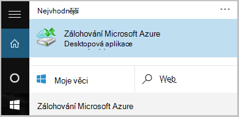

2. V agenta obnovení služby klikněte na **Naplánovat zálohu**.

    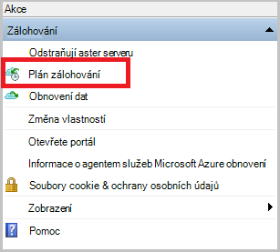

3. Na stránce Začínáme Průvodce plánem zálohování klikněte na **Další**.

4. Na vyberte položky, které chcete zálohování stránky klikněte na **Přidat položky**.

5. Vyberte soubory a složky, které chcete zálohovat a potom klikněte na **OK**.

6. Klikněte na tlačítko **Další**.

7. Na stránce **Určit plán zálohování** určit **plán zálohování** a klikněte na tlačítko **Další**.

    Můžou plánovat denně (maximální rychlostí třikrát za den) nebo týdenní zálohy.

    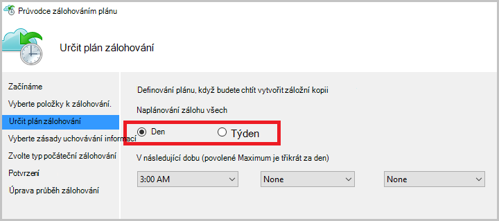

    >[AZURE.NOTE] Další informace o tom, jak určit plán zálohování, najdete v článku [Použití Azure záložní nahrazení infrastrukturu páskou](backup-azure-backup-cloud-as-tape.md).

8. Na stránce **Vyberte zásady uchovávání informací** vyberte **Zásady uchovávání informací** záložní kopie.

    Zásady uchovávání informací určuje doby trvání, u kterého budou uloženy zálohování. Místo jenom určující "ploché zásadu" pro všechny záložní body, můžete určit, zásady uchovávání informací různých podle toho, kdy dojde k zálohování. Zásady uchovávání informací denně, týdně, měsíční a roční podle vlastní potřeby můžete změnit.

9. Na stránce zvolit počáteční záložní typ zvolte typ počáteční zálohování. Ponechte možnost **automaticky v síti** vybranou a klikněte na tlačítko **Další**.

    Můžete zálohovat automaticky přes síť nebo můžete obecnějším údajům v offline režimu. Zbývající Tento článek popisuje postup zálohování automaticky. Pokud chcete provést zálohu offline, přečtěte si článek [Offline záložní pracovního postupu v Azure zálohování](backup-azure-backup-import-export.md) doplňující informace.

10. Na stránce potvrzení zkontrolujte informace a potom klikněte na **Dokončit**.

11. Po dokončení Průvodce vytvořením zálohy plánu, klepněte na tlačítko **Zavřít**.

### K obecnějším údajům souborů a složek poprvé

1. Ve službě agent obnovení služby klikněte na **Zálohovat** dokončete počáteční ohlašovat v síti.

    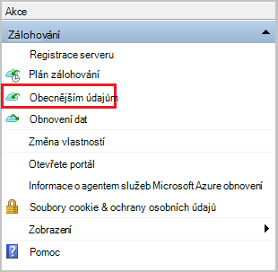

2. Na stránce potvrzení zkontrolujte nastavení, která zase teď průvodce použijete k obecnějším údajům v počítači. Potom klikněte na **Zpět**.

3. Klikněte na **Zavřít** zavřete průvodce. V takovém případě před dokončením procesu zálohování, zůstane v Průvodci běží na pozadí.

Po dokončení počáteční zálohování se zobrazí v konzole zálohování stav **dokončení projektu** .

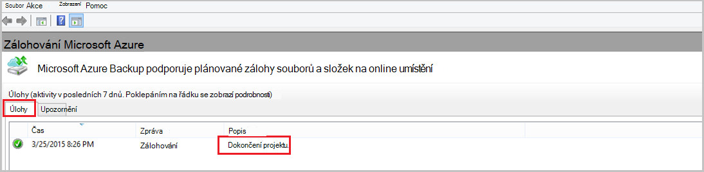

## Otázky?
Pokud máte nějaké dotazy nebo pokud je všechny funkce, které chcete zobrazit však započítávány, [napište nám](http://aka.ms/azurebackup_feedback).

## Další kroky
- Pokud potřebujete další informace o [zálohování počítačích Windows](backup-configure-vault.md).
- Teď jste zálohovala soubory a složky, můžete [Spravovat trezorů a servery](backup-azure-manage-windows-server.md).
- Pokud potřebujete obnovení záložní, použijte tento článek obnovení [souborů na počítači Windows](backup-azure-restore-windows-server.md).
