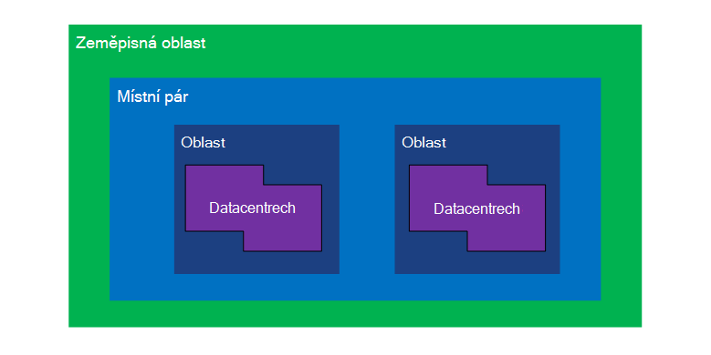
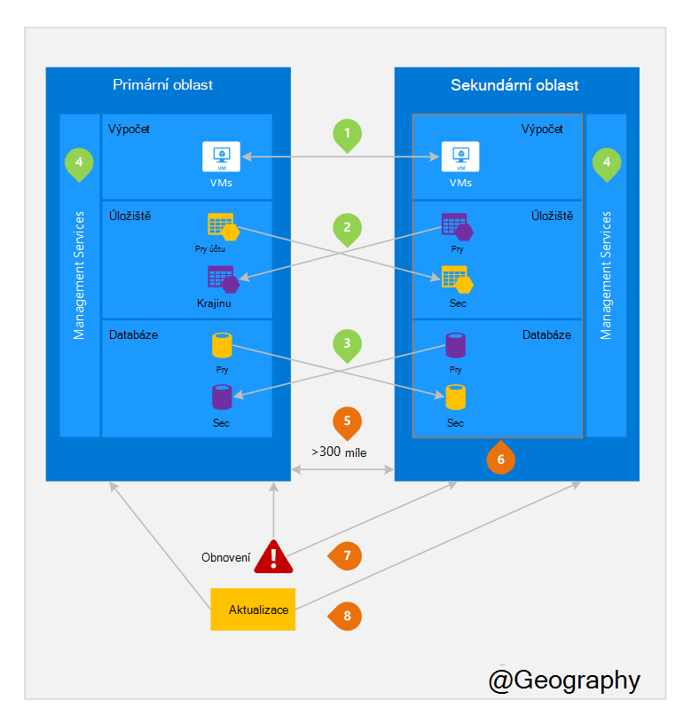

<properties
    pageTitle="Obchodní kontinuitu a katastrofě obnovení (BCDR): Azure párovaný oblastí | Microsoft Azure"
    description="Azure místní dvojice zajistit, aby aplikace pružné během dat centra chyby."
    services="site-recovery"
    documentationCenter=""
    authors="rayne-wiselman"
    manager="jwhit"
    editor=""/>

<tags
    ms.service="site-recovery"
    ms.workload="storage-backup-recovery"
    ms.tgt_pltfrm="na"
    ms.devlang="na"
    ms.topic="article"
    ms.date="08/23/2016"
    ms.author="raynew"/>

# Obchodní kontinuitu a havárie obnovení (BCDR): oblastí párovaný Azure

## Jaké jsou spárované oblastí?

Azure pracuje v různých zeměpisných ve světě. Je Azure zeměpisná oblast vymezené oblasti světa obsahující alespoň jeden Azure oblast. Azure oblast je oblast v rámci zeměpisná oblast obsahující datacentrech jeden nebo více.

Každou oblast Azure je spárované s jiné oblasti v rámci stejné zeměpisná oblast společně díky pár místní. Výjimky je jih Brazílie, které je spárované s oblast mimo jeho zeměpisná oblast.

Obrázek 1 – Azure místní pár diagramu

| Zeměpisná oblast     |  Párových oblastí  |                     |
| :-------------| :-------------   | :-------------      |
| Severní Amerika | Severní centrální USA | Jižní centrální USA    |
| Severní Amerika | Východní USA          | Západ USA             |
| Severní Amerika | Východního USA 2        | Centrální USA          |
| Severní Amerika | Západ USA 2        | Západní centrální USA     |
| Europe        | Severní Evropě     | Západní Evropa         |
| Země Asie          | Jihovýchodní Asie  | Východní Asie           |
| Čína         | Východní Číně       | Severní Číně         |
| Japonsko         | Japonsko východ       | Japonsko západní          |
| Brazílie        | Brazílie Jih (1) | Jižní centrální USA    |
| Austrálie     | Austrálie východ   | Austrálie jihovýchodní |
| Vládní organizace | Iowa Gov USA      | Virginie Gov USA     |
| Indie         | Centrální Indie    | Jižní Indie         |
| Kanada        | Centrální Kanada   | Kanada východ         |
| SPOJENÉ KRÁLOVSTVÍ            | Kanada západní          | Jih Spojené království            |

Tabulka 1 - mapování místní párů azure

> (1) jih Brazílie je jedinečné, protože je spárované s oblast mimo vlastní zeměpisná oblast. Sekundární oblast Jih Brazílie jih centrální nám ale sekundární oblast Jih centrální nám prvku není jih Brazílie.

Doporučujeme replikovat pracovního vytížení přes místní dvojice využívat zásady společnosti Azure izolace a dostupnosti. Například postupně nasazený aktualizace plánované Azure systému (ne současně) napříč párových oblastí. To znamená, že i v případě méně častých vadná aktualizace obě oblasti nebude to mít vliv na současně. Kromě toho pravděpodobně události obecných výpadku obnovení alespoň jeden oblasti mimo každou dvojici prioritu.

## Příklad párových oblastí
Obrázek 2 pod znázorňuje hypotetické aplikace, která používá místní pár havárie obnovení. Zelené čísla zvýraznění více oblasti aktivity tři Azure služeb (výpočet Azure úložiště a databáze) a jejich konfigurace replikovat různých oblastí. Jedinečný výhody nasazení přes párových oblastí jsou zvýrazněné oranžová čísly.

Obrázek 2 – hypotetické Azure místní pár

## Křížové oblasti aktivit
Podle obrázku 2.

 **Azure výpočet (PaaS)** – musí zřizovat další výpočetním zdroje předem zajistit zdroje jsou k dispozici v jiné oblasti během selhání. Další informace najdete v tématu [příručku Azure odolnost proti chybám](./resiliency/resiliency-technical-guidance.md).

 **Úložišti Azure** - Geo nadbytečné úložiště (GRS) je ve výchozím nastavení nakonfigurována při vytvoření účtu Azure úložiště. S GRS je vaše data automaticky replikovat třikrát, v oblasti primární a třikrát párových oblasti. Další informace najdete v tématu [Možnosti redundance úložiště Azure](storage/storage-redundancy.md).

 **Databáze SQL Azure** – s Azure SQL standardní Geo replikace, můžete nakonfigurovat asynchronní replikace transakce párových oblasti. S Premium Geo replikace můžete nakonfigurovat replikace všechny oblasti na světě; ale doporučujeme že nasadíte tyto materiály párových oblast pro většinu scénářů havárie obnovení. Další informace najdete v tématu [Geo replikace databáze SQL Azure](./sql-database/sql-database-geo-replication-overview.md).

 logické izolace součásti pro správu služby **Azure zdroje správce (ARM)** - ARM podstatě poskytuje v rámci oblastí. To znamená, že logické k chybám v jednom regionu pravděpodobně nižší mít vliv na jiné.

## Výhody párových oblastí
Podle obrázku 2.  

**fyzické izolace** – Pokud je to možné, Azure dává přednost aspoň 300 mil oddělení datacentrech dvojice místní sice to není praktické nebo možné ve všech geografických. Pole fyzicky datacentra oddělení snižuje pravděpodobnost natural havárie, civilní unrest, výpadků napájení nebo fyzické sítě výpadků došlo k ovlivnění obou oblastí najednou. Izolace podléhá omezení v rámci geography (zeměpisná oblast velikost dostupnosti infrastruktury power/sítě, právní, atd.).  

**platformu-za předpokladu, že replikace** - některých služeb, jako je Geo nadbytečné úložiště zadejte automatické replikace párových oblasti.

**oblast obnovení pořadí** – v případě obecných výpadku obnovení jednom regionu prioritu mimo každou dvojici. Aplikace, které jsou nasazeny přes párových regiony je zaručena mít jednu z oblastí obnoven priorita. Při nasazení aplikace v oblasti, které nejsou párovaný obnovení může být zpozdit – v nejhorší vybrané oblasti, mohou být poslední dvě má být vrácena.

**sekvenční aktualizuje** – systémové Azure plánovaná aktualizace rozšiřují párových oblasti postupně (ne současně) minimalizovat výpadek služeb, efekt chyby a logické k chybám v méně častých události chybná aktualizace.

**sídlo dat** – oblasti pohybovat stejné zeměpisná oblast jako jeho pár (s výjimkou Jižní Brazílie) za účelem splnění data sídlo požadavky pro účely jurisdikci vynucení daň a práva.

