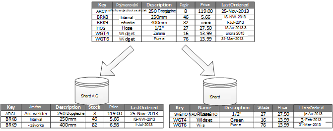
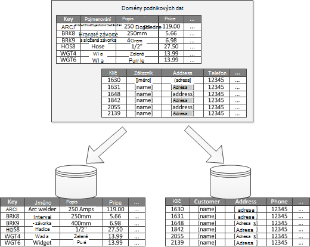

<properties
   pageTitle="Data rozdělení pokyny | Microsoft Azure"
   description="Pokyny, jak oddělit oddílů se spravují a otvírají samostatně."
   services=""
   documentationCenter="na"
   authors="dragon119"
   manager="christb"
   editor=""
   tags=""/>

<tags
   ms.service="best-practice"
   ms.devlang="na"
   ms.topic="article"
   ms.tgt_pltfrm="na"
   ms.workload="na"
   ms.date="07/14/2016"
   ms.author="masashin"/>

# Pokyny pro rozdělení dat

[AZURE.INCLUDE [pnp-header](../includes/guidance-pnp-header-include.md)]

## Základní informace

V mnoha rozsáhlé řešení dat je rozdělen samostatných oddílů, které lze spravovat a přistupovat odděleně. Rozdělení strategii musí být vybrány pečlivě maximalizovat výhody při minimalizace nepříznivě. Rozdělení pomáhá zlepšit škálovatelnost, omezit konflikty a optimalizovat výkon. Další výhodou rozdělení je, že dát jí tak mechanismus při dělení dat způsob použití. Například můžete archivovat starší, méně aktivní (studenou) dat v úložný prostor levnější.

## Proč oddílů dat?

Nejčastěji cloudové úložiště přihlašovacích údajů aplikace a služby a získat data v rámci svých operací. Návrh úložiště dat používaných v aplikaci můžete mít významné vliv na výkon, výkon a škálovatelnost systému. Jednou z technik běžně používaná v rozsáhlých systémy je rozdělení data do samostatné oddíly.

> Proces fyzicky rozdělení data do samostatný datový úložiště termínů _rozdělení_ použitého v návod odkazuje. Toto není stejný jako rozdělení tabulka serveru SQL Server, což je jiný koncept.

Rozdělení data nabízí několik výhod. Například může platit za účelem:

- **Zlepšení škálovatelnost**. Při měřítka systém jediném dosáhne postupně fyzických limit. Pokud rozdělíte dat mezi více oddílů, přičemž každý z nich je hostovaný na samostatném serveru, můžete změnit systém téměř donekonečna udržovat.
- **Zlepšení výkonu**. Operace s daty přístup na každý oddíl převzít menší objemu dat místo. Za předpokladu, že data je vhodné způsobem oddíly, rozdělení můžete zefektivnit systému. Operace, které ovlivňují více než jeden oddíl můžete spustit souběžně. Každý oddíl můžete vedle aplikace, která používá minimalizovat latence sítě.
- **Zlepšení dostupnosti**. Oddělení dat mezi servery zabrání selhání v jednom místě. Když serveru nepovede, nebo probíhá plánované údržby, jen tu část dat v je oddílů nedostupný. Operace v dalších oddílech můžete pokračovat. Zvýšení počtu oddíly snižuje relativní dopad selhání jednoho serveru v procentech data, která budou k dispozici. Replikace každého oddílu můžete dál tak snížit šanci selhání jeden oddíl došlo k ovlivnění operace. Usnadňuje také možné oddělit důležitých dat, které musí být neustále a vysoce dostupné na hodnotu Nízká dat, který nemá nižší dostupnost požadavky (například souborů protokolu).
- **Zvýšení zabezpečení**. Podle povahy data a jak se oddíly, je možné rozdělit citlivé a není citlivá data do různých oddílů a proto do jiných serverů nebo dat ukládá. Zabezpečení můžete pak konkrétně optimalizované pro citlivá data.
- **Poskytnutí provozní flexibilitu**. Rozdělení nabízí mnoho příležitostí pro pořádku optimalizace operace maximalizace správní účinnosti a minimalizace náklady. Můžete například definovat různé strategie pro správu, sledování, zálohování a obnovení a další úkoly správy podle důležitosti data v každý oddíl.
- **POZVYHLEDAT data obsahují způsob použití**. Rozdělení umožňuje každý oddíl nasadit na jiný druh úložiště dat na základě nákladů a integrované funkce, že data obsahují nabídky. Například velké binární data mohou být uložena v úložišti objektů blob dat při může být více strukturovaná data v databázi dokumentu. Další informace najdete v tématu [vytváření polyglot řešení] v příručce vzorků a postupy a [vysoce scalable řešení pro přístup k datům: pomocí SQL, NoSQL a polyglot trvalé] na webu společnosti Microsoft.

Některé systémy není implementovat rozdělení vzhledem k tomu, nebude považována za nákladů než výhodu. Běžné důvody tohoto odůvodnění patří:

- Mnoho datový úložiště systémy nepodporují spojení mezi oddíly a může být obtížné zachování referenční integrity v rozdělený systému. Je často nutné implementace spojení a kontroly integrity v kódu aplikace (v rozdělení layer), což může způsobit vstupu a další výstupu a složitosti aplikace.
- Zachování oddíly nebývá vždycky důvodu úkolu. V systému, kde je stále přepočítávané data můžete zkusit vyrovnání oddíly pravidelně ke snížení konflikty a aktivní body.
- Některé běžné nástroje nefungují přirozeným rozdělený daty.

## Navrhování oddíly

Data můžete rozdělit na oddíly různými způsoby: Vodorovně svisle nebo funkčně. Strategie, které zvolíte, závisí na důvod, proč k rozdělování dat a požadavky aplikací a služeb, které použije data.

> [AZURE.NOTE] Rozdělení schémata popsaná v této pokyny jsou vysvětleny způsobem, který je nezávislý úložiště technologie podkladová data. Je možné použít pro mnoho typů dat úložiště, včetně relační a NoSQL databáze.

### Rozdělení strategie

Jsou tři typické strategie k rozdělování dat:

- **Vodorovné rozdělení** (někdy označovány jako _sharding_). V této strategie je každý oddíl úložiště ve vlastním doprava, ale všechny oddíly mají stejné schéma. Každý oddíl se nazývá _shard_ a obsahuje dílčí sadu dat, například všechny objednávky pro určité skupiny zákazníky v aplikaci obchodování.
- **Svislý rozdělení**. V této strategie každý oddíl obsahuje podmnožinu pole položek v úložišti. Pole jsou rozdělené podle jejich vzorek použití. Například často používané pole může být umístěny v jeden oddíl svislé a méně často používané polí v jiném.
- **Rozdělení funkční**. V této strategie dat agregován podle toho, jak se používá tak, že každý ohraničenou kontext v systému. Například obchodování systému implementuje oddělit obchodními funkcemi pro fakturaci a správu zásob produktu mohou fakturační údaje do ukládat jeden oddíl a produkčních zásob dat v jiné.

Je důležité mít na paměti, že tři strategie zde popsané můžete společně. Nejsou vzájemně se vylučujících a doporučujeme vzít v úvahu všechny při navrhování schématu rozdělení oddílů. Například můžete rozdělit shards dat a pak pomocí kláves svislé rozdělení dál rozdělit data v jednotlivých shard. Data v funkční oddíl podobně jde rozdělit na shards (které lze také svisle rozdělit).

Požadavky na různé jednotlivé strategie však mohou vyvolat počet konfliktní problémů. Musíte zjistit a zůstatek všechny tyto při návrhu rozdělení schéma, které splňují cílů celkové zpracování dat výkonu systému. V následujících částech prozkoumání všech strategie podrobněji.

### Vodorovné rozdělení (sharding)

Obrázek 1 zobrazuje přehled vodorovné rozdělení nebo sharding. V tomto příkladu je údaje o stavu skladových zásob produktu rozdělen shards podle kód product key. Každý shard uchovává data souvislé oblasti shard klíčů (A G a H Z), uspořádány podle abecedy.

_Obrázek 1. Vodorovné rozdělení (sharding) dat na základě oddíl klíče_

Sharding vám pomáhá šířit načíst do více počítačů, které snižuje konflikty a zlepšuje výkon. Systém, můžete změnit tím, že přidáte další shards spuštěné v operačním systému další servery.

Nejdůležitější faktor při provádění této rozdělení strategie je volbou sharding klíče. Může být obtížné Změna klíče po systému. Klíč musíte se ujistit, že data oddíly tak, že pracovní zátěž jako i co nejjednodušší přes shards.

Všimněte si, že různých shards nemusíte obsahují podobná objemy dat. Místo toho více důležitým aspektem je vyrovnání počet požadavků. Některé shards může být obrovské, ale každá položka je předmětem nízký počet operací access. Další shards může být menší, ale všechny požadované položky přistupuje mnohem častěji. Je také třeba zajistí, že jeden shard měřítko omezení (výkon a zpracování zdrojů) použitý hostovat této shard úložiště.

Pokud používáte sharding schéma, nevytvářejte aktivní (nebo žádanou oddílů), které omezují výkon a dostupnosti. Například pokud používáte hash identifikátor odběratele místo první písmeno názvu zákazníků, zabránit chybné párování rozdělení, která je výsledkem běžné a méně běžné počáteční písmena. Toto je typický postup, který umožňuje distribuovat data rovnoměrněji mezi oddíly.

Zvolte sharding klíč, který slouží k minimalizaci všechny budoucí požadavky pro rozdělení velké shards na menší části coalesce malé shards do větších oddílů nebo změna schématu popisující data uložená v sadě oddílů. Tyto operace může trvat velmi dlouho a může vyžadovat jeden nebo více shards přepnutím do offline režimu a provádějí.

Pokud jsou replikovat shards, je možné nechejte část repliky online, zatímco ostatní jsou rozdělení sloučených nebo překonfigurovat. Systém však potřebovat omezit operace, které lze provádět s daty v těchto shards probíhající nové konfigurace. Data v replik můžete například označený jen pro čtení jak omezit obor inconsistences, ke kterým může dojít během shards jsou restrukturalizace.

> Podrobnější informace a pokyny k spoustu tyto aspektech a vhodné technik pro navrhování úložiště dat, které implementace vodorovné rozdělení najdete v tématu [Sharding vzorku].

### Svislé rozdělení

Nejběžnější slouží k svislé rozdělení je omezit vstupu a výstupu a výkonu náklady spojené s načítání položky, které jsou k nim získat přístup modus-nejčastěji. Obrázek 2 znázorňuje příklad svislé rozdělení. V tomto příkladu se uskutečňuje různé vlastnosti pro každou položku data do různých oddílů. Jeden oddíl obsahuje data, která přistupuje častěji, včetně názvu, popisu a informace o cenách pro produkty. Jiné obsahuje objem papír a datem poslední seřazený.

_Obrázek 2. Svisle rozdělování dat vzorkem použití_

V tomto příkladu aplikace pravidelně dotazy produktu název, popis a cena při zobrazení Podrobnosti o produktu pro zákazníky. Burzovní úrovně a datum, kdy byl produkt poslední objednali od výrobce se uskutečňuje na samostatný oddíl, protože tyto dvě položky se běžně používají společně.

Toto rozdělení schéma má výhodu, že data relativně pomalu se přesouvající (produktu název, popis a cena) je oddělená od více dynamických dat (burzovní úroveň a poslední uspořádaných datum). Aplikace může stát skutečným do mezipaměti zpomalit přesunutí dat v paměti, pokud je často přístup.

Jiné běžný u této rozdělení strategie je maximalizovat zabezpečení citlivá data. Můžete to udělat například, uložením čísla kreditních karet a odpovídající čísla ověření karet zabezpečení v samostatné oddíly.

Svislý rozdělení lze také zkrátit souběžné přístupu, kterou je potřeba k data.

> Svislý rozdělení pracuje na úrovni entity v úložišti částečně normalizace entita které rozdělí ji z _široké_ položky do sady _filtrování_ položek. Je ideální pro úložiště orientovaného sloupec dat, například HBase a Cassandra. Pokud jsou data v kolekci sloupců pravděpodobně měnit, můžete taky použít sloupci uloženy v SQL Server.

### Funkční rozdělení

Pro systémy, kde je možné stanovit ohraničenou kontext pro každou oblast různých business nebo služby v aplikaci funkční rozdělení poskytuje techniku zvýšení výkonu izolace a dat aplikace access. Jiné běžné funkční rozdělení slouží k oddělení pro čtení a zápis dat z jen pro čtení dat, který se používá pro účely vykazování. Obrázek 3 zobrazuje přehled funkčních rozdělení, kde zásob data oddělená od data o zákaznících.

_Obrázek 3. Funkčně rozdělení data podle ohraničenou kontextu nebo subdomain (subdoména)_

Toto rozdělení strategii objemu dat aplikace access konflikty přes různé části systému.

## Navrhování oddíly rozšiřitelnost

Je důležité zvážit velikost a pracovní zátěž pro každý oddíl a zůstatek je tak, aby data úměrně dosáhnout maximální škálovatelnost. Tak, aby nepřekročí měřítka limity úložiště jeden oddíl však nutné oddílů také data.

Při návrhu oddíly rozšiřitelnost, postupujte takto:

1. Analýza aplikace pochopit vzorky dat přístup, například velikosti sady výsledků vrácených obou dotazů, počet_plateb přístupu, inherentní latence a straně serveru výpočetního požadavky na zpracování. V mnoha případech bude požadovat několik hlavní entity většinu zpracování zdrojů.
2. Použijte tuto analýzu k určení cílů současné i budoucí škálovatelnost, jako je velikost dat a pracovní zátěž. Mezi oddíly podle cílové škálovatelnost distribute data. Do vodorovné rozdělení strategie volba klávesu odpovídající shard je důležité, abyste měli jistotu, že rozdělení je i. Další informace najdete v tématu [Sharding vzorku].
3. Ujistěte se, že jsou k dispozici pro každý oddíl zdroje umožňující zpracování škálovatelnost požadavky z hlediska dat velikost a výkon. Například uzel, který je hostitelem oddíl můžou omezit pevného počtu úložný prostor, zpracování power nebo šířka pásma, která poskytuje. Pokud požadavky na datový úložiště a zpracování mívají tato omezení překročí, může být nutné k upřesnění strategie oddílů nebo oddělení buněk se na další. Jedním ze způsobů škálovatelnost například může být oddělili protokolování dat od základní funkce aplikace. Můžete to provést pomocí samostatný datový úložiště nechcete, aby požadavky na úložiště součet dat z větší než limit velikosti uzlu. Pokud celkový počet datových úložišť uzel omezení překračuje, může být nutné použít oddělené paměťové uzlů.
4. Sledujte systému za použití a ověřte, že data distribuuje podle očekávání a že oddíly můžete zpracovat zatížení, které je uložené na nich. Je možné využití neodpovídá použití, které se předpokládá analýzou. V takovém případě je možné vyrovnání oddíly. To selže může být nutné změnit návrh některé části funkcí systému získat požadované rozložení.

Poznámka: některé cloudových prostředí přidělení zdrojů z hlediska infrastruktury omezení. Zajistit, aby limity vybrané hranice poskytují dostatek místa pro všechny očekávané nárůst objemů dat z hlediska ukládání dat, výkon a šířku pásma.

Příklad použití úložiště tabulek Azure zaneprázdněné shard může vyžadovat více zdrojů, než jsou k dispozici pro jeden oddíl pro zpracování žádostí o. (Není omezení objemu požadavky, které máte tak, že jeden oddíl určitou dobu. Najdete na stránce [cílů výkon a škálovatelnost Azure úložiště] na webu společnosti Microsoft pro další podrobnosti.)

 Pokud jde v případě, shard potřebovat přeformátován roztažením načíst. Pokud celkovou velikost a výkon v této tabulce překročí kapacitu úložiště účet, může být nutné vytvořit další úložiště účty a rozšířit tabulky mezi těchto účtů. Pokud počet úložiště účtů větší než počet účty, které jsou k dispozici pro předplatné, pak je nutné použít víc předplatných.

## Navrhování oddíly výkonu dotazu

Výkonu dotazu můžete zesílen často pomocí menší sady dat a spuštěním paralelní dotazy. Každý oddíl by měl obsahovat malou část celé datové sady. Toto snížení hlasitosti dosáhnout zvýšení výkonu dotazů. Rozdělení se však alternativy pro navrhování a konfiguraci databáze řádně podporovat. Například zkontrolujte, jestli potřebné indexy na místě, pokud používáte relační databáze.

Při návrhu oddíly výkonu dotazu, postupujte takto:

1. Zkontrolujte požadavky na aplikace a výkonu:
    - Požadavky na obchodní použijte k určení kritické dotazy, které musí vždy provést rychle.
    - Sledujte systém k identifikaci dotazy, které pomalé.
    - Vytvoření, které se dotazy provádí modus-nejčastěji. Jedna instance obou dotazů mít minimální cena, ale kumulativní spotřeba zdrojů může být významný. Může být užitečné k oddělení data, která je načtena podle těchto dotazů do různých oddílů nebo dokonce mezipaměti.
2. Oddíl dat, který způsobuje snížení výkonu:
    - Omezení velikosti každý oddíl tak, aby doba odezvy dotaz v cílovém.
    - Navrhněte klávesu shard tak, aby aplikace mohli snadno najít oddílu, pokud vodorovné rozdělení. To zabrání dotaz procházení všech oddílů.
    - Zvažte umístění oddílu. Pokud je to možné zkuste uchovávat data v oddíly, které jsou zeměpisně zavřít aplikací a uživatelé, kteří k ní přístup.
3. Pokud entita požadavky na výkon výkon a dotaz, použijte funkční rozdělení založené na této entity. Pokud to ještě nemá požadavkům, použijte vodorovné rozdělení stejně. Ve většině případů bude postačovat strategii jednoho oddílů, ale v některých případech je ke kombinování obě strategie efektivnější.
4. Zvažte použití asynchronní dotazy, které vytvářet paralelně všech oddílů, aby se zvýšil výkon.

## Navrhování oddíly dostupnosti

Rozdělení data můžete zlepšit dostupnost aplikací zajišťuje celou sadu nepředstavuje selhání v jednom místě a že jednotlivé podmnožiny datové dá se ovládat nezávisle na sobě. Replikace oddílů, které obsahují důležitá data, můžete zlepšit dostupnost.

Při navrhování a provádění oddíly, uvažte následující faktory, které ovlivňují dostupnost:

- **Jak kritické data, je podnikání**. Některá data mohou obsahovat informace o zaměstnání důležité údaje faktury ATP bankovní transakce. Jiná data mohou obsahovat méně důležité provozní dat, například protokoly, trasování výkonu a tak dál. Po určení jednotlivých typů dat, zvažte:
    - Ukládání důležitá data do vysoce dostupných oddílů s plánem odpovídající zálohování.
    - Vytvoření samostatného Správa a sledování mechanismy nebo postupy pro různé criticalities každé datové sady. Umístěte data, která má stejné úrovni závažnosti ve stejném oddílu tak, že jej lze zálohovat společně s příslušnou frekvencí. Například oddílů, které obsahují data pro bankovní transakce potřebovat častěji oddílů, které obsahují protokolování a sledování informací zálohovat.
- **Jak se dá ovládat jednotlivé oddíly**. Navrhování oddíly kvůli podpoře nezávislé správní a údržba nabízí několik výhod. Příklad:
    - Pokud oddíl se nezdaří, ji můžete obnovit nezávisle na sobě beze změny instancí aplikace, které přístup k datům v dalších oddílech.
    - Rozdělení data podle zeměpisná oblast umožňuje plánovanou údržbu úkolů na největšího pro každé umístění. Zajištění oddíly není příliš velký zabráníte plánované údržby vystavení během tohoto období.
- **Jestli chcete replikovat důležitá data mezi oddíly**. Tuto strategii můžete zlepšit dostupnost a výkonu, i když ji může způsobit problémy konzistence. Čas změny provedené s daty v oddílu se synchronizovat s každého otevřené trvá. Během tohoto období různých oddílů bude obsahovat různé datové hodnoty.

## Principy rozdělení vliv bude mít návrh a vývoj

Pomocí rozdělení přidá složitost navrhování a vývoj systému. Zvažte rozdělení jako zásadní součást systému návrh i v případě systému původně obsahuje pouze jeden oddíl. Pokud zabývat rozdělení jako chodím při spuštění systému má negativní vliv výkon a škálovatelnost problémy zvyšuje složitost vzhledem k tomu, že už máte aktivním systému chcete zachovat.

Pokud aktualizujete systému zahrnovat oddílů v tomto prostředí, vyžaduje úpravy logiky dat aplikace access. Můžete taky zahrnovat migrace velké množství existující data členům mezi oddíly, často během uživatelé očekávat, abyste mohli pokračovat v systému.

V některých případech rozdělení není považovány za důležité, protože počáteční datovou sadu je malý a můžete snadno uskutečněných jednotlivými jeden server. To může platit v systému, který není správně zobrazit za jeho původní velikosti, ale mnoho komerční systémy muset rozbalte jako počet poštovních zvýšení uživatelů. Toto rozšíření obvykle připojí nárůst objemu dat.

Je také třeba porozumět tomu, že rozdělení není vždy funkci velký datový úložiště. Například malý datový úložiště může být velkém přístup k stovky souběžné klientů. Rozdělení data v takovém případě pomůže snížit konflikty a zlepšit výkon.

Když navrhujete schématu rozdělení oddílů dat, zvažte následující možnosti:

- **Pokud je to možné, svázat dat pro nejběžnější operace databáze do každého oddílu minimalizovat operace s daty křížově oddíl přístup**. Dotazování mezi oddíly může zabrat hodně více než dotazování pouze v jednom oddílu, ale optimalizace oddílů pro jednu sadu dotazů mohou nepříznivě ovlivnit jiné množiny dotazů. Pokud nemůžete vyhnout se dotazování mezi oddíly, minimalizujte čas dotazu spuštěním paralelní dotazy a seskupení výsledků v aplikaci. Tento postup nebude možné v některých případech, například když je nezbytné k získání výsledku z jednoho dotaz a použít v dalším dotazu.
- **Dotazy-li použít relativně statický referenčních dat, jako jsou poštovní směrovací tabulky nebo seznamy produktů, zvažte replikace tato data ve všech oddílů zmenšit požadavku na samostatném vyhledávání operací do různých oddílů**. Tento postup můžete také změnit pravděpodobnost referenčních dat stále "žádanou" sady dat, která je předmětem hodně přenosy z celého systému. Je ale další náklady spojené s synchronizace žádné změny, které může dojít k těmto datům odkaz.
- **Pokud je to možné, minimalizovat požadavky pro referenční integrity mezi oddíly svislé a funkční**. V těchto režimů je zodpovědný za zachování referenční integrity mezi oddíly, když se při aktualizacích a spotřebované množství dat samotnou aplikaci. Dotazy, které musí připojení dat ve více oddílů pomaleji více než dotazy, které spojení dat pouze v rámci stejného oddílu, protože obvykle potřebuje k provedení po sobě jdoucí dotazů v závislosti na klávesy a potom na cizí klíč. Zvažte místo toho replikace nebo zrušit normalizace příslušná data. Minimalizovat čas dotazu, kde jsou potřeby oddíl křížové spojení spouštění paralelní dotazů přes oddíly a připojovat se k datům v aplikaci.
- **Zvažte efekt, který může mít schématu rozdělení oddílů na konzistence dat mezi oddíly.** Rozhodněte, zda silných konzistence je skutečně povinné. Místo toho běžné přístup v cloudu je implementovat případné konzistence. Samostatně aktualizaci dat v jednotlivých oddílů a logiky aplikace zaručuje, že aktualizace jsou všechny byla úspěšně dokončena. Zpracuje také nekonzistence, které mohou vznikat dotazy na data je spuštěná operaci postupně konzistentní. Podrobnosti o implementaci případné konzistence najdete v článku [Základy konzistence Data].
- **Zvažte jak dotazů najít správný oddíl**. Pokud dotazu musí prohledat všechny oddíly vyhledejte požadované údaje, podívejte se významný dopad na výkon, i když používáte víc paralelní dotazů. Dotazy, které se používají s svislé a funkční rozdělení strategie můžete určit přirozeným oddíly. Vodorovné rozdělení (sharding) může být ale vyhledání složité položky, protože každé shard má stejné schéma. Typické vyřešíte sharding je udržovat mapování, které lze použít pro vyhledání umístění shard pro konkrétní položky data. Mapa můžete implementovaná v logických sharding rohu aplikace nebo vedené úložišti Pokud podporuje průhledné sharding.
- **Při použití vodorovné rozdělení strategii, zvažte pravidelně nové posouzení shards**. Díky stejně široké data podle velikosti a pracovní zátěž minimalizovat aktivní, zvýšení výkonu dotazu a řešení problémů spojených omezení fyzické úložiště. To je ale složitou úlohu, která často vyžaduje použití vlastního nástroje nebo obrázku.
- **Pokud replikovat každý oddíl poskytuje dodatečnou ochranu před selháním**. Pokud jeden otevřené nepovede, dotazů můžete směřovat funkční kopie.
- **Pokud se dostanete fyzické limity strategii rozdělení možná muset rozšířit škálovatelnost různé úrovně**. Třeba při rozdělení na úrovni databáze, můžete zkusit vyhledejte nebo replikovat oddílů ve více databází. Pokud rozdělení je už na úrovni databáze a fyzické omezení se problém nepovedlo odstranit, mohlo by to znamenat, že budete muset vyhledejte nebo replikovat oddílů ve více účtů hostingu.
- **Vyhněte se transakce, které přístupu k datům v více oddílů**. Některé datový úložiště implementace konzistence a integritu pro operace, změnit data, ale jen v případě dat se nachází v jednom oddílu. Pokud potřebujete podporu transakcí přes více oddílů, bude pravděpodobně třeba implementace jako součást logiky aplikace vzhledem k tomu, že většina rozdělení systémy nenabízejí nativní podporu.

Všechny úložiště dat vyžaduje některé provozní Správa a sledování aktivity. Úkoly v rozsahu načítání dat, zálohování a obnovení dat, novým uspořádáním dat a zajistit, že systému funguje správně a efektivně.

Uvažte následující faktory, které ovlivňují provozní správy:

- **Jak implementovat odpovídající správy a provozu při oddíly data**. Může obsahovat tyto úlohy zálohování a obnovení archivace dat sledování systému a další úkoly správy. Například může být složité zachovat logické konzistence během operace zálohování a obnovení.
- **Načtení dat do více oddílů a přidání nových dat, je příchozí z jiných zdrojů**. Některé nástroje a nástroje nepodporuje operace sharded dat, například načítání dat do oddílu správné. To znamená, že bude pravděpodobně nutné vytvořit nebo získat nové nástroje.
- **Jak archivace a odstranění dat v pravidelných intervalech**. Nechcete, aby nadbytečné růst oddíly, potřebujete archivace a odstranění dat v pravidelných intervalech (například měsíčně). Může být nutné transformace dat podle různých archivu schéma.
- **Jak najít otázek integrity dat**. Zvažte pravidelných proces vyhledejte všechny otázek integrity dat například data v jeden oddíl, který odkazuje chybějících údajů do jiného. Proces můžete buď pokus o řešení těchto problémů s automaticky nebo vysokoškolskou úroveň upozornění operátor ručně opravit problémy. V aplikaci obchodování, například informace o objednávce mohou konat jeden oddíl ale řádkové položky, které představují každé objednávce mohou konat v jiném. Proces objednání je potřeba přidat data do jiných oddílů. Pokud tento proces se nezdaří, že mohou být položky řádku uložena pro které je bez odpovídající pořadí.

Jiný datový úložiště technologie obvykle poskytují vlastní funkcí, které podporují rozdělení. V následujících částech souhrn možností, které jsou prováděným úložiště dat běžně používaných Azure aplikacemi. Co zvážit při návrhu aplikace, které nejlépe využít tyto funkce popisují také.

## Rozdělení strategie pro databázi SQL Azure

Databáze SQL Azure je relační databáze – jako služba, která poběží v cloudu. Je založený na Microsoft SQL Server. Relační databáze rozdělí informací do tabulek a každá tabulka obsahuje informace o entity jako řadu řádků. Každý řádek obsahuje sloupce, které obsahují data pro jednotlivá pole entity. Na stránce [Co je databáze SQL Azure?] na Microsoft webu poskytuje podrobné dokumentace o vytváření a používání SQL databáze.

## Vodorovné rozdělení s pružná databází

Jednu databázi SQL má omezení objemu dat, která může obsahovat. Výkon omezena architektonické faktorů a počet jejích souběžné připojení, která podporuje. Funkce pružná databáze SQL databáze podporuje vodorovné měřítko pro databázi SQL. Použití pružná databáze, můžete rozdělit data do shards, které jsou rozšířit mezi více databázím SQL. Můžete také přidat nebo odebrat shards podle objemu dat, které je nutné zpracovat roste a zmenší se jenom. Použití pružná databáze můžete taky snížit konflikty pomocí distribuce načíst přes databází.

> [AZURE.NOTE] Pružná databáze je programy pro funkci sdružení databáze SQL Azure. Existující SQL databáze federace zařízení můžete migrovat do pružná databáze pomocí nástroje pro migraci organizace. Můžete taky můžete implementovat vlastní sharding mechanismus Pokud nefunguje není půjčovat samotné přirozeným k funkcím, které jsou poskytovány pružná databází.

Každý shard implementovaná jako databázi SQL. Shard můžou obsahovat více než jednu datovou sadu (jako takzvaný _shardlet_). Každou databázi udržuje metadata, která popisují shardlets, který jej obsahuje. Shardlet může být jednotlivé položky nebo skupinu položky, které sdílejí stejného shardlet klíče. Pokud jsou data sharding víceklientské aplikaci klávesu shardlet může být ID klienta a všech dat u daného klienta mohou konat v rámci stejné shardlet. Data pro ostatní klienti by konat v různých shardlets.

Je na odpovědnosti programátora přiřazenou datovou sadu shardlet klíče. Samostatnou databázi SQL funguje jako správce globální shard mapy. Tato databáze obsahuje seznam všech shards a shardlets v systému. Klientská aplikace, která přistupuje k datům připojuje nejdřív k globální shard mapy správce databázi získat kopii mapy shard (seznam shards a shardlets), které pak načte do mezipaměti místně.

Aplikace pak použije tyto informace ke směrování dat požadavků na příslušný shard. Tato funkce je skrytý za řadu rozhraní API, které jsou součástí Azure SQL databáze pružné databáze klienta knihovny, která je k dispozici jako sady NuGet. Na stránce [Přehled funkcí pružná databáze] na webu Microsoft poskytuje komplexnější Úvod ke pružná databázi.

> [AZURE.NOTE] Můžete replikace databáze správce mapy globální shard snížit latence a zlepšit dostupnost. Pokud databázi implementovat jedním ze ceny úrovní Premium, můžete nakonfigurovat aktivní geo replikace nepřetržitě kopírování dat do databáze v různých oblastech. Vytvořte kopii databáze v jednotlivých oblastech, ve kterém jsou založeny uživatelů. Nakonfigurujte aplikace pro připojení k této kopie získat shard mapa.

> Alternativní přístup je lze napodobit správce databáze mapy shard různých oblastí synchronizovat Data SQL Azure nebo Azure Data Factory profilace. Tento formulář replikace spustí pravidelně který je vhodnější Pokud mapy shard změnou zřídka. Správce databáze shard mapy navíc, není nutné vytvořený s využitím Premium ceny osy.

Pružná databáze obsahuje dva systémy pro mapování dat shardlets a jejich ukládání do shards:

- **Seznam shard mapy** popisuje spojení jednoho klíče shardlet. Například víceklientské systému data pro každého klienta můžou být přidružené jedinečný klíč a uložené v samostatném shardlet. Chcete-li zajistit ochranu osobních údajů a izolace (to znamená zabráníte jednoho klienta vyčerpání úložiště zdroje dat dostupné pro ostatní uživatele), každý shardlet mohou konat v samostatném shard.

_Obrázek 4. Pomocí seznamu shard mapování pro uložení dat klienta v samostatném shards_

- **Oblast shard mapy** popisuje přidružení sady více sousedících klíčové hodnoty a shardlet. V příkladu víceklientské popsáno dříve, jako alternativu k provádění vyhrazené shardlets můžete seskupovat data pro sadu tenantů (oba objekty mají vlastního klíče) v rámci stejné shardlet. Tento program je levnější než první (protože klienti sdílení zdrojů dat úložiště), ale vytváří také rizika omezená dat ochrany osobních údajů a izolace.

_Obrázek 5. Pomocí mapování shard oblasti uložit data pro oblasti klienti shard_

Všimněte si, že jeden shard může obsahovat data pro několik shardlets. Například pro uložení dat pro různé nesouvislých tenantům v stejné shard můžete seznam shardlets. Je možné použít oblast shardlets a seznam shardlets ve stejném shard, i když se bude adresovaná pomocí různých mapy v databázi globální shard mapy správce. (Globální shard mapy správce může obsahovat více mapování shard.) Obrázek 6 znázorňuje tento přístup.

_Obrázek 6. Provádění více shard mapy_

Rozdělení schéma, které můžete provádět můžete jsou důležité na výkon systému. Také může ovlivnit kurz niž shards muset přidat nebo odebrat nebo kurz niž musí být přeformátován dat přes shards. Pokud používáte pružná databázi data oddílu, zvažte následující možnosti:

- Seskupit data, která se používá společně ve stejném shard a vyhněte se operacích, které se potřebují dostat k data, která je uskutečňuje ve více shards. Mějte na paměti, že se pružná databází shard je databáze SQL vlastní vpravo a databázi SQL Azure nepodporuje databázi křížové spojení, (které se mají provést na straně klienta). Nezapomeňte, že v databázi SQL Azure, omezení referenční integritu, aktivačních událostí a uložené procedury v jedné databáze nemůže odkazovat na objekty do jiného. Proto není navrhnout systému, který má závislosti mezi shards. Databáze SQL můžete však obsahují tabulky, které obsahují kopie referenčních dat často používaný dotazů a dalších operací. V této tabulce nemusíte patří do určité shardlet. Replikace tato data přes shards můžou pomoct odstranit nutnost spojení data, která se nachází databází. Tyto údaje musí být v ideálním případě statické nebo zpomalit přesunutí minimalizovat úsilí replikace a snížit šanci ho zastaralé.

    > [AZURE.NOTE] Přestože databáze SQL databáze Křížové spojení nepodporuje, můžete provádět shard křížové dotazy pružná rozhraním API databáze. Tyto dotazy můžete transparentně iteraci data uložená ve všech shardlets, které odkazují na shard mapu. Pružná rozhraní API databázi konce křížově shard vyhledá dolů na řadu jednotlivé dotazy (jedno pro každou databázi) a potom sloučí výsledky. Další informace naleznete na stránce [více shard dotazování] na webu společnosti Microsoft.

- Data uložená v shardlets, která patří do stejné mapy shard by měla být na stejné schéma. Například nevytvoříte mapy shard seznamu odkazující na některé shardlets obsahující data klienta a jiných shardlets obsahující informace o produktu. Pokud chcete toto pravidlo není nevynucují pružné databáze, ale správy dat a dotazování bude velmi složité, pokud každý shardlet má odlišné schéma. V příkladu právě uvedeni dobré je řešení k vytvoření map shard dvou seznamu: jeden odkazující na data klienta a jiné odkazující na informace o produktu. Myslete na to, že data patřící do různých shardlets mohou být uložena v stejné shard.

    > [AZURE.NOTE] Funkce křížové shard dotaz pružná rozhraní API databáze závisí na každý shardlet v mapě shard obsahující na stejné schéma.

- Transakční operace podporují pouze data, která se uskutečňuje v rámci stejné shard a ne mezi shards. Transakce může zahrnovat shardlets dlouhou, jak jsou součástí stejné shard. Proto pokud obchodní logiky je potřeba provést transakce, uložit problémového data ve stejném shard nebo implementace případné konzistence. Další informace najdete v tématu [Základy konzistence Data].
- Umístěte shards zavřít uživatelů, které přístup k datům v těchto shards (tedy geo-vyhledejte shards). Snížení latence elektronického této strategie.
- Vyhnout se na kombinaci vysoce aktivní (aktivní) a relativně neaktivní shards. Zkuste rovnoměrné rozdělení načíst přes shards. Může vyžadovat algoritmus hash shardlet klíče.
- Pokud jsou vyhledání geo shards Přesvědčte se, hash klávesy namapovat shardlets v shards uložené zavřít uživatelů, které přístup k datům.
- V současné době pouze omezenou sadu SQL data, která typy nejsou podporované jako zkratky shardlet; _funkce int, bigint seskupit_ a _uniqueidentifier_. _Int_ a _bigint_ typů SQL odpovídají _int_ a _dlouhý_ datové typy v jazyce C# a mít stejné oblasti. Typ _Seskupit_ SQL můžete přistupovat pomocí pole _bajtů_ v jazyce C# a typ _uniqueidentier_ SQL odpovídá třídě _Guid_ .NET Framework.

Jak naznačuje název pružná databáze umožňuje pro systém k přidání a odebrání shards podle objemu dat zmenší a roste. Rozhraní API v knihovně klienta pružná databázi databáze SQL Azure povolit aplikaci pro vytváření a odstraňování shards dynamicky (a transparentně aktualizovat správce mapy shard). Odebrání shard je však destruktivní operaci, která je třeba odstranění všechna data v této shard.

Pokud potřebujete-li rozdělit shard do dvou samostatných shards nebo zkombinovat shards aplikace, pružná databáze poskytuje samostatná služba rozdělit hromadné korespondence. Tato služba běží ve službě cloud hostovaný (které musí vytvořit tak, že vývojář) a migraci dat bezpečně mezi shards. Další informace naleznete v tématu [Měřítko nástrojem pružná databáze rozdělit korespondence] na webu společnosti Microsoft.

## Rozdělení strategie pro úložišti Azure

Azure úložiště nabízí tři odběrů pro správu dat:

- Úložiště tabulek, které scalable strukturu úložiště. Tabulka obsahuje kolekce entit, z nichž každá mohou obsahovat sadu vlastností a hodnot.
- Úložiště objektů BLOB, který poskytuje úložiště pro velké objekty a soubory.
- Fronty úložiště, které podporují spolehlivé asynchronní zpráv mezi aplikacemi.

Úložiště tabulek a úložiště objektů blob se ukládá v podstatě klíč hodnota, které je optimalizované pro uložení strukturovaná a Nestrukturovaná data v tomto pořadí. Úložiště fronty poskytují mechanismus pro vytváření volně vázaný scalable aplikací. Úložiště tabulek, úložiště objektů blob a úložiště fronty vytvořené v rámci účet Azure úložiště. Účty úložiště dál nebude podporovat tři formami redundance:

- **Místně nadbytečné úložiště**, které vedou tři kopie dat v rámci jedné datacentra. Tento formulář redundance chrání před selháním hardwaru, ale ne proti selhání zahrnuje celý datacentra.
- **Zóny nadbytečné úložiště**, která udržuje tři kopie dat dvojstránky přes různé datacentrech ve stejné oblasti (nebo přes dvou oblastí geograficky Zavřít). Tento formulář redundance můžete chránit před havárie, které rozmezích jednoho datacentru, ale nemůže zajistit ochranu proti rozsáhlé sítě odpojí ovlivňující celé oblasti. Všimněte si, že zóna nadbytečné úložiště aktuálně jenom aktuálně dostupné pro objekty BLOB blok.
- **Geo nadbytečné úložiště**, která spravuje šest kopií dat: tři kopie v jednom regionu (místní oblast) a jiné tři kopie ve vzdáleném oblasti. Tento formulář redundance poskytuje nejvyšší úroveň ochrany havárie.

Microsoft publikovala škálovatelnost cílů úložištěm Azure. Další informace naleznete na stránce [úložiště Azure výkon a škálovatelnost cílů] na webu společnosti Microsoft. V současné době celkovou kapacitu účet nesmí překročit 500 TB. (To zahrnuje velikost ukládání dat úložiště tabulek a úložiště objektů blob, jakož i zbývající zprávy, které jsou uloženy v úložišti fronty).

Maximální žádost sazba (za předpokladu, že 1-KB entitu, objektů blob nebo velikost zprávy) je 20 kB/s. Pokud je pravděpodobně tato omezení překročí systém, zvažte rozdělení načíst u více účtů úložiště. Až 100 úložiště účty můžete vytvářet jednoho Azure předplatné. Však, že tyto limity můžou během času měnit.

## Rozdělení úložiště tabulek Azure

Úložiště tabulek Azure je úložiště klíč hodnota, která je určen kolem rozdělení. Všechny entity uložené v oddílu a oddílů jsou interně spravuje úložiště tabulek Azure. Každou entitu, který je uložený v tabulce musí zadat složené ze dvou částí klíč, který obsahuje:

- **Klíč oddílu**. Toto je řetězcovou hodnotu, která určuje, ve kterém oddílu úložiště tabulek Azure umístěte entity. Všechny entity se stejným klíčem oddíl uloží ve stejném oddílu.
- **Klíč řádku**. Toto je jinou hodnotu řetězce, který identifikuje entity v oddílu. Všechny entity v oddíl se seřazenými lexikálně, ve vzestupném pořadí podle tento klíč. Kombinace kláves klíč/řádku oddíl musí být jedinečné pro každý entita a nesmí překročit 1 KB délce.

Zbývající část dat entity se skládá z polí definovaných uživatelem aplikace. Vynucení žádné konkrétní schémata a každý řádek může obsahovat jinou sadu polí definovaných uživatelem aplikace. Pouze omezení je maximální velikosti doručovaných entita (včetně oddíl a řádek klíče) aktuálně 1 MB. Maximální velikost tabulky je 200 TB, i když může v budoucnosti změnit tyto údaje. (Kontrola stránku [úložiště Azure výkon a škálovatelnost cílů] na webu Microsoft nejnovější informace o těchto omezení.)

Pokud se pokoušíte ukládat entity, které překročení kapacita, pak zvažte možnost rozdělení je do více tabulek. Použijte svislé rozdělení rozdělení pole do skupiny, které jsou nejčastěji, ke kterému jde přistupovat společně.

Obrázek 7 zobrazuje aplikace fiktivní obchodování logické struktury účet úložiště příklad (datech Contoso). Účet úložiště obsahuje tři tabulky: informace o zákaznících, informace o produktech a informace o objednávce. Každá tabulka obsahuje více oddílů.

V tabulce informace o zákaznících rozdělen je data podle města, ve kterém se nachází zákazník a klíč řádek obsahuje ID zákazníka. V tabulce informace o produktech produkty jsou rozděleny podle kategorie produktů a klávesu řádek obsahuje příslušné číslo produktu. V tabulce objednávky informace jsou oddíly objednávky podle data, kdy byly umístěny a klávesu řádku určuje čas přijetí pořadí. Všimněte si, že všechna data uspořádány klíčem řádek v každém oddílu.

_Obrázek 7. Tabulky a oddíly v účtu úložiště příklad_

> [AZURE.NOTE] Úložiště tabulek Azure taky přidá pole časového razítka do jednotlivé entity. Pole časového razítka je spravován úložiště tabulek a se aktualizuje pokaždé, když entitu je upravit a zpět do oddílu. Toto pole tabulku služba úložiště používá implementace optimistické souběžné. (Pokaždé, když aplikace zapisuje entita zpět k úložišti tabulek tabulku služba úložiště ve srovnání přínosu časové razítko entity zapisovaný hodnotou, kterou směřuje v úložiště tabulek. Pokud jsou různé hodnoty, znamená to, že jiné aplikace musí upravili entitu od posledního načtení a přestane operace zápisu. Neupravujte tohoto pole do vlastního kódu a není zadejte hodnotu pro toto pole při vytváření nové entity.

Úložiště tabulek Azure používá klíč oddílu a zjistěte, jak chcete data uložit. Pokud entita se přidá do tabulky s klíč dříve nepoužitý oddílu, úložiště tabulek Azure vytvoří nový oddíl pro tuto entitu. Jiné entity se stejným klíčem oddíl uloží ve stejném oddílu.

Tento postup skutečně provede automatické strategie škálování. Každý oddíl je uložený na jednom serveru v Azure datacentra chcete, aby dotazy, které načtení dat z jeden oddíl bezchybnou rychle. Různých oddílů můžete však rozdělí mezi servery. Jeden server navíc můžete hostovat více oddílů, pokud tyto oddíly jsou omezené velikosti.

Když navrhujete entity pro úložiště tabulek Azure, zvažte následující možnosti:

- Výběr oddílu klíč řádku klíčové hodnoty a měli úsilím tím v data pracuje. Zvolte oddíl klíč/řádku kombinaci kláves, který podporuje většinou dotazů. Co nejefektivněji dotazů načtení dat zadáním klávesy oddíl a řádek. Dotazy, které určují klíč oddílu a oblasti řádku kláves můžete udělat tak, že prohledáte jeden oddíl. Důvodem je poměrně rychlé data směřuje v řádku klíčové pořadí. Pokud dotazů není zadán které oddílu, který chcete zkontrolovat, může vyžadovat klíč oddílu úložiště tabulek Azure na každý oddíl pro vaše data.

    > [AZURE.TIP] Pokud má natural jen jednu klávesu entita ho použít jako klíč oddílu a zadejte prázdný řetězec jako klíč řádku. Pokud má entita složeného klíče obsahující dvě vlastnosti, vyberte slowest změna vlastností jako klíč oddílu a druhý klíč řádku. Pokud má víc než dvě klíčové vlastnosti entita umožňuje zřetězení vlastnosti poskytující klíče oddíl a řádek.

- Pokud provedete pravidelně dotazy, které vyhledávat data pomocí polí než klíče oddíl a řádek, implementace [index tabulka vzorek].
- Pokud vygenerování klíčů oddíl pomocí monotónní zvýšení nebo snížení pořadí (například "0001", "0002", "0003" a tak dál) a každý oddíl obsahuje pouze omezené množství dat, potom úložiště tabulek Azure fyzicky seskupovat tyto oddíly spolupráce na stejném serveru. Tento postup předpokládá, že aplikace je pravděpodobně provádět dotazy v souvislé oblasti oddílů (oblast dotazů) a je optimalizována pro tento případ. Tento postup však může vést k aktivní zaměření na jednom serveru, protože všechny vložení nové entity mohou být na jednom konci nebo na druhé straně souvislé oblasti. Můžete také změnit škálovatelnost. Pokud chcete rozšířit načíst rovnoměrněji mezi servery, zvažte algoritmus hash klíč oddílu provést více náhodné pořadí.
- Úložiště tabulek Azure podporuje transakční operace entit patřícími do stejného oddílu. To znamená, že aplikace můžete provést více vložení, aktualizovat, odstranit, nahradit nebo operace sloučení jako atomová jednotky (Pokud je transakce neobsahuje víc než 100 entity a datové žádosti o nepřekročila 4 MB). Operace, které zahrnují více oddílů nejsou transakční a může vyžadovat implementace případné konzistence podle [Data konzistence základy]. Další informace o úložiště tabulek a transakce přejděte na stránku [divadelní entity skupiny transakce] na webu společnosti Microsoft.
- Dejte pozor pozornost granularity klíč oddílu z následujících důvodů:
    - Použití stejné klíč oddílu pro každou entitu způsobí tabulku služba úložiště vytvořit jediný velké oddíl směřuje na jednom serveru. Tím zabrání rozšiřování a místo toho načíst na jednom serveru. Tento přístup je výsledkem jenom vhodné pro systémy, které spravují malým počtem poštovních entity. Tento postup však zajistit všechny entity mohou být součástí transakce skupiny entity.
    - Použití klíč jedinečné oddílu pro každou entitu způsobí tabulku služba úložiště vytvořit samostatný oddíl pro každou entitu, což může způsobit velkého počtu malých oddílů (v závislosti na velikosti entity). Tento přístup je větší než jedním oddílem pomocí škálovatelnost, ale transakce skupiny entity nejsou možné. Dotazy, které vzdálené použití více než jedna osoba navíc může zahrnovat čtení z více než jednoho serveru. Ale pokud aplikace provádí oblast dotazy, pomocí monotónní posloupnosti k vygenerování klíčů oddíl by pomoci optimalizovat tyto dotazy.
    - Sdílení klíč oddílu podmnožinu entity umožňuje k seskupení souvisejících entity ve stejném oddílu. Operace, které se týkají související entity lze provést pomocí transakce skupiny entita a dotazy, které vzdálené použití sady související entity můžete splnit přístup k jednomu serveru.

Další informace o vytváření oddílů dat v úložiště tabulek Azure najdete v článku [Průvodce návrh tabulky Azure úložiště] na webu společnosti Microsoft.

## Rozdělení úložišti objektů blob Azure

Úložiště objektů blob Azure umožňuje podržte velké binární objekty – aktuálně až 200 GB velikost pro objekty BLOB bloku nebo 1 TB pro objekty BLOB stránky. (Nejnovější informace, přejděte na stránku [úložiště Azure výkon a škálovatelnost cílů] na webu společnosti Microsoft.) Použití objektů BLOB blok v situacích, jako je přenos, kde máte nahrávání nebo stahování velkých objemů dat rychle. Použití objektů BLOB stránky pro aplikace, které vyžadují náhodné místo sériové přístup k částem data.

Každý objektů blob (blok nebo stránku) směřuje v kontejneru v účet Azure úložiště. Kontejnery můžete použít k seskupení souvisejících objektů BLOB, které mají stejné požadavky na zabezpečení sice toto seskupení logické spíše než fyzické. Každý objektů blob uvnitř kontejneru, má jedinečný název.

Úložiště objektů BLOB automaticky rozdělen je podle názvu objektů blob. Každý objektů blob směřuje do vlastního oddílu. Objekty BLOB ve stejném kontejneru Nesdílet oddíl. Tato architektura pomáhá úložišti objektů blob Azure na Vyrovnávání zatížení na serverech transparentně protože jiné objekty BLOB ve stejném kontejneru může být rozvržena jiných serverů.

Akce vytváření jeden blok (blok blob) nebo stránek (stránka blob) jsou atomová, ale operacích, které zahrnují bloky, stránky nebo objekty BLOB nejsou. Pokud je třeba zajistit soulad při provádění operací zápisu různých bloky, stránek a objekty BLOB uzavře pomocí zapůjčenou objektů blob zámek zápisu.

Úložiště objektů blob Azure podporuje přenos rychlostí až 60 MB na druhou nebo 500 požadavky za sekundu pro každý objektů blob. Předpokládáte překročení tyto limity a objektů blob data jsou relativně statická, můžete replikace objektů BLOB pomocí sítě obsahu Azure. Další informace naleznete na stránce [pomocí obsahu síť pro doručování pro Azure] na webu společnosti Microsoft. Další informace a co byste měli zvážit najdete v tématu [pomocí obsahu síť pro doručování pro Azure].

## Rozdělení fronty Azure úložiště

Azure úložiště fronty umožňují implementaci asynchronní zasílání zpráv mezi procesy. Účet Azure úložiště může obsahovat libovolný počet dotazů a každý fronta může obsahovat libovolný počet zpráv. Pouze omezení je místo, které jsou k dispozici v účtu úložiště. Maximální velikosti doručovaných jednotlivé zprávy je 64 KB. Pokud požadujete větší než to zprávy, pak zvažte použití fronty Bus služby Azure.

Jednotlivé úložiště fronty má jedinečný název účtu úložiště, který jej obsahuje. Azure oddíly fronty podle názvu. Všechny zprávy pro stejné fronty jsou uložené ve stejné oddíl, který je řízené pomocí jednoho serveru. Různé fronty dá ovládat jiné servery pomůže Vyrovnávání zatížení. Přidělení fronty serverům je průhledný aplikací a uživatelům.

 Do aplikace ve velkém měřítku nepoužívejte stejný fronty úložiště pro všechny instance aplikace vzhledem k tomu, že tento postup může způsobit serveru, který je hostitelem fronty osvobozením od aktivní oblast. Místo toho používejte jiné fronty pro různé funkčních oblastí aplikace. Azure úložiště fronty nepodporují transakce, takže přesměrování zpráv na jiný fronty by měla být malé dopad na zpráv konzistence.

Azure úložiště fronty zpracovat až 2 000 zpráv za sekundu.  Pokud potřebujete ke zpracování zpráv sazbou větší než to, zvažte vytvoření víc dotazů. Například v globální aplikace vytvořte samostatné úložiště fronty v samostatném úložiště účty pro zpracování instancí aplikace služby spuštěné v jednotlivých oblastech.

## Rozdělení strategie pro Bus služby Azure

Azure Bus služby pomocí zprostředkovatele zprávy zpracování zpráv, které jsou odeslány do služby Bus fronty nebo tématu. Ve výchozím nastavení všech zpráv, které jsou odeslané do fronty nebo tématu zpracovávají stejným způsobem zprostředkovatele zprávy. Tato architektura můžete umístit omezení na celkový výkon fronty zpráv. Však můžete taky rozdělit fronty nebo tématu při vytvoření. To uděláte nastavením vlastnosti _EnablePartitioning_ popis fronty nebo tématu _logickou hodnotu PRAVDA_.

Rozdělený fronty nebo tématu je rozdělen do více fragmenty, z nichž každá získáváte úložiště samostatných zpráv a zprostředkovatele zprávy. Služba Bus odpovědná za vytvoření a správa tyto neúplné. Když aplikace publikuje zprávu do oddílů fronty nebo téma, Bus služby zprávu přiřadí fragment pro danou fronty nebo tématu. Když aplikace obdrží zprávu z fronty nebo předplatného, služby Bus zkontroluje každý fragmentu pro další dostupné zprávu a předá ho aplikace pro zpracování.

Tuto strukturu pomáhá rozdělit zatížení mezi zprostředkovatelů zprávy a zprávy uloží zvýšení škálovatelnost a zlepšit dostupnost. Pokud je dočasně nedostupný úložiště zpráv zprostředkovatele nebo zprávy pro jednoho fragment, služby Bus můžete vzkazy z jednoho z zbývající dostupné neúplné.

Služba Bus přiřadí zprávy fragment následujícím způsobem:

- Pokud je zpráva součástí relace, všech zpráv s stejnou hodnotu pro vlastnost _ID relace_ posílají stejné fragmentu.
- Pokud se zpráva nepatří do relace, ale odesílatele zadal hodnotu pro vlastnost _PartitionKey_ , všechny zprávy se stejnou hodnotou _PartitionKey_ jsou odesílány stejné fragmentu.

    > [AZURE.NOTE] Pokud vlastnosti _ID relace_ a _PartitionKey_ jsou zadány oba, a pak musí být nastavena na stejnou hodnotu nebo zpráva bude odmítnutá.
- Pokud nejsou zadány _ID relace_ a _PartitionKey_ vlastností zprávy, ale je povolený duplicit, _MessageId_ vlastnost bude použita. Všech zpráv s stejné _MessageId_ přesměrovaní na stejné fragmentu.
- Pokud zprávy neobsahují _ID relace, PartitionKey,_ nebo _MessageId_ vlastnost, pak služby Bus přiřadí zprávy neúplné postupně. Je-li fragment není k dispozici, bude služby Bus přejděte na další. To znamená, že dočasné poruch v rámci zasílání infrastruktury nezpůsobí selhání operace Odeslat zprávu.

Zvažte následující body při rozhodování, pokud nebo o způsobech oddílů služby Bus fronta nebo tématu:

- Služby Bus fronty a témata vytvořené v rámci služby Bus názvů. Služba Bus aktuálně umožňuje až 100 oddíly fronty nebo témata obor.
- Každý služby Bus názvů ukládá kvóty dostupné zdroje, jako je třeba počet předplatná podle tématu počet souběžné odesílání a přijímání požadavků za sekundu a maximální počet souběžné připojení, která je možné vytvořit. Tyto kvóty jsou popsány na webu společnosti Microsoft na stránce [služby Bus kvóty]. Pokud budete chtít překročit tyto hodnoty, vytvořte další obory názvů s vlastní fronty a témata a rozšířit práce mezi tyto obory názvů. Například v globální aplikace vytvořte samostatné obory názvů v jednotlivých oblastech a konfigurace instancí aplikace služby použití dotazů a témata v oboru nejbližší.
- Zprávy, které jsou odeslány jako součást transakce zadejte klíč oddílu. Může to být _ID relace_, _PartitionKey_nebo _MessageId_ vlastnost. Všechny zprávy, které jsou odeslané jako součást stejné transakce třeba zadat stejné klíč oddílu, protože musí být uskutečněných jednotlivými stejný postup zprostředkovatele zprávy. Různé fronty nebo témata v rámci stejné transakce nemůže odesílat zprávy.
- Rozdělený fronty a témata nemůže být nakonfigurované pro automaticky odeberou, když, bude se jednat nečinný.
- Rozdělený fronty a témata aktuálně nejdou s Advanced zpráva řízení fronty Protocol (AMQP) Pokud vytváříte různé platformy nebo hybridní řešení.

## Rozdělení strategie pro databáze Azure DocumentDB

Azure DocumentDB je NoSQL databáze, která mohou být uloženy dokumenty. Je dokument v databázi DocumentDB serializován JSON formátovanými jako objekt nebo jiný druh data. Žádná pevná schémata vynucuje s tím rozdílem, že každý dokument musí obsahovat jedinečné ID.

Dokumenty jsou uspořádány do kolekce. Můžete seskupovat související dokumenty pohromadě v kolekci. Například v systému udržuje příspěvky blogu můžete ukládat obsah každý příspěvek na blog jako dokumentu v kolekci. Můžete taky vytvořit kolekce u jednotlivých typů předmětu. Můžete taky do víceklientské aplikací, jako je systém kde různých autoři ovládací prvek a spravovat svoje vlastní příspěvků na blogu, můžete oddílů blogy podle autora a vytvořte samostatné kolekcí pro každý z autorů. Úložiště přidělený kolekce je pružná a můžete zmenšit nebo zvětšit podle potřeby.

Dokument kolekce poskytují mechanismus natural k rozdělování dat v rámci jedné databáze. Interně DocumentDB databáze může zahrnovat několik servery a zkusit roztažením načíst pomocí distribuce kolekcí na serverech. Nejjednodušší způsob, jak implementovat sharding je vytvořit kolekci pro každou shard.

> [AZURE.NOTE] Každou databázi DocumentDB má _úroveň výkonu_ , která určuje velikost prostředky, které získá. Úroveň výkonu je přidružený limit rychlosti _žádost o jednotky_ (RU). Limit rychlosti RU určuje objem prostředků je to rezervovaná a umožňující exkluzivní pomocí této kolekce. Náklady kolekce závisí na úrovni výkonu vybrané pro tuto kolekci. Vyšší výkon úrovně (a limit rychlosti RU) vyšší náklady. Úroveň výkonu kolekce můžete nastavit pomocí portálu Azure. Další informace naleznete na stránce [úrovně výkonu při DocumentDB] na webu společnosti Microsoft.

Všechny databáze vytvořené v souvislosti s účtem DocumentDB. Účet DocumentDB může obsahovat více databází a určuje, ve které oblasti databáze vytvořené. Každý účet DocumentDB také vynutí vlastní řízení přístupu. Můžete použít DocumentDB účty geo-vyhledejte shards (kolekce v rámci databází) zavřít uživatele, kteří potřebují k nim získat přístup a prosazování omezení tak, aby tyto uživatele můžete připojit k nim.

Každý účet DocumentDB má kvóta, která omezuje počet databází a kolekcí, které mohou obsahovat a množství ukládání dokumentů, které jsou k dispozici. Tyto limity se mohou změnit, ale jsou popsané na stránce [DocumentDB limity a kvót] na webu společnosti Microsoft. Je teoreticky možné, že pokud implementaci systému, kde všechny shards patří do stejné databáze může dostanete limit kapacitu úložiště klienta.

V tomto případě může potřebujete vytvořit další DocumentDB účty a databází a distribuovat shards přes tyto databáze. Ale i když se pravděpodobně dosáhla kapacitou databáze, je vhodné používat více databází. Je to proto, že každé databáze obsahuje vlastní nastavení uživatelů a oprávnění a vyčlenění používat kolekce na základě za databáze můžete použít tento postup.

Obrázek 8 znázorňuje uceleném strukturu architektury DocumentDB.

_Obrázek 8.  Struktura DocumentDB architektura_

Úkol klientská aplikace obvykle směrovat požadavky odpovídající shard implementací svůj vlastní mechanismus mapování na základě některých atributů data, která nadefinovat shard je. Obrázek 9 se zobrazí dvě DocumentDB databáze, které každý obsahující dvě kolekce, které fungují jako shards. Data jsou sharded podle ID klienta a s daty pro konkrétní klienta. Databáze vytvořené v samostatném DocumentDB účty. Tyto účty jsou umístěny ve stejné oblasti jako student, pro které obsahují data. Směrování logickou v klientské aplikaci používá klienta ID jako klíč shard.

_Obrázek 9. Provádění sharding díky databázi Azure DocumentDB_

Při rozhodování o tom, jak rozdělit dat s databází DocumentDB vzít v úvahu následující skutečnosti:

- **Materiály k dispozici pro databázi DocumentDB se vztahují omezení kvóty DocumentDB účtu**. Každou databázi můžou obsahovat počet kolekcí (znovu, je limit), a každou kolekci souvisí s úroveň výkonu, které řídí limit rychlosti RU (rezervovaná výkon) pro tuto kolekci. Další informace přejděte na stránku [DocumentDB limity a kvóty] webu společnosti Microsoft.
- **Atribut, které mohou sloužit k jednoznačně identifikovat tento dokument v rámci kolekce, ve kterém se uskutečňuje musí mít každý dokument**. Tenhle atribut se liší od shard klávesy, která definuje, které kolekce obsahuje dokument. Kolekce může obsahovat velký počet dokumentů. Teoreticky ho omezena pouze maximální délka ID dokumentu. ID dokumentu může obsahovat maximálně 255 znaků.
- **Všechny operace u dokumentu provádí v rámci transakce. Transakce v databázích DocumentDB je omezené ke kolekci ve kterém jsou obsaženy dokumentu.** Pokud nezdaří, je práce, kterou má provést vrátit zpět. Když je dokument vyměřené poplatky za jeho operaci, všechny změny provedené se vztahují snímek úroveň izolace. Tento postup zaručuje, že pokud například do žádosti o vytvoření nového dokumentu se nezdaří, jinému uživateli, který je dotazu na databázi současně neuvidíte část dokumentu, který pak zmizí.
- **DocumentDB databázových dotazů je také omezené na úrovni kolekce**. Jediného dotazu můžete načtení dat z jedinou kolekce. Pokud potřebujete k načtení dat z víc kolekcí, musí dotazu každé kolekce jednotlivě a sloučit výsledky v kódu aplikace.
- **Databáze DocumentDB podporuje programovatelnou položek, které můžete všechny být uložena v kolekci společně s dokumenty**. Jedná se o uložené procedury funkcí definovaných uživatelem a aktivace (napsané v JavaScriptu). Tyto položky zpřístupníte všechny dokumenty v rámci stejné kolekce. Kromě toho tyto položky spustit uvnitř rozsahu okolního transakce (v případě aktivační událost, která aktivuje jako výsledek vytvoření, odstranění nebo nahrazení operace proti dokumentu), nebo spuštěním nové transakce (v případě uložená procedura, který se spustí jako výsledek žádost explicitní klienta). Pokud kód v položce programovatelnou výjimku, transakce je vrátit zpět. Můžete uložené procedury a aktivačních událostí k zachování integrity a konzistence mezi dokumenty, ale tyto dokumenty musí být součástí stejné kolekce.
- **Kolekce, které chcete podržte v databázích v účtu DocumentDB by měl být pravděpodobně překročení omezení výkon definované výkonu úrovně z kolekce**. Tyto limity jsou popsány na stránce [Spravovat DocumentDB kapacita potřebuje] na webu společnosti Microsoft. Pokud očekáváte sahající tato omezení, zvažte možnost rozdělení kolekce přes databází na jiné účty DocumentDB do zmenšete náklad na kolekci.

## Rozdělení strategie vyhledávány Azure

Možnost hledat data je často primární způsob navigace a průzkum uvedenou v mnoha webových aplikací. Je dobré uživatelé materiály rychle (například produkty v aplikaci obchodování) založené na kombinaci kritérií vyhledávání. Azure vyhledávací služba poskytuje funkce hledání fulltextové prostřednictvím webového obsahu a obsahuje funkce, jako jsou automatickým dokončováním, navrhované dotazy na základě poblíž shody a působí navigace. Úplný popis tyto funkce je dostupná na stránce [Co je Azure hledání?] na webu společnosti Microsoft.

Azure hledání ukládá vyhledávání obsahu JSON dokumenty v databázi. Definování indexy, které zadejte vyhledávání pole tyto dokumenty a poskytnout tyto definice Azure vyhledávání. Když uživatel odešle žádost o vyhledávání, Azure hledat používá odpovídající indexy najít odpovídající položky.

Snížit konflikty, úložiště, která se používá při hledání Azure můžete rozdělit 1, 2, 3, 4, 6 nebo 12 oddíly a každý oddíl replikovat až 6 x. Součin počet oddílů vynásobená o počtu replik se nazývá _hledání jednotky_ (ne). Jedna instance Azure hledání může obsahovat maximálně 36 SUs (databáze pomocí 12 oddíly podporuje pouze maximálně 3 repliky).

Pro každý dílčí přidělený je faktura služby. Narůstající objemu vyhledávání obsahu zvýšení nebo rychlost požadavků hledání, můžete přidat SUs existující instanci Azure vyhledávání a pokusí se zpracování navíc načíst. Azure samotné hledání rozdělí dokumenty rovnoměrně oddíly. Podporované jsou aktuálně žádné Ruční dělení strategie.

Každý oddíl může obsahovat maximálně 15 milion dokumenty nebo zaplnit 300 GB úložiště (podle toho, co je menší). Můžete vytvořit maximálně 50 indexy. Provádění služeb se liší a závisí na složitosti dokumenty, dostupných indexů a efektů latence sítě. Průměrně jednoho otevřené (1 SH) soubory byste měli zpracování 15 dotazů za sekundu (QPS), i když doporučujeme provést porovnávání na vlastních datech získat přesnější míra výkon. Další informace naleznete na stránce [omezení služby Azure hledání] na webu společnosti Microsoft.

> [AZURE.NOTE] Omezené sadu datových typů mohou být uloženy v vyhledávání dokumentů, včetně řetězce, logické hodnoty, číselná data, data a času dat a některé zeměpisnými údaji. Další informace naleznete na stránce [podporované datové typy (Azure hledání)] na webu společnosti Microsoft.

Máte omezený publikum nemůže ovládat způsob hledání Azure oddíly dat pro každou instanci služby. Však v prostředí globální je možné pro zvýšení výkonu a zmenšení latence a další konflikty při rozdělení službu samotné některým z následujících postupů:

- Vytvoření instance Azure hledání v jednotlivých zeměpisná oblast a zrušte zaškrtnutí se klientské aplikace přesměrovávat směrem nejbližší dostupné instance. Tato strategie vyžaduje, aby se všechny aktualizace vyhledávání obsahu replikovat včas ve všech instancích služby.

- Vytvořte dvě úrovně Azure hledání:
    - Místní služba v jednotlivých oblastech, který obsahuje data, která modus-nejčastěji přistupuje uživatelé v této oblasti. Uživatele můžete odkázat žádosti o rychlý, ale omezený výsledky.
    - Globální služba, která zahrnuje všechna data. Uživatele můžete odkázat žádosti o pomaleji, ale detailní výsledky.

Tento přístup je nejvhodnější po významné místní kolísání data, která je prohledáván.

## Rozdělení strategie pro Azure Redis mezipaměti

Azure Redis mezipaměť poskytuje sdílených služeb ukládání v cloudu, který je založený na úložiště Redis klíč hodnota. Jak naznačuje jeho název Azure Redis mezipaměti slouží jako mezipaměti řešení. Použije pouze při blokování přechodná data a ne jako trvalé úložiště. Aplikací používajících Azure Redis mezipaměti, které by měla nebude fungovat, pokud je k dispozici mezipaměti. Azure Redis mezipaměti podporuje primární a sekundární replikace poskytnout dostupnost, ale právě omezuje maximální velikost mezipaměti 53 GB. Pokud potřebujete víc místa než to, musíte vytvořit další mezipaměti. Další informace přejděte na stránku [Mezipaměti Redis Azure] na webu společnosti Microsoft.

Rozdělení úložiště dat Redis zahrnuje rozdělení data všech instancí služby Redis. Jednotlivé instance představuje jeden oddíl. Azure Redis mezipaměť abstrahuje služby Redis za fasádou a nezobrazuje je přímo. Nejjednodušší způsob, jak implementovat rozdělení je vytvářet několika instancích spuštěných Azure Redis mezipaměti a rozšířit data mezi nimi.

Jednotlivé datové položky můžete propojit s identifikátorem (klíč oddíl), která určuje, která mezipaměť ukládá položka data. Logických klient aplikace pak můžete tento identifikátor směrovat požadavky na příslušný oddíl. Tento režim je velmi jednoduché, ale pokud schématu rozdělení oddílů změnou (například pokud další instance Azure Redis mezipaměti vytvořené), možná budete muset být překonfigurovat klientské aplikace.

Nativní Redis (ne Azure Redis mezipaměť) podporuje serverovou rozdělení založené na Redis clusterů. V tomto přístupu můžete rozdělit data rovnoměrně na serverech pomocí hash mechanismus. Každý Redis server ukládá metadata, která popisují oblast hash zkratky, které obsahuje oddíl a obsahuje také informace o které hash klíče nacházejí v oddílu na další servery.

Klientské aplikace jednoduše odešlou všech zúčastněných serverů Redis (pravděpodobně nejbližší barvou). Redis server kontroluje požadavek klienta. Pokud můžete vyřešit místně, provede požadované operace. V opačném případě předá požadavek na příslušný server.

Tento model implementovaná pomocí Redis clusterů a se podrobněji píše na stránce [Redis kurz obrázku] na webu Redis. Redis clusterů je průhledný na klientské aplikace. Další Redis servery, které lze přidat do clusteru (a data můžete znovu rozdělit na oddíly) bez nutnosti překonfigurovat klientů.

> [AZURE.IMPORTANT] Azure Redis mezipaměti aktuálně nepodporuje Redis clusterů. Pokud chcete provádět tento přístup s Azure, musíte implementovat serverech Redis nainstalujte Redis se sadou Azure virtuálních počítačích a ruční konfiguraci. Stránce [Systém Redis na OM Linux CentOS v Azure] na webu Microsoft provede příklad, který ukazuje, jak můžete vytvořit a nakonfigurovat Redis uzel spuštěný jako OM Azure.

Na stránce [Partitioning: jak rozdělit dat mezi několika instancích spuštěných Redis] na Redis webu poskytuje další informace o implementaci rozdělení s Redis. Zbytek v této části se předpokládá, že jsou provádění klienta nebo pomoc proxy rozdělení.

Při rozhodování o tom, jak rozdělit dat s Azure Redis mezipaměti, zvažte následující možnosti:

- Azure Redis mezipaměti není určená k představovat trvalé úložiště, takže jakéhokoliv rozdělení schéma implementovat, kód aplikace musíte mít k načtení dat z umístění, která není mezipaměti.
- Data, která často přistupuje společně je uchovávat v oddílu stejné. Redis je výkonné úložiště klíč hodnota, která poskytuje mechanismy vysoce optimalizované pro strukturování data. Tyto mechanismy může být jeden z těchto věcí:
    - Jednoduchý řetězce (binární data až 512 MB)
    - Typy například seznamů (které můžete pracovat i štosech fronty)
    - Nastaví (uspořádaných a neuspořádaný)
    - Hash (které můžete seskupit souvisejících polí, jako jsou například položky, které představují polí v objektu)

- Agregační typy umožňují přidružit stejný klíč mnoho souvisejících hodnot. Klíč Redis identifikuje seznam, nastavení, nebo hash spíše než datové položky, které obsahuje. Tyto typy jsou všechny dostupné Azure Redis mezipaměti a jsou popsané stránkou [datových typů] na webu Redis. Například v části systému obchodování obsahující objednávky, které umístí zákazníky, podrobnosti o zákaznících mohou být uloženy v Redis hash, který je nastaven pomocí ID zákazníka. Každý hash můžou obsahovat kolekce pořadí ID pro zákazníka. Zvláštní sadu Redis můžou obsahovat objednávky, znovu strukturu hash a nastaven pomocí ID objednávky. Obrázek 10 zobrazuje tuto strukturu. Všimněte si, že Redis implementaci nezpůsobují referenční integritu, tak, aby byl vývojáře zodpovědnost zachovat vztahy mezi zákazníci a objednávky.

_Obrázek 10. Navrhované strukturu v Redis úložiště pro záznam objednávky zákazníků a jejich podrobnosti_

> [AZURE.NOTE] V Redis všechny klíče jsou hodnoty binární data (třeba Redis řetězce) a může obsahovat maximálně 512 MB data. Teoreticky klíč může obsahovat téměř žádné informace. Doporučujeme ale přijímání jednotné konvence pro klíče popisující typ dat a, který identifikuje entitu, ale není příliš dlouhý. Běžné přístup je použít ve formuláři "entity_type:ID". Můžete třeba "zákazník: 99" označíte klávesu s ID 99 zákazníka.

- Můžete implementovat svislé rozdělení uložením související informace v jiné agregace ve stejné databázi. Například v aplikaci obchodování, které mohou být uloženy běžně přístupné informace o produktech v jedné Redis hash a méně častých podrobné informace v jiném.
Obě hash můžete použít stejné ID produktu v rámci klíče. Můžete třeba použít "product: _nn_" (kde _nn_ je ID výrobku) pro informace o produktu a "product_details: _nn_" pro podrobná data. Tato strategie snížit množství dat, které jsou pravděpodobně k načtení většina dotazů.
- Vytvořit oddíly Redis data obsahují, ale mějte na paměti, že jde o složité a časově náročný úkol. Redis clusterů můžete změnit oddíly dat automaticky, ale tato možnost není k dispozici u Azure Redis mezipaměti. Proto při navrhování schématu rozdělení oddílů pokusíte ponechat dostatek volného místa v každém oddílu povolit pro růst očekávaná data v čase. Ale nezapomeňte, že Azure Redis mezipaměti mají data v mezipaměti dočasně a že uskutečňuje data v mezipaměti můžete mít omezenou životnost zadaný jako hodnota time-to-live (TTL). Pro relativně stále přepočítávané data hodnota TTL může být krátké, ale statický dat může být hodnota TTL déle. Neuchovávejte velké objemy dat dlouhodobé v mezipaměti pokud objemu tato data bude pravděpodobně vyplnit mezipaměti. Zadání zásad vyřazení, který způsobuje Azure Redis mezipaměti: Odeberte data Pokud je místo.

    > [AZURE.NOTE] Při použití Azure Redis mezipaměti zadejte maximální velikosti doručovaných mezipaměť (z 250 MB až 53 GB) výběrem příslušných ceny osy. Po vytvoření mezipaměti Redis Azure můžete však nelze zvětšit (nebo zmenšit) jeho velikost.

- Redis listy a transakce nemůže zahrnovat více připojení, aby všechna data, která bude to mít vliv tak, že dávka nebo transakce by se měla konat ve stejné databázi (shard).

    > [AZURE.NOTE] Posloupnost operací transakce Redis není nutně atomová. Příkazy, které tvoří transakce ověření se ve frontě před spuštěním. Pokud dojde k chybě v této fázi, celý fronta se zruší. Však po úspěšném odeslání transakce ve frontě příkazy spustit v řadě. Když libovolnému příkazu nepovede, tento příkaz se zastaví. Všechny předchozí a další příkazy ve frontě provádí. Další informace najdete na webu Redis přejděte na stránku [transakce] .

- Redis podporuje omezený počet atomová operace. Pouze operace tohoto typu, které podporují více klíče a hodnoty jsou MGET a MSET operace. Operace MGET vrátí sadu hodnot pro zadaný seznam zkratek a MSET operace uložení kolekce hodnoty pro zadaný seznam zkratek. Pokud potřebujete tyto operace používat, musí být klíč dvojice, které se odkazuje podle příkazy MSET a MGET uloženy ve stejné databázi.

## Nové posouzení oddíly

Jak systém splatný, a vysvětlení lepší použití vzorků, bude pravděpodobně nutné úpravy rozdělení. Jednotlivé oddíly může například zahájení získání neúměrné objemu přenosy a budou aktivní, vést k nadbytečné konflikty. Kromě toho můžete může mít podhodnocena objemu dat v některé oddíly došlo k přístupu limity kapacitu úložiště v těchto oddílech. Jakéhokoliv příčinu, je někdy potřeba vyrovnání oddílů na více rovnoměrné rozdělení načíst.

V některých případech datový úložiště systémy zaznamenávající není veřejně přidělování dat k serverům automaticky vyrovnání oddíly v určených mezích dostupných zdrojů. V ostatních případech je nové posouzení pro správu úkol, který se skládá ze dvou fází:

1. Zjištění nových oddílů strategii zjistit:
    - Které oddíly muset být rozdělení (nebo případně).
    - Jak přidělit data, která chcete tyto nové oddíly navrhovat nový oddíl klíče.
2. Migrace problémového data ze starého schématu rozdělení oddílů na nové sady oddílů.

> [AZURE.NOTE] Mapování kolekcí databází DocumentDB serverům je průhledné, ale se dostanete kapacitu úložiště a výkon omezení DocumentDB účtu. V takovém případě můžete zkusit změnit návrh schématu rozdělení oddílů a migrace data.

V závislosti na technologii úložiště dat a návrhu systému datový úložiště je možné k migraci dat mezi oddíly době, kdy budou používána (online migrace). Pokud tato možnost není, může potřebujete udělat problémového oddíly dočasně nedostupný během data jsou přemístění (offline migrace).

## Offline migrace

Offline migrace je pravděpodobně Nejjednodušeji, protože snižuje pravděpodobnost výskytu konflikty. Nemáte žádné změny dat je právě přesunuté nebo změnili.

Tento proces entity zahrnuje tyto kroky:

1. Označení shard v offline režimu.
2. Rozdělení sloučit a přesunout data do nové shards.
3. Ověření dat.
4. Uvedení nového shards online.
5. Odstraňte staré shard.

Pokud chcete zachovat některé dostupnost, můžete označit původní shard jen pro čtení v kroku 1, spíše než díky není k dispozici. Díky aplikace číst data, když je přesunutý, ale nechcete ho změnit.

## Online migrace

Online migrace je složitější provést ale méně vyloučit uživatelům, protože data zůstanou k dispozici během celý postup. Proces je podobná té, která používá offline migrace původní shard není označena jako offline (krok 1). V závislosti na podrobností procesu migrace (třeba, jestli se to dělá mezi položkami nebo shard tak, že shard) možná muset přístupový kód dat v klientských aplikacích zpracovat čtení a zápis dat, která se uskutečňuje na dvou místech (shard původní a novou shard).

Příklad řešení, které podporuje online migrace najdete v článku [Měřítko nástrojem pružná databáze rozdělit korespondence] na webu společnosti Microsoft.

## Související vzorků a doporučené postupy

Při rozhodování strategie pro implementaci konzistence dat, může být následujících charakteristik taky odpovídají nefunguje:

- Na stránce [Základy konzistence dat] na webu Microsoft popisuje strategie pro zachování konzistence v prostředí distribuované například v cloudu.
- Na stránce [rozdělení pokyny dat] na webu Microsoft obsahuje obecné základní informace o navrhování oddílů podle různých kritérií v distribuované řešení.
- [Sharding vzorek] popsanou na webu Microsoft shrnuje některé běžné strategie pro sharding data.
- [Index tabulka vzorek] popsané na webu Microsoft ukazuje, jak vytvořit sekundární indexy nad daty. Aplikaci můžete rychle načítají s Tento přístup pomocí dotazů, které neodkazuje primární klíč kolekce.
- [Nastala zobrazení vzorek] popsané na webu Microsoft popisuje generovat předem vyplněné zobrazení, jež shrnují dat pro podporu fast query operací. Tento postup může být užitečné v úložišti rozdělený dat pokud oddíly, které obsahují data jsou shrnuty rozloženy na více webech.
- V článku [Použití Azure obsahu síť pro doručování] na webu Microsoft týkající se dalších rad konfigurace a používání obsahu síť pro doručování s Azure.

## Další informace

- Na stránce [Co je databáze SQL Azure?] na Microsoft webu poskytuje podrobné si přečtěte následující dokumentaci, který popisuje, jak vytvářet a používat SQL databáze.
- Na stránce [Přehled funkcí pružné databáze] na webu Microsoft nabízí komplexní úvod do pružné databáze.
- Stránce [Měřítko nástrojem pružná databáze sloučení rozdělit] na webu Microsoft obsahuje informace o použití služby rozdělit sloučení ke správě shards pružná databáze.
- Stránku [cílů výkon a škálovatelnost Azure úložiště](https://msdn.microsoft.com/library/azure/dn249410.aspx) na webu Microsoft dokumenty aktuální velikost a výkon limity úložiště Azure.
- Na stránce [divadelní entity skupiny transakce] na webu Microsoft obsahuje podrobné informace o implementaci transakční operace přes entity, které jsou uložené v úložišti tabulek Azure.
- Článek [Průvodce návrh tabulky Azure úložiště] na webu Microsoft obsahuje podrobné informace o vytváření oddílů dat v úložiště tabulek Azure.
- Na stránce [Pomocí Azure obsahu síť pro doručování] na webu Microsoft popisuje replikovat data, která se uskutečňuje v úložišti objektů blob Azure pomocí sítě obsahu Azure.
- Na stránce [Spravovat DocumentDB kapacita potřebuje] na webu Microsoft obsahuje informace o způsobu Azure DocumentDB databází přidělení zdrojů.
- Na stránce [Co je Azure hledání?] na Microsoft Web obsahuje celou popis funkcí, které jsou k dispozici v Azure hledání.
- Na stránce [omezení služby Azure hledání] na webu Microsoft obsahuje informace o objemu každý výskyt Azure vyhledávání.
- Na stránce [podporované datové typy (Azure hledání)] na webu Microsoft shrnuje typy dat, které můžete použít v vyhledávání dokumentů a indexy.
- Na stránce [Mezipaměti Redis Azure] na webu Microsoft poskytuje úvod do mezipaměti Redis Azure.
- [Partitioning: jak rozdělit dat mezi několika instancích spuštěných Redis] stránky na webu Redis obsahuje informace o tom, jak implementovat rozdělení s Redis.
- Stránce [Systém Redis na OM Linux CentOS v Azure] na webu Microsoft provede příklad, který ukazuje, jak můžete vytvořit a nakonfigurovat Redis uzel spuštěný jako OM Azure.
- [Datové typy] stránky na webu Redis popisuje typy dat, které jsou dostupné Redis a Azure Redis mezipaměti.

[Azure Redis mezipaměti]: http://azure.microsoft.com/services/cache/
[Škálovatelnost Azure úložiště a cílů výkonu]: storage/storage-scalability-targets.md
[Příručka návrh tabulky Azure úložiště]: storage/storage-table-design-guide.md
[Vytváření Polyglot řešení]: https://msdn.microsoft.com/library/dn313279.aspx
[Přístup k datům vysoce Scalable řešení: pomocí SQL, NoSQL a Polyglot trvalé]: https://msdn.microsoft.com/library/dn271399.aspx
[Základy konzistence dat]: http://aka.ms/Data-Consistency-Primer
[Pokyny pro rozdělení dat]: https://msdn.microsoft.com/library/dn589795.aspx
[Datové typy]: http://redis.io/topics/data-types
[Limity DocumentDB a kvót]: documentdb/documentdb-limits.md
[Přehled funkcí pružná databáze]: sql-database/sql-database-elastic-scale-introduction.md
[Federations Migration Utility]: https://code.msdn.microsoft.com/vstudio/Federations-Migration-ce61e9c1
[Tabulka vzorek indexu]: http://aka.ms/Index-Table-Pattern
[Správa DocumentDB kapacity potřebám]: documentdb/documentdb-manage.md
[Vzorek materializované zobrazení]: http://aka.ms/Materialized-View-Pattern
[Dotazování více shard]: sql-database/sql-database-elastic-scale-multishard-querying.md
[Rozdělení: postup rozdělení dat mezi několika instancích spuštěných Redis]: http://redis.io/topics/partitioning
[Úrovně výkonu při DocumentDB]: documentdb/documentdb-performance-levels.md
[Provádění transakce Entity skupiny]: https://msdn.microsoft.com/library/azure/dd894038.aspx
[Redis kurz obrázku]: http://redis.io/topics/cluster-tutorial
[Redis spuštěna OM Linux CentOS v Azure]: http://blogs.msdn.com/b/tconte/archive/2012/06/08/running-redis-on-a-centos-linux-vm-in-windows-azure.aspx
[Změna měřítka pomocí nástroje ke sloučení rozděleného pružná databázi]: sql-database/sql-database-elastic-scale-overview-split-and-merge.md
[Použití síť pro doručování obsahu Azure]: cdn/cdn-create-new-endpoint.md
[Služba Bus kvót]: service-bus/service-bus-quotas.md
[Limity pro službu Azure hledání]:  search/search-limits-quotas-capacity.md
[Sharding vzorek]: http://aka.ms/Sharding-Pattern
[Podporované datové typy (Azure hledání)]:  https://msdn.microsoft.com/library/azure/dn798938.aspx
[Transakce]: http://redis.io/topics/transactions
[Co je Azure hledání?]: search/search-what-is-azure-search.md
[Co je databáze SQL Azure?]: sql-database/sql-database-technical-overview.md
