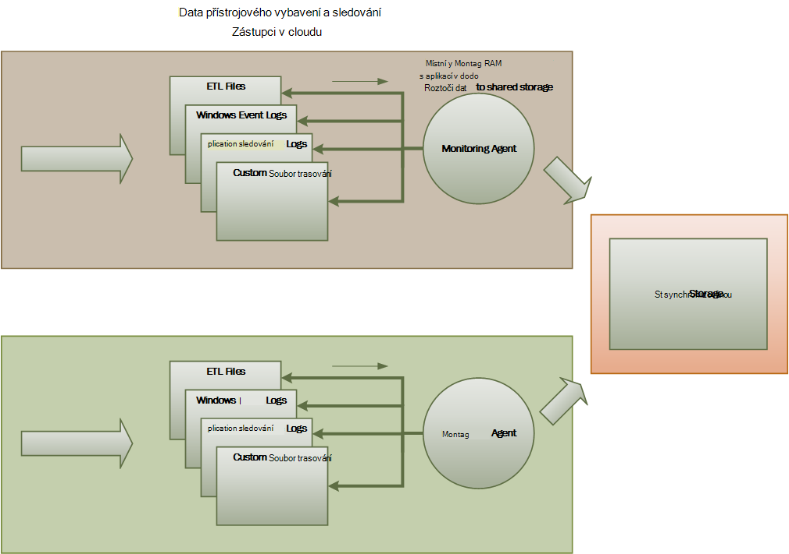
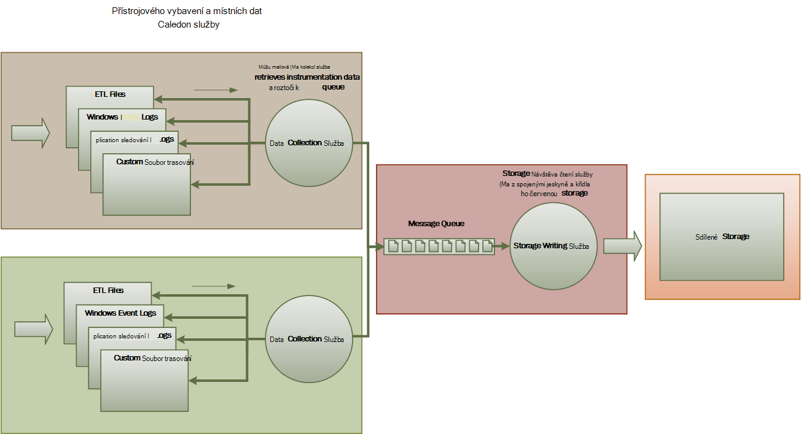
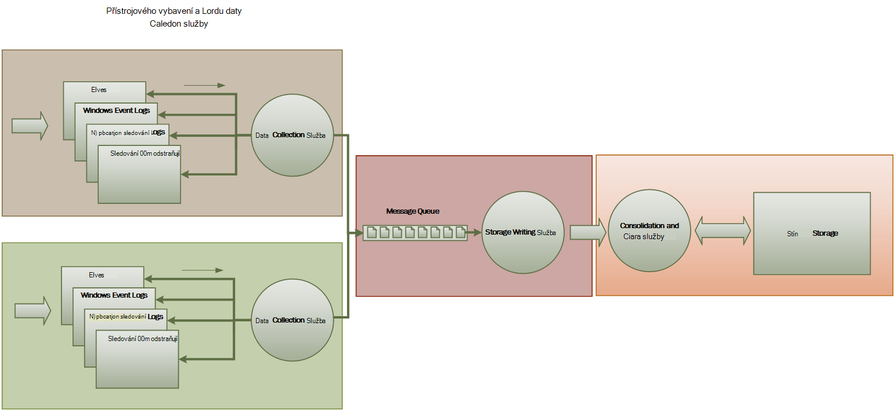

<properties
   pageTitle="Sledování a diagnostice pokyny | Microsoft Azure"
   description="Doporučené postupy pro sledování distribuované aplikace v cloudu."
   services=""
   documentationCenter="na"
   authors="dragon119"
   manager="christb"
   editor=""
   tags=""/>

<tags
   ms.service="best-practice"
   ms.devlang="na"
   ms.topic="article"
   ms.tgt_pltfrm="na"
   ms.workload="na"
   ms.date="07/13/2016"
   ms.author="masashin"/>

# <a name="monitoring-and-diagnostics-guidance"></a>Sledování a diagnostice pokyny

[AZURE.INCLUDE [pnp-header](../includes/guidance-pnp-header-include.md)]

## <a name="overview"></a>Základní informace
Distribuované aplikací a služeb spuštěných v cloudu jsou ve své povahy složité použitelné části software, které přispívají mnoho proměnné části. V provozním prostředí je důležité, abyste mohli sledovat způsobem, do kterého uživatelé využít systému, využití prostředků sledování a obecně sledovat výkon systému a stavu. Můžete tyto informace jako diagnostiky podpory pro rozpoznávání a oprava problémů a taky Nápověda místo, kde můžete potenciální problémy a zabránit je.

## <a name="monitoring-and-diagnostics-scenarios"></a>Sledování a diagnostice scénáře
Můžete sledovat, abyste získali přehled o tom pracuje systému. Sledování je důležité součástí zachování kvality služby cílů. Obvyklé scénáře shromažďování monitorování dat patří:

- Zajistit, že systém zůstane funkční.
- Sledování stavu systému a jeho prvky součásti.
- Zachování zajistit, aby výkon systému nedochází neočekávaně jako množství práce zvýšení výkonu.
- Zajištění, aby systému splňuje všechny ujednání úrovni služeb (rozsahu) přijatá se zákazníky.
- Ochrana osobních údajů a zabezpečení systému, uživatelů a související data.
- Sledování operace, které provádí za účelem auditování nebo zákonných.
- Sledování každodenní použití systému a sledování trendů, které mohou vést k problémům s, pokud nejsou určeny.
- Sledování problémů, ke kterým dochází z počáteční sestavu přes analýzu příčin, opravu, následné aktualizací a nasazení.
- Trasování operace a ladění vydání softwaru.

> [AZURE.NOTE] Tento seznam není určená k být úplný. V tomto dokumentu se zaměřuje na podobnému sledu jako ve většině případů provedení sledování. Může být ještě jiné, které jsou méně běžné nebo specifické pro vaše prostředí.

Následující oddíly popisují scénářů podrobněji. Informace pro každý scénář je popsán ve formátu následující:

1. Stručný přehled scénáře
2. Typické požadavky tento scénář
3. Jako nezpracovaná přístrojového vybavení data, která je potřebný kvůli podpoře scénář a možných zdrojů informací
4. Jak můžete tento nezpracovaná data analyzovat a kombinované generovat smysluplné diagnostických informací

## <a name="health-monitoring"></a>Sledování stavu
Je správný, pokud je spuštěný a schopný zpracovávat požadavky na systém. Sledování stavu slouží k vytváření snímku z aktuálního stavu systému, aby mohli ověřit, že všechny součásti systému funguje očekávaným způsobem.

### <a name="requirements-for-health-monitoring"></a>Požadavky pro sledování stavu
Operátor by se v případě rychle (během několika sekund) libovolnou část systému se považuje za chybná. Operátor by měla zjistit, které části systému fungují obvykle a které části dochází k problémům. Stav systému můžete zvýrazňovat prostřednictvím semaforu systému:

- Červené pro chybná (systém přestal)
- Žlutá pro částečně správný (systému s omezená funkčnost)
- Zelené pro plně funkční

Úplný monitorování stavu systému umožňuje operátor Procházet dolů jednotlivými systému do zobrazení stavu podsystémy a složek. Například celého systému je znázorněna jako částečně správný, operátor by měl by mohl zobrazení zvětšíte a určit, které funkce momentálně není dostupná.

### <a name="data-sources-instrumentation-and-data-collection-requirements"></a>Zdroje dat, přístrojového vybavení a požadavky shromažďování dat
Původní data, který je potřebný kvůli podpoře sledování stavu lze vytvořit na základě těchto:

- Sledování provádění koncových uživatelů. Tyto informace lze použít k určení úspěšné požadavky, které se nezdařil a doby trvání každý požadavek.
- Sledování syntetické uživatele. Tento proces napodobuje kroky prováděné uživatele a následující předdefinované posloupnost kroků. Výsledky každého kroku by měl zachytit.
- Výjimky protokolování chyb a upozornění. Tyto informace lze zachytit důsledku příkazy trasování vložené do kódu aplikace, stejně jako při načítání informací z protokoly událostí služeb, které odkazuje systém.
- Sledování stavu služeb žádné třetí strany, která využívají systému. Sledování může vyžadovat načítání a analýza dat stavu, které zadat těchto služeb. Tyto informace může trvat různé formáty.
- Koncový bod sledování. Tento postup se podrobněji píše v části "Dostupnost sledování".
- Shromažďování informací okolního výkonu, například pozadí využití procesoru nebo výstupní (včetně síť) aktivita.

### <a name="analyzing-health-data"></a>Analýza dat stavu
Primární zaměření monitorování stavu je rychle označuje, zda je systém. Aktivní analýzy okamžité dat můžete výstrahu Pokud důležitou součástí je zjištěno jako chybná. (Ho přestane odpovídat po sobě jdoucí řadu příkazu ping, například.) Operátor můžete proveďte odpovídající korekční akce.

Další rozšířené systém můžou obsahovat prediktivní prvek, který provádí studenou analýzu přes nedávných a aktuální zatížení. Studenou analýzy můžete pozorování trendů a zjistit, zda je pravděpodobně zůstat správný systému nebo jestli chcete systém potřebovali další zdroje informací. : Tento element prediktivní vycházet z kritické měřítka, jako například:

- Úroková sazba požadavků na směrovány na každé služby nebo podsystém.
- Doba odezvy tyto požadavky.
- Objem dat předávaných do a od každé služby.

Pokud hodnota všech míru překročí definovaný prahovou hodnotu, můžete systém vysokoškolskou úroveň upozornění, umožní provést preventivní akce potřebná k zachování stavu systému operátor nebo neobsahovaly text (Pokud je k dispozici). Tyto akce může zahrnovat přidání zdrojů restartování jedné nebo víc služeb, které jsou selhání nebo jej opatříte omezení do žádosti o nižší prioritou.

## <a name="availability-monitoring"></a>Sledování dostupnosti
Skutečně správný systém vyžaduje součásti a podsystémy tvořící systému k dispozici. Sledování dostupnost souvisí s sledování stavu. Ale vzhledem k tomu, sledování stavu okamžité zobrazení aktuálního stavu systému, sledování dostupnost se týká sledování stavu systému a jeho součástí generovat statistických údajů o provozu systému.

V mnoha systémů budou některé součásti (například databáze) nakonfigurována zabudované zálohování umožňují rychlé přepnutí vážně poruch nebo ztrátě připojení. V ideálním případě uživatelé neměli mějte na paměti, že takové došlo k chybě. Ale z dostupné sledování perspektivy, je nutné shromáždění co nejvíce informací o těchto selhání zjistit příčinu a jaké nápravné akcím zabráníte jejich opakované.

Data, která je potřebná k sledovat dostupnost může záviset na několika faktorech nižší úrovně. V mnoha z následujících skutečností může být specifické pro aplikaci, systému a prostředí. Efektivní sledování systém zaznamenává dostupnost data, která odpovídá tyto nízkoúrovňový faktory a sloučí je dát celkového vzhledu systému. Například v systému obchodování obchodní funkce, které umožňují zákazníkovi objednávky může, závisí na úložiště, kde jsou uloženy Rozpis objednávek a platba systému, který pracuje s měnové transakce platební tyto objednávky. Dostupnost pořadí umístění součást systému tedy funkci dostupnost úložiště a podsystém platby.

### <a name="requirements-for-availability-monitoring"></a>Požadavky pro kontrolu dostupnosti
Operátor by měla být možnost Zobrazit historii dostupnost každé systému a podsystém a tyto informace použít k pozorování trendů, které může být příčinou jedna nebo více podsystémy pravidelně selhání. (Služby nespouštějí selhání současně konkrétní den, který odpovídá ve špičce zpracování hodin?)

Monitorovací řešení by měl obsahovat okamžité a historických zobrazení dostupnosti nebo nedostupnosti každé subsystému. By měly být také může rychle výstrahy operátor při jedním nebo víc služeb selhání nebo uživatelé nemůže připojit ke službám. Toto je předmětem nejen monitorování každé služby, ale taky zkoumání akce, které provede každého uživatele v případě, že tyto akce selhání při pokusu o komunikaci se službou. Do určité míry stupeň připojení selhání je normální a může být kvůli přechodná chyby. Ale může být užitečné povolit systému na vysokoškolskou úroveň upozornění pro počet neúspěšných pokusů připojení zadaný dílčího systému probíhajících během určitého období.

### <a name="data-sources-instrumentation-and-data-collection-requirements"></a>Zdroje dat, přístrojového vybavení a požadavky shromažďování dat
Stejně jako sledování stavu můžete původní data, která je potřebná k sledování dostupnost vygeneruje důsledku syntetické uživatele monitorování a protokolování výjimek, chyb a upozornění, které můžou nastat. Kromě toho dostupnost dat můžete obdržet provedení sledování koncového bodu. Aplikaci můžete vystavit jeden nebo více stavu koncové body, každý testování přístupu k funkční oblasti v rámci systému. Systému sledování můžete pomocí příkazu ping každý koncový bod podle plánu definované a shromáždit výsledků (úspěch nebo selhání).

Musí být zaznamenány všechny časové limity selhání připojení sítě a pokusů připojení. Všechna data by měl být časovým razítkem.

<a name="analyzing-availability-data"></a>
### <a name="analyzing-availability-data"></a>Analýza dat dostupnosti
Data přístrojového vybavení musí být agregované a vazba podporuje následující typy analýzy:

- Okamžité dostupnosti systému a podsystémy.
- Dostupnost selhání sazby systém a podsystémy. V ideálním případě operátor soubory byste měli sladit selhání s konkrétní aktivity: co se děje při se nezdařilo?
- Zobrazení historie sazeb selhání systému nebo všech dílčích ve všech zadané období a načíst systému (počet uživatelských požadavků, například) při došlo k chybě.
- Důvody pro nedostupnost systému nebo všech dílčích. Důvody může být například připojení služba není spuštěná připojení ztratili, ale vypršení časového limitu a připojené, ale vrácení chyby.

Dostupnost procento služby průběhu určitého časového období můžete vypočítat pomocí následujícího vzorce:

```
%Availability =  ((Total Time – Total Downtime) / Total Time ) * 100
```

To je užitečné pro účely SLA. ([SLA sledování](#SLA-monitoring) se podrobněji píše dál v tomto pokyny.) Definice _prostoje_ závisí na služby. Visual Studio týmu sestavit službu určují prostoje jako dobu (nahromaděné celkový počet minut) které službu sestavení není k dispozici. Chvíli se považuje za není k dispozici, pokud všechny nepřetržitý HTTP žádosti o službu sestavení provádět operace inicializovaný zákazníka v celém minuty mít za následek chybu nebo nevrací odpověď.

## <a name="performance-monitoring"></a>Sledování výkonu
Jak systém umístí vysokém více (zvýšení hlasitosti uživatele), velikost datové sady roste těmto uživatelům přístup a možnosti selhání jednu nebo více složek se změní častěji. Chyba součásti často předchází pokles výkonu. Pokud se vám povede zjistit pokles, provedete aktivní kroky pro nápravu stavu.

Výkon systému závisí na několika faktorech. Každý faktor se obvykle měří prostřednictvím klíčové ukazatele výkonu (KPI), například počet databázové transakce sekundu nebo objem síťové požadavky, které jsou úspěšně vyřízení v určité časové rozmezí. Některé z těchto klíčových ukazatelů výkonu může být k dispozici jako měření výkonu konkrétní, zatímco ostatní můžou pocházet z kombinací metriky.

> [AZURE.NOTE] Zjištění, nízká nebo dobrý výkon vyžaduje pochopit úrovně výkonu niž systém by měl dát spustit. Při této akci musí pozorování systému během funguje typické zatížení a zachytit data pro každou klíčového ukazatele výkonu průběhu určitého časového období. To může zahrnovat systémem simulovaný zatížení v testovacím prostředí a shromažďování příslušná data před nasazením systému provozním prostředí.

> Měli byste taky zajistit, že sledování pro účely výkonu se nestane zatížení systému. Je možné dynamicky upravit úroveň podrobností pro data, která shromažďuje proces sledování výkonu.

### <a name="requirements-for-performance-monitoring"></a>Požadavky pro sledování výkonu
Prozkoumat výkon systému, operátor obvykle musí objevit informace, včetně:

- Odpověď sazby pro koncových uživatelů.
- Počet požadavky souběžné uživatele.
- Objem v síti.
- Kurzy na jaké firemní transakce provádí.
- Průměrný čas zpracování žádostí o.

Může být také užitečné poskytovat nástroje, které umožňují operátor usnadňující místo, kde můžete korelace, například:

- Počet uživatelů současně versus žádost o zpoždění dobu (jak dlouho trvá zahájíte zpracování požadavku po uživatel odeslal).
- Počet uživatelů současně versus Průměrná doba odezvy (jak dlouho trvá dokončete žádost po spuštění zpracování).
- Objem žádosti a počet zpracování chyb.

Spolu s informacemi vysoké úrovně funkční o operátor soubory byste měli získat podrobný přehled výkonu pro jednotlivé součásti systému. Tato data je obvykle poskytovanou nízkoúrovňový výkonnosti, sledující informace, jako například:

- Využití paměti.
- Počet podprocesů.
- Času procesoru.
- Požádat o délka fronty.
- Disku nebo síti vstupu a výstupu sazby a chyb.
- Počet bajtů napsali nebo čtení.
- Indikátory middleware, například délka fronty.

Všechny vizualizace tomu operátor můžete určit časové období. Zobrazená data může být snímek aktuální stav a/nebo historické zobrazení výkon.

Operátor by měla na vysokoškolskou úroveň upozornění na všechny měření výkonu pro zadanou hodnotu při jakékoli zadaný časový interval.

### <a name="data-sources-instrumentation-and-data-collection-requirements"></a>Zdroje dat, přístrojového vybavení a požadavky shromažďování dat
Sledovat pokrok požadavků uživatelů při příchodu a procházet systému můžete shromažďovat data o výkonu nejvyšší úrovně (výkon, počet uživatelů současně, počet transakce business, chyba sazby a tak dál). Tento postup představuje zahrnutí příkazy trasování v klíčových bodů v kódu aplikace a informace o načasování. Dostatečné informací o korelace požadavky, které je příčinou by měl zachytit všechny chyby, výjimky a upozornění. Protokol Internetové informační služby (IIS) je jiného užitečné zdroje.

Pokud je to možné by měl taky zachytit data o výkonu pro libovolný externí systémy používané aplikace. Tyto externí systémy může stanovit své vlastní výkonnosti nebo jiných funkcí požaduje data o výkonu. Pokud to není možné, záznamu informací například čas zahájení a čas ukončení každou žádost k externímu systému, spolu s stav (úspěch, selhání nebo upozornění) operace. Například, můžete použít stopky přístup k požadavky na čas: spuštění časovače při spuštění žádosti a zastavte časovač po dokončení žádosti.

Data o výkonu nízkoúrovňový pro jednotlivé součásti systému může být k dispozici prostřednictvím funkcí a služeb, jako je Windows výkonnosti a diagnostice Azure.

### <a name="analyzing-performance-data"></a>Analýza dat o výkonu
Velkou část Analýza práce se skládá z shromažďování dat o výkonu typ žádosti uživatele a/nebo podsystém nebo službu, do kterého se odesílá každý požadavek. Příklad žádost uživatele je přidání položky do nákupní košík nebo provádění procesu rezervace v systému obchodování.

Jiné běžným požadavkem je shrnutí data o výkonu ve vybrané percentily. Operátor může například určit doba odezvy pro 99 požadavků, 95 Procento požadavků až 70 procent žádostí o. Může být SLA cílů nebo jiných cíle nastavené pro každou percentilu. Probíhajících výsledků by měl nahlášený v reálném čase blízké zjistit okamžité problémy. Výsledky by měl taky agregované určitou delší dobu informativní.

V případě latence vliv na výkon problémech se dočtete víc by měla rychlá identifikace příčin kritické místo porovnáním latence jednotlivými kroky, které provede každý požadavek operátora. Data o výkonu musíte tedy umožňují vzájemného vztahu měření výkonu při každém kroku nevážou na žádost o konkrétní.

Podle toho, že splníte požadavky vizualizace může být užitečné k vytvoření a uložení datové krychli, který obsahuje zobrazení nezpracovanými daty. Datové krychli můžete povolit složitých ad hoc dotazů a analýza výkonu informací.

## <a name="security-monitoring"></a>Sledování zabezpečení
Všechny obchodní systémy, které obsahují citlivá data musí implementovat struktura zabezpečení. Složitost mechanismus zabezpečení je obvykle funkce citlivosti data. V systému vyžaduje, aby uživatelé ověření mají nahrát:

- Všechny přihlašovací pokusy, jestli selhání nebo úspěšné.
- Všechny operace dělat – a podrobnosti o všech zdrojů používána v – ověřeného uživatele.
- Jestliže uživatel ukončí relaci a odhlásit se.

Sledování pak můžou zjistit útoků na systém. Například velký počet neúspěšných pokusů přihlašovací může označovat hrubou útokům. Neočekávané nárůstu v žádosti o může být výsledek útok distribuované odmítnutí služby (Denial). Musí být připraveno sledovat všechny žádosti o pro všechny zdroje bez ohledu na zdroj tyto požadavky. Systému, který obsahuje chybu přihlašovací by mohlo omylem vystavit materiály pro vnější světa bez nutnosti uživatele ve skutečnosti přihlásit.

### <a name="requirements-for-security-monitoring"></a>Požadavky pro sledování zabezpečení
Nejdůležitější aspekty sledování zabezpečení umožňoval operátor rychle:

- Zjištění pokus o průniky neověřených entity.
- Identifikace pokusy zadáním entity provádět operace s daty, u kterého budou nebylo udělené přístup.
- Zjištění, zda je v části útoku z mimo nebo uvnitř systému nebo některé součást systému. (Například škodlivým ověřený uživatel může se pokoušíte přenést systému.)

K podpoře tyto požadavky, má oznamovat operátoru:

- Pokud účtů udělá opakovaných neúspěšných pokusů přihlašovací o v rámci za určité období.
- Pokud účtů ověřené opakovaně pokusí o přístup zakázané zdroj během určitého období.
- Pokud velký počet neověřených nebo neoprávněným požadavků dojít během určitého období.

Informace, které by vám měly operátor by měl zadejte adresu hostitele zdroje pro každý požadavek organizace. Pokud porušení zabezpečení pravidelně vzniknou určitý rozsah adresy, mohou být blokovány těchto hostitelů.

Klíčové úlohu při zachování zabezpečení systému probíhá mohli rychle zjistit akcí, které se liší od běžnému modelu. Informace, jako je třeba počet neúspěšných a/nebo úspěšně přihlásit žádosti o zobrazený vizuálně pomoct zjistit, zda je zásobníku činnosti neobvyklé současně. (Příklad tuto aktivitu je uživatelů přihlásíte k 3:00:00 a provádění velký počet operací při jejich pracovní den začíná 9:00 dop.) Tyto informace lze také vám pomohou při konfiguraci založená na čase neobsahovaly text. Například, pokud operátor dodržuje velkého počtu uživatelů pravidelně Přihlaste se na určitý čas dne, operátor můžete uspořádat zahájíte další ověřovacích služeb a zpracování množství práce, vypněte tyto další služby po termínu pole Špička.

### <a name="data-sources-instrumentation-and-data-collection-requirements"></a>Zdroje dat, přístrojového vybavení a požadavky shromažďování dat
Zabezpečení je zahrnující všechny aspekty nejčastěji distribuované systémy. Příslušná data jsou pravděpodobně generovat na několika místech v celém systému. Měli byste zvážit přijímání informací o zabezpečení a události Management (SIEM) přístupu k shromáždění informací související se zabezpečením, která je výsledkem události vyvolané aplikace, síťových zařízení, servery, brány firewall, antivirový software a dalších prvků průnik zabránění.

Sledování zabezpečení lze zahrnout data z nástroje, které nejsou součástí aplikace. Tyto nástroje můžete zahrnout nástroje, které identifikují skenování portu aktivity tak, že externí agencies nebo síti filtry, které zjišťovat pokusy o neověřený přístup k aplikaci a dat.

Ve všech případech musí získané data povolit správce určit přírodní jiných útoků a odpovídající opatření.

### <a name="analyzing-security-data"></a>Analýza dat zabezpečení
Funkce sledování zabezpečení je různých zdrojů ze kdy nastane data. Různé formáty a úroveň podrobností často vyžadují komplexní analýzu zachycený data, která chcete shromáždit do souvislý vlákna informací. Kromě nejjednodušší případech (například zjišťování velký počet neúspěšných přihlášení nebo opakované pokusy o získat neoprávněnému přístupu k prostředkům kritické) nebude možné provést složité automatické zpracování dat zabezpečení. Místo toho může být vhodnější psát tato data časovým razítkem ale jinak v původní podobě, zabezpečené úložiště umožňující expert ruční analýzy.

<a name="SLA-monitoring"></a>

## <a name="sla-monitoring"></a>Sledování SLA
Mnoho komerční systémů podporujících platící zákazníky zkontrolujte záruky týkající se výkonu systému ve formě rozsahu. V podstatě rozsahu uveďte to, že systém můžete zpracovat definovaný objemu práce v rámci schválené časový rámec a nepřijít důležitých informací. Sledování SLA se týká zajistit, že systému můžete zahájit možné měřit rozsahu.

> [AZURE.NOTE] Sledování SLA souvisí s sledování výkonu. Ale že sledování výkonu zajistit, aby systém funkce _optimálně_týká, SLA sledování podléhá závazku, který definuje, jaké _optimálně_ skutečně znamená, že.

Rozsahu se často definují z hlediska:

- Celková dostupnost systému. Například organizace může zaručit, že bude k dispozici pro 99,9 procent času systému. Tato hodnota rovná nesmí přesáhnout 9 hodin za rok nebo přibližně 10 minut v týdnu.
- Provozní výkon. Tento poměr je často vyjádřený jeden nebo více horní – limity, například záruky, že můžete systém podporují až 100 000 požadavky souběžné uživatele nebo zpracování 10 000 transakcí souběžné business.
- Čas provozní odpověď. Systém může být také záruky rychlost zpracovány žádosti. Příklad je, že 99 % všech transakcí firmy dokončí vyvolané 2 a bez jedné transakce bude trvat déle než 10 sekund.

> [AZURE.NOTE] Některé smlouvy pro komerční systémy mohou také obsahovat rozsahu o zákaznickou podporu. Příklad je, že budou všechny žádosti o technickou podporu vyžadují odpověď do 5 minut a, že bude 99 % všech problémů v rámci 1 pracovní den plně adresovaná. Efektivní [Sledování problémů](#issue-tracking) (popsáno dále v tomto oddílu) je zkratka na schůzku rozsahu jako jsou například.

### <a name="requirements-for-sla-monitoring"></a>Požadavky pro sledování SLA
Na nejvyšší úrovni třeba operátor možné určit na první pohled, zda je systém schůzek schválené rozsahu nebo ne. Pokud ne, operátor by měla k procházení k podrobnostem dolů a zkontrolujte základní faktory určující důvody nevyhovující výkon.

Typické uceleném indikátory, které můžete znázorněné patří:

- Procento doba provozu služby.
- Výkon aplikace (měří se z hlediska úspěšné transakce a/nebo operace sekundu).
- Počet úspěšných/selhání aplikace požadavků.
- Číslo chyby aplikací a systému, výjimky a upozornění.

Všechny z těchto ukazatelů by měl dát filtrován zadané období.

Aplikace cloudu pravděpodobně obsahuje celou řadu podsystémy a součásti. Operátor by měla můžete vybírat uceleném indikátor a jak se skládá ze stavu základní prvky. Například provozu celého systému spadá pod přijatelná hodnota, operátor by měl by mohl zobrazení zvětšíte a určit prvky, které jsou přispět k této chybě.

> [AZURE.NOTE] Systém provozu je třeba definovat pečlivě. V systému, který používá redundance zajistit maximální dostupnost může selhat jednotlivé instance prvků, ale systému můžete nadále funkční. Systém provozu jako prezentované sledování stavu uvádět agregační provozu jednotlivé elementy a ne nutně zda systému skutečně se zastavil. Navíc může být selhání izolace. To i v případě, že určitý systém není k dispozici, zbytek systému může zůstávají k dispozici, i když se snížené funkčnosti. (V systému obchodování selhání systému může zákazníka zabránit v zadávání objednávek, ale zákazníka může pořád moct procházet katalogu produktů.)

Výstrahy účely, systému třeba moct vyvolat událost, pokud některé z uceleném indikátory větší než zadaný mezní hodnota. Nižší úrovně podrobnosti o různých faktorů, které vytváříte platnost indikátoru uceleném by měl být k dispozici jako místní data výstražných systému.

### <a name="data-sources-instrumentation-and-data-collection-requirements"></a>Zdroje dat, přístrojového vybavení a požadavky shromažďování dat
Původní data, která je potřebná k sledování SLA je podobný původní data potřebného pro sledování výkonu, spolu s některé aspekty zdraví a sledování dostupnosti. (Viz tyto části Podrobnosti.) Tato data tak, že shromáždíte:

- Provedení sledování koncového bodu.
- Výjimky protokolování chyb a upozornění.
- Sledování spuštění koncových uživatelů.
- Sledování stavu žádné služby jiných výrobců, které použije systém.
- Pomocí měřítka a čítačů.

Všechna data musí být vypršel časový limit a časovým razítkem.

### <a name="analyzing-sla-data"></a>Analýza dat SLA
Data přístrojového vybavení musí být agregovaný generovat vzhledu celkový výkon systému. Souhrnná data také podporoval podrobnostem umožňuje zkoumání výkonu podkladového podsystémy. Příklad by měl být moct:

- Vypočítá celkový počet koncových uživatelů během určitého období a určit míru úspěšné a neúspěšné tyto požadavky.
- Kombinování doby odezvy uživatelských požadavků pro generování pohledu celkové doby odezvy systému.
- Analýza sledovat žádosti uživatele které rozdělí doba odezvy celkové žádost do doby odezvy jednotlivé pracovní položky ze žádosti.  
- Určete celkové dostupnost systému v procentech provozu pro určité období.
- Analýza dostupnost čas procento jednotlivé součásti a služeb v systému. To může zahrnovat analýza protokoly generovaných služby jiných výrobců.

Mnoho obchodní systémy vyžadovaných vykazování skutečné hodnoty před schválené rozsahu za určité období, obvykle jeden měsíc. Tyto informace lze použít k výpočtu přeplatky nebo jinými formami splátky pro zákazníky, pokud rozsahu neobsahuje během tohoto období. Dostupnost pro službu můžete vypočítat pomocí postup popsány v části [Analýza dat dostupnosti](#analyzing-availability-data).

Vnitřní účely organizace může taky sledování čísla a druh události, které způsobily služby selhání. Jak rychle řešení takových problémů nebo odstranit úplně, osvojte ke snížení výpadek služeb a setkání rozsahu.

## <a name="auditing"></a>Sestavy auditování
Podle povahy aplikace může být zákonné nebo jiných právních předpisů, které určují požadavky pro auditování činnosti uživatelů a nahrávání všech přístup k datům. Sestavy auditování můžete prokázat zákazníkům odkazy na specifických požadavků. Nepopiratelnost odpovědnosti je důležité faktor v systémech e-business zachovat zabezpečení být mezi zákazníka a organizace, která je zodpovědný za aplikaci nebo službu.

### <a name="requirements-for-auditing"></a>Požadavky na sestavy auditování
Analytik musíte mít na sledovat tuto řadu firmy operacích, které uživatelé provádíte tak, aby obnovit akce uživatelů. Může být nutné jednoduše jako předmětem záznam nebo jako součást soudní vyšetřování.

Auditování údaj vysoce citlivé. Pravděpodobně bude zahrnovat dat, který identifikuje uživatele systému, spolu s úkoly, které je při provádění. Z tohoto důvodu auditování informace bude pravděpodobně podobu sestavy, které jsou k dispozici pouze pro důvěryhodné analytici spíše než jako interaktivní systému, který podporuje podrobnostem grafické operací. Analytik by měla získat řadu sestav. Sestavy může například seznam všech uživatelů aktivity během určité časové rozmezí, podrobností časového aktivitou pro jednoho uživatele nebo seznam pořadí operací provedena jeden nebo více zdrojů.

### <a name="data-sources-instrumentation-and-data-collection-requirements"></a>Zdroje dat, přístrojového vybavení a požadavky shromažďování dat
Můžete zahrnout primární zdroje informací o auditování:

- Zabezpečení systému, který má na starosti ověřování uživatelů.
- Trasovat protokolů, které záznam činnosti uživatelů.
- Zabezpečení se přihlásí sledující všechny žádosti o osobní a nelze rozpoznat sítě.

Formát data auditování a způsob, ve kterém je uložen může úsilím zákonné požadavky. Například ho nebude možné čištění dat žádným způsobem. (Ho musí být zaznamenané v původním formátu.) Přístup k úložišti ho rozdávání musí být chráněny k brání falšování.

### <a name="analyzing-audit-data"></a>Analýza dat auditování
Analytik musíte mít přístup k původní data zrušíme v původní podobě. Kromě požadavek na běžné sestavy auditování nástrojů pro analýzu dat mívají specializované a uchovává externě systému.

## <a name="usage-monitoring"></a>Použití sledování
Použití sledování sleduje použití funkcí a součásti webové části aplikace. Operátor můžete shromážděné data, která chcete:

- Zjistit, jaké funkce jsou vytížený a určit potenciální aktivní v systému. Prvky maximum přenosy mohou využít funkční oddílů nebo dokonce replikace více rovnoměrné rozdělení načíst. Operátor můžete taky použít tyto informace zjistit, jaké funkce zřídka používají a možné kandidáty pro vyřazování webů nebo nahrazení v budoucí verzi systému.
- Získejte informace o zvláštních událostech operačního systému při běžném používání. Například v kolekci webů pro obchodování, můžete zaznamenat statistické informace o počet transakce a objemu zákazníky, kteří jsou zodpovědní za ně. Tyto informace lze použít pro plánování kapacity narůstající velikostí počet zákazníků.
- Zjistit (případně nepřímo) spokojenosti uživatele s výkonem nebo funkce systému. Například pokud velkého počtu zákazníky v systému obchodování pravidelně opustit jejich nákupní košík, odlišným způsobem, to může být kvůli potížím s funkcemi pro rezervaci.
- Generování fakturačních údajů. Obchodní aplikace nebo víceklientské služby může účtovat poplatky zákazníci pro zdroje, které používají.
- Vynucení kvóty. Pokud uživatel v víceklientské systému překročí kvótu placené zpracování čas nebo zdroje použití během za určité období, jejich access může být omezený nebo zpracování můžete omezena.

### <a name="requirements-for-usage-monitoring"></a>Požadavky pro použití sledování
Podívat se na použití systému, operátor obvykle musí objevit informace, včetně:

- Počet požadavky, které jsou zpracovány službou každý subsystém a přesměrují každému zdroji.
- Práce, pomocí kterého provádíte každému uživateli.
- Objem úložný prostor zabírá každému uživateli.
- Prostředky, které přístup k jednotlivým uživatelům.

Operátor by měla být moci vygenerování grafy. Příklad grafu mohou zobrazovat uživatelé nejčastěji zdroje časově náročný nebo nejčastěji přistupovat zdrojů nebo funkce systému.

### <a name="data-sources-instrumentation-and-data-collection-requirements"></a>Zdroje dat, přístrojového vybavení a požadavky shromažďování dat
Použití sledování lze provést relativně vysoké úrovni. Můžete poznamenat počátečního a koncového času každý požadavek a druh žádost (číst, psaní a tak dále, podle toho, určitému prostředku). Můžete získat tak, že tyto informace:

- Sledování činnosti uživatelů.
- Zachycení výkonnosti zobrazující využití pro jednotlivé zdroje.
- Sledování využití prostředků tak, že každý uživatel.

Pro měření účely, bude potřeba moci určit, které uživatelé jsou zodpovědní za provádění operací, které a prostředky, které využívají tyto operace. Získané informace by měly být podrobné tak, abyste povolit přesné fakturace.

<a name="issue-tracking"></a>
## <a name="issue-tracking"></a>Sledování problémů:
Zákazníci a ostatní uživatelé mohou oznamujte problémy, dojde k neočekávané události nebo chování v systému. Sledování problémů se týká Správa těchto problémů, přidružení s úsilí o vyřešení podkladových problémů v systému a informování zákazníci možná řešení.

### <a name="requirements-for-issue-tracking"></a>Požadavky pro sledování problémů
Operátory často provedení sledování pomocí samostatných systému, který umožňuje jejich záznamu a sestavy podrobností problémy problémů, které uživatelé hlásí. Tyto podrobnosti můžete vložit úkoly, které uživatel pokoušel provádět příznaky problém, řadu událostí a chyby nebo upozornění, které byly vydané.

### <a name="data-sources-instrumentation-and-data-collection-requirements"></a>Zdroje dat, přístrojového vybavení a požadavky shromažďování dat
Počáteční datový zdroj dat sledování problémů je uživatel, který vykázaného problém na prvním místě. Uživatel může být schopni další data jako:

- Výpis (Pokud aplikace zahrnuje součásti, která poběží na ploše uživatele).
- Snímek obrazovky.
- Datum a čas, kdy došlo k chybě, a další informace o životním prostředí například umístění uživatele.

Tyto informace mohou sloužit k nápovědě ladění úsilí a pomáhají při vytváření rezervu v budoucích verzích softwaru.

### <a name="analyzing-issue-tracking-data"></a>Analýza dat sledování problémů
Jednotlivým uživatelům hlásit stejnému problému. Systému sledování problémů neměli spojovat běžné sestavy.

Průběh ladění intenzity zaznamenávají před každou zprávu problém. Pokud problém vyřeší, zákazníka můžete informován o řešení.

Uživatele sestav problém, který má známé řešení v systému sledování problémů, operátor by měl by mohl informovat uživatele o řešení okamžitě.

## <a name="tracing-operations-and-debugging-software-releases"></a>Sledování operace a ladění vydání softwaru
Když uživatel ohlásí chyby, uživatel známa často pouze okamžitá dopad obsahující na svých operací. Uživatele můžete jenom zprávu o výsledcích vlastní základním zpět operátor zodpovědného za zachování systému. Tyto prostředí jsou obvykle jenom viditelné příznaku jeden nebo několik základních problémů. V mnoha případech analytik muset dostanete prostřednictvím časového základní operace vytvořit hlavní příčinu problému. Tento proces se nazývá _Příčina analýzy_.

> [AZURE.NOTE] Analýza hlavní příčiny může odhalit nedostatky v návrhu aplikace. V těchto případech je možné přepracovat ovlivněné prvky a nasazení je jako součást pozdější verzi. Tento postup vyžaduje opatrní ovládací prvek a aktualizované součásti měli přesně sledovat.

### <a name="requirements-for-tracing-and-debugging"></a>Požadavky pro sledování a ladění
Zjišťování neočekávaných událostí a jiné potíže, je důležité údaje o sledování poskytuje dost informací povolit analytik trasování zpátky na typů těchto problémů a obnovit řadu událostí, ke kterým došlo k chybě. Tyto informace musí být umožňující analytik Diagnostika příčinou problémů. Proveďte požadované změny a zabránit tak opakované můžete vývojář.

### <a name="data-sources-instrumentation-and-data-collection-requirements"></a>Zdroje dat, přístrojového vybavení a požadavky shromažďování dat
Poradce při potížích, bude to vyžadovat trasování všechny metody (a jejich parametrů) vyvolat jako součást operace si vybudovat strom, který znázorňuje logický tok celém systému u zákazníka, kvůli kterému konkrétní požadavek. Výjimky a upozornění, která chcete systém generuje důsledku tento toku muset zaznamenávání a přihlášení k lyncu.

K podpoře ladění, můžete systém poskytovat zavěšení podporující nástroj operátor zachycení informací o stavu v klíčové body v systému. Nebo systému přináší podrobné podrobné informace vybraného operace průběh. Zachycení data v této úrovni podrobností můžete uložit další zatížení systému a by měl být dočasný obrázku. Operátor používá tento proces hlavně při vysoce neobvyklé řadu událostí a je těžké replikovat, nebo když novou verzi jeden nebo více prvků do systému vyžaduje opatrní sledování zajistit, aby funkce prvky podle očekávání.

## <a name="the-monitoring-and-diagnostics-pipeline"></a>Sledování a diagnostice kanálu
Rozsáhlé distribuované systému sledování představuje významné ověřovací kód. Scénáře popisu v předchozí části by neměly být nutně považují za samostatně. Je pravděpodobně významné překrytí monitorování a diagnostiky dat potřebného pro každou situaci, i když tato data může být nutné zpracovat a prezentovat různými způsoby. Z těchto důvodů byste měli vzít jedné komplexní zobrazení sledování a diagnostice.

Celý sledování a diagnostických nástrojů obrázku můžete počítat jako kanálů, což zahrnuje fází obrázku 1.


_Obrázek 1. Fáze v sledování a diagnostice kanálem k odesílání zpráv_

Obrázek 1 zvýrazní, jak můžete data pro monitorování a diagnostice pocházet z různých zdrojů dat. Shromažďování a přístrojového vybavení fází se zabývají identifikaci zdroje ze kdy je třeba data nezaznamenávají, zjištění, která data k zaznamenání, jak ho zachycení a jak tato data můžete naformátovat tak, aby mohli být snadno zkoumat. Oblasti analýza/diagnostiky zabírá nezpracovanými daty a používá ke generování důležitých informací, které operátor vám pomohou zjistit stav systému. Operátor můžete tyto informace použít k rozhodovat o možných akcí se a pak kanálu výsledků zpět do fází shromažďování a přístrojového vybavení. Fáze fáze vizualizace/výstrahy představuje spotřební zobrazení stavu systému. Zobrazí informace v reálném čase nejblíže pomocí řady řídicích panelů. A můžete generovat sestavy, diagramy a grafy poskytnout historických zobrazení dat, který vám pomůže identifikovat dlouhodobých trendů. Pokud informace označuje pravděpodobně překročí přijatelné hranice klíčového ukazatele výkonu, této fázi můžete taky výstrahu k operátora. V některých případech upozornění lze také aktivovat automatického procesu, který se pokusí udělali jaké nápravné kroky, například neobsahovaly text.

Všimněte si, že tento postup představuje nepřetržitý tok procesu kde děje fáze souběžně. Všechny fáze by měl být v ideálním případě dynamicky, která dokáže nahradit. V některých místech zvlášť když systému nově nasazení nebo dojde k potížím, může být nutné shromažďování rozšířené dat na základě častější. V ostatních případech je vhodné se vrátit k zaznamenání základní úroveň základní informace pro ověření, jestli chcete systém funguje správně.

Kromě toho celý proces sledování považovat za živou probíhající řešení, které se vztahují úprav a vylepšení důsledku svůj názor. Například můžete začít měření spousta faktorů stav systému. Analýza v čase může vést k upřesnění jako zrušit míry, které nejsou důležité, a to přesněji fokus na data, která budete potřebovat při minimalizace šum na pozadí.

## <a name="sources-of-monitoring-and-diagnostic-data"></a>Zdroje dat, sledování a diagnostiky
Informace, které používá proces sledování můžou pocházet z několika zdrojů, jak je znázorněno na obrázku 1. Na úrovni aplikace informace pocházejí z protokoly trasování součástí kód systému. Vývojáři postupujte standardní postup pro sledování tok řízení prostřednictvím jejich kódu. Například položku metody můžete posílat sledování zprávu, která určuje název metodu, aktuální čas, přínosu každý parametr a všechny související informace. Záznam pro vstupní a výstupní čas může být také užitečné zejména.

By měl Protokolovat výjimky a upozornění a zrušte zaškrtnutí uchovat celou sledování všech vnořených výjimky a upozornění. V ideálním případě by měl taky zachycení informací, který identifikuje uživatele, který běží kód společně s aktivity korelace informace (sledovat žádosti o procházejí systému). A má protokolovat pokusy o přístup k všechny zdroje, jako jsou fronty zpráv, databází, soubory a další závislé služby. Tyto informace lze použít pro měření a auditování jako referenci.

Mnoho aplikace pomocí knihoven a rámce provádět běžné úkoly ATP přístupu k úložišti dat komunikovat v síti. Tyto rámce může být konfigurovat, a poskytují vlastní sledování zpráv a nezpracovanými diagnostické informace, například transakce sazby a data přenosu úspěšné a neúspěšné.

> [AZURE.NOTE] Mnoho moderní rámce automaticky publikovat událostech týkajících se výkonu a sledování. Zachycení tyto informace se jednoduše poskytování prostředky k načtení a uložte ji kde může být zpracování a analyzovat.

Operační systém, kde je spuštěna aplikace může být zdroji nízkoúrovňový systémové informace, například výkonnosti označujících vstupu a výstupu sazby, využití paměti a využití procesoru. Může taky vykázat chyby operačního systému (například Chyba při otevření souboru správně).

Byste taky měli vědět podkladových infrastruktury a součásti, na kterých běží systém. Virtuálních počítačích, virtuálních sítí a úložiště služby mohou být zdrojů důležité infrastruktury úrovně výkonnosti a jiných dat diagnostiky.

Pokud aplikace používá jiné externí služby, jako je webový server nebo systému správy databáze může těchto služeb publikovat své vlastní informace o sledování protokoly a výkonnosti. Jako příklad lze uvést SQL Server dynamická správa zobrazení pro sledování operací databázi SQL serveru a služby IIS sledování protokoly pro záznam žádosti na webový server.

Dojde ke změně součásti systému a nasazené nové verze, je důležité moct atribut problémy, událostí a metriky pro každou verzí. Tyto informace by měl vázat zpátky k verzi potrubí tak, aby problémů s konkrétní verzi komponentu můžete rychle sledovány a opravit.

Potíže se zabezpečením může dojít v libovolném místě v systému. Uživatel může pokusí přihlásit pomocí neplatné uživatelské ID a heslo. Ověřený uživatel zkusit získat neoprávněnému přístupu ke zdroji. Nebo uživatel může zadat neplatné nebo zastaralé klíč pro přístup k zašifrované informace. Informace týkající se zabezpečení pro úspěšné a selhání požadavky měli vždy Zaprotokolují.

V části [Nastavení aplikace](#instrumenting-an-application) obsahuje další pokyny na informace, které by měl zachytit. Ale řadu strategií umožňuje shromáždit tyto informace:

- **Sledování aplikací/systému**. Tato strategie používá interních zdrojů v rámci aplikace, rámců aplikace, operačního systému a infrastruktury. Kód aplikace můžete vygenerovat vlastní monitorování dat důležitá místech během životním cyklu požadavek klienta. Aplikaci můžete zahrnout trasování příkazy, které může selektivně povolit nebo zakázat při okolností diktování. Také je možné vloží diagnostiky dynamicky pomocí diagnostických nástrojů rámec. Tyto rámce obvykle poskytují zásuvné moduly, které můžete připojit k různých místech přístrojového vybavení v kódu a zachytit data trasování v těchto bodů.

    Kromě toho kódu a/nebo podkladového infrastruktury může vysokoškolskou úroveň události místech položku kritické. Informace o událostech můžete zaznamenávat do sledování agentů nakonfigurované poslouchat tyto události.

- **Sledování skutečného uživatele**. Tento přístup zaznamenává interakce mezi uživatelem a aplikace a sleduje tok každý žádostí a odpovědí. Tyto informace může mít dvěma přehyby účelu: ji může používat pro měření použití každého uživatele a mohou sloužit k určení, zda uživatelé přijímají vhodné kvalitu služby (například rychlé odezvy s nízkou latencí a minimální chyby). Zachycený dat můžete použít k identifikaci problematické oblasti kde docházet k chybám nejčastěji. Taky můžete data k určení prvků místo, kam chcete systém zpomaluje, případně kvůli aktivní v aplikaci nebo jiné formy kritické. Pokud se pečlivě implementovat tento přístup je možné obnovit toků uživatelů prostřednictvím aplikace pro ladění a testování.

    > [AZURE.IMPORTANT] Měli byste zvážit data, která se zaznamenává sledováním reálným uživatelům povolit vysoce citlivé, protože mohou obsahovat důvěrné informace. Při uložení zachycený dat, uložte ho bezpečné. Pokud chcete použít data pro sledování nebo účely ladění výkonu, nepoužijí nejdřív všechny identifikovatelné osobní údaje.

- **Sledování syntetické uživatele**. V tomto přístupu napište vlastní test klienta, který napodobuje uživatele a provede konfigurovatelné ale typické řadu operací. Můžete sledovat výkonnost testovací klient vám pomohou zjistit stav systému. Můžete také více instancí testovací klient jako součást operace testování zatížení k vytvoření odpovědi systému vysokém a jaký způsob sledování výstup generováno za těchto podmínek.

    > [AZURE.NOTE] Můžete implementovat reálnou a syntetické uživatele sledování s využitím kód, který sleduje a časový limit provádění volání metod a jiných kritické část aplikace.

- **Vytvoření profilu**. Tento přístup je především určené pro monitorování a vylepšení výkonu aplikace. Místo pracující na úrovni funkčnosti monitorování reálnou a syntetické uživatele zaznamenává informace nižší úrovně jako spuštění aplikace. Vytvoření profilu pomocí pravidelný odběr stavu spuštění aplikace (zjištění, jaký druh kód, který je spuštěna aplikace v daném okamžiku v čase) můžete používat. Můžete taky použít přístrojového vybavení, který vloží sond kód v důležité junctures (například zahájení a ukončení volání metody) a záznamy, které metody vyvolání, v jaké době a doby trvání každého volání. Pak můžete analyzovat data a zjistit, které části aplikace může způsobit problémy s výkonem.

- **Sledování koncového bodu**. Tento postup používá jeden nebo více diagnostiky koncové body, které aplikace zpřístupňuje konkrétně a umožňují sledovat. Koncový bod poskytuje další cestu do kódu aplikace a může vrátit informace o stavu systému. Různé koncové body zaměřit na různé aspekty funkci. Můžete napsat vlastní Diagnostika klienta, který odesílá pravidelné požadavky na tyto koncové body a získaly odpovědi. Tento přístup je popsán více ve [Vzorku sledování stavu koncového bodu](https://msdn.microsoft.com/library/dn589789.aspx) na webu společnosti Microsoft.

Maximální pokrytí používejte kombinace těchto postupů.

<a name="instrumenting-an-application"></a>
## <a name="instrumenting-an-application"></a>Nastavení aplikace
Přístrojového vybavení je důležitou součástí proces sledování. Jenom v případě, že nejdřív zachytit data, která umožňuje tyto rozhodovat dokázali dělat smysluplné rozhodnutí týkající se výkonu a stav systému. Informace, které shromažďování pomocí přístrojového vybavení by měl být umožňující posoudit výkonu, diagnostikovat potíže a přijímání rozhodnutí aniž by bylo potřeba přihlásit k serveru vzdáleného výrobního k provedení sledování (a ladění) ručně. Metriky a informace, které je aby došlo k zápisu protokolů trasování obvykle obsahují data přístrojového vybavení.

Obsah protokol sledování může mít výsledek textová data, která píše aplikace nebo binární data, která je vytvořená trasování událostí (Pokud se aplikace používá události trasování pro Windows – trasování událostí pro Windows). Dále je lze vytvářet z protokoly systému zaznamenávající události vyplývající z části infrastruktury, například na webový server. Zprávy textové protokolu často mají být čitelné, ale jsou také napsat ve formátu, který umožňuje automatizovaný systém analyzovat snadno.

Protokoly by měl taky do kategorií. Není zapisovat všechna data sledování jeden protokol, ale pomocí samostatných protokoly můžete zaznamenat to sledování výstup různé aspekty operačního systému. Pak můžete rychle filtrovat zprávy protokolu z protokolu vhodné pro čtení, spíše než museli zpracovávat jediný delšího souboru. Nikdy zapsat informace, které obsahuje požadavky na různých zabezpečení (například auditování informace a ladění dat) do stejného protokolu.

> [AZURE.NOTE] Protokol může provádět jako soubor v systému souborů, nebo mohou konat v jiném formátu, jako je objektů blob v úložišti objektů blob. Informace v protokolu mohou také konat více strukturovaných úložiště, jako je řádků v tabulce.

Metriky obecně budou míra nebo počet hodnot v některých poměr nebo zdroje v systému v daném čase, s přidruženými značky nebo rozměry (někdy se jí říká _Ukázka_). Jedna instance metriky není obvykle užitečné samostatně. Místo toho třeba metriky zachytit určitou dobu. Klíčové problém vzít v úvahu je které metriky mají nahrát a jak často. Generování dat pro metriky příliš často můžete ukládat významné další zatížení systému, že zachycené metriky zřídka může způsobit, že zmeškaný okolností které vedou k důležitou událost. Co byste měli zvážit se liší od míru míru. Například využití procesoru na serveru může výrazně se liší podle druhé druhé, ale vysoké využití bude problematická jenom v případě, že je dlouhodobé nad počet minut.

<a name="information-for-correlating-data"></a>
### <a name="information-for-correlating-data"></a>Informace o korelace dat
Můžete snadno sledovat jednotlivé úrovni systému výkonnosti, zachycení metriky zdrojů a získat informace o sledování aplikaci z různých souborů protokolu. Ale některé formy sledování vyžadují oblasti analýza a diagnostice v sledování kanálu ke koordinaci data, která se načte z několika zdrojů. Tato data může trvat několik formulářů v nezpracovanými daty a proces analýzy musí být opatřeny dostatečné údaje přístrojového vybavení mají být k mapování těchto různých formulářů. Například na úrovni framework aplikace úkol může být označen ID podprocesu. V aplikaci může být stejnou práci související s ID uživatele pro uživatele, kterému je provedení tohoto úkolu.

Také je pravděpodobně 1:1 mapování mezi podprocesy a koncových uživatelů, protože asynchronní operace může znovu použít stejné vláknech provádět operace za více než jednoho uživatele. Pokud chcete zvětšit věcech dál, jeden požadavek může být uskutečněných jednotlivými více vláken jako spuštění toků celém systému. Pokud je to možné přidružit k každý požadavek ID jedinečné činnosti, které je rozšířil v systému jako součást kontextu požadavku. (Postup pro generování a včetně aktivity ID v trasování informace závisí na technologii, který slouží k zaznamenání dat sledování.)

Všechna data sledování by měl být časovým razítkem stejným způsobem. Konzistence záznam všechna data a časy pomocí koordinovaný univerzální čas. To vám umožní snadněji posloupnosti trasování událostí.

> [AZURE.NOTE] Počítačů pracujících v různých časová pásma a sítí nemusí synchronizovat. Nechcete, závisí na pomocí časových razítek pouze pro korelace přístrojového vybavení data, která se nachází více počítačů.

### <a name="information-to-include-in-the-instrumentation-data"></a>Informace o zahrnout data přístrojového vybavení
Při přístrojového vybavení data, která je potřeba shromáždit při rozhodování, zvažte následující možnosti:

- Ujistěte se, že jsou informace o zachycených trasování událostí počítače a čitelného. Přijmout dobře definovaná schémata pro tyto informace usnadnit automatické zpracování dat protokolu v systémech a zajistit soulad operace a konstrukce pedagogy protokoly pro čtení. Obsahují klimatizace informace, například prostředí pro nasazení počítače, na kterém je proces spouštěn, podrobnosti o procesu a zásobníku volání.  
- Povolte vytváření profilů pouze v případě potřeby vzhledem k tomu můžete ukládat významné režijních systému. Vytvoření profilu pomocí přístrojového vybavení záznamů událost (třeba volání metody) při každém výskytu, že odběr záznamy pouze vybrané události. Výběr může být založená na čase (jednou každých *n* sekund), nebo na četnosti (jednou každých *n* požadavky). Pokud událostem často, vytváření profilů tak, že přístrojového vybavení může způsobit, že příliš mnoho zatížení a samotné vliv na celkový výkon. Výběrové v tomto případě může být vhodnější. Ale jestliže je počet_plateb události zhoršeným, analytický nástroj vzorkování vynechat je. V tomto případě přístrojového vybavení může být lepší přístup.
- Povolit vývojář nebo správce určit zdroji každý požadavek dostatečný kontext. Může obsahovat některé formuláře ID aktivity, který identifikuje konkrétní instanci žádost. Mohou také obsahovat informace, které lze použít ke koordinaci tuto aktivitu s výpočetní provedených prací a zdrojů použitých. Všimněte si, že tento úkol může přes hranice procesu a počítače. Pro měření, kontextu by se týkají taky (přímo nebo nepřímo prostřednictvím jiné vazba informace) odkaz na odběratele, který způsobil žádosti. Důležité informace o stavu aplikace v okamžiku nezaznamenávají monitorování dat obsahuje kontext.
- Zaznamenejte všechny žádosti o a umístění nebo oblasti, ze kterých jsou vytvářeny tyto požadavky. Tyto informace může pomoci při určení, jestli jsou aktivní žádné konkrétní umístění. Tyto informace mohou být také užitečné v zjištění, jestli chcete změnit oddíly aplikace nebo data, která používá.
- Nahrávání a pečlivě zachytit podrobnosti výjimky. Informace o důležitých ladění často, dojde ke ztrátě důsledku špatné výjimek. Zachycení úplné podrobnosti výjimky vyvolá aplikace, včetně výjimky vnitřní a další informace o kontextu. Pokud je to možné zahrnout zásobníku volání.
- Být konzistentních dat, které zaznamenávat různé prvky aplikace, protože to může pomoci při analýze události a korelace s koncových uživatelů. Zvažte použití balíčku protokolování komplexní a konfigurovat můžete získat informace, nikoli v závislosti na vývojáři přijmout stejný postup, jak provádět různé části systému. Shromažďování dat z klíčové výkonnosti, například objemu vstupu a výstupu provádí, počet požadavků, využití paměti a využití procesoru, využití sítě. Některé infrastruktury služby může obsahovat vlastní konkrétní výkonnosti, jako je třeba počet připojení k databázi, sazba, ve kterém se provádí transakce a počet transakce, které úspěšné nebo selže. Aplikace mohou také definovat vlastní konkrétní výkonnosti.
- Přihlaste se všechny volání externí služby, jako je systémy databáze, webové služby nebo jiné služby úrovni systému, které jsou součástí infrastrukturu. Záznam informací o čas potřebný k provedení každého volání a přijetí nebo odmítnutí hovoru. Pokud je to možné zachycení informací o všech pokusů a přechodná chyby, ke kterým dochází k chybám.

### <a name="ensuring-compatibility-with-telemetry-systems"></a>Zajištění kompatibility s telemetrie systémy
V mnoha případech informace, které vytvoří přístrojového vybavení generovaného jako řadu událostí a předán systém samostatné telemetrie pro zpracování a analýza. Systém telemetrie je obvykle nezávisle na konkrétní aplikaci nebo technologii, ale očekává informace podle určitého formátu, které obvykle definuje schéma. Schéma efektivně určuje smlouvy, který definuje datových polí a typů, které můžete jedí systému telemetrie. Schéma by měl generalized umožňující dat příchozí z oblasti platformy a zařízení.

Společné schéma musí obsahovat pole, která jsou společná pro všechny události přístrojového vybavení, jako je třeba název události, zvláštní událost čas a IP adresy odesílatele a informace, které jsou potřeba pro korelace s dalších událostí (například ID uživatele, ID zařízení a ID aplikace). Myslete na to, že libovolný počet zařízení může posunout výš, události, abyste neměli schématu závisí na typu zařízení. Kromě toho různá zařízení může vyvolat události stejné aplikace; aplikace mohou podporovat cestovní nebo nějaké jiné formy distribuce různá zařízení.

Schéma mohou také obsahovat pole domény, které jsou důležité pro konkrétním scénáři, která je běžné v různých aplikacích. Může to být informace o výjimek, spuštění aplikace a konce události a úspěšné a/nebo selhání volání rozhraní API webových služeb. Všechny aplikace, které používají stejnou sadu polí domény by měly posílat stejnou sadu události, povolení sadu běžné sestavy a technologie pro analýzu má být vytvořena.

Nakonec schéma může obsahovat vlastních polí pro zachycení podrobností o události specifické pro aplikaci.

### <a name="best-practices-for-instrumenting-applications"></a>Doporučené postupy pro nastavení aplikace
V následujícím seznamu uveden souhrn doporučených postupů pro nastavení distribuované aplikace spuštěné v cloudu.

- Protokoly usnadnit čtení a snadno analyzovat. Použití strukturovanými protokolování případného. Být stručné a popisný v protokolu zprávy.
- Ve všech protokolech identifikaci zdroje a poskytnout kontext a informace o časování jako napsali jednotlivých záznamů protokolu.
- Použití stejné časové pásmo a formát pro všechny časových razítek. To umožní koordinaci událostí pro operace, které zahrnují hardware a služby v různých oblastech zeměpisné.
- Zařadit do kategorií protokoly a psaní zpráv na příslušný soubor protokolu.
- Nezveřejňujte citlivé informace o systému a osobní údaje o uživatelích. Přesouváním tyto informace, než je přihlášení, ale zajistit, aby se zachovají důležité podrobnosti. Například odebrání ID a heslo z jakékoli řetězce připojení databáze, ale zápisu u zbývajících informací do protokolu tak, aby, analytik můžete zjistit, že je systém přistupují ke správné databázi. Zaznamenat všechny kritické výjimky, ale umožňuje správci zapnout nebo vypnout protokolování pro nižší úrovně výjimky a upozornění. Navíc zachycení a zaznamenávat všechny informace o použití logických operátorů opakovat. Tato data může být užitečné při kontrole přechodná stavu systému.
- Trasovat mimo volání obrázku, například požadavky na externí webové služby nebo databáze.
- Nemíchejte protokolu zprávy na jiný zabezpečení ve stejném souboru protokolu. Například není psaní ladění a informace o do stejného protokolu auditování.
- S výjimkou auditování událostí, aby byli všechna volání protokolování fire a zapomenete operace, které se nebudou blokovat průběhu podnikání. Auditování události, které jsou výjimečné proto, že je považován za kritický pro firmy a můžete klasifikované jako základní součástí podnikání.
- Zkontrolujte, že protokolování je extensible a nemá přímé závislosti u konkrétních cíle. Místo psaní informace pomocí _System.Diagnostics.Trace_, definujte abstraktní rozhraní (například _ILogger_), která poskytuje metody protokolování a který lze provést vhodným způsobem.
- Ujistěte se, že všechny protokolování neselhává a nikdy spustí chyby CSS. Protokolování nesmí vyvolat požadované výjimky.
- Zpracování přístrojového vybavení jako probíhající opakovaný proces a měli zkontrolovat protokoly pravidelně, nikoli pouze při došlo k potížím.

## <a name="collecting-and-storing-data"></a>Shromažďování a ukládání dat
Kolekce stupeň proces sledování se týká získávání informací generovaný přístrojového vybavení, formátování tato data můžete usnadnit její pro fázi analýzy/diagnostiky využívat a ukládání Transformovaná data v spolehlivé úložiště. V různých míst a s různými formáty můžete konat přístrojového vybavení data, která můžete získat z různých částí distribuovaného systému. Například kód aplikace mohou generovat trasování protokoly a generovat data v protokolu událostí aplikací, že výkonnosti sledující klíčové aspekty infrastrukturu, která používá aplikaci lze zachytit prostřednictvím jinými technologiemi. Součásti třetích stran a služby, že vaše aplikace používá může informování přístrojového vybavení v různých formátech, pomocí samostatných sledování souborů kulatý úložiště nebo dokonce vlastním úložišti.

Shromažďování dat je často prováděna kolekce služba, která poběží samostatně z aplikace, která generuje data přístrojového vybavení. Obrázek 2 ukazuje příklad tato architektura zvýraznění podsystém shromažďování dat přístrojového vybavení.


_Obrázek 2. Shromažďování dat přístrojového vybavení_

Všimněte si, že se jedná o zjednodušené zobrazení. Služba kolekce není nutně jednoho obrázku a může obsahovat více částí na různých počítačích, podle popisu v následujících částech. Kromě toho pokud analýzu některé telemetrickými daty musí provést rychle (za běhu analýzy, jak je popsáno v části [referenční za, teplé a studenou analýzy](#supporting-hot-warm-and-cold-analysis) dále v tomto dokumentu), místní součásti, které pracují mimo službu kolekce může provádět úlohy analýzy okamžitě. Obrázek 2 znázorňuje tato situace pro vybrané události. Po zpracování analýzy, výsledky odesílat přímo na vizualizaci a výstražných podsystém. Data, která vystaven teplé nebo bez zájmu analýzy směřuje v úložišti během čeká zpracování.

Pro Azure aplikace a služby Azure diagnostiky sběr dat poskytuje jedním z možných řešení. Azure diagnostiky shromáždí data z následujících zdrojů pro každý uzel výpočetním, sloučí ho a odešle ji k základnímu úložišti Azure:

- Protokoly služby IIS
- Nepodařilo žádosti o služby IIS protokoly
- Protokoly událostí systému Windows
- Výkonnosti
- Výpisy
- Azure infrastruktury protokolování diagnostiky  
- Vlastní chybové protokoly
- .NET ZDROJ_UDÁLOSTI
- Na základě manifestu trasování událostí pro Windows

Další informace najdete v článku [Azure: Základy Telemetrie a Poradce při potížích](http://social.technet.microsoft.com/wiki/contents/articles/18146.windows-azure-telemetry-basics-and-troubleshooting.aspx).

### <a name="strategies-for-collecting-instrumentation-data"></a>Strategie pro shromažďování dat přístrojového vybavení
Vzhledem k tomu pružná přírodní cloudu a chcete-li předejít nutnost ručně načítat telemetrickými daty ze všech uzlů v systému uspořádat pro data, která mají být převeden na jednom centrálním místě a konsolidované. V systému, který přesahuje více datacentrech může být užitečné nejdřív shromáždit sloučení a uložení dat na základě regiony a agregovat data pro oblasti v jednom centrálním systému.

Pokud chcete optimalizovat využívání šířky pásma, můžete vybrat, zda přenášet méně naléhavá data v blocích jako listy. Data však nesmí být zpoždění donekonečna udržovat, zejména v případě, že obsahuje čas citlivé informace.

#### <a name="pulling-and-pushing-instrumentation-data"></a>_Zavedení a předání dat přístrojového vybavení_
Podsystém přístrojového vybavení shromažďování dat můžete aktivně načtení přístrojového vybavení dat z různých protokoly a další zdroje pro jednotlivé instance aplikace ( _vyžádané modelu_). Nebo můžou představovat trpný příjemce, který čeká data jsou posílané z komponenty, které tvoří jednotlivé instance aplikace ( _nabízených modelu_).

Jedním ze způsobů implementace vyžádané modelu, je použít kontrolní vyžadujících místně jednotlivé instance aplikace. Sledování agent proces se liší shromážděné pravidelně načte (si) telemetrickými daty v místním uzlu a data zapisuje tyto informace přímo do centralizované úložiště, které všechny instance aplikace sdílet. Toto je mechanismus implementující Azure diagnostiky. Každý výskyt Azure role webu nebo pracovního může být nakonfigurované pro zachycení diagnostické a dalších informací sledování místně uložený. Sledování agent, které se spouští vedle pokaždé slouží ke kopírování zadaná data k základnímu úložišti Azure. V článku [Povolení Diagnostika v Azure cloudovými službami a virtuálních počítačích](./cloud-services/cloud-services-dotnet-diagnostics.md) najdete další informace o tomto procesu. Aby došlo k úložišti objektů blob jsou zápisu některé prvky, například služby IIS protokoly výpisy a vlastní chybové protokoly. Data z protokolu událostí systému Windows, událostí trasování událostí pro Windows a výkonnosti nastavené v úložiště tabulek. Obrázek 3 znázorňuje tento postup.



_Obrázek 3. Pomocí sledování agent přetáhněte informace a zapisovat do sdíleného úložiště_

> [AZURE.NOTE] Pomocí sledování agent je ideální k zaznamenání dat přístrojového vybavení, které mají přirozený pocházejí z zdroje dat. Příklad je informace z SQL serveru dynamická správa zobrazení nebo délka fronty Bus služby Azure.


Je možné použít přístup jenom popsané pro ukládání telemetrickými daty pro aplikace malých spuštěna omezený počet uzly na jednom místě. Aplikace složité, vysoce scalable, globální cloudu však mohou generovat velké objemy dat z stovky role web a kolegy, shards databáze a další služby. Tento záplava data můžete snadno overwhelm dostupné v jednom centrálním umístění šířky pásma vstupu a výstupu. Proto musí být telemetrie řešení scalable kvůli kterým ho budou sloužit jako kritický bod jako rozbalí systému. Řešení v ideálním případě zahrnoval stupeň redundance ke snížení rizik ztráty důležité sledování informací (například auditování nebo fakturační údaje) Pokud se nezdaří součást systému.

Při řešení těchto problémů, můžete implementovat řízení fronty, jak je vidět na obrázku 4. V této architektury, místní sledování agent (Pokud je možné správně nakonfigurované) nebo vlastní shromažďování dat služby (pokud nejsou) příspěvky dat do fronty. Samostatný proces spuštěný asynchronní (úložiště psaní služby obrázek 4) data, která bude v této frontě a zapíše do sdíleného úložiště. Fronta je vhodné pro tento scénář, protože obsahuje "aspoň jednou" sémantiku, které pomáhají zajistit, že data ve frontě neztratí poté, co je odeslána. Můžete používat úložiště psaní služby pomocí samostatných pracovních roli.



_Obrázek 4. Použití ve frontě vyrovnávací paměť přístrojového vybavení dat_

Služba místní shromažďování dat můžete přidat data do fronty hned po přijetí. Ve frontě funguje jako vyrovnávací paměť a úložiště psaní služby můžete načíst a zápis dat vlastním tempem. Ve výchozím nastavení fronty pracuje na základě první dovnitř, ven. Ale určit jejich prioritu zpráv můžete urychlit ve frontě, pokud obsahují data, která musí být zpracována rychleji. Další informace najdete v tématu vzorek [Fronty priority (priorita)](https://msdn.microsoft.com/library/dn589794.aspx) . Můžete taky můžete různých kanálech (například témata služby Bus) přesměrovat data do různých míst v závislosti na formuláři analytického zpracování potřebného.

Rozšiřitelnost můžete spustit několika instancích úložiště psaní služby. Pokud existuje velkého množství události, můžete k odeslání dat do různých výpočetním zdrojů pro zpracování a úložiště rozbočovači události.

<a name="consolidating-instrumentation-data"></a>
#### <a name="consolidating-instrumentation-data"></a>_Sloučení dat přístrojového vybavení_
Přístrojového vybavení data, která načte službu shromažďování dat z jedné instance aplikace vám bude radit lokalizované zobrazení stavu a výkonu této instance. Zjistit celkový stavu systému, je nutné sloučení některé aspekty data v místním zobrazení. Je možné provést po ukládají data, ale v některých případech můžete taky dosáhnout ho jako se shromažďují data. Místo právě napsali přímo do sdíleného úložiště, můžete data přístrojového vybavení předat prostřednictvím konsolidace služby samostatný datový bezpečně zkombinuje data, která funguje jako filtr a vyčištění obrázku. Například můžete spojit přístrojového vybavení data, která obsahuje stejné korelace informace, například ID aktivity. (Je možné, že uživatel spustí operace business na jeden uzel a pak získá přenést do jiného uzlu poruší uzel nebo podle toho, jak Vyrovnávání zatížení nakonfigurovaný.) Tento postup můžete také zjišťovat a odeberte všechny duplicitní data (vždy možnost, že pokud službu telemetrie používá fronty zpráv vložit přístrojového vybavení data se k základnímu úložišti). 5 obrázek ukazuje příklad tuto strukturu.



_Obrázek 5. Sloučení a vyčistit přístrojového vybavení data pomocí samostatná služba_

### <a name="storing-instrumentation-data"></a>Ukládání dat přístrojového vybavení
Předchozí diskuse mít znázorněno raději zneužívající vlastností prohlížeče zobrazení způsobem, ve kterém jsou uložena data přístrojového vybavení. Ve skutečnosti ho můžete smysl ukládat různé typy informací pomocí technologií, které jsou nejvhodnější způsob, ve které se mohou být použity jednotlivých typů.

Například Azure úložiště objektů blob a tabulky mají některé podobnosti způsobem, ve kterém máte přístup. Ale mají omezení při operacích, které lze provést pomocí nich, a granularity data, která mají velmi liší. Pokud potřebujete další analytical operací nebo vyžaduje funkce fulltextové hledání na kartě data, může být vhodnější použít ukládání dat, která poskytuje možnosti, které je optimalizované pro určité typy dotazů a přístup k datům. Příklad:

- Data čítačů mohou být uloženy v databázi SQL povolit analýzu ad hoc.
- Sledování protokoly mohou lépe uložena v Azure DocumentDB.
- Informace o zabezpečení můžete zapisovat HDFS.
- Informace, které vyžadují fulltextové vyhledávání lze uložit až Elasticsearch (což lze také urychlit vyhledávání pomocí bohaté indexování).

Můžete používat další služby, pravidelně načte data ze sdíleného úložiště, oddíly a filtry data podle jeho účel, který data zapisuje příslušnou sadu dat ukládají, jak ukazuje obrázek 6. Alternativní přístup je obsahuje prvek pro tuhle funkci sloučení a vyčištění procesu a zápisu dat přímo do těchto úložiště, jako má načíst namísto ukládají v pomocný sdílené úložiště. Každý přístup má své výhody a nevýhody. Provádění samostatná rozdělení služba snížíte načtení na sloučení a vyčištění služby a umožňuje alespoň některých rozdělený data, která chcete obnovit v případě potřeby (podle toho, jaká data se zachovají ve sdíleném úložišti). Však spotřebovává další zdroje informací. Navíc může být zpoždění mezi potvrzení přístrojového vybavení data z jednotlivých instance aplikace a přepočet dat na aktuální informace.


_Obrázek 6. Rozdělení data podle analýzy a požadavky na úložiště_

Stejná data přístrojového vybavení můžou být nutné pro víc účel. Například výkonnosti lze poskytnout historických zobrazení výkon systému v čase. Tyto informace může zkombinovat s jiná data použití generovat fakturační údaje o zákazníkovi. V těchto situacích stejná data může být odeslány do více než jeden cíle, například dokument databázi, která mohou sloužit jako dlouhodobé úložiště při blokování fakturačních údajů a multidimenzionální úložiště pro zpracování analýzy složitých výkonu

Zvažte taky jak naléhavě požaduje data. Data, která obsahuje informace pro upozornění musí k nim získat přístup rychle, proto by měly být ve rychlé datový úložiště a indexované nebo strukturovanými optimalizovat dotazy, které provede výstražných systém. V některých případech může být nutné pro službu telemetrie, který shromáždí data v jednotlivých uzlech můžete naformátovat a uložte data místně tak, aby místní instanci systému výstražných můžete rychle upozorňovat na všech problémů. Stejná data může být odeslána k základnímu úložišti psaní služby ukazuje předchozí diagramy a uložené centrálně potřeby ho má taky pro jiné účely.

Informace, které se používá k více považuje za analýzy, pro vytváření sestav a pro sledování historie trendy je menší naléhavé a mohou být uloženy způsobem, který podporuje shromažďování dat a ad hoc dotazů. Další informace naleznete v části [Supporting aktivní, teplé a studenou analýzy](#supporting-hot-warm-and-cold-analysis) dále v tomto dokumentu.

#### <a name="log-rotation-and-data-retention"></a>_Otočení v prostoru protokolu a uchovávání dat_
Přístrojového vybavení můžete vygenerovat značné množství dat. Tato data můžete konat na několika místech, počínaje nezpracovanými protokolu soubory, sledování a dalších informací zachycených v jednotlivých uzlech na konsolidované vyčistit a rozdělené zobrazení tato data uložená ve sdílené úložiště. V některých případech po zpracování a převedeny dat původní neformátovaná data je možné odebrat ze všech uzlů. V ostatních případech může být nutné nebo jednoduše užitečný pro uložení jako nezpracovaná informací. Například data, která je generováno pro účely ladění může zůstat nejlépe k dispozici v původním formátu, ale pak po můžete zrušit rychle byly odstraněny všechny chyby.

Data o výkonu často má delší životnost tak, že jej lze použít pro sledování trendů výkonu a kapacity plánování. Konsolidované zobrazení tato data bude obvykle k dispozici online omezenou dobu umožňuje rychlý přístup. Až to může být archivována nebo zrušit. Shromažďování dat pro měření a fakturační zákazníci možná budete muset donekonečna udržovat ukládat. Kromě toho zákonných požadavků může určovat, že informace shromážděné z důvodů zabezpečení a auditování taky potřeba archivace a uložit. Tato data se rozlišují malá písmena a možná budete muset šifrované nebo jinak chráněny brání falšování. Mají nikdy nahrát uživatelská hesla a další informace, které mohou sloužit k potvrzení krádeže identity. Tyto údaje by odstranil z data před uložením.

#### <a name="down-sampling"></a>_Analytický nástroj vzorkování dolů_
Je vhodné ukládat historických dat, aby pozorování dlouhodobých trendů. Místo ukládání staré dat jako celek, může být možné dolů ukázková data, která chcete omezit jeho rozlišení a úložiště nákladů. Jako příklad spíše než ukládání ukazatele výkonu minutu minuty, je možné data slučovat, která je větší než měsíc staré hodinu hodinu zobrazení formuláře.

### <a name="best-practices-for-collecting-and-storing-logging-information"></a>Doporučené postupy pro shromažďování a ukládání informací o protokolování
V následujícím seznamu uveden souhrn doporučených postupů pro zachycení a ukládání informací o protokolování:

- Sledování agent nebo shromažďování dat služby by měla běžet mezi službami mimo proces a by měl být jednoduchý nasazení.
- Shromažďování dat služby by měl být která formát, který je nezávislý z počítače, operačního systému nebo síťový protokol nebo všech výstupních z agenta sledování. Příklad generuje informace ve formátu s vlastním popisem například JSON, MessagePack, nebo Protobuf spíše než ETL/trasování událostí pro Windows. Pomocí standardní formát umožňuje vytvářet kanály zpracování; systému součástí, které číst, transformace a odeslat data ve formátu schválené lze snadno integrovat.
- Proces sledování a shromažďování dat musí být fail-safe a nesmí aktivace všechny CSS chybové podmínky.
- V případě přechodná chyba instalace v odesílání informací o datová jímka máme ještě počítat sledování agent nebo shromažďování dat služby uspořádání telemetrickými daty tak, aby se nejprve neodesílají nejnovější informace. (Sledování služby agent /-shromažďování dat může zvolit uvolněte starší data nebo uložit, abyste ji místně a Přenést dál a zorientovat na vlastní náklady.)

## <a name="analyzing-data-and-diagnosing-issues"></a>Analýza dat a Diagnostika problémů
Důležitou součástí proces sledování a diagnostice analyzuje získané data, která chcete získat obrázek celkové dobře bude systému. Který jste definovali vlastní klíčových ukazatelů výkonu a měřítka a je důležité pochopit, jak uspořádat data, která shromáždil odpovídá vašim požadavkům pro analýzu. Také je důležité pochopit, jak je vazba data, která se zaznamenává v různých metriky a souborů protokolu, protože tyto informace se dají klávesy sledování řadu událostí a lépe diagnostikovat potíže, které můžou nastat.

Popsanou v části [Consolidating přístrojového vybavení dat](#consolidating-instrumentation-data)pro každou část systému obvykle zachycení místní, ale obecně potřebuje společně s daty generované na jiné weby, které jsou součástí systému. Tyto informace vyžaduje opatrní korelace zajistit, aby se přesně zkombinuje data. Příklad použití dat pro operaci zabere uzel, který je hostitelem webu, na kterém uživatel připojí,, které se spouští samostatných služby přistupovat jako součást této operaci a ukládání dat uskutečňuje na jiném uzlu. Tyto informace musí být stejným společně stanovit celkový přehled o využití prostředků a zpracování operaci. Některé předzpracování a filtrování dat může dojít na uzel, na které se nezaznamenávají, data, že agregované hodnoty a formátování pravděpodobně setkáte na serveru centrální uzel.

<a name="supporting-hot-warm-and-cold-analysis"></a>
### <a name="supporting-hot-warm-and-cold-analysis"></a>Podpora aktivní, teplé a studené analýzy
Analýza přeformátování data pro vizualizaci, oznámení a výstrahy účely lze a složitý proces, který využívá vlastní sadu zdrojů. Některé formy sledování je čas-považován za kritický a vyžadovat Okamžitá analýza dat účinné. Jedná se o jako _aktivní analýzy_. Jako příklad lze uvést analýzy, které jsou potřeba pro upozornění a některé aspekty sledování zabezpečení (například zjišťování útok systému). Data, která je potřebná k těmto účelům musí být rychle k dispozici a strukturovaná pro efektivnější zpracování. V některých případech může být nutné přesunout do analýzy zpracování jednotlivých uzlech rozdávání data.

Jinými formami analýzy jsou méně času kritický a může vyžadovat některé výpočtu a agregace, jakmile obdrží původní data. Je místo toho možnost _teplé analýzy_. Analýza výkonu často spadají do této kategorie. V tomto případě je pravděpodobně statistické významné události izolace jednoho výkonná. (To může být způsobeno náhlé zásobníku nebo jev.) Data z řadu událostí by měl obsahovat spolehlivější vzhledu výkon systému.

Teplé analýzy lze také lépe diagnostikovat potíže stavu. Událost nastavit jako stavu je obvykle zpracovány prostřednictvím žádanou analýzy a může vyvolat oznámení okamžitě. Operátor by měla přejít k podrobnostem důvody pro událost stavu zkoumáním dat z teplé cesty. Tato data by měl obsahovat informace o zvláštních událostech vést k problému, který způsobil událost stavu.

Některé typy sledování generovat více dlouhodobé data. Analýza lze provést později, případně podle plánu předdefinované. V některých případech analýzu potřebovat provést složité filtrování velkých objemů dat nezaznamenávají průběhu určitého časového období. Je místo toho možnost _studenou analýzy_. Klíčové požadavek je, že jsou data uložena bezpečně po byly zachycené. Příklad použití sledování a auditování vyžadují přesné vzhledu stav systému v pravidelných místech v čase, ale informací o stavu nemusí být k dispozici pro zpracování hned po byly shromážděny.

Operátor také pomocí studenou analýzy poskytovat data pro analýzu prediktivní stavu. Operátor můžete shromažďovat historických informace zadané období a používá ve spojení s aktuálními daty stavu (načtená z kontingenčního seznamu kritická cesta) trendy, které brzy může způsobovat problémy s stavu. V těchto případech může být nutné zvýšit upozornění tak, aby možné korekční akci.

### <a name="correlating-data"></a>Srovnávací dat
Data, která zachytí přístrojového vybavení můžete přidat snímek stavu systému, ale účelem analýzy je, aby byla tato data akce. Příklad:

- Co způsobilo intenzivně vstupu a výstupu načítání na úrovni systému v daném čase?
- To je výsledek velký počet operací databázi?
- Je to projeví v dobu počet transakce sekundu odezvy databáze a odpovědi aplikace kdykoliv stejné situaci?

Pokud ano, nápravné akce, kterou může zmenšete náklad může být shard data nad další servery. Výjimky navíc může dojít k důsledku chybu v libovolné úrovni systému. Výjimky v jedné úrovni často spustí další poruch na úrovni nad.

Z těchto důvodů musíte mít možnost sladit různé typy monitorování dat na každé úrovni k vytvoření celkový přehled o stavu systému a spuštěné v něm. Pak můžete tyto informace použít k rozhodovat, zda je funkční systému přijatelně nebo Ne a zjistit, co se teď dá zlepšit kvalitu systému.

Podle popisu v části [informace o odpovídající data](#information-for-correlating-data), musíte se ujistit, že data jako nezpracovaná přístrojového vybavení obsahuje dostatečný kontext aktivity ID informace a pro podporu požadované agregace korelace události. Kromě toho tato data mohou konat v různých formátech a může být nutné analyzovat Tyhle informace zobrazily převést na standardní formát pro analýzu.

### <a name="troubleshooting-and-diagnosing-issues"></a>Řešení potíží a Diagnostika problémů
Diagnostika vyžaduje možnost zjištění příčiny chyb nebo neočekávané chování, včetně analýzu příčin kořenové. Informace o obvykle potřebného patří:

- Podrobné informace z protokoly událostí a trasování v celém systému nebo zadaný podsystému během zadaného časového intervalu.
- Dokončení zásobníku trasování výsledkem výjimky a chyb určité úrovně, které nastanou v systému nebo podsystému zadaný během určitého období.
- Docházet k chybám vypíše všechny selhalo procesy kdekoli v systému nebo zadaný podsystému během zadaného časového intervalu.
- Aktivity protokoly nahrávání operace, které provádí tak, že všichni uživatelé nebo pro vybrané uživatele během určitého období.

Analýza dat za účelem odstranění potíží často vyžaduje tmavě technické Principy architektury systému a různé prvky tvořící řešení. V důsledku toho velké stupeň ruční zásah je často nutné interpretace dat, vytvořit příčinou problémů a doporučujeme vhodnou strategii opravte. Může být vhodné jednoduše uložit kopii tyto informace v původním formátu a jeho Příprava pro studenou analýzu odborníkem.

## <a name="visualizing-data-and-raising-alerts"></a>Vizualizace dat a zvyšování upozornění
Důležitým aspektem sledování systému je možnost prezentovat tak, že operátor můžete rychle pozorování trendů nebo problémy. Důležité je také, že možnost rychle informovat operátor, pokud důležitou událost došlo k chybě, která může vyžadovat pozornost.

Prezentace dat lze provést několika způsoby, včetně vizualizace pomocí tabulí, upozornění a vytváření sestav.

### <a name="visualization-by-using-dashboards"></a>Vizualizace pomocí řídicích panelů
Nejběžnější umožňuje vizualizovat data, je pomocí řídicích panelů, které zobrazují informace, jako řadu tabulky, grafy nebo jiné ilustrace. Tyto položky můžete s parametry a analytik by měla vyberte důležité parametrů (například časové období) pro konkrétní situaci.

Řídicí panely můžete hierarchicky uspořádat. Nejvyšší úrovně řídicí panely můžete obsahují celkový přehled každý aspekt systému ale povolit operátor procházet hierarchii na podrobnosti. Například řídicí panel zobrazující celkový disku vstupu a výstupu systému tomu analytik zobrazíte vstupu a výstupu sazeb pro každý jednotlivé disk zjistit, zda jeden nebo konkrétnější zařízení kontrolujte neúměrné objemu dopravy. Řídicí panel v ideálním případě by měl zobrazit související informace, například zdroji každé žádosti o (uživatele nebo aktivity), vygenerovala tento vstupu a výstupu. Tyto informace pak lze zjistit, zda (a jak) do více rovnoměrné rozdělení načíst na zařízeních, a zda systém by lépe provést Pokud jste přidali více zařízeních.

Řídicího panelu mohou také pomocí barevné označení nebo jiné vizuální hromádky označujícími hodnoty, které se objeví neobvyklých nebo, které jsou mimo oblast očekávané. V předchozím příkladu:

- Disk vstupu a výstupu kurz, který se blíží maximální kapacity přes delší dobu (žádanou disk) můžete zvýrazňovat červeně.
- Disk s rychlostí vstupu a výstupu pravidelně spouštěných při jeho maximální limit přes krátce můžete v žlutá zvýrazněné (teplé disku).
- Disk vyskytují normálnímu použití mohou být zobrazena zeleně.

Všimněte si, že pro řídicí panel Systém efektivně pracovat, musí mít k práci s nezpracovanými data. Pokud vytváříte systému řídicího panelu nebo pomocí řídicího panelu vyvinutý jiné organizace, je třeba porozumět přístrojového vybavení data, která je potřeba shromažďovat, jaké úrovni granularity a jak má být formátováno pro řídicí panel využívat.

Řídicího panelu funkční pouze nezobrazuje informace, zároveň povolíte analytik představovat ad hoc dotazy týkající se tyto informace. Některé systémy poskytují nástroje pro správu používajícím operátor můžete provést tyto úlohy a prozkoumání podkladová data. Můžete taky v závislosti na úložiště, který se používá k ukládání tyto informace, je možné dotazu tato data přímo, a importujte ho na nástrojů, jako jsou aplikace Microsoft Excel pro další analýzu a vytváření sestav.

> [AZURE.NOTE] Měli byste omezit přístup k řídicím panelům autorizovaný pracovníkům, protože tyto informace může být citlivou. Měli byste taky chránit zdrojových dat pro řídicí panely zabránit uživatelům měnit.

### <a name="raising-alerts"></a>Zvýšení upozornění
Výstrahy je proces analýzy dat sledování a přístrojového vybavení a generování oznámení, pokud je zjištěno důležitou událost.

Výstrahy zajistit, že systém zůstane funkční neodpovídá a zabezpečené. Je důležité součást systému, díky kterému výkon, dostupnost a ochrany osobních údajů záruky uživatelům, které možná budete muset data jednat okamžitě. Operátor možná budete muset oznámení o událost, která způsobila upozornění. Výstrahy lze také pro vyvolání funkce systému třeba neobsahovaly text.

Výstrahy obvykle závisí na následující přístrojového vybavení data:

- Zabezpečení události. Pokud protokoly událostí akci, opakuje ověřování a/nebo dochází k chybám ověření systému může být napadení a operátor musí být informováni.
- Měřítka. Systém musí rychle odpovědět, pokud metriky konkrétní funkční je větší než dané prahové hodnoty.
- Informace o dostupnosti. Pokud je zjištěno chybu, může být nutné rychle restartujte jeden nebo více podsystémy nebo selhání záložní zdroji. Opakované chyb v podsystému může označovat více důležité vlastnosti.

Operátory může zobrazit informace o oznámení pomocí mnoho kanály doručení například e-mailu, operátor zařízení nebo textová zpráva. Upozornění mohou také obsahovat označení toho, jak důležité je situace. Mnoho výstražných systémy nepodporují odběratele skupiny a všechny operátory, kteří jsou členy stejné skupiny můžete dostávat stejnou sadu upozornění.

Systém výstražných by měl být přizpůsobitelná a odpovídající hodnoty z podkladová data přístrojového vybavení lze zadat jako parametry. Tento postup umožní operátor filtrovat data a zaměřit na tyto mezní hodnoty či kombinace hodnot, které jsou předmětem zájmu. Všimněte si, že v některých případech dat jako nezpracovaná přístrojového vybavení lze zadat k výstražných systému. V ostatních případech může být vhodnější zadat souhrnné údaje. (Například může být výstraha pokud využití procesoru uzel překročila 90 procent přes posledních 10 minut). Podrobné informace uvedené výstražných systému by se týkají taky všechny příslušné informace souhrn a kontext. Tato data můžou pomoct omezit možnost, že bude falešně pozitivní události dojít upozornění.

### <a name="reporting"></a>Vytváření sestav
Vytváření sestav bude použito k vygenerování celkový přehled systému. Může zahrnutí historických dat kromě aktuální informace. Vytváření sestav požadavky na samotné spadají do dvě základní kategorie: provozní vytváření sestav a vytváření sestav funkce zabezpečení.

Provozní vykazování obvykle obsahuje následující aspekty:

- Shromažďování statistik, které můžete použít k pochopení využití prostředků celého systému nebo zadaný podsystémy během zadaného časového intervalu
- Identifikace trendů v používání zdrojů pro celého systému nebo zadaný podsystémy během zadané období.
- Sledování výjimek, které máte v zadaném podsystémy během za určité období nebo došlo k v celém systému
- Určení efektivity aplikace z hlediska nasazeném zdroje a principy, zda lze beze změny výkonu zbytečně snížit objem prostředků (a jejich odpovídající náklady)

Vytváření sestav funkce zabezpečení se týká sledování zákazníků použití systému. Můžete zahrnout:

- Sestavy auditování uživatelské operace. Při této akci musí nahrávání jednotlivé požadavky, které provádí každého uživatele, a datum a čas. Dat by měl vypadat povolení správce rychle obnovit posloupnost operacích, které uživatel provádí zadané období.
- Sledování zdroje nepoužívá uživatele. Při této akci musí záznam jak každou žádost o uživatel přístup k různým zdrojům, které tvoří systému a jak dlouho. Správce musíte mít tato data použít ke generování sestavy využití uživatelem přes za určité období, případně fakturační důvodů.

V mnoha případech dávku procesy generování sestav podle plánu definovaný. (Latence obvykle není problém.) Ale jejich by měly být také k dispozici pro generování na základě ad hoc v případě potřeby. Jako příklad Pokud ukládáte data v relační databázi, jako je databáze SQL Azure, můžete nástroj třeba SQL Server Reporting Services extrahovat a formátování dat a prezentovat ho jako sada sestav.

## <a name="related-patterns-and-guidance"></a>Související vzorků a doporučené postupy
- [Pokyny neobsahovaly text](best-practices-auto-scaling.md) popisuje, jak chcete snížit správy nároky jejich zmenšením nutnosti operátor neustále sledovat výkon systému a rozhodovat o přidávání a odebírání zdroje.
- [Vzorek sledování stavu koncový bod](https://msdn.microsoft.com/library/dn589789.aspx) popisuje, jak implementovat funkční kontroly uvnitř aplikace, které externí nástroje můžete přistupovat prostřednictvím vystaveného koncové body v pravidelných intervalech.
- [Priority (priorita) fronty vzorek](https://msdn.microsoft.com/library/dn589794.aspx) ukazuje, jak nastavit jejich priority ve frontě zprávy tak, aby naléhavé požadavky jsou doručeny a zpracování před méně důležité zprávy.

## <a name="more-information"></a>Další informace
- [Sledování a Diagnostika a odstraňování potíží úložišti tabulek Microsoft Azure](./storage/storage-monitoring-diagnosing-troubleshooting.md)
- [Azure: Základní informace o Telemetrie a řešení problémů](http://social.technet.microsoft.com/wiki/contents/articles/18146.windows-azure-telemetry-basics-and-troubleshooting.aspx)
- [Povolení Diagnostika v Azure cloudovými službami a virtuálních počítačích](./cloud-services/cloud-services-dotnet-diagnostics.md)
- [Azure Redis mezipaměti](https://azure.microsoft.com/services/cache/) [Azure DocumentDB](https://azure.microsoft.com/services/documentdb/)a [HDInsight](https://azure.microsoft.com/services/hdinsight/)
- [Jak používat službu Bus fronty](./service-bus-messaging/service-bus-dotnet-get-started-with-queues.md)
- [Funkce business intelligence serveru SQL Server ve virtuálních počítačích Azure](./virtual-machines/virtual-machines-windows-classic-ps-sql-bi.md)
- [Přijímání oznámení](./monitoring-and-diagnostics/insights-receive-alert-notifications.md) a [sledovat stav služby](./monitoring-and-diagnostics/insights-service-health.md)
- [Přehledy aplikace](./application-insights/app-insights-overview.md)
