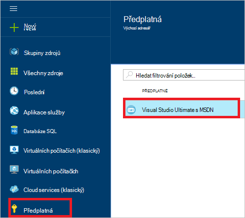
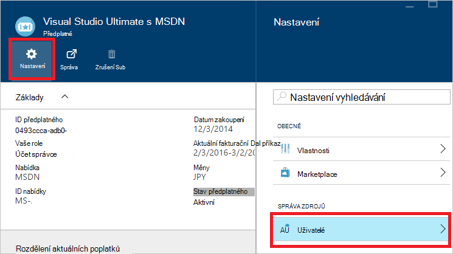
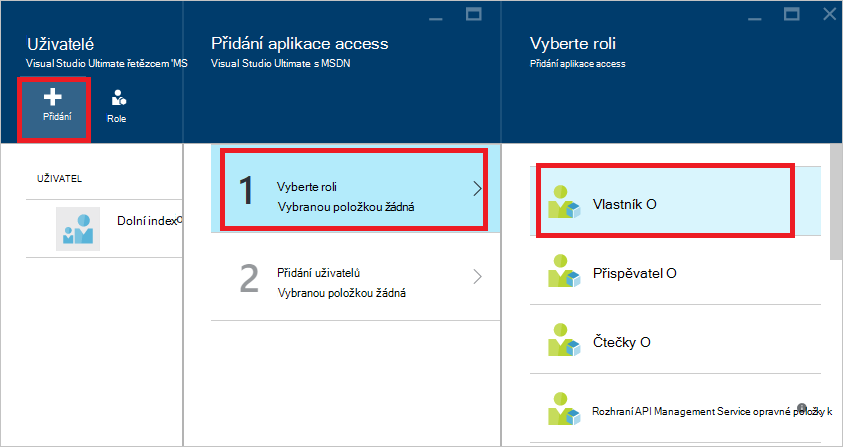
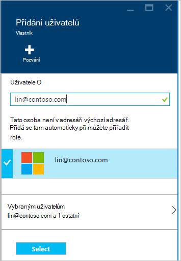
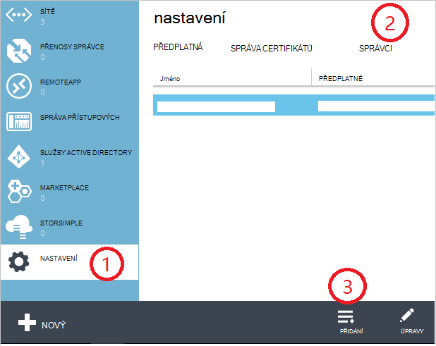
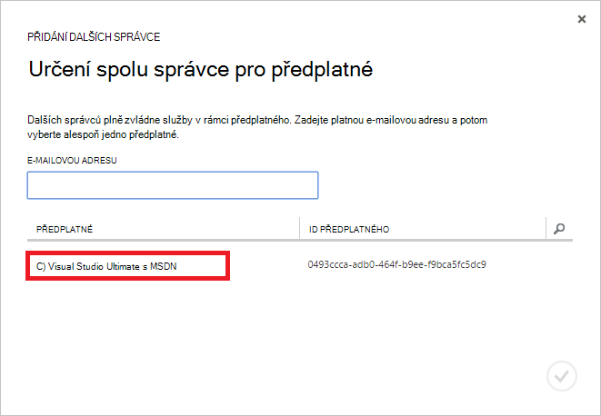
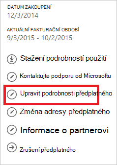
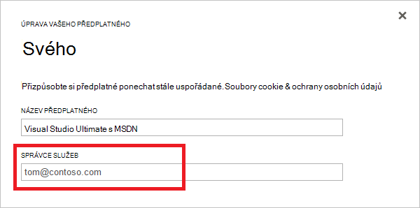

<properties
    pageTitle="Postup přidání nebo změna Azure správcovských rolí | Microsoft Azure"
    description="Popisuje, jak přidat nebo změnit Azure spolu správce, Správce služeb a účtů správce"
    services=""
    documentationCenter=""
    authors="genlin"
    manager="mbaldwin"
    editor=""
    tags="billing"/>

<tags
    ms.service="billing"
    ms.workload="na"
    ms.tgt_pltfrm="na"
    ms.devlang="na"
    ms.topic="article"
    ms.date="08/17/2016"
    ms.author="genli"/>

# Postup přidání nebo změna Azure správcovských rolí

Existují tři typy rolí správce v Microsoft Azure:

| Správní role   | Limit  | Popis
| ------------- | ------------- |---------------|
|Účet správce (AA)  | 1 za účet Azure  |Toto je osoba, která si zaregistrovali nebo si koupili předplatné Azure a oprávnění pro přístup k [Účtu Center](https://account.windowsazure.com/Home/Index) a dělat nejrůznější věci správy. Jedná se o tom mít možnost vytvořit předplatné zrušit předplatné, fakturace u předplatného nebo má správce služby.
| Služba Správce | 1 na jedno předplatné Azure  |Tato role je oprávnění ke správě služby [Azure portálu](https://portal.azure.com). Ve výchozím nastavení pro nové předplatné účtu správce zkratka má správce služby.|
|Spoluvytváření správce (CA) [Azure klasické portálu](https://manage.windowsazure.com)|200 jedno předplatné| Tato role má stejná oprávnění k přístupu jako správce služby, ale nemůžete změnit přidružení předplatná Azure adresářů. |

> [AZURE.NOTE] Azure na základě rolí Active Directory Access ovládacího prvku (RBAC) umožňuje uživatelům, které budou přidány do více rolí. Další informace najdete v tématu [Řízení přístupu na základě rolí Azure Active Directory](./active-directory/role-based-access-control-configure.md).

> [AZURE.NOTE] Pokud potřebujete další pomoc kdykoli v tomto článku najdete [kontaktovat podporu](https://portal.azure.com/?#blade/Microsoft_Azure_Support/HelpAndSupportBlade) získat problém vyřešit rychle.

## Jak přidat správce pro předplatné

**Azure portálu**

1. Přihlaste se k [portálu Azure](https://portal.azure.com).

2. V nabídce centrální vyberte **předplatné** > *předplatné, které se má správce pro přístup k*.

    

3. V zásuvné předplatného klikněte na **Nastavení**> **uživatelů**.

    
4. V zásuvné uživatelům, vyberte **Přidat**>**Vyberte roli** > **vlastník**.

    

    **Poznámka:**
    - Vlastník role má stejná oprávnění k přístupu jako spolu správce. Tato role nemá oprávnění přístup k [Centru účet Azure](https://account.windowsazure.com/subscriptions).
    - Vlastníci přidaný prostřednictvím [Azure portal](https://portal.azure.com) nelze spravovat služby [Azure klasické portal](https://manage.windowsazure.com).  

5. Zadejte e-mailovou adresu uživatele, kterého chcete přidat jakožto vlastníka, klikněte na uživatele a potom klikněte na **Výběr**.

    

**Azure klasické portálu**

1. Přihlaste se k [Azure klasické portálu](https://manage.windowsazure.com/).

2. V navigačním podokně klikněte na **Nastavení**> **Správci**> **Přidat**.  

    

3. Zadejte e-mailovou adresu člověka, kterému chcete přidat jako spolu správce a potom vyberte předplatné, které chcete spolu správce pro přístup k. 

     

Následující e-mailovou adresu lze přidat jako spolu správce:

* **Účet Microsoft** (dřív to bylo Windows Live ID)  
 Použijte Account Microsoft k přihlášení do všech produktech Microsoft orientovaného příjemce a cloudové služby, jako je aplikace Outlook (Hotmail), Skype (MSN), Onedrivu, Windows Phone a Xbox LIVE.
* **Účet organizace** 
 Účet organizace je účet vytvořenou v části Azure Active Directory. Účet organizace adresu následujícímu: user@ &lt;domény&gt;. onmicrosoft.com

### Omezení a omezení

 * Každý předplatné je přidružený k adresáři služby Azure AD (označovaná taky jako výchozí adresáři). Najít výchozí Directory je přidružená k předplatnému, přejděte na [portál Azure klasické](https://manage.windowsazure.com/), vyberte **Nastavení** > **předplatná**. Zaškrtněte políčko ID předplatného najít výchozí adresář.

 * Pokud jste přihlášení pomocí Account Microsoft, můžete jenom přidat další Accounts Microsoft nebo uživatelů v adresáři výchozí jako spolu správce.

 * Pokud jste přihlášení pomocí účtu organizace, můžete přidat další účty organizace ve vaší organizaci jako spolu správce. Například abby@contoso.com můžete přidat bob@contoso.com jako správce služeb nebo správce spolu, ale nemůžete přidávat john@notcontoso.com Pokud john@noncontoso.com je uživatel v adresáři výchozí. Uživatelích účtem organizace můžete pokračujte v přidávání uživatelů Account Microsoft jako správce služeb nebo správce spolupracovat.

 * Teď je možné k přihlášení do Azure pomocí účtu organizace, tyto změny požadavkům účtu správce služby a vedlejšího správce:

    Metoda přihlášení| Přidat jako certifikační Autority nebo správce systému Account Microsoft nebo uživatelům v rámci výchozí adresáře?  |Přidání účtu organizace ve stejné organizaci využívající jako certifikační Autority nebo přidružení zabezpečení? |Přidání účtu organizace v různých organizace jako certifikační Autority nebo správce systému?
    ------------- | ------------- |---------------|---------------
    Účet Microsoft |Ano|Ne|Ne
    Účet organizace|Ano|Ano|Ne

## Jak změnit správce služby pro předplatné

Pouze správci účtu můžete změnit má správce služby pro předplatné.

1. Přihlaste se do [Centra účet Azure](https://account.windowsazure.com/subscriptions) pomocí účtu správce.

2. Vyberte předplatné, které chcete změnit.

3. Na pravé straně klikněte na **Upravit předplatné** podrobnosti.  

    

4. V dialogovém okně **Správce služby** zadejte e-mailovou adresu má nové Správce služby.  

    

## Změna účtu správce

Přenos vlastnictví účet Azure jiného účtu, najdete v tématu [Přenos vlastnictví Azure předplatného](billing-subscription-transfer.md).

## Další kroky

* Další informace o tom, jak řídí přístup k prostředku v Microsoft Azure, najdete v článku [Principy přístupu k prostředkům ve Azure](./active-directory/active-directory-understanding-resource-access.md)

* Další informace o souvislost Azure Active Directory s Azure předplatné najdete v článku [jak Azure předplatná souvisí s Azure Active Directory](./active-directory/active-directory-how-subscriptions-associated-directory.md)

* Další informace o souvislost Azure Active Directory s Azure předplatné najdete v článku [přiřazení rolí správce v Azure Active Directory](./active-directory/active-directory-assign-admin-roles.md)

> [AZURE.NOTE] Pokud máte pořád ještě další otázky, přejděte prosím [kontaktovat podporu](https://portal.azure.com/?#blade/Microsoft_Azure_Support/HelpAndSupportBlade) získat problém vyřešit rychle.
