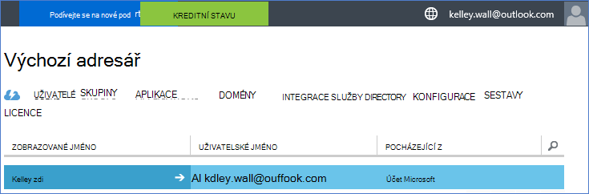
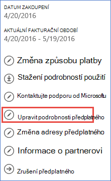
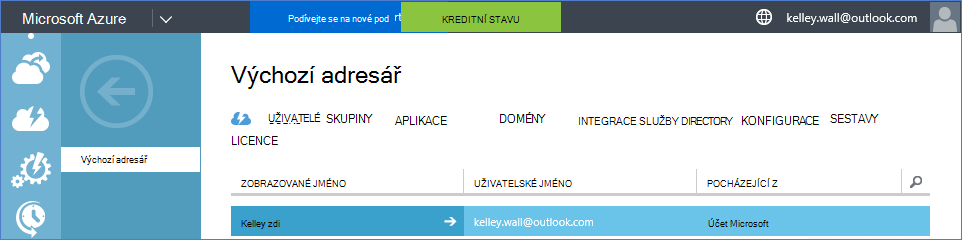

<properties
    pageTitle="Použití klienta Office 365 s předplatným Azure | Microsoft Azure"
    description="Naučte se přidávat adresáře služby Office 365 (klient) k předplatnému Azure aby přidružení."
    services=""
    documentationCenter=""
    authors="JiangChen79"
    manager="mbaldwin"
    editor=""
    tags="billing,top-support-issue"/>

<tags
    ms.service="billing"
    ms.workload="na"
    ms.tgt_pltfrm="ibiza"
    ms.devlang="na"
    ms.topic="article"
    ms.date="09/16/2016"
    ms.author="cjiang"/>

# Přidružení tenanta Office 365 s předplatným Azure
Pokud jste získali Azure a Office 365 předplatná, samostatně v minulosti a teď chcete mít přístup k tenantovi Office 365 z Azure předplatného, není těžké si to udělat. Tento článek vám ukáže, jak.

> [AZURE.NOTE] Tento článek neplatí pro zákazníky Enterprise Agreement (EA).

## Stručné pokyny
Do vašeho tenanta Office 365 přidružit předplatného Azure, používat účet Azure přidáte vašeho klienta Office 365 a pak předplatného Azure přidružit klientovi Office 365.

## Podrobný postup
V tomto scénáři Kelley zdi je uživatel, který má předplatné Azure pod účtem kelley.wall@outlook.com. Kelley také má předplatné Office 365 pod účtem kelley.wall@contoso.onmicrosoft.com. Teď Kelley chce přístup ke klientovi Office 365 s Azure předplatného.

### Zjistit předpoklady pro
Přidružení fungoval správně jsou potřeba následující požadavky:

- Potřebujete přihlašovací údaje Správce služby Azure předplatného. Dalších správců nelze provést podmnožinu kroky.
- Potřebujete pověření globální správce tenanta Office 365.
- E-mailovou adresu má správce služby nesmí být obsaženy v klientovi Office 365.
- E-mailovou adresu má správce služby nesmí odpovídat globální správce tenanta Office 365.
- Pokud aktuálně používáte e-mailovou adresu, která je účet Microsoft a účet organizace, dočasně změňte má správce služby Azure předplatného použít jiný účet Microsoft. Na [přihlašovací stránce účtu Microsoft](https://signup.live.com/), můžete vytvořit nový účet Microsoft.

Pokud chcete změnit správce služby, postupujte takto:

1. Přihlaste se k [portálu Správa účtu](https://account.windowsazure.com/subscriptions).
2. Vyberte předplatné, které chcete změnit.
3. Vyberte **Upravit podrobnosti předplatného**.

    

4. V dialogovém okně **Správce služby** zadejte e-mailovou adresu nového správce služby.

    

### Přidružit Azure předplatné klientovi Office 365
Pokud chcete přidružit Azure předplatné klientovi Office 365, postupujte takto:

1.  Přihlaste se k [portálu Správa účtu](https://account.windowsazure.com/subscriptions) pomocí přihlašovacích údajů správce služby.
2.  V levém podokně vyberte **Služby ACTIVE DIRECTORY**.

    

    > [AZURE.NOTE] Zobrazí neměli klientovi Office 365. Pokud se zobrazí, přejděte na další krok.

    

3. Přidání klientovi Office 365 k předplatnému Azure.

    na. Vyberte **Nový** > **adresáře** > **vlastní vytvořit**.

    

    b. Na stránce **Přidat adresář** v **adresáři**vyberte **použít existující adresář**. Vyberte **jsem připraven určený k podpisu nyní**a pak vyberte **Dokončit** .

    

    c. Po přihlášení Přihlaste se přihlašovacími globální správce tenanta Office 365.

    

    d. Vyberte **pokračovat**.

    

    e. Vyberte **Odhlásit se**.

    

    f. Přihlaste se k [portálu Správa účtu](https://account.windowsazure.com/subscriptions) pomocí přihlašovacích údajů správce služby.

    

    g. Měli byste vidět vašeho klienta Office 365 na řídicím panelu.

    

4. Změna adresáře přidružený k předplatnému Azure.

    na. Vyberte **Nastavení**.

    

    b. Vyberte předplatné Azure a pak vyberte **Upravit adresář**.
    

    c. Vyberte **Další** .

    

    > [AZURE.WARNING] Zobrazí se upozornění, že budou odebrány všechny dalších správců.

    

    >[AZURE.WARNING] Kromě toho všichni uživatelé [řízení přístupu na základě rolí (RBAC)](./active-directory/role-based-access-control-configure.md) s přístupem přiřazené do existující skupiny zdrojů budou odstraněny také. Upozornění, které se zobrazí ale jenom zmínky odebrání dalších správců.

    

    d. Vyberte **Hotovo** .

5. Teď můžete přiřadit účtů organizace v Office 365 jako dalších správců klienta služby Azure Active Directory.

    na. Vyberte kartu **Správci** a pak vyberte **Přidat**.

    

    b. Zadejte účet organizace pro vašeho klienta Office 365, vyberte Azure předplatné a pak vyberte **Dokončit** .

    

    c. Vraťte se na kartu **Správci** . Měli byste vidět účet organizace zobrazené jako spolu správce.

    

6. Pak můžete otestovat přístup s spolu správce.

    na. Odhlaste se z portálu Správa účtů.

    b. Otevřete na [portálu Správa účtu](https://account.windowsazure.com/subscriptions) nebo [Azure portálu](https://portal.azure.com/).

    c. Pokud Azure přihlašovací stránka má odkaz **Přihlaste se pomocí svého účtu organizace**, vyberte odkaz. V opačném tento krok přeskočte.

    

    d. Zadejte přihlašovací údaje spolu správce a pak vyberte **přihlásit**.

    

## Další kroky
Související scénáře, patří:

- Už máte předplatné Office 365 a je připraven pro předplatné Azure, ale chcete použít existující uživatelské účty Office 365 u předplatného Azure.
- Jsou Azure odběratele a chcete získat předplatné Office 365 pro uživatele v existující instanci služby Azure Active Directory.

Zjistěte, jak provádět tyto úkoly, najdete v článku [použití stávajícího Office 365 účet s předplatným Azure nebo naopak](billing-use-existing-office-365-account-azure-subscription.md).
