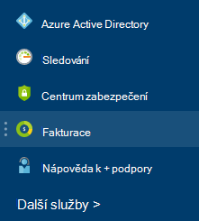
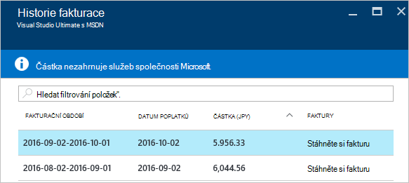

<properties
    pageTitle="Jak stáhnout vaše Azure fakturační údaje o používání faktury a denní | Microsoft Azure"
    description="Popisuje, jak stáhnout Azure fakturační faktury a denní použití zásad správy informací"
    services=""
    documentationCenter=""
    authors="genlin"
    manager="mbaldwin"
    editor=""
    tags="billing"
    />

<tags
    ms.service="billing"
    ms.workload="na"
    ms.tgt_pltfrm="na"
    ms.devlang="na"
    ms.topic="article"
    ms.date="10/10/2016"
    ms.author="genli"/>

# Jak stáhnout svůj fakturační údaje o používání faktury a denní Azure

> [AZURE.NOTE] Pokud potřebujete další pomoc kdykoli v tomto článku najdete [kontaktovat podporu](https://portal.azure.com/?#blade/Microsoft_Azure_Support/HelpAndSupportBlade) získat problém vyřešit rychle.

Jako správce účet Azure můžete zobrazit fakturační faktury a denní využití [Azure portál](https://portal.azure.com) nebo [Centrum účet Azure](https://account.windowsazure.com/subscriptions). Tady je způsob:

## Azure portálu

1. Přihlaste se k [portálu Azure](https://portal.azure.com) jako účet správce.

    >[AZURE.NOTE] Pouze účtu správce má k dispozici přístup fakturační údaje. Další informace o tom, jak zjistit, kdo je správcem účet předplatného najdete v tématu [Nejčastější dotazy](billing-subscription-transfer.md#faq).

2. V nabídce centrální vyberte **Fakturace**. Na zásuvné **Fakturace** najdete některé užitečné informace, například datum placení fakturace.

    
3. V části **náklady předplatné** vyberte předplatné, které si přejete zobrazit.

    
4. Klikněte na **Fakturace a použití**.

    

5. Na zásuvné **Historie fakturace** klikněte na tlačítko **Stáhnout faktury** zobrazit kopii vaší faktury. Klikněte na fakturační období zobrazíte denní využití.

    

## Centrum pro účet Azure

1. Přihlaste se do [Centra účet Azure](https://account.windowsazure.com/subscriptions) jako účet správce.
2. Vyberte předplatné, u kterého chcete informace faktury a použití.
3. Vyberte **HISTORIE FAKTURACE**.  
4. Zobrazí se vaše příkazy pro poslední šest fakturační období a aktuální nefakturovaný období.   
5. Vyberte **Zobrazit aktuální prohlášení** zobrazíte odhad vaše platby v době, kdy byl vytvořen odhad. Tyto informace se jenom aktualizuje denně a nesmí obsahovat všechny použití. Měsíční najdete na faktuře se může lišit od tohoto odhadu.   
6. Vyberte **Stáhnout faktury** zobrazíte kopii vaší poslední faktury.  
7. Zvolte **Stáhnout použití** stahování denní použití dat do souboru CSV. 

> [AZURE.NOTE] Pokud máte pořád ještě další otázky, přejděte prosím [kontaktovat podporu](https://portal.azure.com/?#blade/Microsoft_Azure_Support/HelpAndSupportBlade) získat problém vyřešit rychle.
