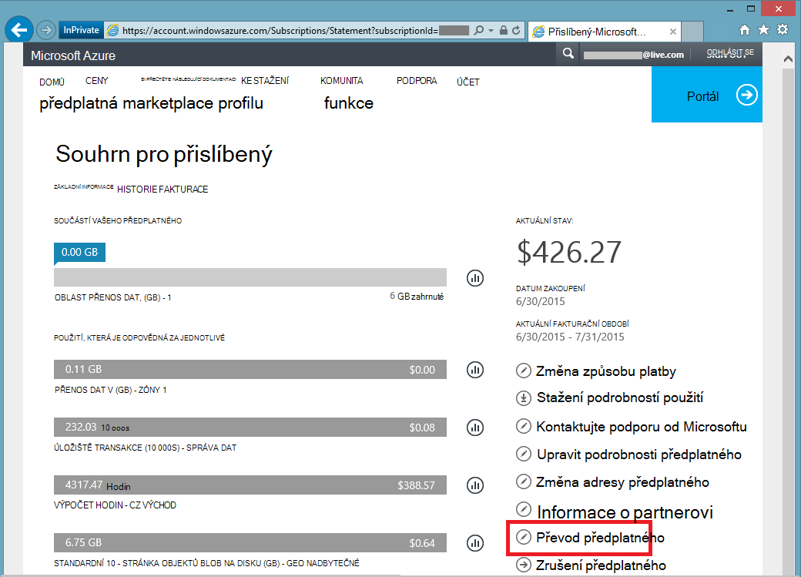

<properties
   pageTitle="Přenos vlastnictví Azure předplatného | Microsoft Azure"
   description="Jak přenášet Azure předplatné jiného uživatele a některé často kladené nejčastější dotazy týkající se procesu"
   services=""
   documentationCenter=""
   authors="genlin"
   manager="stevenpo"
   editor=""
   tags="billing,top-support-issue"/>

<tags
   ms.service="billing"
   ms.workload="na"
   ms.tgt_pltfrm="na"
   ms.devlang="na"
   ms.topic="article"
   ms.date="10/10/2016"
   ms.author="genli"/>

# Přenos vlastnictví Azure předplatného

Potřebujete:

- Potřebujete předá fakturace vlastnictví předplatného Azure někomu jinému?
- Chcete změnit účet použili k registraci Azure? Možná používá Account Microsoft ale chtěli při použití svůj pracovní nebo školní účet místo toho?
- Chcete přesunout předplatného Azure z jednoho adresáře?
- V různých klientů Azure a Office 365 a chcete sloučit?

Nyní můžete provést toto snadno v Microsoft Azure účtu Centrum - přislíbený, MSDN, Pack akce nebo BizSpark předplatná.  Přidali jsme možnost přenášet předplatné jiného uživatele. Jinými slovy můžete teď změníte účtu správce na jakéhokoli přislíbený, MSDN, sadu akce nebo BizSpark předplatného, kterou vlastníte, bez ohledu na to, která země pracovat v. Teď podporujeme přenosu Azure Marketplace nákup pro typy předplatného.

> [AZURE.NOTE] Změnit svoje předplatné na jinou nabídku, najdete v článku [přepínání předplatného Azure na jinou nabídku](billing-how-to-switch-azure-offer.md) Další informace. Pokud potřebujete další pomoc kdykoli v tomto článku najdete [kontaktovat podporu](https://portal.azure.com/?#blade/Microsoft_Azure_Support/HelpAndSupportBlade) získat problém vyřešit rychle.

## Jak převést vlastnictví Azure předplatného

> [AZURE.VIDEO transfer-an-azure-subscription]

1.  Přihlaste se na Portal.Office <https://account.windowsazure.com/Subscriptions>. Musíte být správcem účtu provádět přenos vlastnictví. Další informace o tom, jak zjistit, kdo je správcem účet předplatného najdete v tématu [Nejčastější dotazy](#faq).

2.  Vyberte předplatné přepojit.

3.  Klikněte na možnost **Převést předplatné** .

    

4.  Postupujte podle pokynů a zadejte příjemce.

    

5.  Příjemce automaticky pošle e-mail s odkazem přijetí.

    

6.  Příjemce klikne na odkaz a následující pokyny, včetně zadávání svoje platební údaje.

    

    

7. Úspěch! Předplatné teď převedena.

## Nejčastější dotazy

-   **Jak lze mám vědět, kdo je správcem účet předplatného?**

    Můžete zkontrolovat, kdo je správcem účet předplatného následujícím způsobem:

    1. Přihlaste se k [portálu Azure](https://portal.azure.com).
    2. V nabídce centrální vyberte **předplatné**.
    3. Vyberte předplatné, které chcete zkontrolovat a potom vyberte **Nastavení**.
    4. Vyberte **Vlastnosti**. Správce účet předplatného se zobrazí v poli **Účtu správce** .  

-   **Výsledek převod předplatného v libovolné výpadek služeb?**

    Neexistuje žádný vliv služby. To efektivně zruší předplatného klikněte v části aktuální účet správce vytvoří novou účtem příjemce, ale základní služby Azure přidruží nové předplatné. ID předplatného se nezmění.

-   **Používání této mechanismus Změna adresáře pro předplatné**-   
    Azure předplatného se vytvoří v adresáři, které patří účtu správce. Ano za účelem změny v adresáři, jenom přepojení předplatné k uživatelskému účtu v cílovém adresáři. Kroky pro přenos přijmout dokončení daného uživatele předplatného automaticky přesune cílový adresář.

-   **Pokud převzít fakturační vlastnictví předplatného od jiné organizace se bude mít přístup k zdrojů?**

    Pokud předplatné je převeden na jiném klientovi, ztratí uživatelé přidružený k předchozí klienta přístup k předplatnému. I když je uživatel není správce služeb nebo správce Co už, může být pořád mít přístup k předplatné prostřednictvím jinými mechanismy zabezpečení. Jedná se o:
    - Osvědčení o řízení, které uživateli udělit administrátorská práva a nemáte předplatné zdroje. Další informace najdete v tématu [vytvořte a uložte certifikát správy Azure](https://msdn.microsoft.com/library/azure/gg551722.aspx)
    -   Kombinace kláves pro služby, jako je úložiště. Další informace najdete v tématu [zobrazení, kopírovat a regenerovat úložiště přístupových kláves](storage-create-storage-account.md#view-copy-and-regenerate-storage-access-keys)
    -   Vzdálený přístup přihlašovacích údajů pro služby, jako virtuálních počítačích Azure

    Toto není úplný seznam. Příjemce byste měli vědět aktualizace všech tajemství přidružený ke službě, pokud je nutné omezit přístup k jejich zdroje. Většina zdrojů lze aktualizovat následujícím způsobem:

    1.   Přejděte na portál Azure: [ *https://portal.azure.com*](https://portal.azure.com)

    2.    Klikněte na Procházet vše -&gt; všechny zdroje

    3.    Vyberte zdroj. Otevře se zásuvné zdroje.

    4.    V zásuvné zdrojů klikněte na **Nastavení**. Tady můžete zobrazit a aktualizovat existující tajemství.

-   **Pokud můžu převést předplatné uprostřed fakturačním cyklu, příjemců platu pro celou fakturace cyklu?**

    Odesílatel je zodpovědný za platby pro použití, který byl vykázaného až do okamžiku dokončení převodu. Příjemce je zodpovědný za použití vykázaného od doby přenos roku. Doména může obsahovat některé použití uskutečnila před převodem, která byla vykázaného později. To bude obsahovat příjemce faktury.

-   **Má příjemce přístup k použití a historii fakturace?**

    V současné době je pouze informací zobrazených příjemci množství poslední faktury (nebo aktuální stav, pokud předplatné byl převeden před prvním faktury vygenerované). Zbytek použití a historii fakturace k přenosu k předplatnému.

-   **Bude možné měnit nabídku během přenosu?**

    Nabídka musí zůstávají stejné. Pokud chcete změnit vaši nabídku, musíte [kontaktovat podporu](http://go.microsoft.com/fwlink/?LinkID=619338).

-   **Můžu převést předplatné k uživatelskému účtu v jiné zemi?**

    Ne, v současné době to není podporován. Uživatelský účet příjemce musí být ve stejné zemi.

-   **Můžete použít příjemce mechanismus různých platby?**

    Ano. Platí omezení zde: teď předplatné historie fakturace rozděleny mezi dva účty. Ale má tu výhodu, můžete udělat to aniž byste museli [kontaktovat podporu](http://go.microsoft.com/fwlink/?LinkID=619338).

-   **Bude mít vliv způsob platby po přenosu předplatné Azure?**

    Abyste mohli přijmout převod předplatného, musí být si zaplatit předplatné uvedeny platební kartou nebo podobně jako způsob platby. Například pokud Jan převede předplatné Petra a Petra přenos přijme, tereza musí taky poskytují způsob platby, který uživatel bude používat si zaplatit předplatné. Po dokončení převodu Jan už strhne příslušná předplatné, které má převedeny na Petra.

## Další kroky po přijetí vlastnictví předplatného

1. Teď jste účtu správce. Zkontrolujte a upravte Správce služby a dalších správců. Správa správců [Azure klasické portál](https://manage.windowsazure.com) tak, že přejdete na nastavení. [Další informace](http://go.microsoft.com/fwlink/?LinkID=533293).
2. Řízení přístupu na základě rolí (RBAC) můžete taky použít pro svoje předplatné a služeb. Navštivte [Azure portál](https://portal.azure.com) [Další informace o RBAC](http://go.microsoft.com/fwlink/?LinkID=544802)
3. Aktualizujte jména a hesla se službami toto předplatné. Jedná se o:
    - Osvědčení o řízení, které uživateli udělit administrátorská práva a nemáte předplatné zdroje. Další informace najdete v tématu [Vytvoření a odeslání Správa certifikátů pro Azure](https://msdn.microsoft.com/library/azure/gg551722.aspx)
    -   Přístupových kláves z verze služby, jako je úložiště. Další informace najdete v tématu [zobrazení, kopírovat a regenerovat úložiště přístupových kláves](storage-create-storage-account.md#view-copy-and-regenerate-storage-access-keys)
    -   Vzdálený přístup přihlašovacích údajů pro služby, jako virtuálních počítačích Azure
4. Aktualizovat fakturační upozornění pro toto předplatné v [Centru účet Azure](https://account.windowsazure.com/Subscriptions)  [Další informace](http://go.microsoft.com/fwlink/?LinkID=533292)
5.  Pokud pracujete s partnerem, aktualizujte ID partnera na toto předplatné. Lze provést na stránce [Centrum pro účet Azure](https://account.windowsazure.com/Subscriptions).

> [AZURE.NOTE] Pokud máte pořád ještě další otázky, přejděte prosím [kontaktovat podporu](https://portal.azure.com/?#blade/Microsoft_Azure_Support/HelpAndSupportBlade) získat problém vyřešit rychle.
