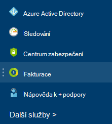

<properties
    pageTitle="Princip Azure externí poplatky za | Microsoft Azure"
    description="Přečtěte si o fakturačním účtu externích služeb, dřív označoval jako Marketplace, náklady v Azure."
    services=""
    documentationCenter=""
    authors="adpick"
    manager="felixwu"
    editor=""
    tags="billing"
    />

<tags
    ms.service="billing"
    ms.workload="na"
    ms.tgt_pltfrm="na"
    ms.devlang="na"
    ms.topic="article"
    ms.date="10/12/2016"
    ms.author="adpick"/>

# Princip Azure externí poplatky

Tento článek vysvětluje fakturace externí služby Azure. Externí služby používá volat Marketplace objednávky. Externí služby jsou poskytovány dodavateli nezávisle na službu, ale jsou součástí úplně Azure ekosystému. Zjistěte, jak:

- Identifikace externích služeb
- Vysvětlení, jak se liší od jiné Azure zdroje fakturace
- Zobrazení a sledování žádné náklady, které jste metodu nabíhání nákladů v seznamu použít externí služby
- Spravovat externí služby objednávky a jak můžete buď zaplatit je

## Co jsou externí služby Azure?

Externí služby používá volat Azure Marketplace. Obecně vzato jsou služeb publikovaných třetími stranami k dispozici pro Azure. ClearDB a SendGrid příklady externí služby, které můžete zakoupit v Azure, ale nejsou publikovány společností Microsoft.

### Identifikace externích služeb

Když zřizujete nové externí služby nebo zdroje, se zobrazí upozornění:

>[AZURE.NOTE] Externí služby jsou publikované společnostmi, které nejsou Microsoft, ale někdy produkty společnosti Microsoft se také zařazení do kategorie externí služby.

### Externí služby je faktura samostatně

Externí služby je považováno za jednotlivé objednávky v rámci předplatného Azure. Fakturační období pro každou službu nastavenou při Kupte si službu. Nezaměňujte s fakturační období předplatné, pod kterým jste zakoupili. Získáte také samostatné faktury a vaší kreditní karty bude účtováno samostatně.

### Jednotlivé externí služby má jiný fakturační model

Některých služeb je faktura systému průběžného financování způsobem, zatímco ostatní použití měsíční modelu základě platby. Potřebujete platební kartou externí služby Azure, nelze zakoupit externí služby s platovou faktury.

### Měsíční bezplatné přeplatky nelze použít pro externí služby

Pokud používáte Azure předplatné, které obsahuje [bezplatné přeplatky](https://azure.microsoft.com/pricing/spending-limits/), nelze použít pro externí služby faktury. Pomocí platební kartou koupit externí služby.

## Zobrazení externí služby výdaje a historie

Můžete zobrazit seznam externí služby, které jsou u každého předplatného v [Azure portálu](https://portal.azure.com/): 

1. Přihlaste se k [portálu Azure](https://portal.azure.com/) a [přejděte na zásuvné **Fakturace** ](https://portal.azure.com/?flight=1#blade/Microsoft_Azure_Billing/BillingBlade).

     
  
2. V části **náklady předplatné** vyberte předplatné, které si přejete zobrazit. 
   
    

3. Klikněte na **externí služby**.

    

4. Měli byste vidět každý objednávání externí služby, název vydavatele, vrstvy služeb, které jste si koupili, název jste přiřadili daný zdroj a v aktuálním stavu objednávky. Vyberte externí službu v minulosti faktury.

    

5. Tady můžete zobrazit dřívější částky faktury včetně daň rozdělení.

    

## Spravovat způsoby platby za externí služby objednávky

Aktualizujte své způsoby platby za objednávky externí služby z [Centra účtu](https://account.windowsazure.com/).

> [AZURE.NOTE] Pokud jste si koupili předplatné pracovní nebo školní účet je nutné [kontaktování podpory](https://portal.azure.com/?#blade/Microsoft_Azure_Support/HelpAndSupportBlade) při změně způsobu platby.

1. Přihlaste se k [Účtu Centrum](https://account.windowsazure.com/) a [přejděte na kartu **marketplace** ](https://account.windowsazure.com/Store)

    

2. Vyberte externí služby, kterou si chcete spravovat

    

3. V pravé části stránky klikněte na tlačítko **změnit způsob platby** . Tento odkaz přináší různých portálu pro správu způsobu platby.
    
    

4. Klikněte na **Upravit informace** a postupujte podle pokynů aktualizovat informace o způsobu platby.

    
    
## Zrušení objednávky externí služby

Pokud chcete zrušit objednávku externí služby, musíte odstranit zdroj [Azure portálu](https://portal.azure.com).

## Potřebujete pomoc? Kontaktujte podporu.

Pokud máte pořád ještě další otázky, přejděte prosím [kontaktovat podporu](https://portal.azure.com/?#blade/Microsoft_Azure_Support/HelpAndSupportBlade) získat problém vyřešit rychle.
