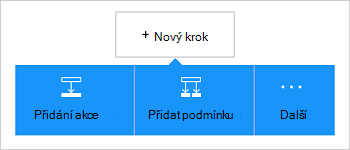

<properties
    pageTitle="Přidání úložiště objektů blob Azure spojnice v aplikacích logiky | Microsoft Azure"
    description="Základní informace o úložišti objektů blob Azure spojnice s parametry rozhraní REST API"
    services=""
    documentationCenter="" 
    authors="MandiOhlinger"
    manager="anneta"
    editor=""
    tags="connectors"/>

<tags
   ms.service="logic-apps"
   ms.devlang="na"
   ms.topic="article"
   ms.tgt_pltfrm="na"
   ms.workload="integration" 
   ms.date="10/18/2016"
   ms.author="mandia"/>

# Začínáme s konektoru úložiště objektů blob Azure
Úložiště objektů Blob Azure je služba pro ukládání velkých objemů Nestrukturovaná data. Provádět různé akce například nahrát, aktualizovat, získat a odstranění objektů BLOB v úložišti objektů blob Azure. 

S úložišti objektů blob Azure můžete:

- Odesílání nových projektů nebo předání soubory nedávno aktualizované sestavte pracovní postup.
- Umožňuje získat soubor metadata, odstraňte soubor kopírování souborů a další akce. Třeba při aktualizaci nástroje v Azure webu (aktivační) aktualizujte souboru v úložišti objektů blob (akce). 

V tomto tématu se dozvíte, jak pomocí konektoru úložiště objektů blob v aplikaci logiky a také uvádí seznam akcí.

>[AZURE.NOTE] Tuto verzi článku platí pro aplikace logiky všeobecně dostupná (GA). 

Další informace o použití logických operátorů aplikace, najdete v článku [Co jsou logiky aplikace](../app-service-logic/app-service-logic-what-are-logic-apps.md) a [Vytvoření logiky aplikace](../app-service-logic/app-service-logic-create-a-logic-app.md).

## Připojení k úložišti objektů blob Azure

Pokud aplikace logiky získat přístup k jiné služby, nejprve vytvoříte *připojení* ke službě. Připojení umožňuje připojení mezi logiky aplikace a další služby. Například pro připojení k účtu úložiště, nejprve vytvoříte úložiště objektů blob *připojení*. Vytvoření připojení, zadejte přihlašovací údaje, které obvykle používáte pro přístup ke službě, ke kterému se připojujete. Takže s Azure úložiště, zadejte její přihlašovací údaje ke svému účtu úložiště k vytvoření připojení. 

#### Vytvoření připojení

>[AZURE.INCLUDE [Create a connection to Azure blob storage](../../includes/connectors-create-api-azureblobstorage.md)]
 
## Použijte aktivační událost

Tato spojnice není k dispozici aktivační události. Umožňuje spusťte použití logických operátorů, jako je aktivační události opakování, aktivační události pro HTTP Webhook, aktivační události dostupné pro ostatní spojnic a další jiných aktivačních událostí. [Vytvoření aplikace použití logických operátorů](../app-service-logic/app-service-logic-create-a-logic-app.md) poskytuje příklad.

## Použití akce
    
Akce je operace prováděné definované v aplikaci logiky pracovního postupu.

1. Vyberte znaménko plus. Uvidíte několik možností: **Přidat akci**, **Přidat podmínku**nebo nějakého s **dalšími** možnostmi.

    

2. Zvolte **Přidat akci**.

3. Do textového pole zadejte "objektů blob" zobrazte seznam všech dostupných akcí.

     

4. V našem příkladu zvolte **AzureBlob - získat metadata soubor pomocí cesty**. Pokud připojení už existuje, vyberte **...** (Zobrazit výběr) s cílem vyberte soubor.

    

    Pokud se zobrazí výzva pro informace o připojení, zadejte podrobnosti o vytvoření připojení. [Vytvoření připojení](connectors-create-api-azureblobstorage.md#create-the-connection) v tomto tématu popisuje tyto vlastnosti. 

    > [AZURE.NOTE] V tomto příkladu jsme získat metadata souboru. Chcete-li zobrazit metadata přidat akci, která se vytvoří nový soubor pomocí jiného spojnice. Například přidáte OneDrive akci, která vytvoří nový "otestujte" souboru na základě metadata. 

5. **Uložte** provedené změny (levého horního rohu panelu). Použití logických operátorů aplikace se uloží a může být automaticky zapnutá.

> [AZURE.TIP] [Průzkumník úložišť](http://storageexplorer.com/) je skvělým nástrojem pro správu víc účtů úložiště.

## Podrobné technické informace

## Úložiště objektů Blob akce

|Akce|Popis|
|--- | ---|
|[Získejte soubor metadat](connectors-create-api-azureblobstorage.md#get-file-metadata)|Tuto operaci získá metadat soubor pomocí id souboru.|
|[Aktualizace souboru](connectors-create-api-azureblobstorage.md#update-file)|Operace se aktualizuje v souboru.|
|[Odstranění souboru](connectors-create-api-azureblobstorage.md#delete-file)|Tuto operaci odstranění souboru.|
|[Získat metadata soubor pomocí cesty](connectors-create-api-azureblobstorage.md#get-file-metadata-using-path)|Tuto operaci získá metadat soubor pomocí cesty.|
|[Získání obsahu soubor pomocí cesty](connectors-create-api-azureblobstorage.md#get-file-content-using-path)|Tuto operaci získá obsah soubor pomocí cesty.|
|[Zobrazí obsah souboru](connectors-create-api-azureblobstorage.md#get-file-content)|Tuto operaci získá obsah souboru pomocí id.|
|[Vytvoření souboru](connectors-create-api-azureblobstorage.md#create-file)|Tuto operaci odesílání souboru.|
|[Zkopíroval soubor](connectors-create-api-azureblobstorage.md#copy-file)|Tuto operaci slouží ke kopírování souboru k úložišti objektů Blob Azure.|
|[Extrahování archiv složky](connectors-create-api-azureblobstorage.md#extract-archive-to-folder)|Tuto operaci extrahuje souboru archivu do jiné složky (Příklad: .zip).|

### Podrobnosti o akci

V této části najdete v článku nějaké informace o jednotlivých akci, včetně všechny požadované nebo volitelné vstupní vlastnosti a odpovídající výstup přidružené spojnice.

#### Získejte soubor metadat
Tuto operaci získá metadat soubor pomocí id souboru.  

|Název vlastnosti| Zobrazované jméno|Popis|
| ---|---|---|
|ID *|Soubor|Vyberte soubor|

Hvězdička (*) znamená, že vlastnost je povinný.

##### Podrobnosti výstupu
BlobMetadata

| Název vlastnosti | Datový typ |
|---|---|
|ID|řetězec|
|Jméno|řetězec|
|DisplayName|řetězec|
|Cesta|řetězec|
|Změněno|řetězec|
|Velikost|celé číslo|
|MediaType|řetězec|
|IsFolder|Logická hodnota|
|ETag|řetězec|
|FileLocator|řetězec|

#### Aktualizace souboru
Operace se aktualizuje v souboru.  

|Název vlastnosti| Zobrazované jméno|Popis|
| ---|---|---|
|ID *|Soubor|Vyberte soubor|
|textu *|Obsah souboru|Obsah souboru aktualizovat|

Hvězdička (*) znamená, že vlastnost je povinný.

##### Podrobnosti výstupu
BlobMetadata

| Název vlastnosti | Datový typ |
|---|---|
|ID|řetězec|
|Jméno|řetězec|
|DisplayName|řetězec|
|Cesta|řetězec|
|Změněno|řetězec|
|Velikost|celé číslo|
|MediaType|řetězec|
|IsFolder|Logická hodnota|
|ETag|řetězec|
|FileLocator|řetězec|

#### Odstranění souboru
Tuto operaci odstranění souboru.  

|Název vlastnosti| Zobrazované jméno|Popis|
| ---|---|---|
|ID *|Soubor|Vyberte soubor|

Hvězdička (*) znamená, že vlastnost je povinný.

##### Podrobnosti výstupu
Žádná.

#### Získat metadata soubor pomocí cesty
Tuto operaci získá metadat soubor pomocí cesty.  

|Název vlastnosti| Zobrazované jméno|Popis|
| ---|---|---|
|Cesta k *|Cesta k souboru|Vyberte soubor|

Hvězdička (*) znamená, že vlastnost je povinný.

##### Podrobnosti výstupu
BlobMetadata

| Název vlastnosti | Datový typ |
|---|---|
|ID|řetězec|
|Jméno|řetězec|
|DisplayName|řetězec|
|Cesta|řetězec|
|Změněno|řetězec|
|Velikost|celé číslo|
|MediaType|řetězec|
|IsFolder|Logická hodnota|
|ETag|řetězec|
|FileLocator|řetězec|

#### Získání obsahu soubor pomocí cesty
Tuto operaci získá obsah soubor pomocí cesty.  

|Název vlastnosti| Zobrazované jméno|Popis|
| ---|---|---|
|Cesta k *|Cesta k souboru|Vyberte soubor|

Hvězdička (*) znamená, že vlastnost je povinný.

##### Podrobnosti výstupu
Žádná.

#### Zobrazí obsah souboru
Tuto operaci získá obsah souboru pomocí id.  

|Název vlastnosti| Datový typ|Popis|
| ---|---|---|
|ID *|řetězec|Vyberte soubor|

Hvězdička (*) znamená, že vlastnost je povinný.

##### Podrobnosti výstupu
Žádná.

#### Vytvoření souboru
Tuto operaci odesílání souboru.  

|Název vlastnosti| Zobrazované jméno|Popis|
| ---|---|---|
|cesta_ke_složce *|Cestu ke složce|Vyberte složku|
|Název *|Název souboru|Název souboru k nahrání|
|textu *|Obsah souboru|Obsah souboru k nahrání|

Hvězdička (*) znamená, že vlastnost je povinný.

##### Podrobnosti výstupu
BlobMetadata

| Název vlastnosti | Datový typ | 
|---|---|
|ID|řetězec|
|Jméno|řetězec|
|DisplayName|řetězec|
|Cesta|řetězec|
|Změněno|řetězec|
|Velikost|celé číslo|
|MediaType|řetězec|
|IsFolder|Logická hodnota|
|ETag|řetězec|
|FileLocator|řetězec|

#### Zkopíroval soubor
Tuto operaci slouží ke kopírování souboru k úložišti objektů Blob Azure.  

|Název vlastnosti| Zobrazované jméno|Popis|
| ---|---|---|
|zdroj *|Adresa url zdroje|Zadejte adresu Url zdrojový soubor|
|určení *|Cesta k souboru cíl|Určení cesta k souboru cíle, včetně cílový název souboru|
|Přepsat|Přepsat?|By měl být existujícího cílového souboru přepíšou (true nebo false)?  |

Hvězdička (*) znamená, že vlastnost je povinný.

##### Podrobnosti výstupu
BlobMetadata

| Název vlastnosti | Datový typ |
|---|---|
|ID|řetězec|
|Jméno|řetězec|
|DisplayName|řetězec|
|Cesta|řetězec|
|Změněno|řetězec|
|Velikost|celé číslo|
|MediaType|řetězec|
|IsFolder|Logická hodnota|
|ETag|řetězec|
|FileLocator|řetězec|

#### Extrahování archiv složky
Tuto operaci extrahuje souboru archivu do jiné složky (Příklad: .zip).  

|Název vlastnosti| Zobrazované jméno|Popis|
| ---|---|---|
|zdroj *|Cesta k souboru archivu zdroje|Vyberte soubor archivu|
|určení *|Cílová složka cesta|Výběr příkazu obsah zleva|
|Přepsat|Přepsat?|By měl být existujícího cílového souboru přepíšou (true nebo false)?|

Hvězdička (*) znamená, že vlastnost je povinný.

##### Podrobnosti výstupu
BlobMetadata

| Název vlastnosti | Datový typ |
|---|---|
|ID|řetězec|
|Jméno|řetězec|
|DisplayName|řetězec|
|Cesta|řetězec|
|Změněno|řetězec|
|Velikost|celé číslo|
|MediaType|řetězec|
|IsFolder|Logická hodnota|
|ETag|řetězec|
|FileLocator|řetězec|

## Odpovědi na HTTP

Při volání různé kroky, může se zobrazit některé odpovědi. Následující tabulka popisuje odpovědi a jejich popisu:  

|Jméno|Popis|
|---|---|
|200|Ok|
|202|Přijaté|
|400|Chybný požadavek|
|401|Neoprávněným|
|403|Zakázáno|
|404|Nenalezeno|
|500|Vnitřní chyba serveru. Došlo k neznámé chybě|
|Výchozí|Operace se nezdařila.|

## Další kroky

[Vytvoření logiky aplikace](../app-service-logic/app-service-logic-create-a-logic-app.md). Prozkoumejte jiných spojnice k dispozici v aplikacích pro použití logických operátorů v našem [seznamu rozhraní API](apis-list.md).

