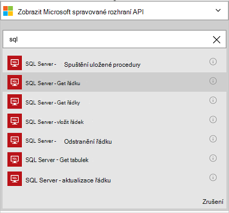

<properties
    pageTitle="Přidání spojnice databáze SQL Azure v aplikacích použití logických operátorů | Microsoft Azure"
    description="Základní informace o databáze SQL Azure spojnice s parametry rozhraní REST API"
    services=""
    documentationCenter="" 
    authors="MandiOhlinger"
    manager="anneta"
    editor=""
    tags="connectors"/>

<tags
   ms.service="logic-apps"
   ms.devlang="na"
   ms.topic="article"
   ms.tgt_pltfrm="na"
   ms.workload="na" 
   ms.date="10/18/2016"
   ms.author="mandia"/>

# Začínáme s konektoru databáze SQL Azure
Pomocí konektoru databáze SQL Azure, vytvořte pracovní postup pro vaši organizaci, které Správa dat v tabulkách. 

S SQL databáze můžete:

- Vytvořte pracovní postup přidáním nového zákazníka k databázi zákazníci nebo aktualizace objednávky v databázi aplikace objednávky.
- Pomocí akce get řádek dat, vložit nový řádek a dokonce odstranit. Například po vytvoření záznamu v Dynamics CRM Online (aktivační) vložte řádek v databázi SQL Azure (akce). 

V tomto tématu se dozvíte, jak pomocí konektoru SQL databáze v aplikaci použití logických operátorů a také uvádí seznam akcí.

>[AZURE.NOTE] Tuto verzi článku platí pro aplikace logiky všeobecně dostupná (GA). 

Další informace o použití logických operátorů aplikace, najdete v článku [Co jsou logiky aplikace](../app-service-logic/app-service-logic-what-are-logic-apps.md) a [Vytvoření logiky aplikace](../app-service-logic/app-service-logic-create-a-logic-app.md).

## Připojení k databázi Azure SQL

Pokud aplikace logiky získat přístup k jiné služby, nejprve vytvoříte *připojení* ke službě. Připojení umožňuje připojení mezi logiky aplikace a další služby. Například pro připojení k SQL databázi, nejprve vytvoříte *připojení*k databázi SQL. Vytvoření připojení, zadejte přihlašovací údaje, které obvykle používáte pro přístup ke službě, ke kterému se připojujete. Ano v databázi SQL zadejte svoje přihlašovací údaje databáze SQL vytvoření připojení. 

#### Vytvoření připojení

>[AZURE.INCLUDE [Create the connection to SQL Azure](../../includes/connectors-create-api-sqlazure.md)]

## Použijte aktivační událost

Tato spojnice není k dispozici aktivační události. Umožňuje spusťte použití logických operátorů, jako je aktivační události opakování, aktivační události pro HTTP Webhook, aktivační události dostupné pro ostatní spojnic a další jiných aktivačních událostí. [Vytvoření aplikace použití logických operátorů](../app-service-logic/app-service-logic-create-a-logic-app.md) poskytuje příklad.

## Použití akce
    
Akce je operace prováděné definované v aplikaci logiky pracovního postupu. [Další informace o akce](../app-service-logic/app-service-logic-what-are-logic-apps.md#logic-app-concepts).

1. Vyberte znaménko plus. Uvidíte několik možností: **Přidat akci**, **Přidat podmínku**nebo nějakého s **dalšími** možnostmi.

    

2. Zvolte **Přidat akci**.

3. Do textového pole zadejte "sql" zobrazte seznam všech dostupných akcí.

     

4. V našem příkladu vyberte **SQL Server – zobrazí řádek**. Pokud připojení už existuje, vyberte v rozevíracím seznamu **název tabulky** a zadejte **Identifikátor řádku** chcete vrátit.

    

    Pokud se zobrazí výzva pro informace o připojení, zadejte podrobnosti o vytvoření připojení. [Vytvoření připojení](connectors-create-api-sqlazure.md#create-the-connection) v tomto tématu popisuje tyto vlastnosti. 

    > [AZURE.NOTE] V tomto příkladu jsme vráceným řádku tabulky. Pokud chcete zobrazit data v této řadě, přidáte akci, která se vytvoří soubor pomocí pole z tabulky. Například přidáte OneDrive akci, která používá pole jméno a příjmení k vytvoření nového souboru v okně cloudové úložiště účet. 

5. **Uložte** provedené změny (levého horního rohu panelu). Použití logických operátorů aplikace se uloží a může být automaticky zapnutá.

## Podrobné technické informace

## Akce SQL databáze
Akce je operace prováděné definované v aplikaci logiky pracovního postupu. Konektor SQL databáze obsahuje následující akce. 

|Akce|Popis|
|--- | ---|
|[ExecuteProcedure](connectors-create-api-sqlazure.md#execute-stored-procedure)|Spustí proceduru uloženou v jazyce SQL|
|[GetRow](connectors-create-api-sqlazure.md#get-row)|Načte do jednoho řádku z tabulky SQL|
|[GetRows](connectors-create-api-sqlazure.md#get-rows)|Načte řádků z tabulky SQL|
|[InsertRow](connectors-create-api-sqlazure.md#insert-row)|Vloží nový řádek tabulky SQL|
|[DeleteRow](connectors-create-api-sqlazure.md#delete-row)|Odstranění řádku z tabulky SQL|
|[GetTables](connectors-create-api-sqlazure.md#get-tables)|Načte tabulek z databáze SQL|
|[UpdateRow](connectors-create-api-sqlazure.md#update-row)|Aktualizuje existující řádek v tabulce SQL|

### Podrobnosti o akci

V této části najdete v článku nějaké informace o jednotlivých akci, včetně všechny požadované nebo volitelné vstupní vlastnosti a odpovídající výstup přidružené spojnice.

#### Spuštění uložené procedury
Spustí proceduru uloženou v SQL.  

| Název vlastnosti| Zobrazované jméno |Popis|
| ---|---|---|
|Postup * | Název procedury | Název uložené procedury, který chcete provést |
|Parametry * | Vstupní parametry | Parametry jsou dynamické a podle uložené procedury, které zvolíte.    Pokud používáte databázi ukázkové Adventure Works, například zvolte *ufnGetCustomerInformation* uložené procedury. Zobrazí se na vstupní parametry **ID zákazníka** . Zadejte "6", nebo na některou z dalších zákazníkem ID. |

Hvězdička (*) znamená, že vlastnost je povinný.

##### Podrobnosti výstupu
ProcedureResult: Provede výsledek provádění uložená procedura

| Název vlastnosti | Datový typ | Popis |
|---|---|---|
|OutputParameters|objekt|Hodnoty parametrů výstup |
|Kód vrácení|celé číslo|Vrátí kód postupu |
|ResultSets|objekt| Sady výsledků|

#### Získání řádku 
Načte do jednoho řádku z tabulky SQL.  

| Název vlastnosti| Zobrazované jméno |Popis|
| ---|---|---|
|Tabulka * | Název tabulky |Název tabulky SQL|
|ID * | Identifikátor řádku |Jedinečný identifikátor řádku k načtení|

Hvězdička (*) znamená, že vlastnost je povinný.

##### Podrobnosti výstupu
Položky

| Název vlastnosti | Datový typ |
|---|---|
|ItemInternalId|řetězec|

#### Získání řádků 
Načte řádků z tabulky SQL.  

|Název vlastnosti| Zobrazované jméno|Popis|
| ---|---|---|
|Tabulka *|Název tabulky|Název tabulky SQL|
|$skip|Přeskočit počet|Počet faktur od přeskočit (výchozí = 0)|
|$top|Získání maximální počet|Maximální počet položek k načtení (výchozí = 256)|
|$filter|Filtrování dotazu|Dotaz filtru ODATA omezení počtu položek|
|$orderby|Řadit podle|Dotaz ODATA řadit podle určete pořadí položek|

Hvězdička (*) znamená, že vlastnost je povinný.

##### Podrobnosti výstupu
ItemsList

| Název vlastnosti | Datový typ |
|---|---|
|Hodnota|pole|

#### Vložení řádku 
Vloží nový řádek tabulky SQL.  

|Název vlastnosti| Zobrazované jméno|Popis|
| ---|---|---|
|Tabulka *|Název tabulky|Název tabulky SQL|
|položky *|Řádek|Řádek vložit do zadané tabulky v jazyce SQL|

Hvězdička (*) znamená, že vlastnost je povinný.

##### Podrobnosti výstupu
Položky

| Název vlastnosti | Datový typ |
|---|---|
|ItemInternalId|řetězec|

#### Odstranění řádku 
Odstranění řádku z tabulky SQL.  

|Název vlastnosti| Zobrazované jméno|Popis|
| ---|---|---|
|Tabulka *|Název tabulky|Název tabulky SQL|
|ID *|Identifikátor řádku|Jedinečný identifikátor řádku, až odstranit|

Hvězdička (*) znamená, že vlastnost je povinný.

##### Podrobnosti výstupu
Žádná.

#### Získání tabulek 
Načte tabulek z databáze SQL.  

Neexistují žádné parametry pro tento hovor. 

##### Podrobnosti výstupu 
TablesList

| Název vlastnosti | Datový typ |
|---|---|
|Hodnota|pole|

#### Aktualizace řádku 
Aktualizuje existující řádek v tabulce SQL.  

|Název vlastnosti| Zobrazované jméno|Popis|
| ---|---|---|
|Tabulka *|Název tabulky|Název tabulky SQL|
|ID *|Identifikátor řádku|Jedinečný identifikátor řádku Aktualizovat|
|položky *|Řádek|Řádek s aktualizovanými hodnotami|

Hvězdička (*) znamená, že vlastnost je povinný.

##### Podrobnosti výstupu  
Položky

| Název vlastnosti | Datový typ |
|---|---|
|ItemInternalId|řetězec|

### Odpovědi na HTTP

Při volání různé kroky, může se zobrazit některé odpovědi. Následující tabulka popisuje odpovědi a jejich popisu:  

|Jméno|Popis|
|---|---|
|200|Ok|
|202|Přijaté|
|400|Chybný požadavek|
|401|Neoprávněným|
|403|Zakázáno|
|404|Nenalezeno|
|500|Vnitřní chyba serveru. Došlo k neznámé chybě|
|Výchozí|Operace se nezdařila.|

## Další kroky

[Vytvoření logiky aplikace](../app-service-logic/app-service-logic-create-a-logic-app.md). Prozkoumejte jiných spojnice k dispozici v aplikacích pro použití logických operátorů v našem [seznamu rozhraní API](apis-list.md).
