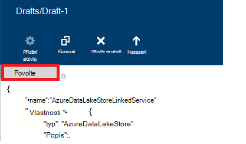

<properties
    pageTitle="Přesunutí dat do/z úložiště jezera dat Azure | Azure Data Factory"
    description="Naučte se přesuňte data z úložiště jezera dat Azure pomocí Azure Data Factory"
    services="data-factory"
    documentationCenter=""
    authors="linda33wj"
    manager="jhubbard"
    editor="monicar"/>

<tags
    ms.service="data-factory"
    ms.workload="data-services"
    ms.tgt_pltfrm="na"
    ms.devlang="na"
    ms.topic="article"
    ms.date="09/27/2016"
    ms.author="jingwang"/>

# Přesunutí dat do a z úložiště jezera dat Azure pomocí Azure Data Factory
Tento článek popisuje, jak můžete kopírovat aktivity v Azure dat factory přesuňte data z/do úložiště jezera Azure dat z jiného úložiště dat. Tento článek je založena na článek [aktivity přesun dat](data-factory-data-movement-activities.md) , který představuje obecné základní informace o přesun dat se kopie aktivitu a kombinace úložiště podporované datové.

> [AZURE.NOTE]
> Vytvořte účet Azure úložišti jezera před vytvořením kanálů aktivitu kopii chcete přesunout data z úložiště jezera dat Azure. Další informace o úložiště jezera dat Azure, najdete v článku [Začínáme s úložiště jezera dat Azure](../data-lake-store/data-lake-store-get-started-portal.md).
>  
> Prohlédněte si [vytvořit svůj první kurz kanálem k odesílání zpráv](data-factory-build-your-first-pipeline.md) podrobný postup k vytvoření factory dat, propojené služeb, datových sad a potrubí. Pomocí fragmenty JSON Editor Factory dat nebo Visual Studio nebo Azure PowerShell k vytváření entit Data Factory.

## Kopírování dat Průvodce
Nejjednodušší způsob, jak vytvořit kanál, který slouží ke kopírování dat z Azure dat jezera úložiště je použití Průvodce datovým kopírovat. V tématu [kurz: vytvoření kanálu pomocí Průvodce kopírováním](data-factory-copy-data-wizard-tutorial.md) rychlé informace o vytváření kanálů pomocí Průvodce datovým kopírovat. 

Následující příklady poskytují definice JSON vzorku, které slouží k vytvoření potrubí pomocí [Azure portál](data-factory-copy-activity-tutorial-using-azure-portal.md) nebo [Visual Studio](data-factory-copy-activity-tutorial-using-visual-studio.md) nebo [Azure Powershellu](data-factory-copy-activity-tutorial-using-powershell.md). Kopírování dat z Azure úložišti jezera a úložišti objektů Blob Azure a znázorňují. Data lze však zkopírovaný **přímo** z libovolných zdrojů k některým propadů uvedená [tady](data-factory-data-movement-activities.md#supported-data-stores) pomocí kopírování aktivitu v Azure Data Factory.  

## Ukázka: Zkopírování dat z objektů Blob Azure úložiště jezera dat Azure
Následující příklad ukazuje:

1.  Propojené služba typu [AzureStorage](#azure-storage-linked-service-properties).
2.  Propojené služba typu [AzureDataLakeStore](#azure-data-lake-linked-service-properties).
3.  Zadávání [datovou sadu](data-factory-create-datasets.md) typu [AzureBlob](#azure-blob-dataset-type-properties).
4.  Objekt výstup [datovou sadu](data-factory-create-datasets.md) typu [AzureDataLakeStore](#azure-data-lake-dataset-type-properties).
4.  [Kanálem k odesílání zpráv](data-factory-create-pipelines.md) aktivitu kopírovat, který používá [BlobSource](#azure-blob-copy-activity-type-properties) a [AzureDataLakeStoreSink](#azure-data-lake-copy-activity-type-properties).

Vzorku zkopíruje časových řad dat z úložiště objektů Blob Azure úložiště jezera dat Azure každou hodinu. JSON vlastnosti použité v těchto vzorcích jsou popsány v části Sledování vzorky.

**Služba úložiště propojené Azure:**

    {
      "name": "StorageLinkedService",
      "properties": {
        "type": "AzureStorage",
        "typeProperties": {
          "connectionString": "DefaultEndpointsProtocol=https;AccountName=<accountname>;AccountKey=<accountkey>"
        }
      }
    }

**Jezera dat Azure propojené služby:**

    {
        "name": "AzureDataLakeStoreLinkedService",
        "properties": {
            "type": "AzureDataLakeStore",
            "typeProperties": {
                "dataLakeStoreUri": "https://<accountname>.azuredatalakestore.net/webhdfs/v1",
                "sessionId": "<session ID>",
                "authorization": "<authorization URL>"
            }
        }
    }

### Vytvoření dat jezera propojené služba Azure pomocí editoru Factory dat
Následující postup obsahuje kroky pro vytváření služby Azure úložišti jezera propojené slouží Editor jazyka Factory Data.

1. V řádku nabídek klikněte na **Uložit nová data** a vyberte **Azure dat jezera úložiště přihlašovacích údajů**.
2. V editoru JSON pro vlastnost **dataLakeStoreUri** zadejte identifikátor URI jezera data.
3. Klikněte na tlačítko **Ověřit** na panelu s příkazy. Automaticky otevírané okno byste měli vidět.

    

4. Přihlaste se pomocí své přihlašovací údaje a vlastnost **se tak mohli ověřovat** v ve formátu JSON by měly být přiřazeny hodnotě nyní.
5. (volitelné) Zadejte hodnoty volitelné parametrů, například **název účtu**, **subscriptionID**a **resourceGroupName** ve formátu JSON (nebo) tyto vlastnosti zabránění ve formátu JSON.
6. Na panelu s příkazy pro nasazení propojené služby klikněte na **nasazení** .

> [AZURE.IMPORTANT] Kód se tak mohli ověřovat vytvořeného pomocí tlačítka **Ověřit** vyprší později. **Autorizovat** pomocí **Povolení** tlačítko kdy **vyprší jejich platnost token** a opětovném nasazení propojené služby. [Propojené služby Azure dat jezera úložiště přihlašovacích údajů](#azure-data-lake-store-linked-service-properties) v části Podrobnosti. 

**Azure objektů Blob vstupní datovou sadu:**

Data je vybraných kontakty z nových objektů blob každou hodinu (četnost: hodiny, intervalu: 1). Složky cesty a názvu souboru pro objekt blob jsou vyhodnoceny dynamicky podle počáteční čas dané řezu, který zpracovávání. Cestu ke složce používá rok, měsíc a den část čas zahájení a název souboru hodinu část počáteční čas. "externí": "true" nastavení informuje o tom, Data Factory služby je externích dat factory tabulka a není vytvořené pomocí aktivity v data factory.

    {
      "name": "AzureBlobInput",
      "properties": {
        "type": "AzureBlob",
        "linkedServiceName": "StorageLinkedService",
        "typeProperties": {
          "folderPath": "mycontainer/myfolder/yearno={Year}/monthno={Month}/dayno={Day}",
          "partitionedBy": [
            {
              "name": "Year",
              "value": {
                "type": "DateTime",
                "date": "SliceStart",
                "format": "yyyy"
              }
            },
            {
              "name": "Month",
              "value": {
                "type": "DateTime",
                "date": "SliceStart",
                "format": "MM"
              }
            },
            {
              "name": "Day",
              "value": {
                "type": "DateTime",
                "date": "SliceStart",
                "format": "dd"
              }
            },
            {
              "name": "Hour",
              "value": {
                "type": "DateTime",
                "date": "SliceStart",
                "format": "HH"
              }
            }
          ]
        },
        "external": true,
        "availability": {
          "frequency": "Hour",
          "interval": 1
        },
        "policy": {
          "externalData": {
            "retryInterval": "00:01:00",
            "retryTimeout": "00:10:00",
            "maximumRetry": 3
          }
        }
      }
    }

**Jezera dat Azure výstup datovou sadu:**

Vzorku slouží ke kopírování dat k úložišti jezera dat Azure. Nová data je kopií jezera Data obsahují každou hodinu.

    {
        "name": "AzureDataLakeStoreOutput",
        "properties": {
            "type": "AzureDataLakeStore",
            "linkedServiceName": "AzureDataLakeStoreLinkedService",
            "typeProperties": {
                "folderPath": "datalake/output/"
            },
            "availability": {
                "frequency": "Hour",
                "interval": 1
            }
        }
    }

**Příležitostí aktivitu kopii:**

Kanálu obsahuje kopírovat aktivity, který je nakonfigurovaný na používání datové sady vstupní a výstupní a je naplánováno spuštění každou hodinu. V kanálu JSON definice typ **zdroje** je nastavena na **BlobSource** a **jímky** typ je nastavený na **AzureDataLakeStoreSink**.

    {  
        "name":"SamplePipeline",
        "properties":
        {  
            "start":"2014-06-01T18:00:00",
            "end":"2014-06-01T19:00:00",
            "description":"pipeline with copy activity",
            "activities":
            [  
                {
                    "name": "AzureBlobtoDataLake",
                    "description": "Copy Activity",
                    "type": "Copy",
                    "inputs": [
                    {
                        "name": "AzureBlobInput"
                    }
                    ],
                    "outputs": [
                    {
                        "name": "AzureDataLakeStoreOutput"
                    }
                    ],
                    "typeProperties": {
                        "source": {
                            "type": "BlobSource",
                            "treatEmptyAsNull": true,
                            "blobColumnSeparators": ","
                        },
                        "sink": {
                            "type": "AzureDataLakeStoreSink"
                        }
                    },
                    "scheduler": {
                        "frequency": "Hour",
                        "interval": 1
                    },
                    "policy": {
                        "concurrency": 1,
                        "executionPriorityOrder": "OldestFirst",
                        "retry": 0,
                        "timeout": "01:00:00"
                    }
                }
            ]
        }
    }

## Ukázka: Zkopírování dat z Azure jezera úložišti objektů Blob Azure
Následující příklad ukazuje:

1.  Propojené služba typu [AzureDataLakeStore](#azure-data-lake-linked-service-properties).
2.  Propojené služba typu [AzureStorage](#azure-storage-linked-service-properties).
3.  Zadávání [datovou sadu](data-factory-create-datasets.md) typu [AzureDataLakeStore](#azure-data-lake-dataset-type-properties).
4.  Objekt výstup [datovou sadu](data-factory-create-datasets.md) typu [AzureBlob](#azure-blob-dataset-type-properties).
5.  [Kanálem k odesílání zpráv](data-factory-create-pipelines.md) s aktivitu kopírovat, která používá [AzureDataLakeStoreSource](#azure-data-lake-copy-activity-type-properties) a [BlobSink](#azure-blob-copy-activity-type-properties)

Vzorku zkopíruje časových řad dat z Azure dat jezera úložiště objektů blob Azure každou hodinu. JSON vlastnosti použité v těchto vzorcích jsou popsány v části Sledování vzorky.

**Úložiště jezera dat Azure propojené služby:**

    {
        "name": "AzureDataLakeStoreLinkedService",
        "properties": {
            "type": "AzureDataLakeStore",
            "typeProperties": {
                "dataLakeStoreUri": "https://<accountname>.azuredatalakestore.net/webhdfs/v1",
                "sessionId": "<session ID>",
                "authorization": "<authorization URL>"
            }
        }
    }

> [AZURE.NOTE] Následující postup v předchozím výběru získat adresu URL se tak mohli ověřovat.  

**Služba úložiště propojené Azure:**

    {
      "name": "StorageLinkedService",
      "properties": {
        "type": "AzureStorage",
        "typeProperties": {
          "connectionString": "DefaultEndpointsProtocol=https;AccountName=<accountname>;AccountKey=<accountkey>"
        }
      }
    }

**Zadávání sady dat Azure dat jezera:**

Nastavení **"externí": PRAVDA** informuje službu Data Factory, že v tabulce externí stránku factory dat a není vytvořené pomocí aktivity v data factory.

    {
        "name": "AzureDataLakeStoreInput",
        "properties":
        {
            "type": "AzureDataLakeStore",
            "linkedServiceName": "AzureDataLakeStoreLinkedService",
            "typeProperties": {
                "folderPath": "datalake/input/",
                "fileName": "SearchLog.tsv",
                "format": {
                    "type": "TextFormat",
                    "rowDelimiter": "\n",
                    "columnDelimiter": "\t"
                }
            },
            "external": true,
            "availability": {
                "frequency": "Hour",
                "interval": 1
            },
            "policy": {
                "externalData": {
                    "retryInterval": "00:01:00",
                    "retryTimeout": "00:10:00",
                    "maximumRetry": 3
                }
            }
        }
    }

**Objektů Blob Azure výstup datovou sadu:**

Zápisu dat do nových objektů blob každou hodinu (četnost: hodiny, intervalu: 1). Cestu ke složce objektů blob dynamicky vyhodnocení podle počáteční čas dané řezu, který zpracovávání. Cestu ke složce používá rok, měsíc, den a hodin díly počáteční čas.

    {
      "name": "AzureBlobOutput",
      "properties": {
        "type": "AzureBlob",
        "linkedServiceName": "StorageLinkedService",
        "typeProperties": {
          "folderPath": "mycontainer/myfolder/yearno={Year}/monthno={Month}/dayno={Day}/hourno={Hour}",
          "partitionedBy": [
            {
              "name": "Year",
              "value": {
                "type": "DateTime",
                "date": "SliceStart",
                "format": "yyyy"
              }
            },
            {
              "name": "Month",
              "value": {
                "type": "DateTime",
                "date": "SliceStart",
                "format": "MM"
              }
            },
            {
              "name": "Day",
              "value": {
                "type": "DateTime",
                "date": "SliceStart",
                "format": "dd"
              }
            },
            {
              "name": "Hour",
              "value": {
                "type": "DateTime",
                "date": "SliceStart",
                "format": "HH"
              }
            }
          ],
          "format": {
            "type": "TextFormat",
            "columnDelimiter": "\t",
            "rowDelimiter": "\n"
          }
        },
        "availability": {
          "frequency": "Hour",
          "interval": 1
        }
      }
    }

**Příležitostí s kopírovat aktivity:**

Kanálu obsahuje kopírovat aktivity, který je nakonfigurovaný na používání datové sady vstupní a výstupní a je naplánováno spuštění každou hodinu. V kanálu JSON definice typ **zdroje** je nastavena na **AzureDataLakeStoreSource** a **jímky** typ je nastavený na **BlobSink**.

    {  
        "name":"SamplePipeline",
        "properties":{  
            "start":"2014-06-01T18:00:00",
            "end":"2014-06-01T19:00:00",
            "description":"pipeline for copy activity",
            "activities":[  
                {
                    "name": "AzureDakeLaketoBlob",
                    "description": "copy activity",
                    "type": "Copy",
                    "inputs": [
                      {
                        "name": "AzureDataLakeStoreInput"
                      }
                    ],
                    "outputs": [
                      {
                        "name": "AzureBlobOutput"
                      }
                    ],
                    "typeProperties": {
                        "source": {
                            "type": "AzureDataLakeStoreSource",
                        },
                        "sink": {
                            "type": "BlobSink"
                        }
                    },
                    "scheduler": {
                        "frequency": "Hour",
                        "interval": 1
                    },
                    "policy": {
                        "concurrency": 1,
                        "executionPriorityOrder": "OldestFirst",
                        "retry": 0,
                        "timeout": "01:00:00"
                    }
                }
             ]
        }
    }

## Azure vlastnosti Data jezera úložiště propojené přihlašovacích údajů

Účet Azure úložiště můžete propojit factory dat Azure pomocí služby Azure úložiště propojené. Následující tabulka obsahuje popis prvků JSON specifické pro službu Azure úložiště propojené.

| Vlastnost | Popis | Povinné |
| :-------- | :----------- | :-------- |
| Typ | Vlastnost typu musí být nastavena na: **AzureDataLakeStore** | Ano |
| dataLakeStoreUri | Zadejte informace o účtu úložiště jezera dat Azure. Probíhá v tomto formátu: https://<Azure Data Lake account name>.azuredatalakestore.net/webhdfs/v1 | Ano |
| povolení | Klikněte na tlačítko **udělit oprávnění** v **Editoru Factory Data** a zadejte svůj přihlašovacích údajů, které přiřadí adresy URL automaticky generované se tak mohli ověřovat s touto vlastností.  | Ano |
| ID relace | Id relace OAuth z relace se tak mohli ověřovat oauth. Každé relace id je jedinečný a se může použít jenom jednou. Toto nastavení se vytvářejí automaticky při použití editoru Factory Data. | Ano |  
| název účtu | Název účtu jezera dat | Ne |
| subscriptionId | Azure předplatné Id. | Ne (Pokud není zadán, předplatné factory dat je použit). |
| resourceGroupName |  Název skupiny Azure zdroje | Ne (Pokud není zadán, skupina zdroje dat factory slouží). |

## Vypršení platnosti tokenu 
Povolení kód, který vytvoříte pomocí tlačítka **Ověřit** vyprší později. Po dobu platnosti pro různé typy uživatelských účtů najdete v následující tabulce. Může zobrazit chybová zpráva ověřování **vyprší jejich platnost token**: "pověření Chyba operace: invalid_grant - AADSTS70002: chyby ověření pověření. AADSTS70008: Udělení ujednaných přístup vyprší nebo odvolat. ID trasování: ID korelace d18629e8-af88-43c5-88e3-d8419eb1fca1: fac30a0c-6be6-4e02-8d69-a776d2ffefd7 časové razítko: 2015-12-15 21-09-31Z ".

| Uživatelský typ | Vyprší po |
| :-------- | :----------- | 
| Uživatelské účty není spravuje Azure Active Directory (@hotmail.com, @live.com, atd.). | 12 hodin |
| Uživatelské účty spravovaných tak, že Azure Active Directory (AAD) | Spusťte 14 dní po poslední výsečí.   90 dní, pokud je řezu založeného na propojený služeb na základě OAuth spuštěn aspoň jednou každých 14 dní. |

Pokud změníte své heslo před tentokrát tokenu vypršení platnosti, tokenu vyprší jejich platnost okamžitě a zobrazí chybová zpráva uvedené v této části. 

Vyhněte se/vyřešit tuto chybu, autorizovat pomocí **Povolení** tlačítko kdy **vyprší platnost token** a opětovném nasazení propojené služby. Můžete taky vygenerování hodnot vlastností **ID relace** a **Povolení** programově pomocí kódu v následující části:

### K programově vygenerování hodnot ID relace a ověření 

    if (linkedService.Properties.TypeProperties is AzureDataLakeStoreLinkedService ||
        linkedService.Properties.TypeProperties is AzureDataLakeAnalyticsLinkedService)
    {
        AuthorizationSessionGetResponse authorizationSession = this.Client.OAuth.Get(this.ResourceGroupName, this.DataFactoryName, linkedService.Properties.Type);

        WindowsFormsWebAuthenticationDialog authenticationDialog = new WindowsFormsWebAuthenticationDialog(null);
        string authorization = authenticationDialog.AuthenticateAAD(authorizationSession.AuthorizationSession.Endpoint, new Uri("urn:ietf:wg:oauth:2.0:oob"));

        AzureDataLakeStoreLinkedService azureDataLakeStoreProperties = linkedService.Properties.TypeProperties as AzureDataLakeStoreLinkedService;
        if (azureDataLakeStoreProperties != null)
        {
            azureDataLakeStoreProperties.SessionId = authorizationSession.AuthorizationSession.SessionId;
            azureDataLakeStoreProperties.Authorization = authorization;
        }

        AzureDataLakeAnalyticsLinkedService azureDataLakeAnalyticsProperties = linkedService.Properties.TypeProperties as AzureDataLakeAnalyticsLinkedService;
        if (azureDataLakeAnalyticsProperties != null)
        {
            azureDataLakeAnalyticsProperties.SessionId = authorizationSession.AuthorizationSession.SessionId;
            azureDataLakeAnalyticsProperties.Authorization = authorization;
        }
    }

V tématech [AzureDataLakeStoreLinkedService třídy](https://msdn.microsoft.com/library/microsoft.azure.management.datafactories.models.azuredatalakestorelinkedservice.aspx) [AzureDataLakeAnalyticsLinkedService předmětu](https://msdn.microsoft.com/library/microsoft.azure.management.datafactories.models.azuredatalakeanalyticslinkedservice.aspx)a [Třídy AuthorizationSessionGetResponse](https://msdn.microsoft.com/library/microsoft.azure.management.datafactories.models.authorizationsessiongetresponse.aspx) podrobnosti o Data Factory třídy používané v kódu. Přidání odkazu do **2.9.10826.1824** verzi **Microsoft.IdentityModel.Clients.ActiveDirectory.WindowsForms.dll** WindowsFormsWebAuthenticationDialog předmětu používána v kódu. 
 

## Vlastnosti typu sady dat Azure dat jezera

Úplný seznam JSON oddíly a vlastnosti jsou k dispozici pro definování datové sady naleznete v článku [Vytvoření datové sady](data-factory-create-datasets.md) . Oddíly například strukturu, dostupnost a zásady datovou sadu JSON podobají pro všechny typy datovou sadu (Azure SQL Azure objektů blob Azure table, atd.).

V části **typeProperties** je jiné u jednotlivých typů datovou sadu a poskytuje informace o místu, formátovat atd, dat v úložišti. V části typeProperties pro datovou sadu typ datovou sadu **AzureDataLakeStore** obsahuje následující vlastnosti:

| Vlastnost | Popis | Povinné |
| :-------- | :----------- | :-------- |
| cesta_ke_složce | Cesta k kontejner a složky v Azure jezera Data obsahují. | Ano |
| Název souboru | Název souboru v úložišti jezera dat Azure. Název souboru je nepovinné a velká a malá písmena.   Pokud zadáte název souboru, funguje na konkrétním souborem aktivity (včetně kopírovat).  Pokud není zadán název souboru, kopírovat obsahuje všechny soubory v cesta_ke_složce pro zadávání datovou sadu.  Při zadání hodnoty název souboru není pro datovou sadu výstup název souboru vygenerovaných by měl být následující v tomto formátu: Data. <Guid>txt (například:: Data.0a405f8a-93ff-4c6f-b3be-f69616f1df7a.txt | Ne |
| partitionedBy | partitionedBy je nepovinné vlastnost. Můžete ho zadejte dynamické cesta_ke_složce a název souboru pro dat časové řady. Cesta_ke_složce můžete například s parametry pro každou hodinu data. V části [použití partitionedBy vlastnost](#using-partitionedby-property) informace a příklady. | Ne |
| Formát | Následující typy formátování podporované: **Formát textu** **AvroFormat**, **JsonFormat**, **OrcFormat**, **ParquetFormat**. Nastavte vlastnosti **Typ** v části formát na jednu z těchto hodnot. Naleznete v částech [Určující formát textu](#specifying-textformat), [Zadání AvroFormat](#specifying-avroformat), [Zadání JsonFormat](#specifying-jsonformat), [Určující OrcFormat](#specifying-orcformat)a [Určení ParquetFormat](#specifying-parquetformat) podrobnosti. Pokud chcete zkopírovat soubory jako-je mezi založené na souboru ukládá (binární kopii), můžete přejít v části formát v obou definice vstupní a výstupní datovou sadu.| Ne
| komprese | Určete typ a stupeň komprese pro data. Jsou podporované typy: **GZip** **Deflate**a **BZip2** a podporované úrovně jsou: **Optimal** a **nejrychlejší**. Nastavení komprese nejsou v současné době podporované pro **AvroFormat** nebo **OrcFormat**daty. Další informace najdete v části [podporu komprese](#compression-support) .  | Ne |

### Pomocí partitionedBy vlastnosti
Můžete zadat dynamické cesta_ke_složce a název souboru pro dat časové řady s části **partitionedBy** , Data Factory maker a systém proměnné: SliceStart a SliceEnd, které označují počátečního a koncového času u dané výseč.

Najdete v článcích [Vytvoření datové sady](data-factory-create-datasets.md) a [plánování a provádění](data-factory-scheduling-and-execution.md) pochopit Další informace o datových sad časové řady, plánování a výseče.

#### Příklad 1

    "folderPath": "wikidatagateway/wikisampledataout/{Slice}",
    "partitionedBy":
    [
        { "name": "Slice", "value": { "type": "DateTime", "date": "SliceStart", "format": "yyyyMMddHH" } },
    ],

V tomto příkladu {výseč} nahrazuje s hodnotou Data Factory systém proměnné SliceStart ve formátu (YYYYMMDDHH). SliceStart odkazuje na začátek výseče. Cesta_ke_složce se liší pro každou výseč. Příklad: wikidatagateway/wikisampledataout/2014100103 nebo wikidatagateway/wikisampledataout/2014100104

#### Příklad 2

    "folderPath": "wikidatagateway/wikisampledataout/{Year}/{Month}/{Day}",
    "fileName": "{Hour}.csv",
    "partitionedBy":
     [
        { "name": "Year", "value": { "type": "DateTime", "date": "SliceStart", "format": "yyyy" } },
        { "name": "Month", "value": { "type": "DateTime", "date": "SliceStart", "format": "MM" } },
        { "name": "Day", "value": { "type": "DateTime", "date": "SliceStart", "format": "dd" } },
        { "name": "Hour", "value": { "type": "DateTime", "date": "SliceStart", "format": "hh" } }
    ],

V tomto příkladu rok, měsíc, den a čas SliceStart extrahování do samostatných proměnných, které se používají vlastnostmi cesta_ke_složce a název souboru.

[AZURE.INCLUDE [data-factory-file-format](../../includes/data-factory-file-format.md)]
 

### Podpora komprese  
Zpracování velkých sad dat může způsobit vstupu a výstupu a síťové problémů. Proto zkomprimovaná data v úložišti můžete nejen dosažení vyššího přenos dat v síti a ušetřit místo na disku, ale také přenést významné výkon při zpracování velké data. Komprese je v současné době podporované pro dat na základě souboru ukládá například objektů Blob Azure nebo místní soubor systém.  

Chcete-li komprese pro datovou sadu, vlastnost **Komprese** v datové sadě JSON jako v následujícím příkladu:   

    {  
        "name": "AzureDatalakeStoreDataSet",  
        "properties": {  
            "availability": {  
                "frequency": "Day",  
                "interval": 1  
            },  
            "type": "AzureDatalakeStore",  
            "linkedServiceName": "DataLakeStoreLinkedService",  
            "typeProperties": {  
                "fileName": "pagecounts.csv.gz",  
                "folderPath": "compression/file/",  
                "compression": {  
                    "type": "GZip",  
                    "level": "Optimal"  
                }  
            }  
        }  
    }  
 
V části **Komprese** má dvě vlastnosti:  
  
- **Typ:** kodek komprese, které můžou být **GZIP**, **Deflate** nebo **BZIP2**.  
- **Úroveň:** kompresi, který může být **Optimal** nebo **nejrychlejší**. 
    - **Nejrychlejší:** Operace komprese měli dokončit co nejdříve, i když není optimálně komprimaci výsledné souboru. 
    - **Optimal**: operaci komprese by měl optimálně komprimovat, i když operace trvá déle dokončete. 
    
    Další informace najdete v tématu [Úroveň komprese](https://msdn.microsoft.com/library/system.io.compression.compressionlevel.aspx) . 

Předpokládejme, že ukázkové datové slouží jako výstup aktivitu na Kopírovat. Aktivity kopírovat zkomprimuje výstupní data s GZIP kodek pomocí optimální poměr a zapíše zkomprimovaná data do do souboru nazvaného pagecounts.csv.gz v úložišti jezera dat Azure.   

Pokud zadáte vlastnost komprese v zadávání datovou sadu JSON, přečte kanálu zkomprimovaná data ze zdroje. Při zadání vlastnost do výstupu sadu JSON aktivity kopírovat napište zkomprimovaná data do cíle. Tady je pár ukázkových situací: 

- Čtení GZIP komprimovány dat z Azure dat jezera úložiště, rozbalte ho a napište Výsledná data k databázi Azure SQL. V tomto případě definujete vstupní datové úložiště jezera dat Azure pomocí komprese JSON vlastnost. 
- Číst data ze souboru ve formátu prostého textu z místního systému souborů, komprimovat ho ve formátu GZip a zapisovat zkomprimovaná data do úložiště jezera dat Azure. V tomto případě definujete výstup Azure dat jezera datovou sadu pomocí komprese JSON vlastnost.  
- Čtení komprimovány GZIP dat z Azure úložišti jezera rozbalte ho, komprimovat pomocí BZIP2 a zapisovat Výsledná data do úložiště jezera dat Azure. Je nastaven komprese typ jako GZIP a BZIP2 k zadání vstupních hodnot a výstupní datové sady v tomto pořadí.   

## Azure vlastnosti typ dat jezera kopírovat činnosti  
Úplný seznam oddíly a vlastnosti jsou k dispozici pro definování aktivity naleznete v článku [Vytvoření kanály](data-factory-create-pipelines.md) . Vlastnosti jako je název, popis, vstupní a výstupní tabulky a zásad jsou dostupné pro všechny typy aktivit.

Vlastnosti dostupné v části typeProperties aktivity na druhou stranu se liší podle jednotlivé typy aktivit. Kopírovat aktivity budou lišit podle toho, typy zdrojů a propadů

**AzureDataLakeStoreSource** podporuje části **typeProperties** následující vlastnosti:

| Vlastnost | Popis | Povolené hodnoty | Povinné |
| -------- | ----------- | -------------- | -------- |
| rekurzivní | Označuje, zda je dat přečíst zpětně ze složek sub nebo jenom ze zadané složky. | PRAVDA (výchozí hodnota), NEPRAVDA | Ne |

**AzureDataLakeStoreSink** podporuje části **typeProperties** následující vlastnosti:

| Vlastnost | Popis | Povolené hodnoty | Povinné |
| -------- | ----------- | -------------- | -------- |
| copyBehavior | Určuje chování kopírovat. | **PreserveHierarchy:** zachová hierarchii souborů do cílové složky. Relativní cestu zdrojového souboru do složky zdroje je shodný s relativní cestu cílový soubor do cílové složky.  **FlattenHierarchy:** všechny soubory ve složce zdroj vytvořené v první úrovně cílovou složku. Cílové soubory vytvořené s názvem automatické generování.  **MergeFiles:** sloučí všechny soubory ve složce zdroje na jeden soubor. Pokud není zadán název souboru a objektů Blob, název sloučeného souboru by měl být se zadaným názvem; v ostatních případech bude název automaticky generované souboru. | Ne |

[AZURE.INCLUDE [data-factory-structure-for-rectangualr-datasets](../../includes/data-factory-structure-for-rectangualr-datasets.md)]

[AZURE.INCLUDE [data-factory-type-conversion-sample](../../includes/data-factory-type-conversion-sample.md)]

[AZURE.INCLUDE [data-factory-column-mapping](../../includes/data-factory-column-mapping.md)]

## Výkon a optimalizace  
V tématu [kopírování aktivity Performance optimalizace Průvodce](data-factory-copy-activity-performance.md) se naučit používat klíčové faktory, které dopad na výkon přesun dat (Kopírovat aktivita) v Azure Data Factory a různé způsoby, jak optimalizovat jeho.
