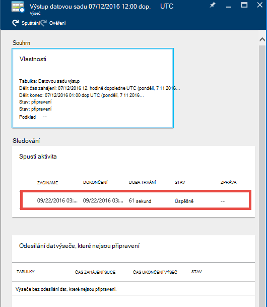

<properties 
    pageTitle="Kurz: Vytváření kanálů s kopírovat aktivitou Azure portálu | Microsoft Azure" 
    description="V tomto kurzu vytvoříte Azure Data Factory kanálu aktivitu kopírovat pomocí editoru Factory dat na portálu Azure." 
    services="data-factory" 
    documentationCenter="" 
    authors="spelluru" 
    manager="jhubbard" 
    editor="monicar"/>

<tags 
    ms.service="data-factory" 
    ms.workload="data-services" 
    ms.tgt_pltfrm="na" 
    ms.devlang="na" 
    ms.topic="get-started-article" 
    ms.date="09/16/2016" 
    ms.author="spelluru"/>

# Kurz: Vytváření kanálů s kopírovat aktivitou Azure portálu
> [AZURE.SELECTOR]
- [Přehled a požadavky](data-factory-copy-data-from-azure-blob-storage-to-sql-database.md)
- [Kopírování Průvodce](data-factory-copy-data-wizard-tutorial.md)
- [Azure portálu](data-factory-copy-activity-tutorial-using-azure-portal.md)
- [Visual Studio](data-factory-copy-activity-tutorial-using-visual-studio.md)
- [Prostředí PowerShell](data-factory-copy-activity-tutorial-using-powershell.md)
- [Azure správce prostředků šablony](data-factory-copy-activity-tutorial-using-azure-resource-manager-template.md)
- [ROZHRANÍ REST API](data-factory-copy-activity-tutorial-using-rest-api.md)
- [ROZHRANÍ API .NET](data-factory-copy-activity-tutorial-using-dotnet-api.md)

Tento kurz se dozvíte, jak vytvářet a sledovat factory Azure dat na portálu Azure. Kanálu v factory dat slouží ke kopírování dat z úložiště objektů Blob Azure k databázi SQL Azure aktivitu na Kopírovat.

Tady je postup, které provádíte jako součást tohoto kurzu:

Krok | Popis
-----| -----------
[Vytvoření Azure Data Factory](#create-data-factory) | V tomto kroku vytvoříte factory Azure dat s názvem **ADFTutorialDataFactory**.  
[Vytvoření propojené služby](#create-linked-services) | V tomto kroku vytvoříte dvě propojené služby: **AzureStorageLinkedService** a **AzureSqlLinkedService**.   Odkazy AzureStorageLinkedService Azure úložiště a AzureSqlLinkedService odkazuje ADFTutorialDataFactory databáze Azure SQL. Zadávání dat pro kanálu je umístěn v kontejneru objektů blob v dat výstupu a úložiště objektů blob Azure se uloží do tabulky v databázi Azure SQL. Proto přidejte tyto dvě datová ukládá jako propojené služby data factory.      
[Vytvoření vstupní a výstupní datové sady](#create-datasets) | V předchozím kroku vytvořeny propojené služby, které odkazují na úložiště dat, které obsahují vstupní a výstupní data. V tomto kroku definujete dvě datové sady – **InputDataset** a **OutputDataset** – představující vstupní a výstupní data uložená v úložišti data.   Pro InputDataset zadáte kontejneru objektů blob obsahující objektů blob se zdrojovými daty a OutputDataset, zadejte tabulka serveru SQL, která jsou uložená data výstupu. Můžete taky určit jiné vlastnosti například strukturu, dostupnost a zásady. 
[Vytvoření kanálu](#create-pipeline) | V tomto kroku vytvoříte příležitosti s názvem **ADFTutorialPipeline** v ADFTutorialDataFactory.   Přidá **Kopírovat aktivitu** kanálu kopií pro zadávání dat z Azure objektů BLOB Azure SQL tabulky výstup. Aktivity kopírovat provede přesun dat v Azure Data Factory. Je technologii globálně dostupná služba, která můžete přesouvat data mezi různých úložiště dat zabezpečené spolehlivý a scalable způsobem. Článek [Aktivity přesun dat](data-factory-data-movement-activities.md) najdete v článku podrobné informace o aktivitě kopírovat. 
[Sledování kanálem k odesílání zpráv](#monitor-pipeline) | V tomto kroku sledovat výseče vstupní a výstupní tabulky pomocí portálu Azure.

## Zjistit předpoklady pro 
Dokončení požadavky uvedené v článku [Přehled](data-factory-copy-data-from-azure-blob-storage-to-sql-database.md) před provedením tohoto kurzu.

## Vytvoření factory dat
V tomto kroku použijete k vytvoření factory Azure dat s názvem **ADFTutorialDataFactory**portálu Azure.

1.  Po přihlášení k [portálu Azure](https://portal.azure.com/), klikněte na **Nový**, vyberte **Intelligence + technologie pro analýzu**a klikněte na **Data Factory**. 

      

6. V **nové factory dat** zásuvné:
    1. Zadejte **název** **ADFTutorialDataFactory** . 
    
        

        Název factory Azure data musí být **jedinečné**. Pokud se zobrazí chybová zpráva, změňte název factory data (například yournameADFTutorialDataFactory) a zkuste znovu vytvořit. Pojmenování pravidla pro Data Factory artefakty naleznete v tématu [Data Factory - pojmenování pravidla](data-factory-naming-rules.md) .
    
            Data factory name “ADFTutorialDataFactory” is not available  
     
        
    2. Vyberte Azure **předplatného**.
    3. Skupina zdrojů proveďte jeden z následujících kroků:
        1. Vyberte možnost **použít existující**a vyberte existující skupiny zdrojů z rozevíracího seznamu. 
        2. Vyberte **vytvořit nový**a zadejte název skupiny zdrojů.   
    
            Několik kroků v tomto kurzu se předpokládá, že používáte název: **ADFTutorialResourceGroup** skupiny prostředků. Další informace o skupinách zdroje najdete v tématu [pomocí zdroje skupin pro správu Azure prostředků](../azure-resource-manager/resource-group-overview.md).  
    4. Vyberte **umístění** pro data factory. V rozevíracím seznamu se zobrazí jenom oblasti podporované službu Data Factory.
    5. Vyberte **Připnout k Startboard**.     
    6. Klikněte na **vytvořit**.

        > [AZURE.IMPORTANT] Pokud chcete vytvořit instance Data Factory, musí být členem role [Přispěvatele Factory dat](../active-directory/role-based-access-built-in-roles.md/#data-factory-contributor) na úrovni skupiny předplatné nebo zdroje.
        >  
        >  Název factory dat může být registrován jako název DNS v budoucnu a tedy viditelná, bude veřejně.              
9.  Zprávy o stavu a zobrazíte kliknutím na ikony zvonku na panelu nástrojů. 

     
10. Po dokončení vytváření zobrazí **Data Factory** zásuvné jak je vidět na obrázku.

    

## Vytvoření propojené služby
Propojené služby propojení úložiště dat nebo výpočet služby Azure dat factory. Najdete v článku [podporované datové ukládá](data-factory-data-movement-activities.md##supported-data-stores-and-formats) pro všechny zdroje a propadů nepodporuje aktivity kopírovat. Najdete v článku [Výpočet propojené služby](data-factory-compute-linked-services.md) pro seznam služby výpočetním podporované Data Factory. V tomto kurzu nepoužíváte jiné výpočetním služby. 

V tomto kroku vytvoříte dvě propojené služby: **AzureStorageLinkedService** a **AzureSqlLinkedService**. AzureStorageLinkedService propojené odkazy služby účet Azure úložiště a AzureSqlLinkedService odkazy na **ADFTutorialDataFactory**databáze Azure SQL. Vytvoření kanálu dál v tomto kurzu, který slouží ke kopírování dat z objektů blob kontejner AzureStorageLinkedService k tabulce SQL v AzureSqlLinkedService.

### Vytvoření propojené služby pro účet Azure úložiště
1.  V zásuvné **Data Factory** , klikněte na **Autor a nasazení** dlaždici a spusťte **Editor** pro data factory.

     
5. V **editoru**klikněte na tlačítko **Nová data uložit** na panelu nástrojů a v rozevírací nabídce vyberte **Azure úložiště** . Měli byste vidět JSON šablony pro vytváření služby Azure úložiště propojené v pravém podokně. 

        
6. Nahrazení `<accountname>` a `<accountkey>` s název účtu a účtu klíčové hodnoty pro váš účet Azure úložiště. 

     
6. Na panelu nástrojů klikněte na **nasazení** . Teď byste měli vidět nasazeném **AzureStorageLinkedService** ve stromovém zobrazení. 

    

> [AZURE.NOTE]
> Další informace o vlastnostech JSON najdete v článku [přesunutí dat z/objektů Blob Azure](data-factory-azure-blob-connector.md#azure-storage-linked-service) .

### Vytvoření propojené služby pro databázi SQL Azure
1. V **Editoru Factory dat**klikněte na tlačítko **Nová data uložit** na panelu nástrojů a v rozevírací nabídce vyberte **Databázi SQL Azure** . Měli byste vidět JSON šablona pro vytváření služby SQL Azure propojené v pravém podokně.
2. Nahrazení `<servername>`, `<databasename>`, `<username>@<servername>`, a `<password>` s názvy Azure SQL serveru, databázi, uživatelský účet, a heslo. 
3. Na panelu nástrojů k vytvoření a nasazení **AzureSqlLinkedService**klikněte na **nasazení** .
4. Potvrďte, že se **AzureSqlLinkedService** ve stromovém zobrazení. 

> [AZURE.NOTE]
> Další informace o vlastnostech JSON najdete v článku [přesunutí dat z/k databázi SQL Azure](data-factory-azure-sql-connector.md#azure-sql-linked-service-properties) .

## Vytvoření datové sady
V předchozím kroku, vytvořeny propojené služeb **AzureStorageLinkedService** a **AzureSqlLinkedService** propojit účet Azure úložiště a databáze Azure SQL factory dat: **ADFTutorialDataFactory**. V tomto kroku definujete dvě datové sady – **InputDataset** a **OutputDataset** – představující vstupní a výstupní data uložená v úložišti dat odkazuje AzureStorageLinkedService a AzureSqlLinkedService. Pro InputDataset zadáte kontejneru objektů blob obsahující objektů blob se zdrojovými daty a OutputDataset, zadejte tabulka serveru SQL, která jsou uložená data výstupu. 

### Vytvoření sady zadávání dat 
V tomto kroku vytvoříte datovou sadu s názvem **InputDataset** odkazující na kontejner objektů blob Azure úložiště představované službu **AzureStorageLinkedService** propojené.

1. V **editoru** Data Factory klikněte na **… Další**, klikněte na **nové sady dat**a v rozevírací nabídce klikněte na **úložiště objektů Blob Azure** . 

    
2. Nahraďte JSON v pravém podokně následující úryvek JSON: 

        {
          "name": "InputDataset",
          "properties": {
            "structure": [
              {
                "name": "FirstName",
                "type": "String"
              },
              {
                "name": "LastName",
                "type": "String"
              }
            ],
            "type": "AzureBlob",
            "linkedServiceName": "AzureStorageLinkedService",
            "typeProperties": {
              "folderPath": "adftutorial/",
              "fileName": "emp.txt",
              "format": {
                "type": "TextFormat",
                "columnDelimiter": ","
              }
            },
            "external": true,
            "availability": {
              "frequency": "Hour",
              "interval": 1
            }
          }
        }
        
     Mějte na paměti následující skutečnosti: 
    
    - datovou sadu **Typ** je nastavený na **AzureBlob**.
    - **linkedServiceName** nastavenou **AzureStorageLinkedService**. Tuto službu propojené jste vytvořili v kroku 2.
    - **cesta_ke_složce** nastavenou kontejneru **adftutorial** . Můžete také zadat název objektů blob ve složce pomocí vlastnosti **název souboru** . Protože nejsou zadáním názvu objektů blob, data ze všech objektů BLOB v kontejneru považovány za vstupní data.  
    - Formát **Typ** je nastavený na **Formát textu**
    - Zobrazí se dvě pole v textovém souboru – **jméno** a **Příjmení** – odděleni znak čárky (**columnDelimiter**) 
    - **Dostupnost** je nastavený na **každou hodinu** (**počet_plateb** je nastavený na **hodiny** a **interval** je nastavena na hodnotu **1**). Proto Data Factory vyhledá zadávání dat každou hodinu v kořenové složce kontejneru objektů blob (**adftutorial**) jste zadali. 
    
    Pokud nezadáte **název souboru** pro **zadávání** datovou sadu, všechny soubory nebo objekty BLOB ve složce vstupní (**cesta_ke_složce**) jsou považovány za zadávání. Pokud zadáte název souboru v ve formátu JSON, jenom určité soubor/objektů blob je považován za asn vstupní.
 
    Pokud nezadáte **název souboru** pro **výstupní tabulky**, soubory v **cesta_ke_složce** jsou uvedeny v v tomto formátu: Data. &lt;Guid\&gt;. TXT (Příklad: Data.0a405f8a-93ff-4c6f-b3be-f69616f1df7a.txt.).

    Pokud chcete nastavit **cesta_ke_složce** a **název souboru** dynamicky na základě **SliceStart** času, použijte vlastnost **partitionedBy** . V následujícím příkladu cesta_ke_složce používá rok, měsíc a den z SliceStart (počáteční čas dané výseč zpracovávání) a název souboru používá hodinu od SliceStart. Například, pokud je adresami vytvořené řez 2016-09-20T08:00:00, název_složky nastavena na wikidatagateway/wikisampledataout/2016/09/20 a název souboru je nastavený na 08.csv. 

            "folderPath": "wikidatagateway/wikisampledataout/{Year}/{Month}/{Day}",
            "fileName": "{Hour}.csv",
            "partitionedBy": 
            [
                { "name": "Year", "value": { "type": "DateTime", "date": "SliceStart", "format": "yyyy" } },
                { "name": "Month", "value": { "type": "DateTime", "date": "SliceStart", "format": "MM" } }, 
                { "name": "Day", "value": { "type": "DateTime", "date": "SliceStart", "format": "dd" } }, 
                { "name": "Hour", "value": { "type": "DateTime", "date": "SliceStart", "format": "hh" } } 
            ],
2. Na panelu nástrojů k vytvoření a nasazení datovou sadu **InputDataset** klikněte na **nasazení** . Potvrďte, že se **InputDataset** ve stromovém zobrazení.

> [AZURE.NOTE]
> Další informace o vlastnostech JSON najdete v článku [přesunutí dat z/objektů Blob Azure](data-factory-azure-blob-connector.md#azure-blob-dataset-type-properties) .

### Vytvoření datovou sadu výstup
V této části kroku vytvoříte výstup datovou sadu s názvem **OutputDataset**. Tento datovou sadu odkazy na tabulky SQL databáze Azure SQL představované **AzureSqlLinkedService**. 

1. V **editoru** Data Factory klikněte na **… Další**, klikněte na **nové sady dat**a v rozevírací nabídce klikněte na **Azure SQL** . 
2. Nahraďte JSON v pravém podokně následující úryvek JSON:

        {
          "name": "OutputDataset",
          "properties": {
            "structure": [
              {
                "name": "FirstName",
                "type": "String"
              },
              {
                "name": "LastName",
                "type": "String"
              }
            ],
            "type": "AzureSqlTable",
            "linkedServiceName": "AzureSqlLinkedService",
            "typeProperties": {
              "tableName": "emp"
            },
            "availability": {
              "frequency": "Hour",
              "interval": 1
            }
          }
        }
        
     Mějte na paměti následující skutečnosti: 
    
    - datovou sadu **Typ** je nastavený na **AzureSQLTable**.
    - **linkedServiceName** nastavenou **AzureSqlLinkedService** (jste vytvořili tuto službu propojené v kroku 2).
    - **název tabulky** je nastavena na **emp**.
    - Existují tři sloupce – **ID**, **jméno**a **Příjmení** – v tabulce emp v databázi. ID je sloupec identity, takže budete muset zadat jenom **jméno** a **Příjmení** tady.
    - **Dostupnost** nastavenou **hodinové** (**frekvence** nastavte na **hodiny** a **interval** nastavený na hodnotu **1**).  Data Factory generuje tato služba řez dat výstupu každou hodinu v tabulce **emp** v databázi Azure SQL.

3. Na panelu nástrojů k vytvoření a nasazení datovou sadu **OutputDataset** klikněte na **nasazení** . Potvrďte, že se **OutputDataset** ve stromovém zobrazení. 

> [AZURE.NOTE]
> Další informace o vlastnostech JSON najdete v článku [přesunutí dat z/k databázi SQL Azure](data-factory-azure-sql-connector.md#azure-sql-linked-service-properties) .

## Vytvoření kanálu
V tomto kroku vytvoříte potrubí s **Kopírovat aktivity** , které se používá **InputDataset** předávat na vstupu a **OutputDataset** jako výstup.

1. V **editoru** Data Factory klikněte na **… Další**a klikněte na **Nový kanál**. Můžete taky kliknete pravým tlačítkem **potrubí** ve stromovém zobrazení a klikněte na **Nový kanál**.
2. Nahraďte JSON v pravém podokně následující úryvek JSON: 
        
        {
          "name": "ADFTutorialPipeline",
          "properties": {
            "description": "Copy data from a blob to Azure SQL table",
            "activities": [
              {
                "name": "CopyFromBlobToSQL",
                "type": "Copy",
                "inputs": [
                  {
                    "name": "InputDataset"
                  }
                ],
                "outputs": [
                  {
                    "name": "OutputDataset"
                  }
                ],
                "typeProperties": {
                  "source": {
                    "type": "BlobSource"
                  },
                  "sink": {
                    "type": "SqlSink",
                    "writeBatchSize": 10000,
                    "writeBatchTimeout": "60:00:00"
                  }
                },
                "Policy": {
                  "concurrency": 1,
                  "executionPriorityOrder": "NewestFirst",
                  "retry": 0,
                  "timeout": "01:00:00"
                }
              }
            ],
            "start": "2016-07-12T00:00:00Z",
            "end": "2016-07-13T00:00:00Z"
          }
        } 

    Mějte na paměti následující skutečnosti:

    - V části aktivity je pouze jeden aktivity, jehož **Typ** je nastavený na **Kopírovat**.
    - Vstupní aktivity je nastavený na **InputDataset** a výstup aktivity je nastavený na **OutputDataset**.
    - V části **typeProperties** **BlobSource** zadaný jako typ zdroje a **SqlSink** není zadán psaní jímky.

    Nahraďte hodnotu vlastnost **zahájení** aktuální den a **end** hodnotu pomocí následujícího dne. Můžete zadat jenom část data a přeskočit časovou část datum čas. Například "2016-02-03", která je ekvivalentní "2016 – 02-03T00:00:00Z"
    
    Obě zahájení a data a času ukončení musí být ve [formátu ISO](http://en.wikipedia.org/wiki/ISO_8601). Příklad: 2016-10 – 14T16:32:41Z. Čas **ukončení** vynechán, ale doporučujeme používat v tomto kurzu. 
    
    Pokud nezadáte hodnoty pro vlastnost **Ukončit** , se vypočítá jako "**zahájení + 48 hodin**". Jako hodnotu pro vlastnost **Ukončit** spustíte kanálu donekonečna udržovat zadejte **9999-09-09** .
    
    V předchozím příkladu je 24 výsečí dat každý výseč pochází každou hodinu.
    
4. Na panelu nástrojů k vytvoření a nasazení **ADFTutorialPipeline**klikněte na **nasazení** . Potvrďte, že se kanálu ve stromovém zobrazení. 
5. Teď zavřete **Editor** zásuvné kliknutím na **X**. Klikněte na **X** znovu zobrazte domovské stránce **Data Factory** pro **ADFTutorialDataFactory**.

**Blahopřejeme!** Úspěšně jste vytvořili Azure dat factory, propojené služeb, tabulky a potrubí a naplánované kanálu.   
 
### Zobrazení factory dat v zobrazení diagramu 
1. V zásuvné **Data Factory** klikněte na **Diagram**.

    
2. Měli byste vidět diagram vidíte na následujícím obrázku: 

    

    Přiblížit, oddálit, můžete změnit velikost na 100 %, Lupa na přizpůsobit automaticky umístěte kanály a tabulek a zobrazit informace o souvisejících zdrojích (zvýrazní směrem nahoru a dolů položek z vybraných položek).  Poklepejte na objekt (vstupní a výstupní tabulky nebo kanálem k odesílání zpráv) můžete zobrazit vlastnosti. 
3. Klikněte pravým tlačítkem myši **ADFTutorialPipeline** v zobrazení diagramu a klikněte na **Otevřít kanálem k odesílání zpráv**. 

    
4. Měli byste vidět aktivity v kanálu spolu s vstupní a výstupní datové sady pro činnosti. V tomto kurzu mají jenom jednu aktivitu v kanálu (Kopírovat aktivitu) s InputDataset jako vstupní datovou sadu a OutputDataset jako výstup datovou sadu.   

    
5. Klikněte na **Data factory** v navigace s popisem cesty v levém horním vrátit k zobrazení diagramu. Zobrazení diagramu zobrazí všechny kanály. V tomto příkladu vytvořili jste pouze jeden kanál.   
 

## Sledování kanálem k odesílání zpráv
V tomto kroku pomocí portálu Azure ke sledování, co se děje v Azure dat factory. 

### Sledování kanálu v zobrazení diagramu

1. Klikněte na **X** zavřete zobrazení **diagramu** zobrazíte Data Factory domovskou stránku data factory. Pokud jste zavřeli webového prohlížeče, postupujte podle těchto kroků: 
    2. Přejděte na [portál Azure](https://portal.azure.com/). 
    2. Poklikejte na **ADFTutorialDataFactory** na **Startboard** (nebo) klikněte na **zdroje dat** v nabídce nalevo a vyhledejte ADFTutorialDataFactory. 
3. Měli byste vidět počet a názvy tabulek a kanálem k odesílání zpráv, který jste vytvořili v tomto zásuvné.

    
4. Teď klikněte na dlaždici **datové sady** .
5. V **datových sad** zásuvné klikněte na **InputDataset**. Tento datovou sadu je vstupní datovou sadu pro **ADFTutorialPipeline**.

       
5. Klikněte na **… (tlačítko se třemi tečkami)** Chcete-li zobrazit všechny výseče data.

      

    Všimněte si **, že všechny výseče dat do aktuální čas připraveni, protože soubor **emp.txt** existuje vždy v kontejneru objektů blob** : **adftutorial\input**. Potvrďte, že žádný výsečí objeví v části **naposledy selhalo výsečí** v dolní.

    Jak **Naposledy aktualizováno výsečí** se neúspěšně **naposledy výsečí** seznamy se seřazenými podle **čas poslední aktualizace**. 
    
    Tlačítko **filtru** na panelu nástrojů filtrovat výseče.  
    
    
6. Zavřete listy se zobrazila zásuvné **datové sady** . Klikněte na tlačítko **OutputDataset**. Tento datovou sadu je datovou sadu výstup pro **ADFTutorialPipeline**.

    
6. Zásuvné **OutputDataset** byste měli vidět, jak je znázorněno na následujícím obrázku:

     
7. Všimněte si, že již byl vytvořen výsečí dat do aktuální čas a jsou **připravené**. Žádné řezy objeví v části **problém výsečí** dole.
8. Klikněte na **... (Tlačítko se třemi tečkami)** Chcete-li zobrazit všechny výseče.

    
9. Klikněte na jakoukoli výseč dat ze seznamu a byste měli vidět zásuvné **Výseč** .

    
  
    Jestliže řez nejsou **připravena** , uvidíte nadřazeného řezy, které nejsou připravená a blokují aktuální řez spuštění v seznamu **, které nejste připravení nadřazeného výsečí** .
11. V zásuvné **VÝSEČ** byste měli vidět, že všechny aktivity běží v seznamu dole. Příkaz **aktivity spustit** zobrazíte zásuvné **aktivity spustit podrobnosti** . 

    
12. Klikněte na **X** zavřete všechny listy, až se dostanete zpátky na výchozí zásuvné pro **ADFTutorialDataFactory**.
14. (volitelné) Klikněte na tlačítko **kanály** na domovskou stránku pro **ADFTutorialDataFactory**klikněte **ADFTutorialPipeline** v zásuvné **kanály** a k podrobnostem vstupních tabulek (**spotřebováno**) nebo výstupní tabulky (**z**).
15. Spuštění **SQL Server Management Studio**, připojení k databázi SQL Azure a ověřte, že řádky jsou vkládány **emp** tabulky v databázi.

    

### Sledování kanálem k odesílání zpráv pomocí sledování a Správa aplikací
Můžete taky použít Monitor a spravovat aplikace pro sledování vaší potrubí. Podrobné informace o použití této aplikace najdete v tématu [sledování a správa Azure Data Factory potrubí pomocí sledování a Správa aplikací](data-factory-monitor-manage-app.md).

1. Klikněte na dlaždici **Monitor a spravovat** na domovské stránce výrobce data.

     
2. Měli byste vidět **Monitor a spravovat aplikace**. Změňte **Počáteční čas** a **koncový čas** zahrnout start (2016 07 12) a koncový čas (2016-07-13) vaší kanálem k odesílání zpráv a klikněte na **použít**. 

     
3. Okno aplikace aktivity vyberte v seznamu **Aktivity Windows** zobrazíte její podrobnosti. 
    

## Souhrn 
V tomto kurzu jste vytvořili factory Azure dat ke kopírování dat z Azure objektů blob k databázi Azure SQL. Portál Azure slouží k vytváření factory dat, propojené služby, datových sad a potrubí. Tady jsou hlavních kroků, které jste provedli v tomto kurzu:  

1.  Vytvoření Azure **data factory**.
2.  Vytvoření **propojené služby**:
    1. Služba **Úložiště Azure** propojené propojit váš účet Azure úložiště obsahující vstupní data.    
    2. Služba **Azure SQL** propojené k propojení databáze Azure SQL, která obsahuje výstupní data. 
3.  Vytvoření **datové sady** , které popisují vstupních dat a výstupní data pro potrubí.
4.  Vytvoření **kanálem k odesílání zpráv** s **Kopírovat aktivity** s **BlobSource** jako zdroj a **SqlSink** jako jímky.  

## Viz taky
| Téma | Popis |
| :---- | :---- |
| [Činnost pohyb dat](data-factory-data-movement-activities.md) | Tento článek obsahuje podrobné informace o aktivity kopie použité v tomto kurzu. |
| [Plánování a provádění](data-factory-scheduling-and-execution.md) | Tento článek vysvětluje plánování a provádění aspekty model aplikace Azure Data Factory. |
| [Potrubí](data-factory-create-pipelines.md) | Tento článek vám pomůže porozumět kanály a aktivity v Azure Data Factory. |
| [Datové sady](data-factory-create-datasets.md) | Tento článek vám pomůže pochopit datové sady v Azure Data Factory.
| [Sledování a správa potrubí pomocí sledování aplikace](data-factory-monitor-manage-app.md) | Tento článek popisuje, jak sledovat, Správa a ladění potrubí pomocí příkazu sledování a Správa aplikací. 

