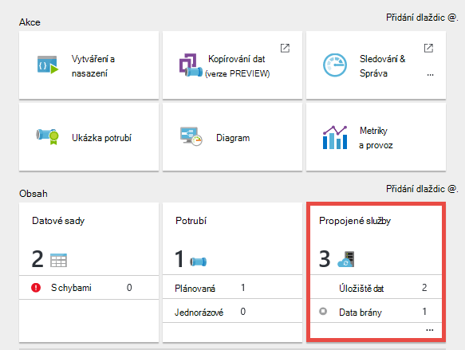

<properties 
    pageTitle="Brána pro správu dat pro Data Factory | Microsoft Azure"
    description="Nastavení brány dat přesun dat mezi místním prostředím a cloudu. Přesunutí dat pomocí Brána pro správu dat v Azure Data Factory." 
    services="data-factory" 
    documentationCenter="" 
    authors="linda33wj" 
    manager="jhubbard" 
    editor="monicar"/>

<tags 
    ms.service="data-factory" 
    ms.workload="data-services" 
    ms.tgt_pltfrm="na" 
    ms.devlang="na" 
    ms.topic="article" 
    ms.date="10/11/2016" 
    ms.author="jingwang"/>

# Brána pro správu dat
Brána pro správu dat je agent klienta, který je třeba nainstalovat v místním prostředí kopírování dat mezi cloudu a místní úložiště dat. Místní úložiště dat nepodporuje Data Factory jsou uvedené v části [podporované zdroje dat](data-factory-data-movement-activities.md##supported-data-stores) . 

> [AZURE.NOTE] Brána v současné době podporuje pouze kopírovat aktivity a uložené procedury aktivity v Data Factory. Není možné použít brány z s vlastní aktivitou přístup ke zdrojům dat místní. 

Tento článek doplňuje návodu v [Přesun dat mezi místním prostředím a cloudové úložiště dat](data-factory-move-data-between-onprem-and-cloud.md) článek. V tomto návodu vytvoříte kanálu, který používá bránu k přesunutí dat z databáze SQL serveru místní objektů blob Azure. Tento článek obsahuje podrobné podrobné informace o Brána pro správu dat.   

## Základní informace

### Funkce brány pro správu dat
Brána pro správu dat nabízí tyto možnosti:

- Model místních zdrojů dat a cloudové zdroje dat v rámci stejná data factory a přesuňte data.
- Máte jedno podokno sklenice pro monitorování a správu s viditelnost do stav brány z zásuvné Data Factory.
- Správa přístupu k místním zdrojům dat bezpečné.
    - Žádné změny muset podnikovou bránu firewall. Brána je pouze odchozí připojení pomocí protokolu HTTP otevřete internet.
    - Šifrování přihlašovacích údajů pro vaší místní úložiště dat pomocí certifikátu.
- Přesunutí dat efektivní – data jsou přenášena souběžně pružné k chybovému sítě problémy s automatickým opakování použití logických operátorů.

### Příkaz a tok dat.
Při použití aktivitu kopírovat přesouvat data mezi místním prostředím a cloudu aktivity používá bránu pro přenos dat z místního zdroje dat do cloudu a naopak.

Zde uceleném dat toků a přehled kroků kopie s brána dat: 

1.  Data vývojářem bránu pro Factory dat Azure pomocí [Azure portál](https://portal.azure.com) nebo [Rutiny prostředí PowerShell](https://msdn.microsoft.com/library/dn820234.aspx). 
2.  Data vývojářem propojené služby pro úložiště dat místní zadáním brány. V rámci nastavení propojené služby vývojář dat používá aplikaci nastavení přihlašovacích údajů k určení typů ověřování a přihlašovací údaje.  Dialogové okno Nastavení přihlašovacích údajů aplikace informuje uživatele o s úložišti dat k testování připojení a bránu ukládání přihlašovacích údajů.
3. Brána šifruje pověření s certifikát přidružený k brány (nastavuje dat Vývojář), před uložením pověření v cloudu.
4. Brána pro plánování a správu pracovních přes kanálu ovládací prvek, který používá sdílených Azure bus frontě informuje uživatele o datové Factory služby. Když kopírovat aktivity projekt musí být vykazuje postavu, Data Factory fronty žádost spolu s přihlašovacími údaji. Brána dojde k vypnutí úlohy po dotazování fronty.
5.  Brána dešifruje přihlašovací údaje pomocí stejný certifikát a připojí se k úložišti místních dat s typem správné ověřování a přihlašovací údaje.
6.  Brány zkopíruje data z místního úložiště cloudového úložiště, nebo naopak v závislosti na konfiguraci kopírovat aktivity v datového kanálu. V tomto kroku bránu přímo informuje uživatele o cloudové úložiště služby jako je třeba úložiště objektů Blob Azure prostřednictvím zabezpečeného kanálu (HTTPS).

### Co zvážit při použití brány
- Jedna instance Brána pro správu dat se dá použít pro více zdrojů dat místní. Však **instanci jedné brány je svázané se pouze jeden factory Azure dat** a nebude možné sdílet s jinou factory data.
- Může mít **jenom jeden výskyt Brána pro správu dat** na jednom počítači nainstalovaný. Předpokládejme, že, máte dvě továrny dat, které se potřebují dostat k místním zdrojům dat, budete potřebovat k instalaci brány na dva místního počítače. Jinými slovy brány je svázané se factory určitá data
- **Brána nemusí být na stejném počítači jako zdroj dat**. Však s brány blíž ke zdroji dat zkracuje dobu bránu pro připojení ke zdroji dat pro. Doporučujeme nainstalovat bránu na počítač, který se liší od té, která hostuje místního zdroje dat. Jakmile brány a zdroje dat na různých počítačích, pro zdroje se zdroji dat není soutěží brány.
- Můžete mít **několik bran na různých počítačích připojení do stejné místní zdroj dat**. Například může mít dvě brány podávání dvě továrny dat ale stejné místního zdroje dat máte zaregistrované v rámci dat závodů.
- Pokud už máte nainstalovaný v počítači podávání scénáři **Power BI** brány, nainstalujte **samostatné bránu pro Azure Data Factory** na jiném počítači.
- Brány musí používat, i když používáte **ExpressRoute**.
- Jiné zdroje dat jako místní zdroj dat (to znamená za bránou firewall) i když použijete **ExpressRoute**. Vytvoření připojení mezi službou a zdroje dat pomocí brány.
- I když je úložiště dat v cloudu na **OM IaaS Azure**, musíte **používat bránu** . 

## Instalace

### Zjistit předpoklady pro
- Podporované **operační systém** verze jsou Windows 7, Windows 8/8.1, Windows 10, Windows Server 2008 R2, Windows Server 2012, Windows Server 2012 R2. Zřízení brány pro správu dat u řadiče domény aktuálně nepodporuje.
- .NET framework 4.5.1 nebo vyšší. Pokud instalujete brány na počítači se systémem Windows 7, nainstalujte .NET Framework 4.5 nebo novější. Další informace najdete v článku [Požadavky na systém pro .NET Framework](https://msdn.microsoft.com/library/8z6watww.aspx) . 
- Doporučená **Konfigurace** na počítači brány je alespoň na úrovni 2 GHz, 4 jádra, 8 GB paměti RAM a 80 GB.
- Pokud spánku na hostitelském počítači brány nebudete reagovat požadavků na data. Před instalací brány proto nakonfigurujte odpovídající **napájecí plán** v počítači. Pokud je počítač nakonfigurován pro počítač, instalace brány vyzve zprávy.
- Musíte být správcem v počítači instalace a konfigurace brány pro správu dat úspěšně. Místní skupiny Windows **Uživatelé Brána pro správu dat** můžete přidat další uživatele. Členové této skupiny můžou konfigurace brány pomocí Správce konfigurace brány pro správu dat nástroje. 

Jako kopii aktivity spustí dojde na konkrétní četnost, používání zdrojů (procesoru, paměti) v počítači také následující stejné s Špička a nedělá časy. Využití prostředků také velkém závisí na tom množství dat, která je přesouvána. Jsou-li více kopií úloh v průběhu, uvidíte přejít o špičce používání zdrojů. 

### Možnosti instalace
Brána pro správu dat je možné nainstalovat následujícími způsoby: 

- Stažením MSI instalační balíček z [Webu služby Stažení softwaru](https://www.microsoft.com/download/details.aspx?id=39717).  Instalační službě MSI lze také upgradu existující Brána pro správu dat na nejnovější verzi, se zachovají všechna nastavení.
- Kliknutím na odkaz **stažení a instalace brána dat** pod RUČNÍ nastavení nebo **přímo do počítače nainstalovat** v části Nastavení EXPRESS. V tématu [přesouvání dat mezi místním prostředím a cloudu](data-factory-move-data-between-onprem-and-cloud.md) článku podrobné pokyny k používání Expresní nastavení. Ruční krok přejdete na web Stažení softwaru.  Pokyny pro stažení a instalace brány z webu služby Stažení softwaru najdete v následující části. 

### Instalace doporučené postupy:
1.  Konfigurace napájecí plán na hostitelském počítači brány tak, aby počítač není počítač. Pokud spánku na hostitelském počítači brány nebudete reagovat požadavků na data.
2.  Obecnějším údajům certifikát přidružený k brány.

### Instalace brány z webu služby Stažení softwaru
1. Přejděte na [stránka Brána pro správu dat Microsoft stahování](https://www.microsoft.com/download/details.aspx?id=39717). 
2. Klikněte na tlačítko **Stáhnout**, vyberte odpovídající verzi (**32bitová verze** nebo **64bitová verze**) a klikněte na tlačítko **Další**. 
3. Spusťte **Instalační službu MSI** přímo nebo uložit na pevném disku a spustit.
4. Na **úvodní** stránce vyberte **jazyk** klikněte na **Další**.
5. **Přijmout** podmínky licenční smlouvy a klikněte na tlačítko **Další**. 
6. Vyberte **složku** , kterou chcete nainstalovat brány a klikněte na tlačítko **Další**. 
7. Na stránce **chtít instalace** klikněte na **instalovat**. 
8. Klikněte na **Dokončit** dokončete instalaci.
9. Pokud potřebujete klíč z portálu Microsoft Azure. Najdete v článku podrobné pokyny v další části. 
10. Na stránce **Správce konfigurace brány pro správu dat** spuštěná ve vašem počítači **zaregistrovat bránu** proveďte následující kroky: 
    1. Vložte klávesu text.
    2. Pokud chcete klikněte na **Zobrazit klíče brány** zobrazíte klíčový text.
    3. Klikněte na **zaregistrovat**. 

### Registraci brány pomocí klávesy

#### Pokud jste ještě nevytvořili logické brány na portálu
Vytvoření brány na portálu a získat klávesu z zásuvné **Konfigurovat** , postupujte podle kroků v návodu v článku [Přesun dat mezi místním prostředím a cloudu](data-factory-move-data-between-onprem-and-cloud.md) .    

#### Pokud jste už vytvořili logické brány na portálu
1. Azure portálu přejděte na zásuvné **Data Factory** a klikněte na dlaždici **Propojené služby** .

    
2. V **Propojených služby** zásuvné vyberte logické **brány** , který jste vytvořili v portálu. 

      
2. V zásuvné **Brána dat** klikněte na **Stáhnout a nainstalovat bránu data**.

       
3. V zásuvné **Konfigurovat** klikněte na **znovu klíče**. Klepněte na tlačítko Ano upozornění po přečtení opatrně.

    
4. Klikněte na tlačítko Kopírovat vedle klávesu. Klíč zkopírována do schránky.
    
     

### Ikony hlavního panelu systému a oznámení
Na tomto obrázku vidíte některé z panelu ikony, které se zobrazí. 

Pokud umístíte ukazatel myši systém panelu ikonu/upozornění, se zobrazí podrobnosti o stavu operace brány a aktualizovat v místní okno.

### Porty a protokoly brány firewall
Existují dva bránách firewall byste měli myslet: **podniková brána firewall** spuštěná v centrální směrovači organizace a **Brána Windows firewall** nakonfigurování jako démon v místním počítači nainstalovanou brány.  

Na úrovni podnikovou bránu firewall třeba konfigurace následující domény a odchozí porty:

| Názvy domén | Porty | Popis |
| ------ | --------- | ------------ |
| *. servicebus.windows.net | 443, 80 | Posluchačů na Relay Service Bus prostřednictvím protokolu TCP (vyžaduje 443 pro pořízení tokenu řízení přístupu) | 
| *. servicebus.windows.net | 9350-9354 5671 | Předávací bus volitelné služby prostřednictvím protokolu TCP | 
| *. core.windows.net | 443 | PROTOKOL HTTPS | 
| *. clouddatahub.net | 443 | PROTOKOL HTTPS | 
| Graph.Windows.NET | 443 | PROTOKOL HTTPS |
| Login.Windows.NET | 443 | PROTOKOL HTTPS | 

Na úrovni brána firewall systému windows jsou tyto porty odchozí obvykle povolené. Pokud ne, můžete nakonfigurovat domény a porty příslušným způsobem počítače brány.

#### Kopírování dat z úložiště zdroje dat do úložiště jímky dat

Zajistěte, aby pravidla brány firewall jsou správně zapnuta podnikovou bránu firewall, brána firewall systému Windows na počítači brány, a data obsahují samotné. Povolení následujícími pravidly umožní bránu připojení k oběma zdroji a dřez úspěšně. Povolte pravidla pro každý úložiště dat, která je součástí operace kopírování.

Například zkopírovat z **dřez úložiště dat místní jímky databáze SQL Azure nebo datový sklad SQL Azure**, proveďte následující kroky: 

- Povolit odchozí komunikaci **TCP** port **1433** brána firewall systému Windows a podniková brána firewall
- Konfigurace nastavení brány firewall Azure SQL serveru k přidání do seznamu povolených IP adres IP adresu počítače brány. 

### Důležité informace o serveru proxy
Pokud prostředí podnikové sítě používá proxy server pro přístup k Internetu, konfigurace brány pro správu dat použít příslušná nastavení proxy serveru. Nastavení proxy serveru ve fázi počáteční registrace. 

Brána používá proxy server připojení ke cloudové služby. Klikněte na odkaz **změnit** během počáteční instalace. Zobrazení dialogového okna **Nastavení proxy** .

Existují tři možnosti konfigurace: 

- **Nepoužívejte proxy**: brány nepoužívá explicitně všechny proxy pro připojení ke cloudovým službám.
- **Použití systému proxy**: brány používá nastavení proxy, který je nakonfigurovaný na diahost.exe.config.  Pokud žádná proxy server nakonfigurovaný v diahost.exe.config, brána připojí ke cloudové službě přímo bez proxy.
- **Použití vlastní proxy**: Konfigurace nastavení pro účely brány místo použití konfigurace v diahost.exe.config proxy pro HTTP.  Adresa a Port jsou potřeba.  Uživatelské jméno a heslo jsou volitelné v závislosti na nastavení ověřování vašeho proxy serveru.  Všechna nastavení jsou zašifrované pomocí přihlašovacích údajů certifikát brány a uložená místně na hostitelském počítači brány.

Služba hostitele brány pro správu dat restartuje automaticky po uložení nastavení aktualizované proxy. 

Po Brány úspěšně registrované, pokud chcete zobrazit nebo aktualizovat nastavení proxy, pomocí Správce konfigurace brány pro správu dat. 

1. Spusťte Správce konfigurace brány pro správu dat.
2. Přejděte na kartu **Nastavení** .
3. Klikněte na odkaz **změnit** v části otevřít dialogové okno **Nastavení Proxy pro HTTP** **Proxy pro HTTP** .  
4. Po kliknutí na tlačítko **Další** se zobrazí dialogové okno upozornění žádostí o oprávnění k uložení nastavení serveru proxy a restartujte hostitelskou službu brány.

Můžete zobrazit a aktualizovat proxy pro HTTP pomocí nástroje Konfigurace správce. 

> [AZURE.NOTE] Pokud jste nastavili proxy server s ověřování NTLM hostitelskou službu brány spuštěna doménovým účtem. Pokud změníte heslo pro účet domény později, nezapomeňte aktualizovat nastavení pro službu a restartujte ji příslušným způsobem. Z důvodu tohoto požadavku měli byste že vyhrazené doménovým účtem umožňuje přístup k proxy serveru, který nevyžaduje často aktualizovat heslo.

### Konfigurace nastavení proxy serveru v diahost.exe.config
Pokud vyberete nastavení pro proxy pro HTTP **proxy použití systému** , brány používá proxy server nastavení v diahost.exe.config.  Je-li žádné proxy v diahost.exe.config, brána připojí ke cloudové službě přímo bez proxy. Následující postup obsahuje pokyny k aktualizaci konfiguračního souboru. 

1.  V Průzkumníku souborů kopii bezpečných C:\Program Files\Microsoft dat správu Gateway\2.0\Shared\diahost.exe.config k obecnějším údajům v původním souboru.
2.  Spuštění Notepad.exe spuštěný jako správce a otevřete soubor text "C:\Program Files\Microsoft dat správu Gateway\2.0\Shared\diahost.exe.config. Vyhledejte danou značku výchozí pro system.net, jak je vidět v následujícím kódu:

            <system.net>
                <defaultProxy useDefaultCredentials="true" />
            </system.net>   

    Můžete pak přidat proxy serveru podrobnosti jak je vidět v následujícím příkladu:

            <system.net>
                  <defaultProxy enabled="true">
                        <proxy bypassonlocal="true" proxyaddress="http://proxy.domain.org:8888/" />
                  </defaultProxy>
            </system.net>

    Doplňující vlastnosti, které mohou být uvnitř značku proxy zadejte požadovaná nastavení jako scriptLocation. Podívejte se do [proxy prvek (nastavení sítě)](https://msdn.microsoft.com/library/sa91de1e.aspx) na syntaxe.

            <proxy autoDetect="true|false|unspecified" bypassonlocal="true|false|unspecified" proxyaddress="uriString" scriptLocation="uriString" usesystemdefault="true|false|unspecified "/>

3. Konfigurační soubor uložte do původního umístění a potom restartujte službu hostitelská brány správy dat, která vyzvedne změny. Pokud chcete znovu spustit službu: pomocí služby aplet v Ovládacích panelech a od **Správce konfigurace brány pro správu dat** > klikněte na tlačítko **Zastavit službu** a potom klikněte na možnost **Spustit službu**. Pokud službu nespustí, je pravděpodobné, že nesprávná syntaxe značky XML je přidán do aplikace konfiguračního souboru, který byl upraven.     

Kromě těchto body bude potřeba zkontrolujte, jestli že je Microsoft Azure v povolených vaší společnosti. Seznam platné Microsoft Azure IP adresy můžete stáhnout z [Webu služby Stažení softwaru](https://www.microsoft.com/download/details.aspx?id=41653).

#### Možné příznaky pro bránu firewall a proxy server záležitostech týkajících se
Pokud narazíte na chyby podobný následující z nich, je pravděpodobné kvůli nesprávná konfigurace brány firewall nebo proxy serveru, která blokuje brány znemožňují připojit se ke Data Factory a dokončit ověření. V nápovědě k předchozí části zajistit brány firewall a jsou správně nakonfigurovat proxy serveru.

1.  Při pokusu o registraci brány se zobrazí následující chyba: "nelze zaregistrovat klíče brány. Před pokusem o znovu zaregistrovat klíče brány, potvrďte, že je brána pro správu dat v připojeném stavu a služba hostitele brány pro správu dat spuštěná."
2.  Při otevření Správce konfigurace vidíte stav jako "Odpojeno" nebo "Připojování." Při prohlížení protokoly událostí Windows, klikněte v části "Prohlížeč událostí" > "Aplikace a služby protokoly" > "Brána pro správu dat", uvidíte chybové zprávy například tato chyba:`Unable to connect to the remote server` 
    `A component of Data Management Gateway has become unresponsive and restarts automatically. Component name: Gateway.`

### Otevřete port 8050 šifrování přihlašovacích údajů 
**Nastavení přihlašovacích údajů** aplikace používá příchozí port **8050** předat pověření brány, když nastavíte místního propojit služby Azure portálu. Během instalace brány ve výchozím nastavení instalace Brána pro správu dat se otevře ho na počítači brány.
 
Pokud používáte bránu firewall třetích stran, můžete ručně otevřete port 8050. Pokud narazíte na problém brány firewall během instalace brány, můžete zkusit pomocí následujícího příkazu nainstalovat bránu bez konfigurace brány firewall.

    msiexec /q /i DataManagementGateway.msi NOFIREWALL=1

Pokud se rozhodnete otevřít port 8050 na počítači brány, použijte mechanismy než v aplikaci, **Nastavení přihlašovacích údajů** ke konfiguraci datový úložiště pověření. Můžete třeba použít rutiny prostředí PowerShell [New-AzureRmDataFactoryEncryptValue](https://msdn.microsoft.com/library/mt603802.aspx) . Najdete v části [Nastavení přihlašovacích údajů a zabezpečení](#set-credentials-and-securityy) na způsob uložení dat přihlašovacích údajů se dá nastavit.

## Aktualizace 
Ve výchozím nastavení je brána pro správu dat automaticky aktualizovat, když na novější verzi brány je k dispozici. Brána není aktualizovat, dokud se dělají naplánovaných úkolů. Žádné další úkoly jsou zpracovány brána až do dokončení operace aktualizace. Když se aktualizace nepovede, brány vrátit zpět starou verzi. 

Čas plánované aktualizace najdete v následujících míst:

- Vlastnosti zásuvné brány na portálu Azure.
- Domovská stránka aplikace Správa Správce konfigurace brány dat
- Systém panelu oznámení. 

Na kartě Domů dat správu brány Správce konfigurace zobrazí plán aktualizace a posledního brány byl nainstalovaný a aktualizovat. 

Můžete nainstalovat aktualizaci hned nebo čekat bránu automaticky aktualizován naplánovaný. Například následující obrázek znázorňuje oznámení zobrazené v Správce konfigurace brány pro spolu s tlačítko Aktualizovat, pomocí kterého se můžete nainstalovat okamžitě. 

Upozornění na hlavním panelu vypadat, jak je znázorněno na následujícím obrázku: 

Zobrazení stavu operace aktualizace (ručního nebo automatické) na hlavním panelu. Při příštím spuštění Správce konfigurace brány pro, zobrazí se zpráva na panelu oznámení, že byl aktualizovaný brány společně s odkazem na to, [Co je nového tématu](data-factory-gateway-release-notes.md).

### Chcete zapnout nebo vypnout funkci Automatické aktualizace
Je můžete vypnout a zapnout funkci Automatické aktualizace provedením následujících kroků: 

1. Spusťte Windows PowerShell počítače brány. 
2. Přejděte do složky C:\Program Files\Microsoft dat správu Gateway\2.0\PowerShellScript.
3. Spustit tento příkaz zapnout automatické aktualizace funkci vypnout (zakázat).   

        .\GatewayAutoUpdateToggle.ps1  -off

4. Chcete-li znovu zapnout: 
    
        .\GatewayAutoUpdateToggle.ps1  -on  

## Správce konfigurace 
Jakmile nainstalujete brány, můžete spustit Správce konfigurace brány pro správu dat v jednom z těchto způsobů: 

- V okně **hledání** zadejte **Brána pro správu dat** pro přístup k tento nástroj. 
- Spusťte spustitelný **ConfigManager.exe** ve složce: **C:\Program Files\Microsoft dat správu Gateway\2.0\Shared** 
 
### Domovská stránka
Domovská stránka umožňuje provádět následující akce: 

- Zobrazit stav brány (připojení ke službě cloud atd.). 
- **Registrace** pomocí klávesy z portálu.
- **Ukončení** a začněte **dat správu brány hostitelskou službu** počítače brány.
- **Plán aktualizace** v daném čase dnů.
- Zobrazte datum brány **poslední aktualizace**. 

### Nastavení stránky
Na stránce nastavení umožňuje provádět následující akce:

- Zobrazení, změny a exportujte **certifikát** brána. Certifikát slouží k šifrování přihlašovacích údajů pro zdroj dat.
- Změna **HTTPS port** koncového bodu. Bránu se otevře port pro nastavení přihlašovacích údajů pro zdroj dat. 
- **Stav** koncový bod
- Zobrazit **certifikát SSL** slouží k SSL komunikaci mezi portálem a brány na nastavit přihlašovací údaje pro zdroje dat.  

### Stránka Diagnostika
Stránka Diagnostika umožňuje provádět následující akce:

- Povolit podrobné **protokolování**, zobrazte protokolů Prohlížeč událostí a odeslat protokoly společnosti Microsoft, pokud došlo k chybě.
- **Test připojení** ke zdroji dat.  

### Stránku nápovědy
Na stránce nápovědy zobrazí následující informace:  

- Stručný popis brány
- Číslo verze
- Odkazy na online nápověda, zásady ochrany osobních údajů a podmínky licenční smlouvy.  

## Řešení potíží

- Najdete podrobné informace do pole brána protokoly do protokoly událostí systému Windows. Je můžete najít pomocí Windows **Prohlížeč událostí** v části **aplikace a služby protokoly** > **Brána pro správu dat**. Při odstraňování problémů brány, vyhledejte úrovně události chyb v případě prohlížeč.
- Pokud brána přestal fungovat po **změně certifikátu**, restartujte **Služba brány pro správu dat** pomocí nástroje pro správce konfigurace brány pro správu dat Microsoft nebo služby ovládací panely. Pokud se stále zobrazí chyba, bude pravděpodobně a udělte tak explicitní oprávnění pro uživatele služby Brána pro správu dat pro přístup k certifikát ve Správci certifikáty (text certmgr.msc).  Výchozí uživatelský účet služby: **NT Service\DIAHostService**. 
- Pokud **Správce přihlašovacích údajů** aplikace nezdaří k **šifrování** přihlašovacích údajů při klepnutí na tlačítko zašifrovat editorem Factory dat, zkontrolujte, že používáte tuto aplikaci na **počítači brány**. Není-li spustit aplikaci na počítači brány a zkuste k šifrování přihlašovacích údajů.  
- Pokud se zobrazí při ukládání připojení nebo chyb souvisejících s ovladač dat, proveďte následující kroky: 
    - Spusťte **Správce konfigurace brány pro správu dat** na počítači brány.
    - Přejděte na kartu **diagnostických nástrojů**
    - Vyberte a zadejte příslušné hodnoty pro pole ve skupině **Testovat připojení ke zdroji dat místní pomocí této brány**
    - Kliknutím na **Testovat připojení** zobrazovala můžete připojit k místnímu zdroji dat na počítači brány, který používá informace o připojení a přihlašovací údaje. Jestliže testovat připojení stále po nainstalování ovladač, restartujte brány se vystopovat poslední změnu.  

    

### Odesílání protokolů brány společnosti Microsoft
Když budete kontaktovat Microsoft Support nápovědu k řešení problémů s brány, můžete být vyzváni ke sdílení protokoly brány. Verze brány umožňuje snadno sdílet požadované brány protokoly prostřednictvím dvěma kliknutími tlačítka ve Správci konfigurace brány.   

1. Přepněte do karta **Diagnostika** Správce konfigurace brány.
 
    
2. Klikněte na **Odeslat protokoly** odkaz zobrazíte dialogové okno následující: 

    
3. (volitelné) Klikněte na tlačítko **Zobrazit protokoly** kontroloval protokolů ve Prohlížeč událostí.
4. (volitelné) Klikněte na tlačítko **ochrany osobních údajů** k prohlížení Microsoft online services zásady ochrany osobních údajů. 
3. Až budete spokojeni s se chystáte odeslat, klikněte na **Odeslat protokoly** skutečně odeslat protokoly z posledních sedmi dnů společnosti Microsoft pro řešení potíží. Měli byste vidět stav operace Odeslat protokoly, jak je znázorněno na následujícím obrázku:

    
4. Po dokončení operace se zobrazí dialogové okno, jak je znázorněno na následujícím obrázku:
    
    
5. Poznamenejte si **ID sestavy** a sdílejte ho s Microsoft Support. ID sestavy slouží k vyhledání brány protokolů, které jste nahráli návody na řešení.  ID sestavy je rovněž uloženo v Prohlížeč událostí jako odkaz.  Můžete najít prohlédnete ID události "25" a zaškrtněte datum a čas.
    
        

### Archiv brány protokoly na hostitelském počítači brány
Existují některé scénáře, kde máte problémy s brány a nejde sdílet bránu protokoly přímo: 

- Ruční instalace brány a zaregistrovat bránu;
- Pokusu o registraci brány se regenerované klíčem na správce konfigurace; 
- Snažíte se odeslat protokoly a nelze ji připojit hostitelskou službu brány;

V takovém případě můžete uložit protokoly brány jako soubor zip a sdílejte, když později kontaktováním podpory společnosti Microsoft. Například pokud dojít k chybě při registraci brány jako vidět následujícím obrázku:   

Kliknutím na odkaz protokoly **archivu brány** archivace a uložit protokoly a potom soubor zip sdílet s podporou společnosti Microsoft. 

### Brána je online s omezenou funkčnost 
Stav brány se zobrazí jako **online s omezenou funkčnost** pro jednu z těchto důvodů.

- Brána nemůže připojit ke cloudové služby prostřednictvím služby bus.
- Cloudová služba se nemůže připojit k bráně prostřednictvím služby bus.

Brána je online s omezenou funkčnost, nebudete moci použití Průvodce kopírováním Factory dat k vytvoření datové kanály ke kopírování dat z místních dat ukládá.

Rozlišení/řešení tohoto problému (online s omezenou funkčnost) je založená na tom, jestli brána nemůže připojit ke cloudové služby, nebo jiným způsobem. Následující části obsahují tato řešení. 

#### Brána nemůže připojit ke cloudové služby prostřednictvím služby bus
Tímto postupem získat brány zpět do stavu online: 

1. Povolte Odchozí porty 9350 9354 obě brány Windows Firewall v počítači brány a podnikovou bránu Firewall. [Porty a protokoly brány firewall](#ports-and-firewall) v části Podrobnosti.
2. Konfigurace nastavení proxy na brány. [Důležité informace o serveru Proxy](#proxy-server-considerations) v části Podrobnosti. 

Jako alternativu v editoru dat Factory v Azure portál (nebo) Visual Studio (nebo) Azure Powershellu.

#### Chyba: Cloudové služby nemůže připojit k bráně prostřednictvím služby bus.
Tímto postupem získat brány zase online:
 
1. Povolte Odchozí porty 5671 a 9350 9354 na obě brány Windows Firewall v počítači brány a podnikovou bránu Firewall. [Porty a protokoly brány firewall](#ports-and-firewall) v části Podrobnosti.
2. Konfigurace nastavení proxy na brány. [Důležité informace o serveru Proxy](#proxy-server-considerations) v části Podrobnosti.
3. Odebrání statické IP omezení na proxy serveru. 

Jako alternativu můžete Editor Factory dat v Azure portál (nebo) Visual Studio (nebo) Azure Powershellu.
 
## Přesunutí brány z počítače
Tato část obsahuje kroky pro přesunutí brána klienta z jednoho počítače do jiného počítače. 

2. Na portálu přejděte na **domovskou stránku Data Factory**a klikněte na dlaždici **Propojené služby** . 

     
3. V části **DATA BRAN** zásuvné **Propojené služby** vyberte bránu.
    
    
4. V zásuvné **Brána dat** klikněte na **Stáhnout a nainstalovat bránu data**.
    
     
5. V zásuvné **Konfigurovat** klikněte na **Stáhnout a nainstalovat brána dat**a postupujte podle pokynů nainstalujte brána dat v počítači. 

    
6. **Správce konfigurace brány pro správu dat Microsoft** nechte otevřené. 
 
     
7. V zásuvné **Konfigurovat** na portálu v řádku nabídek klikněte na **znovu klávesu** a upozornění klikněte na **Ano** . Klikněte na **tlačítko Kopírovat** vedle klíčové text, který slouží ke kopírování klávesu do schránky. Brány na starém počítači přestane fungovat dle brzy znovu klávesu.  
    
    
     
8. **Klíč** vložte do textového pole na stránce **Zaregistrovat bránu** **Správce konfigurace brány pro správu dat** ve vašem počítači. (volitelné) Klikněte na zaškrtávací políčko **Zobrazit klíče brány** zobrazíte klíčový text. 
 
    
9. Klikněte na **zaregistrovat** bránu zaregistrujte se cloudovou službu.
10. Na kartě **Nastavení** klikněte na **změnit** a vyberte stejný certifikát, který byl použit s staré brány, zadejte **heslo**a klikněte na tlačítko **Dokončit**. 
 
    

    Provedením následujících kroků můžete exportovat certifikát z staré brány: Spusťte Správce konfigurace brány pro správu dat na starém počítači, přejděte na kartu **certifikát** , klikněte na tlačítko **Exportovat** a postupujte podle pokynů. 
10. Po úspěšném registraci brány byste měli vidět **Registrace** nastavený na **Registrováno** a **Stav** nastavený na **spuštěno** na domovské stránce Správce konfigurace brány. 

## Šifrování přihlašovacích údajů 
K šifrování přihlašovacích údajů v editoru Factory dat, proveďte následující kroky:

1. Spuštění webovém prohlížeči na **počítači brány**, přejděte na [portál Azure](http://portal.azure.com). Hledání dat factory v případě potřeby factory otevřít dat v zásuvné **DATA FACTORY** a klikněte na **Autor a nasazení** spuštění editoru Factory Data.   
1. Klikněte na existující **odkazované služby** ve stromovém zobrazení v tématu definice JSON nebo vytvořte propojené služby, které si žádá brány pro správu dat (třeba: SQL Server nebo Oracle). 
2. V editoru JSON pro vlastnost **názevbrány** zadejte název brány. 
3. Zadejte název serveru pro vlastnost **Zdroj dat** v **connectionString**.
4. Zadejte název databáze pro vlastnost **Počátečního katalogu** do **connectionString**.    
5. Klikněte na tlačítko **šifrování** na panelu příkazů, která otevře kartu-jednou **Správce přihlašovacích údajů** aplikace. Zobrazí dialogové okno **Nastavení přihlašovacích údajů** . 
    
6. V dialogovém okně **Nastavení přihlašovacích údajů** proveďte následující kroky:  
    1.  Vyberte **ověřování** , který chcete službu Data Factory sloužící k připojení k databázi. 
    2.  Zadejte jméno uživatele, kteří mají přístup k databázi pro nastavení **uživatelské jméno** . 
    3.  Zadejte heslo pro uživatele k nastavení **HESLA** .  
    4.  Klikněte na tlačítko **OK** k šifrování přihlašovacích údajů a zavřete dialogové okno. 
5.  Teď byste měli vidět vlastnost **encryptedCredential** v **connectionString** .      
        
            {
                "name": "SqlServerLinkedService",
                "properties": {
                    "type": "OnPremisesSqlServer",
                    "description": "",
                    "typeProperties": {
                        "connectionString": "data source=myserver;initial catalog=mydatabase;Integrated Security=False;EncryptedCredential=eyJDb25uZWN0aW9uU3R",
                        "gatewayName": "adftutorialgateway"
                    }
                }
            }

Pokud přejdete na portál z počítače, který se liší od počítači brány, musíte, přihlašovací údaje správce aplikace můžete připojit k počítači brány. Pokud aplikace nemají přístup počítači brány, nepovoluje můžete nastavit přihlašovací údaje ke zdroji dat a otestovat připojení ke zdroji dat.  

Při používání aplikace **Pověření nastavení** portálu šifruje přihlašovací údaje pomocí certifikátu podle kartu **certifikát** **Správce konfigurace brány** na počítači brány. 

Pokud hledáte přístupu k založené na rozhraní API pro šifrování přihlašovací údaje, můžete použít rutinu Powershellu [Nový AzureRmDataFactoryEncryptValue](https://msdn.microsoft.com/library/mt603802.aspx) k šifrování přihlašovacích údajů. Rutiny používá certifikát této brány je nakonfigurovaný na používání k šifrování přihlašovacích. Přidejte šifrované přihlašovací údaje do prvku **EncryptedCredential** **connectionString** v ve formátu JSON. Použijte ve formátu JSON s rutinu [New-AzureRmDataFactoryLinkedService](https://msdn.microsoft.com/library/mt603647.aspx) nebo v editoru Factory Data. 

    "connectionString": "Data Source=<servername>;Initial Catalog=<databasename>;Integrated Security=True;EncryptedCredential=<encrypted credential>",

Je další jedním ze způsobů pro nastavení přihlašovací údaje pomocí editoru Factory Data. Pokud vytvoříte služby SQL Server propojené pomocí editoru a zadejte přihlašovací údaje ve formátu prostého textu, pověření šifrování pomocí certifikát, který vlastní službu Data Factory. Nepoužívá certifikát této brány je nakonfigurovaný na použití. Tento postup může být trochu rychlejší v některých případech je ale méně bezpečné. Proto doporučujeme, aby používaly tento přístup pouze pro účely testování/vývoj. 

## Rutiny prostředí PowerShell 
Tato část popisuje jak vytvořit a zaregistrovat bránu pomocí rutin prostředí PowerShell Azure. 

1. Spusťte **Azure Powershellu** v režimu správce. 
2. Přihlaste se k účtu Azure spuštěním následujícího příkazu a zadávání svoje Azure přihlašovací údaje. 

    Přihlášení AzureRmAccount
2. Pomocí rutinu **New-AzureRmDataFactoryGateway** vytvoření brány pro logické následujícím způsobem:

        $MyDMG = New-AzureRmDataFactoryGateway -Name <gatewayName> -DataFactoryName <dataFactoryName> -ResourceGroupName ADF –Description <desc>

    **Příklad příkazu a výstup**:

        PS C:\> $MyDMG = New-AzureRmDataFactoryGateway -Name MyGateway -DataFactoryName $df -ResourceGroupName ADF –Description “gateway for walkthrough”

        Name              : MyGateway
        Description       : gateway for walkthrough
        Version           :
        Status            : NeedRegistration
        VersionStatus     : None
        CreateTime        : 9/28/2014 10:58:22
        RegisterTime      :
        LastConnectTime   :
        ExpiryTime        :
        ProvisioningState : Succeeded
        Key               : ADF#00000000-0000-4fb8-a867-947877aef6cb@fda06d87-f446-43b1-9485-78af26b8bab0@4707262b-dc25-4fe5-881c-c8a7c3c569fe@wu#nfU4aBlq/heRyYFZ2Xt/CD+7i73PEO521Sj2AFOCmiI

    
4. V prostředí PowerShell Azure, přejděte do složky: * *C:\Program Files\Microsoft dat správu Gateway\2.0\PowerShellScript\**. Spuštění * *RegisterGateway.ps1* * přidružené lokální proměnné * *$Key** uvedeno v následující příkaz. Tento skript zaregistruje agenta klient v počítači s logické brány, kterou vytvoříte dříve nainstalována.

        PS C:\> .\RegisterGateway.ps1 $MyDMG.Key
        
        Agent registration is successful!

    Zaregistrovat bránu ve vzdáleném počítači pomocí parametru IsRegisterOnRemoteMachine. Příklad:
        
        .\RegisterGateway.ps1 $MyDMG.Key -IsRegisterOnRemoteMachine true

5. Můžete použít rutinu **Get-AzureRmDataFactoryGateway** zobrazíte seznam bran u výrobce data. Když se zobrazí **Stav** **online**, znamená to, že brána je připraven k použití.

        Get-AzureRmDataFactoryGateway -DataFactoryName <dataFactoryName> -ResourceGroupName ADF

Můžete odebrat brány pomocí rutiny **Odebrat AzureRmDataFactoryGateway** a aktualizujte Popis brány pomocí rutiny **Set-AzureRmDataFactoryGateway** . Syntaxe a další podrobnosti o těchto rutin najdete v tématu Reference pro rutiny Factory Data.  

### Seznam bran pomocí prostředí PowerShell

    Get-AzureRmDataFactoryGateway -DataFactoryName jasoncopyusingstoredprocedure -ResourceGroupName ADF_ResourceGroup

### Odebrání brány pomocí prostředí PowerShell
    
    Remove-AzureRmDataFactoryGateway -Name JasonHDMG_byPSRemote -ResourceGroupName ADF_ResourceGroup -DataFactoryName jasoncopyusingstoredprocedure -Force 

## Další kroky
- V tématu [Přesun dat mezi místním prostředím a cloudové úložiště dat](data-factory-move-data-between-onprem-and-cloud.md) článek. V tomto návodu vytvoříte kanálu, který používá bránu k přesunutí dat z databáze SQL serveru místní objektů blob Azure.  
