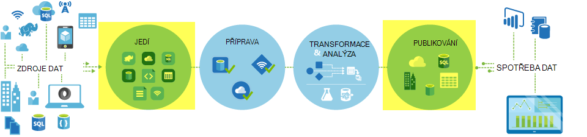
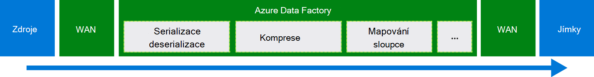
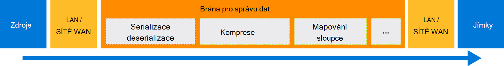

<properties
    pageTitle="Přesunutí dat pomocí kopírování aktivity | Microsoft Azure"
    description="Další informace o přesun dat v Data Factory potrubí: migrace dat mezi cloudové úložiště a mezi místní úložiště a cloudu. Pomocí kopírování aktivity."
    keywords="kopírování dat, přesun dat, migraci dat, přenášet data"
    services="data-factory"
    documentationCenter=""
    authors="linda33wj"
    manager="jhubbard"
    editor="monicar"/>

<tags
    ms.service="data-factory"
    ms.workload="data-services"
    ms.tgt_pltfrm="na"
    ms.devlang="na"
    ms.topic="article"
    ms.date="09/22/2016"
    ms.author="jingwang"/>

# Přesunutí dat pomocí kopírování aktivity

## Základní informace
V Azure Data Factory můžete aktivitu Kopírovat zkopírujte data z různých tvarů z různých místních i cloudových zdroje dat, aby Azure. Po zkopírování dat může být další transformovat a analyzovat. Můžete také kopírovat aktivity publikovat transformace a výsledky analýzy pro business intelligence (BI) a spotřeby aplikace.

Kopírovat aktivity používá technologii zabezpečené, spolehlivé, scalable a [globálně dostupná přihlašovacích údajů](#global). Tento článek obsahuje podrobnosti o přesun dat v Data Factory a kopírovat aktivity.

Nejdřív si ukážeme, jak dojde k migraci dat mezi dvěma cloudové úložiště dat a mezi úložiště místní data a úložiště dat cloudu.

> [AZURE.NOTE] Obecné informace o aktivitách, najdete v článku [Principy kanály a aktivity](data-factory-create-pipelines.md).

### Přesouvat data mezi dvěma cloudové úložiště dat
Jsou-li zdroj a jímky úložiště dat v cloudu, kopírovat aktivitu procházejí následující fázemi jímce zkopírovat data ze zdroje. Služba, která zajišťuje kopírovat aktivity:

1. Načte data z úložiště dat zdroje.
2. Provede serializace/deserializace, komprese/dekomprese, sloupec mapování a převod typu. Provede tyto operace založené na konfigurace vstupní datovou sadu, datovou sadu výstup a kopírovat aktivity.
3.  Data zapisuje data do cílového úložiště.

Služba automaticky vybere optimální oblasti, kterou chcete přesouvat data. Tato oblast je obvykle nejblíže k úložišti jímky.

### Kopírování dat mezi úložiště místní data a cloudové úložiště dat
Bezpečné přesun dat mezi úložiště místní data a cloudové úložiště, nainstalujte Brána pro správu dat ve vašem místním počítači. Brána pro správu dat je agent, který umožňuje hybridní přesun dat a zpracování. Můžete nainstalovat na stejném počítači jako data být uloženy vlastní nebo na samostatném počítač, který má přístup k úložišti.

V tomto scénáři Brána pro správu dat provádí serializace/deserializace, komprese/dekomprese, sloupec mapování a převod typu. Není toku dat pomocí služby Azure Data Factory. Místo toho brána pro správu dat přímo data zapisuje data do cílového úložiště.

V tématu [Přesun dat mezi místním prostředím a cloudové úložiště dat](data-factory-move-data-between-onprem-and-cloud.md) úvod a návodu. Podrobné informace o tomto agent naleznete v tématu [Brána pro správu dat](data-factory-data-management-gateway.md) .

Můžete také posouváním úložiště dat data z/podporováno, jejichž hostiteli jsou Azure IaaS virtuálních počítačích (VMs) pomocí Brána pro správu dat. V tomto případě instalací Brána pro správu dat na stejné OM data obsahují samotné, případně na samostatném OM, který má přístup k úložišti.

## Podporované datové úložiště a formáty
[AZURE.INCLUDE [data-factory-supported-data-stores](../../includes/data-factory-supported-data-stores.md)]

V případě potřeby přesunout dat z datového obsahují, že není kopírovat aktivity podporují, použijte s **vlastní aktivitou** v Data Factory s vlastní logikou kopírování nebo přesunutí dat. Podrobnosti o vytváření a používání s vlastní aktivitou najdete v tématu [Použití vlastní aktivity v Azure Data Factory kanálu](data-factory-use-custom-activities.md).

### Podporované formáty souborů
Můžete kopírovat aktivity ke zkopírování souborů jako-je mezi dvěma dat na základě souboru ukládá, například objektů Blob Azure, systému souborů a HDFS. Postup, můžete přejít na [oddíl format](data-factory-create-datasets.md) definice vstupní a výstupní datovou sadu. Kopírování dat efektivní bez serializace/deserializace.

Kopírovat aktivity taky načte z a zapíše do souborů v zadaném formáty: text, Avro, ORC, Parquet a JSON. Můžete dělat v následujících případech kopírovat, například:

-   Kopírování dat ve formátu textu (CSV) z objektů Blob Azure a zapisovat do databáze SQL Azure.
-   Kopírování souborů ve formátu textu (CSV) v systému souborů místní a zapisovat do objektů Blob Azure v Avro formátu.
-   Zkopírujte data v databázi SQL Azure a zapisovat do HDFS místní v ORC formátu.

## Přesun globálně dostupná dat
Azure Data Factory je k dispozici pouze v oblastí západní USA, východoasijských USA a Severní Europe. Služba, která zajišťuje kopírovat aktivity je však k dispozici globálně v následujících oblastí a zeměpisných. Globálně dostupná topologie zaručuje efektivně dat pohybu, který obvykle zabrání směrování více oblastí. Dostupnost dat Factory a přesun dat v oblasti naleznete v tématu [služby podle oblasti](https://azure.microsoft.com/regions/#services) .

### Přesouvat data mezi cloudové úložiště dat
Jakmile zdroj a jímky úložiště dat v cloudu, používá Data Factory nasazení služeb v oblasti, kde je nejblíž k jímce ve stejném geography přesunout data. Označovat pro mapování některou tabulku následující:

Oblast cílového úložiště | Oblast použitou pro přesun dat
:----------------------------------- | :----------------------------
Východní USA | Východní USA
Východní USA 2 | Východní USA 2
Západ USA | Západ USA
Západ USA 2 | Západ USA
Centrální USA | Centrální USA
Západní centrální USA | Centrální USA
Severní centrální USA | Severní centrální USA
Jižní centrální USA | Jižní centrální USA
Severní Evropě | Severní Evropě
Západní Evropa | Západní Evropa
Jihovýchodní Asie | Jihovýchodní Asie
Východní Asie | Jihovýchodní Asie
Japonsko východ | Japonsko východ
Japonsko západní | Japonsko východ
Brazílie jih | Brazílie jih
Austrálie východ | Austrálie východ
Austrálie jihovýchodní | Austrálie jihovýchodní
Centrální Indie | Centrální Indie
Jižní Indie | Centrální Indie
Západní Indie | Centrální Indie

> [AZURE.NOTE] Nejsou-li oblasti cílového úložiště předchozí, kopírovat aktivity selže přímo – ne přes alternativní oblast.

### Kopírování dat mezi úložiště místní data a cloudové úložiště dat
Pokud data je kopírovaný mezi místním (nebo Azure virtuálních počítačích/IaaS) a cloudové úložiště, [Brána pro správu dat](data-factory-data-management-gateway.md) provede přesun dat na místním počítači nebo virtuálního počítače. Není toku dat pomocí služby v cloudu, pokud používáte funkci [připravené kopírovat](data-factory-copy-activity-performance.md#staged-copy) . V tomto případě dat prochází pracovní úložiště objektů Blob Azure dříve, než je zapsán do jímky úložiště.

## Vytvořte příležitost s aktivitou kopie
Vytvořte příležitost s kopírovat aktivitou několika způsoby:

### Pomocí Průvodce kopírováním
Průvodce datovým Factory kopírovat vám pomůže vytvořit příležitosti s aktivitou kopírovat. Tento kanál umožňuje kopírování dat z podporovaných zdrojů do cíle *bez psaní JSON* definice propojené služby, datových sad a potrubí. Další informace o Průvodci najdete v článku [Průvodce kopírováním Factory Data](data-factory-copy-wizard.md) .  

### Pomocí skriptů JSON
Editor Factory dat v Azure portál, Visual Studio nebo Azure PowerShell slouží k vytvoření JSON definici potrubí (pomocí aktivitu kopírovat). Potom nástroje můžete nasazovat aby vznikla kanálu v Data Factory. V tématu [kurzu: použití kopírovat aktivity v Azure Data Factory kanálu](data-factory-copy-data-from-azure-blob-storage-to-sql-database.md) výukové s podrobným postupem.    

Vlastnosti JSON (jako je název, popis, vstupní a výstupní tabulky a zásady) jsou dostupné pro všechny typy aktivit. Vlastnosti, které jsou k dispozici v `typeProperties` oddíl aktivity lišit s každým aktivity.

Kopírovat aktivity `typeProperties` oddíl se liší v závislosti na typy zdrojů a propadů. Klikněte na zdroj/jímka v části [podporované zdroje a propadů](#supported-data-stores) Další informace o typu vlastnosti, které aktivity kopírovat podporuje pro tento datový úložiště.   

Tady je ukázka JSON definice:

    {
      "name": "ADFTutorialPipeline",
      "properties": {
        "description": "Copy data from Azure blob to Azure SQL table",
        "activities": [
          {
            "name": "CopyFromBlobToSQL",
            "type": "Copy",
            "inputs": [
              {
                "name": "InputBlobTable"
              }
            ],
            "outputs": [
              {
                "name": "OutputSQLTable"
              }
            ],
            "typeProperties": {
              "source": {
                "type": "BlobSource"
              },
              "sink": {
                "type": "SqlSink",
                "writeBatchSize": 10000,
                "writeBatchTimeout": "60:00:00"
              }
            },
            "Policy": {
              "concurrency": 1,
              "executionPriorityOrder": "NewestFirst",
              "retry": 0,
              "timeout": "01:00:00"
            }
          }
        ],
        "start": "2016-07-12T00:00:00Z",
        "end": "2016-07-13T00:00:00Z"
      }
    }

Plánování, která je definovaná v sadě dat výstupu určí, jakým při spuštění aktivity (například: **denně**, počet_plateb jako **den**a interval jako **1**). Aktivity slouží ke kopírování dat z vstupní datovou sadu (**zdroje**) do výstupu sadu (**jímka**).

Můžete zadat víc vstupní datovou sadu aktivitou kopírovat. Slouží k ověření závislosti před spuštěním aktivity. Pouze data z první sadě dat je však zkopírují do cílové datové sadě. Další informace najdete v tématech [plánování a provádění](data-factory-scheduling-and-execution.md).  

## Výkon a optimalizace
Podívejte se na [výkon kopírovat aktivity a ladění Průvodce](data-factory-copy-activity-performance.md), popisující klíčové faktory, které ovlivňují výkon přesun dat (Kopírovat aktivita) v Azure Data Factory. Také seznamy plnění úkolů interní testování a popisuje různé způsoby, jak optimalizovat výkon kopírovat aktivity.

## Plánování a postupné kopii
Podrobné informace o tom, jak funguje plánování a provádění Data Factory v tématech [plánování a provádění](data-factory-scheduling-and-execution.md) . Je možné provádět operace více kopií jeden po druhém způsobem sekvenční/objednali. Naleznete v části [objednali kopírovat](data-factory-scheduling-and-execution.md#ordered-copy) .

## Převody typu
Jiný datový úložiště máte jiný typ nativní systémy. Kopírovat aktivity provádí automatické typu Převod typy zdrojů do jímky typů s následující postup dvoustupňového:

1. Převeďte na typ .NET typy nativní zdrojů.
2. Převod typu .NET na typ nativní jímky.

Mapování systému, který typ nativního k typu .NET pro úložiště dat je v článku svých dat úložiště přihlašovacích údajů. (Klikněte na odkaz v tabulce [podporované úložiště dat](#supported-data-stores) ). Tato mapování vám pomohou zjistit odpovídajících typů při vytváření tabulek, takže kopírovat aktivity provádí správné převody.

## Další kroky
- Další informace o aktivitě, kopírování, najdete v článku [kopírování dat z úložiště objektů Blob Azure k databázi SQL Azure](data-factory-copy-data-from-azure-blob-storage-to-sql-database.md).
- Další informace o přesunutí dat z úložiště místních dat do cloudové úložiště dat, najdete v článku [přesunutí dat z místních do cloudu data uložena](data-factory-move-data-between-onprem-and-cloud.md).
