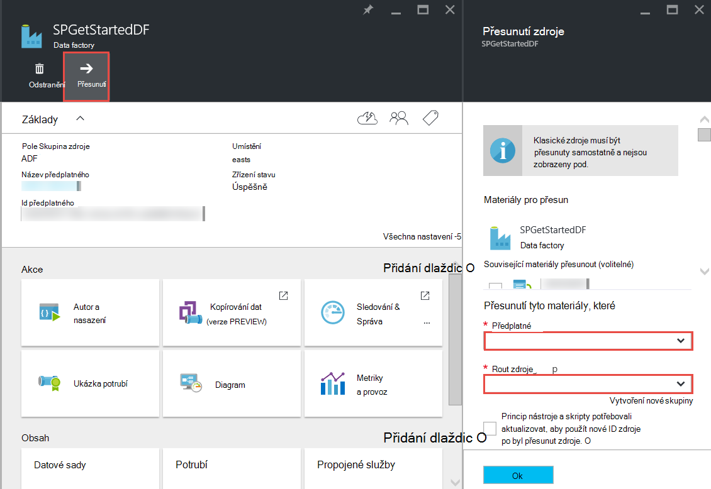

<properties 
    pageTitle="Azure Data Factory – nejčastější dotazy" 
    description="Nejčastější dotazy k Azure Data Factory." 
    services="data-factory" 
    documentationCenter="" 
    authors="sharonlo101" 
    manager="jhubbard" 
    editor="monicar"/>

<tags 
    ms.service="data-factory" 
    ms.workload="data-services" 
    ms.tgt_pltfrm="na" 
    ms.devlang="na" 
    ms.topic="article" 
    ms.date="09/12/2016" 
    ms.author="shlo"/>

# Azure Data Factory – nejčastější dotazy

## Obecné otázky

### Co je Azure Data Factory?

Data Factory je cloudové služby integrace dat, které **automaticky pohybu a transformace dat**. Stejně jako factory, které se spouští vybavení suroviny a transformovat do výrobků orchestrates Data Factory existující služby, které shromáždit neformátovaná data a transformovat do informace připravených k použití. 
 
Data Factory umožňuje vytváření pracovních postupů založených na datech přesun dat mezi místním a cloudové úložiště dat jak proces/transformace dat pomocí výpočetní služeb, jako je Azure HDInsight a jezera analýzy dat Azure. Po vytvoření kanálu, které provede akci, kterou budete potřebovat, můžete naplánovat spustit pravidelně (každou hodinu, denně, týdně atd.).   

Další informace najdete v článku [Přehled & klíčové koncepty](data-factory-introduction.md) . 

### Kde najdu své ceny podrobnosti pro Factory dat Azure?

Stránka [Podrobnosti ceny Factory dat] [ adf-pricing-details] pro podrobnosti o cenách pro Azure Data Factory.  

### Jak můžu začít s Factory dat Azure?

- Přehled Azure Data Factory naleznete v tématu [Úvod do Azure Data Factory](data-factory-introduction.md).
- Návod k **kopírování nebo přesunutí dat** pomocí kopírování aktivity najdete v článku [kopírování dat z úložiště objektů Blob Azure k databázi SQL Azure](data-factory-copy-data-from-azure-blob-storage-to-sql-database.md).
- Návod k **transformaci dat** pomocí HDInsight podregistru aktivity. Zobrazení [dat obrázku spuštěním podregistru skriptu Hadoop clusteru](data-factory-build-your-first-pipeline.md) 
  
### Co je Data Factory oblast dostupnost?
Data Factory je k dispozici v **USA západ** a **Severní Europe**. Pro využití a úložiště služby používá továrny dat může být v ostatních oblastech. Viz [podporované oblastí](data-factory-introduction.md#supported-regions). 
 
### Jaká jsou omezení počtu dat továrny a potrubí/aktivity/datové sady?
 
V části **Limity Factory dat Azure** článku [Azure předplatné a omezení služby, kvót a omezení](../azure-subscription-service-limits.md#data-factory-limits) .

### Jaké jsou možnosti pro vytváření/vývojář službou Azure Data Factory?

Autor/vytvoříte továrny dat pomocí jedné z následujících akcí:

- **Azure portál**  
   listy Factory dat na portálu Azure poskytují bohaté uživatelské rozhraní pro vytvoření služby ad propojené továrny data. **Editor Factory dat**, který je součástí portálu, umožňuje snadno vytvářet odkazované služby, tabulek, sady dat a potrubí zadáním JSON definice pro tyto artefakty. Příklad použití portálu/editoru k vytvoření a nasazení factory dat najdete v článku [vytvořit svůj první dat kanálem k odesílání zpráv Azure portálu](data-factory-build-your-first-pipeline-using-editor.md) .

- **Visual Studio**  
   Visual Studio můžete použít k vytvoření factory Azure data. Podrobnosti najdete v části [vytvořit svůj první dat kanálem k odesílání zpráv pomocí aplikace Visual Studio](data-factory-build-your-first-pipeline-using-vs.md) . 

- **Azure Powershellu**  
   naleznete v tématu [Vytvoření a sledování Factory dat Azure pomocí prostředí PowerShell Azure](data-factory-build-your-first-pipeline-using-powershell.md) kurz/návod k vytváření factory dat pomocí Powershellu. Přečtěte si článek Principy [dat Factory rutina] [ adf-powershell-reference] obsahu v knihovně MSDN pro komplexní dokumentaci rutin Data Factory.
   
- **Knihovna tříd .NET**  
   továrny dat můžete vytvořit programově pomocí Data Factory .NET SDK. Návod k vytváření factory dat pomocí .NET SDK naleznete v tématu [Vytvoření, sledovat a spravovat zdroje dat pomocí .NET SDK](data-factory-create-data-factories-programmatically.md) . Přečtěte si článek Principy [dat Factory třídy knihovny] [ msdn-class-library-reference] komplexní dokumentaci Data Factory .NET SDK.

- **Rozhraní REST API**  
   můžete také rozhraní REST API zveřejněné pro službu Azure Data Factory k vytvoření a nasazení továrny data. Přečtěte si článek Principy [dat Factory REST API] [ msdn-rest-api-reference] komplexní dokumentaci dat Factory REST API.
 
- **Azure šablony správce prostředků** 
   najdete v článku [kurz: vytvoření výrobce první Azure dat pomocí šablony správce prostředků Azure](data-factory-build-your-first-pipeline-using-arm.md) fo podrobnosti. 

### Můžete přejmenovat factory dat?
Ne. Stejně jako další Azure materiály, které nelze změnit název factory Azure data. 

### Můžu přejít factory dat z Azure předplatných na druhý? 
Ano. Jak je vidět v následujícím diagramu nastavíte pomocí tlačítka **Přesunout** na zásuvné factory vaše data. 

### Co jsou výpočetní prostředí nepodporuje Data Factory?
Následující tabulka obsahuje seznam výpočetním prostředí podporované Data Factory a aktivity, které je možné spouštět na ně. 

| Výpočet prostředí | aktivity |
| ------------------- | -------- | 
| [Na vyžádání HDInsight obrázku](data-factory-compute-linked-services.md#azure-hdinsight-on-demand-linked-service) nebo [HDInsight cluster](data-factory-compute-linked-services.md#azure-hdinsight-linked-service) | [DotNet](data-factory-use-custom-activities.md) [podregistru](data-factory-hive-activity.md), [Prasátko](data-factory-pig-activity.md), [MapReduce](data-factory-map-reduce.md), [datových proudů Hadoop](data-factory-hadoop-streaming-activity.md) | 
| [Azure dávku](data-factory-compute-linked-services.md#azure-batch-linked-service) | [DotNet](data-factory-use-custom-activities.md) |  
| [Výukové Azure počítače](data-factory-compute-linked-services.md#azure-machine-learning-linked-service) | [Počítače výuky aktivity: spuštění dávky a aktualizace zdroje](data-factory-azure-ml-batch-execution-activity.md) |
| [Azure dat jezera analýzy](data-factory-compute-linked-services.md#azure-data-lake-analytics-linked-service) | [Jezera analýzy dat U jazyka SQL](data-factory-usql-activity.md)
| [Azure SQL](data-factory-compute-linked-services.md#azure-sql-linked-service) [Azure SQL datový sklad](data-factory-compute-linked-services.md#azure-sql-data-warehouse-linked-service) [SQL serveru](data-factory-compute-linked-services.md#sql-server-linked-service) | [Uložená procedura](data-factory-stored-proc-activity.md)

## Aktivity – nejčastější dotazy
### Jaké jsou různé typy aktivit, které můžete použít v kanálu Data Factory? 

- [Činnost pohyb dat](data-factory-data-movement-activities.md) chcete přesunout data.
- [Činnost transformace dat](data-factory-data-transformation-activities.md) obrázku a transformace dat. 

### Když aktivitu spustit?
Nastavení konfigurace **dostupnosti** v tabulce dat výstupu určuje při spuštění aktivity. Pokud nejsou zadány vstupní datové sady aktivity zkontroluje, zda jsou splněny všechny závislosti zadávání dat **(připravena)** před spuštěním spuštěný. 

## Zkopírujte aktivity – nejčastější dotazy
### To je lepší profilace s více aktivity nebo samostatném kanálem k odesílání zpráv pro každou činnost? 
Potrubí mají sbalení souvisejících činností. Pokud sady dat, která se připojují je nejsou využívané další aktivity mimo kanálu, můžete nechat činnosti v jedné kanálu. Tímto způsobem není potřeba řetězec kanálem k odesílání zpráv aktivní období, aby vzájemně. Při aktualizaci kanálu také lépe zachovají integrity dat v tabulkách interní kanálu. Aktualizace kanálu v podstatě zastaví všechny aktivity v kanálu, odebere a vytvoří znovu. Z vytváření perspektivy, může taky být čitelný toku dat v rámci související aktivity do jednoho souboru JSON profilace.

### Jaké jsou podporované datové ukládá?
[AZURE.INCLUDE [data-factory-supported-data-stores](../../includes/data-factory-supported-data-stores.md)]

### Jaké formáty souborů podporované? 
[AZURE.INCLUDE [data-factory-file-format](../../includes/data-factory-file-format.md)]

### Kde je provedena operace Kopírovat? 
[Přesun globálně dostupná dat](data-factory-data-movement-activities.md#global) v části Podrobnosti. Stručně řečeno když úložiště místní data se jedná o, zkopírování provádí Brána pro správu dat v místním prostředí. A pokud přesun dat mezi dvěma cloudové úložiště, v oblasti nejblíže k jímky umístění ve stejném geography je provedena operace Kopírovat. 

## HDInsight aktivity – nejčastější dotazy

### Jaké oblasti jsou podporovány HDInsight?

Naleznete v části zeměpisná dostupnost v následujícím článku: nebo v [Podrobnostech ceny HDInsight][hdinsight-supported-regions].

### Vyberte oblast používá clusteru HDInsight na vyžádání?

HDInsight obrázku na vyžádání se vytvoří ve stejné oblasti, kde úložiště, které jste zadali pro použití se clusteru existuje.    

### Účty, jak můžete přidružit další úložiště na svůj cluster HDInsight?

Pokud používáte vlastní HDInsight obrázku (BYOC - přenést svůj vlastní obrázku), najdete v těchto tématech: 

- [Pomocí účtů alternativní úložiště a Metastores HDInsight obrázku][hdinsight-alternate-storage]
- [Použití účty další úložiště s podregistru HDInsight][hdinsight-alternate-storage-2]

Pokud používáte na vyžádání clusteru, vytvořený prostřednictvím služby Data Factory, zadejte jména další úložiště pro HDInsight propojen s účtem služby tak, aby služba Data Factory můžete zaregistrovat vaším jménem. V definici JSON pro službu propojený na vyžádání slouží k určení alternativní úložiště účtů uvedeno v následující ukázce JSON **additionalLinkedServiceNames** vlastnosti:
 
    {
        "name": "MyHDInsightOnDemandLinkedService",
        "properties":
        {
            "type": "HDInsightOnDemandLinkedService",
            "typeProperties": {
                "clusterSize": 1,
                "timeToLive": "00:01:00",
                "linkedServiceName": "LinkedService-SampleData",
                "additionalLinkedServiceNames": [ "otherLinkedServiceName1", "otherLinkedServiceName2" ] 
            }
        }
    } 

Ve výše uvedeném příkladu otherLinkedServiceName1 a otherLinkedServiceName2 představují propojené služby jejichž definice obsahují přihlašovací údaje, které HDInsight clusteru je potřeba přístup k účtům alternativní úložiště.

## Výseče – nejčastější dotazy

### Proč se můj vstupní výsečí není připravena?  
Běžné chybě je nastavení **externí** vlastnost na **hodnotu true** vstupní sady dat při zadávání dat je externích dat factory (ne vytvořené pomocí factory dat). 

V následujícím příkladu stačí **externí** na nastavit na hodnotu true **dataset1**.  

**DataFactory1** Kanálem k odesílání zpráv 1: dataset1 -> activity1 -> dataset2 -> activity2 -> kanálem k odesílání zpráv dataset3 2: dataset3 -> activity3 -> dataset4

Pokud máte jiný factory dat s kanálů, což dataset4 (vytvořené pomocí kanálem k odesílání zpráv 2 v dat factory 1), která bude označte dataset4 jako externí datovou sadu, protože datové vytvořené pomocí různých datových factory (DataFactory1, ne DataFactory2).  

**DataFactory2**    
Kanálem k odesílání zpráv 1: dataset4 -> activity4 -> dataset5

Pokud externí vlastnost je správně nastavená, ověřte, zda existuje zadávání dat v oblasti zadané v definici vstupní datovou sadu. 

### Jak spustit řez později než při výseč je adresami vytvořené denně půlnoci?
Vlastnost **Posun** zadat dobu, pro niž jste výseč vyrobit. Podrobnosti o tomto jsou uvedeny v části [dostupnost datovou sadu](data-factory-create-datasets.md#Availability) . Tady je rychlý příklad:

    "availability":
    {
        "frequency": "Day",
        "interval": 1,
        "offset": "06:00:00"
    }

Denní výseče začínají **6 dopoledne** místo výchozí půlnoci.     

### Jak lze znovu spustit řez?
Spusťte řez v jednom z těchto způsobů: 

- Pomocí sledování a Správa aplikací spusťte okno aktivity nebo výsečí. Postupujte podle pokynů uvedených v tématu [znovu spustit vybranou aktivitu windows](data-factory-monitor-manage-app.md#re-run-selected-activity-windows) .   
- Na panelu příkazů na zásuvné **VÝSEČ** pro řez v portálu Azure klikněte na **Spustit** .
- Spusťte rutinu **Set-AzureRmDataFactorySliceStatus** se stavem pro řez nastavena na hodnotu **Čeká se** .   
    
        Set-AzureRmDataFactorySliceStatus -Status Waiting -ResourceGroupName $ResourceGroup -DataFactoryName $df -TableName $table -StartDateTime "02/26/2015 19:00:00" -EndDateTime "02/26/2015 20:00:00" 

V tématu [Nastavení AzureRmDataFactorySliceStatus] [ set-azure-datafactory-slice-status] podrobnosti o rutině. 

### Jak dlouho trvat zpracuje řez?
Pomocí Průzkumníka okno aktivity ve sledování a Správa aplikací vědět, dobu trvání zpracuje řez data. Podrobnosti najdete v části [Aktivity okno Průzkumníka](data-factory-monitor-manage-app.md#activity-window-explorer) . 

Můžete taky udělat v portálu Azure následující kroky:  

1. Klikněte na dlaždici **datové sady** na zásuvné **DATA FACTORY** pro vaše data factory.
2. Klikněte na konkrétní datovou sadu na zásuvné **datové sady** .
3. Vyberte řez, které vás zajímají ze seznamu **posledních výsečí** na zásuvné **tabulky** .
4. Klikněte na spustit ze seznamu **Se spustí aktivitu** na zásuvné **VÝSEČ** aktivity. 
5. Klikněte na dlaždici **Vlastnosti** na zásuvné **Podrobnosti o spuštění AKTIVITĚ** . 
6. Měli byste vidět pole **Doba trvání** s hodnotou. Tato hodnota je doba zpracuje výseč.   

### Jak zabránit spuštění řez?
Pokud potřebujete zastavit kanálu spuštění, můžete použít [Pozastavení AzureRmDataFactoryPipeline](https://msdn.microsoft.com/library/mt603721.aspx) rutiny. V současné době pozastavení kanálu nelze zabránit spuštění výseč, které jsou v průběhu. Po dokončení spuštění v průběhu není extra řezu vybral.

Pokud Opravdu chcete zastavit všechny spuštění okamžitě, jediný způsob, jak bude odstranění kanálu a znovu vytvářet. Pokud se rozhodnete odstranit kanálu, nepotřebujete odstranit tabulky a propojené služby používané kanálem. 

[create-factory-using-dotnet-sdk]: data-factory-create-data-factories-programmatically.md
[msdn-class-library-reference]: https://msdn.microsoft.com/library/dn883654.aspx
[msdn-rest-api-reference]: https://msdn.microsoft.com/library/dn906738.aspx

[adf-powershell-reference]: https://msdn.microsoft.com/library/dn820234.aspx 
[azure-portal]: http://portal.azure.com
[set-azure-datafactory-slice-status]: https://msdn.microsoft.com/library/mt603522.aspx

[adf-pricing-details]: http://go.microsoft.com/fwlink/?LinkId=517777
[hdinsight-supported-regions]: http://azure.microsoft.com/pricing/details/hdinsight/
[hdinsight-alternate-storage]: http://social.technet.microsoft.com/wiki/contents/articles/23256.using-an-hdinsight-cluster-with-alternate-storage-accounts-and-metastores.aspx
[hdinsight-alternate-storage-2]: http://blogs.msdn.com/b/cindygross/archive/2014/05/05/use-additional-storage-accounts-with-hdinsight-hive.aspx
 
