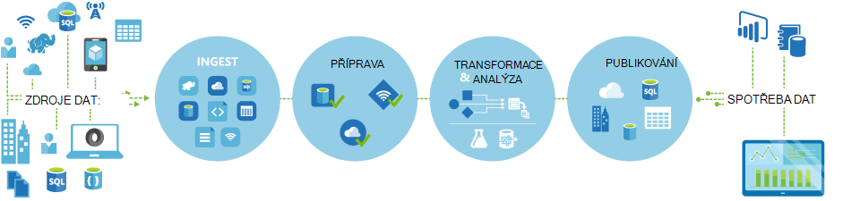
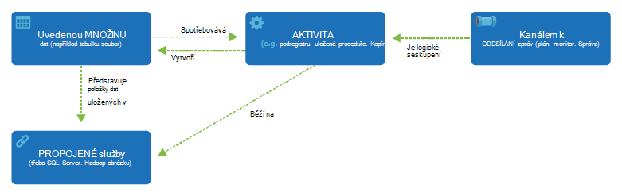

<properties 
    pageTitle="Úvod do Data Factory, datové služby integrace | Microsoft Azure" 
    description="Zjistěte, co je Azure Data Factory: cloudové služby integrace dat, který orchestrates a automaticky pohybu a transformace dat." 
    keywords="integrace dat integrace dat cloudu, co je azure dat factory"
    services="data-factory" 
    documentationCenter="" 
    authors="sharonlo101" 
    manager="jhubbard" 
    editor="monicar"/>

<tags 
    ms.service="data-factory" 
    ms.workload="data-services" 
    ms.tgt_pltfrm="na" 
    ms.devlang="na" 
    ms.topic="get-started-article" 
    ms.date="09/22/2016" 
    ms.author="shlo"/>

# Úvod do služby Factory dat Azure, služby integrace dat v cloudu

## Co je Azure Data Factory? 
Data Factory je služba integrace cloudové data, která orchestrates a automaticky **pohybu** a **transformace** dat. Integrace řešení dat pomocí služby Data Factory, které můžete jedí data z různých úložiště dat, transformace a proces data a publikovat Výsledná data do úložiště dat můžete vytvořit. 

Datové služby Factory umožňuje vytvářet datové kanály, které přesunout a transformace dat a pak spusťte kanály zadaného plánu (hodinové denně, týdně atd.). Poskytuje také propracovaných vizualizacích a po zobrazení souvisejících zdrojích a závislosti mezi datové kanály, sledovat všechny datové kanály z jednoho jednotné zobrazení snadno zjistit problémy a nastavení monitorování upozornění.

**Figure1.** Jedí dat z různých zdrojů dat, Příprava, transformace, analyzovat data a pak publikovat připravené k použití dat pro spotřebu.

## Kanály a aktivity
V řešení Factory dat vytvořit jeden nebo více datové **kanály**. Potrubí je logické seskupení činností. Používají se činnosti skupiny do jednotku, které dohromady provedení úkolu. 

**Aktivity** definovat akce provádět s daty. Například můžete aktivitu Kopírovat ke kopírování dat z jedné datový úložiště na jiný datový úložiště. Podobně můžete aktivitu podregistru, který spustí dotaz podregistru Azure HDInsight clusteru transformace nebo analýza dat. Data Factory podporuje dva typy činností: data pohyb aktivity a aktivity transformace dat. 
  
## Činnost pohyb dat 
[AZURE.INCLUDE [data-factory-supported-data-stores](../../includes/data-factory-supported-data-stores.md)]

Článek [Aktivity přesun dat](data-factory-data-movement-activities.md) najdete v tématu Další informace. 

## Činnost transformace dat
[AZURE.INCLUDE [data-factory-transformation-activities](../../includes/data-factory-transformation-activities.md)]

Článek [Aktivity transformace dat](data-factory-data-transformation-activities.md) najdete v tématu Další informace.

V případě potřeby přesunout ukládání dat z datového, kopírovat aktivity nemá podporují, nebo transformace dat pomocí vlastního logiku, vytvořit **vlastní aktivitou .NET**. Podrobnosti o vytváření a používání s vlastní aktivitou najdete v tématu [Použití vlastní aktivity v Azure Data Factory kanálu](data-factory-use-custom-activities.md).

## Propojené služby
Propojené služby definovat informace potřebné pro připojení k externím zdrojům dat Factory (příklady: úložišti Azure místního serveru SQL Server Azure HDInsight). Propojené služby slouží k dvou souvisejících v Data Factory:

- Znázornit **data obsahují** včetně mimo jiné, místního serveru SQL databáze Oracle souboru sdílet nebo účtu úložiště objektů Blob Azure. Naleznete v části [aktivity přesun dat](data-factory-data-movement-activities.md) seznam podporovaných datový úložiště. 
- Znázornit **Výpočet zdroje** , které můžete hostovat spuštění aktivity. Například aktivity HDInsightHive spustí clusteru HDInsight Hadoop. [Činnost transformace dat](data-factory-data-transformation-activities.md) v části Seznam podporovaných výpočetním prostředí. 

## Datové sady 
Propojené služby propojit úložiště dat Azure dat factory. Datové sady představují datové struktury s v úložišti data. Například služby Azure úložiště propojené obsahuje informace o připojení pro Data Factory pro připojení k úložišti Azure účtu. Datovou sadu objektů Blob Azure určuje objektů blob kontejner a složek v úložišti objektů Blob Azure, ze kterého kanálu by si přečíst data. Podobně služby SQL Azure propojené obsahuje informace o připojení k databázi Azure SQL a sady dat Azure SQL Určuje tabulku, která obsahuje požadovaná data.   

## Vztah mezi Entity Data Factory
Data Factory má několik klíčových entity, které spolupracují definovat vstupní a výstupní data, zpracování události a plán a prostředky potřebné k provedení tok požadovaná data.

**Obrázek 2.** Relace mezi datovou sadu, aktivity, kanálem k odesílání zpráv a propojené služby

Čtyři jednoduché koncepty propojené služeb, datové sady, aktivity a potrubí jste připraveni začít! Můžete [vytvořit svůj první kanálem k odesílání zpráv](data-factory-build-your-first-pipeline.md). 

## Podporovaných oblastí
Zdroje dat můžete vytvořit v současné době v oblastí **Západní USA**, **Východoasijských US**a **Severní Evropy** . Však factory dat můžete zpřístupnit úložiště dat a výpočet služby v ostatních oblastech Azure přesun dat mezi úložiště dat nebo dat obrázku pomocí výpočet služby. 

Azure Data Factory samotné neukládá všechna data. Umožňuje vytvořit založených na datech toků organizovat přesun dat mezi [podporované úložiště dat](data-factory-data-movement-activities.md#supported-data-stores) a zpracování dat pomocí [Výpočet služby](data-factory-compute-linked-services.md) v ostatních oblastech nebo v místním prostředí. Také umožňuje [sledovat a spravovat pracovní postupy](data-factory-monitor-manage-pipelines.md) použitím programové a mechanismy uživatelského rozhraní. 

Přestože Azure Data Factory je k dispozici ve pouze **Západní USA**, **Východoasijských USA**a **Severní Europe** oblastí, služba napájení přesun dat v Data Factory není k dispozici [globálně](data-factory-data-movement-activities.md#global) ve více oblastech. V případě, že úložiště dat je umístěn za bránou firewall pak [Brána pro správu dat](data-factory-move-data-between-onprem-and-cloud.md) nainstalovaných v místním prostředí slouží k přesunutí dat místo. 

Příklad Předpokládejme, že prostředí výpočetním například Azure HDInsight obrázku a Azure počítače výuka běží z oblastí Západ Europe. Můžete vytvořit a používat instance Azure Data Factory v severní Evropy a umožňuje naplánovat úlohy v prostředí výpočetním v západní Evropy. Trvá několik milisekund pro Data Factory aktivovat úlohy v prostředí výpočetním ale času pro spuštění úlohy na výpočetního prostředí se nezmění.

Doporučujeme, aby byla mít Azure Data Factory v každé geography nepodporuje Azure v budoucnu.
  
## Další kroky
Informace o vytvoření zdroje dat s datové kanály, postupujte v těchto kurzech podrobné pokyny. 

Kurz | Popis
-------- | -----------
[Vytváření kanálů dat, což zpracuje dat pomocí Hadoop obrázku](data-factory-build-your-first-pipeline.md) | V tomto kurzu vytvoříte výrobce první Azure dat pomocí datového kanálu tato **data procesy** spuštěním podregistru skriptu clusteru Azure HDInsight (Hadoop). |
[Vytvoření datového kanálu přesun dat mezi dvěma cloudové úložiště dat](data-factory-copy-data-from-azure-blob-storage-to-sql-database.md) | V tomto kurzu vytvoříte factory dat s kanálů, které **slouží k přesunutí dat** z úložiště objektů Blob k SQL databázi.
[Vytvoření datového kanálu přesun dat mezi úložiště místní data a úložiště dat cloudu pomocí Brána pro správu dat](data-factory-move-data-between-onprem-and-cloud.md) | V tomto kurzu vytvoříte factory dat s kanálů, které **slouží k přesunutí dat** z databáze SQL serveru **místní** objektů blob Azure. Jako součást návodu nainstalujte a nakonfigurujte bránu pro správu dat ve vašem počítači. 
