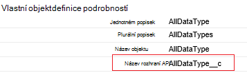
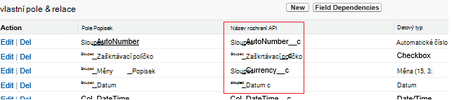

<properties
    pageTitle="Přesunutí dat ze služby Salesforce pomocí Data Factory | Microsoft Azure"
    description="Informace o tom, jak přesunout data ze služby Salesforce pomocí Azure Data Factory."
    services="data-factory"
    documentationCenter=""
    authors="linda33wj"
    manager="jhubbard"
    editor="monicar"/>

<tags
    ms.service="data-factory"
    ms.workload="data-services"
    ms.tgt_pltfrm="na"
    ms.devlang="na"
    ms.topic="article"
    ms.date="10/25/2016"
    ms.author="jingwang"/>

# Přesunutí dat ze služby Salesforce pomocí Azure Data Factory
Tento článek popisuje, jak můžete kopírovat aktivity v Azure dat factory ke kopírování dat ze služby Salesforce do libovolné úložiště dat, která je uvedena ve sloupci jímka v tabulce [podporované zdroje a propadů](data-factory-data-movement-activities.md#supported-data-stores) . Tento článek je založena na článek [aktivity přesun dat](data-factory-data-movement-activities.md) , který zobrazí obecný přehled přesun dat s kopírovat aktivity a podporovaný datový úložiště kombinace.

Azure Data Factory v současné době podporuje pouze přesunutí dat ze služby Salesforce [stores]((data-factory-data-movement-activities.md#supported-data-stores) podporované jímky dat, ale slouží nepodporují přesunutí dat z jiných dat uloží do služby Salesforce.

## Zjistit předpoklady pro
- Je nutné použít jednu z těchto edicích služby Salesforce: vývojář Edition, Professional Edition, Enterprise Edition nebo neomezený Edition.
- Rozhraní API oprávnění musí být povolený. V tématu [jak povolit přístup k rozhraní API v služby Salesforce sadu oprávnění?](https://www.data2crm.com/migration/faqs/enable-api-access-salesforce-permission-set/)
- Ke kopírování dat ze služby Salesforce místní úložiště dat, je musí mít aspoň dat správu brány 2.0 nainstalovaných v místním prostředí.

## Limity žádosti o služby Salesforce
Služby Salesforce má omezení pro celkový počet požadavků rozhraní API a souběžně prováděné žádosti rozhraní API. V části "Rozhraní API požádat o omezení" v článku [Limity vývojář služby Salesforce](http://resources.docs.salesforce.com/200/20/en-us/sfdc/pdf/salesforce_app_limits_cheatsheet.pdf) podrobnosti. Poznámka: Pokud počet souběžně prováděné žádosti překračuje limit, omezení nastane a zobrazí se náhodná selhání; Pokud celkový počet žádostí o překračuje limit, budou blokovány účet služby Salesforce 24 hodin; v obou případech může taky zobrazí chyba "REQUEST_LIMIT_EXCEEDED".

## Kopírování dat Průvodce
Nejjednodušší způsob, jak vytvořit kanál, který slouží ke kopírování dat ze služby Salesforce se ukládají data podporované jímky je pomocí Průvodce kopírovat Data. Najdete v článku [kurz: vytvoření kanálu pomocí Průvodce kopírováním](data-factory-copy-data-wizard-tutorial.md) rychlé informace o vytváření kanálů pomocí Průvodce datovým kopírovat.

Následující příklad uvádí definice JSON vzorku, které slouží k vytvoření potrubí pomocí [Azure portál](data-factory-copy-activity-tutorial-using-azure-portal.md), [Visual Studio](data-factory-copy-activity-tutorial-using-visual-studio.md)nebo [Azure Powershellu](data-factory-copy-activity-tutorial-using-powershell.md). Kopírování dat ze služby Salesforce k úložišti objektů Blob Azure znázorňují. Data můžete však zkopírována do jednotlivých propadů uvedená [tady](data-factory-data-movement-activities.md#supported-data-stores) pomocí kopírování aktivity v Azure Data Factory.   

## Ukázka: Kopírování dat ze služby Salesforce do objektů blob Azure
V tomto příkladu slouží ke kopírování dat ze služby Salesforce k objektů blob Azure každou hodinu. JSON vlastnosti, které se používají v těchto příkladech jsou popsány v části po příklady. Data můžete kopírovat přímo do jednotlivých propadů, které jsou uvedené v článku [aktivity pohyb dat](data-factory-data-movement-activities.md#supported-data-stores) pomocí kopírování aktivity v Azure Data Factory.

Tady jsou artefakty Data Factory, které bude nutné vytvořit implementace scénáře. V částech, které následují za seznamu jsou podrobnosti o tomto postupu.

- Propojené služba typu [služby Salesforce](#salesforce-linked-service-properties)
- Propojené služba typu [AzureStorage](data-factory-azure-blob-connector.md#azure-storage-linked-service-properties)
- Zadávání [datovou sadu](data-factory-create-datasets.md) typu [RelationalTable](#salesforce-dataset-properties)
- Výstup [datovou sadu](data-factory-create-datasets.md) typu [AzureBlob](data-factory-azure-blob-connector.md#azure-blob-dataset-type-properties)
- [Kanálem k odesílání zpráv](data-factory-create-pipelines.md) s kopírovat aktivity na počítači se používá [RelationalSource](#relationalsource-type-properties) a [BlobSink](data-factory-azure-blob-connector.md#azure-blob-copy-activity-type-properties)

**Služby Salesforce propojené**

Tento příklad používá služby **Salesforce** propojené. Naleznete v části vlastnosti, které jsou podporovány propojené služby [Salesforce propojené služby](#salesforce-linked-service-properties) .  Další informace o tom, jak obnovit/get tokenu zabezpečení najdete v článku [získání tokenu zabezpečení](https://help.salesforce.com/apex/HTViewHelpDoc?id=user_security_token.htm) .

    {
        "name": "SalesforceLinkedService",
        "properties":
        {
            "type": "Salesforce",
            "typeProperties":
            {
                "username": "<user name>",
                "password": "<password>",
                "securityToken": "<security token>"
            }
        }
    }

**Služba Azure úložiště propojené**

    {
      "name": "AzureStorageLinkedService",
      "properties": {
        "type": "AzureStorage",
        "typeProperties": {
          "connectionString": "DefaultEndpointsProtocol=https;AccountName=<accountname>;AccountKey=<accountkey>"
        }
      }
    }

**Zadávání datovou sadu služby Salesforce**

    {
        "name": "SalesforceInput",
        "properties": {
            "linkedServiceName": "SalesforceLinkedService",
            "type": "RelationalTable",
            "typeProperties": {
                "tableName": "AllDataType__c"  
            },
            "availability": {
                "frequency": "Hour",
                "interval": 1
            },
            "external": true,
            "policy": {
                "externalData": {
                    "retryInterval": "00:01:00",
                    "retryTimeout": "00:10:00",
                    "maximumRetry": 3
                }
            }
        }
    }

Nastavení **externí** na **hodnotu true** informoval službu Data Factory, že datové externí stránku factory dat a není vytvořené pomocí aktivity v data factory.

> [AZURE.IMPORTANT] "__C" část názvu rozhraní API: není nutná pro vlastní objekt.

**Výstup sadu objektů blob Azure**

Zápisu dat do nových objektů blob každou hodinu (četnost: hodiny, intervalu: 1).

    {
        "name": "AzureBlobOutput",
        "properties":
        {
            "type": "AzureBlob",
            "linkedServiceName": "AzureStorageLinkedService",
            "typeProperties":
            {
                "folderPath": "adfgetstarted/alltypes_c"
            },
            "availability":
            {
                "frequency": "Hour",
                "interval": 1
            }
        }
    }

**Kanálem k odesílání zpráv s aktivitou kopie**

Kanálu obsahuje kopírovat aktivity, který je nakonfigurovaný na použití výše uvedených vstupní a výstupní datové sady, a je naplánováno spuštění každou hodinu. V kanálu JSON definice typ **zdroje** je nastavena na **RelationalSource**a **jímky** typ je nastavený na **BlobSink**.

Seznam vlastností, které jsou podporovány RelationalSource naleznete v tématu [RelationalSource typ vlastnosti](#relationalsource-type-properties) .

    {  
        "name":"SamplePipeline",
        "properties":{  
            "start":"2016-06-01T18:00:00",
            "end":"2016-06-01T19:00:00",
            "description":"pipeline with copy activity",
            "activities":[  
            {
                "name": "SalesforceToAzureBlob",
                "description": "Copy from Salesforce to an Azure blob",
                "type": "Copy",
                "inputs": [
                {
                    "name": "SalesforceInput"
                }
                ],
                "outputs": [
                {
                    "name": "AzureBlobOutput"
                }
                ],
                "typeProperties": {
                    "source": {
                        "type": "RelationalSource",
                        "query": "SELECT Id, Col_AutoNumber__c, Col_Checkbox__c, Col_Currency__c, Col_Date__c, Col_DateTime__c, Col_Email__c, Col_Number__c, Col_Percent__c, Col_Phone__c, Col_Picklist__c, Col_Picklist_MultiSelect__c, Col_Text__c, Col_Text_Area__c, Col_Text_AreaLong__c, Col_Text_AreaRich__c, Col_URL__c, Col_Text_Encrypt__c, Col_Lookup__c FROM AllDataType__c"             
                    },
                    "sink": {
                        "type": "BlobSink"
                    }
                },
                "scheduler": {
                    "frequency": "Hour",
                    "interval": 1
                },
                "policy": {
                    "concurrency": 1,
                    "executionPriorityOrder": "OldestFirst",
                    "retry": 0,
                    "timeout": "01:00:00"
                }
            }
            ]
        }
    }

> [AZURE.IMPORTANT] "__C" část názvu rozhraní API: není nutná pro vlastní objekt.

## Vlastnosti služby Salesforce propojené

Následující tabulka obsahuje popis JSON prvky, které jsou specifické pro službu služby Salesforce propojené.

| Vlastnost | Popis | Povinné |
| -------- | ----------- | -------- |
| Typ | Vlastnost typu musí být nastavena na: **služby Salesforce**. | Ano |
| uživatelské jméno |Zadejte uživatelské jméno pro uživatelský účet. | Ano |
| heslo | Zadejte heslo k uživatelskému účtu.  | Ano |
| securityToken | Určení tokenu zabezpečení pro uživatelský účet. Další informace o tom, jak obnovit/get tokenu zabezpečení najdete v článku [získání tokenu zabezpečení](https://help.salesforce.com/apex/HTViewHelpDoc?id=user_security_token.htm) . Obecné informace o tokenů zabezpečení, najdete v článku [zabezpečení a rozhraní API](https://developer.salesforce.com/docs/atlas.en-us.api.meta/api/sforce_api_concepts_security.htm).  | Ano |

## Vlastnosti datovou sadu služby Salesforce

Úplný seznam oddílů a vlastnosti, které jsou k dispozici pro definování datové sady najdete v článku [Vytvoření datové sady](data-factory-create-datasets.md) . Oddíly například struktura, dostupnost a zásady datovou sadu JSON podobají pro všechny typy sady dat (Azure SQL objektů blob Azure, Azure table a tak dál).

V části **typeProperties** je jiné u jednotlivých typů datovou sadu a poskytuje informace o umístění dat v úložišti. V části typeProperties pro datovou sadu typ **RelationalTable** obsahuje následující vlastnosti:

| Vlastnost | Popis | Povinné |
| -------- | ----------- | -------- |
| Název tabulky | Název tabulky, Salesforce. | Ne (Pokud není zadán **dotazu** nebo **RelationalSource** ) |

> [AZURE.IMPORTANT]  "__C" část názvu rozhraní API: není nutná pro vlastní objekt.

## Vlastnosti RelationalSource typů

Úplný seznam oddílů a vlastnosti, které jsou k dispozici pro definování aktivity najdete v článku [Vytvoření kanály](data-factory-create-pipelines.md) . Vlastnosti, jako je název, popis, vstupní a výstupní tabulek a různých zásady jsou dostupné pro všechny typy činností.

Vlastnosti, které jsou k dispozici v části typeProperties aktivity na druhé straně se liší podle jednotlivé typy aktivit. Kopírovat aktivity budou lišit podle toho, typy zdrojů a propadů.

Kopírovat činnosti typu **RelationalSource** (jejichž součástí služby Salesforce), pokud je zdroj následující vlastnosti jsou k dispozici v části typeProperties:

| Vlastnost | Popis | Povolené hodnoty | Povinné |
| -------- | ----------- | -------------- | -------- |
| dotaz | Vlastní dotaz umožňuje číst data. | Dotaz SQL-92 nebo dotaz [Služby Salesforce objekt Query Language (SOQL)](https://developer.salesforce.com/docs/atlas.en-us.soql_sosl.meta/soql_sosl/sforce_api_calls_soql.htm) . Příklad: `select * from MyTable__c`. | Ne (Pokud není zadán **tabulky** **datovou sadu** ) |

> [AZURE.IMPORTANT] "__C" část názvu rozhraní API: není nutná pro vlastní objekt.

## Tipy pro dotazy

### Načtení dat pomocí where klauzule na sloupec data a času
Když zadat dotaz SOQL nebo SQL, platovou pozornost rozdíl formát data a času. Příklad:

- **Ukázka SOQL**: $$Text.Format ("vyberte Id, název, BillingCity z účtu kde LastModifiedDate > = {0:yyyy-MM-ddTHH:mm:ssZ} a LastModifiedDate < {1:yyyy-MM-ddTHH:mm:ssZ}", WindowStart, WindowEnd)
- **Ukázka SQL**: $$Text.Format (' vyberte * z účtu kde LastModifiedDate > = {{ts\'{0:yyyy-MM-dd hh: mm:}\'}} a LastModifiedDate < {{ts\'{1:yyyy-MM-dd hh: mm:}\'}} ", WindowStart, WindowEnd)".

### Načtení dat ze sestavy služby Salesforce
Načtení dat z zprávy služby Salesforce zadáním dotazu jako `{call "<report name>"}`, například `"query": "{call \"TestReport\"}"`.

### Načtení odstraněných záznamy z koše služby Salesforce
K vytvoření dotazu měkké odstraněné záznamy z koše služby Salesforce, můžete zadat **"IsDeleted = 1"** v dotazu. Například 

- K vytvoření dotazu pouze odstraněné záznamy, zadejte "vybírat *MyTable__c * *kde IsDeleted = 1**"
- K vytvoření dotazu všechny záznamy, včetně stávající odstraněným, zadejte "vybírat *MyTable__c * *kde IsDeleted = 0 nebo IsDeleted = 1**"

[AZURE.INCLUDE [data-factory-structure-for-rectangualr-datasets](../../includes/data-factory-structure-for-rectangualr-datasets.md)]

### Typ mapování služby Salesforce
Typ služby Salesforce | . Na základě čistého typ
--------------- | ---------------
Automatické číslo | Řetězec
Zaškrtávací políčko | Logická hodnota
Měny | Dvojité
Datum | Data a času
Datum a čas | Data a času
E-mailu | Řetězec
ID | Řetězec
Vyhledávání relace | Řetězec
Vícenásobného výběru rozevíracího seznamu | Řetězec
Číslo | Dvojité
V procentech | Dvojité
Telefon | Řetězec
Rozevírací seznam | Řetězec
Text | Řetězec
Textová oblast | Řetězec
Textová oblast (dlouhé) | Řetězec
Textová oblast (Rich) | Řetězec
Text (zašifrovaný) | Řetězec
ADRESA URL | Řetězec

[AZURE.INCLUDE [data-factory-column-mapping](../../includes/data-factory-column-mapping.md)]
[AZURE.INCLUDE [data-factory-structure-for-rectangualr-datasets](../../includes/data-factory-structure-for-rectangualr-datasets.md)]

## Výkon a optimalizace  
Podívejte se na [Kopírovat aktivity výkon a ladění Průvodce](data-factory-copy-activity-performance.md) se naučit používat klíčové faktory, které dopad na výkon přesun dat (Kopírovat aktivita) v Azure Data Factory a různé způsoby, jak optimalizovat ho.
