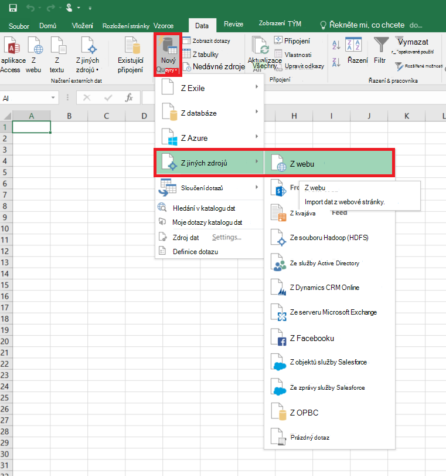
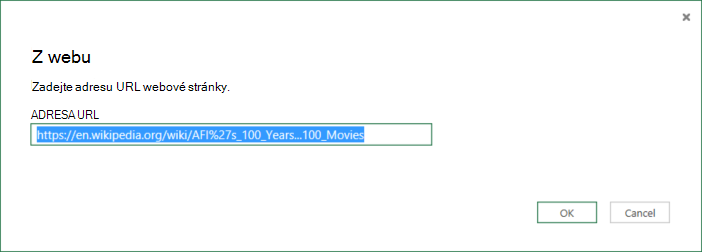
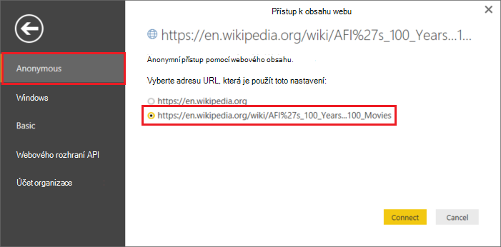
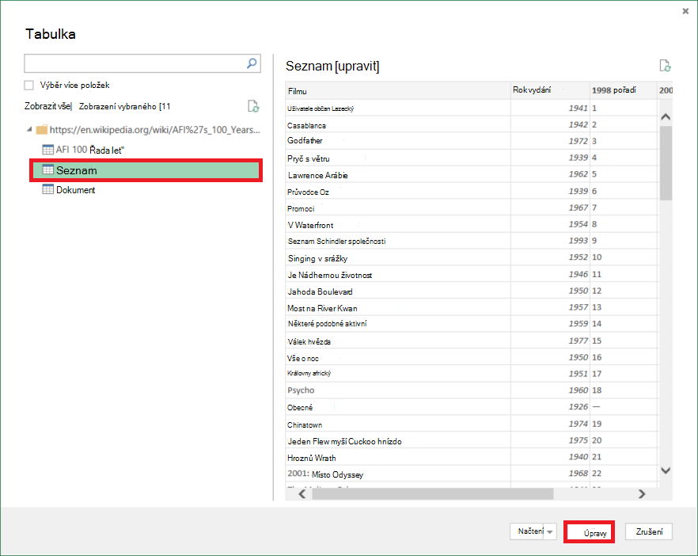
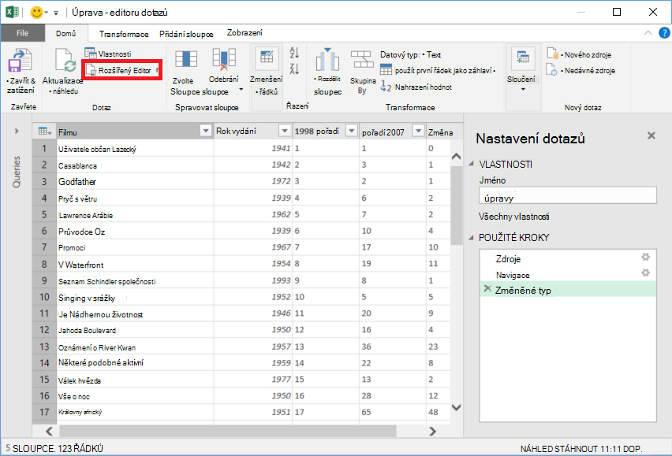
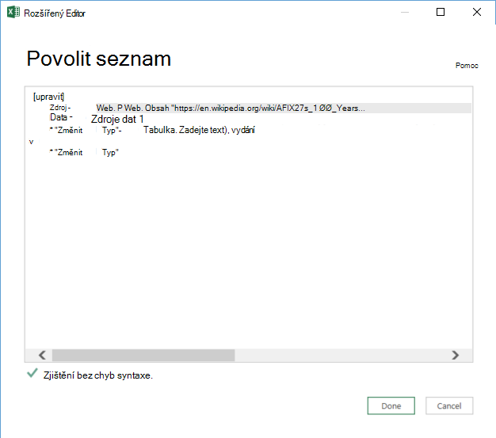

<properties 
    pageTitle="Přesuňte data z webové tabulky | Azure Data Factory" 
    description="Informace o tom, jak přesunout data z místního tabulky na webovou stránku pomocí Azure Data Factory." 
    services="data-factory" 
    documentationCenter="" 
    authors="linda33wj" 
    manager="jhubbard" 
    editor="monicar"/>

<tags 
    ms.service="data-factory" 
    ms.workload="data-services" 
    ms.tgt_pltfrm="na" 
    ms.devlang="na" 
    ms.topic="article" 
    ms.date="09/26/2016" 
    ms.author="jingwang"/>

# Přesunutí dat ze zdroje webové tabulky pomocí Azure Data Factory
Tento článek popisuje, jak můžete kopírovat aktivity v Azure dat factory ke kopírování dat z tabulky na webovou stránku do jiné datový úložiště. Tento článek je založena na článek [aktivity přesun dat](data-factory-data-movement-activities.md) , který uvádí obecné základní informace o přesun dat s kopírovat aktivitu a podporovaný datový úložiště kombinace.

Data factory v současné době podporuje pouze přesunutí dat z webové tabulky do jiné úložiště dat, ale ne přesunutí dat z jiných dat ukládá do cílové tabulky Web.

> [AZURE.NOTE] Tato spojnice Web v současné době podporuje pouze extrahování obsah tabulky na stránku ve formátu HTML.

## Ukázka: Zkopírování dat z webové tabulky objektů Blob Azure

Následující příklad ukazuje:

1.  Propojené služba typu [webu](#web-linked-service-properties).
2.  Propojené služba typu [AzureStorage](data-factory-azure-blob-connector.md#azure-storage-linked-service-properties).
3.  Zadávání [datovou sadu](data-factory-create-datasets.md) typu [WebTable](#WebTable-dataset-properties).
4.  Objekt výstup [datovou sadu](data-factory-create-datasets.md) typu [AzureBlob](data-factory-azure-blob-connector.md#azure-blob-dataset-type-properties).
4.  [Kanálem k odesílání zpráv](data-factory-create-pipelines.md) s kopírovat aktivity na počítači se používá [WebSource](#websource-copy-activity-type-properties) a [BlobSink](data-factory-azure-blob-connector.md#azure-blob-copy-activity-type-properties).

Vzorku slouží ke kopírování dat z webové tabulky do objektů blob Azure každou hodinu. JSON vlastnosti použité v těchto vzorcích jsou popsány v části Sledování vzorky. 

Následující příklad ukazuje, jak chcete zkopírovat data z webové tabulky objektů blob Azure. Data můžete však zkopírována přímo do jednotlivých propadů je uvedeno v článku [Aktivity pohyb dat](data-factory-data-movement-activities.md) pomocí kopírování aktivity v Azure Data Factory. 

**Propojené webové služby** Tento příklad používá propojené webové služby s anonymní přístup. Viz část [webové propojené služby](#web-linked-service-properties) u různých typů ověřování můžete použít. 

    {
        "name": "WebLinkedService",
        "properties":
        {
            "type": "Web",
            "typeProperties":
            {
                "authenticationType": "Anonymous",
                "url" : "https://en.wikipedia.org/wiki/"
            }
        }
    }

**Služba Azure úložiště propojené**

    {
      "name": "AzureStorageLinkedService",
      "properties": {
        "type": "AzureStorage",
        "typeProperties": {
          "connectionString": "DefaultEndpointsProtocol=https;AccountName=<accountname>;AccountKey=<accountkey>"
        }
      }
    }

**Zadávání datovou sadu WebTable** Nastavení **externí** na **hodnotu true** informoval službu Data Factory, že datové externí stránku factory dat a není vytvořené pomocí aktivity v data factory.

> [AZURE.NOTE] [Získání index tabulky na stránku HTML](#get-index-of-a-table-in-an-html-page) v části Postup získání index tabulky na stránku ve formátu HTML.  

    
    {
        "name": "WebTableInput",
        "properties": {
            "type": "WebTable",
            "linkedServiceName": "WebLinkedService",
            "typeProperties": {
                "index": 1,
                "path": "AFI's_100_Years...100_Movies"
            },
            "external": true,
            "availability": {
                "frequency": "Hour",
                "interval":  1
            }
        }
    }

**Výstup datovou sadu objektů Blob Azure**

Zápisu dat do nových objektů blob každou hodinu (četnost: hodiny, intervalu: 1). 

    {
        "name": "AzureBlobOutput",
        "properties":
        {
            "type": "AzureBlob",
            "linkedServiceName": "AzureStorageLinkedService",
            "typeProperties":
            {
                "folderPath": "adfgetstarted/Movies"
            },
            "availability":
            {
                "frequency": "Hour",
                "interval": 1
            }
        }
    }

**Příležitostí s aktivitou kopie**

Kanálu obsahuje aktivitu kopírovat, který je nakonfigurovaný na použití výše uvedených vstupní a výstupní datové sady a je naplánováno spuštění každou hodinu. V kanálu JSON definice typ **zdroje** je nastavena na **WebSource** a **jímky** typ je nastavený na **BlobSink**. 

Seznam vlastností nepodporuje WebSource naleznete v tématu [WebSource typ vlastnosti](#websource-copy-activity-type-properties) . 
    
    {  
        "name":"SamplePipeline",
        "properties":{  
        "start":"2014-06-01T18:00:00",
        "end":"2014-06-01T19:00:00",
        "description":"pipeline with copy activity",
        "activities":[  
          {
            "name": "WebTableToAzureBlob",
            "description": "Copy from a Web table to an Azure blob",
            "type": "Copy",
            "inputs": [
              {
                "name": "WebTableInput"
              }
            ],
            "outputs": [
              {
                "name": "AzureBlobOutput"
              }
            ],
            "typeProperties": {
              "source": {
                "type": "WebSource"
              },
              "sink": {
                "type": "BlobSink"
              }
            },
           "scheduler": {
              "frequency": "Hour",
              "interval": 1
            },
            "policy": {
              "concurrency": 1,
              "executionPriorityOrder": "OldestFirst",
              "retry": 0,
              "timeout": "01:00:00"
            }
          }
          ]
       }
    }

## Vlastnosti webové propojené služby

Následující tabulka obsahuje popis prvků JSON specifické pro webové propojené služby.

| Vlastnost | Popis | Povinné |
| -------- | ----------- | -------- | 
| Typ | Vlastnost typu musí být nastavena na: **Web** | Ano | 
| Adresa URL | Adresa URL k webovému zdroji | Ano |
| authenticationType | Anonymní nebo základní. | Ano |
| uživatelské jméno | Uživatelské jméno pro základní ověřování. | Ano (základní ověřování)
| heslo | Heslo pro základní ověřování. | Ano (základní ověřování)

### Použití anonymní přístup

    {
        "name": "web",
        "properties":
        {
            "type": "Web",
            "typeProperties":
            {
                "authenticationType": "Anonymous",
                "url" : "https://en.wikipedia.org/wiki/"
            }
        }
    }

### Základní ověřování
    
    {
        "name": "web",
        "properties":
        {
            "type": "Web",
            "typeProperties":
            {
                "authenticationType": "basic",
                "url" : "http://myit.mycompany.com/",
                "userName": "Administrator",
                "password": "password"
            }
        }
    }

## WebTable datovou sadu vlastností

Úplný seznam oddíly a vlastnosti jsou k dispozici pro definování datové sady naleznete v článku [Vytvoření datové sady](data-factory-create-datasets.md) . Oddíly například strukturu, dostupnost a zásady datovou sadu JSON podobají pro všechny typy datovou sadu (Azure SQL Azure objektů blob Azure table, atd.).

V části **typeProperties** je jiné u jednotlivých typů datovou sadu a poskytuje informace o umístění dat v úložišti. V části typeProperties pro datovou sadu typ **WebTable** má následující vlastnosti

Vlastnost | Popis | Povinné
:-------- | :----------- | :--------
Typ    | typ datové sady. musí být nastavený na **WebTable** | Ano
Cesta | Relativní adresy URL prostředek, který obsahuje tabulku. | Ne. Pokud není zadán cesty, se používá pouze adresa URL zadaná v definici propojené služby. 
index | Index tabulky ve zdroji. [Získání index tabulky na stránku HTML](#get-index-of-a-table-in-an-html-page) v části Postup získání index tabulky na stránku ve formátu HTML. | Ano

**Příklad:**

    {
        "name": "WebTableInput",
        "properties": {
            "type": "WebTable",
            "linkedServiceName": "WebLinkedService",
            "typeProperties": {
                "index": 1,
                "path": "AFI's_100_Years...100_Movies"
            },
            "external": true,
            "availability": {
                "frequency": "Hour",
                "interval":  1
            }
        }
    }

## WebSource – vlastnosti typ kopírovat činnosti

Úplný seznam oddíly a vlastnosti jsou k dispozici pro definování aktivity naleznete v článku [Vytvoření kanály](data-factory-create-pipelines.md) . Vlastnosti jako je název, popis, vstupní a výstupní tabulky a zásad jsou dostupné pro všechny typy aktivit. 

Vlastnosti dostupné v části typeProperties aktivity na druhou stranu se liší podle jednotlivé typy aktivit. Kopírovat aktivity budou lišit podle toho, typy zdrojů a propadů.

Aktuálně Pokud je zdroj v kopírování aktivitě typu **WebSource**, žádné další vlastnosti jsou podporovány. 

## Získání index tabulky na stránku ve formátu HTML

1. Spusťte **Excel 2016** a přejděte na kartu **Data** .  
2. Na panelu nástrojů klikněte na **Nový dotaz** , přejděte na **Z jiných zdrojů** a klikněte na **Z webu**.
    
     
3. V dialogu **Z webu** zadejte **adresu URL** , kterou použijete v propojených služby JSON (například: https://en.wikipedia.org/wiki/) spolu s cesta je vhodné zadat pro datovou sadu (například: AFI % 27s_100_Years... 100_Movies) a klikněte na **OK**. 

     

    V tomto příkladě použita adresy URL: https://en.wikipedia.org/wiki/AFI%27s_100_Years...100_Movies 
4.  Pokud se zobrazí dialogové okno **aplikace Access webový obsah** , vyberte pravém **adresy URL**, **ověřování**a klikněte na **Připojit**. 

    
5.  Klikněte na **tabulku** položky ve stromovém zobrazení zobrazit obsah z tabulky a pak klikněte na tlačítko **Upravit** dole.  

     

5. V okně **Editoru dotazů** klikněte na tlačítko **Upřesnit** na panelu nástrojů.

    

6. V dialogu rozšířený Editor je číslo uvedené vedle položky "Zdrojový" index.

     

Pokud používáte aplikaci Excel 2013, pomocí [Microsoft Power Query pro Excel](https://www.microsoft.com/download/details.aspx?id=39379) index. Viz článek [připojit na webovou stránku](https://support.office.com/article/Connect-to-a-web-page-Power-Query-b2725d67-c9e8-43e6-a590-c0a175bd64d8) podrobnosti. Kroky jsou podobné, pokud používáte [Microsoft Power BI pro stolní počítače](https://powerbi.microsoft.com/desktop/). 

[AZURE.INCLUDE [data-factory-column-mapping](../../includes/data-factory-column-mapping.md)]

[AZURE.INCLUDE [data-factory-structure-for-rectangualr-datasets](../../includes/data-factory-structure-for-rectangualr-datasets.md)]

## Výkon a optimalizace  
V tématu [kopírování aktivity Performance optimalizace Průvodce](data-factory-copy-activity-performance.md) se naučit používat klíčové faktory, které dopad na výkon přesun dat (Kopírovat aktivita) v Azure Data Factory a různé způsoby, jak optimalizovat jeho.
