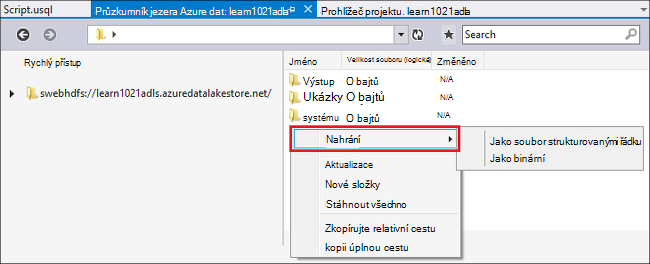
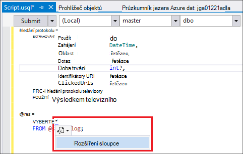
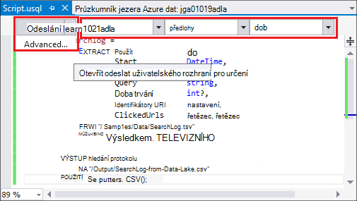
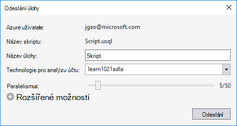
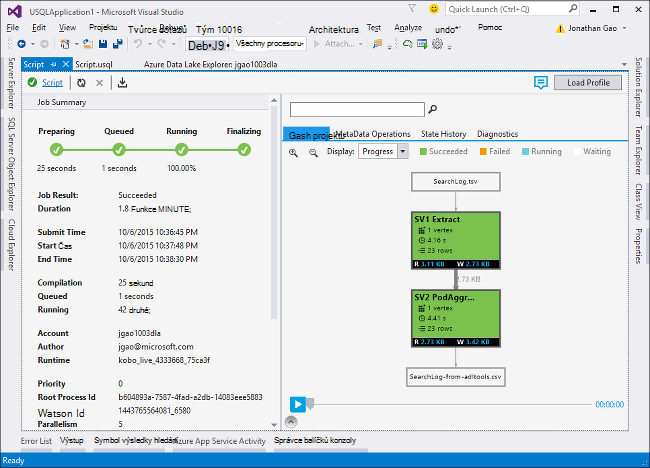
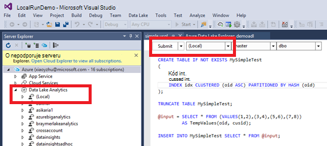
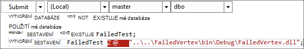

<properties
   pageTitle="Můžete vyvíjet U SQL skriptů pomocí Data jezera Tools for Visual Studio | Azure"
   description="Zjistěte, jak nainstalovat datové jezera nástroje pro Visual Studiu, jak se dají a skripty test U SQL. "
   services="data-lake-analytics"
   documentationCenter=""
   authors="edmacauley"
   manager="jhubbard"
   editor="cgronlun"/>

<tags
   ms.service="data-lake-analytics"
   ms.devlang="na"
   ms.topic="get-started-article"
   ms.tgt_pltfrm="na"
   ms.workload="big-data"
   ms.date="05/16/2016"
   ms.author="edmaca"/>

# Kurz: vývoj U SQL skriptů pomocí Data jezera Tools for Visual Studio

[AZURE.INCLUDE [get-started-selector](../../includes/data-lake-analytics-selector-get-started.md)]

Zjistěte, jak nainstalovat Data jezera Tools for Visual Studio a používat datové nástroje jezera for Visual Studio k psaní a otestujte skripty U SQL.

U SQL je hyper scalable vysoce extensible jazyk pro přípravu, transformace a analýza všechna data jezera dat v. Další informace najdete v článku Principy [U SQL] (http://go.microsoft.com/fwlink/p/?LinkId=691348).

##Zjistit předpoklady pro

- **Visual Studio 2015, Visual Studio 2013 aktualizovat 4 nebo Visual Studio 2012. Pole organizace (Ultimate/Premium), Professional, komunity edice jsou podporovány. Expresní edici nepodporuje. Visual Studio "15" není aktuálně podporován a pracujeme na tomto.**
- **Microsoft Azure SDK pro .NET verze 2.7.1 nebo vyšší**.  Instalace pomocí [webové platformy](http://www.microsoft.com/web/downloads/platform.aspx).
- **[Jezera data Tools for Visual Studio](http://aka.ms/adltoolsvs)**.

    Po instalaci používat datové nástroje jezera for Visual Studio, zobrazí se uzel "Data jezera technologie pro analýzu" v Průzkumníku serveru uzlu "Azure" (Průzkumník serveru můžete otevřete stisknutím kombinace kláves Ctrl + Alt + S).

- **Absolvovat následující dvě části [Začínáme s jezera analýzy dat Azure Azure portálu](data-lake-analytics-get-started-portal.md)**.

    - [Vytvořit účet Azure dat jezera analýzy](data-lake-analytics-get-started-portal.md#create_adl_analytics_account).
    - [Nahrání SearchLog.tsv výchozí účet jezera úložný prostor](data-lake-analytics-get-started-portal.md#update-data-to-the-default-adl-storage-account).

    Pohodlný vzorový skript Powershellu pro vytváření dat jezera analytického služby a nahrávání souboru zdroje dat najdete v [ukázkové Appx-A Powershellu pro přípravu kurzu](data-lake-analytics-data-lake-tools-get-started.md#appx-a-powershell-sample-for-preparing-the-tutorial).

    Datové nástroje jezera nepodporuje vytváření analýzy dat jezera účty. Takže musíte vytvořit pomocí portálu Azure Azure PowerShell a .NET SDK Azure rozhraní příkazového řádku. Spuštění úlohy jezera analýzy dat, musíte se některá data. Přestože datové nástroje jezera podporuje nahrávání data, použijete odešlete vzorová data usnadnit postupujte podle kurzu, na portálu.

## Připojení k Azure

**Připojení k jezera analýzy dat**

1. Otevřete aplikaci Visual Studio.
2. V nabídce **Zobrazit** klikněte na položku **Průzkumník serveru** otevřete Průzkumníka serveru. Nebo stiskněte **[CTRL] + [ALT] + S**.
3. Klikněte pravým tlačítkem **Azure**, klikněte na "Připojení k Microsoft Azure předplatné" a pak postupujte podle pokynů.
4. V systému Windows **Server Explorer**rozbalte **Azure**a potom rozbalte položku **Analýzy dat jezera**. Musí se zobrazí seznam účtů analýzy dat jezera Pokud jsou k dispozici. Nelze vytvořit účty jezera analýzy dat z aplikace Visual Studio. Vytvořit účet, najdete v tématu [Začínáme s jezera analýzy dat Azure Azure portálu](data-lake-analytics-get-started-portal.md) nebo [Začít pracovat s Azure dat jezera technologie pro analýzu pomocí prostředí PowerShell Azure](data-lake-analytics-get-started-powershell.md).

## Nahrání souborů zdrojových dat.

Některá data v části **základní** jste nahráli dříve v tomto kurzu.  

V případě, že chcete použít vlastních datech, tady je postup pro uložení dat z datové nástroje jezera.

**Soubory nahrajete závislá účet jezera dat Azure**

1. V systému Windows **Server Explorer**rozbalte **Azure**, rozbalte položku **Jezera analýzy dat**, rozbalte účtu jezera analýzy dat, rozbalte **Úložiště účty**. Zobrazí se výchozí účet jezera ukládání dat a propojené účty jezera ukládání dat a propojené účty Azure úložiště. Výchozí účet dat jezera má popisek "Výchozí úložiště účet".
2. Klikněte pravým tlačítkem na výchozí účet jezera ukládání dat a potom klikněte na položku **Průzkumník**.  Otevře se datové nástroje jezera pro podokně Visual Studio Průzkumník.  V levé části ukazují stromové zobrazení, že zobrazení obsahu je na pravé straně.
3. Přejděte do složky, ve které chcete odeslat soubory,
4. Klikněte pravým tlačítkem na jakékoli prázdné místo a potom klikněte na **Odeslat**.

    

**Nahrát soubory na propojený klient úložiště objektů Blob Azure**

1. V systému Windows **Server Explorer**rozbalte **Azure**, rozbalte položku **Jezera analýzy dat**, rozbalte účtu jezera analýzy dat, rozbalte **Úložiště účty**. Zobrazí se výchozí účet jezera ukládání dat a propojené účty jezera ukládání dat a propojené účty Azure úložiště.
2. Rozbalte účet Azure úložiště.
3. Klikněte pravým tlačítkem na místo, kam chcete nahrát soubory kontejneru a potom klikněte na položku **Průzkumník**. Pokud nemáte kontejneru, musíte nejprve vytvoříte pomocí portálu Azure, Azure PowerShell nebo další nástroje.
4. Přejděte do složky, ve které chcete odeslat soubory,
5. Klikněte pravým tlačítkem na jakékoli prázdné místo a potom klikněte na **Odeslat**.

## Můžete vyvíjet skripty U SQL

Úlohy jezera analýzy dat jsou napsané v jazyce U SQL. Další informace o U SQL, najdete v článku [Začínáme s jazyka U SQL](data-lake-analytics-u-sql-get-started.md) a funkce pro [odkazy jazyka U SQL](http://go.microsoft.com/fwlink/?LinkId=691348).

**Vytvoření a odeslání úlohy jezera analýzy dat**

1. V nabídce **soubor** klikněte na **Nový**a potom klikněte na **projekt**.
2. Vyberte typ **Projektu U-SQL** .

    

3. Klikněte na **OK**. Visual studio vytvoří řešení se souborem **Script.usql** .
4. Zadejte tento skript do **Script.usql**:

        @searchlog =
            EXTRACT UserId          int,
                    Start           DateTime,
                    Region          string,
                    Query           string,
                    Duration        int?,
                    Urls            string,
                    ClickedUrls     string
            FROM "/Samples/Data/SearchLog.tsv"
            USING Extractors.Tsv();

        @res =
            SELECT *
            FROM @searchlog;        

        OUTPUT @res   
            TO "/Output/SearchLog-from-Data-Lake.csv"
        USING Outputters.Csv();

    Tento skript U SQL přečte souboru zdroje dat pomocí **Extractors.Tsv()**a vytvoří soubor csv pomocí **Outputters.Csv()**.

    Neupravujte dvě cesty, pokud jste zkopírovali zdrojového souboru do jiného umístění.  Jezera analýzy dat vytvoří složku výstupu, pokud ho neexistuje.

    Je jednodušší použít relativní cesty pro soubory uložené ve výchozí data jezera účty. Můžete taky použít absolutní cesty.  Příklad

        adl://<Data LakeStorageAccountName>.azuredatalakestore.net:443/Samples/Data/SearchLog.tsv

    Je nutné použít absolutní cesty pro přístup k souborům v propojené účty úložiště.  Syntaxe pro soubory uložené v propojený klient Azure úložiště je:

        wasb://<BlobContainerName>@<StorageAccountName>.blob.core.windows.net/Samples/Data/SearchLog.tsv

    >[AZURE.NOTE] Azure kontejneru objektů Blob s objekty BLOB veřejné nebo veřejné kontejnery přístupová oprávnění aktuálně nepodporuje.  

    Všimněte si tyto funkce:

    - **Technologie IntelliSense**

        Název automatického dokončení a zobrazí se členy řádků, tříd, databází, schémata a uživatel definované objekty (UDOs).

        Technologie IntelliSense katalogu entit (databáze, schémat, tabulky, UDOs atd.) jsou v relaci k vašemu účtu výpočetním. Zkontrolovat aktuální účet active výpočetním, databáze a schématu na horním panelu nástrojů a přepínat pomocí rozevírací seznamy.

    - **Rozšíření* sloupce**

        Klikněte na pravé straně *, uvidíte modrým podtržením *. Umístění ukazatele myši na modrou vlnovkou a potom klikněte na šipku dolů.
        

        Klikněte na **Rozbalit sloupec**nástroj, nahradí * s názvy sloupců.

    - **Automatický formát**

        Uživatelé můžou změnit odsazení U SQL skriptu na základě kódu strukturu ve skupinovém rámečku Upravit -> Upřesnit:

        - Formátování dokumentu (Ctrl + E, D): Formáty celého dokumentu   
        - Formátovat výběr (Ctrl + K, Ctrl + F): Formátů výběru. Pokud připíše bez výběru formátu zkratka řádek, který je kurzor v.  

        Veškeré formátování pravidla konfigurovat nástroje -> Možnosti -> textový Editor - > SIP -> formát.  
    - **Inteligentní odsazení**

        Datové nástroje jezera for Visual Studio je moct odsazení výrazů automaticky při psaní skriptů. Tato funkce je ve výchozím nastavení zakázaná, uživatelé potřebují povolit prostřednictvím kontrola U-možnosti -> SQL a nastavení -> přepínače -> Povolit inteligentní zvětšit odsazení.

    - **Přejděte na definice a najděte všechny odkazy**

        Pravým tlačítkem myši na název sady řádků/parametr/sloupec/UDO atd a klepnutím na Přejít na definici (F12) umožňuje přejděte na její definice. Kliknutím na Najít všechny odkazy (Shift + F12) zobrazí všechny odkazy.

    - **Vložit Azure cestu**

        Místo pamatovat cesta k souboru Azure a zadejte ručně při psaní skriptů, datové nástroje jezera for Visual Studio poskytuje snadný způsob: pravým tlačítkem myši v editoru, klikněte na Vložit cestu Azure. Přejděte k souboru v dialogovém okně prohlížeče objektů Blob Azure. Klikněte na **OK**. Cesta k souboru se vloží do vašeho kódu.

5. Zadejte účet jezera analýzy dat, databáze a schématu. Můžete vybrat **(místní)** následujícím způsobem místně pro testování účel. Další informace najdete v tématu [Spuštění U SQL místně](#run-u-sql-locally).

    

    Další informace najdete v tématu [použití U-SQL katalogu](data-lake-analytics-use-u-sql-catalog.md).

5. V **Okně Průzkumník**klikněte pravým tlačítkem myši **Script.usql**a potom klikněte na **Vytvořit index**. Zkontrolujte výsledky v podokně výstupu.
6. V **Okně Průzkumník**klikněte pravým tlačítkem **Script.usql**a potom klikněte na **Odeslat index**. Pokud chcete můžete taky kliknout **Odeslat** z podokna Script.usql.  V tématu předchozí snímek.  Klikněte na šipku dolů vedle tlačítka Odeslat odeslání pomocí rozšířené možnosti:
7. Zadejte **Název projektu**, ověření **Účtu technologie pro analýzu**a potom klikněte na **Odeslat**. Odkaz úlohy a odeslání výsledků jsou k dispozici v nástrojích jezera datového Visual Studio výsledky okna po dokončení podávání.

    

8. Musíte kliknutím na tlačítko Aktualizovat v tématu nejnovější stavu úlohy a aktualizace obrazovky. Kdy úlohy úspěchů, zobrazí se **Úlohy grafu** **Operace s daty Meta** **Historii stavu**, **diagnostických nástrojů**:

    

    * Souhrn projektu. Zobrazení souhrnných informací aktuální úlohu, například: stav průběhu, času spuštění, Runtime název, odesílatele atd.   
    * Podrobnosti projektu. Podrobné informace o této úlohy je k dispozici, včetně skript, zdrojů, vrchol spuštění zobrazení.
    * Úlohy graf. Čtyři grafy jsou k dispozici pro znázornění informací projektu: průběh, dat číst, napsali Data, času spuštění, průměr čas spuštění na uzel, vstupní výkon, výstup výkon.
    * Operace metadata. Zobrazí všechny operace metadata.
    * Stav historie.
    * Diagnostika. Datové nástroje jezera for Visual Studio bude automaticky Diagnostika spuštění úlohy. Pokud existují některé chyby nebo problémy s výkonem ve své práce, dostanou upozornění. V tématu Job diagnostiky (odkaz TBD) část Další informace.

**Kontrola stavu úlohy**

1. Z Průzkumníka Server rozbalte položku **Azure**, rozbalte **Jezera analýzy dat**, rozbalte název účtu jezera analýzy dat
2. Poklikejte na **úloh** seznam úloh.
2. Klikněte na zobrazení stavu úlohy.

**Chcete-li zobrazit výstup projektu**

1. V systému Windows **Server Explorer**rozbalte **Azure**, rozbalte **Jezera analýzy dat**, rozbalte účtu jezera analýzy dat, rozbalte **Úložiště účtů**, klikněte pravým tlačítkem na výchozí účet jezera ukládání dat a klepněte na položku **Průzkumník**.
2.  Poklikejte na **výstup** otevřít složku
3.  Poklikejte na **SearchLog z adltools.csv**.

###Přehrávání projektu

Přehrávání úlohy umožňuje sledovat průběh provádění úloh a vizuálně zjistit výkonu odchylky a problémových míst. Tuto funkci lze před dokončením úlohy spuštění (tedy v době spuštěné projektu je aktivně) i po spuštění. Probíhá přehrávání během provádění úlohy vám umožní uživatelům přehrávání průběh až aktuální čas.

**Chcete-li zobrazit průběh provádění úloh**  

1. V pravém horním rohu klikněte na **Načíst profil** . V tématu na předchozí obrazovku snímek.
2. Klikněte na tlačítko Přehrát v levém dolním kontroloval průběhu provádění úloh.
3. Během přehrávání klikněte na **Pozastavit** ho zastavit nebo přímo přetáhněte pruh průběhu na určité místo.

###Tepelná mapa

Datové nástroje jezera for Visual Studio obsahuje uživatelsky nastavitelný barvy překrytí zobrazení projektu k označení průběhu dat vstupu a výstupu, času spuštění, vstupu a výstupu výkon každý dílčí fáze. Pomocí tohoto uživatele můžete zjistit potenciální problémy a distribuce vlastnosti úlohy přímo a intuitivně. Můžete použít zdroje dat zobrazíte v rozevíracím seznamu.  

## Spustit U SQL místně

Použití místní U SQL spustit prostředí ve Visual Studiu, máte tyto možnosti:

- Spouštěly skripty U SQL místně, spolu s C# sestavení.
- Ladění C# sestavení místně.
- Vytvoření nebo odstranění/zobrazit místní databází, sestavení, schémata a tabulek v Průzkumníku serveru tak, jak jste můžete udělat pro službu Azure dat jezera analýzy.

Zobrazí se *místního* účtu ve Visual Studiu a instalační program vytvoří *DataRoot* složka umístěna *C:\LocalRunRoot*. Bude použita DataRoot složky:

- Úložiště metadat včetně tabulek, DBs TVFs, atd.
- U některých skript: Pokud relativní cestu se odkazuje ve vstupní a výstupní cesty, se podíváme nahoru DataRoot (stejně jako skriptu cestu Pokud vstupního it)
- Složce DataRoot bude možné neodkazuje na případě se chcete zaregistrovat sestavení a použít relativní cestu (viz "použití sestavení při provádění místních spustit" část Podrobnosti)

Následující video ukazuje místní běhu funkce U SQL:

>[AZURE.VIDEO usql-localrun]

### Známé problémy a omezení

- Nelze vytvořit tabulku/DB atd v Průzkumníku serveru pro místního účtu.
- Pokud se odkazuje relativní cestu:

    - Vstup skriptu (EXTRAHOVAT * FROM "/ cestu/abc")-cestu DataRoot a Cesta skriptu bude prohledávat.
    - V skript výstup (výstup "cesta/abc"): cesta DataRoot se použije jako výstupní složku.
    - Sestavení registraci v (vytvoření sestavení xyz z "/ cestu/abc"): Cesta skriptu bude prohledávat, ale ne DataRoot.
    - V registrované TVF nebo zobrazit nebo jiné osoby metadat: cesta DataRoot bude prohledávat, ale ne Cesta skriptu.

    Skriptů spustili jezera Data Service, výchozí účet úložiště bude sloužit jako kořenové složce a budou prohledávat podle toho.

### Testování skriptů U SQL místně
O vývoji U SQL skripty najdete v článku [skripty vyvíjet U-SQL](#develop-and-test-u-sql-scripts). K vytvoření a spuštění U SQL skripty místně, vyberte v rozevíracím seznamu obrázku **(místní)** a klikněte na **Odeslat.** Ujistěte se, máte správná data odkazovat – buď v nápovědě k absolutní cestu nebo vložit data ve složce DataRoot.

Můžete taky klikněte pravým tlačítkem myši skriptu a potom v místní nabídce klikněte na možnost **Spustit místní plán** nebo stiskněte **CTRL + F5** aktivační událost místní spustit.

### Pomocí sestavení z místní spuštění

Existují dva způsoby spuštění přizpůsobené soubory C#:

- Psaní sestavení v souboru kódu a sestavení bude automaticky registrována a nezobrazí po dokončení skriptu.
- Vytvoření projektu sestavení C# a zaregistrovat dll výstup do místního účtu prostřednictvím skriptu jako pod. Upozorňujeme, že cesta je relativní skript spíše než složce DataRoot.

### Ladění skripty a C# sestavení místně

Ladění C# sestavení bez odeslání a registrace pro službu Azure dat jezera analýzy. Zarážky můžete nastavit v obou soubor s kódem a odkazované C# projekt.

**Ladění místní kód v souboru kódu**
1.  Nastavit zarážky v souboru kódu.
2.  Stisknutím klávesy **F5** ladění skriptu místně.

Následující postup jde použít pouze ve Visual Studiu 2015. Ve starších Visual Studiu budete muset ručně přidat soubory pdb.

**Ladění místní kód v odkazované C# projekt**
1.  Vytvoření projektu C# sestavení a vytvořte ho ke generování dll výstupu.
2.  Registrace dll pomocí příkazu U SQL:

        CREATE ASSEMBLY assemblyname FROM @"..\..\path\to\output\.dll";
3.  Nastavit zarážky v kódu C#.
4.  Stisknutím klávesy **F5** ladění skriptu s odkazem C# dll místně.  

##Viz taky

Začínáme s jezera analýzy dat pomocí různých nástrojů, najdete tady:

- [Začínáme s jezera analýzy dat Azure portálu](data-lake-analytics-get-started-portal.md)
- [Začínáme s jezera analýzy dat pomocí prostředí PowerShell Azure](data-lake-analytics-get-started-powershell.md)
- [Začínáme s jezera analýzy dat pomocí .NET SDK](data-lake-analytics-get-started-net-sdk.md)
- [Ladění C# doručení s kódem v úlohy U SQL](data-lake-analytics-debug-u-sql-jobs.md)

Pokud chcete zobrazit další témata vývoj:

- [Analýza blogy pomocí jezera analýzy dat](data-lake-analytics-analyze-weblogs.md)
- [Můžete vyvíjet U SQL skriptů pomocí Data jezera Tools for Visual Studio](data-lake-analytics-data-lake-tools-get-started.md)
- [Začínáme s jazykem Azure dat jezera analýzy U SQL](data-lake-analytics-u-sql-get-started.md)
- [Můžete vyvíjet operátory definované uživatelem U jazyka SQL pro úlohy jezera analýzy dat](data-lake-analytics-u-sql-develop-user-defined-operators.md)

##Ukázka prostředí PowerShell A aplikace pro přípravu kurzu

Tento skript Powershellu připraví účet Azure dat jezera technologie pro analýzu a zdrojová data, takže můžete přejít ke [skripty vyvíjet U-SQL](data-lake-analytics-data-lake-tools-get-started.md#develop-u-sql-scripts).

    #region - used for creating Azure service names
    $nameToken = "<Enter an alias>"
    $namePrefix = $nameToken.ToLower() + (Get-Date -Format "MMdd")
    #endregion

    #region - service names
    $resourceGroupName = $namePrefix + "rg"
    $dataLakeStoreName = $namePrefix + "adas"
    $dataLakeAnalyticsName = $namePrefix + "adla"
    $location = "East US 2"
    #endregion

    # Treat all errors as terminating
    $ErrorActionPreference = "Stop"

    #region - Connect to Azure subscription
    Write-Host "`nConnecting to your Azure subscription ..." -ForegroundColor Green
    try{Get-AzureRmContext}
    catch{Login-AzureRmAccount}
    #endregion

    #region - Create an Azure Data Lake Analytics service account
    Write-Host "Create a resource group ..." -ForegroundColor Green
    New-AzureRmResourceGroup `
        -Name  $resourceGroupName `
        -Location $location

    Write-Host "Create a Data Lake account ..."  -ForegroundColor Green
    New-AzureRmDataLakeStoreAccount `
        -ResourceGroupName $resourceGroupName `
        -Name $dataLakeStoreName `
        -Location $location

    Write-Host "Create a Data Lake Analytics account ..."  -ForegroundColor Green
    New-AzureRmDataLakeAnalyticsAccount `
        -Name $dataLakeAnalyticsName `
        -ResourceGroupName $resourceGroupName `
        -Location $location `
        -DefaultDataLake $dataLakeStoreName

    Write-Host "The newly created Data Lake Analytics account ..."  -ForegroundColor Green
    Get-AzureRmDataLakeAnalyticsAccount `
        -ResourceGroupName $resourceGroupName `
        -Name $dataLakeAnalyticsName  
    #endregion

    #region - prepare the source data
    Write-Host "Import the source data ..."  -ForegroundColor Green
    $localFolder = "C:\Tutorials\Downloads\" # A temp location for the file.
    $storageAccount = "adltutorials"  # Don't modify this value.
    $container = "adls-sample-data"  #Don't modify this value.

    # Create the temp location  
    New-Item -Path $localFolder -ItemType Directory -Force

    # Download the sample file from Azure Blob storage
    $context = New-AzureStorageContext -StorageAccountName $storageAccount -Anonymous
    $blobs = Azure\Get-AzureStorageBlob -Container $container -Context $context
    $blobs | Get-AzureStorageBlobContent -Context $context -Destination $localFolder

    # Upload the file to the default Data Lake Store account    
    Import-AzureRmDataLakeStoreItem -AccountName $dataLakeStoreName -Path $localFolder"SearchLog.tsv" -Destination "/Samples/Data/SearchLog.tsv"

    Write-Host "List the source data ..."  -ForegroundColor Green
    Get-AzureRmDataLakeStoreChildItem -Account $dataLakeStoreName -Path  "/Samples/Data/"
    #endregion
