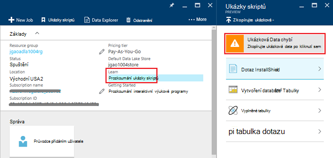
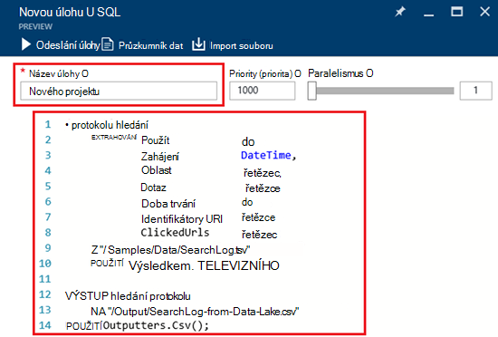
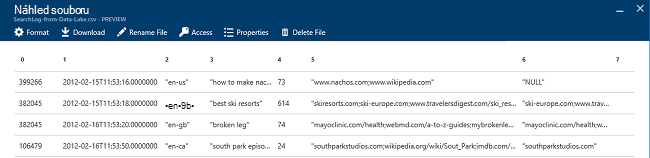

<properties 
   pageTitle="Začínáme s Azure dat jezera technologie pro analýzu Azure portálu | Azure" 
   description="Naučte se používat portál Azure můžete vytvořit účet jezera analýzy dat, vytvořit analýzy dat jezera úlohy pomocí U SQL a odesílat úkoly. " 
   services="data-lake-analytics" 
   documentationCenter="" 
   authors="edmacauley" 
   manager="jhubbard" 
   editor="cgronlun"/>
 
<tags
   ms.service="data-lake-analytics"
   ms.devlang="na"
   ms.topic="hero-article"
   ms.tgt_pltfrm="na"
   ms.workload="big-data" 
   ms.date="10/06/2016"
   ms.author="edmaca"/>

# Kurz: Začínáme s Azure dat jezera technologie pro analýzu Azure portálu

[AZURE.INCLUDE [get-started-selector](../../includes/data-lake-analytics-selector-get-started.md)]

Naučte se používat portál Azure k vytvoření účtů jezera analýzy dat Azure, definujte úlohy jezera analýzy dat v [U SQL](data-lake-analytics-u-sql-get-started.md)a odesílat úlohy jezera analýzy dat služby. Další informace o jezera analýzy dat najdete v tématu [Přehled analýzy jezera dat Azure](data-lake-analytics-overview.md).

V tomto kurzu vyvinete projektu, který bude číst na kartě soubor hodnot (TSV) oddělené a převede ho do souboru hodnoty oddělené čárkami (CSV). Projít stejné kurz používání jiných podporovaných nástrojů, klikněte na karty v horní v této části. Po úspěšném první práce můžete začít psát složitější transformace dat s U-SQL.

##Zjistit předpoklady pro

Před zahájením tohoto kurzu, musíte mít následující položky:

- **Azure předplatného**. Viz [získání Azure bezplatnou zkušební verzi](https://azure.microsoft.com/pricing/free-trial/).

##Vytvoření účtu jezera analýzy dat

Před spuštěním všechny úlohy musíte mít účet analýzy dat jezera.

Každý účet analýzy dat jezera má závislost účtu [Úložiště jezera dat Azure]() .  Tento účet se označuje jako výchozí úložiště jezera dat účet.  Vytvořit účet úložiště jezera Data předem nebo při vytváření účtu analýzy dat jezera. V tomto kurzu vytvoříte účtu úložiště jezera dat pomocí analýzy dat jezera účtu.

**Vytvoření účtu jezera analýzy dat**

1. Přihlaste se k [portálu Azure](https://portal.azure.com).
2. Klikněte na **Nový**, klikněte **Intelligence + technologie pro analýzu**a potom klikněte na **Analýza jezera Data**.
3. Zadejte nebo vyberte následující hodnoty:

    

    - **Název**: název účtu dat jezera analýzy.
    - **Předplatné**: Zvolte Azure předplatné pro účet analýzy.
    - **Pole Skupina zdroje**. Vyberte existující skupinu zdroje Azure nebo vytvořte nový účet. Azure správce prostředků umožňuje práce se zdroji v aplikaci jako skupinu. Další informace najdete v tématu [Přehled Správce prostředků Azure](resource-group-overview.md). 
    - **Umístění**. Vyberte Azure datacentrem analýzy dat jezera účtu. 
    - **Úložiště jezera dat**: účtu každý jezera analýzy dat má závislá účet jezera úložiště. Účet jezera analýzy dat a závislá účet úložiště jezera dat musí být umístěné v centru stejné Azure data. Postupujte podle pokynů k vytvoření nového účtu úložiště jezera dat, nebo vyberte stávající.

8. Klikněte na **vytvořit**. Přenese vás na domovské obrazovce portálu. Nová dlaždice přibude StartBoard s popiskem "Nasazení Azure dat jezera analýzy". Na krátkou chvíli vytvořit účet analýzy dat jezera trvá. Po vytvoření účtu na portálu otevře účtu na nové zásuvné.

Po vytvoření účtu jezera analýzy dat, můžete přidat další úložiště jezera dat a úložišti Azure účty. Pokyny najdete v tématu [Správa analýzy dat jezera účet zdroje dat](data-lake-analytics-manage-use-portal.md#manage-account-data-sources).

##Příprava zdroje dat

V tomto kurzu zpracovat některé protokoly vyhledávání.  Protokol hledání můžete uložené v úložišti dData jezera nebo úložiště objektů Blob Azure. 

Portál Azure poskytuje uživatelské rozhraní pro zkopírování některé ukázkové datové soubory do výchozího účtu úložiště jezera dat, který zahrnout soubor protokolu vyhledávání.

**Chcete-li zkopírovat ukázkové datové soubory**

1. Z [Azure portál](https://portal.azure.com)si potřebujete založit účet dat jezera analýzy.  V tématu [Správa analýzy dat jezera účty](data-lake-analytics-get-started-portal.md#manage-accounts) a vytvořte si ho otevřete účtu na portálu.
3. Rozbalte podokno **Essentials** a potom klikněte na **Prozkoumat ukázky skriptů**. Otevře se jiné zásuvné s názvem **Ukázky skriptů**.

    

4. Klikněte na **Chybějící ukázková Data** zkopírovat ukázkové datové soubory. Když ho uděláte, portálu zobrazuje **Ukázková data úspěšně aktualizovaly**.
7. Na zásuvné účtu technologie pro analýzu dat jezera klikněte na horní **Průzkumník dat** . 

    

    Otevře se dvěma listy. Reprodukujte **Průzkumník dat**a druhý je výchozí úložiště jezera dat účet.
8. V účtu zásuvné výchozí úložiště jezera dat klikněte na **vzorky** rozbalte složku a pak klikněte na **Data** rozbalte složku. Zobrazí se následující soubory a složky:

    - AmbulanceData /
    - AdsLog.tsv
    - SearchLog.tsv
    - Version.txt
    - WebLog.log
    
    V tomto kurzu použijete SearchLog.tsv.

Ve skutečnosti buď program aplikace zápis dat do úložiště propojené účty nebo odeslat data. Nahrávání souborů, najdete v článku [odešlete data do úložiště jezera dat](data-lake-analytics-manage-use-portal.md#upload-data-to-adls) nebo [odešlete data k úložišti objektů Blob](data-lake-analytics-manage-use-portal.md#upload-data-to-wasb).

##Vytvoření a odeslání úlohy jezera analýzy dat

Po skončení přípravy zdrojová data, můžete začít vývoj skript U SQL.  

**Odeslání projektu**

1. Technologie pro analýzu dat jezera účtu zásuvné na portálu klikněte na **Nový projekt**. 

    

    Pokud se nezobrazuje zásuvné, přečtěte si téma [potřebujete založit účet jezera analýzy dat z portálu](data-lake-analytics-manage-use-portal.md#access-adla-account).
2. Zadejte **Název projektu**a tento skript U SQL:

        @searchlog =
            EXTRACT UserId          int,
                    Start           DateTime,
                    Region          string,
                    Query           string,
                    Duration        int?,
                    Urls            string,
                    ClickedUrls     string
            FROM "/Samples/Data/SearchLog.tsv"
            USING Extractors.Tsv();
        
        OUTPUT @searchlog   
            TO "/Output/SearchLog-from-Data-Lake.csv"
        USING Outputters.Csv();

    

    Tento skript U SQL přečte souboru zdroje dat pomocí **Extractors.Tsv()**a vytvoří soubor csv pomocí **Outputters.Csv()**. 
    
    Neupravujte dvě cesty, pokud zkopírujete zdrojového souboru do jiného umístění.  Jezera analýzy dat vytvoří složku výstup Pokud neexistuje.  V tomto případě používáme jednoduchý a relativní cesty.  
    
    Je jednodušší použít relativní cesty pro soubory uložené ve výchozí Data jezera účty. Můžete taky použít absolutní cesty.  Příklad 
    
        adl://<Data LakeStorageAccountName>.azuredatalakestore.net:443/Samples/Data/SearchLog.tsv
      

    Další informace o U SQL najdete v článku [Začínáme s jazykem Azure dat jezera analýzy U SQL](data-lake-analytics-u-sql-get-started.md) a funkce pro [odkazy jazyka U SQL](http://go.microsoft.com/fwlink/?LinkId=691348).
     
3. Klikněte na **Odeslat úlohu** shora.   
4. Počkejte, dokud stav úlohy se změní na **byl úspěšný**. Uvidíte, že úlohy trvání asi minutu dokončení.
    
    V případě, že se nezdařila úlohy, najdete v článku [sledování a odstraňování případných problémů analýzy dat jezera úlohy](data-lake-analytics-monitor-and-troubleshoot-jobs-tutorial.md).

5. V dolní části zásuvné klikněte na kartu **výstup** a potom klikněte na **SearchLog z dat Lake.csv**. Můžete zobrazit náhled, stažení a přejmenovat a odstranit ve výstupním souboru.

    

##Viz taky

- Složitější dotaz najdete v tématu [protokoly analyzovat webu pomocí analýzy jezera dat Azure](data-lake-analytics-analyze-weblogs.md).
- Začínáme s vývojem aplikací U SQL, najdete v článku [pomocí nástroje jezera datového Visual Studio skripty vyvíjet U-SQL](data-lake-analytics-data-lake-tools-get-started.md).
- Další U SQL najdete v tématu [Začínáme s jazykem dat Azure jezera analýzy U-SQL](data-lake-analytics-u-sql-get-started.md).
- Úlohy správy najdete v článku [Správa jezera analýzy dat Azure Azure portálu](data-lake-analytics-manage-use-portal.md).
- Získejte přehled o jezera analýzy dat, najdete v článku [Přehled analýzy jezera dat Azure](data-lake-analytics-overview.md).
- Stejný kurz pomocí dalších nástrojů zobrazíte kliknutím na kartu voliče v horní části stránky.
- Protokolování diagnostiky informace, naleznete v [protokolech diagnostiky přístup k jezera analýzy dat Azure](data-lake-analytics-diagnostic-logs.md)
