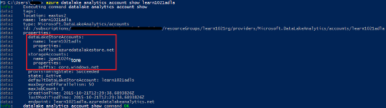
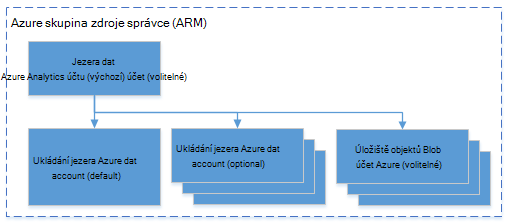

<properties 
   pageTitle="Správa Azure dat jezera technologie pro analýzu pomocí rozhraní příkazového řádku Azure | Azure" 
   description="Naučte se spravovat účty jezera analýzy dat, zdrojů dat, úlohy a uživatelů pomocí rozhraní příkazového řádku Azure" 
   services="data-lake-analytics" 
   documentationCenter="" 
   authors="edmacauley" 
   manager="jhubbard" 
   editor="cgronlun"/>
 
<tags
   ms.service="data-lake-analytics"
   ms.devlang="na"
   ms.topic="article"
   ms.tgt_pltfrm="na"
   ms.workload="big-data" 
   ms.date="05/16/2016"
   ms.author="edmaca"/>

# Správa Azure dat jezera technologie pro analýzu pomocí rozhraní příkazového (rozhraní příkazového řádku Azure řádku)

[AZURE.INCLUDE [manage-selector](../../includes/data-lake-analytics-selector-manage.md)]

Naučte se spravovat účty jezera analýzy dat Azure, zdrojů dat, uživatelů a úlohy pomocí Azure. V tématu Správa používat další nástroje, klikněte na kartu vyberte nahoře.

**Zjistit předpoklady pro**

Před zahájením tohoto kurzu, musíte mít takto:

- **Azure předplatného**. Viz [získání Azure bezplatnou zkušební verzi](https://azure.microsoft.com/pricing/free-trial/).
- **Azure rozhraní příkazového řádku**. V tématu [instalace a konfigurace rozhraní příkazového řádku Azure](../xplat-cli-install.md).
    - Stáhnout a nainstalovat **předběžnou verzi** [Azure rozhraní příkazového řádku nástroje](https://github.com/MicrosoftBigData/AzureDataLake/releases) pro dokončení Tato ukázka.
- **Ověření**pomocí následujícího příkazu:

        azure login
    Další informace o ověřování pomocí pracovního nebo školního účtu najdete v článku [připojení k předplatnému Azure z Azure rozhraní příkazového řádku](../xplat-cli-connect.md).
- **Přepnutí do režimu správce prostředků Azure**pomocí následujícího příkazu:

        azure config mode arm

**Chcete-li seznam příkazů úložiště jezera dat a jezera analýzy dat:**

    azure datalake store
    azure datalake analytics

<!-- ################################ -->
<!-- ################################ -->
## Správa účtů

Před spuštěním všechny úlohy jezera analýzy dat, musíte mít účet analýzy dat jezera. Na rozdíl od Azure HDInsight není zaplatit účet analýzy když neběží projektu.  Pouze zaplatit čas, kdy běží projektu.  Další informace najdete v tématu [Přehled technologie pro analýzu dat jezera Azure](data-lake-analytics-overview.md).  

###Vytvoření účtů

    azure datalake analytics account create "<Data Lake Analytics Account Name>" "<Azure Location>" "<Resource Group Name>" "<Default Data Lake Account Name>"

###Aktualizovat účty

Tento příkaz aktualizuje vlastnosti existujícího účtu jezera analýzy dat
    
    azure datalake analytics account set "<Data Lake Analytics Account Name>"

###Seznam účtů

Účty technologie pro analýzu dat jezera seznamu 

    azure datalake analytics account list

Účty analýzy jezera dat seznamu do určité skupiny zdrojů

    azure datalake analytics account list -g "<Azure Resource Group Name>"

Zobrazení podrobností konkrétní účtu jezera analýzy dat

    azure datalake analytics account show -g "<Azure Resource Group Name>" -n "<Data Lake Analytics Account Name>"

###Odstranění účtů jezera analýzy dat

    azure datalake analytics account delete "<Data Lake Analytics Account Name>"

<!-- ################################ -->
<!-- ################################ -->
## Správa zdrojů dat účtu

V následujících zdrojích dat v současné době podporuje jezera analýzy dat:

- [Úložiště jezera dat Azure](../data-lake-store/data-lake-store-overview.md)
- [Azure úložiště](../storage/storage-introduction.md)

Při vytváření účtu analýzy, je třeba určit účet Azure úložný prostor jezera výchozí účet úložiště. Výchozí ADL úložiště účet se používá k ukládání protokolů auditování metadata a úlohy projektu. Po vytvoření účtu analýzy, můžete přidat další úložný prostor jezera účty a/nebo účet Azure úložiště. 

### Vyhledání výchozí účet ADL úložiště

    azure datalake analytics account show "<Data Lake Analytics Account Name>"

Hodnota je uvedené v části vlastnosti: datalakeStoreAccount:name.

### Přidat další účty úložiště objektů Blob Azure

    azure datalake analytics account datasource add -n "<Data Lake Analytics Account Name>" -b "<Azure Blob Storage Account Short Name>" -k "<Azure Storage Account Key>"

>[AZURE.NOTE] Jsou podporované jenom objektů Blob úložiště krátké názvy.  Nepoužívejte plně kvalifikovaný název domény, například "myblob.blob.core.windows.net".

### Přidat další účty jezera úložiště dat

    azure datalake analytics account datasource add -n "<Data Lake Analytics Account Name>" -l "<Data Lake Store Account Name>" [-d]

[-d] je volitelný přepínač, který určete, zda jezera Data přidávaná výchozí účet jezera Data. 

### Aktualizace existujícího zdroje dat

Chcete-li nastavit existujícího účtu úložiště jezera dat jako výchozí:

    azure datalake analytics account datasource set -n "<Data Lake Analytics Account Name>" -l "<Azure Data Lake Store Account Name>" -d
      
Aktualizace stávající klíč účtu úložiště objektů Blob:

    azure datalake analytics account datasource set -n "<Data Lake Analytics Account Name>" -b "<Blob Storage Account Name>" -k "<New Blob Storage Account Key>"

### Seznam zdrojů dat:

    azure datalake analytics account show "<Data Lake Analytics Account Name>"
    

### Odstranění zdroje dat:

Odstranění účtu úložiště jezera dat:

    azure datalake analytics account datasource delete "<Data Lake Analytics Account Name>" "<Azure Data Lake Store Account Name>"

Odstranění účtu úložiště objektů Blob:

    azure datalake analytics account datasource delete "<Data Lake Analytics Account Name>" "<Blob Storage Account Name>"

## Správa úloh

Než budete moct vytvářet úlohy, musíte mít účet jezera analýzy dat.  Další informace najdete v tématu [Správa analýzy dat jezera účty](#manage-accounts).

### Seznam úloh

    azure datalake analytics job list -n "<Data Lake Analytics Account Name>"

### Zobrazení podrobností projektu

    azure datalake analytics job show -n "<Data Lake Analytics Account Name>" -j "<Job ID>"
    
### Odeslat úlohy

> [AZURE.NOTE] Priority (priorita) výchozí úlohy je 1000 a je výchozí stupeň paralelismus pro projekt 1.

    azure datalake analytics job create  "<Data Lake Analytics Account Name>" "<Job Name>" "<Script>"

### Zrušení úloh

Pomocí příkazu seznamu zobrazíte id úlohy a potom pomocí zrušit na Storno projektu.

    azure datalake analytics job list -n "<Data Lake Analytics Account Name>"
    azure datalake analytics job cancel "<Data Lake Analytics Account Name>" "<Job ID>"

## Správa katalogu

Katalog U SQL slouží k vytvoření struktury dat a kód tak, aby se smí zobrazovat skripty U SQL. V katalogu umožňuje možné s daty v Azure dat jezera nejvyšší výkon. Další informace najdete v tématu [použití U-SQL katalogu](data-lake-analytics-use-u-sql-catalog.md).
 
###Seznam položky katalogu

    #List databases
    azure datalake analytics catalog list -n "<Data Lake Analytics Account Name>" -t database

    #List tables
    azure datalake analytics catalog list -n "<Data Lake Analytics Account Name>" -t table
    
Typy obsahovat databáze, schéma, sestavení, externí zdroj dat, tabulky, funkce vracejícími tabulku nebo statistiky tabulek.

###Vytvoření tajná katalogu

    azure datalake analytics catalog secret create -n "<Data Lake Analytics Account Name>" <databaseName> <hostUri> <secretName>

### Úprava tajná katalogu

    azure datalake analytics catalog secret set -n "<Data Lake Analytics Account Name>" <databaseName> <hostUri> <secretName>

###Odstranění tajná katalogu

    azure datalake analytics catalog secrete delete -n "<Data Lake Analytics Account Name>" <databaseName> <hostUri> <secretName>

<!-- ################################ -->
<!-- ################################ -->
## Používání skupin ARM

Aplikace se obvykle vytvářejí součástí mnoho, třeba do webových aplikací databáze, databázový server, úložiště a 3 stran služby. Správce Azure zdroje (ARM) umožňuje pracovat s zdrojům v aplikaci jako skupinu, označovaný taky jako skupina zdroje Azure. Můžete nasadit, aktualizace, sledovat nebo odstranit všechny zdroje pro aplikaci v operaci jediné, koordinovaný. Použití šablony pro nasazení a této šablony můžete pracovat na jiném prostředí například testování pracovní a výroby. Fakturace můžete vysvětlit pro vaši organizaci, zobrazením nákladů úrovní pro celou skupinu. Další informace najdete v tématu [Přehled Správce prostředků Azure](../azure-resource-manager/resource-group-overview.md). 

Služba jezera analýzy dat může obsahovat tyto prvky:

- Účet technologie pro analýzu dat jezera Azure
- Požadované výchozí účet pro ukládání jezera dat Azure
- Účty jezera dat Azure další úložiště
- Další úložiště Azure účty

Můžete vytvořit tyto komponenty v jedné skupině ARM pro jejich snadněji spravovat.

Účet jezera analýzy dat a účty závislá úložiště musí být umístěny ve stejné Azure datovém centru.
Skupina ARM však mohou být umístěny v různých datovém centru.  

##Viz taky 

- [Přehled analýzy dat jezera Microsoft Azure](data-lake-analytics-overview.md)
- [Začínáme s jezera analýzy dat pomocí portálu Azure](data-lake-analytics-get-started-portal.md)
- [Správa portálu Azure analýzy jezera dat Azure](data-lake-analytics-manage-use-portal.md)
- [Sledování a odstraňování případných problémů jezera analýzy dat Azure úlohy pomocí portálu Azure](data-lake-analytics-monitor-and-troubleshoot-jobs-tutorial.md)

