<properties 
   pageTitle="Správa Azure dat jezera technologie pro analýzu pomocí portálu Azure | Azure" 
   description="Naučte se spravovat analýzy dat jezera acounts zdroje dat, uživatelů a úlohy." 
   services="data-lake-analytics" 
   documentationCenter="" 
   authors="edmacauley" 
   manager="jhubbard" 
   editor="cgronlun"/>
 
<tags
   ms.service="data-lake-analytics"
   ms.devlang="na"
   ms.topic="article"
   ms.tgt_pltfrm="na"
   ms.workload="big-data" 
   ms.date="10/06/2016"
   ms.author="edmaca"/>

# Správa Azure dat jezera technologie pro analýzu Azure portálu

[AZURE.INCLUDE [manage-selector](../../includes/data-lake-analytics-selector-manage.md)]

Naučte se spravovat účty jezera analýzy dat Azure, zdrojů dat účtu, uživatelů a úlohy pomocí portálu Azure. Správa témat pomocí dalších nástrojů zobrazíte kliknutím na výběr umístění tabulátoru v horní části stránky.

**Zjistit předpoklady pro**

Před zahájením tohoto kurzu, musíte mít následující položky:

- **Azure předplatného**. Viz [získání Azure bezplatnou zkušební verzi](https://azure.microsoft.com/pricing/free-trial/).

<!-- ################################ -->
<!-- ################################ -->
## Správa účtů

Před spuštěním všechny úlohy jezera analýzy dat, musíte mít účet analýzy dat jezera. Na rozdíl od Azure HDInsight pouze platíte účtu jezera analýzy dat při spuštění úlohy.  Pouze zaplatit čas, kdy běží projektu.  Další informace najdete v tématu [Přehled technologie pro analýzu dat jezera Azure](data-lake-analytics-overview.md).  

**Vytvoření účtu jezera analýzy dat**

1. Přihlaste se k [portálu Azure](https://portal.azure.com).
2. Klikněte na **Nový**, klikněte **měřítka + technologie pro analýzu**a potom klikněte na **Analýza jezera Data**.
3. Zadejte nebo vyberte následující hodnoty:

    

    - **Název**: název účtu dat jezera analýzy.
    - **Předplatné**: Zvolte Azure předplatné pro účet analýzy.
    - **Pole Skupina zdroje**. Vyberte existující skupinu zdroje Azure nebo vytvořte nový účet. Azure správce prostředků umožňuje práce se zdroji v aplikaci jako skupinu. Další informace najdete v tématu [Přehled Správce prostředků Azure](resource-group-overview.md). 
    - **Umístění**. Vyberte Azure datacentrem analýzy dat jezera účtu. 
    - **Úložiště jezera dat**: účtu každý jezera analýzy dat má závislá účet jezera úložiště. Účet jezera analýzy dat a závislá účet úložiště jezera dat musí být umístěné v centru stejné Azure data. Postupujte podle pokynů k vytvoření nového účtu úložiště jezera dat, nebo vyberte stávající.

8. Klikněte na **vytvořit**. Přenese vás na domovské obrazovce portálu. Nová dlaždice přibude StartBoard s popiskem "Nasazení Azure dat jezera analýzy". Na krátkou chvíli vytvořit účet analýzy dat jezera trvá. Po vytvoření účtu na portálu otevře účtu na nové zásuvné.

Po vytvoření účtu jezera analýzy dat, můžete přidat další úložiště jezera dat a úložišti Azure účty. Pokyny najdete v tématu [Správa analýzy dat jezera účet zdroje dat](data-lake-analytics-manage-use-portal.md#manage-account-data-sources).

**Access/otevřené účet jezera analýzy dat**

1. Přihlaste se k [portálu Azure](https://portal.azure.com/).
2. Klikněte na **Analýza jezera dat** v nabídce nalevo.  Pokud nevidíte, klikněte na **Další služby**a klikněte **Jezera analýzy dat** v rámci **měřítka + analýzy**.
3. Klikněte na účet jezera analýzy dat, který chcete mít přístup. V nové zásuvné otevře účet.

**Odstranění účtu jezera analýzy dat**

1. Si potřebujete založit účet jezera analýzy dat, který chcete odstranit. Pokyny najdete v tématu [účty jezera analýzy dat aplikace Access](#access-adla-account).
2. V nabídce tlačítka v horní zásuvné klikněte na **Odstranit** .
3. Zadejte název účtu a potom klikněte na **Odstranit**.

Odstranění účtu analýzy dat jezera neodstraní závislá účty jezera úložiště. Odstranění účtů jezera ukládání dat najdete v článku [účtu úložiště jezera dat odstranit](data-lake-store-get-started-portal.md#delete-azure-data-lake-store-account).

<!-- ################################ -->
<!-- ################################ -->
## Správa zdrojů dat účtu

V následujících zdrojích dat v současné době podporuje jezera analýzy dat:

- [Úložiště jezera dat Azure](../data-lake-store/data-lake-store-overview.md)
- [Azure úložiště](../storage/storage-introduction.md)

Při vytváření účtu jezera analýzy dat, je třeba určit účet Azure úložišti jezera výchozí účet úložiště. Výchozí úložiště jezera dat účet se používá k ukládání protokolů auditování metadata a úlohy projektu. Po vytvoření účtu jezera analýzy dat, můžete přidat další účty úložiště jezera dat a/nebo účet Azure úložiště. 

**K vyhledání výchozí účet jezera datový úložiště**

- Si potřebujete založit účet jezera analýzy dat, který chcete spravovat. Pokyny najdete v tématu [účty jezera analýzy dat aplikace Access](#access-adla-account). Výchozí úložiště jezera dat se zobrazují v **základní**:

    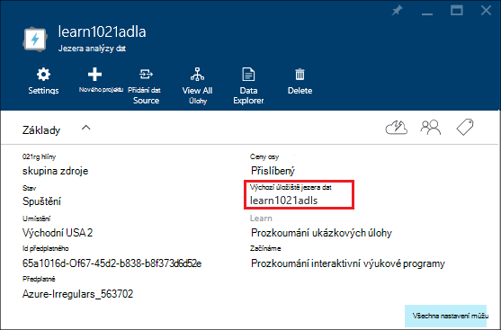

**Chcete-li přidat další zdroje dat**

1. Si potřebujete založit účet jezera analýzy dat, který chcete spravovat. Pokyny najdete v tématu [účty jezera analýzy dat aplikace Access](#access-adla-account).
2. Klikněte na **Nastavení** a pak klikněte na **Zdroje dat**. Zobrazí výchozí účet úložiště jezera dat tam uvedených. 
3. Klikněte na **Přidat zdroje dat**.

    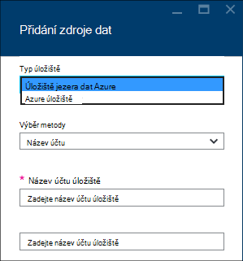

    Přidání účtu úložiště jezera dat Azure, musíte účet název a přístup k tomuto účtu mají být zjistit.
    Pokud chcete přidat úložišti objektů Blob Azure, potřebujete účtu úložiště a klíč účtu, který najdete tak, že přejdete k účtu úložiště na portálu.

**Chcete-li prozkoumat zdroje dat**  

1. Otevřete analýzy účet, který chcete spravovat. Pokyny najdete v tématu [účty jezera analýzy dat aplikace Access](#access-adla-account).
2. Klikněte na **Nastavení** a potom klikněte na položku **Průzkumník Data**. 
 
    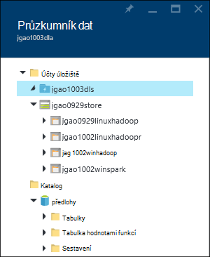
    
3. Klepněte na účet úložiště jezera dat k otevření účtu.

    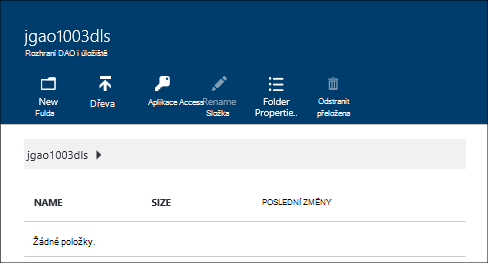
    
    Pro každý účet úložiště jezera dat můžete provést tyto akce
    
    - **Nová složka**: Přidat novou složku.
    - **Nahrání**: nahrajte soubory do účtu úložiště v počítači.
    - **Aplikace Access**: Konfigurace aplikace access oprávnění.
    - **Přejmenovat složku**: přejmenování složky.
    - **Vlastnosti složky**: Zobrazit vlastnosti souboru nebo složky, jako je WASB cesty, cesty WEBHDFS čas poslední změny a tak dál.
    - **Odstranění složky**: odstranění složky.

**Nahrajte soubory do účtu úložiště jezera dat**

1. Z portálu v levé nabídce klepněte na tlačítko **Procházet** a klikněte na **Úložiště jezera dat**.
2. Klikněte na úložiště jezera dat účet, který chcete data, která chcete nahrát. Výchozí účet pro ukládání dat jezera najdete [tady](#default-adl-account).
3. Klikněte na položku **Průzkumník dat** z nabídky nejvyšší.
4. Klikněte na **Nový adresář** k vytvoření nové složky nebo klikněte na název složky změnit složku.
6. **Nahrání** v nabídce klikněte na horní nahrát soubor.

**Nahrajte soubory do účtu úložiště objektů Blob Azure**

V tématu [nahrání dat pro Hadoop projekty v HDInsight](../hdinsight/hdinsight-upload-data.md).  Informace se týkají dat jezera analýzy.

## Správa uživatelů

Jezera analýzy dat pomocí řízení přístupu na základě rolí s Azure Active Directory. Při vytváření účtu analýzy dat jezera role "Předplatné správci" se přidá k tomuto účtu. Můžete přidat další uživatelé a skupiny zabezpečení s následující role:

|Role|Popis|
|----|-----------|
|Vlastník|Umožňuje spravovat všechno, co, včetně přístupu k prostředkům.|
|Skupiny přispěvatelů|Přístup k portálu. odeslání a sledovat úlohy. Abyste mohli odesílat úlohy, musí Přispěvatel oprávnění pro čtení a zápis k účtům jezera úložiště.|
|DataLakeAnalyticsDeveloper | Odeslání, sledovat a zrušit úlohy.  Tito uživatelé můžete zrušit jenom své vlastní úlohy. Nelze spravují vlastní účet, například přidat uživatele, změna oprávnění nebo odstranění účtu. Abyste mohli provádět úlohy, potřebují pro čtení nebo zápisu k účtům jezera úložiště dat     | 
|Čtečky|Umožňuje zobrazit vše, co, ale ne proveďte požadované změny.|  
|DevTest Labs uživatele|Umožňuje zobrazit vše, co a připojit, a termínů zahájení, restart a vypnutí virtuálních počítačích.|  
|Správce přístup uživatelů|Umožňuje spravovat přístup uživatelů k Azure zdroje.|  

Informace o vytváření Azure Active Directory uživatele a skupiny zabezpečení najdete v tématu [Co je Azure Active Directory](../active-directory/active-directory-whatis.md).

**Chcete-li přidat uživatele nebo skupiny zabezpečení s účtem jezera analýzy dat**

1. Otevřete analýzy účet, který chcete spravovat. Pokyny najdete v tématu [účty jezera analýzy dat aplikace Access](#access-adla-account).
2. Klikněte na **Nastavení**a potom klikněte na **uživatele**. **Aplikace Access** můžete taky kliknout na panelu nadpisů **Essentials** , jak je vidět na následující snímek obrazovky:

    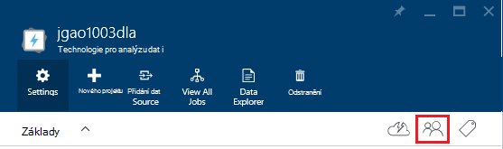
3. V zásuvné **uživatele** klikněte na **Přidat**.
4. Vyberte roli a přidat uživatele a klikněte na **OK**.

**Poznámka: Pokud tohoto uživatele nebo skupiny zabezpečení potřebujete-li odeslat úlohy, budou muset mít oprávnění na jezera úložiště stejně. Další informace najdete v tématu [zabezpečené dat uložených v úložišti jezera](../data-lake-store/data-lake-store-secure-data.md).**

<!-- ################################ -->
<!-- ################################ -->
## Správa úloh

Před spuštěním všechny úlohy U SQL musíte mít účet jezera analýzy dat.  Další informace najdete v tématu [Správa analýzy dat jezera účty](#manage-data-lake-analytics-accounts).

**Vytvoření projektu**

1. Otevřete analýzy účet, který chcete spravovat. Pokyny najdete v tématu [účty jezera analýzy dat aplikace Access](#access-adla-account).
2. Klikněte na **Nový projekt**.

    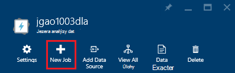

    Zobrazí se nové zásuvné podobně jako:

    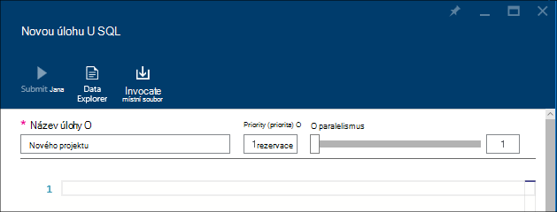

    Pro každý úkol můžete konfigurovat

  	|Jméno|Popis|
  	|----|-----------|
  	|Název úlohy|Zadejte název projektu.|
  	|Priority (priorita)|Nižší číslo musí mít vyšší prioritu. Pokud dvě úlohy jsou oba ve frontě, jednu s nižší prioritou spustí nejdřív|
  	|Paralelismus |Maximální počet výpočetním procesy, ke kterým může dojít ve stejnou dobu. Zvětšení toto číslo můžete zvýšit výkon, ale můžete taky zvětšit náklady.|
  	|Skript|Zadejte skript U SQL pro daný úkol.|

    Pomocí stejného rozhraní, můžete také propojení zdrojů dat prozkoumání a přidat další soubory do propojených zdrojů dat. 
3. Pokud chcete odeslat projektu, klikněte na **Odeslat projektu** .

**Odeslání projektu**

V tématu [Vytvoření analýzy dat jezera úlohy](#create-job).

**Sledování projektů**

1. Otevřete analýzy účet, který chcete spravovat. Pokyny najdete v tématu [účty jezera analýzy dat aplikace Access](#access-adla-account). Správa úloh panelu s informacemi základní úlohy:

    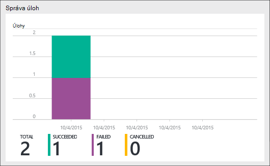

3. Jak ukazuje předchozí snímek, klikněte na **Správce úloh** .

    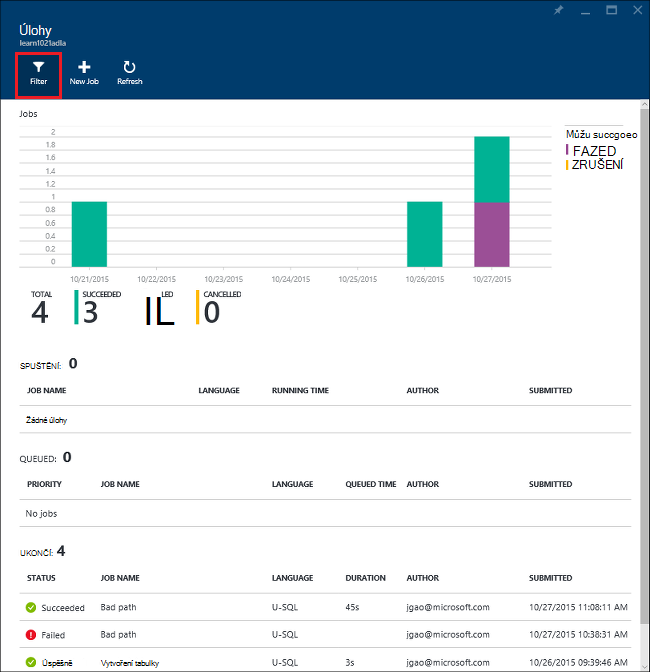

4. Klikněte na projekt v seznamech. Nebo klikněte na **Filtr** můžete najít úlohy:

    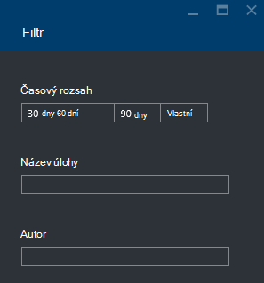

    Můžete filtrovat úloh podle **Časového rozsahu**, **Úlohy název**a **Autor**.
5. Pokud chcete znovu odeslat projektu, klikněte na **znovu odeslat** .

**Opětovné odeslání projektu**

V tématu [sledování dat jezera analýzy úlohy](#monitor-jobs).

##Sledovat použití účtu

**Chcete-li sledovat použití účtu**

1. Otevřete analýzy účet, který chcete spravovat. Pokyny najdete v tématu [účty jezera analýzy dat aplikace Access](#access-adla-account). Použití panelu zobrazeno využití:

    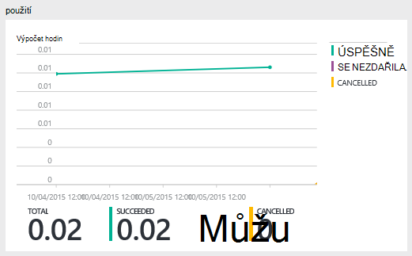

2. Poklikejte na položku v podokně zobrazíte více podrobností.

##Zobrazení U SQL katalogu

[U SQL katalogu](data-lake-analytics-use-u-sql-catalog.md) slouží k vytvoření struktury dat a kód tak, aby se smí zobrazovat skripty U SQL. V katalogu umožňuje možné s daty v Azure dat jezera nejvyšší výkon. Z portálu Microsoft Azure budou moct zobrazit U SQL katalogu.

**Umožňuje přecházet U SQL katalogu**

1. Otevřete analýzy účet, který chcete spravovat. Pokyny najdete v tématu [účty jezera analýzy dat aplikace Access](#access-adla-account).
2. Klikněte na položku **Průzkumník dat** z nabídky nejvyšší.
3. Rozbalte položku **katalogu**, rozbalte **předlohy**, rozbalte **tabulkami, nebo **hodnotami funkcí tabulky**, nebo **sestavení **. Následující snímek obrazovky znázorňuje jednu funkci vracejícími tabulku.

    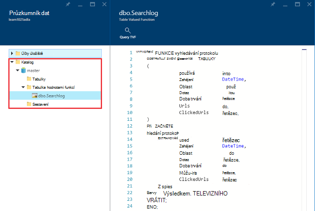

<!-- ################################ -->
<!-- ################################ -->
## Používání skupin správce prostředků Azure

Aplikace se obvykle vytvářejí součástí mnoho, třeba do webových aplikací databáze, databázovým serverem, úložiště a služby jiných výrobců. Azure správce prostředků umožňuje práce se zdroji v aplikaci jako skupinu, označovaný taky jako skupina zdroje Azure. Můžete nasadit, aktualizace, sledovat nebo odstranit všechny zdroje pro aplikaci v operaci jediné, koordinovaný. Použití šablony pro nasazení a této šablony můžete pracovat na jiném prostředí například testování pracovní a výroby. Fakturace můžete vysvětlit pro vaši organizaci, zobrazením nákladů úrovní pro celou skupinu. Další informace najdete v tématu [Přehled Správce prostředků Azure](../azure-resource-manager/resource-group-overview.md). 

Služba jezera analýzy dat může obsahovat tyto prvky:

- Účet technologie pro analýzu dat jezera Azure
- Požadované výchozí účet úložiště jezera dat Azure
- Další úložiště jezera dat Azure účty
- Další úložiště Azure účty

Můžete vytvořit tyto komponenty v jedné skupině řízení zdrojů a jejich snadněji spravovat.

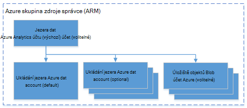

Účet jezera analýzy dat a účty závislá úložiště musí být umístěny ve stejné Azure datovém centru.
Řízení zdrojů skupina však mohou být umístěny v různých datovém centru.  

##Viz taky 

- [Přehled analýzy dat jezera Microsoft Azure](data-lake-analytics-overview.md)
- [Začínáme s jezera analýzy dat Azure portálu](data-lake-analytics-get-started-portal.md)
- [Správa Azure dat jezera technologie pro analýzu pomocí prostředí PowerShell Azure](data-lake-analytics-manage-use-powershell.md)
- [Sledování a odstraňování případných problémů jezera analýzy dat Azure úlohy Azure portálu](data-lake-analytics-monitor-and-troubleshoot-jobs-tutorial.md)

