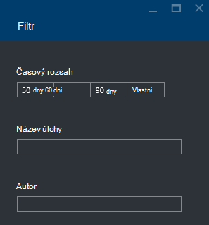

<properties 
   pageTitle="Poradce při potížích s jezera analýzy dat Azure úlohy pomocí portálu Azure | Azure" 
   description="Naučte se používat portál Azure řešit problémy s analýzy dat jezera úlohy. " 
   services="data-lake-analytics" 
   documentationCenter="" 
   authors="edmacauley" 
   manager="jhubbard" 
   editor="cgronlun"/>
 
<tags
   ms.service="data-lake-analytics"
   ms.devlang="na"
   ms.topic="article"
   ms.tgt_pltfrm="na"
   ms.workload="big-data" 
   ms.date="05/16/2016"
   ms.author="edmaca"/>

# Poradce při potížích s jezera analýzy dat Azure úlohy pomocí portálu Azure

Zjistěte, jak používat portál Azure řešit problémy s analýzy dat jezera úlohy.

V tomto kurzu chybějící problém zdrojového souboru s instalací a používat portál Azure k řešení potíží.

**Zjistit předpoklady pro**

Před zahájením tohoto kurzu, musíte mít takto:

- **Základní znalost jezera analýzy dat projektu obrázku**. V tématu [Začínáme s Azure dat jezera technologie pro analýzu portálu Azure](data-lake-analytics-get-started-portal.md).
- **Jezera analýzy dat A účtu**. V tématu [Začínáme s Azure dat jezera technologie pro analýzu portálu Azure](data-lake-analytics-get-started-portal.md#create-adl-analytics-account).
- **Zkopírujte ukázková data do výchozího úložiště jezera dat účtu**.  Viz [Příprava zdroje dat](data-lake-analytics-get-started-portal.md#prepare-source-data)

##Odeslání úlohy jezera analýzy dat

Teď vytvoříte úlohu U SQL s názvem Chybný zdrojový soubor.  

**Odeslání projektu**

1. Z portálu Microsoft Azure klikněte na **Microsoft Azure** v levém horním rohu.
2. Klikněte na dlaždici se svým názvem analýzy dat jezera účtu.  Byla tady připnuté při vytvoření účtu.
Pokud účet není připnuté tam, přečtěte si téma [potřebujete založit účet analýzy z portálu](data-lake-analytics-manage-use-portal.md#access-adla-account).
3. Horní v nabídce klikněte na **Nový projekt** .
4. Zadejte název projektu a tento skript U SQL:

        @searchlog =
            EXTRACT UserId          int,
                    Start           DateTime,
                    Region          string,
                    Query           string,
                    Duration        int?,
                    Urls            string,
                    ClickedUrls     string
            FROM "/Samples/Data/SearchLog.tsv1"
            USING Extractors.Tsv();
        
        OUTPUT @searchlog   
            TO "/output/SearchLog-from-adls.csv"
        USING Outputters.Csv();

    Že je zdrojovým souborem podle skript **/Samples/Data/SearchLog.tsv1**, kde je **/Samples/Data/SearchLog.tsv**.
     
5. Klikněte na **Odeslat úlohu** shora. Otevře se nové podokno Podrobnosti projektu. Na panelu nadpisů ukazují stav úlohy. Trvá několik minut. Klikněte na tlačítko **Aktualizovat** nejnovější stav.
6. Počkejte, dokud stav úlohy se změní na **se nezdařila**.  Pokud úkoly je **byl úspěšný**, je proto neměli odebrání složky /Samples. Naleznete v části **základní** na začátku tohoto kurzu.

Se může být váhající - proč trvá tak dlouho malé projektu.  Uvědomte si, že jezera analýzy dat je navržen zpracuje velký dat.  Září při zpracování velké množství dat pomocí distribuovaného systému.

Podívejme se předpokládá, že jste odeslali úlohy a zavřete portálu.  V následující části se zjistěte, jak řešit problémy s úkoly.

## Poradce při potížích s úkoly

V části poslední jste odeslali úlohy a úloha se nezdařila.  

**Chcete-li zobrazit všechny úlohy**

1. Z portálu Microsoft Azure klikněte na **Microsoft Azure** v levém horním rohu.
2. Klikněte na dlaždici se svým názvem analýzy dat jezera účtu.  Souhrnné úkoly se zobrazují na dlaždici **Správce úloh** .

    
    
    Úlohy správy vám přehled o stavu projektu. Všimněte si, že je nezdařeném uložení projektu.
   
3. Klikněte na dlaždici **Správce úloh** projekty zobrazíte. Úlohy zařazené do různých **spuštěné** **ve frontě**a **ukončeno**. Zobrazí se nezdařeném uložení práce v části **ukončeno** . Použije první z nich v seznamu. Když máte před sebou hodně práce, můžete klepnutím na tlačítko **Filtr** vám pomohou při vyhledejte úlohy.

    

4. Klikněte na neúspěšná úloha ze seznamu zobrazíte podrobnosti projektu v nové zásuvné:

    
    
    Všimněte si na tlačítko **znovu odeslat** . Když se problém nevyřeší, při novém odeslání projektu.

5. Klikněte na zvýrazněné část z předchozí snímek zobrazíte její podrobnosti.  Zobrazí se něco jako:

    

    Zjistíte, že se že nenašlo zdrojové složky.
    
6. Klepněte na příkaz **Duplikovat skriptu**.
7. Aktualizace **od** cestu následujícím způsobem:

    "/ Samples/Data/SearchLog.tsv"

8. Klikněte na **Odeslat projektu**.

##Viz taky

- [Přehled technologie pro analýzu dat jezera Azure](data-lake-analytics-overview.md)
- [Začínáme s Azure dat jezera technologie pro analýzu pomocí prostředí PowerShell Azure](data-lake-analytics-get-started-powershell.md)
- [Začínáme s Azure dat jezera technologie pro analýzu a U SQL pomocí aplikace Visual Studio](data-lake-analytics-u-sql-get-started.md)
- [Správa portálu Azure analýzy jezera dat Azure](data-lake-analytics-manage-use-portal.md)

