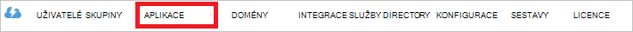

<properties
   pageTitle="Ověření pomocí úložiště jezera dat pomocí služby Active Directory | Microsoft Azure"
   description="Zjistěte, jak ověřit s úložištěm jezera dat pomocí služby Active Directory"
   services="data-lake-store"
   documentationCenter=""
   authors="nitinme"
   manager="jhubbard"
   editor="cgronlun"/>

<tags
   ms.service="data-lake-store"
   ms.devlang="na"
   ms.topic="article"
   ms.tgt_pltfrm="na"
   ms.workload="big-data"
   ms.date="10/17/2016"
   ms.author="nitinme"/>

# Ověřování služby služby s úložištěm jezera dat pomocí služby Azure Active Directory

> [AZURE.SELECTOR]
- [Služba Služba ověřování](data-lake-store-authenticate-using-active-directory.md)
- [Ověřování koncových uživatelů](data-lake-store-end-user-authenticate-using-active-directory.md)

Úložiště jezera dat Azure používá Azure Active Directory pro ověřování. Před vytváření aplikace, se kterými spolupracuje úložiště jezera dat Azure nebo jezera analýzy dat Azure, musíte nejdřív rozhodnout, způsob ověření aplikace pomocí služby Azure Active Directory (Azure AD). Jsou dva hlavní možnosti k dispozici:

* Ověřování koncových uživatelů a 
* Služba Služba ověřování. 

Obě tyto možnosti za následek aplikace poskytované s token OAuth 2.0, který získá připojené k každou žádost úložiště jezera dat Azure nebo jezera analýzy dat Azure.

Tento článek hovoří o jak vytvořit webovou aplikaci Azure AD pro ověření služby služby. Pokyny ke konfiguraci aplikace Azure AD pro ověřování koncových uživatelů najdete v článku [ověření koncových uživatelů s úložiště jezera dat pomocí služby Azure Active Directory](data-lake-store-end-user-authenticate-using-active-directory.md).

## Zjistit předpoklady pro

* Předplatné Azure. Viz [získání Azure bezplatnou zkušební verzi](https://azure.microsoft.com/pricing/free-trial/).
* ID předplatného. Můžete ji získat z portálu Microsoft Azure. Příklad je k dispozici z účtu zásuvné jezera úložiště.

    

* Název domény Azure AD. Můžete ho vyvolat tím, že umístíte ukazatel myši v pravém horním rohu portálu Azure. Z níže uvedených snímek název domény je **contoso.microsoft.com**a GUID do hranatých závorek ID klienta. 

    

## Služba Služba ověřování

Toto je doporučený postup, pokud chcete aplikaci automaticky ověření s Azure AD bez nutnosti koncový stanovit své přihlašovací údaje. Aplikace budou moct dokončit ověření pro dlouho své přihlašovací údaje jsou platné, který můžete přizpůsobit tak, aby být v následujícím pořadí let.

### Co je potřeba tuto možnost používat?

* Azure AD název domény. Už je uvedený v předpoklad tohoto článku.

* Azure AD pro **webovou aplikaci**.

* ID klienta pro webovou aplikaci Azure AD.

* Tajná klienta pro webovou aplikaci Azure AD.

* Tokenu koncový bod pro webovou aplikaci Azure AD.

* Povolení přístupu pro webovou aplikaci Azure AD na úložišti jezera soubor nebo složka nebo analýzy dat jezera účet, který chcete pracovat s.

Další informace o tom, jak vytvořit webovou aplikaci Azure AD a nakonfigurujte ji požadavky výše uvedené najdete v části [Vytvoření aplikace služby Active Directory](#create-an-active-directory-application) vidíte níže.

>[AZURE.NOTE] Ve výchozím nastavení je aplikace Azure AD nakonfigurována pro použití klienta tajná načtete z Azure AD aplikace. Ale pokud chcete aplikaci Azure AD místo toho použít certifikát, musíte vytvořit webové aplikace Azure AD pomocí prostředí PowerShell Azure jak je uvedeno na stránce [vytvořit služby základní pomocí certifikátu](../resource-group-authenticate-service-principal.md#create-service-principal-with-certificate).

## Vytvoření aplikace služby Active Directory

V této části jsme dozvědět, jak vytvořit a nakonfigurovat webovou aplikaci Azure AD pro ověření služba služby Azure dat jezera Store pomocí služby Azure Active Directory. 

### Krok 1: Vytvoření aplikace služby Azure Active Directory

>[AZURE.NOTE] Postupem používat portál Azure. Můžete taky vytvořit aplikaci Azure AD pomocí [Prostředí PowerShell Azure](../resource-group-authenticate-service-principal.md) nebo [Azure rozhraní příkazového řádku](../resource-group-authenticate-service-principal-cli.md).

1. Přihlaste se ke svému účtu Azure pomocí [klasické portálu](https://manage.windowsazure.com/).

2. V levém podokně vyberte **Služby Active Directory** .

     
     
3. Vyberte Active Directory, která chcete použít při vytváření nové aplikace. Pokud máte víc než jeden Active Directory, obvykle chcete vytvořit aplikace v adresáři, kde jsou uložená vaše předplatné. Můžete jenom udělit přístup k prostředku předplatné pro aplikace v adresáři stejný jako předplatné.  

     
    
    
3. Zobrazení aplikace v adresáři, klikněte na **aplikace**.

     

4. Pokud jste nevytvořili aplikace v adresáři před byste měli vidět něco vidíte na následujícím obrázku. Klikněte na **Přidat aplikaci**

     

     Nebo klikněte na **Přidat** v dolní části okna.

     

6. Zadejte název aplikace a vyberte požadovaný typ aplikace, kterou chcete vytvořit. Pro tento kurz vytvoření **Rozhraní API webových aplikací a či nebo WEB** a kliknutím na tlačítko Další.

     

7. Vyplnění vlastností aplikace. **Na PŘIHLAŠOVACÍ adresa URL**zadejte identifikátor URI na web, který popisuje aplikace. Není ověřit existenci na webu. **Identifikátor URI ID aplikace**zadejte identifikátor URI, který identifikuje aplikace.

     

    Klikněte na značku zaškrtnutí ukončete průvodce a vytvářet aplikace.

### Krok 2: Získání id klienta, tajná klienta a tokenu koncový bod

Při programově přihlášení, musíte id pro aplikaci. Pokud spuštění aplikace v části vlastní přihlašovací údaje, budete potřebovat ověřovací klíč.

1. Klikněte na kartu **Konfigurovat** a nakonfigurujte aplikace heslo.

     

2. Zkopírujte **Kód klienta**.
  
     

3. Pokud aplikace se spustí v části vlastní přihlašovací údaje, přejděte dolů do části **klíče** a vyberte, jak dlouho heslo platit.

     

4. Vyberte **Uložit** a vytvořte kód.

    

    Uložený klíč zobrazený a lze jej zkopírujete. Nebude moct klíči později vyvolat, takže musíte zkopírovat nyní.

    

5. Načtení tokenu koncového bodu výběrem **zobrazení koncové body** v dolní části obrazovky a načítání hodnoty pro pole **Koncový bod 2.0 Token OAuth** , jak je ukázáno v následujícím příkladu.  

    

### Krok 3: Přiřazení aplikaci Azure AD úložiště jezera dat Azure účtu soubor nebo složku (jenom pro ověřování služby service)

1. Přihlaste se na novém [Portálu Azure](https://portal.azure.com) a si potřebujete založit účet Azure úložiště jezera dat, která chcete přidružit k aplikaci Azure Active Directory, kterou jste dříve vytvořili.

1. V svůj účet zásuvné úložiště jezera dat klikněte na položku **Průzkumník Data**.

    ![Vytvoření adresáře v úložišti jezera účtu] (./media/data-lake-store-authenticate-using-active-directory/adl.start.data.explorer.png "Vytvoření adresářů dat jezera účtu")

2. V zásuvné **Průzkumník dat** klikněte na soubor nebo složku, u kterého chcete poskytnout přístup k aplikaci Azure AD a potom na možnost **přístup**. Abyste mohli nakonfigurovat přístup k souboru, musíte klikněte na **přístup** z zásuvné **Náhled souboru** .

    ![Nastavení ACL systému souborů jezera dat] (./media/data-lake-store-authenticate-using-active-directory/adl.acl.1.png "Nastavení ACL systému souborů jezera dat")

3. **Access** zásuvné seznamy standardní přístupu a vlastní již byly přiřazeny ke kořenovému. Klikněte na ikonu **Přidat** pro přidání ACL vlastní úroveň.

    ![Přístup k seznamu standardních a vlastních] (./media/data-lake-store-authenticate-using-active-directory/adl.acl.2.png "Přístup k seznamu standardních a vlastních")

4. Klikněte na ikonu **Přidat** otevřete zásuvné **Přidat vlastní přístup** . V tomto zásuvné klikněte na **Vybrat uživatele nebo skupiny**a potom **Vyberte uživatele nebo skupinu** zásuvné, vyhledejte v skupinu zabezpečení, kterou jste vytvořili dříve v Azure Active Directory. Pokud máte před sebou hodně skupin hledání z pomocí textového pole nahoře Pokud chcete filtrovat podle názvu skupiny. Klikněte na skupiny, kterou chcete přidat a potom klikněte na **Výběr**.

    ![Přidat skupinu] (./media/data-lake-store-authenticate-using-active-directory/adl.acl.3.png "Přidat skupinu")

5. Klikněte na **Vybrat oprávnění**vyberte oprávnění a jestli chcete přiřadit oprávnění jako výchozí ACL, přístup k ACL nebo obojí. Klikněte na **OK**.

    ![Přiřazení oprávnění skupině] (./media/data-lake-store-authenticate-using-active-directory/adl.acl.4.png "Přiřazení oprávnění skupině")

    Další informace o oprávněních v úložišti jezera a výchozí/přístup ACL naleznete v tématu [Řízení přístupu v úložišti jezera](data-lake-store-access-control.md).

6. V zásuvné **Přidat vlastní aplikace Access** klikněte na **OK**. Nově přidaná skupina s odpovídající oprávnění se teď zobrazují v zásuvné **přístup** .

    ![Přiřazení oprávnění skupině] (./media/data-lake-store-authenticate-using-active-directory/adl.acl.5.png "Přiřazení oprávnění skupině") 

## Další kroky

V tomto článku vytvořili webovou aplikaci Azure AD a shromáždili informace, které budete potřebovat v klientské aplikace vytvářet pomocí .NET SDK Java SDK, atd. Nyní můžete přejít na následující články, které si o tom, jak pomocí webové aplikace Azure AD nejdřív ověření dat jezera Store a pak proveďte dalších operací se obchodu.

- [Začínáme s úložiště jezera dat Azure pomocí .NET SDK](data-lake-store-get-started-net-sdk.md)
- [Začínáme s úložiště jezera dat Azure pomocí jazyka Java SDK](data-lake-store-get-started-java-sdk.md)
