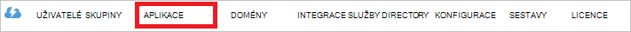

<properties
   pageTitle="Ověření pomocí úložiště jezera dat pomocí služby Active Directory | Microsoft Azure"
   description="Zjistěte, jak ověřit s úložištěm jezera dat pomocí služby Active Directory"
   services="data-lake-store"
   documentationCenter=""
   authors="nitinme"
   manager="jhubbard"
   editor="cgronlun"/>

<tags
   ms.service="data-lake-store"
   ms.devlang="na"
   ms.topic="article"
   ms.tgt_pltfrm="na"
   ms.workload="big-data"
   ms.date="10/17/2016"
   ms.author="nitinme"/>

# Ověřování koncových uživatelů s úložištěm jezera dat pomocí služby Azure Active Directory

> [AZURE.SELECTOR]
- [Služba Služba ověřování](data-lake-store-authenticate-using-active-directory.md)
- [Ověřování koncových uživatelů](data-lake-store-end-user-authenticate-using-active-directory.md)

Úložiště jezera dat Azure používá Azure Active Directory pro ověřování. Před vytváření aplikace, se kterými spolupracuje úložiště jezera dat Azure nebo jezera analýzy dat Azure, musíte nejdřív rozhodnout, jakým ověřování aplikace pomocí služby Azure Active Directory (Azure AD). Jsou dva hlavní možnosti k dispozici:

* Ověřování koncových uživatelů a 
* Služba Služba ověřování. 

Obou možnostech za následek aplikace poskytované s token OAuth 2.0, který získá připojené k každou žádost úložiště jezera dat Azure nebo jezera analýzy dat Azure.

Tento článek hovoří o jak vytvořit webovou aplikaci Azure AD pro ověřování koncových uživatelů. Pokyny ke konfiguraci aplikace Azure AD pro ověřování služby service najdete v článku [ověření služby služby s úložiště jezera dat pomocí služby Azure Active Directory](data-lake-store-authenticate-using-active-directory.md).

## Zjistit předpoklady pro

* Předplatné Azure. Viz [získání Azure bezplatnou zkušební verzi](https://azure.microsoft.com/pricing/free-trial/).
* ID předplatného. Můžete ji získat z portálu Microsoft Azure. Příklad je k dispozici z účtu zásuvné jezera úložiště.

    

* Název domény Azure AD. Můžete ho vyvolat tím, že umístíte ukazatel myši v pravém horním rohu portálu Azure. Z níže uvedených snímek název domény je **contoso.microsoft.com**a GUID do hranatých závorek ID klienta. 

    

## Ověřování koncových uživatelů

Pokud chcete koncový k přihlášení k aplikaci přes Azure AD jde doporučený postup. Aplikace bude mít přístup k Azure zdroje se stejnou úrovní přístupu jako koncový uživatel, který přihlášení. Vaše koncový uživatel bude nutné zadat své přihlašovací údaje pravidelně v pořadí aplikaci spravovat přístup.

S koncový uživatel, přihlaste se vyhodnotí jako, že aplikace je uveden přístupový token a token aktualizace. Přístupový token získá připojený k každou žádost úložiště jezera dat nebo dat jezera technologie pro analýzu a platí pro jednu hodinu ve výchozím nastavení. Aktualizace token mohou sloužit k získání nové přístupový token a platí pro až dva týdny ve výchozím nastavení, pokud použili pravidelně. Pomocí dvou způsobů pro přihlášení s koncovým uživatelem.

### Použití automaticky otevírané okno OAuth 2.0

Aplikaci můžete aktivovat OAuth 2.0 se tak mohli ověřovat automaticky otevírané okno, ve kterém můžete koncový uživatel zadejte své přihlašovací údaje. Tento automaticky otevírané okno funguje taky s procesem Azure AD dvojúrovňové ověřování (2FA) případné potíže. 

>[AZURE.NOTE] Tato metoda ještě není podporována v Azure AD ověřování knihovny (ADAL) pro Python nebo Java.

### Přímo předejte přihlašovací údaje uživatele

Aplikaci můžete přímo poskytovat Azure AD přihlašovací údaje uživatele. Tuto metodu jde použít pouze s účty organizace ID uživatele; není kompatibilní s osobní / "live ID" uživatelských účtů, včetně těch, které končí na @outlook.com nebo @live.com. Tento způsob navíc není kompatibilní s uživatelských účtů, které vyžadují Azure AD dvojúrovňové ověřování (2FA).

### Co je potřeba tuto možnost používat?

* Azure AD název domény. Už je uvedený v předpoklad tohoto článku.

* Azure AD **webovou aplikaci**

* ID klienta pro webovou aplikaci Azure AD

* Odpovědět URI Azure AD webové aplikace

* Nastavení delegovat oprávnění

Další informace o tom, jak vytvořit webovou aplikaci Azure AD a nakonfigurujte ji požadavky výše uvedené najdete v části [Vytvoření aplikace služby Active Directory](#create-an-active-directory-application) vidíte níže. 

## Vytvoření aplikace služby Active Directory

V této části jsme dozvědět, jak vytvořit a nakonfigurovat webovou aplikaci Azure AD pro ověřování koncových uživatelů s úložiště jezera dat Azure pomocí služby Azure Active Directory.

### Krok 1: Vytvoření aplikace služby Azure Active Directory

>[AZURE.NOTE] Postupem používat portál Azure. Můžete taky vytvořit aplikaci Azure AD pomocí [Prostředí PowerShell Azure](../resource-group-authenticate-service-principal.md) nebo [Azure rozhraní příkazového řádku](../resource-group-authenticate-service-principal-cli.md).

1. Přihlaste se ke svému účtu Azure pomocí [klasické portálu](https://manage.windowsazure.com/).

2. V levém podokně vyberte **Služby Active Directory** .

     
     
3. Vyberte Active Directory, která chcete použít při vytváření nové aplikace. Pokud máte víc než jeden Active Directory, obvykle chcete vytvořit aplikace v adresáři, kde jsou uložená vaše předplatné. Můžete jenom udělit přístup k prostředku předplatné pro aplikace v adresáři stejný jako předplatné.  

     
    
    
3. Zobrazení aplikace v adresáři, klikněte na **aplikace**.

     

4. Pokud jste nevytvořili aplikace v adresáři před byste měli vidět něco vidíte na následujícím obrázku. Klikněte na **Přidat aplikaci**

     

     Nebo klikněte na **Přidat** v dolní části okna.

     

6. Zadejte název aplikace a vyberte požadovaný typ aplikace, kterou chcete vytvořit. Pro tento kurz vytvoření **Rozhraní API webových aplikací a či nebo WEB** a kliknutím na tlačítko Další.

     

7. Vyplnění vlastností aplikace. **Na PŘIHLAŠOVACÍ adresa URL**zadejte identifikátor URI na web, který popisuje aplikace. Není ověřit existenci na webu. **Identifikátor URI ID aplikace**zadejte identifikátor URI, který identifikuje aplikace.

     

    Klikněte na značku zaškrtnutí ukončete průvodce a vytvářet aplikace.

### Krok 2: Získání id klienta odpovědět URI a nastavení delegovaného oprávnění

1. Klikněte na kartu **Konfigurovat** a nakonfigurujte aplikace heslo.

     

2. Zkopírujte **Kód klienta**.
  
     

3. V části **jednotného přihlašování** zkopírujte **URI odpověď**.

    

4. Ve skupinovém rámečku **oprávnění pro ostatní aplikace**klikněte na **Přidat aplikaci**

    

5. V průvodci **oprávnění do jiných aplikací** vyberte **Jezera dat Azure** a služby **Windows** **Azure rozhraní API správy služby**a klikněte na zaškrtnutí.

6. Ve výchozím nastavení **Delegovat oprávnění** pro nově přidaný služby nastavena na hodnotu nula. Klikněte na možnost **Delegovat oprávnění** rozevíracího seznamu Azure dat jezera a služby Windows Azure Management a vyberte dostupné zaškrtávací políčka nastavení hodnoty na 1. Výsledek by měl vypadat takto.

     

7. Klikněte na **Uložit**.

## Další kroky

V tomto článku vytvořili webovou aplikaci Azure AD a shromáždili informace, které budete potřebovat v klientské aplikace vytvářet pomocí .NET SDK Java SDK, atd. Nyní můžete přejít na následující články, které si o tom, jak pomocí webové aplikace Azure AD nejdřív ověření dat jezera Store a pak proveďte dalších operací se obchodu.

- [Začínáme s úložiště jezera dat Azure pomocí .NET SDK](data-lake-store-get-started-net-sdk.md)
- [Začínáme s úložiště jezera dat Azure pomocí jazyka Java SDK](data-lake-store-get-started-java-sdk.md)
