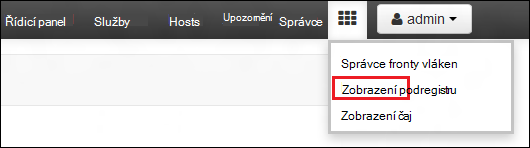
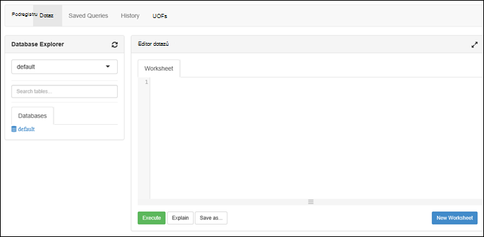

<properties
   pageTitle="Vytvoření clusterů HDInsight pomocí úložiště jezera Azure dat na portálu | Azure"
   description="Vytvoření a pomocí úložiště jezera dat Azure HDInsight clusterů pomocí portálu Azure"
   services="data-lake-store,hdinsight" 
   documentationCenter=""
   authors="nitinme"
   manager="jhubbard"
   editor="cgronlun"/>

<tags
   ms.service="data-lake-store"
   ms.devlang="na"
   ms.topic="article"
   ms.tgt_pltfrm="na"
   ms.workload="big-data"
   ms.date="10/21/2016"
   ms.author="nitinme"/>

# Vytvoření clusteru HDInsight s úložištěm jezera dat pomocí portálu Azure

> [AZURE.SELECTOR]
- [Pomocí portálu](data-lake-store-hdinsight-hadoop-use-portal.md)
- [Pomocí prostředí PowerShell](data-lake-store-hdinsight-hadoop-use-powershell.md)
- [Použití Správce prostředků](data-lake-store-hdinsight-hadoop-use-resource-manager-template.md)

Naučte se používat portál Azure k vytvoření s přístupem k úložiště jezera dat Azure HDInsight clusteru (Hadoop, HBase, Spark nebo bouře). Některé důležité důležité informace o této verzi:

* **Pro Spark clusterů (Linux) a clusterů Hadoop (Windows a Linux)**, úložiště jezera dat lze použít pouze jako účet další úložiště. Výchozí účet úložiště u těchto clusterů budou nadále úložiště objektů BLOB Azure (WASB).

* **Pro bouře clusterů (Windows a Linux)**, úložiště jezera dat můžete použít k zápisu dat z bouře topologie. Úložiště jezera dat lze také uložit referenčních dat, který pak jde přečíst tak, že bouře topologie. Další informace najdete v tématu [Použití dat jezera úložiště přihlašovacích údajů v topologii bouře](#use-data-lake-store-in-a-storm-topology).

* **Pro HBase clusterů (Windows a Linux)**, úložiště jezera dat lze použít jako výchozí úložiště a také jako další úložiště. Další informace najdete v tématu [Použití dat jezera úložiště přihlašovacích údajů se HBase clusterů](#use-data-lake-store-with-hbase-clusters).

> [AZURE.NOTE] Několik důležitých aspektů, je potřeba pamatovat. 
> 
> * Možnost vytvoření HDInsight clusterů s přístupem k úložišti jezera je dostupný jenom u verze HDInsight 3,2 a 3.4 (pro Hadoop HBase a bouře clusterů v systému Windows, jakož i Linux). Spark clusterů na Linux tato možnost je k dispozici pouze na clusterů HDInsight 3.4.
>
> * Výše uvedené, úložiště jezera dat neexistuje jako výchozí úložiště u některých typů obrázku (HBase) a další úložiště pro jiné typy obrázku (Hadoop, Spark, bouře). Použití úložiště jezera dat jako účet další úložiště nemají vliv na výkon nebo možnost pro čtení i zápis k základnímu úložišti z clusteru. V případě použití úložiště jezera dat jako dalšího úložiště soubory související s obrázku (například protokoly atd.) jsou došlo k zápisu výchozí úložiště (objektů BLOB Azure), zatímco data, která chcete zpracovat mohou být uloženy v úložišti jezera účtu.

## Zjistit předpoklady pro

Před zahájením tohoto kurzu, musíte mít takto:

- **Azure předplatného**. Viz [získání Azure bezplatnou zkušební verzi](https://azure.microsoft.com/pricing/free-trial/).

- **Úložiště jezera dat azure účtu**. Postupujte podle pokynů na [Začínáme s úložiště jezera Azure dat na portálu Azure](data-lake-store-get-started-portal.md). 

- **Nahrání ukázkových dat ke svému účtu úložiště jezera dat Azure**. Po vytvoření účtu udělejte následující úkoly k nahrání ukázkovými daty. Musíte se tato data dál v tomto kurzu ke spuštění úlohy z HDInsight obrázku, který přístupu k datům v úložišti jezera.

    * [Vytvoření složky ve vašem úložišti jezera dat](data-lake-store-get-started-portal.md#createfolder).
    * [Nahrání souboru do vašeho úložiště jezera](data-lake-store-get-started-portal.md#uploaddata). Pokud hledáte ukázkových dat chcete odeslat, můžete získat složce **Ambulance dat** z [Azure dat jezera libovolná úložiště](https://github.com/Azure/usql/tree/master/Examples/Samples/Data/AmbulanceData).

- **Azure jistinu služby Active Directory**. Kroky v tomto kurzu obsahují pokyny k vytváření hlavní název služby Azure AD. Ale musíte být správcem Azure AD mohli vytvořit hlavní název služby. Pokud jste správcem Azure AD, můžete přeskočit tento předpoklad a pokračovat v kurzu.
    
    **Pokud jste správcem není Azure AD**, nebude moct proveďte kroky potřebné k vytvoření hlavní název služby. V takovém případě správce Azure AD nejdřív vytvořte hlavní název služby před vytvořením HDInsight obrázku s úložištěm jezera Data. Navíc jistinu služby musí být vytvořen pomocí certifikátu, jak je uvedeno na stránce [vytvořit služby základní pomocí certifikátu](../resource-group-authenticate-service-principal.md#create-service-principal-with-certificate).

## Se naučíte rychleji s videa?

Podívejte se na následující videa pochopit, jak zřídit HDInsight clusterů s přístupem k úložišti jezera.

* [Vytvoření clusteru HDInsight s přístupem k jezera úložiště dat](https://mix.office.com/watch/l93xri2yhtp2)
* Jakmile clusteru nastavenou, [přístup k datům v úložišti jezera dat pomocí podregistru a Prasátko skriptů](https://mix.office.com/watch/1n9g5w0fiqv1q)

## Vytvoření s přístupem k úložiště jezera dat Azure HDInsight clusteru

V této části vytvoříte HDInsight Hadoop clusteru, který používá úložiště jezera dat jako dalšího úložiště. V této verzi pro Hadoop cluster úložiště jezera dat pouze slouží jako další úložiště clusteru. Výchozí úložiště objektů BLOB Azure úložiště (WASB) nebude. Ano nejdřív vytvoříme úložiště klienta a kontejnery úložiště potřebných pro clusteru.

1. Přihlaste se na novém [Portálu Azure](https://portal.azure.com).

2. Postupujte podle pokynů v tématu [Vytvoření Hadoop clusterů HDInsight](../hdinsight/hdinsight-provision-clusters.md#create-using-the-preview-portal) zahájíte zřizování HDInsight obrázku.

3. Na zásuvné **Volitelná konfigurace** klikněte na **Zdroj dat**. V zásuvné **Zdroje dat** zadejte podrobnosti pro úložiště klienta a kontejner úložiště zadejte **umístění** jako **Východoasijských USA 2**a klikněte na **Obrázku AAD Identity**.

    ![Přidání služby základní HDInsight clusteru] (./media/data-lake-store-hdinsight-hadoop-use-portal/hdi.adl.1.png "Přidání služby základní HDInsight clusteru")

4. Na zásuvné **Identity AAD obrázku** můžete vybrat existující jistinu služby nebo vytvořte nový účet.

    * **Vytvoření nového jistinu služby**

        * V zásuvné **Identity AAD obrázku** klikněte na **vytvořit nový**, klikněte na **Hlavní služby**a zadejte hodnot a ty pak vytvořit nové jistinu služby v zásuvné **vytvořit hlavní název služby** . V rámci, certifikát a aplikace služby Azure Active Directory je také vytvořit. Klikněte na **vytvořit**.

            ![Přidání služby základní HDInsight clusteru] (./media/data-lake-store-hdinsight-hadoop-use-portal/hdi.adl.2.png "Přidání služby základní HDInsight clusteru")

        * Na zásuvné **Identity AAD obrázku** klikněte na **Spravovat přístup ADLS**. V podokně zobrazí účty úložiště jezera dat přidružený k předplatnému. Však můžete nastavit oprávnění jenom pro účet, který jste vytvořili. Vyberte oprávnění pro čtení a zápis/spouštění pro účet, který chcete přidružit HDInsight obrázku a potom klikněte na **Uložit oprávnění**.

            ![Přidání služby základní HDInsight clusteru] (./media/data-lake-store-hdinsight-hadoop-use-portal/hdi.adl.3.png "Přidání služby základní HDInsight clusteru")

        * Na zásuvné **Identity AAD clusteru** klikněte na **Stáhnout certifikát** , který chcete stáhnout certifikát přidružený k služby základní že jste vytvořili. To je užitečné, pokud chcete použít stejné jistinu služby v budoucnu při vytváření další clusterů HDInsight. Klikněte na **Výběr**.

            ![Přidání služby základní HDInsight clusteru] (./media/data-lake-store-hdinsight-hadoop-use-portal/hdi.adl.4.png "Přidat služby základní clusteru HDInsight")

    * **Vyberte stávající jistinu služby**

        * V zásuvné **Identity AAD obrázku** klikněte na **použít existující**a **Jistinu služby**v zásuvné **Vybrat objekt zabezpečení služeb** vyhledejte existující jistinu služby. Klikněte na název hlavní služby a potom klikněte na **Výběr**.

            ![Přidání služby základní HDInsight clusteru] (./media/data-lake-store-hdinsight-hadoop-use-portal/hdi.adl.5.png "Přidání služby základní HDInsight clusteru")

        * Na zásuvné **Clusteru AAD Identity** odeslat certifikát přidružený k hlavního uživatele služby, které jste vybrali (.pfx) a potom zadat heslo certifikátu.

5. Klikněte na **Spravovat přístup ADLS** a potom na tlačítko **Vybrat oprávnění k souboru**. 

    ![Přidání služby základní HDInsight clusteru] (./media/data-lake-store-hdinsight-hadoop-use-portal/hdi.adl.5.existing.save.png "Přidání služby základní HDInsight clusteru")

6. V zásuvné **Vyberte oprávnění k souboru** v rozevíracím seznamu **účtu** vyberte účet úložiště jezera dat, která bude přidružený k obrázku HDInsight. Zásuvné seznam souborů a složek k dispozici ve vybrané účtu úložiště jezera dat. 
 
    ![Povolit přístup k jezera úložiště dat] (./media/data-lake-store-hdinsight-hadoop-use-portal/hdi-adl-permission-1.png "Povolit přístup k jezera úložiště dat")

    Poté určení oprávnění, která chcete pro uvedený vybrané soubory a složky. Pro složky taky určete, zda oprávnění se vztahují ke složce pouze nebo ke složce a všech podřízených položek ve složce. Můžete pak dělat tento výběr tak, že vyberete na odpovídající hodnotu z části **Použít** rozevírací seznam. Odebrat oprávnění, klikněte na ikonu **Odstranit**

    ![Povolit přístup k jezera úložiště dat] (./media/data-lake-store-hdinsight-hadoop-use-portal/hdi-adl-permission-2.png "Povolit přístup k jezera úložiště dat")

    Opakujte tento postup souvisejících souborů a složek z jiných úložiště jezera dat účtů. Po dokončení přiřazení oprávnění klikněte na **Vybrat** v dolní části zásuvné.

7. V zásuvné **přiřadit vybraná oprávnění** zkontrolujte oprávnění, která jste zadali a potom klikněte na **Spustit** udělit oprávnění.

    ![Povolit přístup k jezera úložiště dat] (./media/data-lake-store-hdinsight-hadoop-use-portal/hdi-adl-permission-3.png "Povolit přístup k jezera úložiště dat")

    Ve sloupci Stav zobrazuje průběh. Po úspěšném přiřazení všechna oprávnění, klikněte na tlačítko **Hotovo**. 

6. Na listy **Clusteru AAD identit** a **Zdroje dat** klikněte na **Výběr** a potom pokračujte vytvoření obrázku, jak je uvedeno na stránce [vytvořit Hadoop clusterů HDInsight](../hdinsight/hdinsight-hadoop-create-linux-clusters-portal.md).

7. Po zřízení clusteru můžete ověřit, že jistinu služeb souvisí s clusteru HDInsight. K tomu, z zásuvné obrázku, klikněte na **Obrázku AAD Identity** zobrazíte přidružené hlavního uživatele služby.

    ![Přidání služby základní HDInsight clusteru] (./media/data-lake-store-hdinsight-hadoop-use-portal/hdi.adl.6.png "Přidání služby základní HDInsight clusteru")

## Spusťte testovací úlohy clusteru HDInsight používat úložiště jezera dat Azure

Po konfiguraci clusteru HDInsight spuštěním testovací úlohy clusteru otestovat, aby clusteru HDInsight má k datům přístup v úložišti jezera dat Azure. V takovém případě jsme spustí některé dotazy podregistru cílené jezera úložišti.

### Pro Linux obrázku

1. Otevřete zásuvné clusteru pro clusteru, který jste právě zřízení a potom klikněte na **řídicí panel**. Otevře se Ambari clusteru Linux. Při přístupu k Ambari, budete vyzváni k ověření na web. Zadejte správce (výchozí správce) účtu jméno a heslo, které jste použili při vytváření clusteru.

    ![Spuštění clusteru řídicího panelu] (./media/data-lake-store-hdinsight-hadoop-use-portal/hdiadlcluster1.png "Spuštění clusteru řídicího panelu")

    Můžete taky přejít přímo do Ambari tak, že přejdete do https://CLUSTERNAME.azurehdinsight.net ve webovém prohlížeči (kde **NÁZEV_CLUSTERU** je název vaší HDInsight clusteru).

2. Otevřete zobrazení podregistru. Vyberte sadu čtverečky z nabídky stránky (vedle položky odkaz pro **správu** a požadovaného tlačítka na pravé straně stránky) k dispozici zobrazení seznamů. Vyberte zobrazení **podregistru** .

    

3. Měli byste vidět podobná této stránky:

    

4. V části **Editoru dotazů** na stránku vložte následující příkaz HiveQL na listu:

        CREATE EXTERNAL TABLE vehicles (str string) LOCATION 'adl://mydatalakestore.azuredatalakestore.net:443/mynewfolder'

5. Klikněte na tlačítko **Spustit** v dolní části **Editoru dotazů** spusťte dotaz. Část **Obrázku výsledků dotazu** by měl mají zobrazovat pod **Editoru dotazů** a zobrazení informací o projektu.

6. Po dokončení dotazu části **Obrázku výsledků dotazu** se zobrazí výsledky operace. Karta **výsledky** by měl obsahovat následující informace:

7. Spuštěním následujícího dotazu můžete ověřit, že byla vytvořená v tabulce.

        SHOW TABLES;

    Karta **výsledky** by měl zobrazit takto:

        hivesampletable
        vehicles

    **vozidla** je tabulku, kterou jste vytvořili. **hivesampletable** je k dispozici ve všech clusterů HDInsight ve výchozím nastavení ukázkovou tabulku.

8. Můžete taky spustit dotaz k načtení dat z tabulky **vozidla** .

        SELECT * FROM vehicles LIMIT 5;

### Pro clusteru systému Windows

1. Otevřete zásuvné obrázku pro obrázku, který jste právě zřízení a potom klikněte na **řídicí panel**.

    ![Spuštění clusteru řídicího panelu] (./media/data-lake-store-hdinsight-hadoop-use-portal/hdiadlcluster1.png "Spuštění clusteru řídicího panelu")

    Po zobrazení výzvy zadejte přihlašovací údaje Správce clusteru.

2. Tím se otevře dotaz konzoly Microsoft Azure HDInsight. Klikněte na tlačítko **podregistru Editor**.

    ![Otevřít podregistru editor] (./media/data-lake-store-hdinsight-hadoop-use-portal/hdiadlcluster2.png "Otevřít podregistru editor")

3. V editoru podregistru zadejte následující dotaz a potom klikněte na **Odeslat**.

        CREATE EXTERNAL TABLE vehicles (str string) LOCATION 'adl://mydatalakestore.azuredatalakestore.net:443/mynewfolder'

    V tomto dotazu podregistru vytvoříme tabulky z dat uložených v úložišti jezera dat na `adl://mydatalakestore.azuredatalakestore.net:443/mynewfolder`. Toto umístění obsahuje ukázka datového souboru, který jste měli dříve nahráli.

    V tabulce **Relaci úloh** dole najdete stav úlohy změňte z **Probíhá inicializace**na **systém**, **Dokončeno**. Klepněte na tlačítko **Zobrazit podrobnosti** zobrazit další informace o dokončeného projektu.

    ![Vytvořit tabulku] (./media/data-lake-store-hdinsight-hadoop-use-portal/hdiadlcluster3.png "Vytvořit tabulku")

4. Spuštěním následujícího dotazu můžete ověřit, že byla vytvořená v tabulce.

        SHOW TABLES;

    Klikněte na **Zobrazit podrobnosti** odpovídá tento dotaz a výstup by se zobrazit následující:

        hivesampletable
        vehicles

    **vozidla** je tabulku, kterou jste vytvořili. **hivesampletable** je k dispozici ve všech clusterů HDInsight ve výchozím nastavení ukázkovou tabulku.

5. Můžete taky spustit dotaz k načtení dat z tabulky **vozidla** .

        SELECT * FROM vehicles LIMIT 5;

## Pomocí příkazů HDFS úložiště jezera dat aplikace Access

Po konfiguraci clusteru HDInsight používat úložiště jezera dat, můžete příkazy HDFS prostředí pro přístup k úložišti.

### Pro Linux obrázku

V tomto oddílu, který bude SSH do clusteru a spusťte HDFS příkazy. Windows neposkytuje předdefinované SSH klienta. Doporučujeme používat **nátěrové**, které si můžete stáhnout z [http://www.chiark.greenend.org.uk/~sgtatham/putty/download.html](http://www.chiark.greenend.org.uk/~sgtatham/putty/download.html).

Další informace o použití nátěrové najdete v tématu [Použití SSH s Hadoop Linux založené na HDInsight z Windows](../hdinsight/hdinsight-hadoop-linux-use-ssh-windows.md).

Po připojení seznamu souborů v úložišti jezera dat pomocí následujícího příkazu systému souborů HDFS.

    hdfs dfs -ls adl://<Data Lake Store account name>.azuredatalakestore.net:443/

To uvádět soubor, který jste nahráli dříve jezera úložišti.

    15/09/17 21:41:15 INFO web.CaboWebHdfsFileSystem: Replacing original urlConnectionFactory with org.apache.hadoop.hdfs.web.URLConnectionFactory@21a728d6
    Found 1 items
    -rwxrwxrwx   0 NotSupportYet NotSupportYet     671388 2015-09-16 22:16 adl://mydatalakestore.azuredatalakestore.net:443/mynewfolder

Můžete taky použít `hdfs dfs -put` příkaz nahrát některé soubory k úložišti jezera dat a potom pomocí `hdfs dfs -ls` k ověření, zda soubory, které byly úspěšně nahrál(a) na server.

### Pro clusteru systému Windows

1. Přihlaste se na novém [Portálu Azure](https://portal.azure.com).

2. Klikněte na tlačítko **Procházet**, klikněte na **HDInsight clusterů**a klikněte HDInsight obrázku, který jste vytvořili.

3. V zásuvné clusteru klikněte **Vzdálená plocha**a pak v zásuvné **Vzdálené plochy** , klikněte na **Připojit**.

    ![Vzdálené do HDI obrázku] (./media/data-lake-store-hdinsight-hadoop-use-portal/ADL.HDI.PS.Remote.Desktop.png "Vytvoření skupiny zdroje Azure")

    Po zobrazení výzvy zadejte přihlašovací údaje, které jste uvedli pro vzdálené plochy uživatele.

4. V vzdálenou relaci spusťte Windows PowerShell a taky pomocí příkazů systému souborů HDFS seznam souborů v úložišti jezera dat Azure.

        hdfs dfs -ls adl://<Data Lake Store account name>.azuredatalakestore.net:443/

    To uvádět soubor, který jste nahráli dříve jezera úložišti.

        15/09/17 21:41:15 INFO web.CaboWebHdfsFileSystem: Replacing original urlConnectionFactory with org.apache.hadoop.hdfs.web.URLConnectionFactory@21a728d6
        Found 1 items
        -rwxrwxrwx   0 NotSupportYet NotSupportYet     671388 2015-09-16 22:16 adl://mydatalakestore.azuredatalakestore.net:443/mynewfolder

    Můžete taky použít `hdfs dfs -put` příkaz nahrát některé soubory k úložišti jezera dat a potom pomocí `hdfs dfs -ls` k ověření, zda soubory, které byly úspěšně nahrál(a) na server.

## Použití úložiště jezera s Spark obrázku

V této části můžete Poznámkový blok Jupyter dostupné HDInsight Spark clusterů spustit pomocí projektu, který načítá data z účtu úložiště jezera dat, který je přidružený k HDInsight Spark clusteru, místo výchozí účet Azure úložiště objektů Blob.

1. Zkopírovat ukázkových dat z účtu výchozí úložiště (WASB) spojeného s Spark clusteru jezera dat Azure úložiště přihlašovacích údajů účtu spojeného s clusteru. [Nástroj ADLCopy](http://aka.ms/downloadadlcopy) slouží k tomu nevyzve. Stáhněte a nainstalujte nástroj odkazu.

2. Otevřete příkazový řádek a přejděte do adresáře AdlCopy nainstalovanou, obvykle `%HOMEPATH%\Documents\adlcopy`.

3. Spusťte tento příkaz Kopírovat konkrétní objektů blob kontejneru zdroj k úložišti jezera dat:

        AdlCopy /source https://<source_account>.blob.core.windows.net/<source_container>/<blob name> /dest swebhdfs://<dest_adls_account>.azuredatalakestore.net/<dest_folder>/ /sourcekey <storage_account_key_for_storage_container>

    Tento kurz zkopírujte **HVAC.csv** Ukázka datového souboru na **/HdiSamples/HdiSamples/SensorSampleData/TVK/** k tomuto účtu úložiště jezera dat Azure. By měl vypadat fragment kódu:

        AdlCopy /Source https://mydatastore.blob.core.windows.net/mysparkcluster/HdiSamples/HdiSamples/SensorSampleData/hvac/HVAC.csv /dest swebhdfs://mydatalakestore.azuredatalakestore.net/hvac/ /sourcekey uJUfvD6cEvhfLoBae2yyQf8t9/BpbWZ4XoYj4kAS5Jf40pZaMNf0q6a8yqTxktwVgRED4vPHeh/50iS9atS5LQ==

    >[AZURE.WARNING] Ujistěte se, názvy souborů a cesta jsou velkými písmeny na začátku.

4. Zobrazí se výzva k zadání přihlašovací údaje pro Azure předplatné, pod kterým máte svůj účet jezera úložiště. Zobrazí se výstup podobná této:

        Initializing Copy.
        Copy Started.
        100% data copied.
        Copy Completed. 1 file copied.

    V části složky **/hvac** účtu úložiště jezera dat se zkopírují datového souboru (**HVAC.csv**).

4. Na [Portálu Azure](https://portal.azure.com/)z startboard klikněte na dlaždici pro svůj cluster Spark (Pokud připnuté k startboard). Můžete taky přejít na svůj cluster v části **Procházet vše** > **Clusterů HDInsight**.   

2. Z zásuvné Spark obrázku klikněte na **Odkazy**a od zásuvné **Clusteru řídicího panelu** klikněte na **Poznámkový blok Jupyter**. Pokud se zobrazí výzva, zadejte přihlašovací údaje Správce clusteru.

    > [AZURE.NOTE] Může taky dostanete Jupyter Poznámkový blok pro svůj cluster otevřením následující adresu URL v prohlížeči. __NÁZEV_CLUSTERU__ nahraďte názvem vašeho obrázku:
    >
    > `https://CLUSTERNAME.azurehdinsight.net/jupyter`

2. Vytvoření nového poznámkového bloku. Klikněte na **Nový**a potom klikněte na **PySpark**.

    ![Vytvoření nového poznámkového bloku Jupyter] (./media/data-lake-store-hdinsight-hadoop-use-portal/hdispark.note.jupyter.createnotebook.png "Vytvoření nového poznámkového bloku Jupyter")

3. Nový poznámkový blok vytvoří a otevřeli s názvem **Untitled.pynb**. 

4. Vzhledem k tomu, že jste vytvořili pomocí jádra PySpark poznámkového bloku, ne potřebujete vytvořit libovolný kontexty explicitně. Kontextů Spark a podregistru se automaticky vytvoří pro vás při spuštění na první buňku kód. Můžete začít importem typy pro tento scénář. Vložte následující fragment kódu v buňce a stiskněte klávesu **SHIFT + ENTER**.

        from pyspark.sql.types import *
        
    Při každém spuštění úlohy v Jupyter záhlaví okna prohlížeče váš web se zobrazí stav **(zaneprázdněn)** spolu s název poznámkového bloku. Zobrazí se také plné kruhu vedle textu **PySpark** v pravém horním rohu. Po dokončení projektu tím se změní na prázdný kruh.

     ![Stav úlohy Jupyter poznámkového bloku] (./media/data-lake-store-hdinsight-hadoop-use-portal/hdispark.jupyter.job.status.png "Stav úlohy Jupyter poznámkového bloku")

4. Načtení ukázkových dat do dočasné tabulky pomocí **HVAC.csv** soubor, který jste zkopírovali do úložiště jezera dat účtu. Přístupu k datům v okně účet úložiště jezera dat pomocí následujícího vzorce adresu URL.

        adl://<data_lake_store_name>.azuredatalakestore.net/<path_to_file>

    Do prázdné buňky vložte následující příklad kódu, **MYDATALAKESTORE** nahraďte název účtu úložiště jezera dat a stisknutím **SHIFT + ENTER**. Tento příklad kódu zaregistruje data do dočasné tabulky s názvem **TVK**.

        # Load the data
        hvacText = sc.textFile("adl://MYDATALAKESTORE.azuredatalakestore.net/hvac/HVAC.csv")
        
        # Create the schema
        hvacSchema = StructType([StructField("date", StringType(), False),StructField("time", StringType(), False),StructField("targettemp", IntegerType(), False),StructField("actualtemp", IntegerType(), False),StructField("buildingID", StringType(), False)])
        
        # Parse the data in hvacText
        hvac = hvacText.map(lambda s: s.split(",")).filter(lambda s: s[0] != "Date").map(lambda s:(str(s[0]), str(s[1]), int(s[2]), int(s[3]), str(s[6]) ))
        
        # Create a data frame
        hvacdf = sqlContext.createDataFrame(hvac,hvacSchema)
        
        # Register the data fram as a table to run queries against
        hvacdf.registerTempTable("hvac")

5. Vzhledem k tomu, že používáte PySpark jádra, můžete teď přímo spustit dotaz SQL zobrazený na dočasné tabulky **TVK** , který jste právě vytvořili pomocí `%%sql` magické. Další informace o `%%sql` magické, jakož i ostatní magics dostupné jádra PySpark najdete v článku [jádra k dispozici na poznámkové bloky Jupyter s clusterů Spark HDInsight](hdinsight-apache-spark-jupyter-notebook-kernels.md#why-should-i-use-the-new-kernels).
        
        %%sql
        SELECT buildingID, (targettemp - actualtemp) AS temp_diff, date FROM hvac WHERE date = \"6/1/13\"

5. Jakmile úloha byla úspěšně dokončena, zobrazí se následující tabulkovém výstup ve výchozím nastavení.

    ![Tabulka výstup výsledek dotazu] (./media/data-lake-store-hdinsight-hadoop-use-portal/tabular.output.png "Tabulka výstup výsledek dotazu")

    Taky uvidíte výsledky v jiné vizualizace stejně. Například plošném grafu pro stejný výstup vypadat takto.

    ![Oblast grafu výsledek dotazu] (./media/data-lake-store-hdinsight-hadoop-use-portal/area.output.png "Oblast grafu výsledek dotazu")

6. Po spuštění aplikace, měli byste vypnutí Poznámkový blok, který uvolnit prostředky. Postup, v nabídce **soubor** na Poznámkový blok, klikněte na **Zavřít a zastavit**. Tento bude vypnutí a zavřít Poznámkový blok.

## Použití dat jezera úložiště přihlašovacích údajů v topologii bouře

Můžete jezera úložišti dat k zápisu dat z bouře topologie. Další informace o tom, jak dosáhnout tento scénář najdete v článku [Použití Azure jezera úložiště s Apache bouře s HDInsight](../hdinsight/hdinsight-storm-write-data-lake-store.md).

## Použití úložiště jezera s HBase clusterů

HBase clusterů můžete pomocí úložiště jezera dat jako výchozí úložiště a také jako další úložiště. Postup:

1.  V zásuvné **Zdroje dat** pro **Umístění dat HBase**, vyberte **Jezera úložiště** .
2.  Vyberte název úložiště jezera dat, které chcete použít, nebo vytvořte nový účet.
3.  Nakonec zadejte **HBase kořenové složky** v úložišti jezera Data. Pokud není účtu úložiště jezera dat kořenové složce vytvořte nový účet.

    ![HBase s jezera úložiště dat] (./media/data-lake-store-hdinsight-hadoop-use-portal/hbase-data-lake-store.png "Vytvoření skupiny zdroje Azure")

### Co byste měli zvážit při použití úložiště jezera dat jako výchozí úložiště pro HBase clusterů

* Můžete použít stejný účet úložiště jezera dat pro více HBase obrázku. **Kořenová složka HBase** neposkytnete clusteru (kroku # 4 ve snímku obrazovky) musí být jedinečný. **Nesmí** použít stejné kořenové složky ve dvou různých clusterů HBase.
* I když používáte účet úložiště jezera dat jako výchozí úložiště, protokoly HBase clusteru zůstanou uloženy v objektů BLOB Azure úložiště (WASB) přidružené clusteru. To je zvýrazněná v modrého rámečku ve snímku obrazovky nad.

## Viz taky

* [Prostředí PowerShell: Vytvoření clusteru HDInsight používat jezera úložiště dat](data-lake-store-hdinsight-hadoop-use-powershell.md)

[makecert]: https://msdn.microsoft.com/library/windows/desktop/ff548309(v=vs.85).aspx
[pvk2pfx]: https://msdn.microsoft.com/library/windows/desktop/ff550672(v=vs.85).aspx
