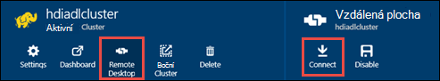

<properties
   pageTitle="Vytvoření clusterů HDInsight pomocí úložiště jezera dat Azure pomocí šablon správce prostředků | Microsoft Azure"
   description="Pomocí Správce prostředků Azure šablon můžete vytvořit a pomocí úložiště jezera dat Azure HDInsight clusterů"
   services="data-lake-store,hdinsight"
   documentationCenter=""
   authors="nitinme"
   manager="jhubbard"
   editor="cgronlun"/>

<tags
   ms.service="data-lake-store"
   ms.devlang="na"
   ms.topic="article"
   ms.tgt_pltfrm="na"
   ms.workload="big-data"
   ms.date="10/21/2016"
   ms.author="nitinme"/>

# <a name="create-an-hdinsight-cluster-with-data-lake-store-using-azure-resource-manager-template"></a>Vytvoření clusteru HDInsight s úložištěm jezera dat pomocí šablony správce prostředků Azure

> [AZURE.SELECTOR] - [Pomocí portálu](data-lake-store-hdinsight-hadoop-use-portal.md) - [pomocí prostředí PowerShell](data-lake-store-hdinsight-hadoop-use-powershell.md) - [Správce zdrojů](data-lake-store-hdinsight-hadoop-use-resource-manager-template.md)

Informace o použití šablony pro správce prostředků Azure ke konfiguraci s přístupem k úložiště jezera dat Azure HDInsight obrázku. Některé důležité důležité informace o této verzi:

-   **Pro Spark clusterů (Linux) a Hadoop/bouře clusterů (Windows a Linux)**, úložiště jezera dat lze použít pouze jako účet další úložiště. Výchozí účet úložiště u těchto clusterů budou nadále úložiště objektů BLOB Azure (WASB).

-   **Pro HBase clusterů (Windows a Linux)**, úložiště jezera dat lze použít jako výchozí úložiště nebo další úložiště.

> [AZURE.NOTE] Několik důležitých aspektů, je potřeba pamatovat.
>
> - Možnost vytvoření HDInsight clusterů s přístupem k úložišti jezera je dostupný jenom u verze HDInsight 3,2 a 3.4 (pro Hadoop HBase a bouře clusterů v systému Windows, jakož i Linux). Spark clusterů na Linux tato možnost je k dispozici pouze na clusterů HDInsight 3.4.
>
> - Výše uvedené, úložiště jezera dat neexistuje jako výchozí úložiště u některých typů obrázku (HBase) a další úložiště pro jiné typy obrázku (Hadoop, Spark, bouře). Použití úložiště jezera dat jako účet další úložiště nemají vliv na výkon nebo možnost pro čtení i zápis k základnímu úložišti z clusteru. V případě použití úložiště jezera dat jako dalšího úložiště soubory související s obrázku (například protokoly atd.) jsou došlo k zápisu výchozí úložiště (objektů BLOB Azure), zatímco data, která chcete zpracovat mohou být uloženy v úložišti jezera účtu.
>

V tomto článku jsme zřízení Hadoop obrázku s úložiště jezera dat jako dalšího úložiště.

## <a name="prerequisites"></a>Zjistit předpoklady pro

Před zahájením tohoto kurzu, musíte mít takto:

-   **Azure předplatného**. Viz [získání Azure bezplatnou zkušební verzi](https://azure.microsoft.com/pricing/free-trial/).

-   **Azure PowerShell 1.0 nebo vyšší**. Přečtěte si, [Jak nainstalovat a nakonfigurovat Azure Powershellu](../powershell-install-configure.md).

- **Azure jistinu služby Active Directory**. Kroky v tomto kurzu obsahují pokyny k vytváření hlavní název služby Azure AD. Ale musíte být správcem Azure AD mohli vytvořit hlavní název služby. Pokud jste správcem Azure AD, můžete přeskočit tento předpoklad a pokračovat v kurzu.
    
    **Pokud jste správcem není Azure AD**, nebude moct proveďte kroky potřebné k vytvoření hlavní název služby. V takovém případě správce Azure AD nejdřív vytvořte hlavní název služby před vytvořením HDInsight obrázku s úložištěm jezera Data. Navíc jistinu služby musí být vytvořen pomocí certifikátu, jak je uvedeno na stránce [vytvořit služby základní pomocí certifikátu](../resource-group-authenticate-service-principal.md#create-service-principal-with-certificate).

## <a name="create-an-hdinsight-cluster-with-azure-data-lake-store"></a>Vytvoření clusteru HDInsight s úložiště jezera dat Azure

Správce prostředků šablony a požadavcích na pomocí šablony, jsou dostupné na GitHub na [Deploy HDInsight Linux obrázku s nové prodejny jezera Data](https://github.com/Azure/azure-quickstart-templates/tree/master/201-hdinsight-datalake-store-azure-storage). Postupujte podle pokynů na tento odkaz k vytvoření clusteru HDInsight s úložiště jezera dat Azure jako další úložiště.

Postupujte podle pokynů v odkaz zmíněnou vyžadují Powershellu. Než začnete s těmito pokyny, zkontrolujte, že jste přihlášení k účtu Azure. V Excelu otevřete nové okno Azure PowerShell a zadejte následující zlomky. Po zobrazení výzvy k přihlášení, zkontrolujte, jestli že se přihlaste se jako jednu z admininistrators/vlastník předplatného:

```
# Log in to your Azure account
Login-AzureRmAccount

# List all the subscriptions associated to your account
Get-AzureRmSubscription

# Select a subscription
Set-AzureRmContext -SubscriptionId <subscription ID>
```

## <a name="upload-sample-data-to-the-azure-data-lake-store"></a>Nahrání ukázková data do úložiště jezera dat Azure

Šablona správce vytvoří nový účet úložiště jezera dat a přidruží clusteru HDInsight. Ukázková data musí teď nahrajte do úložiště jezera. Musíte se tato data dál v tomto kurzu ke spuštění úlohy z HDInsight obrázku, který přístupu k datům v úložišti jezera. Pokyny o tom, jak nahrát dat najdete v tématu [nahrání souboru do vašeho úložiště jezera](data-lake-store-get-started-portal.md#uploaddata). Pokud hledáte ukázkových dat chcete odeslat, můžete získat složce **Ambulance dat** z [Azure dat jezera libovolná úložiště](https://github.com/Azure/usql/tree/master/Examples/Samples/Data/AmbulanceData).

## <a name="set-relevant-acls-on-the-sample-data"></a>Nastavení relevantní ACL vzorová data

Abyste měli jistotu, že je blokům clusteru HDInsight ukázkových dat, které jste nahráli, musíte zajistit, aby aplikace Azure AD používanou stanovit identity mezi HDInsight obrázku a jezera úložišti má přístup k souboru nebo složce, který se pokoušíte otevřít. K tomuto účelu proveďte následující kroky.

1.  Jak najdu název Azure AD aplikace, která je přidružená k HDInsight obrázku a jezera úložišti. Jedním ze způsobů vyhledejte název je otevřít zásuvné HDInsight obrázku, kterou jste vytvořili pomocí šablony správce prostředků, klikněte na kartu **Clusteru AAD identit** a hledat hodnotu **Hlavní zobrazovaný název služby**.

2.  Teď umožňují přístup k této aplikaci Azure AD v souboru nebo složce, který chcete získat přístup z clusteru HDInsight. Pokud chcete nastavit správné ACL na soubor nebo složka v úložišti jezera dat, najdete v článku [zabezpečení dat v úložišti jezera](data-lake-store-secure-data.md#assign-users-or-security-group-as-acls-to-the-azure-data-lake-store-file-system).

## <a name="run-test-jobs-on-the-hdinsight-cluster-to-use-the-data-lake-store"></a>Spusťte testovací úlohy clusteru HDInsight používat jezera úložiště dat

Po konfiguraci clusteru HDInsight spuštěním testovací úlohy clusteru otestovat clusteru HDInsight přístup k úložišti jezera. Postup jsme se spustí úlohy podregistru vzorku, která vytvoří tabulku pomocí ukázkových dat, která jste nahráli dříve vašeho úložiště jezera.

### <a name="for-a-linux-cluster"></a>Pro Linux obrázku

V této části se dozvíte, jak SSH do obrázku a spustit ukázkový podregistru dotaz. Windows neposkytuje předdefinované SSH klienta. Doporučujeme používat **nátěrové**, které si můžete stáhnout z [http://www.chiark.greenend.org.uk/~sgtatham/putty/download.html](http://www.chiark.greenend.org.uk/~sgtatham/putty/download.html).

Další informace o použití nátěrové najdete v tématu [Použití SSH s Hadoop Linux založen na HDInsight z Windows ](../hdinsight/hdinsight-hadoop-linux-use-ssh-windows.md).

1.  Po připojení, začněte tím, že pomocí následujícího příkazu podregistru rozhraní příkazového řádku:

    ```
    hive
    ```

2.  Pomocí rozhraní příkazového řádku zadejte následující příkazy k vytvoření nové tabulky s názvem **vozidla** pomocí ukázková data v úložišti jezera dat:

    ```
    DROP TABLE vehicles;
    CREATE EXTERNAL TABLE vehicles (str string) LOCATION 'adl://<mydatalakestore>.azuredatalakestore.net:443/';
    SELECT * FROM vehicles LIMIT 10;
    ```

    Měli byste vidět výstup podobná této:

    ```
    1,1,2014-09-14 00:00:03,46.81006,-92.08174,51,S,1
    1,2,2014-09-14 00:00:06,46.81006,-92.08174,13,NE,1
    1,3,2014-09-14 00:00:09,46.81006,-92.08174,48,NE,1
    1,4,2014-09-14 00:00:12,46.81006,-92.08174,30,W,1
    1,5,2014-09-14 00:00:15,46.81006,-92.08174,47,S,1
    1,6,2014-09-14 00:00:18,46.81006,-92.08174,9,S,1
    1,7,2014-09-14 00:00:21,46.81006,-92.08174,53,N,1
    1,8,2014-09-14 00:00:24,46.81006,-92.08174,63,SW,1
    1,9,2014-09-14 00:00:27,46.81006,-92.08174,4,NE,1
    1,10,2014-09-14 00:00:30,46.81006,-92.08174,31,N,1
    ```

### <a name="for-a-windows-cluster"></a>Pro clusteru systému Windows

Pomocí těchto rutin spusťte dotaz podregistru. V tomto dotazu můžeme vytvořit tabulku z dat v úložišti jezera dat a potom spustit výběrový dotaz na vytvořenou tabulku.

```
$queryString = "DROP TABLE vehicles;" + "CREATE EXTERNAL TABLE vehicles (str string) LOCATION 'adl://$dataLakeStoreName.azuredatalakestore.net:443/';" + "SELECT * FROM vehicles LIMIT 10;"

$hiveJobDefinition = New-AzureRmHDInsightHiveJobDefinition -Query $queryString

$hiveJob = Start-AzureRmHDInsightJob -ResourceGroupName $resourceGroupName -ClusterName $clusterName -JobDefinition $hiveJobDefinition -ClusterCredential $httpCredentials

Wait-AzureRmHDInsightJob -ResourceGroupName $resourceGroupName -ClusterName $clusterName -JobId $hiveJob.JobId -ClusterCredential $httpCredentials
```

Bude to mít následující výstup. **ExitValue** 0 do výstupu o tom, že úloha byla úspěšně dokončena.

```
Cluster         : hdiadlcluster.
HttpEndpoint    : hdiadlcluster.azurehdinsight.net
State           : SUCCEEDED
JobId           : job_1445386885331_0012
ParentId        :
PercentComplete :
ExitValue       : 0
User            : admin
Callback        :
Completed       : done
```

Načíst výstup z úlohy pomocí následující rutinu:

```
Get-AzureRmHDInsightJobOutput -ClusterName $clusterName -JobId $hiveJob.JobId -DefaultContainer $containerName -DefaultStorageAccountName $storageAccountName -DefaultStorageAccountKey $storageAccountKey -ClusterCredential $httpCredentials
```

Výstup projektu vypadá takto:

```
1,1,2014-09-14 00:00:03,46.81006,-92.08174,51,S,1
1,2,2014-09-14 00:00:06,46.81006,-92.08174,13,NE,1
1,3,2014-09-14 00:00:09,46.81006,-92.08174,48,NE,1
1,4,2014-09-14 00:00:12,46.81006,-92.08174,30,W,1
1,5,2014-09-14 00:00:15,46.81006,-92.08174,47,S,1
1,6,2014-09-14 00:00:18,46.81006,-92.08174,9,S,1
1,7,2014-09-14 00:00:21,46.81006,-92.08174,53,N,1
1,8,2014-09-14 00:00:24,46.81006,-92.08174,63,SW,1
1,9,2014-09-14 00:00:27,46.81006,-92.08174,4,NE,1
1,10,2014-09-14 00:00:30,46.81006,-92.08174,31,N,1
```

## <a name="access-data-lake-store-using-hdfs-commands"></a>Pomocí příkazů HDFS úložiště jezera dat aplikace Access

Po konfiguraci clusteru HDInsight používat úložiště jezera dat, můžete příkazy HDFS prostředí pro přístup k úložišti.

### <a name="for-a-linux-cluster"></a>Pro Linux obrázku

V tomto oddílu, který bude SSH do clusteru a spusťte HDFS příkazy. Windows neposkytuje předdefinované SSH klienta. Doporučujeme používat **nátěrové**, které si můžete stáhnout z [http://www.chiark.greenend.org.uk/~sgtatham/putty/download.html](http://www.chiark.greenend.org.uk/~sgtatham/putty/download.html).

Další informace o použití nátěrové najdete v tématu [Použití SSH s Hadoop Linux založené na HDInsight z Windows ](../hdinsight/hdinsight-hadoop-linux-use-ssh-windows.md).

Po připojení seznamu souborů v úložišti jezera dat pomocí následujícího příkazu systému souborů HDFS.

```
hdfs dfs -ls adl://<Data Lake Store account name>.azuredatalakestore.net:443/
```

To uvádět soubor, který jste nahráli dříve jezera úložišti.

```
15/09/17 21:41:15 INFO web.CaboWebHdfsFileSystem: Replacing original urlConnectionFactory with org.apache.hadoop.hdfs.web.URLConnectionFactory@21a728d6
Found 1 items
-rwxrwxrwx   0 NotSupportYet NotSupportYet     671388 2015-09-16 22:16 adl://mydatalakestore.azuredatalakestore.net:443/mynewfolder
```

Můžete taky použít `hdfs dfs -put` příkaz nahrát některé soubory k úložišti jezera dat a potom pomocí `hdfs dfs -ls` k ověření, zda soubory, které byly úspěšně nahrál(a) na server.

### <a name="for-a-windows-cluster"></a>Pro clusteru systému Windows

1.  Přihlaste se na novém [Portálu Azure](https://portal.azure.com).

2.  Klikněte na tlačítko **Procházet**, klikněte na **HDInsight clusterů**a klikněte HDInsight obrázku, který jste vytvořili.

3.  V zásuvné clusteru klikněte **Vzdálená plocha**a pak v zásuvné **Vzdálené plochy** , klikněte na **Připojit**.

    

    Po zobrazení výzvy zadejte přihlašovací údaje, které jste uvedli pro vzdálené plochy uživatele.

4.  V vzdálenou relaci spusťte Windows PowerShell a taky pomocí příkazů systému souborů HDFS seznam souborů v úložišti jezera dat Azure.

    ```
    hdfs dfs -ls adl://<Data Lake Store account name>.azuredatalakestore.net:443/
    ```

    To uvádět soubor, který jste nahráli dříve jezera úložišti.

    ```
    15/09/17 21:41:15 INFO web.CaboWebHdfsFileSystem: Replacing original urlConnectionFactory with org.apache.hadoop.hdfs.web.URLConnectionFactory@21a728d6
    Found 1 items
    -rwxrwxrwx   0 NotSupportYet NotSupportYet     671388 2015-09-16 22:16 adl://mydatalakestore.azuredatalakestore.net:443/vehicle1_09142014.csv
    ```

    Můžete taky použít `hdfs dfs -put` příkaz nahrát některé soubory k úložišti jezera dat a potom pomocí `hdfs dfs -ls` k ověření, zda soubory, které byly úspěšně nahrál(a) na server.

## <a name="next-steps"></a>Další kroky

-   [Kopírování dat z Azure úložiště objektů BLOB jezera úložiště dat](data-lake-store-copy-data-wasb-distcp.md)
