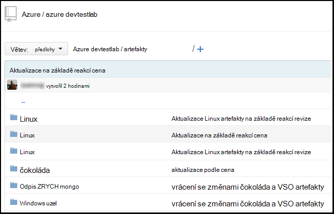
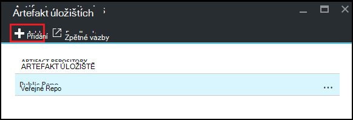
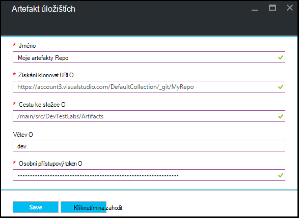

<properties
    pageTitle="Přidání úložiště artefakt libovolná k laboratorní v Azure DevTest Labs | Microsoft Azure"
    description="Přidání GitHub nebo Visual Studio týmu služeb libovolná úložiště pro zdroj vlastní artefakty v Azure DevTest Labs"
    services="devtest-lab,virtual-machines,visual-studio-online"
    documentationCenter="na"
    authors="tomarcher"
    manager="douge"
    editor=""/>

<tags
    ms.service="devtest-lab"
    ms.workload="na"
    ms.tgt_pltfrm="na"
    ms.devlang="na"
    ms.topic="article"
    ms.date="09/06/2016"
    ms.author="tarcher"/>

# Přidání úložiště artefakt libovolná k laboratorní v Azure DevTest Labs

> [AZURE.VIDEO how-to-add-your-private-artifacts-repository-in-a-devtest-lab]

Azure DevTest Labs artefakty způsoby *Akce* – například instalaci softwaru nebo pracovního skripty a příkazy – vytvoření virtuálního počítače. Ve výchozím nastavení obsahuje laboratoři artefakty v úložišti oficiální artefakt Azure DevTest Labs. Přidání úložiště artefakt libovolná k vaší laboratoři zahrnout artefakty, které vytvoří týmu. Úložiště mohou umístěny na [GitHub](https://github.com) nebo [Visual Studio týmu služeb (VSTS)](https://visualstudio.com).

- Naučte se vytvářet úložišti GitHub, najdete v článku [GitHub Bootcamp](https://help.github.com/categories/bootcamp/).
- Informace o vytvoření týmovou projektu s libovolná úložiště, najdete v článku [připojení k Visual Studio týmovou](https://www.visualstudio.com/get-started/setup/connect-to-visual-studio-online).

Následující snímek obrazovky znázorňuje příklad může vzhled úložišti obsahující artefakty ve GitHub:  

## Získat informace o úložiště a přihlašovací údaje

Pokud chcete přidat jako artefakt úložiště vaší laboratoři, musíte nejprve získat určité informace z úložiště. V následujících částech vás provede zobrazuje tyto informace o artefakt úložištích hostitelem GitHub a Visual Studio týmovou.

### Získat adresu URL klonovat GitHub úložiště a osobní přístup tokenu

Získat klonovat úložiště GitHub adresy URL a osobní přístupový token, postupujte takto:

1. Přejděte na domovskou stránku úložiště GitHub, která obsahuje definice artefakt.

1. Vyberte **klonovat nebo stáhnout**.

1. Klikněte na tlačítko Kopírovat **HTTPS klonovat adresu url** do schránky a adresu URL pro pozdější použití uložit.

1. Vyberte obrázek profilu v pravém horním rohu GitHub a vyberte **Nastavení**.

1. V nabídce **osobní nastavení** na levé straně vyberte **tokeny osobní přístupu**.

1. Vyberte **Nový token generovat**.

1. Na stránce **nové osobní přístupový token** zadejte **Popis Token**, přijměte výchozí položky v seznamu **Vyberte oborů**a pak zvolte **Generovat tokenu**.

1. Uložte generovaný token jako později potřebovat.

1. Teď můžete zavřít GitHub.   

1. Přejděte k části [připojení vaší laboratoři artefakt úložiště](#connect-your-lab-to-the-artifact-repository) .

### Získání URL klonovat úložiště Visual Studio týmovou a osobní přístup tokenu

Získat adresu URL klonovat Visual Studio týmovou úložiště a osobní přístupový token, postupujte takto:

1. Otevřete domovskou stránku kolekce webů týmu (například `https://contoso-web-team.visualstudio.com`) a potom vyberte artefakt projekt.

1. Na domovské stránce project vyberte **kód**.

1. Pokud chcete zobrazit adresu URL klonovat na stránce **kód** projektu, vyberte **klonovat**.

1. Uložte adresa URL je potřeba dál v tomto kurzu.

1. Pokud chcete vytvořit osobní tokenu přístup, vyberte **Můj profil** z rozevírací nabídky uživatelského účtu.

1. Na stránce informace o profilu vyberte **zabezpečení**.

1. Na kartě **zabezpečení** klikněte na **Přidat**.

1. Na stránce **Vytvořit osobní přístupový token** :

    - Zadejte **Popis** tokenu.
    - **Vyprší jejich platnost v** seznamu vyberte **180 dnů** .
    - Ze seznamu **účty** vyberte **všechny účty přístupných osobám s postižením** .
    - Vyberte možnost **všechny obory** .
    - Zvolte **vytvořit tokenu**.

1. Jakmile budete mít Hotovo, nové token se zobrazí v seznamu **Osobní tokeny přístupu** . Vyberte **Kopírovat tokenu**a uložte tokenu hodnotu pro pozdější použití.

1. Přejděte k části [připojení vaší laboratoři artefakt úložiště](#connect-your-lab-to-the-artifact-repository) .

##Připojení k úložišti artefakt vaší laboratoři

1. Přihlaste se k [portálu Azure](http://go.microsoft.com/fwlink/p/?LinkID=525040).

1. Vyberte **Další služby**a pak vyberte **DevTest Labs** ze seznamu.

1. V seznamu labs vyberte požadované testovacím prostředí.   

1. Na zásuvné laboratoři vyberte **konfiguraci**.

1. Na zásuvné **Konfigurace** laboratoři vyberte **Artefakty úložištích**.

1. Na zásuvné **Artefakty úložištích** vyberte **+ Přidat**.

    
 
1. Na druhém zásuvné **Artefakty úložištích** zadejte následující údaje:

    - **Název** : Zadejte název úložiště.
    - **Adresa Url klonovat libovolná** – zadejte adresu URL klonovat libovolná HTTPS, kterou jste si zkopírovali z GitHub nebo Visual Studio týmovou. 
    - **Cestu ke složce** – zadejte cestu ke složce relativní klonovat URL, která obsahuje artefakt definice.
    - **Větev** – zadejte větvi získat artefakt definice.
    - **Osobní přístup tokenu** – zadejte osobní přístupový token dříve získané GitHub nebo Visual Studio Team Services. 
     
    

1. Vyberte **Uložit**.

[AZURE.INCLUDE [devtest-lab-try-it-out](../../includes/devtest-lab-try-it-out.md)]

## Související příspěvky
- [Jak řešit problémy s nefunkční artefakty v AzureDevTestLabs](http://www.visualstudiogeeks.com/blog/DevOps/How-to-troubleshoot-failing-artifacts-in-AzureDevTestLabs)
- [Připojte virtuálního počítače do existující AD domény pomocí šablony ARM v Azure odchylka laboratorní](http://www.visualstudiogeeks.com/blog/DevOps/Join-a-VM-to-existing-AD-domain-using-ARM-template-AzureDevTestLabs)