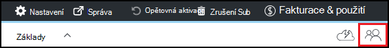

<properties
    pageTitle="Přidání vlastníci a uživatelů v Azure DevTest Labs | Microsoft Azure"
    description="Přidání vlastníci a uživatelů do Labs DevTest Azure pomocí Azure portál nebo prostředí PowerShell"
    services="devtest-lab,virtual-machines"
    documentationCenter="na"
    authors="tomarcher"
    manager="douge"
    editor=""/>

<tags
    ms.service="devtest-lab"
    ms.workload="na"
    ms.tgt_pltfrm="na"
    ms.devlang="na"
    ms.topic="article"
    ms.date="09/12/2016"
    ms.author="tarcher"/>

# Přidání vlastníci a uživatelů do Azure DevTest Labs

> [AZURE.VIDEO how-to-set-security-in-your-devtest-lab]

Access v Azure DevTest Labs řízené pomocí [Řízení přístupu Azure Role-Based (RBAC)](../active-directory/role-based-access-control-what-is.md). Použití RBAC, můžete oddělit úkolů v rámci týmu do *role* kde udělit jenom množství přístupu potřebné k uživatelům provádět své práce. Tři z těchto rolích RBAC jsou *vlastníka*, *DevTest Labs uživatele*a *skupiny přispěvatelů*. V tomto článku se dozvíte, jaké akce můžete provádět v každé ze tří hlavních RBAC rolí. V ní se naučíte, jak přidávat uživatele k laboratorní - prostřednictvím portálu i prostřednictvím skriptu prostředí PowerShell a jak přidávat uživatele na úrovni předplatného.

## Akce, které lze provádět v jednotlivých rolích

Existují tři hlavní role, že se uživateli udělit:

- Vlastník
- DevTest Labs uživatele
- Skupiny přispěvatelů

Následující tabulka popisuje akce, které lze vykonat uživatelů v jednotlivých rolích:

| **Akce, které uživatelé tato role může provádět** | **DevTest Labs uživatele**            | **Vlastník** | **Skupiny přispěvatelů** |
|---|---|---|---|
| **Laboratorní úkoly**                          |                              |       |             |
| Přidání uživatelů do laboratoři                     | Ne                           | Ano   | Ne          |
| Aktualizace nastavení náklady                   | Ne                           | Ano   | Ano         |
| **Základní úkoly OM**                      |                              |       |             |
| Přidání a odebrání vlastní obrázky           | Ne                           | Ano   | Ano         |
| Přidat, aktualizovat a odstraňovat vzorce       | Ano                          | Ano   | Ano         |
| Obrázky povolených Azure Marketplace     | Ne                           | Ano   | Ano         |
| **Úkoly OM**                           |                              |       |             |
| Vytvoření VMs                             | Ano                          | Ano   | Ano         |
| Spustit, zastavit a odstranění VMs            | Pouze VMs vytvořené uživatelem | Ano   | Ano         |
| Aktualizovat zásady OM                     | Ne                           | Ano   | Ano         |
| Přidat nebo odebrat disků data z VMs      | Pouze VMs vytvořené uživatelem | Ano   | Ano         |
| **Artefakt úkoly**                     |                              |       |             |
| Přidání a odebrání artefakt úložištích   | Ne                           | Ano   | Ano         |
| Použití artefakty                        | Ano                          | Ano   | Ano         |

> [AZURE.NOTE] Když uživatel vytvoří virtuálního počítače, tento uživatel automaticky získá roli **vlastníka** vytvořené OM.

## Přidání vlastník nebo uživatele na úrovni laboratoři

Vlastníci a uživatele můžete přidat na úrovni laboratorní prostřednictvím portálu Azure. Jedná se o externím uživatelům s platným [účtem Microsoft (MSA)](devtest-lab-faq.md#what-is-a-microsoft-account).
Procesem obrazovky pro přidání vlastník nebo uživatel laboratorní v Azure DevTest Labs vás provede následující kroky:

1. Přihlaste se k [portálu Azure](http://go.microsoft.com/fwlink/p/?LinkID=525040).

1. Vyberte **Další služby**a pak vyberte **DevTest Labs** ze seznamu.

1. V seznamu labs vyberte požadované testovacím prostředí.

1. Na zásuvné laboratoři vyberte **konfiguraci**. 

1. Na zásuvné **Konfigurace** vyberte **Uživatelé**.

1. Na zásuvné **uživatele** vyberte **+ Přidat**.

    

1. Na zásuvné **Vyberte roli,** vyberte požadovanou roli. V části [Akce, které lze provádět v jednotlivých rolích](#actions-that-can-be-performed-in-each-role) uvádí různé akce, které lze provádět uživatelé v vlastníka, DevTest uživatele a role přispěvatele.

1. Na zásuvné **Přidat uživatele** zadejte e-mailovou adresu nebo jméno uživatele, kterého chcete přidat v roli, kterou jste zadali. Pokud nemůžete najít uživatele, chybová zpráva vysvětluje problém. Pokud najít uživatele tímto uživatelem uvedené a vybrali. 

1. Vyberte možnost **Vybrat**.

1. Klikněte na **OK** zavřete zásuvné **Přidat přístup** .

1. Když se vrátíte na zásuvné **uživatelů** , byl uživatel přidaný.  

## Přidání externího uživatele k laboratorní pomocí prostředí PowerShell

Kromě přidání uživatelů do portálu Azure, můžete přidat externího uživatele k vaší laboratoři pomocí skriptů Powershellu. V následujícím příkladu jednoduše změňte hodnoty parametrů pod komentářem **hodnot a ty pak změnit** .
Můžete získat `subscriptionId`, `labResourceGroup`, a `labName` hodnoty z zásuvné laboratorní Azure portálu.

> [AZURE.NOTE]
> Ukázka skriptu předpokládá, že má zadaný uživatel byly případně přidané jako Host ke službě Active Directory a selže, pokud to není případ. Přidání uživatele ne ve službě Active Directory laboratoři, použijte portál Azure uživateli přiřadit roli, jak je ukázáno v části [přidat některé vlastníky nebo uživatele na úrovni laboratorní](#add-an-owner-or-user-at-the-lab-level).   

    # Add an external user in DevTest Labs user role to a lab
    # Ensure that guest users can be added to the Azure Active directory:
    # https://azure.microsoft.com/en-us/documentation/articles/active-directory-create-users/#set-guest-user-access-policies

    # Values to change
    $subscriptionId = "<Enter Azure subscription ID here>"
    $labResourceGroup = "<Enter lab's resource name here>"
    $labName = "<Enter lab name here>"
    $userDisplayName = "<Enter user's display name here>"

    # Log into your Azure account
    Login-AzureRmAccount
    
    # Select the Azure subscription that contains the lab. 
    # This step is optional if you have only one subscription.
    Select-AzureRmSubscription -SubscriptionId $subscriptionId
    
    # Retrieve the user object
    $adObject = Get-AzureRmADUser -SearchString $userDisplayName
    
    # Create the role assignment. 
    $labId = ('subscriptions/' + $subscriptionId + '/resourceGroups/' + $labResourceGroup + '/providers/Microsoft.DevTestLab/labs/' + $labName)
    New-AzureRmRoleAssignment -ObjectId $adObject.Id -RoleDefinitionName 'DevTest Labs User' -Scope $labId

## Přidání vlastník nebo uživatele na úrovni předplatného

Azure oprávnění se rozšíří z nadřazený oboru podřízené oboru v Azure. Vlastníci Azure předplatného, která obsahuje labs jsou proto automaticky vlastníci tyto labs. Vlastní taky VMs a dalších zdrojů vytvořené laboratoři uživatelů a služba Azure DevTest Labs. 

Laboratorní prostřednictvím laboratoři zásuvné [Azure portál](http://go.microsoft.com/fwlink/p/?LinkID=525040)můžete přiřadit další vlastníci. Obor přidané vlastníka správy je však úzký více než jeden obor vlastník předplatného. Například přidaný vlastníků nemusíte plný přístup k některé z vytvořené v předplatné prostřednictvím služby DevTest Labs zdrojů. 

Pokud chcete přidat některé vlastníky Azure předplatného, postupujte takto:

1. Přihlaste se k [portálu Azure](http://go.microsoft.com/fwlink/p/?LinkID=525040).

1. Vyberte **Další služby**a pak vyberte **předplatné** ze seznamu.

1. Vyberte požadované předplatné.

1. Vyberte ikonu **aplikace Access** . 

    

1. Na zásuvné **uživatelům** vyberte **Přidat**.

    

1. Na zásuvné **Vyberte roli,** vyberte **vlastníka**.

1. Na zásuvné **Přidat uživatele** zadejte e-mailovou adresu nebo jméno uživatele, kterého chcete přidat jako některé vlastníky. Pokud nemůžete najít uživatele, se zobrazí chybová zpráva s informací tento problém. Pokud je najít uživatele, tento uživatel uvedený v části textového pole **uživatelské** .

1. Vyberte umístěn uživatelské jméno.

1. Vyberte možnost **Vybrat**.

1. Klikněte na **OK** zavřete zásuvné **Přidat přístup** .

1. Když se vrátíte na zásuvné **uživatelů** , byl uživatel přidaný jako některé vlastníky. Tento uživatel je teď některé vlastníky všechny labs vytvořené v části toto předplatné a tedy moct provádět úlohy vlastník. 

[AZURE.INCLUDE [devtest-lab-try-it-out](../../includes/devtest-lab-try-it-out.md)]
